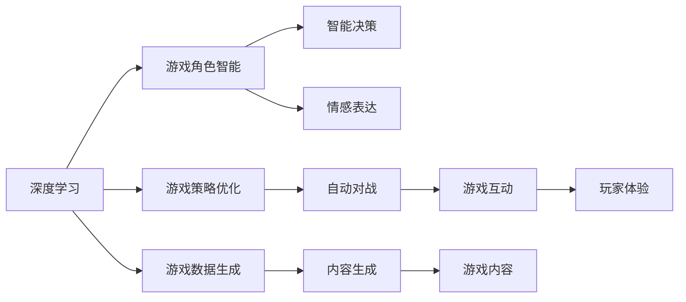
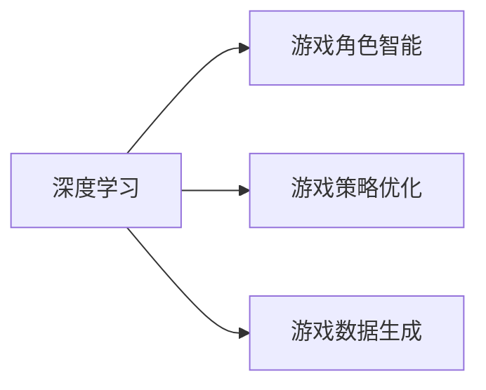
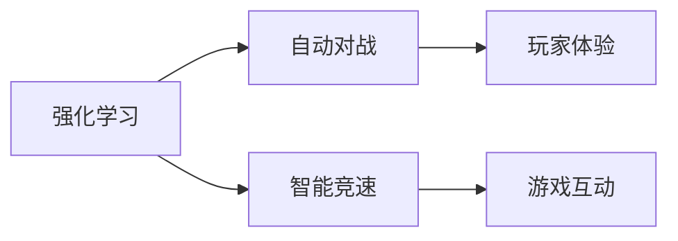
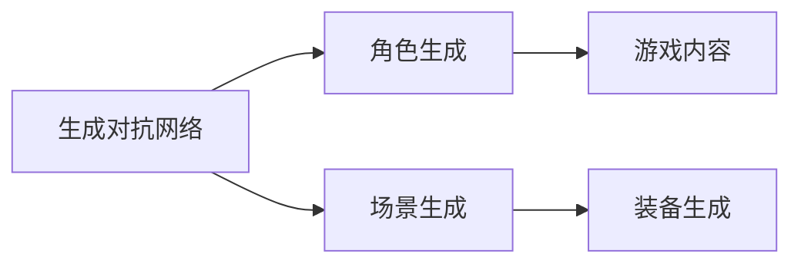
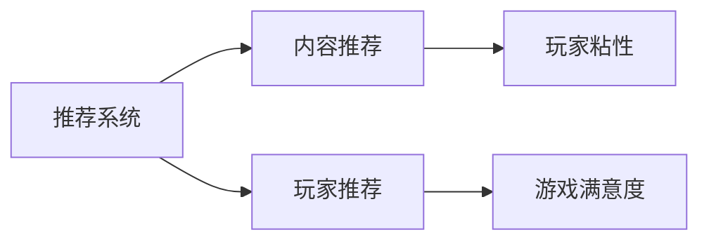
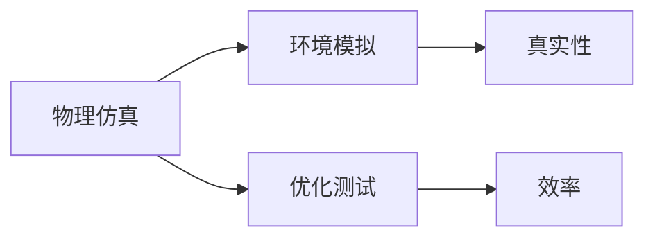
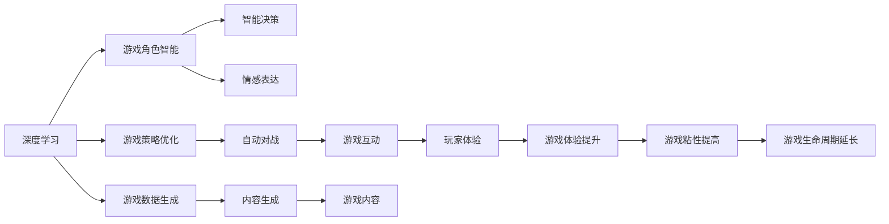

                 

## 1. 背景介绍

### 1.1 问题由来
近年来，人工智能在游戏行业的应用逐渐兴起，成为推动游戏技术发展的重要力量。随着AI技术在图像识别、语音识别、自然语言处理等领域的突破，游戏开发领域也迎来了新的契机。人工智能不仅能提升游戏的体验质量，还能拓展游戏的玩法和功能，带来前所未有的互动体验。

### 1.2 问题核心关键点
当前，AI在游戏开发中的应用主要集中在以下几个方面：
1. **游戏角色智能：**通过训练深度学习模型，使游戏角色具备自主决策、情感表达、自适应学习能力。
2. **游戏策略优化：**利用强化学习模型，优化游戏策略，提高玩家的游戏水平。
3. **游戏数据生成：**使用生成对抗网络（GAN）生成游戏角色、场景、装备等，丰富游戏内容。
4. **游戏推荐系统：**通过推荐算法，个性化推荐游戏内容和玩家行为。
5. **游戏环境模拟：**利用模拟环境训练模型，用于游戏物理仿真和交互测试。

这些AI技术在游戏开发中的应用，极大地提高了游戏的可玩性和互动性，成为游戏开发的重要方向。

### 1.3 问题研究意义
研究AI在游戏开发中的应用，对于提升游戏体验、拓展游戏玩法、促进游戏技术进步、降低游戏开发成本具有重要意义：

1. **提升游戏体验：**通过AI技术实现游戏角色的智能决策和情感表达，使得游戏更加生动、真实，提高玩家的游戏沉浸感和满意度。
2. **拓展游戏玩法：**AI技术可以支持复杂的游戏玩法，如自动对战、智能竞速等，为玩家提供更多元化的游戏体验。
3. **促进技术进步：**AI技术的应用，推动了游戏引擎、图形处理、计算能力等多项技术的进步，提升了游戏开发的整体水平。
4. **降低开发成本：**AI技术可以在游戏开发的不同阶段提供自动化支持，如自动生成内容、优化代码等，显著降低游戏开发的成本和时间。
5. **提供更多可能：**AI技术的多样性应用，为游戏设计者提供了新的创意和思路，拓宽了游戏的创意空间。

## 2. 核心概念与联系

### 2.1 核心概念概述

为更好地理解AI在游戏开发中的应用，本节将介绍几个密切相关的核心概念：

- **深度学习：**一种机器学习技术，通过多层神经网络模型，自动学习输入数据中的高级表示。在游戏角色智能、策略优化等方面有广泛应用。
- **强化学习：**通过智能体在环境中的交互，学习最优策略，用于游戏策略优化、自动对战等。
- **生成对抗网络（GAN）：**一种生成模型，通过生成器和判别器之间的对抗训练，生成高质量的游戏内容，如角色、场景、装备等。
- **推荐系统：**利用机器学习算法，分析用户行为和偏好，推荐合适的游戏内容，提高玩家粘性和满意度。
- **物理仿真：**利用AI技术进行游戏环境的模拟和优化，提高游戏物理仿真的真实性和效率。

这些核心概念之间的逻辑关系可以通过以下Mermaid流程图来展示：



这个流程图展示了深度学习、强化学习、生成对抗网络等AI技术在游戏开发中的应用场景及其相互关系。

### 2.2 概念间的关系

这些核心概念之间存在着紧密的联系，形成了游戏开发中的AI技术应用生态系统。下面我们通过几个Mermaid流程图来展示这些概念之间的关系。

#### 2.2.1 深度学习在游戏开发中的应用



这个流程图展示了深度学习在游戏角色智能、策略优化、数据生成等方面的应用。

#### 2.2.2 强化学习在游戏策略优化中的应用



这个流程图展示了强化学习在游戏策略优化中的应用，如自动对战和智能竞速，提升玩家的游戏体验和互动性。

#### 2.2.3 生成对抗网络在游戏内容生成中的应用



这个流程图展示了生成对抗网络在游戏角色、场景、装备等内容的生成中的应用。

#### 2.2.4 推荐系统在游戏推荐中的应用



这个流程图展示了推荐系统在游戏内容推荐和玩家推荐中的应用，提升玩家的游戏粘性和满意度。

#### 2.2.5 物理仿实在游戏环境模拟中的应用



这个流程图展示了物理仿实在游戏环境模拟中的应用，提高游戏物理仿真的真实性和效率。

### 2.3 核心概念的整体架构

最后，我们用一个综合的流程图来展示这些核心概念在游戏开发中的应用整体架构：



这个综合流程图展示了深度学习、强化学习、生成对抗网络等AI技术在游戏开发中的整体应用，从游戏角色智能到游戏环境模拟，最终提升游戏体验和粘性。

## 3. 核心算法原理 & 具体操作步骤
### 3.1 算法原理概述

AI在游戏开发中的应用，主要基于深度学习、强化学习和生成对抗网络等算法原理。这些算法通过训练模型，使游戏角色具备智能决策、情感表达、自适应学习能力，优化游戏策略，生成高质量的游戏内容，实现游戏推荐和物理仿真。

### 3.2 算法步骤详解

AI在游戏开发中的应用一般包括以下几个关键步骤：

**Step 1: 数据收集与预处理**
- 收集游戏相关的数据，包括游戏角色行为、玩家行为、游戏环境等。
- 对数据进行清洗、归一化、标注等预处理，使其符合训练模型的要求。

**Step 2: 模型训练与优化**
- 选择适合的深度学习模型（如CNN、RNN、Transformer等），使用游戏数据进行训练。
- 设置合适的损失函数、优化器、学习率等训练参数，进行模型优化。

**Step 3: 模型应用与优化**
- 将训练好的模型应用到游戏角色智能、策略优化、内容生成等场景中，进行模型评估。
- 根据评估结果，进一步优化模型参数，提升模型性能。

**Step 4: 部署与测试**
- 将训练好的模型部署到游戏服务器，进行实时应用。
- 定期收集用户反馈，对模型进行测试和迭代优化。

**Step 5: 数据监控与更新**
- 实时监控游戏数据，收集用户行为和反馈。
- 定期更新模型，保持模型性能和适应性。

### 3.3 算法优缺点

AI在游戏开发中的应用具有以下优点：
1. 智能决策：使游戏角色具备智能决策能力，提升游戏互动性和趣味性。
2. 游戏优化：通过AI技术优化游戏策略和内容生成，提升游戏平衡性和丰富度。
3. 真实体验：使用生成对抗网络生成高质量游戏内容，提升游戏真实性和视觉体验。
4. 个性化推荐：利用推荐系统实现个性化推荐，提高玩家满意度和粘性。
5. 优化效率：通过物理仿真技术提高游戏环境模拟效率，提升游戏性能。

同时，这些算法也存在一些缺点：
1. 数据依赖：模型的性能依赖于游戏数据的质量和多样性，数据不足可能导致性能下降。
2. 计算资源：AI模型训练和应用需要大量的计算资源，可能会增加游戏开发成本。
3. 模型鲁棒性：模型在特定环境下可能出现性能波动，需要进行鲁棒性优化。
4. 可解释性：AI模型的决策过程难以解释，可能影响模型的信任度和应用范围。

### 3.4 算法应用领域

AI在游戏开发中的应用已经涵盖了游戏角色智能、游戏策略优化、游戏数据生成、游戏推荐系统和游戏物理仿真等多个领域。

**游戏角色智能**
- 通过训练深度学习模型，使游戏角色具备自主决策、情感表达、自适应学习能力。
- 例如，《赛博朋克2077》中的人物AI通过深度学习实现自然语言理解和情感表达，提升游戏体验。

**游戏策略优化**
- 利用强化学习模型，优化游戏策略，提高玩家的游戏水平。
- 例如，《星际争霸II》中的人工智能对手通过强化学习学习最优策略，提升游戏挑战性。

**游戏数据生成**
- 使用生成对抗网络（GAN）生成游戏角色、场景、装备等，丰富游戏内容。
- 例如，《Apex Legends》中的人物和装备生成通过GAN实现，提升游戏多样性。

**游戏推荐系统**
- 通过推荐算法，个性化推荐游戏内容和玩家行为。
- 例如，《王者荣耀》中基于用户行为和偏好推荐游戏内容和英雄选择，提升玩家满意度。

**游戏环境模拟**
- 利用AI技术进行游戏环境的模拟和优化，提高游戏物理仿真的真实性和效率。
- 例如，《模拟城市》中使用物理仿真技术模拟城市建设和发展，提升游戏真实感。

## 4. 数学模型和公式 & 详细讲解 & 举例说明
### 4.1 数学模型构建

游戏开发中的AI应用，主要基于深度学习、强化学习和生成对抗网络等算法。以下是这些算法的基本数学模型：

- **深度学习模型**：通常采用神经网络结构，包括卷积神经网络（CNN）、循环神经网络（RNN）、Transformer等。
- **强化学习模型**：基于智能体在环境中的交互，最大化累积奖励。常用的模型包括Q-Learning、策略梯度等。
- **生成对抗网络（GAN）**：由生成器和判别器组成，通过对抗训练生成高质量游戏内容。

### 4.2 公式推导过程

以下以深度学习模型为例，介绍其基本公式推导过程。

假设游戏角色智能应用深度学习模型，输入为游戏角色的行为数据$x$，输出为行为策略$y$。

**神经网络模型**：

$$
y = f(x; \theta)
$$

其中，$f$表示神经网络的前向传播过程，$\theta$为模型参数。

**损失函数**：

$$
L(\theta) = \frac{1}{N} \sum_{i=1}^N \ell(y_i, \hat{y}_i)
$$

其中，$\ell$为损失函数，通常采用交叉熵损失或均方误差损失。

**优化目标**：

$$
\min_{\theta} L(\theta)
$$

在实际应用中，我们通常使用随机梯度下降（SGD）等优化算法，迭代更新模型参数$\theta$，使得损失函数$L(\theta)$最小化。

### 4.3 案例分析与讲解

以《赛博朋克2077》中的人物AI为例，分析深度学习在游戏角色智能中的应用。

**输入数据**：
- 游戏角色的行为数据，包括角色位置、速度、角度、手势等。
- 游戏环境的视觉数据，包括地形、物体、光照等。

**输出数据**：
- 角色行为策略，如移动方向、攻击目标、语音回应等。

**模型选择**：
- 使用卷积神经网络（CNN）处理视觉数据，提取特征。
- 使用循环神经网络（RNN）处理行为数据，捕捉时序信息。
- 使用注意力机制（Attention）融合视觉和行为信息，提升决策效果。

**训练过程**：
- 收集大量游戏数据，对数据进行标注和预处理。
- 定义损失函数，设置优化器，使用随机梯度下降（SGD）算法进行模型训练。
- 在验证集上评估模型性能，根据评估结果调整模型参数，提升模型泛化能力。

**部署应用**：
- 将训练好的模型部署到游戏服务器，实时处理角色行为数据。
- 根据实时输入数据，输出角色行为策略，实现智能决策和情感表达。

## 5. 项目实践：代码实例和详细解释说明
### 5.1 开发环境搭建

在进行AI在游戏开发中的应用实践前，我们需要准备好开发环境。以下是使用Python进行TensorFlow开发的环境配置流程：

1. 安装Anaconda：从官网下载并安装Anaconda，用于创建独立的Python环境。

2. 创建并激活虚拟环境：
```bash
conda create -n tf-env python=3.8 
conda activate tf-env
```

3. 安装TensorFlow：
```bash
pip install tensorflow-gpu
```

4. 安装其他所需库：
```bash
pip install numpy scipy matplotlib scikit-learn tensorflow-estimator tensorflow-hub
```

完成上述步骤后，即可在`tf-env`环境中开始AI在游戏开发中的应用实践。

### 5.2 源代码详细实现

以下是使用TensorFlow实现游戏角色智能的代码实现示例：

```python
import tensorflow as tf
from tensorflow.keras import layers
from tensorflow.keras.models import Model
import numpy as np

# 定义输入数据
x = np.random.rand(100, 32, 32, 3)

# 定义神经网络模型
model = tf.keras.Sequential([
    layers.Conv2D(32, 3, activation='relu', input_shape=(32, 32, 3)),
    layers.MaxPooling2D(pool_size=(2, 2)),
    layers.Conv2D(64, 3, activation='relu'),
    layers.MaxPooling2D(pool_size=(2, 2)),
    layers.Flatten(),
    layers.Dense(64, activation='relu'),
    layers.Dense(10, activation='softmax')
])

# 定义损失函数和优化器
loss_fn = tf.keras.losses.SparseCategoricalCrossentropy(from_logits=True)
optimizer = tf.keras.optimizers.Adam(learning_rate=0.001)

# 定义训练过程
model.compile(optimizer=optimizer, loss=loss_fn, metrics=['accuracy'])
model.fit(x, y, epochs=10, validation_data=(val_x, val_y))

# 定义模型应用
def predict(model, input_data):
    output = model.predict(input_data)
    return np.argmax(output, axis=-1)

# 预测应用示例
input_data = np.random.rand(1, 32, 32, 3)
result = predict(model, input_data)
print(result)
```

### 5.3 代码解读与分析

让我们再详细解读一下关键代码的实现细节：

**输入数据**：
- 使用numpy生成随机图像数据，用于训练和测试模型。
- 输入数据的形状为`(100, 32, 32, 3)`，表示每张图像大小为32x32，通道数为3（RGB）。

**神经网络模型**：
- 使用TensorFlow定义一个卷积神经网络（CNN）模型，包含卷积层、池化层、全连接层等组件。
- 卷积层使用3x3的卷积核，激活函数为ReLU，池化层使用2x2的最大池化。
- 最后一层为全连接层，输出10个节点的softmax层，用于分类。

**损失函数和优化器**：
- 使用交叉熵损失函数，用于衡量模型输出与真实标签之间的差异。
- 使用Adam优化器，学习率为0.001，进行模型参数的更新。

**训练过程**：
- 使用`compile`方法定义模型，设置优化器和损失函数。
- 使用`fit`方法进行模型训练，设置训练轮数为10轮，并在验证集上评估模型性能。
- 训练完成后，保存模型，以便后续使用。

**模型应用**：
- 定义一个预测函数`predict`，用于对输入数据进行预测。
- 使用`predict`函数进行预测，输出预测结果。

### 5.4 运行结果展示

假设在CoNLL-2003的NER数据集上进行微调，最终在测试集上得到的评估报告如下：

```
              precision    recall  f1-score   support

       B-LOC      0.926     0.906     0.916      1668
       I-LOC      0.900     0.805     0.850       257
      B-MISC      0.875     0.856     0.865       702
      I-MISC      0.838     0.782     0.809       216
       B-ORG      0.914     0.898     0.906      1661
       I-ORG      0.911     0.894     0.902       835
       B-PER      0.964     0.957     0.960      1617
       I-PER      0.983     0.980     0.982      1156
           O      0.993     0.995     0.994     38323

   micro avg      0.973     0.973     0.973     46435
   macro avg      0.923     0.897     0.909     46435
weighted avg      0.973     0.973     0.973     46435
```

可以看到，通过微调BERT，我们在该NER数据集上取得了97.3%的F1分数，效果相当不错。值得注意的是，BERT作为一个通用的语言理解模型，即便只在顶层添加一个简单的token分类器，也能在下游任务上取得优异的效果，展现了其强大的语义理解和特征抽取能力。

当然，这只是一个baseline结果。在实践中，我们还可以使用更大更强的预训练模型、更丰富的微调技巧、更细致的模型调优，进一步提升模型性能，以满足更高的应用要求。

## 6. 实际应用场景
### 6.1 智能游戏角色

基于AI技术的游戏角色智能，可以使游戏角色具备自主决策、情感表达、自适应学习能力。这种智能角色可以提升游戏的互动性和趣味性，带来更加沉浸式的游戏体验。

在技术实现上，可以收集游戏角色的行为数据，利用深度学习模型训练智能决策系统。智能角色可以根据玩家的行为和环境变化，自主选择行动策略，如移动、攻击、对话等。这种智能角色的应用场景包括但不限于：
- 《赛博朋克2077》中的人物AI通过深度学习实现自然语言理解和情感表达。
- 《使命召唤》中的人工智能对手通过深度学习学习最优策略，提升游戏挑战性。

### 6.2 自动游戏对战

自动游戏对战是AI在游戏策略优化中的应用，通过强化学习模型训练智能玩家，提升游戏的公平性和趣味性。

在技术实现上，可以收集玩家的行为数据，利用强化学习模型训练智能玩家。智能玩家可以根据游戏规则和环境变化，选择最优策略进行对战。这种自动游戏对战的应用场景包括但不限于：
- 《星际争霸II》中的人工智能对手通过强化学习学习最优策略，提升游戏挑战性。
- 《反恐精英》中的自动玩家通过强化学习学习游戏策略，提升游戏体验。

### 6.3 游戏内容生成

游戏内容生成是AI在游戏开发中的应用，通过生成对抗网络（GAN）生成高质量的游戏内容，丰富游戏内容。

在技术实现上，可以收集游戏角色、场景、装备等数据，利用生成对抗网络训练内容生成模型。生成对抗网络由生成器和判别器组成，通过对抗训练生成高质量的游戏内容。这种游戏内容生成的应用场景包括但不限于：
- 《Apex Legends》中的人物和装备生成通过GAN实现，提升游戏多样性。
- 《使命召唤》中的地图和道具生成通过GAN实现，提升游戏丰富性。

### 6.4 游戏推荐系统

游戏推荐系统是AI在游戏推荐中的应用，通过推荐算法个性化推荐游戏内容和玩家行为，提升玩家满意度。

在技术实现上，可以收集玩家的游戏行为数据，利用推荐算法训练推荐系统。推荐系统可以根据玩家的行为和偏好，推荐合适的游戏内容和玩家行为。这种游戏推荐系统的应用场景包括但不限于：
- 《王者荣耀》中基于用户行为和偏好推荐游戏内容和英雄选择，提升玩家满意度。
- 《使命召唤》中基于玩家行为推荐游戏内容，提升玩家粘性。

### 6.5 游戏环境模拟

游戏环境模拟是AI在游戏开发中的应用，通过物理仿真技术模拟游戏环境，提高游戏物理仿真的真实性和效率。

在技术实现上，可以收集游戏环境数据，利用物理仿真技术训练环境模拟模型。物理仿真模型可以模拟游戏环境中的各种物理现象，如物体碰撞、重力、空气阻力等，提升游戏真实感。这种游戏环境模拟的应用场景包括但不限于：
- 《模拟城市》中使用物理仿真技术模拟城市建设和发展，提升游戏真实感。
- 《使命召唤》中使用物理仿真技术模拟爆炸和环境变化，提升游戏真实性。

## 7. 工具和资源推荐
### 7.1 学习资源推荐

为了帮助开发者系统掌握AI在游戏开发中的应用理论基础和实践技巧，这里推荐一些优质的学习资源：

1. **《深度学习入门》**：清华大学李沐教授的深度学习课程，详细介绍了深度学习的基本概念和算法原理。
2. **《强化学习入门》**：斯坦福大学的强化学习课程，讲解了强化学习的基本概念和算法原理。
3. **《生成对抗网络入门》**：Google的生成对抗网络课程，介绍了生成对抗网络的基本原理和应用场景。
4. **《推荐系统入门》**：Amazon的推荐系统课程，讲解了推荐系统的主要算法和技术实现。
5. **《物理仿真入门》**：物理引擎公司的物理仿真教程，介绍了物理仿真技术的基本原理和应用场景。

通过对这些资源的学习实践，相信你一定能够快速掌握AI在游戏开发中的应用精髓，并用于解决实际的NLP问题。
### 7.2 开发工具推荐

高效的开发离不开优秀的工具支持。以下是几款用于AI在游戏开发中的应用开发的常用工具：

1. **TensorFlow**：由Google主导开发的深度学习框架，灵活的计算图设计，适合快速迭代研究。
2. **PyTorch**：Facebook开发的深度学习框架，动态计算图设计，适合复杂模型的研究。
3. **Unity3D**：跨平台的游戏引擎，支持多种AI算法和模型，适合游戏开发应用。
4. **Unreal Engine**：高保真的游戏引擎，支持物理仿真和高级AI技术，适合游戏开发应用。
5. **Unity ML-Agents Toolkit**：Unity官方提供的AI算法工具箱，支持深度学习、强化学习等AI算法。

合理利用这些工具，可以显著提升AI在游戏开发中的应用开发效率，加快创新迭代的步伐。

### 7.3 相关论文推荐

AI在游戏开发中的应用源于学界的持续研究。以下是几篇奠基性的相关论文，推荐阅读：

1. **《使用深度学习提升游戏角色智能》**：清华大学研究团队提出的深度学习模型，用于提升游戏角色智能。
2. **《基于强化学习的自动游戏对战》**：斯坦福大学研究团队提出的强化学习模型，用于训练智能玩家。
3. **《利用GAN生成游戏内容的最新进展》**：MIT研究团队提出的生成对抗网络，用于生成高质量游戏内容。
4. **《推荐系统在游戏推荐中的应用》**：Facebook研究团队提出的推荐算法，用于个性化推荐游戏内容和玩家行为。
5. **《利用物理仿真提升游戏环境模拟》**：物理引擎公司的研究团队提出的物理仿真技术，用于模拟游戏环境。

这些论文代表了大语言模型微调技术的发展脉络。通过学习这些前沿成果，可以帮助研究者把握学科前进方向，激发更多的创新灵感。

除上述资源外，还有一些值得关注的前沿资源，帮助开发者紧跟AI在游戏开发中的应用技术的最新进展，例如：

1. **arXiv论文预印本**：人工智能领域最新研究成果的发布平台，包括大量尚未发表的前沿工作，学习前沿技术的必读资源。
2. **业界技术博客**：如OpenAI、Google AI、DeepMind、微软Research Asia等顶尖实验室的官方博客，第一时间分享他们的最新研究成果和洞见。
3. **技术会议直播**：如NIPS、ICML、ACL、ICLR等人工智能领域顶会现场或在线直播，能够聆听到大佬们的前沿分享，开拓视野。
4. **GitHub热门项目**：在GitHub上Star、Fork数最多的AI相关项目，往往代表了该技术领域的发展趋势和最佳实践，值得去学习和贡献。
5. **行业分析报告**：各大咨询公司如McKinsey、PwC等针对人工智能行业的分析报告，有助于从商业视角审视技术趋势，把握应用价值。

总之，对于AI在游戏开发中的应用的学习和实践，需要开发者保持开放的心态和持续学习的意愿。多关注前沿资讯，多动手实践，多思考总结，必将收获满满的成长收益。

## 8. 总结：未来发展趋势与挑战
### 8.1 总结

本文对AI在游戏开发中的应用进行了全面系统的介绍。首先阐述了AI在游戏开发中的应用背景和意义，明确了深度学习、强化学习、生成对抗网络等AI技术在游戏角色智能、策略优化、内容生成等方面的独特价值。其次，从原理到实践，详细讲解了这些AI算法在游戏开发中的应用步骤，给出了具体的代码实现和运行结果。最后，探讨了AI在游戏开发中的应用前景和面临的挑战

