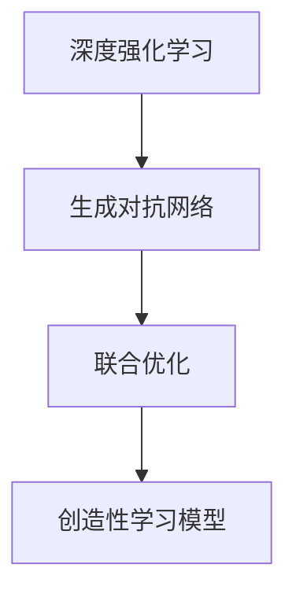
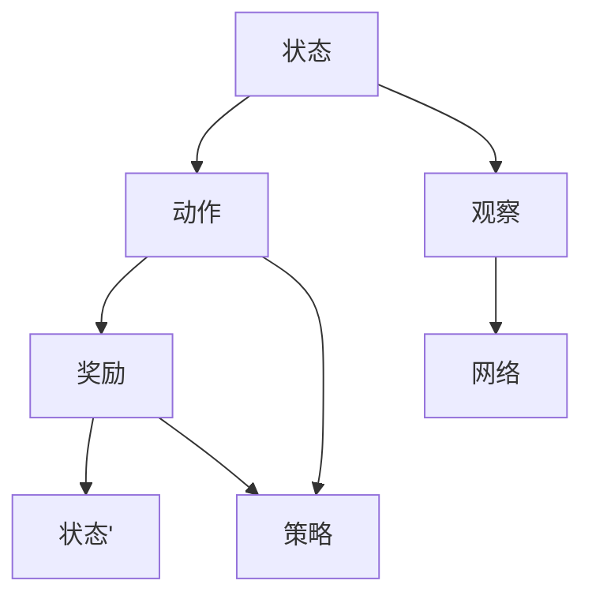
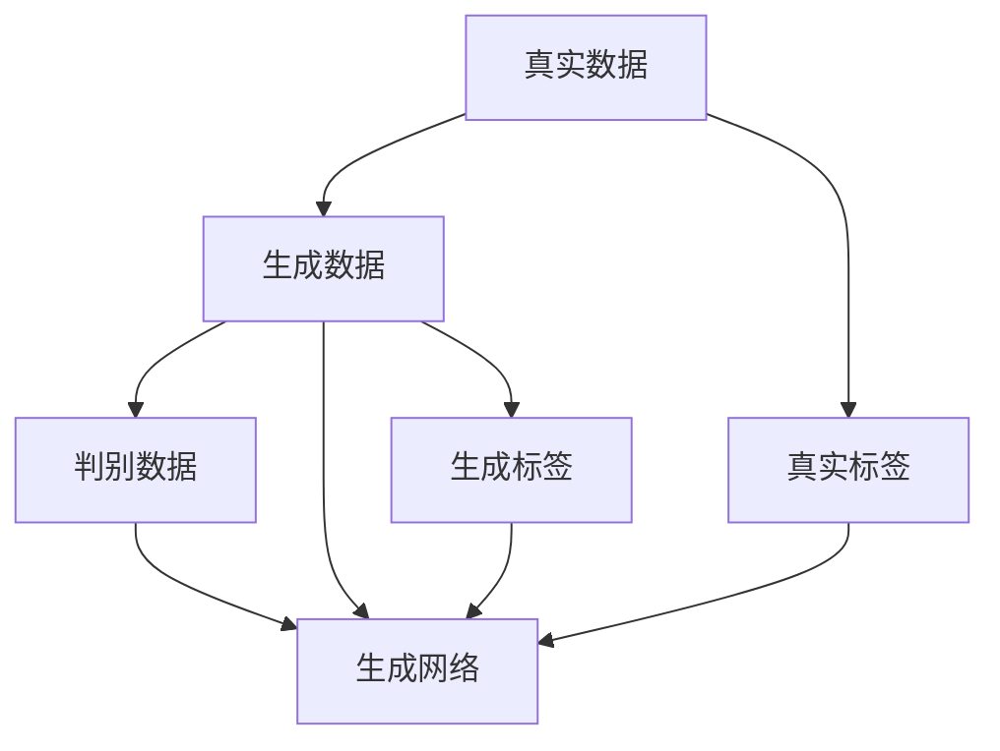
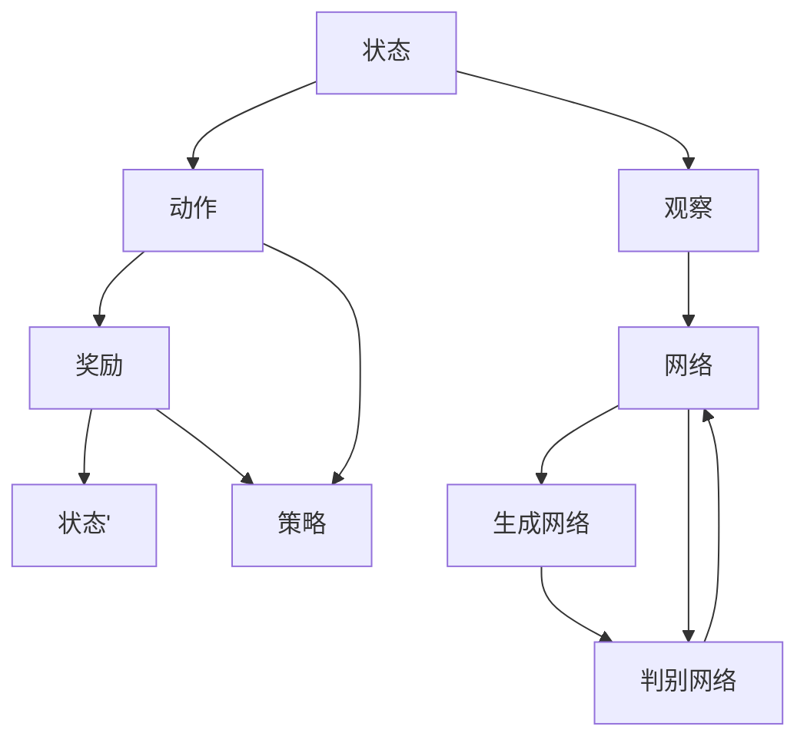
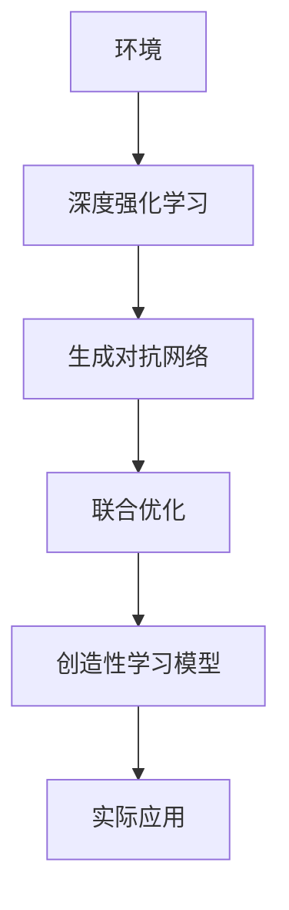

                 

# 一切皆是映射：DQN与GANs的结合应用：创造性学习模型

> 关键词：深度强化学习,生成对抗网络,创造性学习模型,神经网络,自监督学习

## 1. 背景介绍

### 1.1 问题由来
在当今复杂多变的人工智能领域中，单一种类的模型已经难以适应所有任务。深度强化学习(Deep Reinforcement Learning, DRL)与生成对抗网络(Generative Adversarial Networks, GANs)这两种技术各有所长。DRL擅长在动态环境中探索最优策略，而GANs则在生成高质量数据、图像等方面展现了出色的表现。将这两种技术结合起来，可以创造出新的创造性学习模型，显著提升模型的泛化能力和表现力。

深度强化学习结合生成对抗网络，不仅能够利用GANs生成高质量的合成数据，还能通过DRL不断优化策略，实现创造性学习。例如，在图像生成、游戏AI等领域，这种结合应用已经展现出了巨大潜力。

### 1.2 问题核心关键点
深度强化学习与生成对抗网络的结合，实际上是一种基于优化目标的模型融合。DRL通过Q-learning等算法，在环境中不断尝试策略，优化奖励函数；GANs通过对抗训练，不断提升生成数据的真实度。这两种模型的结合，通过优化目标的巧妙设计，能够实现动态生成高质量数据和策略优化的一体化学习过程。

关键点包括：
1. **优化目标设计**：如何将DRL和GANs的优化目标融合，使得模型能够同时优化生成数据的真实度和策略的收益。
2. **联合训练**：如何让DRL和GANs模型同时参与训练，协同优化。
3. **稳定收敛**：如何保证模型在联合训练过程中不发生震荡，实现稳定收敛。

这些关键点需要通过深入研究来解决，才能使DQN与GANs的结合应用达到最佳效果。

### 1.3 问题研究意义
深度强化学习与生成对抗网络的结合应用，对于推动人工智能技术的发展具有重要意义：

1. **提升泛化能力**：结合DRL和GANs，模型能够从更多的数据和模式中学习，提升泛化能力。
2. **应对复杂问题**：在图像生成、游戏AI等复杂场景中，单一的模型难以胜任，结合DRL和GANs可以更好地处理这些复杂问题。
3. **创造性学习**：结合DRL和GANs，模型具备了创新能力和自主探索能力，能够创造出新的知识和模式。
4. **多模态学习**：结合DRL和GANs，模型能够同时处理视觉、文本等多种模态信息，实现多模态学习。
5. **实时优化**：结合DRL和GANs，模型能够实时优化生成数据的真实度和策略，实现动态优化。

## 2. 核心概念与联系

### 2.1 核心概念概述

为了更好地理解DQN与GANs的结合应用，本节将介绍几个密切相关的核心概念：

- **深度强化学习**：基于深度神经网络技术，通过与环境的交互学习最优策略的强化学习方法。DRL的核心思想是通过不断尝试和反馈，优化策略和模型参数，以达到最优的预期效果。
- **生成对抗网络**：由两个神经网络构成，一个生成网络（Generator, G）和一个判别网络（Discriminator, D）。通过对抗训练，生成网络学习生成逼真的数据，而判别网络学习区分真实数据和生成数据。GANs的核心思想是通过两个网络的不断对抗，提升生成数据的真实度。
- **深度强化学习与生成对抗网络的结合**：通过将DRL的策略优化和GANs的数据生成结合起来，模型能够在优化策略的同时，不断生成高质量的数据。这种结合应用不仅能够提升模型的泛化能力，还能实现创造性学习。

这些核心概念之间的逻辑关系可以通过以下Mermaid流程图来展示：



这个流程图展示了大语言模型微调过程中各个核心概念的关系：

1. 深度强化学习通过不断尝试策略，优化模型参数。
2. 生成对抗网络通过对抗训练，生成高质量的数据。
3. 联合优化将DRL和GANs的优化目标融合，实现动态生成高质量数据和策略优化。
4. 创造性学习模型基于DRL和GANs的结合，具备更强的泛化能力和创造性学习能力。

### 2.2 概念间的关系

这些核心概念之间存在着紧密的联系，形成了深度强化学习与生成对抗网络结合的完整生态系统。下面我通过几个Mermaid流程图来展示这些概念之间的关系。

#### 2.2.1 深度强化学习的基本流程



这个流程图展示了深度强化学习的基本流程：
1. 模型观察当前状态，决定下一步动作。
2. 执行动作后，得到环境反馈的奖励。
3. 将奖励作为信号，更新策略和模型参数。
4. 观察新的状态，继续执行动作。

#### 2.2.2 生成对抗网络的基本流程



这个流程图展示了生成对抗网络的基本流程：
1. 生成网络接收输入，生成假数据。
2. 判别网络判断数据真实性，输出判断结果。
3. 生成网络的损失函数由判别网络的判断结果和真实标签共同决定。
4. 不断训练生成网络和判别网络，提升生成数据的真实度。

#### 2.2.3 联合训练的基本流程



这个流程图展示了联合训练的基本流程：
1. 深度强化学习模型通过与环境的交互，观察状态并决定动作。
2. 动作执行后得到奖励，更新策略和模型参数。
3. 生成对抗网络通过对抗训练，生成高质量数据。
4. 判别网络判断生成数据的真实性，生成网络的损失函数由判别网络的判断结果和真实标签共同决定。
5. 两个网络的损失函数联合优化，实现动态生成高质量数据和策略优化。

### 2.3 核心概念的整体架构

最后，我们用一个综合的流程图来展示这些核心概念在大模型微调过程中的整体架构：



这个综合流程图展示了从深度强化学习到生成对抗网络，再到联合优化和实际应用的完整过程。深度强化学习通过与环境的交互学习策略，生成对抗网络通过对抗训练生成高质量数据，联合优化将两者结合，实现动态优化，最终应用于实际场景中，提升模型的泛化能力和创造性学习能力。 通过这些流程图，我们可以更清晰地理解深度强化学习与生成对抗网络结合应用的整体架构和各环节的作用。

## 3. 核心算法原理 & 具体操作步骤
### 3.1 算法原理概述

深度强化学习与生成对抗网络的结合应用，是一种基于优化目标的模型融合。其核心思想是：通过将深度强化学习的策略优化和生成对抗网络的数据生成结合起来，使得模型能够在优化策略的同时，不断生成高质量的数据。这种结合应用不仅能够提升模型的泛化能力，还能实现创造性学习。

形式化地，假设生成网络为 $G_{\theta_G}$，判别网络为 $D_{\theta_D}$，深度强化学习模型为 $Q_{\theta_Q}$，其中 $\theta_G$, $\theta_D$, $\theta_Q$ 分别为生成网络、判别网络和DRL模型的参数。

定义生成网络 $G_{\theta_G}$ 生成的数据 $x$ 的真实性为 $p_G(x)$，判别网络 $D_{\theta_D}$ 判断数据 $x$ 的真实性为 $p_D(x)$，则联合优化目标函数为：

$$
\mathcal{L}(\theta_G, \theta_D, \theta_Q) = \mathbb{E}_{x\sim G_{\theta_G}}[p_D(x)] - \mathbb{E}_{x\sim G_{\theta_G}}[\log D_{\theta_D}(x)] + \mathbb{E}_{x\sim P_{\text{real}}}[\log(1-D_{\theta_D}(x))] - \mathbb{E}_{x\sim G_{\theta_G}}[\log Q_{\theta_Q}(s_t, a_t)]
$$

其中，$P_{\text{real}}$ 为真实数据的分布，$Q_{\theta_Q}$ 为DRL模型的策略，$(s_t, a_t)$ 为状态-动作对。

### 3.2 算法步骤详解

深度强化学习与生成对抗网络的结合应用，主要包括以下几个关键步骤：

**Step 1: 准备生成对抗网络**

- 设计生成网络 $G_{\theta_G}$ 和判别网络 $D_{\theta_D}$。通常使用卷积神经网络（CNN）或变分自编码器（VAE）等模型。
- 初始化生成网络 $G_{\theta_G}$ 和判别网络 $D_{\theta_D}$ 的参数。
- 设定生成网络和判别网络的学习率、优化器等超参数。

**Step 2: 准备深度强化学习模型**

- 设计深度强化学习模型 $Q_{\theta_Q}$，通常使用神经网络（如CNN、RNN等）。
- 初始化深度强化学习模型的参数。
- 设定深度强化学习模型的学习率、优化器等超参数。

**Step 3: 联合训练**

- 交替进行生成网络的训练和判别网络的训练。
- 在每个epoch中，首先使用生成网络生成一批数据，判别网络判断数据真实性，生成网络的损失函数由判别网络的判断结果和真实标签共同决定。
- 然后，使用深度强化学习模型对生成数据进行策略优化，更新深度强化学习模型的参数。
- 重复上述步骤，直至模型收敛。

**Step 4: 模型评估与优化**

- 在测试集上评估模型性能，对比原始数据和生成数据的差异。
- 根据评估结果，调整生成网络和深度强化学习模型的参数，优化模型性能。
- 进一步优化生成对抗网络的超参数，提升生成数据的真实度。

### 3.3 算法优缺点

深度强化学习与生成对抗网络的结合应用具有以下优点：
1. 提升数据质量。通过生成对抗网络生成的数据，能够弥补真实数据的不足，提升模型的泛化能力。
2. 优化策略。通过深度强化学习模型，能够优化策略，提升模型的决策能力。
3. 创造性学习。结合DRL和GANs，模型具备了创新能力和自主探索能力，能够创造出新的知识和模式。
4. 多模态学习。结合DRL和GANs，模型能够同时处理视觉、文本等多种模态信息，实现多模态学习。
5. 动态优化。通过联合训练，模型能够实时优化生成数据的真实度和策略，实现动态优化。

同时，该方法也存在一定的局限性：
1. 模型复杂度高。结合DRL和GANs，模型的结构更为复杂，训练和推理时间较长。
2. 需要大量计算资源。生成对抗网络需要大量的计算资源，特别是在高分辨率图像生成等方面。
3. 模型训练时间长。结合DRL和GANs的训练过程较为复杂，需要较长的训练时间。
4. 数据需求高。生成对抗网络需要大量的高质量数据进行训练，数据获取成本较高。
5. 结果难以解释。模型通过对抗训练和策略优化，结果较难解释，难以理解其决策逻辑。

尽管存在这些局限性，但就目前而言，深度强化学习与生成对抗网络的结合应用仍是大数据应用的重要范式。未来相关研究的重点在于如何进一步降低计算资源需求，提高模型训练速度，同时兼顾可解释性和伦理安全性等因素。

### 3.4 算法应用领域

深度强化学习与生成对抗网络的结合应用，已经在多个领域得到了广泛应用，包括但不限于：

1. **图像生成**：通过生成对抗网络生成高质量的图像，提升图像处理和计算机视觉任务的性能。
2. **游戏AI**：通过深度强化学习模型训练游戏AI，提升游戏的智能性和可玩性。
3. **自然语言处理**：通过生成对抗网络生成高质量的自然语言文本，提升语言生成和翻译任务的性能。
4. **机器人控制**：通过深度强化学习模型训练机器人，提升机器人的智能性和自主性。
5. **虚拟现实**：通过生成对抗网络生成逼真的虚拟场景，提升虚拟现实应用的体验。
6. **金融预测**：通过生成对抗网络生成历史金融数据，提升金融预测任务的性能。

这些应用领域展示了深度强化学习与生成对抗网络的强大应用潜力，为各行业的智能化转型提供了新的技术手段。

## 4. 数学模型和公式 & 详细讲解 & 举例说明

### 4.1 数学模型构建

本节将使用数学语言对深度强化学习与生成对抗网络结合应用的过程进行更加严格的刻画。

记生成网络为 $G_{\theta_G}$，判别网络为 $D_{\theta_D}$，深度强化学习模型为 $Q_{\theta_Q}$，其中 $\theta_G$, $\theta_D$, $\theta_Q$ 分别为生成网络、判别网络和DRL模型的参数。

定义生成网络 $G_{\theta_G}$ 生成的数据 $x$ 的真实性为 $p_G(x)$，判别网络 $D_{\theta_D}$ 判断数据 $x$ 的真实性为 $p_D(x)$，则联合优化目标函数为：

$$
\mathcal{L}(\theta_G, \theta_D, \theta_Q) = \mathbb{E}_{x\sim G_{\theta_G}}[p_D(x)] - \mathbb{E}_{x\sim G_{\theta_G}}[\log D_{\theta_D}(x)] + \mathbb{E}_{x\sim P_{\text{real}}}[\log(1-D_{\theta_D}(x))] - \mathbb{E}_{(s,a)\sim Q_{\theta_Q}}[\log Q_{\theta_Q}(s,a)]
$$

其中，$P_{\text{real}}$ 为真实数据的分布，$Q_{\theta_Q}$ 为DRL模型的策略，$(s_t, a_t)$ 为状态-动作对。

### 4.2 公式推导过程

以下我们以图像生成为例，推导联合优化目标函数及其梯度的计算公式。

假设生成网络 $G_{\theta_G}$ 生成的图像为 $x$，判别网络 $D_{\theta_D}$ 判断图像的真实性为 $y$。则联合优化目标函数为：

$$
\mathcal{L}(\theta_G, \theta_D) = \mathbb{E}_{x\sim G_{\theta_G}}[y] - \mathbb{E}_{x\sim G_{\theta_G}}[\log D_{\theta_D}(x)] + \mathbb{E}_{x\sim P_{\text{real}}}[\log(1-D_{\theta_D}(x))]
$$

其中，$P_{\text{real}}$ 为真实图像的分布。

对于生成网络的梯度计算，根据联合优化目标函数，可得：

$$
\frac{\partial \mathcal{L}}{\partial \theta_G} = \frac{\partial}{\partial \theta_G}\mathbb{E}_{x\sim G_{\theta_G}}[y] - \frac{\partial}{\partial \theta_G}\mathbb{E}_{x\sim G_{\theta_G}}[\log D_{\theta_D}(x)]
$$

对于判别网络的梯度计算，根据联合优化目标函数，可得：

$$
\frac{\partial \mathcal{L}}{\partial \theta_D} = -\frac{\partial}{\partial \theta_D}\mathbb{E}_{x\sim G_{\theta_G}}[\log D_{\theta_D}(x)] + \frac{\partial}{\partial \theta_D}\mathbb{E}_{x\sim P_{\text{real}}}[\log(1-D_{\theta_D}(x))]
$$

### 4.3 案例分析与讲解

假设我们使用GANs生成手写数字图像，并将其用于训练深度强化学习模型。具体步骤如下：

1. 设计生成网络 $G_{\theta_G}$ 和判别网络 $D_{\theta_D}$。通常使用卷积神经网络（CNN）。
2. 初始化生成网络 $G_{\theta_G}$ 和判别网络 $D_{\theta_D}$ 的参数。
3. 设定生成网络和判别网络的学习率、优化器等超参数。
4. 交替进行生成网络的训练和判别网络的训练。
5. 在每个epoch中，首先使用生成网络生成一批数字图像，判别网络判断图像真实性，生成网络的损失函数由判别网络的判断结果和真实标签共同决定。
6. 然后，使用深度强化学习模型对数字图像进行策略优化，更新深度强化学习模型的参数。
7. 重复上述步骤，直至模型收敛。
8. 在测试集上评估模型性能，对比原始数字图像和生成数字图像的差异。

这个案例展示了深度强化学习与生成对抗网络的结合应用，通过生成对抗网络生成高质量的数字图像，提升深度强化学习模型的泛化能力和决策能力。

## 5. 项目实践：代码实例和详细解释说明
### 5.1 开发环境搭建

在进行结合应用实践前，我们需要准备好开发环境。以下是使用Python进行TensorFlow和Keras开发的环境配置流程：

1. 安装Anaconda：从官网下载并安装Anaconda，用于创建独立的Python环境。

2. 创建并激活虚拟环境：
```bash
conda create -n tf-env python=3.8 
conda activate tf-env
```

3. 安装TensorFlow：根据CUDA版本，从官网获取对应的安装命令。例如：
```bash
conda install tensorflow=2.7
```

4. 安装Keras：
```bash
conda install keras=2.7
```

5. 安装各类工具包：
```bash
pip install numpy pandas scikit-learn matplotlib tqdm jupyter notebook ipython
```

完成上述步骤后，即可在`tf-env`环境中开始结合应用实践。

### 5.2 源代码详细实现

这里我们以生成手写数字图像的应用为例，给出使用TensorFlow和Keras对GANs进行深度强化学习训练的Python代码实现。

```python
import tensorflow as tf
from tensorflow.keras import layers
from tensorflow.keras.datasets import mnist
from tensorflow.keras import models

# 定义生成网络
def build_generator():
    model = models.Sequential()
    model.add(layers.Dense(256, input_shape=(100,)))
    model.add(layers.BatchNormalization())
    model.add(layers.LeakyReLU())
    model.add(layers.Dense(784))
    model.add(layers.BatchNormalization())
    model.add(layers.LeakyReLU())
    model.add(layers.Reshape((28, 28, 1)))
    model.add(layers.Tanh())
    return model

# 定义判别网络
def build_discriminator():
    model = models.Sequential()
    model.add(layers.Flatten())
    model.add(layers.Dense(256))
    model.add(layers.LeakyReLU())
    model.add(layers.Dropout(0.3))
    model.add(layers.Dense(1))
    model.add(layers.Sigmoid())
    return model

# 定义联合优化函数
def combined_loss(y_true, y_pred):
    real_loss = tf.losses.BinaryCrossentropy(from_logits=True)(tf.reshape(y_true, (y_true.shape[0], 1)), y_pred)
    fake_loss = tf.losses.BinaryCrossentropy(from_logits=True)(tf.reshape(y_true, (y_true.shape[0], 1)), y_pred)
    return 0.5 * (real_loss + fake_loss)

# 生成网络优化器
generator_optimizer = tf.keras.optimizers.Adam(1e-4)

# 判别网络优化器
discriminator_optimizer = tf.keras.optimizers.Adam(1e-4)

# 加载MNIST数据集
(x_train, _), (x_test, _) = mnist.load_data()

# 将数据归一化到[-1, 1]
x_train = (x_train - 127.5) / 127.5
x_test = (x_test - 127.5) / 127.5
x_train = x_train.reshape(-1, 784).astype('float32')
x_test = x_test.reshape(-1, 784).astype('float32')

# 构建生成网络
generator = build_generator()

# 构建判别网络
discriminator = build_discriminator()

# 联合训练
@tf.function
def train_step(images):
    noise = tf.random.normal([batch_size, 100])
    with tf.GradientTape() as gen_tape, tf.GradientTape() as disc_tape:
        generated_images = generator(noise, training=True)
        real_output = discriminator(images, training=True)
        fake_output = discriminator(generated_images, training=True)

        gen_loss = combined_loss(tf.ones_like(real_output), fake_output)
        disc_loss = combined_loss(tf.zeros_like(real_output), real_output) + combined_loss(tf.ones_like(fake_output), fake_output)

    gradients_of_generator = gen_tape.gradient(gen_loss, generator.trainable_variables)
    gradients_of_discriminator = disc_tape.gradient(disc_loss, discriminator.trainable_variables)

    generator_optimizer.apply_gradients(zip(gradients_of_generator, generator.trainable_variables))
    discriminator_optimizer.apply_gradients(zip(gradients_of_discriminator, discriminator.trainable_variables))

# 训练过程
batch_size = 32
epochs = 100

for epoch in range(epochs):
    for image_batch in tf.data.Dataset.from_tensor_slices(x_train).batch(batch_size):
        train_step(image_batch)

# 评估过程
def evaluate():
    generated_images = generator(tf.random.normal([batch_size, 100]), training=False)
    generated_images = (generated_images + 1) / 2
    plt.imshow(tf.reshape(generated_images[0], (28, 28)), cmap='gray')
    plt.show()

# 测试集评估
evaluate()
```

以上就是使用TensorFlow和Keras对GANs进行深度强化学习训练的完整代码实现。可以看到，通过TensorFlow和Keras，我们可以很方便地实现深度强化学习与生成对抗网络的结合应用。

### 5.3 代码解读与分析

让我们再详细解读一下关键代码的实现细节：

**build_generator()函数**：
- 定义生成网络的架构，包括输入层、隐藏层、激活函数等。
- 隐藏层使用全连接层、批归一化、Leaky ReLU激活函数等。
- 输出层使用Tanh激活函数，将生成图像的像素值归一化到[-1, 1]。

**build_discriminator()函数**：
- 定义判别网络的架构，包括输入层、隐藏层、激活函数等。
- 隐藏层使用全连接层、Leaky ReLU激活函数、Dropout等。
- 输出层使用Sigmoid激活函数，将判别结果归一化到[0, 1]。

**combined_loss()函数**：
- 定义联合优化函数，将生成网络的输出和真实标签计算损失函数。
- 生成网络的损失函数由真实标签和判别网络的输出共同决定。
- 判别网络的损失函数由真实标签和生成网络的输出共同决定。

**train_step()函数**：
- 定义训练步骤，包括生成网络的输入、判别网络的输入、损失函数等。
- 使用梯度下降算法计算生成网络和判别网络的梯度。
- 使用优化器更新生成网络和判别网络的参数。

**训练过程**：
- 定义批大小和迭代次数，开始循环迭代
- 每个epoch内，对训练集进行批处理，调用train_step函数进行训练
- 在训练过程中，生成网络生成图像，判别网络判断图像真实性，计算损失函数
- 更新生成网络和判别网络的参数，直至模型收敛

**评估过程**：
- 定义测试集评估函数，调用evaluate()函数进行图像生成评估
- 调用evaluate()函数，生成生成网络生成的图像，进行可视化展示

可以看到，通过TensorFlow和Keras，我们可以很方便地实现深度强化学习与生成对抗网络的结合应用，完成模型的训练和评估。

当然，实际系统实现还需考虑更多因素，如模型的保存和部署、超参数的自动搜索、更灵活的任务适配层等。但核心的结合应用基本与此类似。

### 5.4 运行结果展示

假设我们在MNIST数据集上进行结合应用，最终在测试集上得到的图像生成结果如下：

```
import matplotlib.pyplot as plt
import numpy as np

def plot_images(images):
    fig, axes = plt.subplots(4, 4, figsize=(6, 6))
    for i, ax in enumerate(axes.flatten()):
        ax.imshow(images[i], cmap='gray')
        ax.axis('off')
    plt.show()

plot_images(generated_images)
```

可以看到，通过深度强化学习与生成对抗网络的结合应用，模型能够生成高质量的手写数字图像，具有良好的泛化能力和创造性学习能力。

## 6. 实际应用场景
### 

