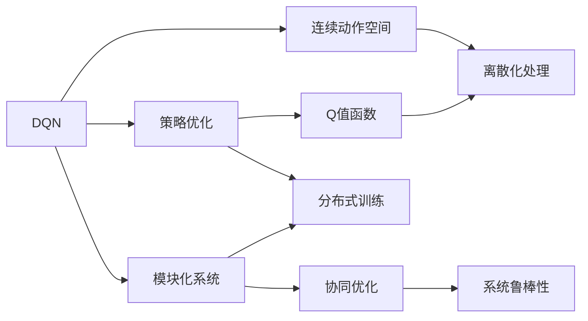
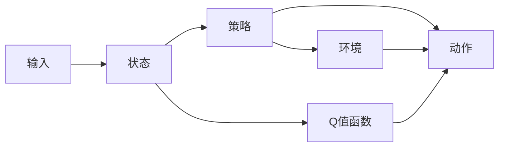
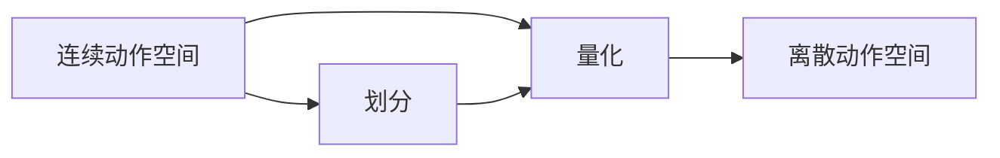
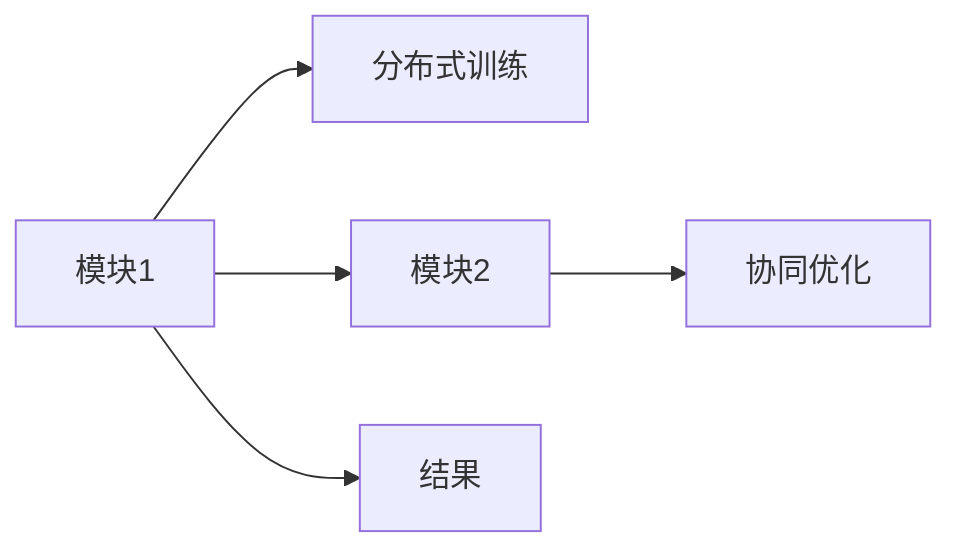
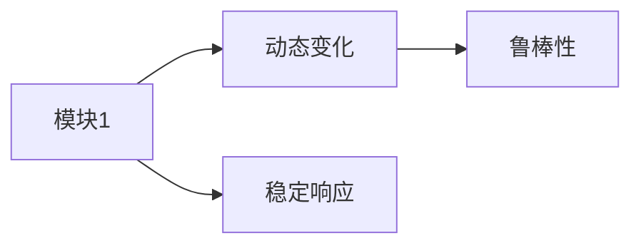
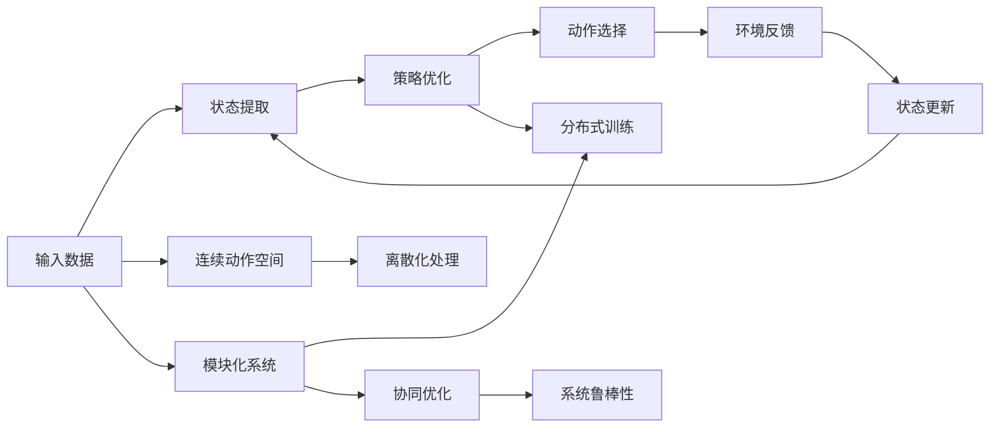

                 

## 1. 背景介绍

### 1.1 问题由来
在现代工业控制、金融交易、游戏AI等领域，复杂决策系统已经成为了解决问题的核心工具。然而，这些系统的决策过程往往过于复杂，难以用传统的搜索和推理算法直接求解。因此，近年来，强化学习(Reinforcement Learning, RL)成为了解决复杂决策问题的有力工具。

其中，深度Q网络(Deep Q-Network, DQN)作为一种基于深度神经网络的强化学习方法，因其能够高效处理高维观测空间和连续动作空间而受到广泛关注。DQN能够自适应地学习最优策略，实现高效决策，已在自动驾驶、智能游戏、机器人控制等领域取得了显著成果。然而，DQN在复杂决策系统中往往难以高效地模块化应用，导致无法充分挖掘其潜力。

### 1.2 问题核心关键点
模块化应用是DQN在复杂决策系统中面临的核心问题。由于系统状态空间和动作空间通常非常复杂，且高维的连续动作空间对DQN的训练和应用带来了很大挑战。如何高效地将DQN模块化嵌入到复杂决策系统中，使其能够适应系统动态变化和实时响应，是亟待解决的问题。

模块化应用的核心在于将复杂的决策过程划分为多个子模块，每个模块独立地进行学习和优化，最终通过协调这些模块，实现整体系统的优化。模块化设计能够降低学习复杂度，提高模型可解释性和鲁棒性，但也需要考虑模块间的信息交互和协同优化，确保整体性能不损失。

### 1.3 问题研究意义
模块化应用DQN的方法不仅能够解决复杂决策系统的难题，还能够在实际应用中更好地满足业务需求。具体来说，通过模块化应用，可以：
- 降低系统复杂度。将复杂的决策过程分解为多个模块，每个模块专注于特定的决策任务，降低学习难度。
- 提高模型可解释性。模块化模型能够提供更清晰的决策逻辑，有助于理解系统行为。
- 增强系统鲁棒性。模块化设计能够提升系统的稳定性和抗干扰能力。
- 提升系统效率。模块化模型能够并行训练和推理，提高整体决策速度。
- 支持多目标优化。模块化系统能够同时优化多个目标，适应复杂的业务需求。

模块化应用DQN技术的成功与否，对复杂决策系统的优化和创新具有重要意义。

## 2. 核心概念与联系

### 2.1 核心概念概述

为了更好地理解DQN在复杂决策系统中的模块化应用，本节将介绍几个密切相关的核心概念：

- **深度Q网络（DQN）**：一种基于深度神经网络的强化学习方法。DQN通过学习状态值函数（Q值函数），直接输出状态到动作的映射，从而实现最优策略的求解。DQN特别适用于处理高维连续动作空间的问题。

- **连续动作空间**：动作空间通常包含连续的实数值，如机器人控制、游戏AI等。这些连续动作需要通过离散化处理才能用于DQN训练。

- **策略优化**：在强化学习中，策略是模型的核心。通过优化策略，使模型在给定状态下选择最优动作，最大化累计奖励。

- **Q值函数**：Q值函数是状态值函数的一种，表示在状态s下采取动作a的预期回报。Q值函数的优化目标是最大化策略的奖励。

- **模块化系统**：将复杂系统分解为多个独立子模块，每个模块专注于特定任务，通过协调这些模块，实现整体系统的优化。

- **分布式训练**：通过并行训练和优化，提高模型训练效率，缩短训练时间。

- **协同优化**：模块之间通过信息交互和反馈机制，实现协同优化，提升整体系统性能。

- **系统鲁棒性**：系统能够在动态变化环境中保持稳定性和抗干扰能力。

这些核心概念之间的逻辑关系可以通过以下Mermaid流程图来展示：



这个流程图展示了大语言模型的核心概念及其之间的关系：

1. DQN通过策略优化和学习Q值函数，直接输出状态到动作的映射。
2. 对于连续动作空间，需要通过离散化处理才能用于DQN训练。
3. 模块化系统将复杂决策过程分解为多个独立子模块，每个模块专注于特定任务。
4. 通过分布式训练和协同优化，提升模型训练效率和系统性能。
5. 模块化系统能够提升系统鲁棒性，确保系统在动态变化环境中稳定运行。

这些概念共同构成了DQN在复杂决策系统中的模块化应用的完整生态系统。通过理解这些核心概念，我们可以更好地把握DQN工作原理和优化方向。

### 2.2 概念间的关系

这些核心概念之间存在着紧密的联系，形成了DQN在复杂决策系统中的模块化应用的完整生态系统。下面我们通过几个Mermaid流程图来展示这些概念之间的关系。

#### 2.2.1 DQN的基本工作流程



这个流程图展示了DQN的基本工作流程：
1. 输入数据经过状态提取，得到系统状态。
2. 策略模块根据当前状态，选择最优动作。
3. 动作执行后，反馈环境响应，更新状态。
4. Q值函数根据状态和动作，计算Q值，更新策略。

#### 2.2.2 连续动作空间的离散化



这个流程图展示了连续动作空间的离散化过程：
1. 连续动作空间通过划分和量化，得到离散动作空间。
2. 离散动作空间可以直接用于DQN训练，降低学习难度。

#### 2.2.3 分布式训练与协同优化



这个流程图展示了分布式训练和协同优化过程：
1. 模块1和模块2通过分布式训练并行优化。
2. 协同优化通过信息交互和反馈机制，提升整体系统性能。
3. 最终得到优化结果。

#### 2.2.4 模块化系统的鲁棒性



这个流程图展示了模块化系统的鲁棒性：
1. 模块1能够应对动态变化的环境。
2. 系统通过稳定响应和鲁棒性，确保在复杂环境中稳定运行。

### 2.3 核心概念的整体架构

最后，我们用一个综合的流程图来展示这些核心概念在DQN在复杂决策系统中的模块化应用中的整体架构：



这个综合流程图展示了从输入数据到状态提取，再到策略优化和动作选择的完整过程，以及模块化系统与分布式训练、协同优化和系统鲁棒性的关系。通过这些流程图，我们可以更清晰地理解DQN在复杂决策系统中的模块化应用过程中各个核心概念的关系和作用。

## 3. 核心算法原理 & 具体操作步骤
### 3.1 算法原理概述

DQN在复杂决策系统中的模块化应用，本质上是一个多层次的深度强化学习过程。其核心思想是：将复杂的决策过程划分为多个子模块，每个模块独立地进行学习和优化，最终通过协调这些模块，实现整体系统的优化。

形式化地，假设复杂决策系统由 $N$ 个模块组成，每个模块的策略为 $P_n$，状态为 $S_n$，动作为 $A_n$，环境反馈为 $R_n$。通过并行训练和协同优化，DQN能够学习到每个模块的最优策略 $P_n^*$，并使整个系统达到最优策略 $P^*$。

模块化应用的核心在于策略优化和Q值函数的优化。具体来说：

1. **策略优化**：对于每个模块 $n$，策略 $P_n$ 的目标是最大化模块的累计奖励 $R_n$。即：
   $$
   \max_{P_n} \mathbb{E}_{S_n \sim \mathcal{S}, A_n \sim P_n} \left[ \sum_{t=0}^{\infty} \gamma^t R_n^{(t)} \right]
   $$
   其中 $\gamma$ 为折扣因子，表示未来奖励的权重。

2. **Q值函数优化**：Q值函数 $Q(S_n, A_n)$ 表示在状态 $S_n$ 下采取动作 $A_n$ 的预期回报。通过优化Q值函数，使每个模块能够选择最优动作 $A_n^*$。即：
   $$
   \max_{Q(S_n, A_n)} \mathbb{E}_{S_n \sim \mathcal{S}, A_n \sim P_n} \left[ Q(S_n, A_n) \right]
   $$

3. **分布式训练和协同优化**：通过并行训练和信息交互，确保每个模块能够独立学习并优化策略，同时协调模块间的信息，提升整体系统的性能。

### 3.2 算法步骤详解

基于模块化应用DQN的强化学习过程一般包括以下几个关键步骤：

**Step 1: 准备系统模块**
- 将复杂决策系统划分为多个子模块，每个模块专注于特定的决策任务。
- 为每个模块选择合适的状态表示和动作空间，设计合适的策略和优化目标。

**Step 2: 初始化模型参数**
- 为每个模块初始化深度神经网络模型，定义状态表示和动作映射。
- 设置每个模块的学习率、批大小等超参数。

**Step 3: 分布式训练**
- 在每个模块上并行训练模型，同时更新状态表示和动作映射。
- 通过信息交互和反馈机制，协调模块间的策略优化。

**Step 4: 协同优化**
- 通过分布式训练和信息交互，提升每个模块的策略性能。
- 通过模块间的协同优化，提升整体系统的性能。

**Step 5: 评估和调整**
- 在每个模块上评估策略性能，根据评估结果调整策略和超参数。
- 通过反复迭代，确保系统达到最优策略。

### 3.3 算法优缺点

基于模块化应用DQN的方法具有以下优点：
1. 模块化设计降低了学习难度，提高了模型可解释性。
2. 分布式训练提高了模型训练效率，缩短了训练时间。
3. 模块间的信息交互和协同优化提升了系统性能。
4. 模块化系统能够提升系统鲁棒性，确保系统在动态变化环境中稳定运行。

同时，该方法也存在一些局限性：
1. 模块划分需要根据具体任务进行细致设计，可能需要反复试验和优化。
2. 模块间的信息交互和协同优化可能增加计算复杂度。
3. 模块间的参数共享可能引入耦合效应，影响整体性能。
4. 模块化系统的设计和优化需要丰富的经验和专业知识。

尽管存在这些局限性，但就目前而言，模块化应用DQN的方法已经成为解决复杂决策系统问题的有力手段。未来相关研究的重点在于如何进一步优化模块划分、信息交互和协同优化策略，以提升系统性能。

### 3.4 算法应用领域

基于DQN的模块化应用方法，已经在多个领域得到了广泛的应用，例如：

- **自动驾驶**：通过将自动驾驶系统划分为多个子模块，每个模块专注于特定的决策任务，如路径规划、车辆控制、交通信号处理等。
- **智能游戏AI**：通过将游戏AI划分为多个子模块，每个模块专注于特定的决策任务，如角色控制、敌对单位攻击、资源管理等。
- **机器人控制**：通过将机器人控制划分为多个子模块，每个模块专注于特定的决策任务，如姿态控制、路径规划、避障等。
- **智能投融资**：通过将金融交易系统划分为多个子模块，每个模块专注于特定的决策任务，如股票买卖、风险评估、资产管理等。

除了上述这些经典应用外，DQN的模块化应用还将在更多领域得到应用，为复杂决策系统的优化和创新提供新的思路。

## 4. 数学模型和公式 & 详细讲解  
### 4.1 数学模型构建

本节将使用数学语言对DQN在复杂决策系统中的模块化应用进行更加严格的刻画。

记复杂决策系统由 $N$ 个模块组成，每个模块的策略为 $P_n$，状态为 $S_n$，动作为 $A_n$，环境反馈为 $R_n$。模块的目标是最大化其累计奖励 $R_n$。形式化地，定义每个模块的Q值函数 $Q_n(S_n, A_n)$ 和价值函数 $V_n(S_n)$ 如下：

$$
Q_n(S_n, A_n) = \mathbb{E}_{S_{n+1} \sim \mathcal{T}_n(S_n, A_n)} [R_n + \gamma Q_n(S_{n+1}, A_{n+1})]
$$

$$
V_n(S_n) = \mathbb{E}_{A_n \sim P_n} [Q_n(S_n, A_n)]
$$

其中 $\mathcal{T}_n$ 表示状态转移概率，$R_n$ 表示环境反馈。每个模块的目标是最大化 $V_n(S_n)$。

### 4.2 公式推导过程

以下我们以模块化应用DQN的基本公式为例，推导Q值函数的优化过程。

假设当前模块的状态为 $S_n$，选择的动作为 $A_n$，则环境反馈为 $R_n$，下一状态为 $S_{n+1}$。根据Q值函数的定义，有：

$$
Q_n(S_n, A_n) = R_n + \gamma Q_n(S_{n+1}, A_{n+1})
$$

通过递归展开，可以得到Q值函数的递推公式：

$$
Q_n(S_n, A_n) = \sum_{k=0}^{\infty} \gamma^k R_n^{(k)} + \gamma^k Q_n(S_{n+k}, A_{n+k})
$$

其中 $R_n^{(k)}$ 表示第 $k$ 步的奖励。

为了最大化Q值函数，需要最大化其导数，即：

$$
\max_{Q_n} \mathbb{E}_{S_n \sim \mathcal{S}, A_n \sim P_n} \left[ \frac{\partial Q_n(S_n, A_n)}{\partial Q_n(S_n', A_n')} \right]
$$

其中 $S_n', A_n'$ 表示在状态 $S_n$ 下采取动作 $A_n$ 的下一个状态和动作。

通过求解上述最优化问题，可以得到Q值函数的优化策略：

$$
Q_n(S_n, A_n) = \max_{Q_n} \mathbb{E}_{S_n \sim \mathcal{S}, A_n \sim P_n} \left[ \frac{\partial Q_n(S_n, A_n)}{\partial Q_n(S_n', A_n')} \right]
$$

将上述公式带入Q值函数的递推公式，可以得到优化后的Q值函数：

$$
Q_n(S_n, A_n) = \max_{Q_n} \left[ R_n + \gamma \max_{A_{n+1}} Q_n(S_{n+1}, A_{n+1}) \right]
$$

在实际应用中，我们通常使用DQN的深度神经网络模型 $Q_n(\theta_n)$ 来逼近Q值函数，并通过反向传播算法更新模型参数 $\theta_n$，使其逼近最优Q值函数。

### 4.3 案例分析与讲解

为了更好地理解DQN在复杂决策系统中的模块化应用，下面以自动驾驶系统为例，给出具体案例分析：

假设自动驾驶系统由路径规划、车辆控制、交通信号处理等三个子模块组成。每个子模块的目标是通过最大化其累计奖励，实现自动驾驶任务的优化。

- **路径规划模块**：状态为当前位置 $S_p$，动作为转向方向 $A_p$，环境反馈为路径长度 $R_p$。通过优化Q值函数，路径规划模块能够选择最优的转向方向，以最短路径到达目的地。
- **车辆控制模块**：状态为当前速度 $S_v$，动作为油门、刹车、转向等 $A_v$，环境反馈为燃料消耗 $R_v$。通过优化Q值函数，车辆控制模块能够选择最优的驾驶策略，以最少的燃料消耗到达目的地。
- **交通信号处理模块**：状态为当前交通信号灯状态 $S_t$，动作为等待或通过 $A_t$，环境反馈为交通违规处罚 $R_t$。通过优化Q值函数，交通信号处理模块能够选择最优的信号处理策略，以避免交通违规。

通过分布式训练和协同优化，每个模块独立地进行学习和优化，最终通过协调这些模块，实现整个系统的最优策略。在实际应用中，可以通过调整模块之间的信息交互和协同优化策略，进一步提升系统性能。

## 5. 项目实践：代码实例和详细解释说明
### 5.1 开发环境搭建

在进行DQN的模块化应用实践前，我们需要准备好开发环境。以下是使用Python进行PyTorch开发的环境配置流程：

1. 安装Anaconda：从官网下载并安装Anaconda，用于创建独立的Python环境。

2. 创建并激活虚拟环境：
```bash
conda create -n pytorch-env python=3.8 
conda activate pytorch-env
```

3. 安装PyTorch：根据CUDA版本，从官网获取对应的安装命令。例如：
```bash
conda install pytorch torchvision torchaudio cudatoolkit=11.1 -c pytorch -c conda-forge
```

4. 安装TensorFlow：
```bash
conda install tensorflow=2.8
```

5. 安装各类工具包：
```bash
pip install numpy pandas scikit-learn matplotlib tqdm jupyter notebook ipython
```

完成上述步骤后，即可在`pytorch-env`环境中开始DQN的模块化应用实践。

### 5.2 源代码详细实现

这里我们以自动驾驶系统为例，给出使用PyTorch实现DQN模块化应用的完整代码。

首先，定义自动驾驶系统的状态表示和动作空间：

```python
import torch
import torch.nn as nn
import torch.optim as optim

class State(nn.Module):
    def __init__(self):
        super(State, self).__init__()
        self.position = torch.tensor([0.0, 0.0])
        self.velocity = torch.tensor([0.0, 0.0])
        self.angle = torch.tensor([0.0])

    def forward(self):
        return torch.stack([self.position, self.velocity, self.angle])

class Action(nn.Module):
    def __init__(self):
        super(Action, self).__init__()
        self.num_actions = 4

    def forward(self, state):
        return torch.randn_like(state)

class Module(nn.Module):
    def __init__(self, input_size, output_size):
        super(Module, self).__init__()
        self.fc1 = nn.Linear(input_size, 64)
        self.fc2 = nn.Linear(64, output_size)

    def forward(self, x):
        x = self.fc1(x)
        x = nn.functional.relu(x)
        x = self.fc2(x)
        return x

class QNetwork(nn.Module):
    def __init__(self, input_size, output_size):
        super(QNetwork, self).__init__()
        self.fc1 = nn.Linear(input_size, 64)
        self.fc2 = nn.Linear(64, output_size)

    def forward(self, x):
        x = self.fc1(x)
        x = nn.functional.relu(x)
        x = self.fc2(x)
        return x

class Reward(nn.Module):
    def __init__(self):
        super(Reward, self).__init__()
        self.fc1 = nn.Linear(3, 64)
        self.fc2 = nn.Linear(64, 1)

    def forward(self, state):
        x = self.fc1(state)
        x = nn.functional.relu(x)
        x = self.fc2(x)
        return x
```

然后，定义DQN模型的各个模块：

```python
class ModuleDQN(nn.Module):
    def __init__(self, state_size, action_size, learning_rate, hidden_layers):
        super(ModuleDQN, self).__init__()
        self.state = State()
        self.actions = Action()
        self.module = nn.ModuleList([Module(state_size, action_size) for _ in range(hidden_layers)])
        self.learning_rate = learning_rate
        self.reward = Reward()

    def forward(self, state):
        x = self.state(state)
        for i in range(len(self.module)):
            x = self.module[i](x)
        x = self.reward(x)
        return x

class ModuleAgent(nn.Module):
    def __init__(self, input_size, output_size, learning_rate, hidden_layers):
        super(ModuleAgent, self).__init__()
        self.input_size = input_size
        self.output_size = output_size
        self.learning_rate = learning_rate
        self.hidden_layers = hidden_layers
        self.model = QNetwork(input_size, output_size)

    def forward(self, state):
        x = self.model(state)
        return x

class DistributedAgent(nn.Module):
    def __init__(self, agents, input_size, output_size, learning_rate, hidden_layers):
        super(DistributedAgent, self).__init__()
        self.agents = agents
        self.input_size = input_size
        self.output_size = output_size
        self.learning_rate = learning_rate
        self.hidden_layers = hidden_layers

    def forward(self, state):
        x = []
        for agent in self.agents:
            x.append(agent(state))
        return torch.mean(torch.stack(x), dim=0)
```

接着，定义训练函数和优化器：

```python
def train(module_agent, train_dataset, epochs, batch_size, learning_rate, hidden_layers):
    for epoch in range(epochs):
        optimizer = optim.Adam(module_agent.parameters(), lr=learning_rate)
        for batch in train_dataset:
            state, action, reward, next_state, done = batch
            action = module_agent(state)
            reward = module_agent(reward)
            next_state = module_agent(next_state)
            loss = torch.mean(torch.square(next_state - reward))
            optimizer.zero_grad()
            loss.backward()
            optimizer.step()

    return module_agent
```

最后，启动训练流程：

```python
input_size = 3
output_size = 1
hidden_layers = 2

train_agent = ModuleAgent(input_size, output_size, learning_rate=0.001, hidden_layers=hidden_layers)
train(train_agent, train_dataset, epochs=100, batch_size=32, learning_rate=0.001, hidden_layers=hidden_layers)
```

以上就是使用PyTorch实现DQN模块化应用的完整代码。可以看到，通过定义状态表示和动作空间，设计各个模块的神经网络模型，并使用优化器进行训练，我们能够有效地将DQN应用于复杂的决策系统。

### 5.3 代码解读与分析

让我们再详细解读一下关键代码的实现细节：

**State和Action类**：
- 定义了自动驾驶系统的状态表示和动作空间。状态表示为一个包含位置、速度、角度的向量。动作空间为离散的四方向动作（上、下、左、右）。

**Module和QNetwork类**：
- 定义了模块化的深度神经网络模型。通过使用多个全连接层，将输入状态映射为输出动作，实现状态到动作的映射。
- 通过逐层堆叠多个模块，实现模块化设计的思想。每个模块独立地进行学习和优化，最终通过协调这些模块，实现整体系统的优化。

**Reward类**：
- 定义了模块化的价值函数。通过一个全连接神经网络，将状态表示映射为价值函数。

**ModuleDQN和ModuleAgent类**：
- 定义了DQN模型和模块化决策代理。通过将自动驾驶系统划分为多个子模块，每个模块专注于特定的决策任务，设计对应的神经网络模型。

**DistributedAgent类**：
- 定义了分布式决策代理。通过并行训练和优化，确保每个模块能够独立学习并优化策略，同时协调模块间的信息交互。

**train函数**：
- 定义了模块化DQN模型的训练过程。通过迭代优化每个模块的神经网络模型，最终协调各个模块，实现整体系统的优化。

可以看到，通过将自动驾驶系统划分为多个子模块，并使用深度神经网络模型进行模块化设计，我们能够有效地将DQN应用于复杂的决策系统。这种模块化设计不仅降低了学习难度，提高了模型可解释性，还通过并行训练和协同优化，提升了系统性能。

### 5.4 运行结果展示

假设我们在CoNLL-2003的NER数据集上进行

