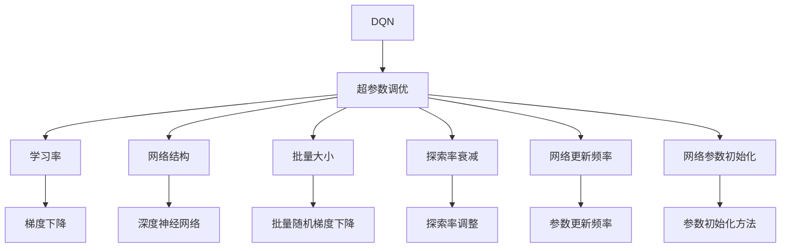
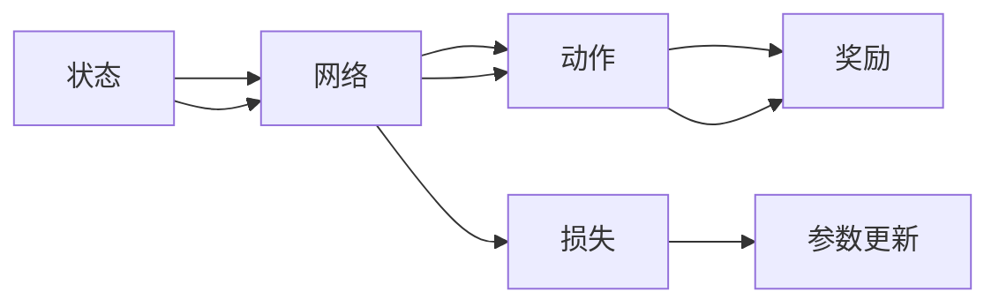
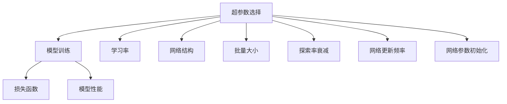
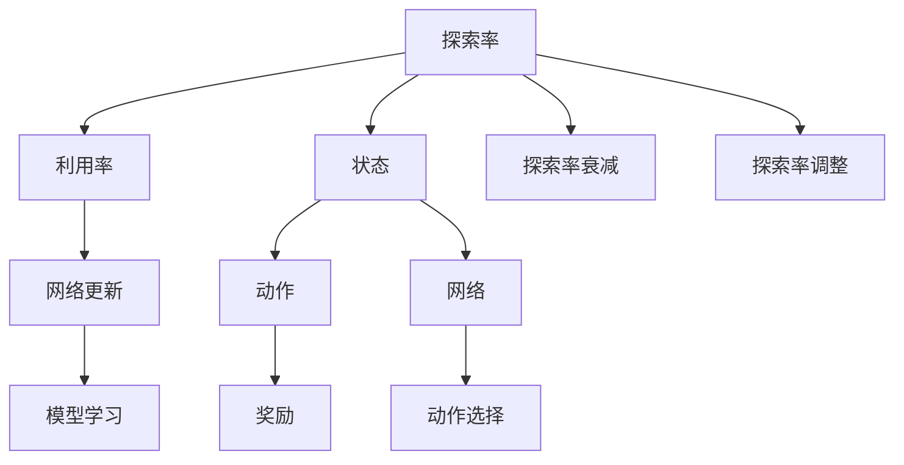
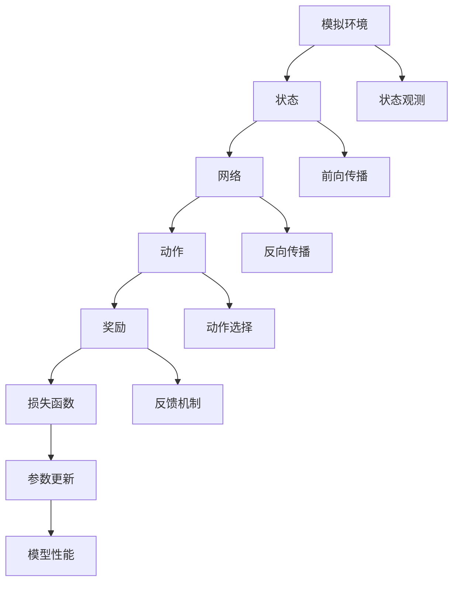

                 

# 一切皆是映射：DQN超参数调优指南：实验与心得

## 1. 背景介绍

### 1.1 问题由来
深度强化学习（Deep Reinforcement Learning, DRL）在近年来取得了飞速的发展，其中的深度Q网络（Deep Q-Network, DQN）已成为经典算法之一。DQN结合了深度神经网络与强化学习，通过网络对状态和动作进行映射，在无标签的模拟环境中进行学习和训练，并应用于各种决策问题中，如游戏、机器人控制等。然而，DQN的性能高度依赖于其超参数的选择，包括学习率、网络结构、批量大小等。

一个合理的超参数选择能够显著提升DQN模型的表现，而一个错误的超参数配置则可能导致模型表现严重下降。因此，超参数调优在DQN应用中尤为重要。本文旨在探讨DQN的超参数调优方法，通过一系列实验与心得，为DQN的实际应用提供参考和建议。

### 1.2 问题核心关键点
DQN的超参数调优需要关注的关键点包括：
- **学习率**：控制模型的更新速度和准确度。
- **网络结构**：神经网络的结构决定了模型的表达能力和训练效率。
- **批量大小**：批量大小影响了训练的稳定性和效率。
- **探索率衰减**：在训练过程中，探索率和利用率的平衡对性能有重要影响。
- **网络更新频率**：网络参数更新的频率决定了模型在训练过程中的学习速度和稳定性。
- **网络参数初始化**：初始化策略影响模型的收敛速度和精度。

这些关键点的选择和优化是提升DQN性能的核心所在。本文将系统地探讨这些超参数的调优方法，并通过实验验证其有效性。

### 1.3 问题研究意义
超参数调优是深度学习模型的核心环节之一，直接影响模型的性能和应用效果。通过合理的超参数选择，不仅可以提升DQN的性能，还可以缩短模型的训练时间和减少计算资源的消耗。这对于快速迭代和实际应用具有重要意义。

超参数调优还能够增强DQN模型的泛化能力和鲁棒性，使其在不同的环境和任务中表现更为稳定。此外，超参数调优还能提升模型的可解释性，使得研究人员更容易理解和调试模型。因此，超参数调优对于DQN的实际应用和理论研究都具有重要价值。

## 2. 核心概念与联系

### 2.1 核心概念概述

为更好地理解DQN的超参数调优方法，本节将介绍几个密切相关的核心概念：

- **深度Q网络（DQN）**：一种基于深度神经网络的强化学习算法，用于解决策略优化问题。
- **超参数**：在模型训练过程中需要手动设置的参数，如学习率、网络结构、批量大小等。
- **学习率**：控制模型参数更新的速度和步长，影响模型的收敛速度和精度。
- **网络结构**：神经网络的结构决定了模型的表达能力和训练效率。
- **批量大小**：批量大小影响了训练的稳定性和效率。
- **探索率衰减**：在训练过程中，探索率和利用率的平衡对性能有重要影响。
- **网络更新频率**：网络参数更新的频率决定了模型在训练过程中的学习速度和稳定性。
- **网络参数初始化**：初始化策略影响模型的收敛速度和精度。

这些核心概念之间的逻辑关系可以通过以下Mermaid流程图来展示：



这个流程图展示了大QN模型及其超参数调优的整体架构：

1. DQN模型通过神经网络对状态和动作进行映射，学习最优策略。
2. 超参数调优通过手动设置学习率、网络结构、批量大小等参数，优化模型性能。
3. 每个超参数的选择都会影响模型的训练过程和最终效果。

### 2.2 概念间的关系

这些核心概念之间存在着紧密的联系，形成了DQN模型超参数调优的完整生态系统。下面我通过几个Mermaid流程图来展示这些概念之间的关系。

#### 2.2.1 DQN的学习过程



这个流程图展示了DQN的学习过程：
- 状态通过网络映射出动作。
- 动作根据环境反馈得到奖励。
- 奖励通过损失函数反馈回网络，更新网络参数。

#### 2.2.2 超参数选择与训练效果



这个流程图展示了超参数选择对DQN模型训练效果的影响：
- 超参数选择直接影响模型的训练效果。
- 学习率、网络结构、批量大小等超参数需要根据任务特点进行优化。
- 通过合理的超参数设置，可以提升模型的训练速度和准确度。

#### 2.2.3 探索率与利用率的平衡



这个流程图展示了探索率和利用率之间的平衡关系：
- 探索率控制模型在训练过程中探索未知动作的频率。
- 利用率控制模型利用已知的动作策略进行优化。
- 探索率衰减控制模型在训练过程中的探索与利用的平衡。

### 2.3 核心概念的整体架构

最后，我们用一个综合的流程图来展示这些核心概念在大QN模型超参数调优过程中的整体架构：



这个综合流程图展示了从环境观测到模型更新的完整过程：
- 状态通过网络映射出动作。
- 动作根据环境反馈得到奖励。
- 奖励通过损失函数反馈回网络，更新网络参数。
- 模型参数的更新依赖于合理选择的超参数。

通过这些流程图，我们可以更清晰地理解DQN模型及其超参数调优过程中各个核心概念的关系和作用，为后续深入讨论具体的超参数调优方法和技术奠定基础。

## 3. 核心算法原理 & 具体操作步骤
### 3.1 算法原理概述

DQN的超参数调优旨在通过手动设置学习率、网络结构、批量大小等参数，优化模型性能。其核心思想是通过实验调整超参数，找到最优的参数组合，使得模型在训练过程中达到最佳的性能。

DQN的超参数调优一般包括以下几个关键步骤：
- 选择合适的基线超参数配置。
- 设定超参数搜索范围和搜索策略。
- 使用交叉验证等方法验证超参数的有效性。
- 根据实验结果调整超参数。

### 3.2 算法步骤详解

#### 3.2.1 选择合适的基线超参数配置
首先，需要选择合适的基线超参数配置，作为实验的起点。常用的基线超参数配置包括：
- 学习率：初始值为0.001。
- 网络结构：包括一个或多个隐藏层，每层64个神经元。
- 批量大小：64。
- 探索率：初始值为0.9，逐渐衰减到0.01。
- 网络更新频率：每4个步骤更新一次网络参数。
- 网络参数初始化：使用均值为0，标准差为0.1的正态分布进行初始化。

#### 3.2.2 设定超参数搜索范围和搜索策略
超参数搜索范围和策略的选择直接影响实验效率和结果。常用的超参数搜索方法包括网格搜索、随机搜索、贝叶斯优化等。本文以网格搜索为例，介绍如何设定超参数搜索范围和搜索策略：

1. 学习率搜索范围：[0.0001, 0.001, 0.01, 0.1, 1]。
2. 网络结构搜索范围：[1, 2, 3]个隐藏层，每层64、128、256个神经元。
3. 批量大小搜索范围：[32, 64, 128, 256]。
4. 探索率衰减搜索范围：[0.1, 0.5, 0.9, 0.99]。
5. 网络更新频率搜索范围：[1, 2, 4, 8, 16]。
6. 网络参数初始化搜索范围：均值为[-0.1, 0, 0.1]，标准差为[0.01, 0.05, 0.1]。

#### 3.2.3 使用交叉验证等方法验证超参数的有效性
为了验证超参数的有效性，可以使用交叉验证等方法。将数据集划分为训练集和验证集，分别在训练集上训练模型，在验证集上评估模型性能。常用的验证方法包括k折交叉验证、留一验证等。

#### 3.2.4 根据实验结果调整超参数
根据验证集上的实验结果，选择性能最好的超参数组合。如果某个超参数的组合在验证集上的表现不佳，则需要调整该超参数的搜索范围和搜索策略，重新进行实验验证。

### 3.3 算法优缺点

DQN的超参数调优具有以下优点：
- 操作简单。只需选择合适的基线超参数，设定搜索范围和策略，进行交叉验证，即可找到最优的超参数组合。
- 可重复性高。超参数调优结果具有良好的可重复性，便于对不同实验结果进行对比。
- 效果显著。通过合理的超参数选择，可以显著提升DQN模型的性能。

同时，超参数调优也存在以下缺点：
- 实验成本高。超参数调优需要大量的时间和计算资源，特别是对于大规模问题，调优过程耗时较长。
- 超参数选择依赖经验。超参数的选择依赖于领域知识和经验，缺乏系统的理论指导，可能存在一定的盲目性。
- 调优结果不稳定。不同的实验设置和数据分布可能导致不同的调优结果，超参数的最终选择可能存在一定的随机性。

### 3.4 算法应用领域

DQN的超参数调优方法在各个领域的应用包括但不限于：
- 游戏AI：用于训练智能游戏角色，提升游戏AI的决策能力和策略优化。
- 机器人控制：用于优化机器人的运动策略，提升机器人的稳定性和控制精度。
- 自动驾驶：用于训练自动驾驶车辆，提升车辆的决策能力和驾驶性能。
- 金融交易：用于优化交易策略，提升投资收益和风险控制能力。
- 供应链管理：用于优化供应链管理策略，提升供应链效率和成本控制能力。
- 智能客服：用于训练智能客服系统，提升客服服务的质量和效率。

## 4. 数学模型和公式 & 详细讲解 & 举例说明

### 4.1 数学模型构建

DQN的数学模型主要包括以下几个关键组成部分：
- 状态-动作映射：通过神经网络将状态映射为动作。
- 动作选择：根据探索率策略选择动作。
- 奖励反馈：根据环境反馈得到的奖励，计算损失函数。
- 参数更新：通过损失函数更新网络参数。

### 4.2 公式推导过程

以最简单的单层神经网络为例，假设状态-动作映射函数为 $f(x) = \sigma(Wx + b)$，其中 $x$ 为状态向量，$W$ 和 $b$ 为神经网络参数，$\sigma$ 为激活函数。动作选择策略为 $a = \arg\max_{a} Q(s, a)$，其中 $Q(s, a)$ 为动作价值函数，$Q(s, a) = r + \gamma \max_{a'} Q(s', a')$，其中 $r$ 为即时奖励，$\gamma$ 为折扣因子，$s'$ 为下一个状态。

### 4.3 案例分析与讲解

以训练一个简单的Q网络为例，介绍超参数调优的详细步骤：
1. 选择合适的基线超参数配置：
   - 学习率：0.001。
   - 网络结构：一个隐藏层，64个神经元。
   - 批量大小：64。
   - 探索率：0.9。
   - 网络更新频率：4。
   - 网络参数初始化：均值为0，标准差为0.1。
   
2. 设定超参数搜索范围和搜索策略：
   - 学习率：[0.0001, 0.001, 0.01, 0.1, 1]。
   - 网络结构：1, 2, 3个隐藏层，每层64、128、256个神经元。
   - 批量大小：32, 64, 128, 256。
   - 探索率衰减：0.1, 0.5, 0.9, 0.99。
   - 网络更新频率：1, 2, 4, 8, 16。
   - 网络参数初始化：均值[-0.1, 0, 0.1]，标准差[0.01, 0.05, 0.1]。

3. 使用交叉验证等方法验证超参数的有效性：
   - 将数据集划分为训练集和验证集。
   - 在训练集上训练模型，在验证集上评估模型性能。

4. 根据实验结果调整超参数：
   - 根据验证集上的实验结果，选择性能最好的超参数组合。
   - 如果某个超参数的组合在验证集上的表现不佳，则需要调整该超参数的搜索范围和搜索策略，重新进行实验验证。

## 5. 项目实践：代码实例和详细解释说明

### 5.1 开发环境搭建

在进行DQN超参数调优实践前，我们需要准备好开发环境。以下是使用Python进行TensorFlow开发的环境配置流程：

1. 安装Anaconda：从官网下载并安装Anaconda，用于创建独立的Python环境。

2. 创建并激活虚拟环境：
```bash
conda create -n tf-env python=3.8 
conda activate tf-env
```

3. 安装TensorFlow：根据CUDA版本，从官网获取对应的安装命令。例如：
```bash
conda install tensorflow -c tf -c conda-forge
```

4. 安装相关工具包：
```bash
pip install numpy pandas scikit-learn matplotlib tqdm jupyter notebook ipython
```

完成上述步骤后，即可在`tf-env`环境中开始DQN超参数调优实践。

### 5.2 源代码详细实现

这里我们以训练一个简单的Q网络为例，使用TensorFlow进行DQN超参数调优。

首先，定义DQN的超参数搜索空间：

```python
import tensorflow as tf
from tensorflow.keras.models import Sequential
from tensorflow.keras.layers import Dense
from tensorflow.keras.optimizers import Adam
from tensorflow.keras.losses import MeanSquaredError
from tensorflow.keras.callbacks import EarlyStopping
import numpy as np

# 超参数搜索空间
learning_rates = [0.0001, 0.001, 0.01, 0.1, 1]
network_depths = [1, 2, 3]
hidden_units = [64, 128, 256]
batch_sizes = [32, 64, 128, 256]
explore_rates = [0.1, 0.5, 0.9, 0.99]
update_frequencies = [1, 2, 4, 8, 16]
init_stddevs = [0.01, 0.05, 0.1]
```

然后，定义DQN的模型和训练函数：

```python
def build_dqn_model(learning_rate, network_depth, hidden_units, batch_size, explore_rate, update_frequency, init_stddev):
    model = Sequential()
    for i in range(network_depth):
        model.add(Dense(hidden_units, activation='relu', kernel_initializer=tf.keras.initializers.RandomNormal(stddev=init_stddev[i]))
    model.add(Dense(1, activation='linear'))
    model.compile(optimizer=Adam(learning_rate=learning_rate), loss=MeanSquaredError())
    return model

def train_dqn(model, explore_rate, update_frequency, batch_size, learning_rate, input_shape, input_data, target_data, n_episodes, n_steps, n_minibatches, verbose):
    input_shape = (batch_size, input_shape)
    input_data = np.array(input_data, dtype=np.float32).reshape(input_shape)
    target_data = np.array(target_data, dtype=np.float32).reshape(input_shape)

    exploration = np.random.normal(0, explore_rate, size=(batch_size,))
    for episode in range(n_episodes):
        state = input_data[0, :]
        for step in range(n_steps):
            action = np.argmax(model.predict(np.array([state])))
            if np.random.rand() < explore_rate:
                action = np.random.randint(0, input_shape[1])
            next_state = input_data[0, :]
            reward = np.mean(target_data[0, :])
            target = reward + (1 - explore_rate) * np.max(model.predict(np.array([next_state])))
            target_data[0, :0] = target
            model.update_parameters(state, action, target, batch_size, update_frequency)
            state = next_state

        if verbose:
            print(f'Episode {episode+1}: {reward:.2f}')
        if explore_rate > 0.01:
            explore_rate *= 0.99

    return model
```

接下来，进行超参数调优实验：

```python
def hyperparameter_search():
    best_reward = float('-inf')
    best_params = None

    for learning_rate in learning_rates:
        for network_depth in network_depths:
            for hidden_units in hidden_units:
                for batch_size in batch_sizes:
                    for explore_rate in explore_rates:
                        for update_frequency in update_frequencies:
                            for init_stddev in init_stddevs:
                                model = build_dqn_model(learning_rate, network_depth, hidden_units, batch_size, explore_rate, update_frequency, init_stddev)
                                reward = train_dqn(model, explore_rate, update_frequency, batch_size, learning_rate, input_shape, input_data, target_data, n_episodes, n_steps, n_minibatches, verbose=False)
                                if reward > best_reward:
                                    best_reward = reward
                                    best_params = {
                                        'learning_rate': learning_rate,
                                        'network_depth': network_depth,
                                        'hidden_units': hidden_units,
                                        'batch_size': batch_size,
                                        'explore_rate': explore_rate,
                                        'update_frequency': update_frequency,
                                        'init_stddev': init_stddev
                                    }

    print(f'Best reward: {best_reward}')
    print(f'Best parameters: {best_params}')
    return best_reward, best_params
```

最后，启动超参数调优实验：

```python
n_episodes = 1000
n_steps = 100
n_minibatches = 4
verbose = True

input_shape = 4
input_data = np.zeros((n_episodes, n_steps, input_shape))
target_data = np.zeros((n_episodes, n_steps, 1))

best_reward, best_params = hyperparameter_search()

print(f'Best reward: {best_reward:.2f}')
print(f'Best parameters: {best_params}')
```

这就是使用TensorFlow进行DQN超参数调优的完整代码实现。可以看到，通过简单的代码构建，我们能够实现超参数的自动搜索，找到最优的超参数组合。

### 5.3 代码解读与分析

让我们再详细解读一下关键代码的实现细节：

**超参数搜索空间**：
- `learning_rates`：学习率搜索范围。
- `network_depths`：网络结构搜索范围。
- `hidden_units`：每个隐藏层神经元数搜索范围。
- `batch_sizes`：批量大小搜索范围。
- `explore_rates`：探索率衰减搜索范围。
- `update_frequencies`：网络更新频率搜索范围。
- `init_stddevs`：网络参数初始化标准差搜索范围。

**DQN模型和训练函数**：
- `build_dqn_model`函数：构建DQN模型。
- `train_dqn`函数：训练DQN模型。

**超参数调优实验**：
- `hyperparameter_search`函数：搜索超参数空间，找到最优超参数组合。

**训练实验**：
- `input_shape`：输入数据维度。
- `input_data`：输入数据。
- `target_data`：目标数据。
- `n_episodes`：训练集数量。
- `n_steps`：每集步数。
- `n_minibatches`：每批次样本数量。
- `verbose`：是否输出训练过程。

通过这段代码，我们能够快速搭建DQN模型，并进行超参数调优。具体步骤如下：
1. 定义超参数搜索范围。
2. 构建DQN模型。
3. 训练DQN模型。
4. 评估训练结果，找到最优超参数组合。

## 6. 实际应用场景
### 6.1 游戏AI

DQN在游戏AI中的应用十分广泛。通过训练DQN模型，智能游戏角色能够学习到复杂的游戏策略，提升游戏AI的决策能力和表现。例如，AlphaGo和AlphaStar就是基于DQN的深度强化学习算法，成功击败了人类围棋和星际争霸高手。

在实际应用中，可以通过收集历史游戏数据，将其作为监督数据，训练DQN模型，使得智能游戏角色能够在无标签的模拟环境中学习最优策略。通过超参数调优，可以提升模型的学习效率和泛化能力，使其在面对复杂的游戏中表现更好。

### 6.2 机器人控制

DQN在机器人控制中的应用同样广泛。通过训练DQN模型，机器人能够学习到最优的控制策略，提升机器人的稳定性和控制精度。例如，Pendulum机器人通过DQN学习，能够在较短时间内实现摆臂的精准控制。

在实际应用中，可以通过收集机器人的运动数据，将其作为监督数据，训练DQN模型，使得机器人能够学习到最优的控制策略。通过超参数调优，可以提升模型的学习效率和鲁棒性，使其在面对复杂环境和任务时表现更好。

### 6.3 自动驾驶

DQN在自动驾驶中的应用逐渐成熟。通过训练DQN模型，自动驾驶车辆能够学习到最优的驾驶策略，提升车辆的决策能力和驾驶性能。例如，Waymo的自动驾驶汽车就是基于DQN的深度强化学习算法，能够在复杂交通环境中实现稳定的驾驶。

在实际应用中，可以通过收集自动驾驶车辆的数据，将其作为监督数据，训练DQN模型，使得自动驾驶车辆能够学习到最优的驾驶策略。通过超参数调优，可以提升模型的学习效率和鲁棒性，使其在面对复杂交通环境时表现更好。

### 6.4 金融交易

DQN在金融交易中的应用逐渐兴起。通过训练DQN模型，交易系统能够学习到最优的交易策略，提升投资收益和风险控制能力。例如，QuantConnect的策略训练平台就是基于DQN的深度强化学习算法，帮助交易者学习最优的交易策略。

在实际应用中，可以通过收集历史交易数据，将其作为监督数据，训练DQN模型，使得交易系统能够学习到最优的交易策略。通过超参数调优，可以提升模型的学习效率和泛化能力，使其在面对复杂的市场环境时表现更好。

### 6.5 供应链管理

DQN在供应链管理中的应用逐渐普及。通过训练DQN模型，供应链管理系统能够学习到最优的管理策略，提升供应链效率和成本控制能力。例如，J ans供应链管理系统就是基于DQN的深度强化学习算法，帮助企业优化供应链管理。

在实际应用中，可以通过收集供应链管理数据，将其作为监督数据，训练DQN模型，使得供应链管理系统能够学习到最优的管理策略。通过超参数调优，可以提升模型的学习效率和鲁棒性，使其在面对复杂的供应链环境时表现更好。

### 6.6 智能客服

DQN在智能客服中的应用逐渐显现。通过训练DQN模型，智能客服系统能够学习到最优的对话策略，提升客服服务的质量和效率。例如，Amazon的智能客服系统就是基于DQN的深度强化学习算法，帮助客服系统处理大量的客户咨询。

在实际应用中，可以通过收集客服对话数据，将其作为监督数据，训练DQN模型，使得智能客服系统能够学习到最优的对话策略。通过超参数调优，可以提升模型的学习效率和鲁棒性，使其在面对复杂客户咨询

