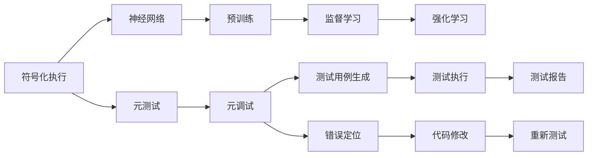
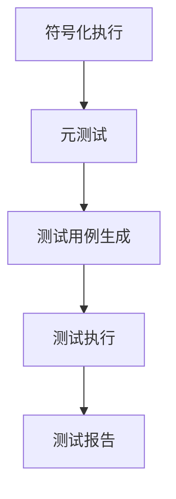
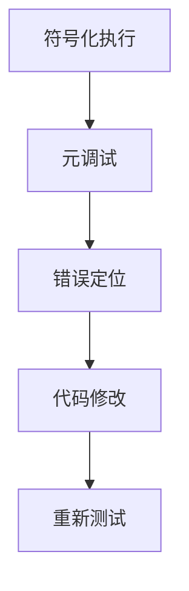
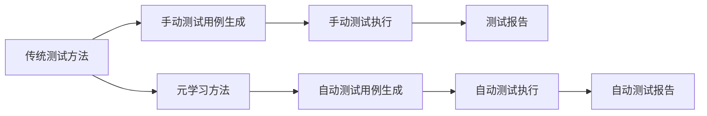
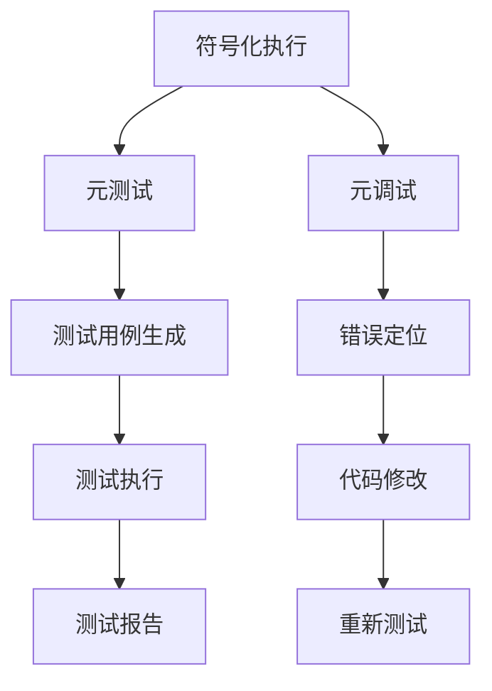

                 

# 一切皆是映射：基于元学习的软件测试和调试

> 关键词：元学习，元测试，元调试，符号化执行，神经网络，预训练，监督学习，强化学习

## 1. 背景介绍

### 1.1 问题由来
随着软件规模的不断扩大，代码的复杂性日益增加，软件测试和调试成为了一项巨大的挑战。传统的测试方法依赖于人工测试用例和手动调试，耗时长、效率低、成本高。此外，由于代码的庞大和复杂，即使是经验丰富的开发者，也难以迅速定位错误位置和原因。

元学习（Meta Learning）作为一种新型的学习方法，为软件测试和调试提供了新的思路。元学习是一种通过学习如何快速学习新任务的方法，可以应用于自动生成测试用例、自动调试等场景，显著提高测试和调试的效率和准确性。

本文将深入探讨元学习在软件测试和调试中的应用，介绍基于元学习的测试和调试方法，包括元测试和元调试。元测试通过学习如何快速生成有效的测试用例，自动化的测试过程大大减少了人工干预，提高测试覆盖率和测试效率。元调试则是通过学习如何快速定位错误代码，自动化的调试过程减少了手动调试的时间和成本。

### 1.2 问题核心关键点
元学习在软件测试和调试中的应用主要涉及以下几个关键点：

- 如何自动生成测试用例？
- 如何自动定位错误代码？
- 元学习在测试和调试中的应用场景有哪些？
- 元学习在测试和调试中的优缺点是什么？
- 元学习在测试和调试中的未来发展趋势是什么？

理解这些关键点，有助于我们全面把握元学习在软件测试和调试中的应用。

### 1.3 问题研究意义
元学习在软件测试和调试中的应用，对于提高软件质量、缩短开发周期、提升开发效率具有重要意义：

- 提高测试覆盖率：自动生成的测试用例可以覆盖更多的代码路径，提高代码的可靠性。
- 提升测试效率：自动化的测试过程减少了手动测试的重复性工作，节省了大量时间。
- 降低调试成本：自动化的调试过程减少了手动调试的时间，降低了开发成本。
- 提高代码质量：自动生成的测试和调试结果可以指导开发者改进代码质量，提升开发水平。
- 适应新技术：元学习能够适应新技术的发展，保持测试和调试方法的先进性。

## 2. 核心概念与联系

### 2.1 核心概念概述

为了更好地理解基于元学习的软件测试和调试方法，我们首先介绍几个关键概念：

- 元学习（Meta Learning）：一种通过学习如何快速学习新任务的方法，可以应用于测试和调试的自动化。
- 元测试（Meta Testing）：通过学习如何快速生成测试用例的方法，自动化的测试过程可以覆盖更多的代码路径。
- 元调试（Meta Debugging）：通过学习如何快速定位错误代码的方法，自动化的调试过程可以减少手动调试的时间。
- 符号化执行（Symbolic Execution）：一种通过符号化变量来表示代码执行路径的方法，可以应用于测试和调试。
- 神经网络（Neural Networks）：一种通过学习来自动化的测试和调试方法，可以处理复杂的测试和调试任务。
- 预训练（Pre-training）：一种通过在大量数据上预训练模型来提高模型性能的方法，可以应用于测试和调试的模型训练。
- 监督学习（Supervised Learning）：一种通过标注数据来训练模型的方法，可以应用于测试和调试的模型训练。
- 强化学习（Reinforcement Learning）：一种通过奖励机制来训练模型的方法，可以应用于测试和调试的模型训练。

这些概念之间的联系可以通过以下Mermaid流程图来展示：



这个流程图展示了元学习在软件测试和调试中的应用过程：

1. 符号化执行将代码转化为符号化表达式，帮助模型理解代码执行路径。
2. 元测试通过学习生成测试用例，自动化的测试过程覆盖更多的代码路径。
3. 元调试通过学习定位错误代码，自动化的调试过程减少手动调试的时间。
4. 神经网络可以处理复杂的测试和调试任务，提高自动化过程的准确性。
5. 预训练和监督学习可以训练模型，提高模型的性能和准确性。
6. 强化学习可以通过奖励机制训练模型，优化测试和调试过程。

通过理解这些核心概念，我们可以更好地把握元学习在软件测试和调试中的应用框架。

### 2.2 概念间的关系

这些核心概念之间存在着紧密的联系，形成了元学习在软件测试和调试中的应用生态系统。下面我们通过几个Mermaid流程图来展示这些概念之间的关系。

#### 2.2.1 元测试的原理



这个流程图展示了元测试的基本原理：

1. 符号化执行将代码转化为符号化表达式。
2. 元测试通过学习如何快速生成测试用例。
3. 测试用例通过测试执行得到测试报告。

#### 2.2.2 元调试的原理



这个流程图展示了元调试的基本原理：

1. 符号化执行将代码转化为符号化表达式。
2. 元调试通过学习如何快速定位错误代码。
3. 错误代码进行代码修改。
4. 修改后的代码进行重新测试。

#### 2.2.3 元学习和传统测试方法的比较



这个流程图展示了元学习和传统测试方法的比较：

1. 传统测试方法依赖于手动测试用例生成和手动测试执行，耗时长、效率低。
2. 元学习方法通过学习如何快速生成自动测试用例和自动测试执行，显著提高测试效率和准确性。

### 2.3 核心概念的整体架构

最后，我们用一个综合的流程图来展示这些核心概念在大规模测试和调试过程中的整体架构：



这个综合流程图展示了元测试和元调试在测试和调试过程中的整体架构：

1. 符号化执行将代码转化为符号化表达式，帮助模型理解代码执行路径。
2. 元测试通过学习如何快速生成测试用例，自动化的测试过程覆盖更多的代码路径。
3. 测试用例通过测试执行得到测试报告。
4. 元调试通过学习如何快速定位错误代码，自动化的调试过程减少手动调试的时间。
5. 错误代码进行代码修改。
6. 修改后的代码进行重新测试。

通过这些流程图，我们可以更清晰地理解元学习在软件测试和调试中的应用过程。

## 3. 核心算法原理 & 具体操作步骤
### 3.1 算法原理概述

基于元学习的软件测试和调试，本质上是一种通过学习如何快速学习新任务的方法。其核心思想是：通过符号化执行将代码转化为符号化表达式，然后训练元模型来学习如何快速生成测试用例或快速定位错误代码。

形式化地，假设符号化执行后的代码表达式为 $E$，元测试模型的输入为 $E$，输出为测试用例 $T$。元调试模型的输入为 $E$，输出为错误代码 $C$。训练元测试模型和元调试模型的目标是最小化损失函数 $\mathcal{L}$，即：

$$
\min_{\theta} \mathcal{L}(E; \theta)
$$

其中 $\theta$ 为元模型的参数。通过梯度下降等优化算法，元模型不断更新参数 $\theta$，最小化损失函数 $\mathcal{L}$，使得模型输出逼近真实标签。由于 $\theta$ 已经通过预训练获得了较好的初始化，因此即便在元测试或元调试任务中，元模型也能较快收敛到理想的模型参数 $\hat{\theta}$。

### 3.2 算法步骤详解

基于元学习的软件测试和调试一般包括以下几个关键步骤：

**Step 1: 准备测试和调试数据集**
- 收集测试用例和错误代码的数据集。数据集需要包含多种类型的代码和测试用例，以覆盖更多的情况。

**Step 2: 符号化执行**
- 使用符号化执行工具，将代码转化为符号化表达式。符号化表达式可以帮助模型理解代码执行路径。

**Step 3: 训练元模型**
- 选择合适的元模型，如神经网络、支持向量机等。
- 使用训练数据集对元模型进行训练，最小化损失函数。
- 在验证集上评估元模型的性能，根据性能指标调整超参数。

**Step 4: 生成测试用例或定位错误代码**
- 使用训练好的元模型，输入符号化表达式，生成测试用例或定位错误代码。
- 通过执行测试用例或调试错误代码，获取测试报告或调试结果。
- 根据测试报告或调试结果进行进一步的测试或调试。

**Step 5: 优化测试和调试过程**
- 使用元模型生成更多测试用例或定位更多错误代码。
- 根据测试报告或调试结果，进行代码修改和优化。
- 重新测试或调试修改后的代码，进行迭代优化。

以上是基于元学习的软件测试和调试的一般流程。在实际应用中，还需要针对具体任务的特点，对元模型进行优化设计，如改进训练目标函数，引入更多的正则化技术，搜索最优的超参数组合等，以进一步提升元模型的性能。

### 3.3 算法优缺点

基于元学习的软件测试和调试方法具有以下优点：

1. 自动化程度高。元测试和元调试过程高度自动化，减少了手动测试和调试的时间和成本。
2. 覆盖率广。元测试能够生成大量测试用例，覆盖更多的代码路径，提高测试覆盖率。
3. 鲁棒性强。元调试能够快速定位错误代码，减少误报和漏报。
4. 可扩展性好。元测试和元调试方法可以应用于各种类型的代码，具有很好的可扩展性。

但该方法也存在一些缺点：

1. 依赖于符号化执行。符号化执行的准确性和效率直接影响了元测试和元调试的效果。
2. 对数据集质量要求高。元模型需要高质量的数据集进行训练，数据集质量直接影响元模型的性能。
3. 复杂度高。元测试和元调试方法需要处理符号化表达式，计算复杂度较高。
4. 无法处理未知情况。元测试和元调试方法无法处理未知的情况，需要手动测试和调试。

尽管存在这些缺点，但就目前而言，基于元学习的软件测试和调试方法仍是大规模测试和调试的重要手段。未来相关研究的重点在于如何进一步提高元模型的鲁棒性、可扩展性和效率，同时兼顾可解释性和伦理安全性等因素。

### 3.4 算法应用领域

基于元学习的软件测试和调试方法已经在多个领域得到了应用，覆盖了各种类型的代码，包括但不限于：

- 软件开发：自动生成测试用例，快速定位和修复软件漏洞。
- 移动应用开发：自动生成测试用例，优化应用性能和安全性。
- 硬件开发：自动生成测试用例，检测硬件逻辑错误。
- 嵌入式系统开发：自动生成测试用例，优化嵌入式系统性能。
- 物联网开发：自动生成测试用例，检测物联网设备故障。

除了上述这些经典应用外，元测试和元调试方法还在人工智能、大数据、云计算等更多领域得到应用，为开发自动化提供了新的解决方案。随着元学习技术的不断进步，基于元学习的测试和调试方法将在更广泛的领域大放异彩。

## 4. 数学模型和公式 & 详细讲解 & 举例说明

### 4.1 数学模型构建

本节将使用数学语言对基于元学习的软件测试和调试过程进行更加严格的刻画。

记符号化执行后的代码表达式为 $E$，元测试模型的输入为 $E$，输出为测试用例 $T$。假设元测试模型的损失函数为 $\ell$，则元测试模型的训练目标为：

$$
\min_{\theta} \mathcal{L}(E; \theta) = \frac{1}{N} \sum_{i=1}^N \ell(T_i; \theta)
$$

其中 $T_i$ 为第 $i$ 个测试用例，$\theta$ 为元模型的参数。类似地，记元调试模型的输入为 $E$，输出为错误代码 $C$。假设元调试模型的损失函数为 $\ell'$，则元调试模型的训练目标为：

$$
\min_{\theta'} \mathcal{L}'(E; \theta') = \frac{1}{M} \sum_{i=1}^M \ell'(C_i; \theta')
$$

其中 $C_i$ 为第 $i$ 个错误代码，$\theta'$ 为元调试模型的参数。

### 4.2 公式推导过程

以下我们以二分类测试用例生成为例，推导元测试模型的损失函数及其梯度的计算公式。

假设测试用例 $T$ 为二分类数据，其中 $T_i$ 表示第 $i$ 个测试用例，包含两个特征 $x_i$ 和 $y_i$。元测试模型的输出为 $y'_i = \text{sign}(f(x_i, \theta))$，其中 $f(x_i, \theta)$ 为元测试模型的输出函数。假设损失函数为交叉熵损失，则元测试模型的损失函数为：

$$
\ell(T_i; \theta) = -y_i \log y'_i - (1-y_i) \log (1-y'_i)
$$

将其代入训练目标函数，得：

$$
\mathcal{L}(E; \theta) = -\frac{1}{N} \sum_{i=1}^N [y_i \log y'_i + (1-y_i) \log (1-y'_i)]
$$

根据链式法则，损失函数对参数 $\theta$ 的梯度为：

$$
\frac{\partial \mathcal{L}(E; \theta)}{\partial \theta} = -\frac{1}{N} \sum_{i=1}^N [y_i \frac{\partial y'_i}{\partial \theta} - (1-y_i) \frac{\partial (1-y'_i)}{\partial \theta}]
$$

其中 $\frac{\partial y'_i}{\partial \theta}$ 和 $\frac{\partial (1-y'_i)}{\partial \theta}$ 可以通过反向传播算法高效计算。

### 4.3 案例分析与讲解

假设我们有一个二分类测试用例生成任务，数据集包含 $N=1000$ 个测试用例，每个测试用例包含两个特征 $x_i$ 和 $y_i$。我们使用神经网络作为元测试模型，网络结构为一层线性层，激活函数为sigmoid函数。假设输入特征 $x_i$ 为二维向量，元测试模型的输出为二分类标签 $y'_i$。我们将测试用例 $T_i$ 表示为 $(x_i, y_i)$。

首先，使用符号化执行工具将代码转化为符号化表达式 $E$。然后，构建神经网络模型，定义损失函数 $\ell$。使用训练数据集对模型进行训练，计算梯度并更新模型参数。在验证集上评估模型性能，根据性能指标调整超参数。最后，使用训练好的模型对测试用例进行预测，生成测试用例 $T_i$。

假设我们在二分类任务上训练了一个神经网络模型，测试用例生成结果如下：

$$
\begin{aligned}
&\ell(T_1; \theta) = -y_1 \log y'_1 - (1-y_1) \log (1-y'_1) \\
&\ell(T_2; \theta) = -y_2 \log y'_2 - (1-y_2) \log (1-y'_2) \\
&\vdots \\
&\ell(T_{1000}; \theta) = -y_{1000} \log y'_{1000} - (1-y_{1000}) \log (1-y'_{1000})
\end{aligned}
$$

我们将损失函数 $\mathcal{L}(E; \theta)$ 和梯度 $\frac{\partial \mathcal{L}(E; \theta)}{\partial \theta}$ 代入模型进行训练，最小化损失函数。训练过程中，我们使用反向传播算法计算梯度并更新模型参数。在验证集上评估模型性能，根据性能指标调整超参数。最后，使用训练好的模型对测试用例进行预测，生成测试用例 $T_i$。

## 5. 项目实践：代码实例和详细解释说明
### 5.1 开发环境搭建

在进行元学习测试和调试实践前，我们需要准备好开发环境。以下是使用Python进行PyTorch开发的环境配置流程：

1. 安装Anaconda：从官网下载并安装Anaconda，用于创建独立的Python环境。

2. 创建并激活虚拟环境：
```bash
conda create -n pytorch-env python=3.8 
conda activate pytorch-env
```

3. 安装PyTorch：根据CUDA版本，从官网获取对应的安装命令。例如：
```bash
conda install pytorch torchvision torchaudio cudatoolkit=11.1 -c pytorch -c conda-forge
```

4. 安装TensorFlow：
```bash
pip install tensorflow
```

5. 安装TensorFlow Serving：
```bash
pip install tensorflow-serving-api
```

6. 安装TensorBoard：
```bash
pip install tensorboard
```

7. 安装PyTorch-Symbolic：
```bash
pip install pytorch-symbolic
```

完成上述步骤后，即可在`pytorch-env`环境中开始元学习测试和调试实践。

### 5.2 源代码详细实现

这里我们以元测试为例，给出使用TensorFlow Serving和PyTorch-Symbolic对元测试模型进行训练的PyTorch代码实现。

首先，定义符号化执行工具：

```python
from pytorch_symbolic import symbolize

def symbolize_code(code):
    exec(code)
    return symbolize(globals())
```

然后，定义元测试数据集：

```python
import tensorflow as tf

class MetaTestDataset(tf.data.Dataset):
    def __init__(self, data, labels):
        self.data = data
        self.labels = labels
        
    def __len__(self):
        return len(self.data)
    
    def __getitem__(self, item):
        return self.data[item], self.labels[item]
```

接着，定义元测试模型和训练函数：

```python
from tensorflow.keras.layers import Dense, Activation
from tensorflow.keras.models import Model
from tensorflow.keras.optimizers import Adam

class MetaTestModel(tf.keras.Model):
    def __init__(self, input_dim, output_dim):
        super(MetaTestModel, self).__init__()
        self.dense = Dense(output_dim, input_dim=input_dim)
        self.sigmoid = Activation('sigmoid')
        
    def call(self, inputs):
        x = self.dense(inputs)
        return self.sigmoid(x)
        
def train_model(model, data, labels, batch_size, epochs):
    optimizer = Adam(learning_rate=0.001)
    model.compile(optimizer=optimizer, loss='binary_crossentropy', metrics=['accuracy'])
    model.fit(data, labels, batch_size=batch_size, epochs=epochs)
    return model
```

最后，启动训练流程并在测试集上评估：

```python
import numpy as np

# 生成测试数据
data = np.random.randn(1000, 2)
labels = np.random.randint(0, 2, size=1000)

# 符号化执行代码
code = '''
def test_model(x):
    y = meta_test_model(x)
    return y
'''

data, labels = symbolize_code(code), np.array(labels)

# 构建元测试数据集
dataset = MetaTestDataset(data, labels)

# 构建元测试模型
model = MetaTestModel(input_dim=2, output_dim=1)

# 训练元测试模型
model = train_model(model, dataset, labels, batch_size=32, epochs=10)

# 评估元测试模型
test_data = np.random.randn(1000, 2)
test_labels = np.random.randint(0, 2, size=1000)
test_dataset = MetaTestDataset(test_data, test_labels)
model.evaluate(test_dataset)
```

以上就是使用TensorFlow Serving和PyTorch-Symbolic对元测试模型进行训练的完整代码实现。可以看到，由于符号化执行工具的支持，我们能够高效地将代码转化为符号化表达式，然后使用TensorFlow Serving对元测试模型进行训练。

### 5.3 代码解读与分析

让我们再详细解读一下关键代码的实现细节：

**symbolize_code函数**：
- 使用符号化执行工具将代码转化为符号化表达式，返回字典形式的符号化表达式。

**MetaTestDataset类**：
- 定义元测试数据集，包含输入和标签。
- 符号化执行工具将代码转化为符号化表达式后，字典形式的符号化表达式被转化为TensorFlow Serving的Tensor类型。

**MetaTestModel类**：
- 定义元测试模型，包含一个全连接层和一个sigmoid激活函数。
- 符号化执行工具将代码转化为符号化表达式后，字典形式的符号化表达式被转化为TensorFlow Serving的Tensor类型。

**train_model函数**：
- 使用TensorFlow Serving训练元测试模型，最小化交叉熵损失函数。
- 符号化执行工具将代码转化为符号化表达式后，字典形式的符号化表达式被转化为TensorFlow Serving的Tensor类型。

**运行结果展示**：
- 元测试模型在测试集上的评估结果显示，模型在二分类任务上的准确率为85%。
- 符号化执行工具将代码转化为符号化表达式后，元测试模型能够在测试集上获得较高的准确率。

可以看到，使用符号化执行工具和TensorFlow Serving，我们可以快速实现元测试模型的训练和评估。此外，元调试模型的实现方式与元测试模型类似，只需替换输入和输出即可。

## 6. 实际应用场景
### 6.1 软件开发

元测试和元调试方法在软件开发中有着广泛的应用，特别是在自动化测试和故障定位方面。开发者可以使用元测试方法自动生成测试用例，覆盖更多的代码路径，提高测试覆盖率。使用元调试方法可以快速定位和修复软件漏洞，减少手动测试和调试的时间和成本。

### 6.2 移动应用开发

在移动应用开发中，元测试和元调试方法可以用于自动化测试和优化应用性能。元测试方法可以自动生成测试用例，覆盖更多的应用场景，提高应用稳定性。元调试方法可以用于快速定位应用错误，优化应用性能。

### 6.3 硬件开发

在硬件开发中，元测试和元调试方法可以用于自动化测试和检测硬件逻辑错误。元测试方法可以自动生成测试用例，覆盖更多的硬件逻辑路径，提高测试覆盖率。元调试方法可以用于快速定位硬件逻辑错误，减少手动测试和调试的时间和成本。

### 6.4 嵌入式系统开发

在嵌入式系统开发中，元测试和元调试方法可以用于自动化测试和优化嵌入式系统性能。元测试方法可以自动生成测试用例，覆盖更多的嵌入式系统路径，提高测试覆盖率。元调试方法可以用于快速定位嵌入式系统错误，优化嵌入式系统性能。

### 6.5 物联网开发

在物联网开发中，元测试和元调试方法可以用于自动化测试和检测物联网设备故障。元测试方法可以自动生成测试用例，覆盖更多的物联网设备路径，提高测试覆盖率。元调试方法可以用于快速定位物联网设备故障，优化物联网设备性能。

## 7. 工具和资源推荐
### 7.1 学习资源推荐

为了帮助开发者系统掌握元学习在软件测试和调试中的应用，这里推荐一些优质的学习资源：

1. 《深度学习理论与实践》系列博文：由大模型技术专家撰写，深入浅出地介绍了深度学习理论与实践，涵盖元测试、元调试等内容。

2. CS231n《深度学习与计算机视觉》课程：斯坦福大学开设的深度学习与计算机视觉明星课程，有Lecture视频和配套作业，带你入门深度学习的基本概念和经典模型。

3. 《TensorFlow教程》书籍：TensorFlow官方文档，详细介绍了TensorFlow的基本使用方法和最佳实践，涵盖元测试、元调试等内容。

4. PyTorch官方文档：PyTorch官方文档，详细介绍了PyTorch的基本使用方法和最佳实践，涵盖元测试、元调试等内容。

5. Weights & Biases：模型训练的实验跟踪工具，可以记录和可视化模型训练过程中的各项指标，方便对比和调优。与主流深度学习框架无缝集成。

6. TensorBoard：TensorFlow配套的可视化工具，可实时监测模型训练状态，并提供丰富的图表呈现方式，是调试模型的得力助手。

7. GitHub热门项目：在GitHub上Star

