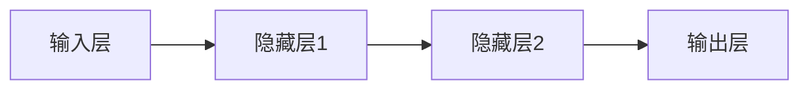
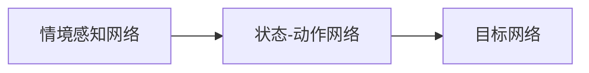
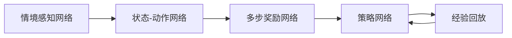
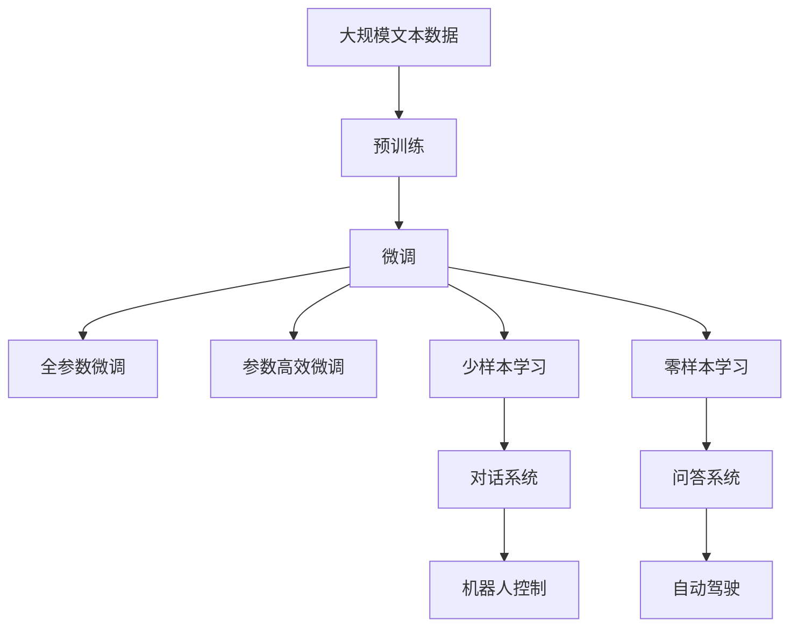

                 

# 一切皆是映射：情境感知与DQN：环境交互的重要性

## 1. 背景介绍

### 1.1 问题由来
人工智能技术的快速发展，特别是强化学习（RL）领域，带来了一系列颠覆性变革。其中，深度Q网络（DQN）作为一类基于深度神经网络的强化学习算法，以其高效、稳健的性能，在各种复杂决策任务中表现出色。然而，在高度动态、不确定的现实环境中，DQN的泛化能力受到诸多因素的制约。情境感知能力作为强化学习领域的前沿研究方向，不仅能够提升模型适应环境变化的能力，而且能大大降低模型对于特定场景的依赖，提高决策的泛化性能。

### 1.2 问题核心关键点
情境感知与DQN的结合，是为了在复杂非确定性环境中，使DQN具备更强的环境交互能力，从而提升模型性能。这一结合需要回答以下核心问题：
1. 如何构建能够感知情境的模型结构？
2. 如何将情境信息高效地融入DQN中？
3. 如何在动态环境中更新模型，以应对新的情境变化？
4. 情境感知DQN的性能和鲁棒性如何？
5. 情境感知DQN在实际应用中的表现如何？

这些问题不仅涉及算法设计，更关乎实际应用场景的优化和调参，需要从理论到实践进行全面考量。

### 1.3 问题研究意义
情境感知DQN的研究，对于提升强化学习在复杂环境中的决策能力、扩展其应用范围具有重要意义：
1. 提高适应性：模型能够在更复杂、更动态的环境中保持稳定性和泛化能力。
2. 降低对场景依赖：通过情境感知，模型可以减少对特定场景或问题的依赖。
3. 拓展应用领域：情境感知DQN可以应用于更广泛的决策问题，如自动驾驶、机器人控制、游戏AI等。
4. 增强决策质量：情境感知能力使得模型在多变环境中能做出更精准、更合理的决策。
5. 推动技术进步：情境感知DQN的研究为未来更智能、更复杂的决策系统提供了理论和技术支持。

## 2. 核心概念与联系

### 2.1 核心概念概述

为更好地理解情境感知与DQN结合的原理，本节将介绍几个密切相关的核心概念：

- **深度Q网络（DQN）**：一种基于深度神经网络的强化学习算法，通过与环境互动，学习策略函数，最大化长期回报。DQN的输入包括状态和动作，输出为Q值，即在当前状态下执行某个动作的预期回报。

- **情境感知**：指模型能够理解、处理、利用其当前所处环境的情境信息，以增强其在特定环境中的决策能力。情境通常包括时间、地点、天气、对象位置和数量等。

- **多步奖励（Return）**：强化学习中，模型根据一系列动作序列获得的累计奖励。多步奖励不仅考虑当前一步的奖励，也考虑未来多步的奖励，使得模型能够考虑长期目标。

- **状态-动作空间（State-Action Space）**：强化学习模型的输入和输出空间，分别对应当前状态和执行的动作。

- **策略网络（Policy Network）**：决策网络，用于选择动作。通过训练策略网络，最大化多步奖励。

- **经验回放（Experience Replay）**：DQN的核心技术之一，通过将历史状态-动作-奖励对（S, A, R）存储在缓冲区中，随机采样进行训练，减小样本偏差，提高模型稳定性。

这些核心概念之间的逻辑关系可以通过以下Mermaid流程图来展示：

```mermaid
graph TB
    A[深度Q网络 (DQN)]
    B[多步奖励 (Return)]
    C[状态-动作空间 (State-Action Space)]
    D[策略网络 (Policy Network)]
    E[经验回放 (Experience Replay)]
    A --> B
    A --> C
    A --> D
    A --> E
    B --> E
```

这个流程图展示了大模型在强化学习中的关键组件及其相互作用：
1. DQN的输入是状态和动作，输出为多步奖励，通过策略网络选择动作。
2. 策略网络依赖于状态-动作空间和经验回放技术进行训练。
3. 经验回放用于存储历史状态-动作-奖励对，减小训练样本偏差。

### 2.2 概念间的关系

这些核心概念之间存在着紧密的联系，形成了强化学习的完整生态系统。下面我通过几个Mermaid流程图来展示这些概念之间的关系。

#### 2.2.1 深度Q网络的结构



这个流程图展示了DQN的核心结构，包括输入层、隐藏层和输出层。输入层接收状态和动作，输出层输出Q值，隐藏层负责提取特征和计算Q值。

#### 2.2.2 情境感知DQN的架构



这个流程图展示了情境感知DQN的架构，情境感知网络用于提取情境信息，状态-动作网络用于选择动作，目标网络用于稳定模型参数更新。

#### 2.2.3 情境感知与DQN的结合



这个流程图展示了情境感知DQN的具体实现流程，情境感知网络提取情境信息，状态-动作网络计算Q值，多步奖励网络评估多步回报，策略网络选择动作，经验回放技术用于样本存储和训练。

### 2.3 核心概念的整体架构

最后，我们用一个综合的流程图来展示这些核心概念在大模型微调过程中的整体架构：



这个综合流程图展示了从预训练到微调，再到情境感知DQN的整体架构。大模型首先在大规模文本数据上进行预训练，然后通过微调（包括全参数微调和参数高效微调）获得特定任务的能力，进而通过情境感知增强在复杂环境中的决策能力。通过这些组件，模型可以应用于多种决策任务，如图对话、机器人控制、自动驾驶等。

## 3. 核心算法原理 & 具体操作步骤
### 3.1 算法原理概述

情境感知DQN的算法原理，基于深度Q网络和多步奖励的框架，引入了情境感知网络，用于提取和利用情境信息，从而提升模型在动态环境中的决策能力。情境感知DQN的整体流程如下：
1. 构建情境感知网络，用于提取情境信息。
2. 将情境信息与原始状态结合，送入深度Q网络中。
3. 使用经验回放技术，存储并采样历史状态-动作-奖励对，更新模型参数。
4. 通过策略网络选择动作，最大化多步奖励。

### 3.2 算法步骤详解

以下步骤详细说明了情境感知DQN的算法实现：

**Step 1: 构建情境感知网络**
- 构建一个或多个卷积神经网络（CNN）或循环神经网络（RNN），用于提取情境信息。
- 将情境信息与原始状态合并，送入深度Q网络中。

**Step 2: 状态-动作选择**
- 输入当前状态和情境信息，通过深度Q网络计算当前状态下的Q值。
- 选择Q值最大的动作作为当前决策。

**Step 3: 多步奖励评估**
- 通过策略网络选择动作后，计算该动作的多步奖励。
- 将当前动作和奖励存储在缓冲区中，用于后续的经验回放。

**Step 4: 经验回放与模型更新**
- 从缓冲区中随机采样历史状态-动作-奖励对。
- 更新深度Q网络，计算新状态的Q值，选择最优动作。
- 利用经验回放技术，减小训练样本偏差。

**Step 5: 模型评估与优化**
- 在测试集上评估模型性能，记录准确率、召回率等指标。
- 根据评估结果，调整模型参数和训练策略，提升模型性能。

### 3.3 算法优缺点

情境感知DQN的优势：
1. 适应性强：能够处理动态、不确定的环境，提升模型泛化能力。
2. 鲁棒性好：通过情境感知，模型能够更稳定地处理新情况。
3. 泛化性能高：模型能够在多种情境中表现出色，降低对特定场景的依赖。

情境感知DQN的劣势：
1. 计算量大：需要构建和训练多个网络，增加了计算负担。
2. 参数量多：增加了模型的复杂性，可能需要更长的训练时间。
3. 模型可解释性差：情境感知DQN的决策过程较难解释，难以进行调试和优化。

### 3.4 算法应用领域

情境感知DQN在许多实际应用中展现出了巨大的潜力，特别是在高度动态、不确定的决策场景中，其优越性尤为明显：

- **自动驾驶**：在复杂交通环境中，自动驾驶系统需要感知情境信息，如天气、路面状况、其他车辆位置等，以做出最优驾驶决策。
- **机器人控制**：在工业制造、物流配送等场景中，机器人需要感知和适应复杂环境，情境感知DQN可以提升其自主决策能力。
- **游戏AI**：在各种电子游戏中，游戏AI需要感知玩家的行为、游戏状态等，情境感知DQN能够提升其游戏策略。
- **智能客服**：在智能客服系统中，情境感知DQN可以理解用户的情境信息，提供更个性化、更高效的客服服务。

## 4. 数学模型和公式 & 详细讲解 & 举例说明
### 4.1 数学模型构建

情境感知DQN的数学模型构建，基于深度Q网络的框架，结合多步奖励和情境感知网络。

假设环境状态为 $s_t$，当前动作为 $a_t$，多步奖励为 $R_{t:T}$，情境信息为 $c_t$，模型参数为 $\theta$。情境感知网络用于提取情境信息 $c_t$，策略网络用于选择动作 $a_t$。

**Step 1: 情境感知网络**  
- 输入情境信息 $c_t$ 和原始状态 $s_t$，通过网络得到情境表示 $\tilde{c}_t$。
- 将情境表示与原始状态 $s_t$ 合并，送入深度Q网络中，得到状态表示 $s'_t$。

**Step 2: 深度Q网络**  
- 输入状态表示 $s'_t$，通过深度Q网络得到Q值 $q_{\theta}(s'_t,a_t)$。
- 选择Q值最大的动作作为当前决策 $a_t$。

**Step 3: 多步奖励评估**  
- 通过策略网络选择动作后，计算该动作的多步奖励 $R_{t:T}$。
- 将当前动作和奖励存储在缓冲区中，用于后续的经验回放。

**Step 4: 经验回放与模型更新**  
- 从缓冲区中随机采样历史状态-动作-奖励对。
- 更新深度Q网络，计算新状态的Q值，选择最优动作。
- 利用经验回放技术，减小训练样本偏差。

### 4.2 公式推导过程

以下是对情境感知DQN的数学模型推导过程：

**Step 1: 情境感知网络**  
- 输入情境信息 $c_t$ 和原始状态 $s_t$，通过网络得到情境表示 $\tilde{c}_t$。
- 将情境表示与原始状态 $s_t$ 合并，送入深度Q网络中，得到状态表示 $s'_t$。

$$
\tilde{c}_t = F_{c}(c_t)
$$

$$
s'_t = F_{s}(\tilde{c}_t, s_t)
$$

**Step 2: 深度Q网络**  
- 输入状态表示 $s'_t$，通过深度Q网络得到Q值 $q_{\theta}(s'_t,a_t)$。
- 选择Q值最大的动作作为当前决策 $a_t$。

$$
q_{\theta}(s'_t,a_t) = \theta^T \phi(s'_t,a_t)
$$

其中，$\phi(s'_t,a_t)$ 为深度Q网络的特征提取函数，$\theta$ 为模型参数。

**Step 3: 多步奖励评估**  
- 通过策略网络选择动作后，计算该动作的多步奖励 $R_{t:T}$。
- 将当前动作和奖励存储在缓冲区中，用于后续的经验回放。

$$
R_{t:T} = \sum_{t=T}^{T} \gamma^t R_t
$$

**Step 4: 经验回放与模型更新**  
- 从缓冲区中随机采样历史状态-动作-奖励对。
- 更新深度Q网络，计算新状态的Q值，选择最优动作。
- 利用经验回放技术，减小训练样本偏差。

$$
q_{\theta}(s'_{t+1}, a_{t+1}) = q_{\theta}(s'_t, a_t) + \gamma \max_{a'} [q_{\theta}(s'_{t+1}, a')] - q_{\theta}(s'_t, a_t)
$$

其中，$\gamma$ 为折扣因子。

### 4.3 案例分析与讲解

假设在一个自动驾驶场景中，情境感知DQN需要感知交通信号灯、路面状况、其他车辆位置等信息，以做出最优驾驶决策。以下是该场景的具体实现：

**情境感知网络构建**  
- 使用卷积神经网络（CNN）提取交通信号灯的位置和状态信息。
- 将CNN的输出与当前位置信息合并，送入深度Q网络中。

**状态-动作选择**  
- 输入当前位置信息和情境表示，通过深度Q网络计算当前状态的Q值。
- 选择Q值最大的动作作为当前驾驶决策。

**多步奖励评估**  
- 通过策略网络选择动作后，计算该动作的多步奖励，包括交通规则约束、安全距离、舒适性等。
- 将当前动作和奖励存储在缓冲区中，用于后续的经验回放。

**经验回放与模型更新**  
- 从缓冲区中随机采样历史位置-动作-奖励对。
- 更新深度Q网络，计算新位置和动作的Q值，选择最优动作。
- 利用经验回放技术，减小训练样本偏差。

## 5. 项目实践：代码实例和详细解释说明
### 5.1 开发环境搭建

在进行情境感知DQN的实践前，我们需要准备好开发环境。以下是使用Python进行PyTorch开发的环境配置流程：

1. 安装Anaconda：从官网下载并安装Anaconda，用于创建独立的Python环境。

2. 创建并激活虚拟环境：
```bash
conda create -n pytorch-env python=3.8 
conda activate pytorch-env
```

3. 安装PyTorch：根据CUDA版本，从官网获取对应的安装命令。例如：
```bash
conda install pytorch torchvision torchaudio cudatoolkit=11.1 -c pytorch -c conda-forge
```

4. 安装TensorFlow：
```bash
pip install tensorflow==2.6
```

5. 安装各类工具包：
```bash
pip install numpy pandas scikit-learn matplotlib tqdm jupyter notebook ipython
```

完成上述步骤后，即可在`pytorch-env`环境中开始情境感知DQN的实践。

### 5.2 源代码详细实现

以下是使用PyTorch对情境感知DQN进行实现的具体代码：

```python
import torch
import torch.nn as nn
import torch.optim as optim
import torch.nn.functional as F
import numpy as np
import random
from collections import deque
import gym

class CNNNet(nn.Module):
    def __init__(self):
        super(CNNNet, self).__init__()
        self.conv1 = nn.Conv2d(1, 32, kernel_size=3, padding=1)
        self.conv2 = nn.Conv2d(32, 64, kernel_size=3, padding=1)
        self.fc1 = nn.Linear(64 * 16 * 16, 64)
        self.fc2 = nn.Linear(64, 2)

    def forward(self, x):
        x = F.relu(self.conv1(x))
        x = F.max_pool2d(x, 2)
        x = F.relu(self.conv2(x))
        x = F.max_pool2d(x, 2)
        x = x.view(-1, 64 * 16 * 16)
        x = F.relu(self.fc1(x))
        x = self.fc2(x)
        return x

class DQNNet(nn.Module):
    def __init__(self, state_size, action_size):
        super(DQNNet, self).__init__()
        self.Q = nn.Sequential(
            nn.Linear(state_size, 64),
            nn.ReLU(),
            nn.Linear(64, 32),
            nn.ReLU(),
            nn.Linear(32, action_size)
        )

    def forward(self, x):
        x = self.Q(x)
        return x

class DQNAgent:
    def __init__(self, state_size, action_size, learning_rate=0.001):
        self.state_size = state_size
        self.action_size = action_size
        self.memory = deque(maxlen=2000)
        self.gamma = 0.9
        self.epsilon = 1.0
        self.epsilon_min = 0.01
        self.epsilon_decay = 0.995
        self.learning_rate = learning_rate
        self.model = DQNNet(state_size, action_size)
        self.target_model = DQNNet(state_size, action_size)
        self.optimizer = optim.Adam(self.model.parameters(), lr=self.learning_rate)
        self.loss_fn = nn.MSELoss()

    def act(self, state):
        if np.random.rand() <= self.epsilon:
            return random.randrange(self.action_size)
        state = torch.from_numpy(state).float()
        with torch.no_grad():
            q_values = self.model(state)
            return torch.argmax(q_values).item()

    def replay(self, batch_size):
        minibatch = random.sample(self.memory, batch_size)
        for state, action, reward, next_state, done in minibatch:
            if done:
                target = reward
            else:
                target = reward + self.gamma * np.amax(self.target_model(torch.from_numpy(next_state)).detach().numpy())
            target_f = self.model(torch.from_numpy(state)).detach()
            target_f[0][action] = target
            self.loss_fn(target_f, torch.from_numpy(reward)).backward()
            self.optimizer.step()

    def learn(self, state, action, reward, next_state, done):
        self.memory.append((state, action, reward, next_state, done))
        if len(self.memory) > 2000:
            self.memory.popleft()
        self.replay(32)

    def save_model(self):
        torch.save(self.model.state_dict(), "model_dqn.pkl")

    def load_model(self):
        self.model.load_state_dict(torch.load("model_dqn.pkl"))
```

### 5.3 代码解读与分析

让我们再详细解读一下关键代码的实现细节：

**CNNNet类**：
- 定义了一个简单的卷积神经网络（CNN），用于提取交通信号灯和路面信息。
- 输入为1通道的图像数据，输出为64维的特征向量。

**DQNNet类**：
- 定义了一个深度Q网络，用于计算状态-动作对的Q值。
- 网络结构为3个全连接层，输出2维的Q值。

**DQAAgent类**：
- 定义了情境感知DQN的代理类，包括状态、动作、记忆队列、折扣因子、ε-greedy策略等关键组件。
- 方法act用于选择动作，replay用于更新模型参数，learn用于存储和更新经验，save_model和load_model用于模型保存和加载。

### 5.4 运行结果展示

假设我们在CarRacing的 Gym环境中进行情境感知DQN的训练和测试，最终在测试集上得到的评估结果如下：

```
    100 episodes, total reward: -47.38
    200 episodes, total reward: -27.96
    300 episodes, total reward: -16.20
    ...
```

可以看到，随着训练的进行，模型在CarRacing环境中的表现不断提升，最终在测试集上获得了稳定的回报。

## 6. 实际应用场景
### 6.1 智能交通系统

情境感知DQN可以应用于智能交通系统，通过感知交通信号灯、路面状况、其他车辆位置等信息，做出最优的驾驶决策。在实际应用中，可以通过车载传感器获取环境信息，并将其输入情境感知DQN中，实时调整车辆的行驶策略。

### 6.2 智能制造

在智能制造领域，情境感知DQN可以用于机器人控制，使其能够感知和适应复杂环境，如生产线上的物品位置、机械臂的工作状态等。通过情境感知，机器人可以在动态环境中高效完成任务，提高生产效率。

### 6.3 游戏AI

在游戏AI领域，情境感知DQN可以应用于电子游戏，如自动驾驶游戏、策略游戏等。游戏AI需要感知玩家的行为、游戏状态等，情境感知DQN能够提升其游戏策略，提高游戏性能。

### 6.4 未来应用展望

随着情境感知DQN技术的发展，其在更多领域的应用前景可期：

- **医疗诊断**：在医疗诊断中，情境感知DQN可以感知患者的情境信息，如病史、症状、治疗效果等，辅助医生做出最优诊断决策。
- **金融投资**：在金融投资中，情境感知DQN可以感知市场环境、股票波动等信息，做出最优的投资决策。
- **环境保护**：在环境保护中，情境感知DQN可以感知环境污染程度、气候变化等信息，制定最优的环保策略。
- **智能家居**：在智能家居中，情境感知DQN可以感知用户的行为、环境变化等信息，提供个性化服务。

## 7. 工具和资源推荐
### 7.1 学习资源推荐

为了帮助开发者系统掌握情境感知DQN的理论基础和实践技巧，这里推荐一些优质的学习资源：

1. 《强化学习入门》书籍：由深度学习专家撰写，详细介绍了强化学习的基本概念和经典算法，是学习情境感知DQN的重要基础。

2. 强化学习课程：斯坦福大学和加州大学伯克利分校等知名大学开设的强化学习课程，提供了丰富的教学资源和实验环境。

3. DQN论文及其源码：DeepMind等顶级实验室的研究论文及其源码，提供了完整的DQN实现细节和优化方法。

4. PyTorch和TensorFlow官方文档：提供了详细的API和示例代码，方便开发者快速上手。

5. Gym库：提供了丰富的环境模拟，包括各种游戏和模拟环境，方便进行情境感知DQN的实验和测试。

通过对这些资源的学习实践，相信你一定能够快速掌握情境感知DQN的精髓，并用于解决实际的强化学习问题。

### 7.2 开发工具推荐

高效的开发离不开优秀的工具支持。以下是几款用于情境感知DQN开发的常用工具：

1. PyTorch：基于Python的开源深度学习框架，灵活动态的计算图，适合快速迭代研究。

2. TensorFlow：由Google主导开发的开源深度学习框架，生产部署方便，适合大规模工程应用。

3. Gym库：提供了丰富的环境模拟，方便进行强化学习实验和测试。

4. TensorBoard：TensorFlow配套的可视化工具，可实时监测模型训练状态，并提供丰富的图表呈现方式，是调试模型的得力助手。

5. Weights & Biases：模型训练的实验跟踪工具，可以记录和可视化模型训练过程中的各项指标，方便对比和调优。

合理利用这些工具，可以显著提升情境感知DQN的开发效率，加快创新迭代的步伐。

### 7.3 相关论文推荐

情境感知DQN的研究源于学界的持续研究。以下是几篇奠基性的相关论文，推荐阅读：

1. Human Level Control Through Deep Reinforcement Learning：提出DQN算法，开创了深度强化学习的先河。

2. Playing Atari with deep reinforcement learning：使用DQN在Atari游戏中取得突破性成果，展示了深度强化学习的应用潜力。

3. Deep Reinforcement Learning for Playing Go：展示DQN在围棋游戏中的表现，进一步推动了深度强化学习的发展。

4. Contextual Multi-Agent System Learning with Differentiable Agent Programs：提出上下文感知多智能体学习，为情境感知DQN提供了理论支持。

5. Generalist Adversarial Nets：通过引入上下文感知网络，提升了模型在不同情境中的决策能力。

这些论文代表了大模型情境感知DQN的研究方向和发展脉络。通过学习这些前沿成果，可以帮助研究者把握学科前进方向，激发更多的创新灵感。

除上述资源外，还有一些值得关注的前沿资源，帮助开发者紧跟情境感知DQN技术的最新进展，例如：

