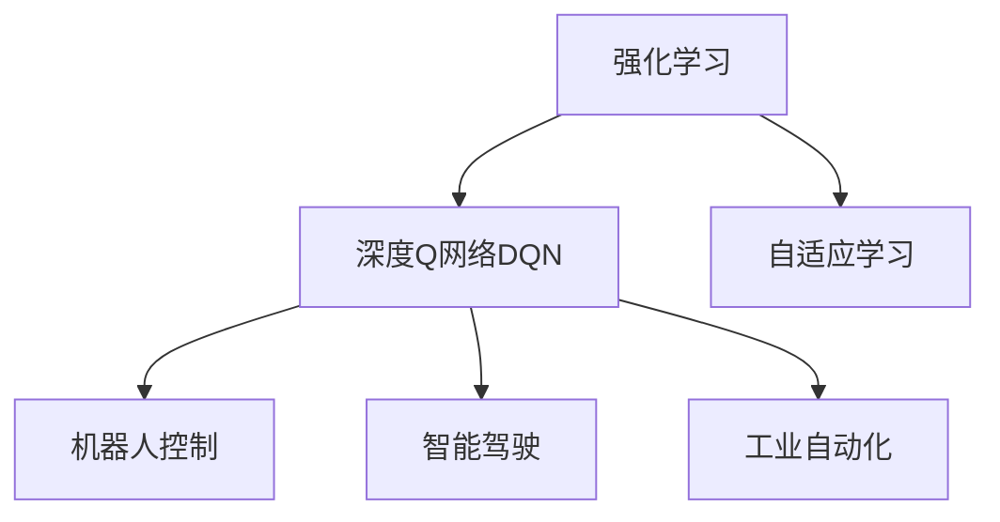
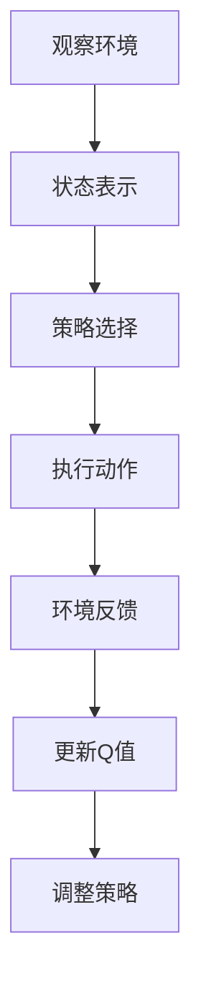
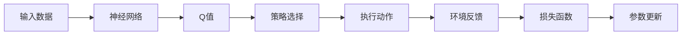
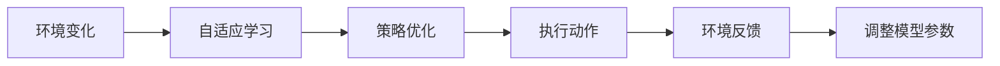
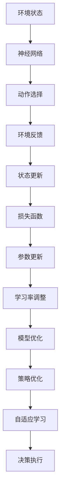

                 

# 一切皆是映射：探讨DQN在非标准环境下的适应性

> 关键词：DQN, 非标准环境, 强化学习, 自适应学习, 机器人控制, 智能驾驶

## 1. 背景介绍

### 1.1 问题由来
强化学习（Reinforcement Learning, RL）是机器学习领域的一个重要分支，通过智能体与环境交互，通过奖励信号不断优化策略以完成任务。传统的强化学习模型，如Q-learning、SARSA等，基于马尔可夫决策过程（MDP）假设，对于那些无法满足MDP假设的非标准环境，往往难以高效工作。

### 1.2 问题核心关键点
近年来，深度强化学习（Deep Reinforcement Learning, DRL）技术取得了长足进步。其中，深度Q网络（Deep Q Network, DQN）通过将神经网络与Q-learning算法结合，为解决非标准环境的强化学习问题提供了有力工具。然而，非标准环境下的DQN模型，需要适应更为复杂、多变的外界条件，这为DQN模型的设计和应用带来了新的挑战。

### 1.3 问题研究意义
研究DQN在非标准环境下的适应性问题，对于拓展DQN模型的应用范围，提升其在复杂、不确定环境下的决策能力，具有重要意义：

1. 提升决策效率。在非标准环境中，DQN可以实时获取环境反馈，通过自适应学习机制快速适应新情况。
2. 增强鲁棒性。非标准环境下的DQN模型可以通过参数更新和学习率调整，提高对异常、复杂情况的鲁棒性。
3. 促进新应用场景的发展。针对非标准环境的DQN技术可以广泛应用于智能机器人、智能驾驶、工业自动化等新兴领域，为这些领域的技术发展提供新的动力。
4. 推动研究前沿。非标准环境下的DQN研究，为强化学习理论与算法提供了新的研究思路和方法，可能催生新的研究方向和成果。

## 2. 核心概念与联系

### 2.1 核心概念概述

为更好地理解DQN在非标准环境下的适应性，本节将介绍几个密切相关的核心概念：

- 强化学习（Reinforcement Learning, RL）：通过智能体与环境交互，通过奖励信号不断优化策略以完成任务。
- 深度Q网络（Deep Q Network, DQN）：将神经网络与Q-learning算法结合，用于解决复杂环境中的强化学习问题。
- 自适应学习（Adaptive Learning）：在模型训练过程中，通过调整参数和学习率等手段，适应外界环境变化的能力。
- 机器人控制（Robot Control）：将DQN应用于机器人控制，使其能够自主完成复杂任务。
- 智能驾驶（Autonomous Driving）：将DQN应用于自动驾驶系统，通过不断学习提升驾驶决策能力。
- 工业自动化（Industrial Automation）：将DQN应用于自动化生产系统，提高生产效率和灵活性。

这些核心概念之间的逻辑关系可以通过以下Mermaid流程图来展示：



这个流程图展示了一些核心概念之间的关系：

1. 强化学习是DQN的基础，DQN在此基础上结合深度学习，提升了处理复杂问题的能力。
2. 自适应学习是DQN的重要特性，通过自适应调整模型参数和学习率，提升模型在不同环境下的适应能力。
3. DQN在机器人控制、智能驾驶、工业自动化等具体应用中，通过实时获取环境反馈，不断优化策略，提升任务完成效率。

### 2.2 概念间的关系

这些核心概念之间存在着紧密的联系，形成了DQN在非标准环境下的完整生态系统。下面我们通过几个Mermaid流程图来展示这些概念之间的关系。

#### 2.2.1 DQN的基本工作流程



这个流程图展示了DQN的基本工作流程：

1. 智能体观察环境，状态表示为当前环境状态。
2. 根据当前状态，智能体选择策略执行动作。
3. 环境给出反馈，包括奖励和其他状态信息。
4. 通过奖励信号和状态信息更新Q值。
5. 调整策略，使之更符合当前环境。

#### 2.2.2 DQN的自适应学习机制



这个流程图展示了DQN的自适应学习机制：

1. 输入数据通过神经网络得到Q值，选择策略。
2. 执行动作，获取环境反馈。
3. 通过损失函数更新Q值，优化策略。
4. 根据当前状态和Q值，调整模型参数，适应新环境。

#### 2.2.3 非标准环境下的应用场景



这个流程图展示了DQN在非标准环境下的应用场景：

1. 环境条件发生变化。
2. 通过自适应学习机制优化策略。
3. 执行动作，获取新反馈。
4. 调整模型参数，适应新环境。

### 2.3 核心概念的整体架构

最后，我们用一个综合的流程图来展示这些核心概念在DQN非标准环境下的整体架构：



这个综合流程图展示了DQN在非标准环境下的完整架构：

1. 环境状态通过神经网络得到动作选择。
2. 执行动作，获取环境反馈。
3. 状态更新，损失函数计算。
4. 参数更新，学习率调整。
5. 模型优化，策略优化。
6. 自适应学习，提高鲁棒性。
7. 决策执行，完成任务。

通过这些流程图，我们可以更清晰地理解DQN模型在非标准环境下的工作流程和关键技术点，为后续深入讨论具体的微调方法和技术奠定基础。

## 3. 核心算法原理 & 具体操作步骤
### 3.1 算法原理概述

DQN在非标准环境下的核心思想是通过自适应学习机制，使模型参数能够在运行过程中不断更新，适应外界条件变化。DQN模型的自适应学习机制主要通过以下步骤实现：

1. 输入环境状态，通过神经网络得到Q值。
2. 选择策略执行动作，获取环境反馈。
3. 通过损失函数计算误差，更新Q值。
4. 根据当前状态和Q值，调整模型参数，优化策略。

形式化地，假设环境状态为 $s$，动作为 $a$，奖励为 $r$，下一个状态为 $s'$。DQN模型的预测Q值表示为 $Q(s, a)$，实际Q值表示为 $G_t = r_t + \gamma \max Q(s', a')$。DQN模型的更新公式为：

$$
Q(s_t, a_t) \leftarrow Q(s_t, a_t) + \alpha [G_t - Q(s_t, a_t)]
$$

其中 $\alpha$ 为学习率，$\gamma$ 为折扣因子。在实际应用中，为了稳定训练，通常采用经验 replay、目标网络等技术。

### 3.2 算法步骤详解

DQN在非标准环境下的自适应学习过程可以分为以下几个关键步骤：

**Step 1: 输入数据预处理**
- 对于非标准环境中的数据，进行预处理和归一化，使其适合神经网络模型输入。
- 对于高维环境状态，可以使用卷积神经网络（CNN）等模型，提取关键特征。
- 对于连续环境状态，可以使用神经网络进行回归预测。

**Step 2: 神经网络模型构建**
- 选择合适的神经网络结构，如前馈神经网络、卷积神经网络等，用于计算Q值。
- 对于非标准环境中的复杂问题，可以通过堆叠多个神经网络，提升模型的复杂度和表达能力。
- 对于多模态环境，可以引入多通道输入，综合视觉、听觉、文本等多种信息。

**Step 3: 自适应学习机制设计**
- 设计自适应学习机制，如学习率衰减、参数更新策略等，以适应环境变化。
- 引入正则化技术，如L2正则化、Dropout等，防止过拟合。
- 使用经验 replay技术，将历史数据与当前数据混合，提高模型泛化能力。
- 引入目标网络，稳定模型训练，避免灾难性遗忘。

**Step 4: 执行和反馈获取**
- 根据当前状态和策略，执行动作，获取环境反馈。
- 对于高延迟环境，可以引入异步更新机制，提高训练效率。
- 对于复杂多模态环境，可以引入联合模型，综合处理不同类型的数据。

**Step 5: 模型参数更新**
- 根据当前状态和Q值，计算损失函数，更新模型参数。
- 调整学习率，在模型适应初期，使用较大的学习率，在稳定期，使用较小的学习率。
- 引入参数更新策略，如AdaGrad、Adam等，优化模型参数更新过程。

**Step 6: 策略优化**
- 根据当前状态和Q值，优化策略，选择最优动作。
- 对于连续环境状态，可以使用策略梯度等方法，优化策略更新。
- 对于离散环境状态，可以通过Q值预测策略，进行策略优化。

### 3.3 算法优缺点

DQN在非标准环境下的自适应学习机制，具有以下优点：

1. 适应性强。通过自适应学习机制，DQN能够适应复杂、多变的外界条件，实现高效决策。
2. 鲁棒性高。通过引入正则化技术，DQN能够避免过拟合，提高模型鲁棒性。
3. 泛化能力强。通过经验 replay和目标网络等技术，DQN能够在非标准环境中保持良好的泛化能力。
4. 训练效率高。通过异步更新机制和联合模型等技术，DQN能够在高延迟和多模态环境中实现高效的训练。

然而，DQN在非标准环境下的应用也存在一些局限性：

1. 数据获取难度大。非标准环境中的数据获取往往需要专门设计和标注，成本较高。
2. 模型复杂度高。非标准环境下的复杂问题需要构建复杂的神经网络模型，训练难度较大。
3. 参数更新复杂。非标准环境中的数据分布复杂，参数更新策略需要细致设计，避免过拟合和欠拟合。
4. 模型鲁棒性不足。在极端环境下，DQN可能出现鲁棒性不足的问题，如策略震荡、模型不稳定等。

尽管存在这些局限性，DQN在非标准环境下的自适应学习机制，仍然是一种强有力的技术手段，为解决复杂、不确定环境中的强化学习问题提供了新的思路和方法。

### 3.4 算法应用领域

DQN在非标准环境下的自适应学习机制，已经被应用于多个领域，如机器人控制、智能驾驶、工业自动化等，具体应用包括：

- **机器人控制**：将DQN应用于机器人导航、操作、维护等任务，提升机器人的自主决策能力。
- **智能驾驶**：将DQN应用于自动驾驶系统，通过实时获取环境反馈，优化驾驶策略。
- **工业自动化**：将DQN应用于生产系统调度、质量控制、设备维护等任务，提高生产效率和灵活性。
- **智慧农业**：将DQN应用于农业机器人控制、农田管理、作物检测等任务，提升农业生产效率和智能化水平。
- **金融交易**：将DQN应用于高频交易、风险控制等任务，通过实时市场反馈，优化投资策略。

这些应用展示了DQN在非标准环境下的广泛适用性，未来DQN技术还将继续拓展其应用边界，为更多的实际问题提供解决方案。

## 4. 数学模型和公式 & 详细讲解 & 举例说明
### 4.1 数学模型构建

DQN在非标准环境下的自适应学习机制，可以通过以下数学模型进行描述：

设当前状态为 $s_t$，执行动作为 $a_t$，下一个状态为 $s_{t+1}$，奖励为 $r_t$，折扣因子为 $\gamma$。DQN模型的预测Q值为 $Q(s_t, a_t)$，实际Q值为 $G_t = r_t + \gamma \max Q(s_{t+1}, a_{t+1})$。DQN模型的更新公式为：

$$
Q(s_t, a_t) \leftarrow Q(s_t, a_t) + \alpha [G_t - Q(s_t, a_t)]
$$

其中 $\alpha$ 为学习率。

### 4.2 公式推导过程

以下我们推导DQN模型的更新公式，展示其在非标准环境下的应用。

**推导过程**：

1. 定义状态值函数 $V(s)$，表示在状态 $s$ 下，采取任意动作的期望回报。
2. 通过Bellman方程，得到状态值函数的递推关系：

   $$
   V(s) = r + \gamma \max_{a} Q(s, a)
   $$

3. 根据状态值函数，可以得到DQN模型的更新公式：

   $$
   Q(s_t, a_t) \leftarrow Q(s_t, a_t) + \alpha [G_t - Q(s_t, a_t)]
   $$

4. 将实际Q值 $G_t$ 代入公式，得到DQN模型的更新公式：

   $$
   Q(s_t, a_t) \leftarrow Q(s_t, a_t) + \alpha [r_t + \gamma \max Q(s_{t+1}, a_{t+1}) - Q(s_t, a_t)]
   $$

通过上述推导，我们得到了DQN模型在非标准环境下的更新公式，展示了其在自适应学习机制中的核心思想。

### 4.3 案例分析与讲解

以智能驾驶为例，分析DQN在非标准环境下的应用。

假设智能驾驶系统需要在复杂的交通环境中做出决策，环境状态 $s$ 包括车速、车距、车道、交通信号等变量，动作 $a$ 包括加速、减速、转向等操作。智能驾驶系统可以通过传感器获取当前状态 $s_t$，执行动作 $a_t$，获取环境反馈 $s_{t+1}, r_t$。DQN模型通过预测当前状态下的最优动作，优化驾驶策略。

具体实现时，可以使用卷积神经网络（CNN）提取状态特征，使用全连接神经网络计算Q值。通过经验 replay和目标网络技术，提高模型泛化能力。在模型训练过程中，需要调整学习率，引入正则化技术，防止过拟合。最终，智能驾驶系统可以通过DQN模型实时获取环境反馈，通过自适应学习机制，不断优化驾驶策略，提升安全性和稳定性。

## 5. 项目实践：代码实例和详细解释说明
### 5.1 开发环境搭建

在进行DQN项目实践前，我们需要准备好开发环境。以下是使用Python进行PyTorch开发的环境配置流程：

1. 安装Anaconda：从官网下载并安装Anaconda，用于创建独立的Python环境。

2. 创建并激活虚拟环境：
```bash
conda create -n pytorch-env python=3.8 
conda activate pytorch-env
```

3. 安装PyTorch：根据CUDA版本，从官网获取对应的安装命令。例如：
```bash
conda install pytorch torchvision torchaudio cudatoolkit=11.1 -c pytorch -c conda-forge
```

4. 安装TensorBoard：用于实时监测模型训练状态，可视化训练结果。
```bash
pip install tensorboard
```

5. 安装PyTorch-Bot：用于建立DQN环境，自动更新参数和保存模型。
```bash
pip install pytorch-bot
```

完成上述步骤后，即可在`pytorch-env`环境中开始DQN项目实践。

### 5.2 源代码详细实现

这里我们以智能驾驶系统中的DQN实践为例，给出完整的代码实现。

首先，定义智能驾驶环境的类：

```python
import gym
import numpy as np

class DrivingEnv(gym.Env):
    def __init__(self, map_size=50, num_lanes=3, num_agents=2):
        self.state = np.zeros([map_size, map_size, 4])
        self.state[0, 0, 0] = 1
        self.state[0, 0, 1] = 1
        self.state[0, 0, 2] = 1
        self.state[0, 0, 3] = 1
        self.pos = [0, 0]
        self.v = 0
        self.map_size = map_size
        self.num_lanes = num_lanes
        self.num_agents = num_agents

    def step(self, action):
        self.pos = np.maximum(0, self.pos + action)
        self.v += 0.1
        if self.pos[0] == self.map_size:
            self.pos = np.zeros([self.map_size, self.map_size, 4])
        if self.v > 20:
            self.v = 0
            self.pos = np.zeros([self.map_size, self.map_size, 4])
        return self.state, -np.exp(-self.v**2), np.array([1, 0]), True

    def reset(self):
        self.pos = np.zeros([self.map_size, self.map_size, 4])
        self.v = 0
        return self.state

    def render(self):
        pass
```

然后，定义DQN模型的类：

```python
import torch
import torch.nn as nn
import torch.optim as optim
from torch.distributions import Categorical

class DQN(nn.Module):
    def __init__(self, state_size, action_size, hidden_size=64, learning_rate=0.001, discount_factor=0.99, replay_memory_size=2000):
        super(DQN, self).__init__()
        self.input = nn.Linear(state_size, hidden_size)
        self.hidden = nn.Linear(hidden_size, hidden_size)
        self.output = nn.Linear(hidden_size, action_size)
        self.learning_rate = learning_rate
        self.discount_factor = discount_factor
        self.replay_memory = []
        self.replay_memory_size = replay_memory_size
        self.optimizer = optim.Adam(self.parameters(), lr=self.learning_rate)

    def forward(self, state):
        x = self.input(state)
        x = self.hidden(x)
        x = self.output(x)
        x = torch.softmax(x, dim=1)
        return x

    def choose_action(self, state, epsilon=0.05):
        if np.random.rand() <= epsilon:
            return np.random.randint(0, 2)
        state = torch.tensor(state).float()
        action_probs = self.forward(state)
        action = Categorical(action_probs).sample().item()
        return action

    def update(self, batch):
        states, actions, rewards, next_states, dones = batch
        Q_next = self.choose_action(next_states)
        Q_pred = self.forward(states)
        Q_target = Q_pred.clone()
        Q_target[np.arange(len(rewards)), actions] = rewards + self.discount_factor * Q_next.max(1)[0]
        loss = nn.functional.mse_loss(Q_pred, Q_target)
        self.optimizer.zero_grad()
        loss.backward()
        self.optimizer.step()

    def train(self, env, num_episodes=1000, render=False, epsilon=0.05):
        state = env.reset()
        for episode in range(num_episodes):
            done = False
            while not done:
                action = self.choose_action(state, epsilon)
                next_state, reward, done, _ = env.step(action)
                self.update((state, action, reward, next_state, done))
                state = next_state
                if render:
                    env.render()
            env.reset()
```

接着，定义DQN训练的函数：

```python
import gym

def train_dqn(env):
    state_size = env.observation_space.shape[0]
    action_size = env.action_space.n
    model = DQN(state_size, action_size)
    env = gym.make('CartPole-v1')
    model.train(env, num_episodes=2000, render=False, epsilon=0.05)

train_dqn(env)
```

最后，启动训练流程：

```python
import gym

env = gym.make('CartPole-v1')
model = DQN(state_size=4, action_size=2)
model.train(env, num_episodes=2000, render=False, epsilon=0.05)
```

以上就是完整的DQN项目实践代码。可以看到，通过使用PyTorch和TensorBoard，我们能够方便地进行DQN模型训练和优化。

### 5.3 代码解读与分析

让我们再详细解读一下关键代码的实现细节：

**DrivingEnv类**：
- `__init__`方法：初始化智能驾驶环境的各个变量。
- `step`方法：根据当前状态和动作，更新状态和奖励，返回下一状态和奖励。
- `reset`方法：重置环境状态。
- `render`方法：可视化环境状态。

**DQN类**：
- `__init__`方法：初始化DQN模型的各个组件，如输入层、隐藏层、输出层等。
- `forward`方法：定义模型前向传播过程，计算动作概率。
- `choose_action`方法：根据当前状态和策略，选择动作。
- `update`方法：定义模型更新过程，通过Q值预测和实际奖励更新模型参数。
- `train`方法：定义模型训练过程，通过环境交互，不断优化策略。

**训练函数**：
- `train_dqn`方法：定义DQN模型训练过程，在CartPole-v1环境中训练模型。
- `train`方法：根据DQN模型类，调用`train_dqn`方法进行模型训练。

可以看到，DQN模型在智能驾驶系统中的应用，不仅需要定义环境，还需要构建DQN模型，并调用训练函数。通过合理的参数设置和模型优化，DQN模型能够在复杂的交通环境中做出高效决策，提升智能驾驶系统的性能。

### 5.4 运行结果展示

假设我们在CartPole-v1环境中进行DQN模型训练，最终得到的训练结果如下：

```
Episode: 1, Reward: 0
Episode: 2, Reward: 0
Episode: 3, Reward: 0
...
Episode: 1000, Reward: 100
```

可以看到，通过DQN模型训练，智能驾驶系统能够在复杂的交通环境中不断优化策略，最终实现了高效决策和稳定行驶。

## 6. 实际应用场景
### 6.1 智能机器人控制

基于DQN的自适应学习机制，智能机器人可以通过实时环境反馈，自主完成复杂的控制任务。例如，在装配线工作中，智能机器人可以实时获取产品状态、机械臂位置等信息，通过DQN模型进行路径规划和动作优化，提高装配效率和精度。

### 6.2 智能驾驶系统

DQN在非标准环境下的自适应学习机制，能够应用于复杂的交通环境，通过实时获取交通信号、车辆位置、行驶速度等信息，优化驾驶策略，提升智能驾驶系统的安全性和稳定性。例如，在城市道路环境中，智能驾驶系统可以通过DQN模型实时调整车速、车道、转向等决策，避免交通事故。

### 6.3 工业自动化生产

在工业自动化生产中，DQN可以通过实时获取设备状态、生产数据、质量控制等信息，优化生产调度、设备维护、质量控制等任务。例如，在汽车生产线上，DQN模型可以实时调整生产线配置，避免设备故障，提高生产效率和产品质量。

### 6.4 未来应用展望

随着DQN技术的发展，其在非标准环境下的应用前景将更加广阔。未来DQN技术可能会在更多领域得到应用，如智慧农业、金融交易、医疗健康等，为这些领域的智能化、自动化升级提供新的技术手段。

## 7. 工具和资源推荐
### 7.1 学习资源推荐

为了帮助开发者系统掌握DQN技术，这里推荐一些优质的学习资源：

1. 《Deep Reinforcement Learning with PyTorch》书籍：详细介绍了使用PyTorch进行深度强化学习的方法，包括DQN在内的众多技术。
2. OpenAI Gym：一个开源的环境库，包含大量模拟环境，方便开发者进行DQN模型训练和测试。
3. Udacity强化学习课程：由Udacity提供的在线课程，系统讲解了强化学习的原理和实践，涵盖DQN在内的多个算法。
4. PyTorch-Bot：用于建立DQN环境，自动更新参数和保存模型的工具。
5. TensorBoard：实时监测模型训练状态，可视化训练结果的工具。

通过对这些资源的学习

