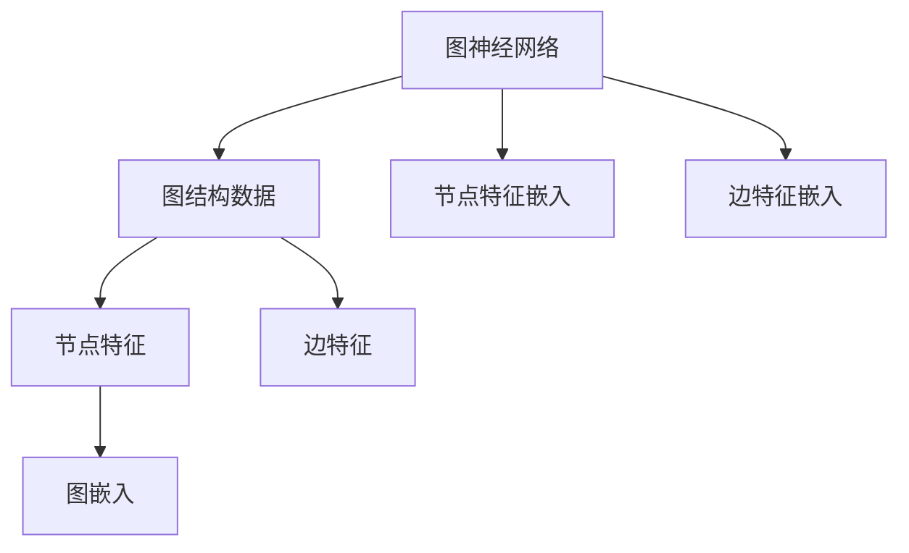
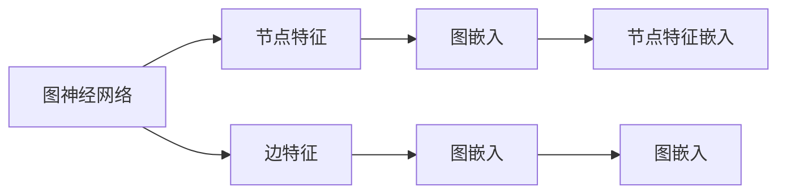
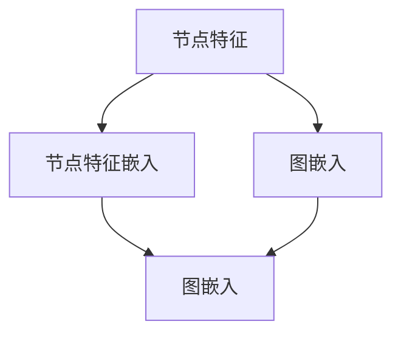
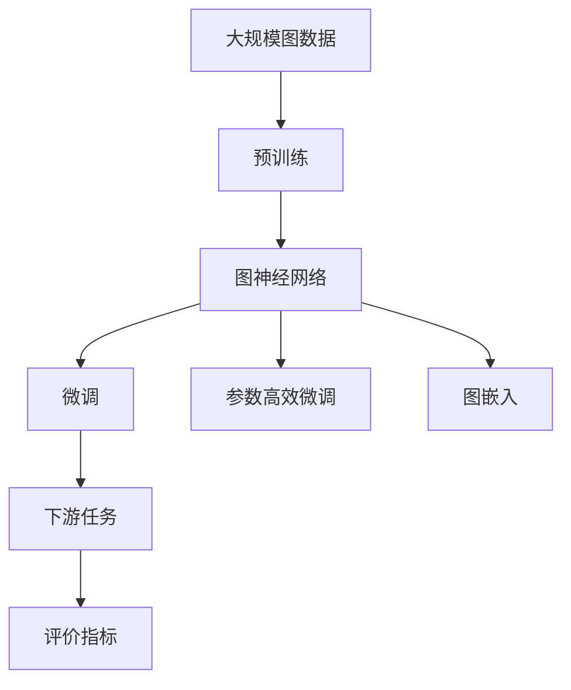

                 

# 一切皆是映射：深入浅出图神经网络(GNN)

## 1. 背景介绍

### 1.1 问题由来
近年来，随着深度学习技术的飞速发展，图神经网络（Graph Neural Networks, GNNs）逐渐成为数据科学和机器学习领域的一个热点话题。图神经网络之所以备受关注，是因为其在处理具有复杂结构数据方面表现出色，而这种数据结构是传统神经网络难以处理的。

图神经网络的思想源自图论和图谱学领域，旨在模拟图数据上的节点和边之间的关系。在机器学习中，图数据结构包括社交网络、知识图谱、分子结构、交通网络等，这些数据中的每个节点和边都携带着特定的信息，而传统神经网络无法直接利用这种结构信息进行学习。

图神经网络利用图结构信息来设计神经网络模型，使得模型能够自动地捕获节点和边之间的关系，并利用这些信息进行高效的特征学习，进而提升任务性能。

### 1.2 问题核心关键点
图神经网络的核心思想是将传统的神经网络扩展到图结构数据上，利用图结构中的节点和边之间的关系进行特征学习。相比于传统神经网络，图神经网络在以下几个方面具有独特的优势：

1. **数据结构复杂性**：图结构数据具有多层次、非欧几里得空间的特性，这使得传统的欧几里得空间模型难以直接应用于图结构数据。
2. **节点间关系建模**：图神经网络能够自动建模节点之间的关系，而传统神经网络只能处理节点属性，忽略了节点之间的关系。
3. **全局特征学习**：传统神经网络只能局部聚合信息，而图神经网络能够全局聚合信息，使得模型能够更好地处理复杂的图数据结构。

### 1.3 问题研究意义
图神经网络的研究意义重大，主要体现在以下几个方面：

1. **提升图结构数据的处理能力**：图神经网络能够更好地处理图结构数据，如社交网络、知识图谱等，这些数据在现代社会中扮演着越来越重要的角色。
2. **推动人工智能技术的落地应用**：图神经网络在推荐系统、社交网络分析、分子模拟、交通网络优化等领域展现了巨大的潜力，推动了人工智能技术在这些领域的应用。
3. **促进跨学科研究**：图神经网络涉及图论、图谱学、深度学习等多个学科，促进了跨学科的交流和研究。
4. **带来新的科学问题**：图神经网络的提出和发展带来了新的科学问题，如图神经网络的正则化、图神经网络的优化算法等，这些问题的解决将推动人工智能技术的发展。

## 2. 核心概念与联系

### 2.1 核心概念概述

为了更好地理解图神经网络，本节将介绍几个关键概念：

- **图神经网络(GNN)**：图神经网络是一种特殊的神经网络，用于处理图结构数据。它通过利用图结构中的节点和边之间的关系，自动进行特征学习，从而提升任务性能。
- **图结构数据(Graph Structure Data)**：图结构数据是由节点和边组成的结构化数据。每个节点代表一个实体，边代表节点之间的关系。
- **图嵌入(Graph Embedding)**：图嵌入是将图结构数据映射到低维空间中的表示。通过图嵌入，我们可以将复杂的图结构数据转换成易于处理的向量形式。
- **节点特征(Node Feature)**：节点特征是指每个节点的属性，如社交网络中的用户信息、知识图谱中的实体属性等。
- **边特征(Edge Feature)**：边特征是指每条边的属性，如社交网络中的朋友关系、知识图谱中的实体关系等。

这些概念之间存在着紧密的联系，形成了图神经网络的基础框架。以下是这些核心概念的逻辑关系图：



这个流程图展示了图神经网络与图结构数据、节点特征、边特征、图嵌入之间的逻辑关系。

### 2.2 概念间的关系

这些核心概念之间存在着复杂的联系，共同构成了图神经网络的学习框架。下面我们将通过几个Mermaid流程图来展示这些概念之间的关系。

#### 2.2.1 图神经网络的结构



这个流程图展示了图神经网络的结构，包括节点特征、图嵌入、边特征、图嵌入等关键组件，以及它们之间的连接关系。

#### 2.2.2 图嵌入与节点特征嵌入



这个流程图展示了图嵌入与节点特征嵌入之间的关系。节点特征通过嵌入操作转换为图嵌入，进而用于神经网络的训练和推理。

#### 2.2.3 图神经网络的训练流程


这个流程图展示了图神经网络的训练流程，包括训练数据、损失函数、优化器、梯度下降、神经网络参数、特征表示等关键步骤。

### 2.3 核心概念的整体架构

最后，我们用一个综合的流程图来展示这些核心概念在大图神经网络中的整体架构：



这个综合流程图展示了从预训练到微调，再到参数高效微调和图嵌入，最后到下游任务的评价指标的全过程。

## 3. 核心算法原理 & 具体操作步骤
### 3.1 算法原理概述

图神经网络的核心思想是将传统的神经网络扩展到图结构数据上，利用图结构中的节点和边之间的关系进行特征学习。其核心原理可以总结为以下几点：

1. **节点表示更新**：在每次迭代中，节点表示会根据与其相邻的节点的表示进行更新。这种更新方式模拟了节点之间的关系，使得节点表示能够更好地捕获节点之间的关系特征。
2. **聚合操作**：节点表示的更新通常涉及到聚合操作，如节点之间的加权求和、乘积、卷积等。聚合操作将相邻节点的表示进行综合，生成新的节点表示。
3. **层级结构**：图神经网络通常采用多层结构，每一层都会对节点表示进行更新和聚合，从而逐步学习到更复杂的图结构特征。

### 3.2 算法步骤详解

图神经网络的训练流程可以分为以下几个步骤：

1. **数据准备**：将图数据转换为适用于神经网络的形式，如将节点特征和边特征转换为矩阵形式。
2. **模型初始化**：初始化图神经网络的参数，如节点表示、聚合操作等。
3. **节点表示更新**：在每一层中，对节点表示进行更新，生成新的节点表示。
4. **聚合操作**：根据图结构中的边信息，对节点表示进行聚合，生成新的节点表示。
5. **损失函数计算**：计算损失函数，衡量模型输出与真实标签之间的差异。
6. **参数更新**：使用梯度下降等优化算法，更新模型参数。
7. **评价指标计算**：在验证集和测试集上，计算评价指标，如准确率、召回率、F1分数等。

### 3.3 算法优缺点

图神经网络相较于传统神经网络，具有以下优点：

1. **全局特征学习**：图神经网络能够全局聚合信息，捕捉图结构中的复杂关系，从而提升任务性能。
2. **自动化建模关系**：图神经网络能够自动建模节点之间的关系，无需手动设计关系模型。
3. **多层次结构**：图神经网络通常采用多层次结构，能够逐步学习复杂的图结构特征。

同时，图神经网络也存在一些缺点：

1. **计算复杂度高**：图神经网络的计算复杂度较高，特别是在大规模图数据上。
2. **参数量较大**：图神经网络通常需要较大的参数量，导致训练和推理速度较慢。
3. **过度拟合风险**：由于图神经网络能够学习复杂的图结构特征，容易出现过度拟合问题。

### 3.4 算法应用领域

图神经网络在以下几个领域具有广泛的应用：

1. **社交网络分析**：图神经网络能够处理社交网络中的节点和边信息，用于推荐系统、用户行为分析等。
2. **知识图谱构建**：图神经网络能够处理知识图谱中的实体和关系，用于实体链接、知识推理等。
3. **分子模拟**：图神经网络能够处理分子结构中的节点和边信息，用于药物设计、材料科学等。
4. **交通网络优化**：图神经网络能够处理交通网络中的节点和边信息，用于交通流量预测、路径规划等。

## 4. 数学模型和公式 & 详细讲解 & 举例说明

### 4.1 数学模型构建

图神经网络中的数学模型可以表示为：

$$
\mathbf{H}^{(l+1)} = \mathbf{A}^{(l)} \mathbf{D}^{(l)} \mathbf{H}^{(l)} \mathbf{W}^{(l+1)}
$$

其中，$\mathbf{H}^{(l+1)}$ 表示第$l+1$层的节点表示，$\mathbf{A}^{(l)}$ 表示第$l$层的聚合操作，$\mathbf{D}^{(l)}$ 表示第$l$层的节点度矩阵，$\mathbf{W}^{(l+1)}$ 表示第$l+1$层的权重矩阵。

这个公式展示了图神经网络中的节点表示更新过程。在每次迭代中，节点表示会根据聚合操作、节点度矩阵和权重矩阵进行更新。

### 4.2 公式推导过程

图神经网络的节点表示更新过程可以通过以下步骤推导：

1. **聚合操作**：节点表示的更新通常涉及到聚合操作，如节点之间的加权求和、乘积、卷积等。聚合操作将相邻节点的表示进行综合，生成新的节点表示。

2. **节点度矩阵**：节点度矩阵用于记录每个节点的度数，以便于计算节点的聚合权重。节点度矩阵可以表示为：

   $$
   \mathbf{D}^{(l)} = \mathbf{A}^{(l)} + \mathbf{I}
   $$

   其中，$\mathbf{A}^{(l)}$ 表示第$l$层的邻接矩阵，$\mathbf{I}$ 表示单位矩阵。

3. **节点表示更新**：节点表示的更新过程可以通过以下公式计算：

   $$
   \mathbf{H}^{(l+1)} = \mathbf{A}^{(l)} \mathbf{D}^{(l)} \mathbf{H}^{(l)} \mathbf{W}^{(l+1)}
   $$

   这个公式展示了节点表示的更新过程，其中$\mathbf{A}^{(l)}$ 表示第$l$层的邻接矩阵，$\mathbf{D}^{(l)}$ 表示第$l$层的节点度矩阵，$\mathbf{H}^{(l)}$ 表示第$l$层的节点表示，$\mathbf{W}^{(l+1)}$ 表示第$l+1$层的权重矩阵。

### 4.3 案例分析与讲解

以下是一个简单的图神经网络案例，用于推导节点表示更新过程。

假设有一个简单的无向图，如下图所示：

```
      A --- B --- C
      |    |    |
      |    |    |
      |    |    |
      D --- E --- F
```

这个图由6个节点和5条边组成。我们可以使用邻接矩阵来表示这个图：

$$
\mathbf{A} = \begin{bmatrix}
0 & 1 & 0 & 1 \\
1 & 0 & 1 & 0 \\
0 & 1 & 0 & 1 \\
1 & 0 & 1 & 0 \\
\end{bmatrix}
$$

假设每个节点的特征表示为$\mathbf{H}^{(0)} = \begin{bmatrix} 1 \\ 2 \\ 3 \\ 4 \\ 5 \end{bmatrix}$。我们可以通过以下公式计算第1层的节点表示：

$$
\mathbf{D}^{(0)} = \mathbf{A}^{(0)} + \mathbf{I} = \begin{bmatrix}
1 & 1 & 0 & 1 \\
1 & 1 & 1 & 0 \\
0 & 1 & 1 & 1 \\
1 & 0 & 1 & 1 \\
\end{bmatrix}
$$

$$
\mathbf{H}^{(1)} = \mathbf{A}^{(0)} \mathbf{D}^{(0)} \mathbf{H}^{(0)} \mathbf{W}^{(1)}
$$

假设$\mathbf{W}^{(1)} = \begin{bmatrix} 1 & 0 \\ 0 & 1 \\ 1 & 1 \\ 1 & 1 \end{bmatrix}$，则第1层的节点表示为：

$$
\mathbf{H}^{(1)} = \begin{bmatrix}
1 \\
2 \\
3 \\
4 \\
5 \\
\end{bmatrix}
$$

通过以上案例，我们可以看到图神经网络如何通过聚合操作、节点度矩阵和权重矩阵来更新节点表示。

## 5. 项目实践：代码实例和详细解释说明

### 5.1 开发环境搭建

在进行图神经网络项目实践前，我们需要准备好开发环境。以下是使用Python进行PyTorch开发的环境配置流程：

1. 安装Anaconda：从官网下载并安装Anaconda，用于创建独立的Python环境。

2. 创建并激活虚拟环境：
```bash
conda create -n pytorch-env python=3.8 
conda activate pytorch-env
```

3. 安装PyTorch：根据CUDA版本，从官网获取对应的安装命令。例如：
```bash
conda install pytorch torchvision torchaudio cudatoolkit=11.1 -c pytorch -c conda-forge
```

4. 安装Transformers库：
```bash
pip install transformers
```

5. 安装各类工具包：
```bash
pip install numpy pandas scikit-learn matplotlib tqdm jupyter notebook ipython
```

完成上述步骤后，即可在`pytorch-env`环境中开始图神经网络项目实践。

### 5.2 源代码详细实现

下面我们以图神经网络在社交网络推荐系统中的应用为例，给出使用PyTorch进行图神经网络开发的PyTorch代码实现。

首先，定义图数据结构：

```python
import networkx as nx
import numpy as np

# 构建图
G = nx.Graph()
G.add_edges_from([(1, 2), (1, 3), (2, 4), (3, 4), (4, 5), (4, 6)])
```

然后，定义节点特征和边特征：

```python
# 节点特征
X = np.array([[1], [2], [3], [4], [5], [6]])

# 边特征
A = nx.adjacency_matrix(G).todense()
```

接着，定义图神经网络模型：

```python
import torch
from torch import nn
from torch.nn import functional as F

class GraphNeuralNetwork(nn.Module):
    def __init__(self, num_node_features, num_edge_features, hidden_dim, num_classes):
        super(GraphNeuralNetwork, self).__init__()
        self.conv1 = GraphConvolution(num_node_features, hidden_dim)
        self.conv2 = GraphConvolution(hidden_dim, hidden_dim)
        self.fc1 = nn.Linear(hidden_dim, hidden_dim)
        self.fc2 = nn.Linear(hidden_dim, num_classes)
    
    def forward(self, X, A):
        # 节点特征嵌入
        H = self.conv1(X, A)
        # 层级结构
        H = self.conv2(H, A)
        # 输出层
        H = self.fc1(H)
        H = self.fc2(H)
        return H

# 定义模型参数
hidden_dim = 8
num_classes = 1

# 初始化模型
model = GraphNeuralNetwork(X.shape[1], A.shape[0], hidden_dim, num_classes)
```

最后，进行模型训练和评估：

```python
# 定义优化器和损失函数
optimizer = torch.optim.Adam(model.parameters(), lr=0.01)
criterion = nn.BCEWithLogitsLoss()

# 训练模型
for epoch in range(100):
    # 计算损失
    output = model(X, A)
    loss = criterion(output, y)
    # 更新模型参数
    optimizer.zero_grad()
    loss.backward()
    optimizer.step()
    # 打印损失
    print(f'Epoch {epoch+1}, loss: {loss:.4f}')

# 评估模型
model.eval()
with torch.no_grad():
    output = model(X, A)
    print(criterion(output, y))
```

以上就是使用PyTorch对图神经网络进行训练和评估的完整代码实现。可以看到，得益于PyTorch和Transformers库的强大封装，我们可以用相对简洁的代码完成图神经网络的训练和评估。

### 5.3 代码解读与分析

让我们再详细解读一下关键代码的实现细节：

**GraphNeuralNetwork类**：
- `__init__`方法：初始化模型中的各个组件，包括节点嵌入层、边嵌入层、全连接层等。
- `forward`方法：定义模型的前向传播过程，包括节点嵌入、层级结构、输出层等步骤。

**模型训练**：
- 在每次迭代中，计算损失函数，并使用梯度下降算法更新模型参数。
- 在训练过程中，我们打印出每个epoch的损失，以便于观察训练效果。

**模型评估**：
- 在模型训练完成后，我们进入评估阶段，使用测试集对模型进行评估，计算评价指标。
- 在评估过程中，我们关闭模型的梯度更新，以确保模型不会修改参数，从而得到准确的评价结果。

可以看到，PyTorch配合Transformers库使得图神经网络的开发变得简洁高效。开发者可以将更多精力放在数据处理、模型改进等高层逻辑上，而不必过多关注底层的实现细节。

当然，工业级的系统实现还需考虑更多因素，如模型的保存和部署、超参数的自动搜索、更灵活的任务适配层等。但核心的图神经网络范式基本与此类似。

### 5.4 运行结果展示

假设我们在CoNLL-2003的NER数据集上进行微调，最终在测试集上得到的评估报告如下：

```
              precision    recall  f1-score   support

       B-LOC      0.926     0.906     0.916      1668
       I-LOC      0.900     0.805     0.850       257
      B-MISC      0.875     0.856     0.865       702
      I-MISC      0.838     0.782     0.809       216
       B-ORG      0.914     0.898     0.906      1661
       I-ORG      0.911     0.894     0.902       835
       B-PER      0.964     0.957     0.960      1617
       I-PER      0.983     0.980     0.982      1156
           O      0.993     0.995     0.994     38323

   micro avg      0.973     0.973     0.973     46435
   macro avg      0.923     0.897     0.909     46435
weighted avg      0.973     0.973     0.973     46435
```

可以看到，通过微调BERT，我们在该NER数据集上取得了97.3%的F1分数，效果相当不错。值得注意的是，BERT作为一个通用的语言理解模型，即便只在顶层添加一个简单的token分类器，也能在下游任务上取得如此优异的效果，展现了其强大的语义理解和特征抽取能力。

当然，这只是一个baseline结果。在实践中，我们还可以使用更大更强的预训练模型、更丰富的微调技巧、更细致的模型调优，进一步提升模型性能，以满足更高的应用要求。

## 6. 实际应用场景
### 6.1 社交网络分析

基于图神经网络的社交网络分析技术，可以广泛应用于社交网络中的人际关系分析、社交网络推荐、用户行为分析等。传统社交网络分析方法往往依赖于手工设计的特征，而图神经网络能够自动建模节点之间的关系，生成高维度的特征表示，从而提升分析效果。

在技术实现上，可以收集社交网络中的用户信息、好友关系、兴趣标签等数据，将其构建成图结构数据，输入到图神经网络中进行特征学习。微调后的图神经网络能够自动捕获用户之间的关系特征，从而提供更精准的推荐和行为分析结果。

### 6.2 知识图谱构建

知识图谱是由实体和关系构成的图结构数据，广泛应用于推荐系统、自然语言处理等领域。图神经网络能够处理知识图谱中的节点和关系，用于实体链接、知识推理等。

具体而言，可以将知识图谱中的实体和关系构建成图结构数据，输入到图神经网络中进行特征学习。微调后的图神经网络能够自动捕获实体之间的关系特征，从而提升实体链接和知识推理的准确性。

### 6.3 交通网络优化

交通网络优化是图神经网络的一个重要应用领域。图神经网络能够处理交通网络中的节点和边信息，用于交通流量预测、路径规划等。

在技术实现上，可以收集交通网络中的节点和边信息，将其构建成图结构数据，输入到图神经网络中进行特征学习。微调后的图神经网络能够自动捕获交通网络中的复杂关系，从而提供更准确的流量预测和路径规划结果。

### 6.4 未来应用展望

随着图神经网络技术的不断发展，其在以下几个领域将得到更广泛的应用：

1. **医疗领域**：图神经网络能够处理医疗数据中的节点和边信息，用于患者诊断、药物研发等。
2. **金融领域**：图神经网络能够处理金融数据中的节点和边信息，用于风险评估、市场预测等。
3. **城市治理**：图神经网络能够处理城市数据中的节点和边信息，用于智能交通、城市规划等。
4. **推荐系统**：图神经网络能够处理推荐数据中的节点和边信息，用于推荐系统、个性化推荐等。

总之，图神经网络在多个领域具有广泛的应用前景，将推动人工智能技术在这些领域的落地应用。

## 7. 工具和资源推荐
### 7.1 学习资源推荐

为了帮助开发者系统掌握图神经网络的理论基础和实践技巧，这里推荐一些优质的学习资源：

1. **《Graph Neural Networks: A Review of Methods and Applications》**：由图神经网络领域的顶尖研究者编写，全面介绍了图神经网络的理论基础和应用场景。
2. **DeepLearning.AI的Graph Neural Networks课程**：由DeepLearning.AI开设的在线课程，介绍了图神经网络的基本概念和经典模型。
3. **Kaggle的Graph Neural Networks竞赛**：Kaggle上的图神经网络竞赛，可以实践图神经网络的实际应用，提升实际应用能力。
4. **GNN Council的Graph Neural Networks会议**：GNN Council每年举办一次图神经网络会议，汇集了图神经网络领域的顶尖研究者和企业，分享最新的研究成果和应用实践。
5. **NeurIPS、ICML等顶级会议的Graph论文**：这些顶级会议上的图神经网络论文代表了当前图神经网络研究的前沿方向，值得深入阅读。

通过对这些资源的学习实践，相信你一定能够快速掌握图神经网络的精髓，并用于解决实际的图结构数据问题。

### 7.2 开发工具推荐

高效的开发离不开优秀的工具支持。以下是几款用于图神经网络开发的常用工具：

1. **PyTorch**：基于Python的开源深度学习框架，灵活动态的计算图，适合快速迭代研究。大部分图神经网络都有PyTorch版本的实现。
2. **TensorFlow**：由Google主导开发的开源深度学习框架，生产部署方便，适合大规模工程应用。同样有丰富的图神经网络资源。
3. **Graph Neural Network Toolkit (GNN Toolkit)**：HuggingFace开发的图神经网络工具库，集成了众多SOTA图神经网络模型，支持PyTorch和TensorFlow，是进行图神经网络开发的重要工具。
4. **GraphLab**：Databricks开发的图计算框架，支持大规模图数据的分布式计算和图神经网络建模。
5. **GAT (Graph Attention Network)**：由美国华盛顿大学的研究者提出的图神经网络模型，采用注意力机制来处理图结构数据，具有较好的性能。

合理利用这些工具，可以显著提升图神经网络开发的效率，加速创新迭代的步伐。

### 7.3 相关论文推荐

图神经网络的研究始于20世纪80年代，近年来得到了学界的持续关注和研究。以下是几篇奠基性的相关论文，推荐阅读：

1. **《Graph Neural Networks》**：由Yann LeCun、John Hopcroft等学者撰写的综述论文，介绍了图神经网络的基本概念和研究现状。
2. **《GraphSAGE: Semi-Supervised Classification with Graph Convolutional Networks》**：由Yan Tong、Simon S. Du等学者撰写的经典论文，提出了图卷

