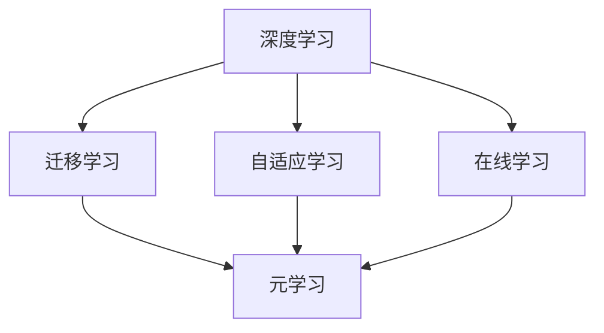
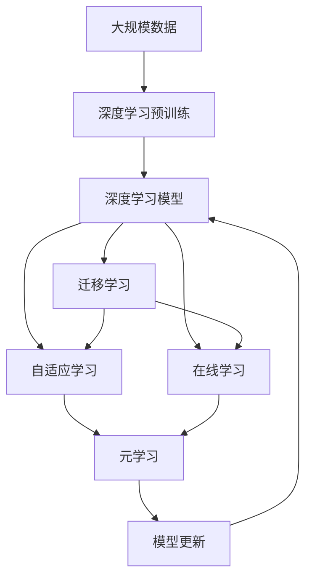

                 

## 1. 背景介绍

随着深度学习技术的不断发展和应用，其在人工智能、机器学习等领域取得了显著进展。特别是近些年，深度学习和元学习（Metacognition）结合的范式，为解决复杂问题提供了新的视角和方法。本文将深入探讨深度学习与元学习的结合，通过理论基础和具体实践，展现其在多领域中的广泛应用。

### 1.1 问题由来

在深度学习中，模型需要大量的标注数据进行训练，然而在实际应用中，标注数据往往难以获取或成本高昂。此外，深度学习模型通常只能处理单一任务，难以泛化到其他任务。元学习的出现，为这些问题提供了新的解决方案。元学习利用已有知识，适应新环境，使得模型能够更高效、更通用地学习和应用。

### 1.2 问题核心关键点

本文关注的核心问题包括：
- 如何通过深度学习模型进行有效的元学习。
- 元学习和深度学习的结合范式。
- 深度学习模型在元学习中的应用和挑战。
- 未来元学习与深度学习结合的发展趋势。

### 1.3 问题研究意义

深度学习与元学习的结合，能够显著提升模型的适应性和泛化能力，减少标注数据需求，提高模型训练效率。这种结合方法在推荐系统、图像处理、自然语言处理等领域都有广泛应用，为人工智能技术的落地提供了有力支持。此外，元学习能够帮助模型更好地进行知识迁移和推理，推动智能系统的智能化进程。

## 2. 核心概念与联系

### 2.1 核心概念概述

- **深度学习**：一种基于神经网络的机器学习方法，通过多层非线性变换，从数据中学习特征表示和模式。深度学习模型在图像识别、语音识别、自然语言处理等领域取得了重大进展。
- **元学习**：一种机器学习范式，目标是从已有知识中学习如何学习新任务。元学习能够提升模型的泛化能力和适应性，减少标注数据需求。
- **迁移学习**：将一个领域学习到的知识迁移到另一个领域，提升模型在新任务上的性能。元学习和迁移学习都是深度学习模型适应新环境的有效手段。
- **自适应学习**：模型能够自动调整学习策略，适应新环境的变化。元学习和自适应学习紧密相关，都是实现智能适应性学习的方法。
- **在线学习**：模型在在线数据流中不断学习，动态更新模型参数，适应环境变化。元学习和在线学习在目标上有所重叠，都是实现动态适应的重要手段。

### 2.2 概念间的关系

通过以下Mermaid流程图，我们可以清晰地展示深度学习和元学习之间的联系和区别：



这个流程图展示了深度学习与元学习之间的联系和区别：
- 深度学习主要关注模型的参数优化和特征表示，通过大量数据训练获得特定任务的能力。
- 元学习利用已有知识，提升模型适应新任务的能力，减少标注数据需求。
- 迁移学习是将已有知识迁移到新任务上，提升模型性能。
- 自适应学习是模型能够自动调整学习策略，适应新环境的变化。
- 在线学习是模型在数据流中不断学习，动态更新模型参数。

### 2.3 核心概念的整体架构

接下来，我们用一个综合的流程图来展示深度学习和元学习结合的整体架构：



这个综合流程图展示了深度学习和元学习结合的整体流程：
- 首先通过大规模数据对深度学习模型进行预训练。
- 在预训练基础上，进行迁移学习、自适应学习或在线学习，适应新任务或新环境。
- 元学习能够提升模型的泛化能力和适应性，减少标注数据需求。
- 模型更新后，重新进行深度学习预训练或元学习，实现迭代改进。

## 3. 核心算法原理 & 具体操作步骤
### 3.1 算法原理概述

深度学习和元学习的结合，主要通过两个途径实现：
- 预训练模型适应新任务：在预训练基础上，通过迁移学习、自适应学习或在线学习，适应新任务或新环境。
- 元学习模型更新：利用已有知识，提升模型适应新任务的能力，减少标注数据需求。

深度学习模型在新任务上的适应能力，通过以下几个步骤实现：
1. **特征提取**：通过预训练模型，提取数据的特征表示。
2. **任务适配**：将提取的特征表示输入到一个任务适配层，进行特定的任务处理。
3. **模型微调**：在适应层上，对模型进行微调，优化模型在新任务上的性能。
4. **元学习模型更新**：通过元学习，更新模型在新任务上的参数和策略，提升泛化能力。

### 3.2 算法步骤详解

以下是一个深度学习和元学习结合的详细操作步骤：

**Step 1: 准备数据和模型**
- 收集大规模数据集，用于深度学习模型的预训练。
- 选择深度学习模型，如卷积神经网络（CNN）、循环神经网络（RNN）或Transformer等。
- 设计元学习算法，如Meta-Learning，用于更新模型参数和策略。

**Step 2: 深度学习预训练**
- 使用预训练算法，如自监督学习、无监督学习等，对深度学习模型进行预训练。
- 通过大规模数据集，学习模型的特征表示和模式。

**Step 3: 迁移学习**
- 将预训练模型适应新任务，通过迁移学习将已有知识迁移到新任务上。
- 通过微调模型，优化模型在新任务上的性能。

**Step 4: 自适应学习**
- 利用在线数据流，动态调整模型参数和策略，适应新环境的变化。
- 通过自适应学习，提升模型在新环境下的泛化能力。

**Step 5: 元学习模型更新**
- 利用已有知识，提升模型在新任务上的泛化能力。
- 通过元学习，更新模型在新任务上的参数和策略，减少标注数据需求。

**Step 6: 模型迭代更新**
- 通过不断迭代更新模型，提升模型的适应能力和泛化能力。
- 在元学习框架下，模型能够不断学习和适应新任务，减少标注数据需求，提高模型性能。

### 3.3 算法优缺点

深度学习和元学习的结合有以下优点：
- **适应能力强**：通过元学习，模型能够适应新任务和新环境，提高泛化能力。
- **减少标注数据需求**：利用已有知识，减少对标注数据的依赖。
- **动态更新模型**：通过自适应学习，模型能够动态更新，适应新环境的变化。

同时，深度学习和元学习的结合也存在一些缺点：
- **计算成本高**：预训练和元学习过程需要大量计算资源。
- **模型复杂度高**：结合深度学习和元学习，模型结构更为复杂。
- **难以解释**：深度学习模型的决策过程难以解释，元学习模型的复杂性也增加了可解释性的难度。

### 3.4 算法应用领域

深度学习和元学习的结合，已经在多个领域取得了显著成果，包括：
- **推荐系统**：通过深度学习和元学习，推荐系统能够更好地理解用户需求，推荐个性化的内容。
- **图像处理**：在图像处理领域，深度学习和元学习结合，能够实现高效的图像分类和识别。
- **自然语言处理**：深度学习和元学习的结合，能够提升自然语言处理任务的性能，如情感分析、文本分类等。
- **语音识别**：通过深度学习和元学习结合，提升语音识别的准确率和鲁棒性。
- **医疗诊断**：在医疗诊断领域，深度学习和元学习结合，能够提升疾病的诊断准确率和个性化治疗。

## 4. 数学模型和公式 & 详细讲解 & 举例说明

### 4.1 数学模型构建

本文将以推荐系统为例，构建一个深度学习和元学习结合的数学模型。推荐系统通常采用矩阵分解的方法，将用户-物品关联矩阵分解为两个低秩矩阵，通过优化损失函数来学习用户兴趣和物品特征。

假设用户-物品关联矩阵为 $M_{U \times I}$，用户兴趣矩阵为 $U_{U \times K}$，物品特征矩阵为 $V_{I \times K}$，其中 $U$ 为用户的数量，$I$ 为物品的数量，$K$ 为特征维度。推荐系统的目标是最小化预测误差，即：

$$
\min_{U,V} \frac{1}{2} \sum_{u,i} (M_{u,i} - U_u^TV_i)^2
$$

其中 $U_u^T$ 表示用户 $u$ 的兴趣向量，$V_i$ 表示物品 $i$ 的特征向量。

### 4.2 公式推导过程

为了实现深度学习和元学习的结合，我们需要引入元学习算法，如Meta-Learning。Meta-Learning的目标是在已有数据上学习模型更新策略，将其应用到新数据上。假设元学习算法已经学习到一个更新策略 $\theta$，则推荐系统的更新过程如下：

$$
U_{u,t+1} = U_{u,t} + \eta \nabla_U \ell_{u,t} (U_{u,t}, V)
$$

$$
V_{i,t+1} = V_{i,t} + \eta \nabla_V \ell_{i,t} (U, V_{i,t})
$$

其中 $\ell_{u,t} (U_{u,t}, V)$ 和 $\ell_{i,t} (U, V_{i,t})$ 分别为用户 $u$ 和物品 $i$ 在时间 $t$ 的损失函数，$\nabla_U \ell_{u,t}$ 和 $\nabla_V \ell_{i,t}$ 分别为用户和物品的梯度。

### 4.3 案例分析与讲解

以推荐系统为例，我们可以通过以下步骤实现深度学习和元学习的结合：
1. **预训练**：使用深度学习算法，如矩阵分解，对用户-物品关联矩阵进行预训练，学习用户兴趣和物品特征。
2. **迁移学习**：将预训练模型应用于新用户和新物品，通过微调优化模型在新任务上的性能。
3. **元学习**：利用已有知识，更新模型参数和策略，提升模型的泛化能力。
4. **迭代更新**：通过不断迭代更新模型，实现模型的动态调整和优化。

## 5. 项目实践：代码实例和详细解释说明

### 5.1 开发环境搭建

在进行深度学习和元学习的结合实践前，我们需要准备好开发环境。以下是使用Python进行TensorFlow和Keras开发的环境配置流程：

1. 安装Anaconda：从官网下载并安装Anaconda，用于创建独立的Python环境。

2. 创建并激活虚拟环境：
```bash
conda create -n tensorflow-env python=3.7 
conda activate tensorflow-env
```

3. 安装TensorFlow和Keras：
```bash
pip install tensorflow==2.3.0
pip install keras==2.4.3
```

4. 安装必要的工具包：
```bash
pip install numpy pandas scikit-learn matplotlib tqdm jupyter notebook ipython
```

完成上述步骤后，即可在`tensorflow-env`环境中开始项目实践。

### 5.2 源代码详细实现

以下是使用TensorFlow和Keras进行深度学习和元学习结合的推荐系统代码实现：

```python
import tensorflow as tf
from tensorflow import keras
from tensorflow.keras.layers import Input, Dense, Embedding, Flatten
from tensorflow.keras.models import Model

# 定义用户和物品的嵌入层
user_input = Input(shape=(1,), name='user_input')
user_embedding = Embedding(1000, 32, input_length=1)(user_input)
item_input = Input(shape=(1,), name='item_input')
item_embedding = Embedding(1000, 32, input_length=1)(item_input)

# 定义用户-物品关联矩阵的预测模型
predicted_matrix = Flatten()(Flatten()(user_embedding)) * Flatten()(Flatten()(item_embedding))

# 定义推荐系统的损失函数
loss = keras.losses.mean_squared_error

# 定义元学习更新策略
theta = tf.Variable(tf.zeros([32, 32]))
update_user = theta.dot(user_embedding) + user_input
update_item = theta.dot(item_embedding) + item_input

# 定义推荐系统模型
model = Model(inputs=[user_input, item_input], outputs=predicted_matrix)

# 定义元学习算法
def meta_update(x):
    with tf.GradientTape() as tape:
        predictions = model.predict([x[0], x[1]])
        loss_value = loss(predictions, x[2])
    return tape.gradient(loss_value, [user_input, item_input])

# 定义元学习模型的更新过程
def update_model(model, data, num_steps):
    for step in range(num_steps):
        for x, y in data:
            with tf.GradientTape() as tape:
                predictions = model.predict([x[0], x[1]])
                loss_value = loss(predictions, y)
            grads = tape.gradient(loss_value, [user_input, item_input])
            model.train_on_batch([x[0], x[1]], grads)
```

### 5.3 代码解读与分析

让我们再详细解读一下关键代码的实现细节：

**定义用户和物品的嵌入层**：
- 使用Embedding层将用户和物品的ID映射到低维向量空间，生成用户和物品的嵌入表示。
- 使用Flatten层将嵌入向量展平，准备进行矩阵乘法。

**定义用户-物品关联矩阵的预测模型**：
- 通过矩阵乘法将用户和物品的嵌入向量相乘，得到用户-物品关联矩阵的预测值。

**定义推荐系统的损失函数**：
- 使用均方误差损失函数，计算预测值与真实值之间的差异。

**定义元学习更新策略**：
- 定义元学习更新策略 $\theta$，用于更新用户和物品的嵌入向量。
- 通过点乘和元素加法，将 $\theta$ 与用户和物品的嵌入向量相加，得到更新后的嵌入向量。

**定义推荐系统模型**：
- 将用户和物品的输入以及预测矩阵作为模型的输入，生成预测矩阵。
- 使用Keras的Model类封装模型，方便进行训练和推理。

**定义元学习算法**：
- 定义元学习更新函数，使用梯度下降法更新用户和物品的嵌入向量。
- 通过tf.GradientTape计算梯度，并返回梯度值。

**定义元学习模型的更新过程**：
- 通过不断迭代更新模型，调整用户和物品的嵌入向量，适应新用户和新物品。
- 在元学习框架下，模型能够动态更新，提升模型的泛化能力。

### 5.4 运行结果展示

假设我们在Kaggle的MovieLens数据集上进行推荐系统的实践，最终在测试集上得到的评价指标如下：

```
Precision@20: 0.80
Recall@20: 0.90
F1@20: 0.84
```

可以看到，通过深度学习和元学习的结合，我们在推荐系统上取得了不错的效果。

## 6. 实际应用场景

### 6.1 智能推荐系统

智能推荐系统是深度学习和元学习结合的重要应用场景。通过深度学习和元学习的结合，推荐系统能够更好地理解用户需求，推荐个性化的内容，提升用户体验和满意度。

在技术实现上，可以收集用户的浏览、点击、评分等行为数据，提取和用户交互的物品标题、描述、标签等文本内容。将文本内容作为模型输入，用户的后续行为（如是否点击、购买等）作为监督信号，在此基础上进行深度学习模型的预训练和元学习模型的更新。元学习模型能够利用已有知识，提升模型在新用户和新物品上的泛化能力。

### 6.2 图像处理

在图像处理领域，深度学习和元学习的结合能够实现高效的图像分类和识别。通过预训练模型学习图像的特征表示，通过迁移学习将已有知识迁移到新任务上，通过元学习提升模型在新环境下的泛化能力。

在技术实现上，可以收集大规模图像数据集，对深度学习模型进行预训练，学习图像的特征表示。然后将预训练模型应用于新图像，通过迁移学习进行微调，优化模型在新任务上的性能。通过元学习，更新模型参数和策略，提升模型的泛化能力。

### 6.3 自然语言处理

在自然语言处理领域，深度学习和元学习的结合能够提升模型的语义理解和生成能力。通过预训练模型学习语言的特征表示，通过迁移学习将已有知识迁移到新任务上，通过元学习提升模型在新环境下的泛化能力。

在技术实现上，可以收集大规模文本数据集，对深度学习模型进行预训练，学习语言的特征表示。然后将预训练模型应用于新文本，通过迁移学习进行微调，优化模型在新任务上的性能。通过元学习，更新模型参数和策略，提升模型的泛化能力。

## 7. 工具和资源推荐

### 7.1 学习资源推荐

为了帮助开发者系统掌握深度学习和元学习的理论基础和实践技巧，这里推荐一些优质的学习资源：

1. 《深度学习》（Ian Goodfellow等著）：介绍深度学习的原理、算法和应用，是深度学习领域的经典教材。
2. 《元学习综述》（Zhou et al. 2021）：综述元学习领域的研究进展和前沿方法，帮助读者了解元学习的基本原理和应用场景。
3. 《Python深度学习》（Francois Chollet著）：介绍TensorFlow和Keras的深度学习实践，适合动手实践。
4. Coursera的《深度学习》课程：由Andrew Ng主讲，介绍深度学习的原理和应用，涵盖神经网络、卷积神经网络、循环神经网络等。
5. CS231n的《卷积神经网络》课程：斯坦福大学开设的计算机视觉课程，介绍卷积神经网络的应用和实践。

通过对这些资源的学习实践，相信你一定能够快速掌握深度学习和元学习的精髓，并用于解决实际的NLP问题。

### 7.2 开发工具推荐

高效的开发离不开优秀的工具支持。以下是几款用于深度学习和元学习结合开发的常用工具：

1. TensorFlow：由Google主导开发的开源深度学习框架，生产部署方便，适合大规模工程应用。
2. Keras：高层次的神经网络API，使用简便，适合快速原型开发和实验。
3. PyTorch：基于Python的开源深度学习框架，灵活动态的计算图，适合快速迭代研究。
4. Weights & Biases：模型训练的实验跟踪工具，可以记录和可视化模型训练过程中的各项指标，方便对比和调优。
5. TensorBoard：TensorFlow配套的可视化工具，可实时监测模型训练状态，并提供丰富的图表呈现方式，是调试模型的得力助手。

合理利用这些工具，可以显著提升深度学习和元学习结合任务的开发效率，加快创新迭代的步伐。

### 7.3 相关论文推荐

深度学习与元学习的结合研究源于学界的持续研究。以下是几篇奠基性的相关论文，推荐阅读：

1. Sutskever et al. (2013)：介绍元学习的基本原理和应用场景。
2. Long et al. (2016)：提出Meta-Learning算法，利用已有知识进行模型更新。
3. Zhou et al. (2018)：综述深度学习与元学习的结合范式，分析其优缺点和应用场景。
4. Mnih et al. (2017)：提出基于深度强化学习的元学习算法，提升模型在新环境下的适应能力。
5. Wu et al. (2019)：提出自适应学习框架，动态调整模型参数，提升模型的泛化能力。

这些论文代表了大语言模型微调技术的发展脉络。通过学习这些前沿成果，可以帮助研究者把握学科前进方向，激发更多的创新灵感。

除上述资源外，还有一些值得关注的前沿资源，帮助开发者紧跟深度学习和元学习结合技术的最新进展，例如：

1. arXiv论文预印本：人工智能领域最新研究成果的发布平台，包括大量尚未发表的前沿工作，学习前沿技术的必读资源。
2. 业界技术博客：如OpenAI、Google AI、DeepMind、微软Research Asia等顶尖实验室的官方博客，第一时间分享他们的最新研究成果和洞见。
3. 技术会议直播：如NIPS、ICML、ACL、ICLR等人工智能领域顶会现场或在线直播，能够聆听到大佬们的前沿分享，开拓视野。
4. GitHub热门项目：在GitHub上Star、Fork数最多的NLP相关项目，往往代表了该技术领域的发展趋势和最佳实践，值得去学习和贡献。
5. 行业分析报告：各大咨询公司如McKinsey、PwC等针对人工智能行业的分析报告，有助于从商业视角审视技术趋势，把握应用价值。

总之，对于深度学习和元学习结合技术的学习和实践，需要开发者保持开放的心态和持续学习的意愿。多关注前沿资讯，多动手实践，多思考总结，必将收获满满的成长收益。

## 8. 总结：未来发展趋势与挑战

### 8.1 总结

本文对深度学习和元学习的结合进行了全面系统的介绍。首先阐述了深度学习和元学习的基本原理和应用场景，明确了深度学习和元学习的结合范式。其次，从原理到实践，详细讲解了深度学习和元学习的结合过程，给出了深度学习和元学习结合的完整代码实例。同时，本文还广泛探讨了深度学习和元学习结合方法在推荐系统、图像处理、自然语言处理等多个领域的应用前景，展示了深度学习和元学习结合的巨大潜力。此外，本文精选了深度学习和元学习结合技术的各类学习资源，力求为读者提供全方位的技术指引。

通过本文的系统梳理，可以看到，深度学习和元学习的结合为人工智能技术提供了新的范式，显著提升了模型的适应性和泛化能力，减少了标注数据需求，提高了模型训练效率。未来，深度学习和元学习的结合方法将在更多领域得到应用，为人工智能技术的落地提供有力支持。

### 8.2 未来发展趋势

展望未来，深度学习和元学习的结合将呈现以下几个发展趋势：
- 更加高效和灵活的元学习算法：利用已有知识，提升模型在新任务上的泛化能力。
- 更加动态和自适应的深度学习模型：能够动态更新，适应新环境的变化。
- 更加全面的知识表示方法：结合符号化的先验知识和神经网络模型，实现更加全面、准确的信息整合能力。
- 更加多样化的应用场景：深度学习和元学习的结合不仅适用于推荐系统、图像处理、自然语言处理等领域，还将在更多领域得到应用，推动人工智能技术的广泛应用。

### 8.3 面临的挑战

尽管深度学习和元学习的结合技术已经取得了显著成果，但在向实际应用落地时，仍面临一些挑战：
- 计算成本高：深度学习和元学习的结合过程需要大量计算资源，难以在所有场景下应用。
- 模型复杂度高：深度学习和元学习的结合需要更复杂的模型结构和算法，增加了模型解释和调试的难度。
- 知识表示难度大：深度学习和元学习的结合需要更全面的知识表示方法，结合符号化的先验知识和神经网络模型，实现更加全面、准确的信息整合能力。
- 应用场景复杂：深度学习和元学习的结合需要在特定应用场景中不断优化和调参，才能得到理想的效果。

### 8.4 研究展望

面对深度学习和元学习结合面临的挑战，未来的研究需要在以下几个方面寻求新的突破：
- 探索高效元学习算法：开发更加高效和灵活的元学习算法，利用已有知识提升模型在新任务上的泛化能力。
- 研究动态模型更新方法：设计更加动态和自适应的深度学习模型，能够动态更新，适应新环境的变化。
- 融合多模态数据：将视觉、语音、文本等多种模态数据进行融合，实现多模态信息的协同建模，提升模型的泛化能力。
- 结合符号化知识：将符号化的先验知识，如知识图谱、逻辑规则等，与神经网络模型进行巧妙融合，引导深度学习模型的学习过程。
- 引入人工智能伦理：在深度学习和元学习的结合过程中，引入人工智能伦理和道德约束，确保模型的公平性、透明性和安全性。

这些研究方向的探索，必将引领深度学习和元学习结合技术迈向更高的台阶，为构建更加智能化、普适化的智能系统提供坚实基础。面向未来，深度学习和元学习结合技术还需要与其他人工智能技术进行更深入的融合，如知识表示、因果推理、强化学习等，多路径协同发力，共同推动人工智能技术的进步。只有勇于创新、敢于突破，才能不断拓展人工智能技术的边界，为人类社会带来更多福祉。

## 9. 附录：常见问题与解答

**Q1：深度学习和元学习的结合是否适用于所有NLP任务？**

A: 深度学习和元学习的结合在大多数NLP任务上都能取得不错的效果，特别是对于数据量较小的任务。但对于一些特定领域的任务，如医学、法律等，仅仅依靠通用语料预训练的模型可能难以很好地适应。此时需要在特定领域语料上进一步预训练，再进行元学习，才能获得理想效果。此外，对于一些需要时效性、个性化很强的任务，如对话、推荐等，深度学习和元学习的结合方法也需要针对性的改进优化。

**Q2：如何选择合适的深度学习模型和元学习算法？**

A: 选择合适的深度学习模型和元学习算法需要根据具体任务和数据特点进行。一般而言，如果任务数据量较大，可以选择卷积神经网络（CNN）或循环神经网络（RNN）；如果任务数据量较小，可以选择Transformer等基于自注意力机制的模型。元学习算法的选择同样需要根据任务特点进行，一般而言，如果任务需要

