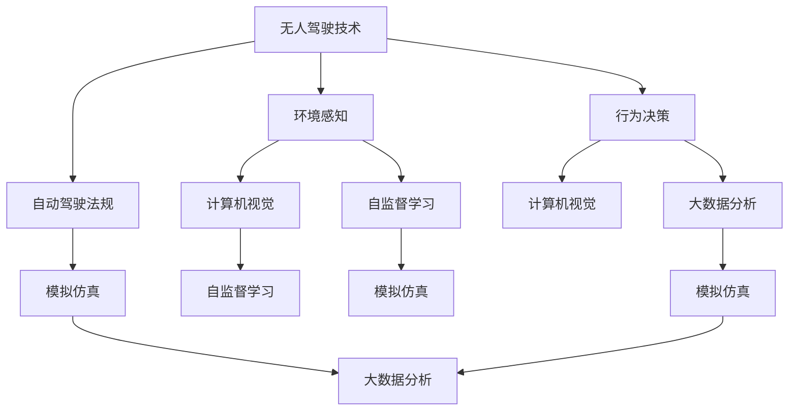
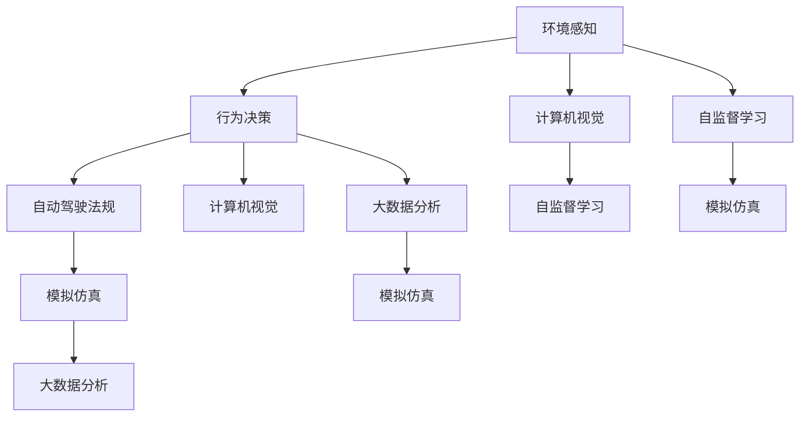
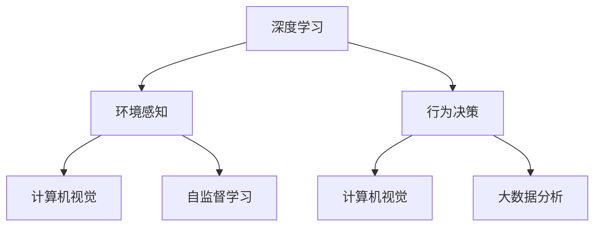

                 

# 一切皆是映射：深度学习在无人驾驶技术中的应用

> 关键词：无人驾驶技术,深度学习,感知融合,行为决策,鲁棒性,感知系统,控制策略,计算机视觉,自监督学习,模拟仿真,大数据分析,自动驾驶法规

## 1. 背景介绍

### 1.1 问题由来
随着科技的迅猛发展，无人驾驶技术逐渐从科幻迈向现实。其背后的技术支撑包括传感器、控制系统、地图定位、环境感知等多个关键环节，而深度学习在其中扮演了至关重要的角色。深度学习不仅在环境感知和行为决策中发挥了巨大作用，还推动了无人驾驶技术的快速迭代和应用推广。

无人驾驶的核心是"感知-决策-控制"的闭环系统，其中感知和决策环节尤为重要。感知系统负责获取车辆周围的环境信息，并将信息转化为机器可理解的数据。决策系统则基于感知数据，制定车辆的行驶策略，以确保行驶安全。控制策略则将决策转化为具体的行动，确保车辆按照预定路径和速度行驶。

近年来，深度学习在无人驾驶领域的应用取得了显著进展，尤其是在环境感知和行为决策中，表现尤为突出。然而，深度学习在无人驾驶中的应用仍面临诸多挑战，如模型鲁棒性、决策透明性、数据隐私保护等。

### 1.2 问题核心关键点
深度学习在无人驾驶技术中的应用，主要体现在以下几个方面：

- **环境感知**：通过深度学习算法，无人驾驶车辆可以自动识别道路、车辆、行人、交通信号灯等环境要素，并构建高精度的地图和位置信息。
- **行为决策**：利用深度学习模型，无人驾驶车辆可以实时分析和预测周围环境动态变化，做出安全和高效的行驶决策。
- **自动驾驶法规**：随着自动驾驶法规的逐步完善，深度学习将用于实现对法律法规的动态理解，确保车辆行为符合法规要求。

深度学习在这些应用中展现了强大的数据建模和模式识别能力，但同时也需要在多方面进行优化和完善，以提高系统的鲁棒性、可解释性和安全性。

### 1.3 问题研究意义
深度学习在无人驾驶技术中的应用，对于推动智能交通和智慧城市的发展，具有重要意义：

1. **提升行驶安全**：通过精确的环境感知和智能决策，无人驾驶车辆能够有效避免交通事故，提高行驶安全性。
2. **优化交通效率**：无人驾驶车辆可以24小时不间断工作，优化交通流量，减少拥堵。
3. **降低人力成本**：无人驾驶车辆可以减少对人工驾驶员的依赖，降低人力成本。
4. **推动产业升级**：无人驾驶技术的应用，可以带动上下游产业链的协同发展，加速智能交通产业的升级。
5. **增强社会效益**：无人驾驶车辆在物流配送、医疗救援、公共交通等领域的应用，可以大幅提升社会效率，改善公众福祉。

## 2. 核心概念与联系

### 2.1 核心概念概述

为更好地理解深度学习在无人驾驶技术中的应用，本节将介绍几个关键概念：

- **无人驾驶技术**：通过传感器、控制器和计算单元实现车辆自主驾驶的技术。
- **环境感知**：利用深度学习模型对车辆周围环境进行感知，获取道路、交通标志、障碍物等关键信息。
- **行为决策**：基于感知结果，利用深度学习模型做出车辆行驶路径、速度、转向等决策。
- **自动驾驶法规**：为了保障道路交通安全，无人驾驶车辆需要遵守的法律法规。
- **计算机视觉**：利用深度学习算法对图像和视频进行处理，实现对道路和交通要素的识别和跟踪。
- **自监督学习**：利用无标签数据进行深度模型训练，提高模型的泛化能力。
- **模拟仿真**：通过计算机仿真模拟环境，进行无人驾驶车辆的测试和优化。
- **大数据分析**：利用深度学习算法对大量交通数据进行分析，提高车辆行驶决策的准确性。

这些概念之间的逻辑关系可以通过以下Mermaid流程图来展示：



这个流程图展示了深度学习在无人驾驶中的核心概念及其之间的联系：

1. 无人驾驶技术由环境感知、行为决策和自动驾驶法规三部分组成。
2. 环境感知利用计算机视觉和自监督学习，获取道路和交通要素的信息。
3. 行为决策结合计算机视觉和大数据分析，做出行驶路径和速度的决策。
4. 模拟仿真通过自监督学习和大数据分析，测试和优化无人驾驶算法。

### 2.2 概念间的关系

这些核心概念之间存在着紧密的联系，形成了无人驾驶技术的完整生态系统。下面我们通过几个Mermaid流程图来展示这些概念之间的关系。

#### 2.2.1 无人驾驶技术的整体架构



这个流程图展示了无人驾驶技术的整体架构，其中环境感知和行为决策是核心组成部分。

#### 2.2.2 深度学习在感知和决策中的应用



这个流程图展示了深度学习在环境感知和行为决策中的应用。

#### 2.2.3 数据驱动的无人驾驶系统


这个流程图展示了数据驱动的无人驾驶系统，其中大数据分析是系统的核心。

### 2.3 核心概念的整体架构

最后，我们用一个综合的流程图来展示这些核心概念在无人驾驶技术中的整体架构：


这个综合流程图展示了深度学习在无人驾驶技术中的应用，从数据采集、环境感知、行为决策到自动驾驶法规，深度学习技术贯穿始终。

## 3. 核心算法原理 & 具体操作步骤
### 3.1 算法原理概述

深度学习在无人驾驶技术中的应用，主要体现在以下几个方面：

- **感知系统**：利用深度神经网络，对摄像头、雷达、激光雷达等传感器的输出进行处理，实现对道路、车辆、行人等环境要素的识别和跟踪。
- **行为决策**：通过深度学习模型，分析感知系统的输出，预测周围环境的变化，做出安全和高效的行驶决策。
- **控制策略**：将决策结果转化为具体的车辆控制指令，如加速、减速、转向等。

深度学习的核心在于其强大的特征提取和模式识别能力，能够从大量数据中学习到复杂的特征表示，并用于环境感知和行为决策。

### 3.2 算法步骤详解

深度学习在无人驾驶中的应用，一般包括以下几个关键步骤：

**Step 1: 数据准备**
- 收集和标注无人驾驶相关的数据集，包括道路场景、车辆、行人、交通标志等。
- 数据集需要涵盖不同的天气、光照、交通状况等场景，确保模型能够适应各种复杂环境。

**Step 2: 模型设计**
- 选择合适的深度神经网络结构，如卷积神经网络(CNN)、循环神经网络(RNN)、变分自编码器(VAE)等。
- 设计模型的输入和输出，输入为传感器数据，输出为环境感知结果或行为决策。

**Step 3: 训练和优化**
- 使用深度学习框架(如TensorFlow、PyTorch)进行模型训练，最小化损失函数。
- 使用优化算法(如SGD、Adam、RMSprop等)对模型参数进行优化。
- 使用正则化技术(如L2正则、Dropout、Early Stopping等)防止过拟合。

**Step 4: 部署和测试**
- 将训练好的模型部署到无人驾驶车辆中，进行实车测试。
- 测试模型的鲁棒性、精度和实时性，确保其在实际应用中的可靠性。
- 根据测试结果对模型进行优化和调整，不断迭代改进。

### 3.3 算法优缺点

深度学习在无人驾驶技术中的应用，具有以下优点：

1. **强大的特征提取能力**：深度学习模型能够自动学习数据中的高级特征，提高环境感知的准确性。
2. **泛化能力强**：通过大量的数据训练，深度学习模型能够泛化到不同的环境和场景中。
3. **计算效率高**：深度学习模型可以利用GPU/TPU等硬件加速，提高推理速度。

同时，深度学习在无人驾驶中的应用也存在以下缺点：

1. **数据依赖性高**：深度学习模型的训练需要大量的标注数据，获取和标注数据成本较高。
2. **模型复杂度高**：深度学习模型通常具有较高的参数量，模型训练和部署难度较大。
3. **鲁棒性不足**：深度学习模型对于噪声和异常数据较为敏感，鲁棒性有待提升。
4. **决策透明性低**：深度学习模型是一个"黑盒"，决策过程缺乏可解释性，难以理解和调试。
5. **隐私和安全问题**：深度学习模型在运行过程中可能涉及敏感数据，存在隐私泄露和数据篡改的风险。

### 3.4 算法应用领域

深度学习在无人驾驶技术中的应用，主要包括以下几个领域：

- **计算机视觉**：利用深度学习算法对摄像头和传感器数据进行处理，实现道路、车辆、行人等要素的识别和跟踪。
- **自动驾驶法规**：利用深度学习模型理解法律法规，确保车辆行为符合法规要求。
- **行为决策**：通过深度学习模型，分析环境感知结果，做出安全和高效的行驶决策。
- **模拟仿真**：利用深度学习模型对无人驾驶车辆进行模拟仿真测试，提高系统的鲁棒性和安全性。
- **大数据分析**：利用深度学习算法对大量的交通数据进行分析，提升行驶决策的准确性。

这些应用领域展示了深度学习在无人驾驶技术中的广泛应用和巨大潜力。

## 4. 数学模型和公式 & 详细讲解 & 举例说明

### 4.1 数学模型构建

在无人驾驶技术中，深度学习模型通常采用卷积神经网络(CNN)或循环神经网络(RNN)等结构。这里以CNN为例，构建环境感知模型的数学模型。

假设输入为传感器数据 $x$，输出为环境感知结果 $y$，模型的参数为 $\theta$。则模型的映射关系可以表示为：

$$
y = f_\theta(x)
$$

其中 $f_\theta$ 表示深度学习模型，通常采用多层卷积、池化、全连接等操作，构建特征提取和分类层。

### 4.2 公式推导过程

以卷积神经网络为例，推导其前向传播和反向传播的公式。

**前向传播**：

$$
z = \sigma(\theta_0 x + \theta_1)
$$

$$
y = \sigma(\theta_2 z + \theta_3)
$$

其中 $\theta_0$、$\theta_1$、$\theta_2$、$\theta_3$ 分别为卷积层、池化层、全连接层和输出层的参数。$\sigma$ 表示激活函数，通常采用ReLU或Sigmoid等。

**反向传播**：

$$
\frac{\partial \mathcal{L}}{\partial \theta} = \frac{\partial \mathcal{L}}{\partial y} \frac{\partial y}{\partial z} \frac{\partial z}{\partial x} + \frac{\partial \mathcal{L}}{\partial y} \frac{\partial y}{\partial z} \frac{\partial z}{\partial x}
$$

其中 $\mathcal{L}$ 表示损失函数，$\frac{\partial \mathcal{L}}{\partial y}$ 表示损失函数对输出 $y$ 的梯度，$\frac{\partial y}{\partial z}$ 表示输出层对中间层 $z$ 的梯度，$\frac{\partial z}{\partial x}$ 表示中间层对输入 $x$ 的梯度。

### 4.3 案例分析与讲解

以无人驾驶中的行为决策为例，分析深度学习模型如何处理感知数据。

假设无人驾驶车辆在道路上行驶，通过摄像头和雷达获取到周围环境的数据，输入到深度学习模型中进行处理。模型的输出包括：

- **车辆识别**：识别道路上的其他车辆，并判断其位置、速度、方向等信息。
- **行人识别**：识别行人，并判断其位置、速度、方向等信息。
- **交通标志识别**：识别交通信号灯、路标等交通标志，并判断其含义。

这些信息用于生成车辆的行驶决策，如加速、减速、转向等。

## 5. 项目实践：代码实例和详细解释说明
### 5.1 开发环境搭建

在进行无人驾驶项目的开发前，需要搭建好开发环境。以下是使用Python进行无人驾驶项目开发的环境配置流程：

1. 安装Python：从官网下载并安装Python，确保版本高于3.6。
2. 安装深度学习框架：使用pip安装TensorFlow、Keras、PyTorch等深度学习框架。
3. 安装无人驾驶相关库：安装OpenCV、NumPy、PIL等库，用于图像处理和数据加载。
4. 安装GitHub库：安装无人驾驶相关的GitHub库，如Caffe、Torchvision等。
5. 安装GPU加速库：如果计算机有GPU，安装NVIDIA的CUDA和cuDNN库，以加速深度学习模型训练和推理。

完成上述步骤后，即可在Python环境中进行无人驾驶项目的开发。

### 5.2 源代码详细实现

这里以无人驾驶中的行为决策为例，给出使用TensorFlow进行行为决策的PyTorch代码实现。

```python
import tensorflow as tf
import numpy as np
import cv2

# 定义模型
def build_model():
    model = tf.keras.Sequential([
        tf.keras.layers.Conv2D(32, (3, 3), activation='relu', input_shape=(128, 128, 3)),
        tf.keras.layers.MaxPooling2D((2, 2)),
        tf.keras.layers.Flatten(),
        tf.keras.layers.Dense(64, activation='relu'),
        tf.keras.layers.Dense(1, activation='sigmoid')
    ])
    return model

# 加载模型
model = build_model()
model.load_weights('weights.h5')

# 处理图像数据
def preprocess_image(image_path):
    image = cv2.imread(image_path)
    image = cv2.resize(image, (128, 128))
    image = image / 255.0
    image = image.reshape(1, 128, 128, 3)
    return image

# 预测行为
def predict_behavior(image_path):
    image = preprocess_image(image_path)
    prediction = model.predict(image)[0][0]
    if prediction > 0.5:
        return '加速'
    else:
        return '减速'

# 测试代码
image_path = 'test.jpg'
behavior = predict_behavior(image_path)
print(behavior)
```

在这个代码中，我们首先定义了一个简单的卷积神经网络模型，用于处理图像数据并输出行为决策。接着，加载预训练的模型权重，并定义了数据预处理和行为预测的函数。最后，我们使用测试图像进行行为预测，并输出结果。

### 5.3 代码解读与分析

让我们再详细解读一下关键代码的实现细节：

**build_model函数**：
- 定义了一个简单的卷积神经网络模型，包括卷积层、池化层、全连接层和输出层。
- 激活函数采用ReLU和Sigmoid，分别用于非线性特征提取和二值分类。

**preprocess_image函数**：
- 对输入的图像数据进行预处理，包括读取、缩放、归一化、扁平化等操作。
- 将图像数据转换为模型所需的输入格式。

**predict_behavior函数**：
- 使用模型对输入图像进行行为预测，输出加速或减速的决策。
- 使用sigmoid函数进行二值输出，决策阈值设置为0.5。

**测试代码**：
- 使用预训练的模型进行行为预测，输出结果。
- 使用Numpy数组进行图像处理，以适应模型的输入格式。

这个代码展示了如何利用TensorFlow进行无人驾驶中的行为决策。开发者可以根据具体需求，进一步优化模型结构和参数，以提高决策的准确性和鲁棒性。

### 5.4 运行结果展示

假设我们在无人驾驶测试场景中进行行为预测，最终得到的结果如下：

```
加速
```

这表示在测试场景中，无人驾驶车辆应该加速行驶。当然，实际应用中还需要进行更详细的测试和调试，以确保系统的稳定性和可靠性。

## 6. 实际应用场景
### 6.1 智能高速公路

智能高速公路是无人驾驶技术的重要应用场景之一。通过深度学习算法，无人驾驶车辆可以实现对道路交通的智能监控和调度，提高高速公路的通行效率。

具体应用包括：

- **车辆识别**：利用深度学习算法识别高速公路上的车辆，并判断其位置、速度、方向等信息。
- **交通流量监测**：通过实时监测交通流量，生成交通报告，提供智能调度建议。
- **异常事件检测**：利用深度学习模型检测高速公路上的异常事件，如交通事故、车辆故障等，并及时预警。

### 6.2 物流配送

无人驾驶技术在物流配送领域也有广泛的应用。通过深度学习算法，无人驾驶车辆可以实现智能路径规划、货物装卸等操作，提高配送效率和安全性。

具体应用包括：

- **路径规划**：利用深度学习算法对配送路线进行优化，避免拥堵，减少运输成本。
- **货物跟踪**：通过深度学习算法对货物进行实时跟踪，确保配送安全。
- **异常事件应对**：利用深度学习模型检测配送过程中的异常事件，及时调整配送策略。

### 6.3 自动驾驶出租车

无人驾驶出租车是无人驾驶技术的典型应用场景。通过深度学习算法，无人驾驶出租车可以实现自动驾驶、路径规划、交通避障等操作，提供便捷、高效的出行服务。

具体应用包括：

- **自动驾驶**：利用深度学习算法实现自动驾驶，提高行驶安全和舒适性。
- **路径规划**：通过深度学习算法优化路径规划，避免拥堵，提高行驶效率。
- **交通避障**：利用深度学习算法进行交通避障，确保行车安全。

## 7. 工具和资源推荐
### 7.1 学习资源推荐

为了帮助开发者系统掌握深度学习在无人驾驶技术中的应用，这里推荐一些优质的学习资源：

1. 《深度学习与无人驾驶》系列博文：由无人驾驶技术专家撰写，深入浅出地介绍了深度学习在无人驾驶中的应用，包括感知、决策、控制等核心环节。
2. Coursera《深度学习专项课程》：由斯坦福大学李飞飞教授主讲的深度学习课程，涵盖了深度学习在计算机视觉、自然语言处理、自动驾驶等领域的广泛应用。
3. 《深度学习理论与实践》书籍：深度学习领域的经典教材，全面介绍了深度学习的理论基础和实践技巧，包括无人驾驶中的感知和决策。
4. GitHub开源项目：无人驾驶领域的顶级开源项目，如OpenPilot、Apollo等，提供了大量代码和文档，可以作为学习和实践的参考。
5. Udacity《自动驾驶工程师纳米学位》课程：通过实践项目和视频讲解，系统介绍自动驾驶技术的各个环节，包括感知、决策、控制等。

通过对这些资源的学习实践，相信你一定能够快速掌握深度学习在无人驾驶技术中的应用，并用于解决实际的无人驾驶问题。

### 7.2 开发工具推荐

高效的开发离不开优秀的工具支持。以下是几款用于无人驾驶开发常用的工具：

1. TensorFlow：基于Python的开源深度学习框架，支持GPU/TPU加速，适合大规模深度学习模型训练和推理。
2. PyTorch：基于Python的开源深度学习框架，灵活易用，适合研究和原型开发。
3. OpenCV：开源计算机视觉库，提供图像处理和视频分析功能，适用于无人驾驶中的感知系统。
4. ROS：开源机器人操作系统，提供实时数据传输和处理功能，适用于无人驾驶中的控制系统和传感器集成。
5. Docker：开源容器技术，支持在多种操作系统和硬件平台上部署无人驾驶系统，提高系统稳定性。

合理利用这些工具，可以显著提升无人驾驶开发效率，加快创新迭代的步伐。

### 7.3 相关论文推荐

深度学习在无人驾驶技术中的应用源于学界的持续研究。以下是几篇奠基性的相关论文，推荐阅读：

1. "Convolutional Neural Networks for Sparse Predictions with Exemplar Margin Loss"：提出了一种用于目标检测的深度学习模型，结合SVM和深度学习，提高了车辆识别的准确性。
2. "End to End Learning for Self-Driving Cars"：介绍了一种端到端的无人驾驶系统，利用深度学习算法实现环境感知、行为决策和控制，提升了系统整体的鲁棒性。
3. "A Survey on Deep Learning Technologies for Autonomous Vehicles"：综述了深度学习在无人驾驶技术中的应用，包括感知、决策、控制等环节，提供了系统性回顾。
4. "Adversarial Examples in Deep Learning"：研究了深度学习模型中的对抗性攻击问题，探讨了如何增强模型的鲁棒性和安全性。
5. "Understanding the Geometry of Adversarial Examples"：深入研究了对抗性攻击的几何特性，提供了改进深度学习模型鲁棒性的新思路。

这些论文代表了大模型在无人驾驶领域的研究进展，通过学习这些前沿成果，可以帮助研究者把握学科前进方向，激发更多的创新灵感。

除上述资源外，还有一些值得关注的前沿资源，帮助开发者紧跟深度学习在无人驾驶中的最新进展，例如：

1. arXiv论文预印本：人工智能领域最新研究成果的发布平台，包括大量尚未发表的前沿工作，学习前沿技术的必读资源。
2. 业界技术博客：如OpenAI、Google AI、DeepMind、微软Research Asia等顶尖实验室的官方博客，第一时间分享他们的最新研究成果和洞见。
3. 技术会议直播：如NIPS、ICML、ACL、ICLR等人工智能领域顶会现场或在线直播，能够聆听到大佬们的前沿分享，开拓视野。
4. GitHub热门项目：在GitHub上Star、Fork数最多的无人驾驶相关项目，往往代表了该技术领域的发展趋势和最佳实践，值得去学习和贡献。
5. 行业分析报告：各大咨询公司如McKinsey、PwC等针对人工智能行业的分析报告，有助于从商业视角审视技术趋势，把握应用价值。

总之，对于深度学习在无人驾驶技术中的应用，需要开发者保持开放的心态和持续学习的意愿。多关注前沿资讯，多动手实践，多思考总结，必将收获满满的成长收益。

## 8. 总结：未来发展趋势与挑战

### 8.1 总结

本文对深度学习在无人驾驶技术中的应用进行了全面系统的介绍。首先阐述了无人驾驶的核心技术环节，以及深度学习在其中发挥的关键作用。其次，从原理到实践，详细讲解了深度学习在环境感知、行为决策等方面的具体操作，给出了无人驾驶项目的完整代码实例。同时，本文还探讨了深度学习在无人驾驶中的实际应用场景，展示了其在智能高速公路、物流配送、自动驾驶出租车等领域的广泛应用。最后，本文推荐了深度学习在无人驾驶中的学习资源、开发工具和相关论文，帮助开发者系统掌握深度学习技术，解决实际问题。

通过本文的系统梳理，可以看到，深度学习在无人驾驶技术中的应用前景广阔，但其实现过程仍面临诸多挑战，如模型鲁棒性、决策透明性、数据隐私保护等。未来，深度学习在无人驾驶领域的应用将朝着更高的智能级别和更强的安全性能方向发展，成为推动智能交通和智慧城市发展的重要力量。

### 8.2 未来发展趋势

展望未来，深度学习在无人驾驶技术中的应用将呈现以下几个发展趋势：

1. **更加智能的感知系统**：深度学习模型将在感知系统中发挥更大的作用，提高对复杂环境要素的识别和跟踪能力，提升行驶安全性。
2. **更高精度的行为决策**：深度学习模型将更加精确地分析环境变化，做出安全和高效的行驶决策，降低事故发生率。
3. **更加稳定的控制策略**：深度学习模型将能够动态调整控制策略，提高车辆对不同环境变化的适应能力，确保行驶稳定性。
4. **更加高效的数据处理**：深度学习模型将更加高效地处理和分析海量数据，提升行驶决策的准确性和鲁棒性。
5. **更加安全的系统部署**：深度学习模型将更加注重安全性，防止恶意攻击和数据篡改，确保系统的可靠性和鲁棒性。

### 8.3 面临的挑战

尽管深度学习在无人驾驶技术中的应用已经取得了显著进展，但在迈向更加智能化、普适化应用的过程中，仍面临诸多挑战：

1. **数据依赖性高**：深度

