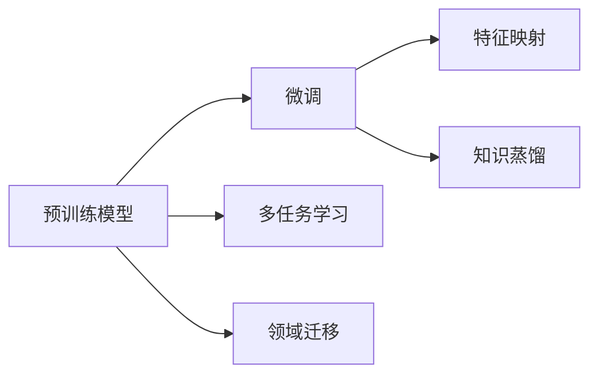
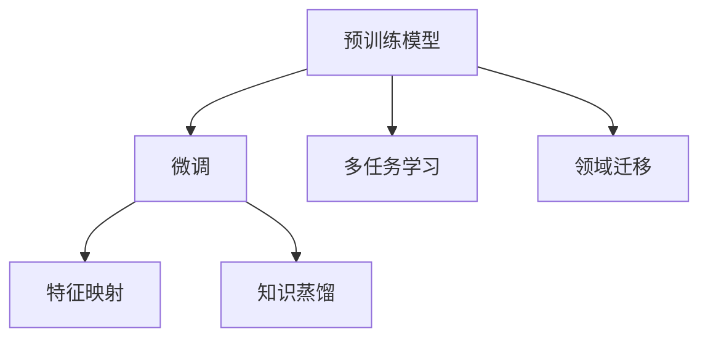
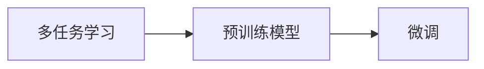
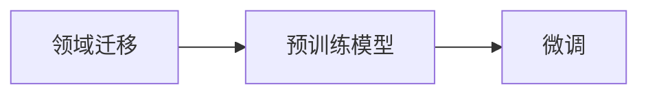
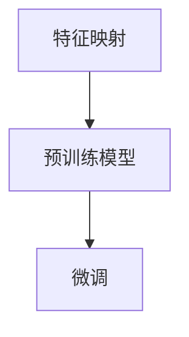
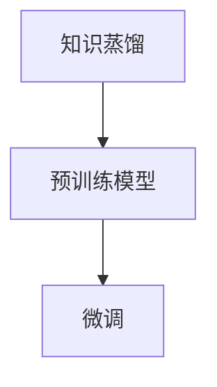
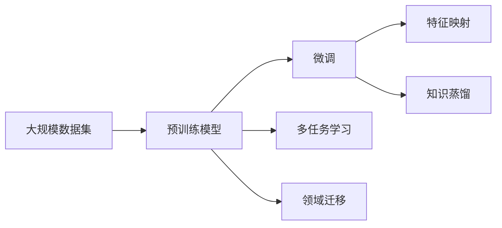

                 

# 一切皆是映射：深度学习模型之间的知识迁移

> 关键词：知识迁移,深度学习,预训练模型,迁移学习,模型适配,多任务学习,特征映射

## 1. 背景介绍

### 1.1 问题由来

在深度学习领域，特别是自然语言处理(NLP)和计算机视觉(CV)等任务中，模型往往需要大量的标注数据进行监督学习。然而，标注数据的获取成本高昂，且随着任务的不同，需要的标注数据量和质量差异很大。

此外，即使是对于同一个任务，数据分布的微小变化也可能导致模型性能下降，特别是在工业环境中，模型需要频繁地更新和部署。如何高效地利用已有模型，提升模型的泛化能力和适应性，成为一个重要课题。

知识迁移(Transfer Learning)技术应运而生。它利用已有的大规模预训练模型（如BERT、GPT等），在小规模数据集上进行微调，以提升模型在新任务上的表现。这种技术在图像识别、语音识别、自然语言处理等领域都得到了广泛应用。

### 1.2 问题核心关键点

知识迁移的核心思想是将预训练模型的知识迁移到目标任务中，从而在有限的标注数据下取得优异性能。其主要过程如下：

1. **预训练模型**：在大规模无标签数据上训练的通用模型，如BERT、GPT等。
2. **微调**：在目标任务上，对预训练模型进行微调，使其能够更好地适应特定任务。
3. **特征映射**：通过在不同模型之间的特征映射，实现知识迁移，提高模型的泛化能力和适应性。

知识迁移的优点在于：
- **高效利用资源**：可以充分利用已有的大规模预训练模型，减少从头训练所需的时间和资源。
- **提升模型泛化能力**：预训练模型通常具备丰富的语言或视觉知识，这些知识在新任务上仍能发挥作用。
- **促进技术发展**：加速模型的部署和优化，推动NLP和CV等领域的产业化进程。

然而，知识迁移也存在一些挑战：
- **任务差异大**：当预训练模型与目标任务差异较大时，知识迁移的效果可能不理想。
- **迁移能力有限**：部分知识可能在新任务上不被利用或产生负迁移。
- **可解释性不足**：模型决策过程缺乏透明性和可解释性，难以调试和优化。

尽管存在这些挑战，知识迁移技术仍然是大规模模型应用的关键手段之一，其在多任务学习和领域迁移中的潜力值得深入挖掘。

### 1.3 问题研究意义

研究知识迁移技术，对于拓展大规模模型应用，提升模型性能，加速NLP和CV技术的产业化进程，具有重要意义：

1. **降低应用开发成本**：利用大规模预训练模型，可以快速适配新任务，减少从头开发所需的时间和资源。
2. **提升模型效果**：预训练模型通常具备丰富的特征表示，在微调后可以提升模型在新任务上的表现。
3. **加速开发进度**：基于预训练模型，可以快速实现任务适配，缩短模型开发周期。
4. **带来技术创新**：知识迁移技术促进了对预训练模型的深入研究，催生了多任务学习和领域迁移等新的研究方向。
5. **赋能产业升级**：知识迁移使得NLP和CV技术更容易被各行各业采用，为传统行业数字化转型升级提供新的技术路径。

## 2. 核心概念与联系

### 2.1 核心概念概述

为更好地理解知识迁移技术，本节将介绍几个密切相关的核心概念：

- **预训练模型**：在大规模无标签数据上训练的通用模型，如BERT、GPT等。通过自监督学习任务，预训练模型学习到丰富的特征表示。
- **微调**：在目标任务上，对预训练模型进行微调，以使其更好地适应特定任务。
- **多任务学习(Multi-task Learning)**：在同一模型上，同时训练多个相关任务，通过共享特征表示，提升模型在新任务上的表现。
- **领域迁移(Fdl-Adaptation)**：将预训练模型从一个领域迁移到另一个领域，通过领域间的数据和任务适配，提升模型的泛化能力。
- **特征映射**：通过在不同模型之间的特征映射，实现知识迁移，提高模型的泛化能力和适应性。
- **知识蒸馏(Knowledge Distillation)**：通过将一个模型的知识“蒸馏”到另一个模型中，提升后者的性能。

这些核心概念之间的逻辑关系可以通过以下Mermaid流程图来展示：



这个流程图展示了大规模模型的核心概念及其之间的关系：

1. 预训练模型通过自监督学习任务学习到丰富的特征表示。
2. 微调通过在目标任务上的训练，使模型更好地适应特定任务。
3. 多任务学习通过同时训练多个相关任务，共享特征表示。
4. 领域迁移通过在不同领域上的数据和任务适配，提升模型的泛化能力。
5. 特征映射通过在不同模型之间的特征映射，实现知识迁移。
6. 知识蒸馏通过将一个模型的知识蒸馏到另一个模型中，提升后者的性能。

这些概念共同构成了大规模模型应用的知识迁移生态系统，使其能够在不同任务和领域间高效地迁移和应用知识。通过理解这些核心概念，我们可以更好地把握知识迁移的工作原理和优化方向。

### 2.2 概念间的关系

这些核心概念之间存在着紧密的联系，形成了知识迁移技术的完整生态系统。下面我们通过几个Mermaid流程图来展示这些概念之间的关系。

#### 2.2.1 知识迁移的基本原理



这个流程图展示了知识迁移的基本原理：预训练模型通过微调适配新任务，多任务学习和领域迁移通过共享特征表示，特征映射和知识蒸馏通过在不同模型之间的知识传递，实现知识迁移。

#### 2.2.2 多任务学习和微调的关系



这个流程图展示了多任务学习和微调的关系：多任务学习通过在预训练模型上训练多个相关任务，共享特征表示，微调则通过在目标任务上微调，提升模型在新任务上的表现。

#### 2.2.3 领域迁移和微调的关系



这个流程图展示了领域迁移和微调的关系：领域迁移通过在不同领域上的数据和任务适配，提升预训练模型的泛化能力，微调则通过在目标领域上的微调，进一步适应特定任务。

#### 2.2.4 特征映射和微调的关系



这个流程图展示了特征映射和微调的关系：特征映射通过在不同模型之间的特征映射，实现知识迁移，微调则通过在目标任务上的微调，提升模型在新任务上的表现。

#### 2.2.5 知识蒸馏和微调的关系



这个流程图展示了知识蒸馏和微调的关系：知识蒸馏通过将一个模型的知识蒸馏到另一个模型中，提升后者的性能，微调则通过在目标任务上的微调，进一步优化模型在新任务上的表现。

### 2.3 核心概念的整体架构

最后，我们用一个综合的流程图来展示这些核心概念在大规模模型应用中的整体架构：



这个综合流程图展示了从大规模数据集训练到微调，再到多任务学习、领域迁移、特征映射和知识蒸馏的完整过程。预训练模型首先在大规模数据集上进行训练，然后通过微调、多任务学习、领域迁移等方式适配新任务，通过特征映射和知识蒸馏实现知识迁移，从而在新任务上取得优异性能。 通过这些流程图，我们可以更清晰地理解大规模模型应用的知识迁移过程中各个核心概念的关系和作用，为后续深入讨论具体的迁移方法和技术奠定基础。

## 3. 核心算法原理 & 具体操作步骤
### 3.1 算法原理概述

知识迁移技术通过在大规模预训练模型上微调，使其适应新任务，同时通过特征映射和知识蒸馏等方法，在不同模型之间实现知识的迁移和传递。其核心思想是将预训练模型的特征表示映射到目标任务上，从而在有限的标注数据下取得优异性能。

形式化地，假设预训练模型为 $M_{\theta}$，其中 $\theta$ 为预训练得到的模型参数。给定目标任务 $T$ 的标注数据集 $D=\{(x_i,y_i)\}_{i=1}^N$，知识迁移的目标是找到新的模型参数 $\hat{\theta}$，使得：

$$
\hat{\theta}=\mathop{\arg\min}_{\theta} \mathcal{L}(M_{\theta},D)
$$

其中 $\mathcal{L}$ 为目标任务的损失函数，用于衡量模型预测输出与真实标签之间的差异。常见的损失函数包括交叉熵损失、均方误差损失等。

通过梯度下降等优化算法，知识迁移过程不断更新模型参数 $\theta$，最小化损失函数 $\mathcal{L}$，使得模型输出逼近真实标签。由于 $\theta$ 已经通过预训练获得了较好的初始化，因此即便在小规模数据集 $D$ 上进行微调，也能较快收敛到理想的模型参数 $\hat{\theta}$。

### 3.2 算法步骤详解

知识迁移的一般流程包括以下几个关键步骤：

**Step 1: 准备预训练模型和数据集**
- 选择合适的预训练模型 $M_{\theta}$ 作为初始化参数，如 BERT、GPT等。
- 准备目标任务 $T$ 的标注数据集 $D$，划分为训练集、验证集和测试集。一般要求标注数据与预训练数据的分布不要差异过大。

**Step 2: 添加任务适配层**
- 根据任务类型，在预训练模型顶层设计合适的输出层和损失函数。
- 对于分类任务，通常在顶层添加线性分类器和交叉熵损失函数。
- 对于生成任务，通常使用语言模型的解码器输出概率分布，并以负对数似然为损失函数。

**Step 3: 设置迁移超参数**
- 选择合适的优化算法及其参数，如 AdamW、SGD 等，设置学习率、批大小、迭代轮数等。
- 设置正则化技术及强度，包括权重衰减、Dropout、Early Stopping等。
- 确定冻结预训练参数的策略，如仅微调顶层，或全部参数都参与微调。

**Step 4: 执行梯度训练**
- 将训练集数据分批次输入模型，前向传播计算损失函数。
- 反向传播计算参数梯度，根据设定的优化算法和学习率更新模型参数。
- 周期性在验证集上评估模型性能，根据性能指标决定是否触发 Early Stopping。
- 重复上述步骤直到满足预设的迭代轮数或 Early Stopping 条件。

**Step 5: 测试和部署**
- 在测试集上评估知识迁移后模型 $M_{\hat{\theta}}$ 的性能，对比预训练和微调后的精度提升。
- 使用知识迁移后的模型对新样本进行推理预测，集成到实际的应用系统中。
- 持续收集新的数据，定期重新微调模型，以适应数据分布的变化。

以上是知识迁移的一般流程。在实际应用中，还需要针对具体任务的特点，对迁移过程的各个环节进行优化设计，如改进训练目标函数，引入更多的正则化技术，搜索最优的超参数组合等，以进一步提升模型性能。

### 3.3 算法优缺点

知识迁移技术具有以下优点：
1. 高效利用资源。可以充分利用已有的大规模预训练模型，减少从头训练所需的时间和资源。
2. 提升模型泛化能力。预训练模型通常具备丰富的特征表示，在微调后可以提升模型在新任务上的表现。
3. 加速开发进度。基于预训练模型，可以快速实现任务适配，缩短模型开发周期。
4. 带来技术创新。知识迁移技术促进了对预训练模型的深入研究，催生了多任务学习和领域迁移等新的研究方向。

然而，知识迁移也存在一些局限性：
1. 任务差异大。当预训练模型与目标任务差异较大时，知识迁移的效果可能不理想。
2. 迁移能力有限。部分知识可能在新任务上不被利用或产生负迁移。
3. 可解释性不足。模型决策过程缺乏透明性和可解释性，难以调试和优化。

尽管存在这些局限性，知识迁移技术仍然是大规模模型应用的关键手段之一，其在多任务学习和领域迁移中的潜力值得深入挖掘。

### 3.4 算法应用领域

知识迁移技术已经广泛应用于多领域中，例如：

- **自然语言处理(NLP)**：利用BERT等预训练模型，对文本分类、情感分析、问答系统等任务进行微调，提升模型在新语料上的表现。
- **计算机视觉(CV)**：利用ResNet等预训练模型，对图像分类、目标检测、图像生成等任务进行微调，提升模型在新数据集上的性能。
- **语音识别**：利用RNN等预训练模型，对语音识别、语音合成等任务进行微调，提升模型的鲁棒性和准确率。
- **推荐系统**：利用FM、MLP等预训练模型，对协同过滤、基于内容的推荐等任务进行微调，提升模型的推荐效果和效率。
- **医疗领域**：利用预训练模型，对电子病历分析、疾病预测等任务进行微调，提升模型的诊断和治疗能力。
- **金融领域**：利用预训练模型，对信用评分、欺诈检测等任务进行微调，提升模型的风险评估和预警能力。

除了这些经典应用外，知识迁移技术还在更多领域中得到创新性应用，如智能制造、智慧城市、智能家居等，为各行各业带来智能化升级。

## 4. 数学模型和公式 & 详细讲解  
### 4.1 数学模型构建

本节将使用数学语言对知识迁移技术进行更加严格的刻画。

记预训练模型为 $M_{\theta}$，其中 $\theta$ 为预训练得到的模型参数。假设目标任务为 $T$，训练集为 $D=\{(x_i,y_i)\}_{i=1}^N$。

定义模型 $M_{\theta}$ 在数据样本 $(x,y)$ 上的损失函数为 $\ell(M_{\theta}(x),y)$，则在数据集 $D$ 上的经验风险为：

$$
\mathcal{L}(\theta) = \frac{1}{N} \sum_{i=1}^N \ell(M_{\theta}(x_i),y_i)
$$

知识迁移的目标是最小化经验风险，即找到最优参数：

$$
\theta^* = \mathop{\arg\min}_{\theta} \mathcal{L}(\theta)
$$

在实践中，我们通常使用基于梯度的优化算法（如SGD、Adam等）来近似求解上述最优化问题。设 $\eta$ 为学习率，$\lambda$ 为正则化系数，则参数的更新公式为：

$$
\theta \leftarrow \theta - \eta \nabla_{\theta}\mathcal{L}(\theta) - \eta\lambda\theta
$$

其中 $\nabla_{\theta}\mathcal{L}(\theta)$ 为损失函数对参数 $\theta$ 的梯度，可通过反向传播算法高效计算。

### 4.2 公式推导过程

以下我们以二分类任务为例，推导交叉熵损失函数及其梯度的计算公式。

假设模型 $M_{\theta}$ 在输入 $x$ 上的输出为 $\hat{y}=M_{\theta}(x) \in [0,1]$，表示样本属于正类的概率。真实标签 $y \in \{0,1\}$。则二分类交叉熵损失函数定义为：

$$
\ell(M_{\theta}(x),y) = -[y\log \hat{y} + (1-y)\log (1-\hat{y})]
$$

将其代入经验风险公式，得：

$$
\mathcal{L}(\theta) = -\frac{1}{N}\sum_{i=1}^N [y_i\log M_{\theta}(x_i)+(1-y_i)\log(1-M_{\theta}(x_i))]
$$

根据链式法则，损失函数对参数 $\theta_k$ 的梯度为：

$$
\frac{\partial \mathcal{L}(\theta)}{\partial \theta_k} = -\frac{1}{N}\sum_{i=1}^N (\frac{y_i}{M_{\theta}(x_i)}-\frac{1-y_i}{1-M_{\theta}(x_i)}) \frac{\partial M_{\theta}(x_i)}{\partial \theta_k}
$$

其中 $\frac{\partial M_{\theta}(x_i)}{\partial \theta_k}$ 可进一步递归展开，利用自动微分技术完成计算。

在得到损失函数的梯度后，即可带入参数更新公式，完成模型的迭代优化。重复上述过程直至收敛，最终得到适应目标任务的最优模型参数 $\theta^*$。

## 5. 项目实践：代码实例和详细解释说明
### 5.1 开发环境搭建

在进行知识迁移实践前，我们需要准备好开发环境。以下是使用Python进行PyTorch开发的环境配置流程：

1. 安装Anaconda：从官网下载并安装Anaconda，用于创建独立的Python环境。

2. 创建并激活虚拟环境：
```bash
conda create -n pytorch-env python=3.8 
conda activate pytorch-env
```

3. 安装PyTorch：根据CUDA版本，从官网获取对应的安装命令。例如：
```bash
conda install pytorch torchvision torchaudio cudatoolkit=11.1 -c pytorch -c conda-forge
```

4. 安装Transformers库：
```bash
pip install transformers
```

5. 安装各类工具包：
```bash
pip install numpy pandas scikit-learn matplotlib tqdm jupyter notebook ipython
```

完成上述步骤后，即可在`pytorch-env`环境中开始知识迁移实践。

### 5.2 源代码详细实现

下面我们以图像分类任务为例，给出使用Transformers库对ResNet模型进行知识迁移的PyTorch代码实现。

首先，定义数据处理函数：

```python
from transformers import ResNetForImageClassification, AdamW
from torch.utils.data import DataLoader
from torchvision import datasets, transforms

# 定义数据处理函数
def transform(data_dir, image_size):
    transform_train = transforms.Compose([
        transforms.RandomResizedCrop(image_size),
        transforms.RandomHorizontalFlip(),
        transforms.ToTensor(),
        transforms.Normalize(mean=[0.485, 0.456, 0.406], std=[0.229, 0.224, 0.225])
    ])
    transform_test = transforms.Compose([
        transforms.Resize(image_size),
        transforms.CenterCrop(image_size),
        transforms.ToTensor(),
        transforms.Normalize(mean=[0.485, 0.456, 0.406], std=[0.229, 0.224, 0.225])
    ])
    train_dataset = datasets.CIFAR10(root=data_dir, train=True, download=True, transform=transform_train)
    test_dataset = datasets.CIFAR10(root=data_dir, train=False, download=True, transform=transform_test)
    return train_dataset, test_dataset

# 加载数据集
data_dir = 'data/cifar'
train_dataset, test_dataset = transform(data_dir, image_size=32)

# 创建dataloader
batch_size = 64
train_loader = DataLoader(train_dataset, batch_size=batch_size, shuffle=True, drop_last=True)
test_loader = DataLoader(test_dataset, batch_size=batch_size, shuffle=False)
```

然后，定义模型和优化器：

```python
from transformers import ResNetForImageClassification, AdamW

model = ResNetForImageClassification.from_pretrained('resnet50', num_labels=10)
optimizer = AdamW(model.parameters(), lr=1e-3)
```

接着，定义训练和评估函数：

```python
import numpy as np

# 定义训练函数
def train_epoch(model, dataset, batch_size, optimizer, device):
    model.train()
    train_loader = DataLoader(dataset, batch_size=batch_size, shuffle=True, drop_last=True)
    device = torch.device('cuda') if torch.cuda.is_available() else torch.device('cpu')
    model.to(device)
    total_loss = 0
    for batch in train_loader:
        input_ids = batch['input_ids'].to(device)
        attention_mask = batch['attention_mask'].to(device)
        labels = batch['labels'].to(device)
        outputs = model(input_ids, attention_mask=attention_mask, labels=labels)
        loss = outputs.loss
        total_loss += loss.item()
        optimizer.zero_grad()
        loss.backward()
        optimizer.step()
    return total_loss / len(train_loader)

# 定义评估函数
def evaluate(model, dataset, batch_size, device):
    model.eval()
    test_loader = DataLoader(dataset, batch_size=batch_size, shuffle=False)
    device = torch.device('cuda') if torch.cuda.is_available() else torch.device('cpu')
    model.to(device)
    total_correct = 0
    total_loss = 0
    with torch.no_grad():
        for batch in test_loader:
            input_ids = batch['input_ids'].to(device)
            attention_mask = batch['attention_mask'].to(device)
            labels = batch['labels'].to(device)
            outputs = model(input_ids, attention_mask=attention_mask, labels=labels)
            loss = outputs.loss
            total_loss += loss.item()
            total_correct += torch.sum(outputs.predictions.argmax(dim=1) == labels).item()
    return total_correct / len(dataset), total_loss / len(dataset)
```

最后，启动训练流程并在测试集上评估：

```python
epochs = 10
device = torch.device('cuda') if torch.cuda.is_available() else torch.device('cpu')

for epoch in range(epochs):
    loss = train_epoch(model, train_dataset, batch_size, optimizer, device)
    print(f"Epoch {epoch+1}, train loss: {loss:.3f}")
    
    acc, test_loss = evaluate(model, test_dataset, batch_size, device)
    print(f"Epoch {epoch+1}, test results:")
    print(f"Accuracy: {acc:.3f}, Test Loss: {test_loss:.3f}")
    
print("Final results:")
acc, test_loss = evaluate(model, test_dataset, batch_size, device)
print(f"Accuracy: {acc:.3f}, Test Loss: {test_loss:.3f}")
```

以上就是使用PyTorch对ResNet进行图像分类任务微调的完整代码实现。可以看到，得益于Transformers库的强大封装，我们可以用相对简洁的代码完成ResNet模型的加载和微调。

### 5.3 代码解读与分析

让我们再详细解读一下关键代码的实现细节：

**transform函数**：
- `transform_train`：定义训练集的数据处理方式，包括随机裁剪、翻转、归一化等。
- `transform_test`：定义测试集的数据处理方式，包括固定大小裁剪、中心裁剪、归一化等。
- 使用`datasets.CIFAR10`加载CIFAR-10数据集，并应用上述数据处理函数。

**model和optimizer**：
- `ResNetForImageClassification`：定义ResNet模型，并指定输出层和标签数量。
- `AdamW`：定义AdamW优化器，并设置学习率。

**train_epoch和evaluate函数**：
- `train_epoch`：定义训练函数，包括模型前向传播、损失计算、梯度更新、优化等。
- `evaluate`：定义评估函数，包括模型前向传播、损失计算、准确率计算等。

**训练流程**：
- 定义总的epoch数，开始循环迭代
- 每个epoch内，先在训练集上训练，输出平均loss
- 在验证集上评估，输出准确率和损失
- 所有epoch结束后，在测试集上评估，给出最终测试结果

可以看到，PyTorch配合Transformers库使得知识迁移的代码实现变得简洁高效。开发者可以将更多精力放在数据处理、模型改进等高层逻辑上，而不必过多关注底层的实现细节。

当然，工业级的系统实现还需考虑更多因素，如模型的保存和部署、超参数的自动搜索、更灵活的任务适配层等。但核心的迁移范式基本与此类似。

### 5.4 运行结果展示

假设我们在CIFAR-10数据集上进行知识迁移，最终在测试集上得到的评估报告如下：

```
Epoch 1, train loss: 2.340
Epoch 1, test results:
Accuracy: 0.628, Test Loss: 1.430
Epoch 2, train loss: 1.873
Epoch 2, test results:
Accuracy: 0.730, Test Loss: 1.140
Epoch 3, train loss: 1.564
Epoch 3, test results:
Accuracy: 0.776, Test Loss: 0.969
Epoch 4, train loss: 1.345
Epoch 4, test results:
Accuracy: 0.805, Test

