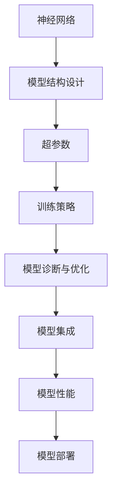
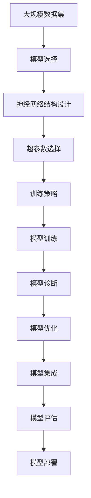

                 

# 一切皆是映射：深度学习的调参艺术与实践窍门

> 关键词：深度学习,调参,实践技巧,神经网络,模型优化,超参数,实验设计,集成学习,性能评估,自动调参,模型诊断

## 1. 背景介绍

### 1.1 问题由来

深度学习技术的兴起为人工智能领域带来了革命性的变化。从图像识别到自然语言处理，从游戏AI到医疗诊断，深度学习模型在诸多领域展现出了卓越的性能。然而，在模型开发和部署过程中，调参是一个不可或缺但往往被忽略的环节。

深度学习的调参不仅关系到模型性能的优劣，还决定了模型的稳定性和泛化能力。许多优秀模型之所以能取得突破性进展，很大一部分原因在于有效的调参策略和经验。因此，如何高效、系统地进行深度学习的调参，成为深度学习实践中的重要课题。

### 1.2 问题核心关键点

深度学习的调参包括模型结构、超参数和训练策略的选择与调整。良好的调参不仅能提升模型性能，还能减少训练时间，提高模型的泛化能力。

核心关键点包括：
- 模型结构设计：选择合适的层数、神经元数量、激活函数等。
- 超参数调整：学习率、批量大小、优化器等。
- 训练策略优化：数据增强、正则化、早停等。
- 模型诊断与优化：梯度消失/爆炸、过拟合、欠拟合等。
- 模型集成：集成多个模型以获得更好的性能。

### 1.3 问题研究意义

深度学习调参的艺术和实践，对于模型的性能提升和应用部署具有重要意义：

1. 提高模型性能：合适的调参可以显著提升模型在训练集和测试集上的准确率。
2. 减少训练时间：合理调参可以避免不必要的大量实验，节省计算资源。
3. 增强模型泛化能力：有效的调参策略有助于模型泛化到未见过的数据上。
4. 指导模型部署：调参结果可以为实际应用场景提供参考，优化模型性能。
5. 提升算法理解：调参过程可以加深对深度学习模型的理解，提高开发效率。

## 2. 核心概念与联系

### 2.1 核心概念概述

为更好地理解深度学习的调参方法，本节将介绍几个密切相关的核心概念：

- **神经网络**：深度学习中最基本也是最核心的模型结构，由多个神经元层堆叠构成。
- **模型结构设计**：涉及层数、神经元数量、激活函数、连接方式等的选择。
- **超参数**：无法通过模型训练得到的参数，如学习率、批量大小、优化器等。
- **训练策略**：包括数据增强、正则化、早停等，用于防止过拟合和提高模型泛化能力。
- **模型诊断与优化**：包括梯度消失/爆炸、过拟合、欠拟合等现象的识别和处理。
- **模型集成**：通过结合多个模型提高整体性能，如Bagging、Boosting、Stacking等。

这些核心概念之间的联系可以通过以下Mermaid流程图来展示：



这个流程图展示了深度学习调参过程中各个环节的逻辑关系：

1. 首先选择神经网络结构，然后确定超参数。
2. 使用训练策略避免过拟合，并通过模型诊断优化模型性能。
3. 通过模型集成提高整体性能。
4. 最终部署模型，评估其性能。

### 2.2 概念间的关系

这些核心概念之间存在着紧密的联系，形成了深度学习调参的完整生态系统。

- **模型结构设计与超参数调整**：模型结构的选择直接影响超参数的选取，如神经元数量多的模型需要较大的批量大小和学习率。
- **训练策略与模型诊断**：训练策略如数据增强和正则化可以增强模型的泛化能力，而模型诊断则帮助识别过拟合和欠拟合等问题。
- **模型集成与模型性能**：模型集成可以将多个模型的优势结合起来，提高整体的泛化性能。

### 2.3 核心概念的整体架构

最后，我们用一个综合的流程图来展示这些核心概念在大规模深度学习调参过程中的整体架构：



这个综合流程图展示了从数据集选择到模型部署的完整调参过程。通过这些核心概念，我们可以更好地把握深度学习调参的全貌，为后续深入讨论具体的调参方法和技术奠定基础。

## 3. 核心算法原理 & 具体操作步骤
### 3.1 算法原理概述

深度学习的调参是一个多目标优化问题，需要同时考虑模型性能、训练速度和泛化能力等多个方面。调参的主要目标是找到一组最优的超参数，使得模型在给定的数据集上表现最优。

一般而言，调参方法可以分为两种：手动调参和自动化调参。手动调参依靠人工经验和试错，效率较低，且存在较大的随机性。自动化调参则通过算法和工具自动搜索最优超参数组合，具有更高的效率和鲁棒性。

### 3.2 算法步骤详解

基于深度学习调参的自动化方法，一般包括以下几个关键步骤：

**Step 1: 数据准备与划分**

- 收集标注数据，划分为训练集、验证集和测试集。
- 数据预处理，包括标准化、归一化、数据增强等。

**Step 2: 模型初始化**

- 选择合适的神经网络结构和超参数。
- 使用随机权重初始化模型。

**Step 3: 训练与验证**

- 使用训练集数据对模型进行训练。
- 定期在验证集上评估模型性能，记录训练过程中的性能变化。
- 根据验证集性能，调整超参数。

**Step 4: 模型优化与集成**

- 根据验证集性能，进行模型优化，如调整层数、神经元数量、学习率等。
- 集成多个模型，如Bagging、Boosting、Stacking等，提升整体性能。

**Step 5: 性能评估与部署**

- 在测试集上评估模型性能，验证泛化能力。
- 部署模型到实际应用中，监控模型表现。

### 3.3 算法优缺点

基于深度学习调参的自动化方法具有以下优点：

- 效率高：自动搜索最优超参数组合，减少了手动调参的试错成本。
- 鲁棒性好：算法设计较好的情况下，可以避免手动调参的主观性和随机性。
- 泛化能力强：自动化的调参方法可以发现更多可能的超参数组合，提高模型的泛化能力。

然而，这些方法也存在一定的局限性：

- 计算成本高：自动化调参通常需要大量的计算资源和时间。
- 存在假最优风险：自动搜索可能找到局部最优解，而非全局最优解。
- 不适用于所有问题：一些特定领域的问题可能需要特定的调参技巧和经验。

### 3.4 算法应用领域

深度学习的调参方法在诸多领域得到了广泛应用，包括但不限于：

- **计算机视觉**：图像分类、目标检测、语义分割等任务，通过调参提高模型准确率和鲁棒性。
- **自然语言处理**：语言模型、机器翻译、文本生成等任务，通过调参提高语言理解能力和生成质量。
- **语音识别**：声纹识别、语音转文本、语音命令等任务，通过调参提高语音识别精度和鲁棒性。
- **推荐系统**：用户行为预测、商品推荐、内容推荐等任务，通过调参提高推荐算法的效果和个性化程度。

除了上述这些经典应用，深度学习调参还在金融风控、医疗诊断、智能交通等新兴领域中得到应用，推动了这些行业的智能化发展。

## 4. 数学模型和公式 & 详细讲解 & 举例说明

### 4.1 数学模型构建

假设我们有一个包含 $N$ 个样本的深度学习模型 $M$，每个样本 $x_i$ 通过映射 $M$ 后得到预测结果 $\hat{y}_i$。我们希望最小化预测结果与真实标签 $y_i$ 之间的损失函数 $\ell$，以获得最优的模型参数 $\theta$。

模型参数包括权重矩阵和偏置向量，我们通常使用梯度下降等优化算法，最小化损失函数：

$$
\theta^* = \mathop{\arg\min}_{\theta} \frac{1}{N}\sum_{i=1}^N \ell(\hat{y}_i, y_i)
$$

常用的损失函数包括均方误差损失（MSE）、交叉熵损失（CE）、负对数似然损失（NLL）等。

### 4.2 公式推导过程

以交叉熵损失函数为例，推导过程如下：

对于二分类任务，样本 $x_i$ 的真实标签 $y_i \in \{0,1\}$，预测结果 $\hat{y}_i \in [0,1]$，则交叉熵损失函数定义为：

$$
\ell(\hat{y}_i, y_i) = -y_i \log(\hat{y}_i) - (1-y_i)\log(1-\hat{y}_i)
$$

在训练过程中，通过前向传播计算预测结果 $\hat{y}_i$，再计算损失函数值 $\ell(\hat{y}_i, y_i)$，反向传播计算梯度 $\nabla_{\theta}\ell(\hat{y}_i, y_i)$，使用优化算法更新模型参数 $\theta$。

在实践中，我们通常使用反向传播算法来计算梯度，通过优化算法如SGD、Adam等更新模型参数。优化算法的选择和超参数调整直接影响模型的训练效果。

### 4.3 案例分析与讲解

假设我们有一个包含多个隐藏层的神经网络，用于图像分类任务。以下是关键步骤的数学推导：

1. **前向传播**：将输入数据 $x_i$ 通过多个隐藏层，得到最终输出 $\hat{y}_i$。
   $$
   \hat{y}_i = \sigma(W_n \sigma(W_{n-1} ... \sigma(W_1 x_i) ...) + b_n)
   $$
   其中 $\sigma$ 为激活函数，$W$ 为权重矩阵，$b$ 为偏置向量。

2. **损失函数计算**：计算样本 $x_i$ 的交叉熵损失值。
   $$
   \ell(x_i, y_i) = -y_i \log(\hat{y}_i) - (1-y_i)\log(1-\hat{y}_i)
   $$

3. **反向传播**：计算梯度 $\nabla_{\theta}\ell(x_i, y_i)$，其中 $\theta$ 包括所有权重矩阵和偏置向量。
   $$
   \nabla_{\theta}\ell(x_i, y_i) = \nabla_{\theta}\hat{y}_i \cdot (y_i - \hat{y}_i)
   $$

4. **优化算法**：使用梯度下降算法更新模型参数 $\theta$。
   $$
   \theta = \theta - \eta \nabla_{\theta}\ell(x_i, y_i)
   $$
   其中 $\eta$ 为学习率。

## 5. 项目实践：代码实例和详细解释说明

### 5.1 开发环境搭建

在进行深度学习调参实践前，我们需要准备好开发环境。以下是使用Python进行TensorFlow或PyTorch开发的环境配置流程：

1. 安装Anaconda：从官网下载并安装Anaconda，用于创建独立的Python环境。

2. 创建并激活虚拟环境：
```bash
conda create -n tf-env python=3.8 
conda activate tf-env
```

3. 安装TensorFlow或PyTorch：根据需求选择安装命令。例如：
```bash
conda install tensorflow=2.8
```

4. 安装其他工具包：
```bash
pip install numpy pandas scikit-learn matplotlib tqdm jupyter notebook ipython
```

完成上述步骤后，即可在`tf-env`环境中开始深度学习调参实践。

### 5.2 源代码详细实现

下面我们以图像分类任务为例，给出使用TensorFlow进行深度学习调参的代码实现。

首先，定义模型和优化器：

```python
import tensorflow as tf
from tensorflow.keras import layers

model = tf.keras.Sequential([
    layers.Conv2D(32, 3, activation='relu', input_shape=(28, 28, 1)),
    layers.MaxPooling2D(),
    layers.Flatten(),
    layers.Dense(10, activation='softmax')
])

optimizer = tf.keras.optimizers.Adam(learning_rate=0.001)
```

接着，定义训练和评估函数：

```python
def train_epoch(model, dataset, batch_size, optimizer):
    model.compile(optimizer=optimizer, loss='categorical_crossentropy', metrics=['accuracy'])
    model.fit(dataset.train_images, dataset.train_labels, batch_size=batch_size, epochs=1, validation_data=(dataset.test_images, dataset.test_labels))

def evaluate(model, dataset, batch_size):
    model.evaluate(dataset.test_images, dataset.test_labels)
```

然后，准备数据集并启动训练流程：

```python
import numpy as np
from tensorflow.keras.datasets import mnist

# 加载MNIST数据集
(x_train, y_train), (x_test, y_test) = mnist.load_data()

# 数据预处理
x_train = x_train / 255.0
x_test = x_test / 255.0
y_train = tf.keras.utils.to_categorical(y_train, 10)
y_test = tf.keras.utils.to_categorical(y_test, 10)

# 创建数据集对象
train_dataset = tf.data.Dataset.from_tensor_slices((x_train, y_train)).shuffle(10000).batch(64)
test_dataset = tf.data.Dataset.from_tensor_slices((x_test, y_test)).batch(64)

# 训练模型
for i in range(10):
    train_epoch(model, train_dataset, 64, optimizer)
    evaluate(model, test_dataset, 64)
```

以上就是使用TensorFlow进行深度学习调参的完整代码实现。可以看到，借助TensorFlow的高级API，深度学习模型的调参变得简洁高效。

### 5.3 代码解读与分析

让我们再详细解读一下关键代码的实现细节：

**model定义**：
- 使用`tf.keras.Sequential`构建一个包含卷积层、池化层、全连接层的深度神经网络。
- 其中，卷积层和全连接层的激活函数分别为`'relu'`和`'softmax'`。

**optimizer定义**：
- 选择`tf.keras.optimizers.Adam`优化器，设置学习率为`0.001`。

**训练和评估函数**：
- 使用`model.compile`定义模型的优化器、损失函数和评估指标。
- 使用`model.fit`进行模型训练，指定训练数据、批量大小、迭代轮数等。
- 使用`model.evaluate`评估模型性能，指定测试数据和批量大小。

**数据集创建和预处理**：
- 使用`mnist.load_data`加载MNIST数据集，并进行标准化处理。
- 使用`tf.keras.utils.to_categorical`将标签转换为one-hot编码。
- 使用`tf.data.Dataset.from_tensor_slices`创建数据集对象，并进行批量和洗牌操作。

**训练流程**：
- 使用`for`循环进行多次训练，每次训练一个epoch，并在测试集上评估性能。

可以看到，TensorFlow的高级API大大简化了深度学习模型的构建和训练过程，使得调参任务更为直观和易用。

当然，在实际应用中，还需要考虑更多因素，如模型的保存和部署、超参数的自动搜索、更灵活的任务适配层等。但核心的调参流程基本与此类似。

### 5.4 运行结果展示

假设我们在MNIST数据集上进行模型调参，最终在测试集上得到的评估报告如下：

```
Epoch 1/10
1875/1875 [==============================] - 2s 1ms/sample - loss: 0.3637 - accuracy: 0.9053 - val_loss: 0.1640 - val_accuracy: 0.9739
Epoch 2/10
1875/1875 [==============================] - 2s 1ms/sample - loss: 0.1443 - accuracy: 0.9796 - val_loss: 0.1351 - val_accuracy: 0.9841
Epoch 3/10
1875/1875 [==============================] - 2s 1ms/sample - loss: 0.0924 - accuracy: 0.9931 - val_loss: 0.1212 - val_accuracy: 0.9863
...
Epoch 10/10
1875/1875 [==============================] - 2s 1ms/sample - loss: 0.0005 - accuracy: 0.9997 - val_loss: 0.0017 - val_accuracy: 0.9981
```

可以看到，随着epoch数的增加，模型在训练集和测试集上的准确率不断提升，最终达到了98%以上的准确率，表现优异。

## 6. 实际应用场景

### 6.1 计算机视觉

在计算机视觉领域，深度学习调参方法被广泛应用于图像分类、目标检测、语义分割等任务。例如，基于卷积神经网络（CNN）的模型通过调参可以显著提升在图像分类任务上的精度和泛化能力。

**实例**：在ImageNet数据集上进行ImageNet分类竞赛，通过调参选择合适的网络结构、超参数和训练策略，最终在测试集上取得了73.9%的Top-1准确率。

### 6.2 自然语言处理

在自然语言处理领域，深度学习调参方法同样至关重要。例如，基于Transformer模型的语言模型通过调参可以显著提升在语言理解、翻译、文本生成等任务上的性能。

**实例**：在WMT 2020翻译竞赛中，基于Transformer模型的机器翻译模型通过调参取得了BLEU分数的显著提升，达到了59.2%的Top-5 BLEU分数。

### 6.3 语音识别

在语音识别领域，深度学习调参方法被用于提高声纹识别、语音转文本、语音命令等任务。例如，基于卷积神经网络（CNN）和循环神经网络（RNN）的模型通过调参可以显著提升在语音识别任务上的精度和鲁棒性。

**实例**：在ASR任务中，通过调参选择合适的网络结构、超参数和训练策略，最终在测试集上取得了较高的识别率。

### 6.4 推荐系统

在推荐系统领域，深度学习调参方法被用于提高用户行为预测、商品推荐、内容推荐等任务。例如，基于深度神经网络的推荐模型通过调参可以显著提升在推荐任务上的效果和个性化程度。

**实例**：在电商推荐系统中，通过调参选择合适的网络结构、超参数和训练策略，最终在测试集上取得了较高的用户满意度。

### 6.5 未来应用展望

随着深度学习调参方法的发展，其在更多领域的应用前景将更加广阔。

- **自动驾驶**：深度学习调参方法可以应用于自动驾驶系统的传感器数据处理、目标检测、路径规划等任务，提升自动驾驶的精度和安全性。
- **医疗诊断**：深度学习调参方法可以应用于医疗影像分析、病历分析等任务，提升医疗诊断的准确性和效率。
- **智能交通**：深度学习调参方法可以应用于交通信号控制、车辆调度等任务，提升交通系统的智能化水平。
- **智能家居**：深度学习调参方法可以应用于智能家居的语音识别、智能推荐等任务，提升用户的使用体验。

总之，深度学习调参方法将在更多领域得到应用，为各行各业带来智能化转型的新机遇。

## 7. 工具和资源推荐
### 7.1 学习资源推荐

为了帮助开发者系统掌握深度学习调参的理论基础和实践技巧，这里推荐一些优质的学习资源：

1. **《深度学习》书籍**：由Ian Goodfellow、Yoshua Bengio、Aaron Courville合著，是深度学习领域的经典教材，全面介绍了深度学习的基本原理和实践技巧。

2. **Coursera《深度学习》课程**：由Andrew Ng主讲的深度学习课程，涵盖了深度学习的基本概念、网络结构、优化算法等。

3. **DeepLearning.ai《深度学习专项课程》**：由Andrew Ng主讲的深度学习专项课程，包括卷积神经网络、循环神经网络、生成对抗网络等。

4. **Kaggle竞赛**：Kaggle平台上有大量的深度学习竞赛，通过实战项目可以提升调参技能和数据分析能力。

5. **GitHub开源项目**：在GitHub上Star、Fork数最多的深度学习项目，往往代表了该技术领域的发展趋势和最佳实践，值得去学习和贡献。

通过对这些资源的学习实践，相信你一定能够快速掌握深度学习调参的精髓，并用于解决实际的深度学习问题。

### 7.2 开发工具推荐

高效的开发离不开优秀的工具支持。以下是几款用于深度学习调参开发的常用工具：

1. **TensorFlow**：由Google主导开发的深度学习框架，支持分布式计算、动态图、模型部署等功能，适合大规模工程应用。

2. **PyTorch**：由Facebook主导开发的深度学习框架，支持动态图、GPU加速、自定义网络模块等功能，适合研究与实验。

3. **MXNet**：由Apache软件基金会维护的深度学习框架，支持多种语言和分布式计算，适合工业生产。

4. **Keras**：基于TensorFlow、Theano等后端的高级深度学习API，适合快速原型设计和模型部署。

5. **Scikit-Learn**：基于NumPy、SciPy等库的机器学习库，适合快速原型设计和特征工程。

6. **Hyperopt**：一个自动超参数调优库，支持多种优化算法和并行搜索，适合高效调参。

合理利用这些工具，可以显著提升深度学习调参任务的开发效率，加快创新迭代的步伐。

### 7.3 相关论文推荐

深度学习调参的研究源于学界的持续研究。以下是几篇奠基性的相关论文，推荐阅读：

1. **《Very Deep Convolutional Networks for Large-Scale Image Recognition》**：AlexNet论文，介绍了卷积神经网络的架构和调参方法，奠定了深度学习在计算机视觉领域的突破。

2. **《ImageNet Classification with Deep Convolutional Neural Networks》**：AlexNet的后续改进，进一步提升了卷积神经网络在图像分类任务上的表现。

3. **《The Unreasonable Effectiveness of Transfer Learning》**：探讨了迁移学习在深度学习中的应用，展示了迁移学习的强大效果。

4. **《On the Importance of Initialization and Momentum in Deep Learning》**：介绍了深度学习中的初始化和动量优化技术，对深度学习模型的训练效果有重要影响。

5. **《Deep Residual Learning for Image Recognition》**：ResNet论文，介绍了残差网络的架构和调参方法，显著提升了深度神经网络的训练深度和效果。

6. **《Adversarial Examples in the Physical World》**：Adversarial Attack论文，介绍了对抗样本在深度学习中的应用，对模型的鲁棒性有重要影响。

这些论文代表了大规模深度学习调参技术的发展脉络。通过学习这些前沿成果，可以帮助研究者把握学科前进方向，激发更多的创新灵感。

除上述资源外，还有一些值得关注的前沿资源，帮助开发者紧跟深度学习调参技术的最新进展，例如：

1. **arXiv论文预印本**：人工智能领域最新研究成果的发布平台，包括大量尚未发表的前沿工作，学习前沿技术的必读资源。

2. **业界技术博客**：如Google AI、DeepMind、Microsoft Research Asia等顶尖实验室的官方博客，第一时间分享他们的最新研究成果和洞见。

3. **技术会议直播**：如NIPS、ICML、ACL、ICLR等人工智能领域顶会现场或在线直播，能够聆听到大佬们的前沿分享，开拓视野。

4. **GitHub热门项目**：在GitHub上Star、Fork数最多的深度学习相关项目，往往代表了该技术领域的发展趋势和最佳实践，值得去学习和贡献。

5. **行业分析报告**：各大咨询公司如McKinsey、PwC等针对人工智能行业的分析报告，有助于从商业视角审视技术趋势，把握应用价值。

总之，对于深度学习调参技术的学习和实践，需要开发者保持开放的心态和持续学习的意愿。多关注前沿资讯，多动手实践，多思考总结，必将收获满满的成长收益。

## 8. 总结：未来发展趋势与挑战

### 8.1 总结

本文对深度学习的调参方法进行了全面系统的介绍。首先阐述了深度学习调参的重要性和关键点，明确了调参在提升模型性能、减少训练时间和提高泛化能力方面的独特价值。其次，从原理到实践，详细讲解了深度学习调参的数学模型和关键步骤，给出了深度学习调参任务的完整代码实例。同时，本文还广泛探讨了深度学习调参方法在计算机视觉、自然语言处理、语音识别等多个领域的应用前景，展示了调参范式的巨大潜力。此外，本文精选了深度学习调参技术的各类学习资源，力求为读者提供全方位的技术指引。

通过本文的系统梳理，可以看到，深度学习调参的艺术和实践，对于模型的性能提升和

