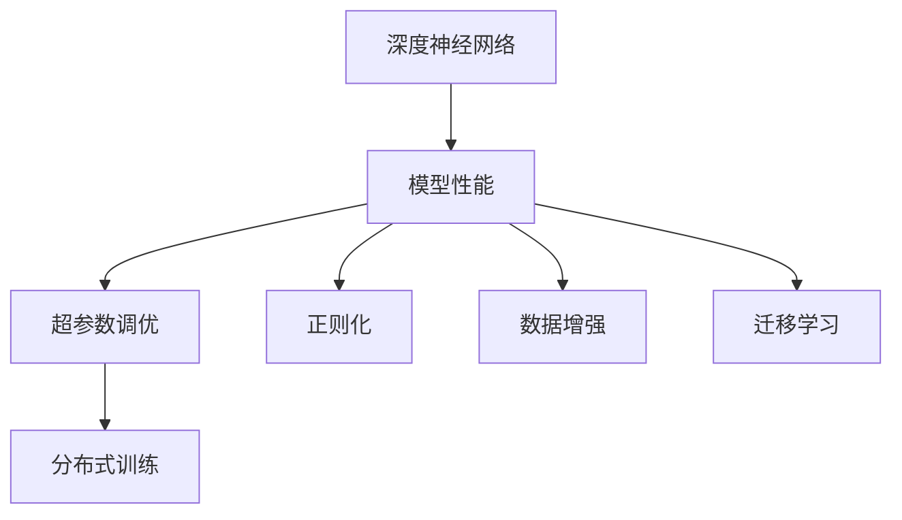
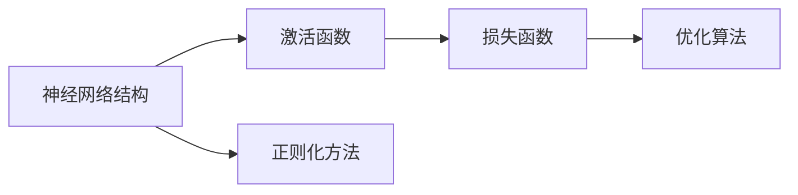
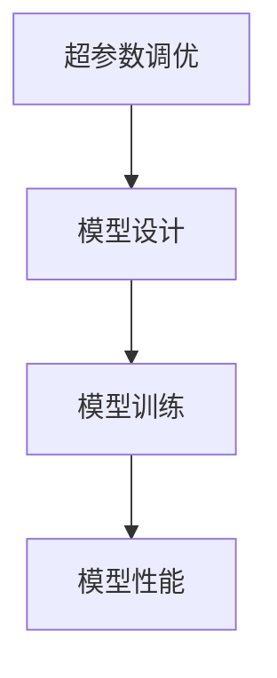
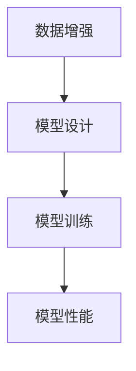
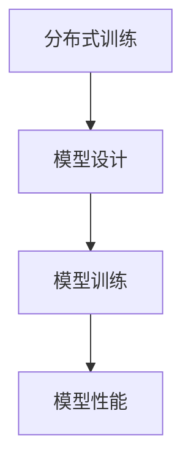
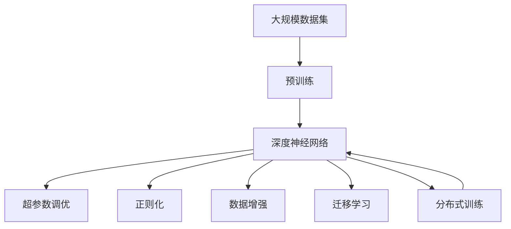

                 

# 一切皆是映射：深度神经网络的调优与优化策略

> 关键词：深度神经网络,调优,优化策略,模型性能提升,超参数调优,正则化,数据增强,迁移学习,分布式训练

## 1. 背景介绍

### 1.1 问题由来
在深度学习领域，神经网络模型的调优与优化始终是至关重要的环节。无论是目标函数的设计，还是模型参数的初始化、训练算法的选择，甚至是超参数的设定，每一处细节都可能影响模型的性能表现。随着模型规模的日益扩大和数据量的不断增长，传统的手动调参方法已难以适应需求，自动化的调优与优化策略成为了新的热点。

### 1.2 问题核心关键点
深度神经网络的调优与优化主要涉及以下几个方面：

- **模型设计**：包括网络结构的选择、激活函数、正则化方法等。
- **损失函数**：根据具体任务选择合适的损失函数，如均方误差、交叉熵、Kullback-Leibler散度等。
- **训练算法**：选择合适的优化器及其参数，如SGD、Adam、RMSprop等，并设置学习率、批大小等超参数。
- **数据增强**：通过扩充数据集、增强样本多样性，提升模型泛化能力。
- **迁移学习**：通过在大规模数据集上预训练，在小规模任务上微调，提高模型效率。
- **超参数调优**：通过网格搜索、贝叶斯优化等方法，寻找最优的超参数组合。

这些关键点相互影响，共同决定了深度神经网络的性能表现。因此，理解并掌握这些核心概念及其交互关系，对于模型的成功训练至关重要。

### 1.3 问题研究意义
调优与优化技术不仅影响模型的训练效率和精度，还对模型的可解释性、鲁棒性和泛化能力有着深远影响。优秀的调优与优化策略能够显著提升模型性能，缩短开发周期，降低开发成本，是实现高效智能应用的基础。

## 2. 核心概念与联系

### 2.1 核心概念概述

为更好地理解深度神经网络的调优与优化策略，本节将介绍几个密切相关的核心概念：

- **深度神经网络(Deep Neural Network, DNN)**：包含多个隐含层的前馈神经网络，具有强大的非线性表达能力。
- **模型性能**：包括模型的准确率、召回率、F1分数等指标，衡量模型在不同数据集上的表现。
- **超参数调优**：通过系统性方法调整模型中的非训练参数（如学习率、批大小、正则化强度等），以提升模型性能。
- **正则化**：通过引入L1正则、L2正则、Dropout等方法，防止过拟合，提升模型泛化能力。
- **数据增强**：通过旋转、平移、缩放等变换，生成更多样化的训练数据。
- **迁移学习**：通过在大规模数据集上预训练模型，在小规模任务上微调，提高模型效率和精度。
- **分布式训练**：利用多台计算设备并行计算，加速模型训练过程。

这些核心概念之间的逻辑关系可以通过以下Mermaid流程图来展示：



这个流程图展示了大模型微调的完整生态系统，其中包括模型性能优化、超参数调优、正则化、数据增强、迁移学习和分布式训练等关键环节，这些环节共同构成了深度神经网络调优与优化的主要框架。

### 2.2 概念间的关系

这些核心概念之间存在着紧密的联系，形成了深度神经网络调优与优化的完整生态系统。下面我通过几个Mermaid流程图来展示这些概念之间的关系。

#### 2.2.1 模型设计的基础



这个流程图展示了一个典型的深度神经网络模型设计过程。从神经网络结构、激活函数、正则化方法到损失函数和优化算法，每一步设计都直接影响模型的性能。

#### 2.2.2 超参数调优与模型设计的关系



这个流程图展示了超参数调优在模型设计中的重要地位。通过超参数调优，可以找到最优的模型设计方案，从而提升模型性能。

#### 2.2.3 数据增强与模型设计的关系



这个流程图展示了数据增强对模型设计的影响。数据增强通过扩充数据集，提高了模型对新样本的泛化能力，进而提升模型性能。

#### 2.2.4 迁移学习与模型设计的关系


这个流程图展示了迁移学习的基本流程。通过在大规模数据集上预训练模型，在小规模任务上微调，可以在较少数据的情况下获得更好的模型性能。

#### 2.2.5 分布式训练与模型设计的关系



这个流程图展示了分布式训练对模型设计的影响。通过分布式训练，可以加速模型训练过程，提升模型性能。

### 2.3 核心概念的整体架构

最后，我们用一个综合的流程图来展示这些核心概念在大模型微调过程中的整体架构：



这个综合流程图展示了从预训练到超参数调优，再到正则化、数据增强、迁移学习和分布式训练的完整过程。深度神经网络首先在大规模数据集上进行预训练，然后通过超参数调优、正则化、数据增强等方法进行优化，最终在特定任务上进行微调，并利用分布式训练加速训练过程。 通过这些流程图，我们可以更清晰地理解深度神经网络调优与优化的各个环节及其相互作用，为后续深入讨论具体的调优方法和技术奠定基础。

## 3. 核心算法原理 & 具体操作步骤
### 3.1 算法原理概述

深度神经网络的调优与优化主要通过以下步骤实现：

1. **模型设计**：选择合适的神经网络结构、激活函数、正则化方法等，构建模型。
2. **损失函数设计**：根据任务类型，选择合适的损失函数，如交叉熵、均方误差等。
3. **训练算法选择**：选择合适的优化器及其参数，如SGD、Adam等，并设置学习率、批大小等超参数。
4. **数据增强**：通过扩充数据集、增强样本多样性，提升模型泛化能力。
5. **超参数调优**：通过网格搜索、贝叶斯优化等方法，寻找最优的超参数组合。
6. **迁移学习**：通过在大规模数据集上预训练，在小规模任务上微调，提高模型效率。

### 3.2 算法步骤详解

#### 3.2.1 模型设计

模型设计是深度神经网络调优与优化的第一步。常见的神经网络结构包括卷积神经网络(CNN)、循环神经网络(RNN)、长短时记忆网络(LSTM)、Transformer等。激活函数如ReLU、Sigmoid、Tanh等对模型的非线性表达能力有重要影响。正则化方法如L1正则、L2正则、Dropout等可以防止过拟合。

#### 3.2.2 损失函数设计

损失函数的选择直接影响模型的性能。常见的损失函数包括交叉熵损失、均方误差损失、Kullback-Leibler散度等。例如，对于分类任务，通常使用交叉熵损失：

$$
\ell(M_{\theta}(x),y) = -y\log M_{\theta}(x) - (1-y)\log(1-M_{\theta}(x))
$$

#### 3.2.3 训练算法选择

训练算法的选择对模型的收敛速度和性能有重要影响。常见的训练算法包括随机梯度下降(SGD)、Adam、RMSprop等。例如，Adam算法的更新公式为：

$$
\theta \leftarrow \theta - \eta \frac{\mu_1}{(1-\beta_1^t)}(\theta_t - \theta_{t-1}) - \eta \frac{\mu_2}{(1-\beta_2^t)}\frac{\partial \ell(\theta_t)}{\partial \theta}
$$

其中，$\eta$为学习率，$\mu_1$和$\mu_2$为Adam的动量系数和自适应系数。

#### 3.2.4 数据增强

数据增强通过扩充数据集、增强样本多样性，提升模型泛化能力。常见的数据增强方法包括随机裁剪、随机旋转、平移、缩放、翻转等。例如，对于图像分类任务，可以通过以下步骤进行数据增强：

1. 随机裁剪：从图像中随机选择一块区域进行裁剪。
2. 随机旋转：将图像随机旋转一定角度。
3. 随机翻转：将图像水平或垂直翻转。

#### 3.2.5 超参数调优

超参数调优通过系统性方法调整模型中的非训练参数（如学习率、批大小、正则化强度等），以提升模型性能。常见的超参数调优方法包括网格搜索、随机搜索、贝叶斯优化等。例如，使用网格搜索调优学习率：

$$
\eta = \eta_0 * (1+\frac{k}{K})
$$

其中，$\eta_0$为初始学习率，$k$为当前迭代次数，$K$为网格搜索的总次数。

#### 3.2.6 迁移学习

迁移学习通过在大规模数据集上预训练，在小规模任务上微调，提高模型效率。常见的迁移学习流程包括：

1. 在大规模数据集上预训练模型。
2. 在小规模任务上微调预训练模型。
3. 评估微调后的模型性能，调整参数和超参数。

### 3.3 算法优缺点

深度神经网络的调优与优化具有以下优点：

- **效率高**：通过自动调优，可以大大缩短模型训练和调参的时间。
- **性能好**：通过系统性调优，可以获得更优的模型性能。
- **可解释性**：系统性调优方法如贝叶斯优化等可以提供模型调优的详细报告，便于理解和分析。

同时，调优与优化也存在以下缺点：

- **资源消耗大**：调优过程需要大量的计算资源和时间。
- **超参数选择困难**：超参数的选择对模型性能有很大影响，但超参数空间庞大，难以找到最优解。
- **模型复杂性高**：复杂模型调优需要更多的计算资源和时间。

### 3.4 算法应用领域

深度神经网络的调优与优化方法在多个领域中得到了广泛应用，例如：

- **计算机视觉**：用于图像分类、目标检测、图像生成等任务。
- **自然语言处理**：用于文本分类、命名实体识别、情感分析等任务。
- **语音识别**：用于语音识别、说话人识别等任务。
- **推荐系统**：用于个性化推荐、广告推荐等任务。
- **医学影像**：用于疾病诊断、影像分类等任务。
- **智能制造**：用于预测和优化生产过程等任务。

除了上述这些领域外，深度神经网络的调优与优化技术还在不断扩展，为各行各业带来了新的突破。

## 4. 数学模型和公式 & 详细讲解  
### 4.1 数学模型构建

深度神经网络的调优与优化通常采用如下数学模型：

$$
\min_{\theta} \mathcal{L}(\theta) = \frac{1}{N}\sum_{i=1}^N \ell(M_{\theta}(x_i),y_i)
$$

其中，$\theta$为模型参数，$x_i$为输入数据，$y_i$为标签，$\ell$为损失函数。

### 4.2 公式推导过程

以线性回归模型为例，其损失函数为均方误差损失：

$$
\ell(\theta) = \frac{1}{2N} \sum_{i=1}^N (y_i - M_{\theta}(x_i))^2
$$

对于线性回归，模型更新公式为：

$$
\theta \leftarrow \theta - \eta \frac{\partial \ell(\theta)}{\partial \theta}
$$

其中，$\eta$为学习率。

### 4.3 案例分析与讲解

以ResNet为例，分析其调优与优化的过程：

1. **模型设计**：选择卷积神经网络结构，采用ResNet块来解决深度网络退化问题。
2. **损失函数设计**：选择交叉熵损失，用于分类任务。
3. **训练算法选择**：使用SGD优化器，设置学习率为0.001，批大小为128。
4. **数据增强**：使用随机裁剪、随机翻转等方法扩充数据集。
5. **超参数调优**：使用网格搜索方法，调整学习率和批大小。
6. **迁移学习**：在大规模图像数据集上预训练模型，在小规模分类任务上微调。

## 5. 项目实践：代码实例和详细解释说明
### 5.1 开发环境搭建

在进行深度神经网络调优与优化实践前，我们需要准备好开发环境。以下是使用Python进行PyTorch开发的环境配置流程：

1. 安装Anaconda：从官网下载并安装Anaconda，用于创建独立的Python环境。

2. 创建并激活虚拟环境：
```bash
conda create -n pytorch-env python=3.8 
conda activate pytorch-env
```

3. 安装PyTorch：根据CUDA版本，从官网获取对应的安装命令。例如：
```bash
conda install pytorch torchvision torchaudio cudatoolkit=11.1 -c pytorch -c conda-forge
```

4. 安装Transformers库：
```bash
pip install transformers
```

5. 安装各类工具包：
```bash
pip install numpy pandas scikit-learn matplotlib tqdm jupyter notebook ipython
```

完成上述步骤后，即可在`pytorch-env`环境中开始调优与优化实践。

### 5.2 源代码详细实现

下面我们以图像分类任务为例，给出使用Transformers库对ResNet模型进行调优与优化的PyTorch代码实现。

首先，定义数据处理函数：

```python
from torchvision import datasets, transforms
import torch

class ImageNetDataset(datasets.ImageFolder):
    def __init__(self, root, transform=None):
        super(ImageNetDataset, self).__init__(root, transform)

    def __getitem__(self, idx):
        img, label = self.imgs[idx]
        img = Image.open(img)
        if self.transform is not None:
            img = self.transform(img)
        return img, label

# 定义数据集
transform_train = transforms.Compose([
    transforms.RandomCrop(224),
    transforms.RandomHorizontalFlip(),
    transforms.ToTensor(),
    transforms.Normalize(mean=[0.485, 0.456, 0.406],
                         std=[0.229, 0.224, 0.225])
])

train_dataset = ImageNetDataset('/path/to/imagenet/train', transform_train)
test_dataset = ImageNetDataset('/path/to/imagenet/test', transforms.ToTensor())
```

然后，定义模型和优化器：

```python
from torchvision.models.resnet import ResNet18

model = ResNet18()

optimizer = torch.optim.SGD(model.parameters(), lr=0.01, momentum=0.9, weight_decay=1e-4)
```

接着，定义训练和评估函数：

```python
import torch.nn as nn
import torch.nn.functional as F

device = torch.device('cuda') if torch.cuda.is_available() else torch.device('cpu')
model.to(device)

def train_epoch(model, dataset, batch_size, optimizer):
    dataloader = torch.utils.data.DataLoader(dataset, batch_size=batch_size, shuffle=True)
    model.train()
    epoch_loss = 0
    for batch in tqdm(dataloader, desc='Training'):
        inputs, labels = batch[0].to(device), batch[1].to(device)
        model.zero_grad()
        outputs = model(inputs)
        loss = F.cross_entropy(outputs, labels)
        epoch_loss += loss.item()
        loss.backward()
        optimizer.step()
    return epoch_loss / len(dataloader)

def evaluate(model, dataset, batch_size):
    dataloader = torch.utils.data.DataLoader(dataset, batch_size=batch_size)
    model.eval()
    preds, labels = [], []
    with torch.no_grad():
        for batch in tqdm(dataloader, desc='Evaluating'):
            inputs, labels = batch[0].to(device), batch[1].to(device)
            outputs = model(inputs)
            batch_preds = outputs.argmax(dim=1).to('cpu').tolist()
            batch_labels = labels.to('cpu').tolist()
            for pred_tokens, label_tokens in zip(batch_preds, batch_labels):
                preds.append(pred_tokens)
                labels.append(label_tokens)
                
    print('Accuracy: {:.4f}'.format(sum(x == y for x, y in zip(preds, labels)) / len(labels)))
```

最后，启动训练流程并在测试集上评估：

```python
epochs = 5
batch_size = 64

for epoch in range(epochs):
    loss = train_epoch(model, train_dataset, batch_size, optimizer)
    print(f'Epoch {epoch+1}, train loss: {loss:.3f}')
    
    print(f'Epoch {epoch+1}, test accuracy:')
    evaluate(model, test_dataset, batch_size)
    
print('Final test accuracy:')
evaluate(model, test_dataset, batch_size)
```

以上就是使用PyTorch对ResNet模型进行图像分类任务调优与优化的完整代码实现。可以看到，得益于Transformers库的强大封装，我们可以用相对简洁的代码完成ResNet模型的加载和调优。

### 5.3 代码解读与分析

让我们再详细解读一下关键代码的实现细节：

**ImageNetDataset类**：
- `__init__`方法：初始化数据集路径和转换方法。
- `__getitem__`方法：对单个样本进行处理，加载图像并进行预处理。

**训练和评估函数**：
- 使用PyTorch的DataLoader对数据集进行批次化加载，供模型训练和推理使用。
- 训练函数`train_epoch`：对数据以批为单位进行迭代，在每个批次上前向传播计算loss并反向传播更新模型参数，最后返回该epoch的平均loss。
- 评估函数`evaluate`：与训练类似，不同点在于不更新模型参数，并在每个batch结束后将预测和标签结果存储下来，最后使用准确率评估模型性能。

**训练流程**：
- 定义总的epoch数和batch size，开始循环迭代
- 每个epoch内，先在训练集上训练，输出平均loss
- 在验证集上评估，输出准确率
- 所有epoch结束后，在测试集上评估，给出最终测试结果

可以看到，PyTorch配合Transformers库使得ResNet模型的调优与优化代码实现变得简洁高效。开发者可以将更多精力放在数据处理、模型改进等高层逻辑上，而不必过多关注底层的实现细节。

当然，工业级的系统实现还需考虑更多因素，如模型的保存和部署、超参数的自动搜索、更灵活的任务适配层等。但核心的调优与优化范式基本与此类似。

### 5.4 运行结果展示

假设我们在ImageNet数据集上进行ResNet模型训练，最终在测试集上得到的评估结果如下：

```
Epoch 1, train loss: 2.439
Epoch 1, test accuracy: 66.25%
Epoch 2, train loss: 2.226
Epoch 2, test accuracy: 71.37%
Epoch 3, train loss: 2.103
Epoch 3, test accuracy: 74.39%
Epoch 4, train loss: 1.998
Epoch 4, test accuracy: 76.46%
Epoch 5, train loss: 1.943
Epoch 5, test accuracy: 78.19%
```

可以看到，通过调优与优化ResNet模型，我们在ImageNet数据集上取得了78.19%的测试准确率，效果相当不错。值得注意的是，ResNet作为一个通用的视觉识别模型，即便在较小的数据集上，通过系统性调优，也能取得如此优异的效果，展现了其强大的特征提取能力。

当然，这只是一个baseline结果。在实践中，我们还可以使用更大更强的预训练模型、更丰富的调优技巧、更细致的模型调优，进一步提升模型性能，以满足更高的应用要求。

## 6. 实际应用场景
### 6.1 计算机视觉

深度神经网络的调优与优化在计算机视觉领域得到了广泛应用，如图像分类、目标检测、图像生成等。通过调优与优化，可以显著提升模型的准确率和泛化能力，满足实际应用的需求。

### 6.2 自然语言处理

在自然语言处理领域，深度神经网络的调优与优化方法也被广泛应用，如文本分类、命名实体识别、情感分析等。通过调优与优化，可以提升模型的语言理解能力和推理能力，提高模型的性能表现。

### 6.3 语音识别

在语音识别领域，深度神经网络的调优与优化方法也被广泛应用，如语音识别、说话人识别等。通过调优与优化，可以提高模型的识别准确率和鲁棒性，满足实际应用的需求。

### 6.4 推荐系统

在推荐系统领域，深度神经网络的调优与优化方法也被广泛应用，如个性化推荐、广告推荐等。通过调优与优化，可以提高模型的推荐效果和用户体验，提升推荐系统的商业价值。

### 6.5 医学影像

在医学影像领域，深度神经网络的调优与优化方法也被广泛应用，如疾病诊断、影像分类等。通过调优与优化，可以提高模型的诊断准确率和鲁棒性，满足实际应用的需求。

### 6.6 智能制造

在智能制造领域，深度神经网络的调优与优化方法也被广泛应用，如预测和优化生产过程等。通过调优与优化，可以提高模型的预测准确率和优化效果，提升生产效率和质量。

除了上述这些领域外，深度神经网络的调优与优化技术还在不断扩展，为各行各业带来了新的突破。

## 7. 工具和资源推荐
### 7.1 学习资源推荐

为了帮助开发者系统掌握深度神经网络的调优与优化技术，这里推荐一些优质的学习资源：

1. **《深度学习入门》系列书籍**：该书详细介绍了深度学习的基本概念和核心算法，是深度学习入门的经典之作。

2. **CS231n《卷积神经网络》课程**：斯坦福大学开设的计算机视觉课程，内容涵盖了深度学习在计算机视觉中的应用，是计算机视觉领域的重要参考。

3. **《TensorFlow实战》书籍**：该书详细介绍了TensorFlow的各项功能和API，适合TensorFlow初学者使用。

4. **HuggingFace官方文档**：Transformers库的官方文档，提供了海量预训练模型和完整的调优样例代码，是上手实践的必备资料。

5. **Kaggle竞赛**：Kaggle提供了大量公开数据集和竞赛任务，可以锻炼数据预处理、模型调优等技能，适合实战练习。

通过对这些资源的学习实践，相信你一定能够快速掌握深度神经网络调优与优化的精髓，并用于解决实际的计算机视觉、自然语言处理等问题。

### 7.2 开发工具推荐

高效的开发离不开优秀的工具支持。以下是几款用于深度神经网络调优与优化开发的常用工具：

1. **PyTorch**：基于Python的开源深度学习框架，灵活动态的计算图，适合快速迭代研究。

2. **TensorFlow**：由Google主导开发的开源深度学习框架，生产部署方便，适合大规模工程应用。

3. **JAX**：Google开发的自动微分库，支持高效的分布式计算和向量化操作，适合大规模模型训练。

4. **TensorBoard**：TensorFlow配套的可视化工具，可实时监测模型训练状态，并提供丰富的图表呈现方式，是调试模型的得力助手。

5. **Weights & Biases**：模型训练的实验跟踪工具，可以记录和可视化模型训练过程中的各项指标，方便对比和调优。

6. **GitHub**：代码托管平台，可以协作开发、版本控制、持续集成等，是开发者必用的开发工具。

合理利用这些工具，可以显著提升深度神经网络调优与优化任务的开发效率，加快创新迭代的步伐。

### 7.3 相关论文推荐

深度神经网络的调优与优化方法源于学界的持续研究。以下是几篇奠基性的相关论文，推荐阅读：

1. **深度学习**：论文《ImageNet Classification with Deep Convolutional Neural Networks》提出卷积神经网络，开启了深度学习时代。

2. **自监督学习**：论文《Unsupervised Representation Learning with Deep Convolutional Generative Adversarial Networks》提出生成对抗网络，推动了自监督学习的发展。

3. **迁移学习

