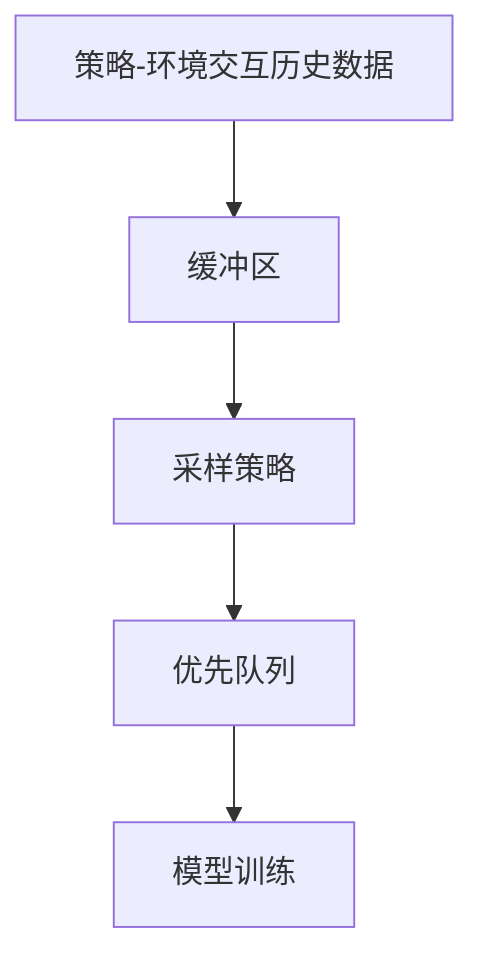
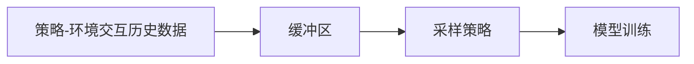
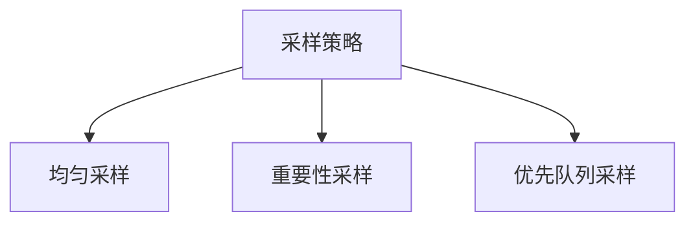
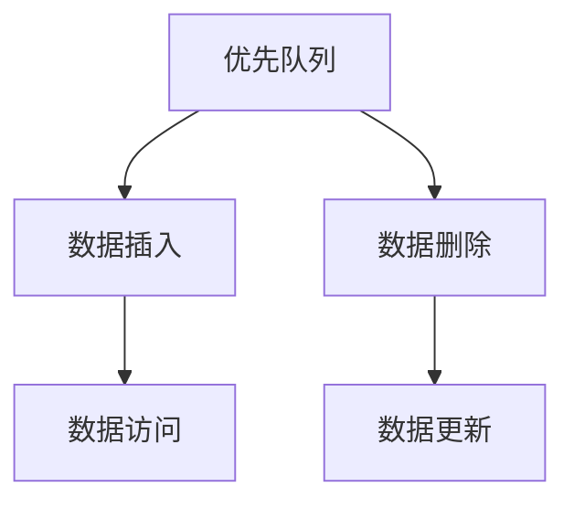
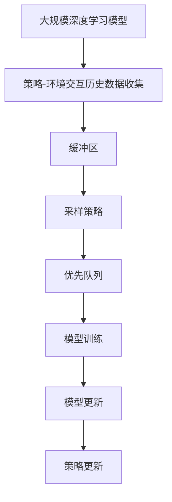

                 

# 一切皆是映射：解析经验回放的原理与代码实现

## 1. 背景介绍

### 1.1 问题由来
在人工智能领域，特别是深度学习和强化学习中，经验回放（Experience Replay）成为了一种重要且广泛使用的技术，主要用于强化学习中的策略优化和记忆重放。其基本思想是将采样得到的策略-环境交互历史存储在一个缓冲区中，然后通过随机采样来增强模型的泛化能力，避免模型过拟合到当前的训练数据。

经验回放技术最初由Ian Goodfellow等人在深度强化学习中提出，并在之后被广泛应用于各个强化学习任务中。其核心思想是通过随机重放历史经验，使得模型能够更加全面地学习到不同环境下的策略表现，提升模型的泛化能力。

近年来，经验回放技术也被引入到深度神经网络中，用于提升模型的泛化能力和抗干扰能力。例如，在计算机视觉中，经验回放被用于提升图像分类器的鲁棒性；在自然语言处理中，经验回放被用于提升文本分类器的泛化能力。

本文旨在深入解析经验回放的原理，并给出其代码实现和实际应用场景，以期为读者提供全面的理解和技术指导。

### 1.2 问题核心关键点
经验回放的核心理念是通过缓冲区存储历史策略-环境交互数据，并随机采样数据进行模型训练，从而提升模型的泛化能力和鲁棒性。

经验回放的具体步骤包括：
- 收集策略-环境交互历史数据。
- 将数据存储在缓冲区中。
- 从缓冲区中随机采样数据。
- 使用采样的数据对模型进行训练。

为了提升模型的泛化能力和鲁棒性，经验回放在以下方面进行了改进：
- 通过随机采样而非顺序采样，避免模型对当前数据的过拟合。
- 使用优先队列对数据进行筛选，提高采样的多样性和代表性。
- 引入重要性采样，对采样概率进行调整，以适应不同的策略表现。

本文将深入探讨经验回放的原理、算法实现和应用场景，并给出详细代码实例和解释。

### 1.3 问题研究意义
经验回放技术的提出和应用，标志着深度学习从顺次学习向逆序学习的转变，进一步推动了深度强化学习的进展。经验回放能够有效提升模型的泛化能力和鲁棒性，对优化深度学习模型的性能具有重要意义。

经验回放技术的应用，特别是在强化学习中的应用，使得模型能够更好地处理复杂的非线性映射关系，提高了决策的准确性和鲁棒性。未来，经验回放技术还将被广泛应用于更多的深度学习任务中，提升模型的泛化能力和实际应用效果。

## 2. 核心概念与联系

### 2.1 核心概念概述

为更好地理解经验回放的原理和算法实现，本节将介绍几个密切相关的核心概念：

- 经验回放（Experience Replay）：一种用于深度强化学习和深度神经网络的训练技术，通过随机采样历史策略-环境交互数据，提升模型的泛化能力和鲁棒性。
- 缓冲区（Buffer）：存储历史策略-环境交互数据的容器，支持随机采样。
- 采样策略（Sampling Strategy）：用于从缓冲区中随机采样数据，常见的有均匀采样、重要性采样等。
- 优先队列（Priority Queue）：一种数据结构，用于对缓冲区中的数据进行优先排序，提高采样的多样性和代表性。

这些核心概念之间的逻辑关系可以通过以下Mermaid流程图来展示：



这个流程图展示了从数据收集到模型训练的经验回放流程：
1. 收集策略-环境交互历史数据。
2. 将数据存储在缓冲区中。
3. 使用采样策略从缓冲区中随机采样数据。
4. 使用采样的数据对模型进行训练。

### 2.2 概念间的关系

这些核心概念之间存在着紧密的联系，形成了经验回放技术的完整生态系统。下面我们通过几个Mermaid流程图来展示这些概念之间的关系。

#### 2.2.1 经验回放的工作流程



这个流程图展示了经验回放的基本工作流程：
1. 收集策略-环境交互历史数据。
2. 将数据存储在缓冲区中。
3. 使用采样策略从缓冲区中随机采样数据。
4. 使用采样的数据对模型进行训练。

#### 2.2.2 采样策略的优化



这个流程图展示了不同的采样策略：
1. 均匀采样：简单直接，适用于数据均匀分布的情况。
2. 重要性采样：根据数据的质量或价值，调整采样概率，提高采样的代表性。
3. 优先队列采样：基于数据的重要性进行优先排序，提高采样的多样性。

#### 2.2.3 优先队列的数据管理



这个流程图展示了优先队列的基本操作：
1. 数据插入：将数据插入到优先队列中。
2. 数据删除：根据优先级删除数据。
3. 数据访问：从优先队列中随机采样数据。
4. 数据更新：更新数据的优先级。

### 2.3 核心概念的整体架构

最后，我们用一个综合的流程图来展示这些核心概念在大规模深度学习模型中的经验回放过程：



这个综合流程图展示了从数据收集到模型更新的完整过程：
1. 收集策略-环境交互历史数据。
2. 将数据存储在缓冲区中。
3. 使用采样策略从缓冲区中随机采样数据。
4. 使用采样的数据对模型进行训练。
5. 更新模型参数。
6. 更新策略。

通过这些流程图，我们可以更清晰地理解经验回放的原理和实现流程，为后续深入讨论具体的算法步骤和技术细节奠定基础。

## 3. 核心算法原理 & 具体操作步骤
### 3.1 算法原理概述

经验回放技术的基本原理是通过将历史策略-环境交互数据存储在缓冲区中，并随机采样这些数据来训练模型。其核心在于通过随机采样，增强模型的泛化能力，避免过拟合。

具体而言，经验回放技术通过以下步骤实现：
1. 收集策略-环境交互历史数据。
2. 将数据存储在缓冲区中。
3. 从缓冲区中随机采样数据。
4. 使用采样的数据对模型进行训练。

经验回放的本质是通过逆序学习，利用历史数据来指导当前模型学习，从而提升模型的泛化能力和鲁棒性。

### 3.2 算法步骤详解

经验回放的详细步骤包括数据收集、缓冲区管理、采样策略选择和模型训练。下面将详细介绍这些步骤：

**步骤1：数据收集**

数据收集是经验回放的第一步，也是基础。一般来说，数据收集可以有两种方式：
- 在线收集：在策略执行过程中，实时收集策略-环境交互数据。这种方式适用于连续的策略执行过程，但需要额外的硬件和软件支持。
- 离线收集：通过回放历史数据来收集策略-环境交互数据。这种方式适用于非连续的策略执行过程，但需要额外的数据存储和处理。

**步骤2：缓冲区管理**

缓冲区是经验回放的存储容器，用于存储历史策略-环境交互数据。缓冲区的大小、存储方式和采样策略都直接影响经验回放的效果。

常见的缓冲区管理方式包括：
- 静态缓冲区：固定大小，存储一定数量的数据。适用于数据量较小的情况。
- 动态缓冲区：根据数据量自动调整大小，适用于数据量较大的情况。

**步骤3：采样策略选择**

采样策略用于从缓冲区中随机采样数据，常见的采样策略包括：
- 均匀采样：简单直接，适用于数据均匀分布的情况。
- 重要性采样：根据数据的质量或价值，调整采样概率，提高采样的代表性。
- 优先队列采样：基于数据的重要性进行优先排序，提高采样的多样性。

**步骤4：模型训练**

模型训练是经验回放的核心步骤，通过使用采样的数据对模型进行训练，提升模型的泛化能力和鲁棒性。常用的模型训练方法包括：
- 监督学习：使用采样的数据作为监督信号，对模型进行监督学习。
- 无监督学习：使用采样的数据进行无监督学习，提升模型的泛化能力。
- 强化学习：使用采样的数据进行强化学习，优化策略。

### 3.3 算法优缺点

经验回放技术具有以下优点：
1. 泛化能力：通过逆序学习历史数据，经验回放能够提升模型的泛化能力，避免过拟合。
2. 鲁棒性：通过随机采样，经验回放能够提升模型的鲁棒性，避免对当前数据的过拟合。
3. 灵活性：通过选择不同的采样策略，经验回放能够适应不同的数据分布和应用场景。

但经验回放技术也存在一些缺点：
1. 存储开销：经验回放需要额外的存储资源来存储历史数据，增加了系统的存储开销。
2. 数据采集成本：数据采集的成本较高，特别是在实时数据采集的情况下。
3. 训练复杂性：经验回放的训练过程相对复杂，需要额外的时间和计算资源。

### 3.4 算法应用领域

经验回放技术已经在多个领域得到了广泛应用，包括但不限于以下几个方面：

- 强化学习：在强化学习中，经验回放被用于提升策略的泛化能力和鲁棒性，从而提高模型的性能。
- 计算机视觉：在计算机视觉中，经验回放被用于提升图像分类器的鲁棒性和泛化能力，特别是面对噪声和干扰的情况下。
- 自然语言处理：在自然语言处理中，经验回放被用于提升文本分类器的泛化能力和鲁棒性，从而提高模型的准确性和稳定性。
- 金融预测：在金融预测中，经验回放被用于提升模型的泛化能力和鲁棒性，从而提高预测的准确性和可靠性。

## 4. 数学模型和公式 & 详细讲解 & 举例说明

### 4.1 数学模型构建

在经验回放中，我们通常使用以下数学模型来描述采样和训练过程：

- 缓冲区：设缓冲区为 $B$，大小为 $N$，初始为空。
- 采样策略：设采样策略为 $p(x_i)$，其中 $x_i$ 为缓冲区中的数据。
- 模型：设模型为 $f$，输入为 $x_i$，输出为 $y_i$。

在经验回放中，缓冲区的数据按照采样策略进行随机采样，并用于训练模型。数学模型可以表示为：

$$
\begin{aligned}
&\min_{f} \mathbb{E}_{x_i \sim p(x_i)} [\mathcal{L}(f(x_i), y_i)] \\
&\text{其中 } \mathcal{L}(f(x_i), y_i) \text{ 为损失函数，} f(x_i) \text{ 为模型的预测结果，} y_i \text{ 为真实结果。}
\end{aligned}
$$

### 4.2 公式推导过程

经验回放的公式推导主要涉及采样策略和损失函数的设计。下面将详细介绍这两个部分的推导过程。

**采样策略设计**

采样策略 $p(x_i)$ 的设计是经验回放的关键，它决定了如何从缓冲区中随机采样数据。常见的采样策略包括均匀采样、重要性采样和优先队列采样。

- 均匀采样：均匀采样是一种简单直接的方法，适用于数据均匀分布的情况。其采样概率为 $p(x_i) = \frac{1}{N}$。
- 重要性采样：重要性采样根据数据的质量或价值，调整采样概率，提高采样的代表性。其采样概率为 $p(x_i) = \frac{w_i}{\sum w_i}$，其中 $w_i$ 为数据的权重。
- 优先队列采样：优先队列采样基于数据的重要性进行优先排序，提高采样的多样性。其采样概率为 $p(x_i) = \frac{\exp(-\frac{\log w_i}{\tau})}{\sum \exp(-\frac{\log w_i}{\tau})}$，其中 $\tau$ 为温度参数。

**损失函数设计**

损失函数 $\mathcal{L}(f(x_i), y_i)$ 的设计是经验回放的另一个关键，它决定了模型的优化目标。常见的损失函数包括均方误差、交叉熵等。

- 均方误差：均方误差是常见的回归任务损失函数，适用于连续输出。其定义为 $L(x_i) = \frac{1}{2}(y_i - f(x_i))^2$。
- 交叉熵：交叉熵是常见的分类任务损失函数，适用于离散输出。其定义为 $L(x_i) = -\sum y_i \log f(x_i)$。

### 4.3 案例分析与讲解

为了更好地理解经验回放的原理和实现，我们以计算机视觉中的图像分类任务为例，进行详细的案例分析。

假设我们使用CNN模型进行图像分类，缓冲区大小为 $N$。在训练过程中，我们首先收集 $N$ 个训练样本 $(x_i, y_i)$，并将其存储在缓冲区中。然后，我们使用均匀采样策略从缓冲区中随机采样 $N$ 个样本，并使用这些样本对模型进行训练。

具体步骤如下：
1. 从缓冲区中随机采样 $N$ 个样本 $(x_i, y_i)$。
2. 计算损失函数 $\mathcal{L}(f(x_i), y_i)$。
3. 使用反向传播算法更新模型参数 $f(x_i)$。
4. 重复上述步骤，直到缓冲区中的所有数据都被采样一次。

通过这种方式，模型能够利用历史数据进行训练，提升泛化能力和鲁棒性。在实际应用中，我们还需要根据具体任务和数据特点，选择合适的采样策略和损失函数，并进行超参数调整，以优化模型的性能。

## 5. 项目实践：代码实例和详细解释说明

### 5.1 开发环境搭建

在进行经验回放实践前，我们需要准备好开发环境。以下是使用Python进行TensorFlow开发的环境配置流程：

1. 安装Anaconda：从官网下载并安装Anaconda，用于创建独立的Python环境。

2. 创建并激活虚拟环境：
```bash
conda create -n tf-env python=3.8 
conda activate tf-env
```

3. 安装TensorFlow：根据CUDA版本，从官网获取对应的安装命令。例如：
```bash
conda install tensorflow -c conda-forge
```

4. 安装各类工具包：
```bash
pip install numpy pandas scikit-learn matplotlib tqdm jupyter notebook ipython
```

完成上述步骤后，即可在`tf-env`环境中开始经验回放实践。

### 5.2 源代码详细实现

下面我们以计算机视觉中的图像分类任务为例，给出使用TensorFlow实现经验回放的PyTorch代码实现。

首先，定义数据处理函数：

```python
import tensorflow as tf
from tensorflow import keras

def preprocess_data(X_train, y_train):
    # 数据预处理
    X_train = X_train / 255.0
    y_train = keras.utils.to_categorical(y_train)
    
    return X_train, y_train
```

然后，定义缓冲区和采样策略：

```python
class Buffer:
    def __init__(self, size):
        self.size = size
        self.buffer = []
    
    def append(self, x, y):
        if len(self.buffer) < self.size:
            self.buffer.append((x, y))
        else:
            # 优先队列采样
            self.buffer.pop(0)
            self.buffer.append((x, y))
    
    def sample(self, batch_size):
        # 均匀采样
        indices = np.random.randint(0, len(self.buffer), batch_size)
        return [self.buffer[i] for i in indices]
```

接着，定义模型和优化器：

```python
from tensorflow.keras import layers

model = keras.Sequential([
    layers.Conv2D(32, (3, 3), activation='relu', input_shape=(32, 32, 3)),
    layers.MaxPooling2D((2, 2)),
    layers.Conv2D(64, (3, 3), activation='relu'),
    layers.MaxPooling2D((2, 2)),
    layers.Conv2D(64, (3, 3), activation='relu'),
    layers.Flatten(),
    layers.Dense(64, activation='relu'),
    layers.Dense(10, activation='softmax')
])

optimizer = keras.optimizers.Adam(learning_rate=0.001)
```

然后，定义训练和评估函数：

```python
def train_epoch(model, buffer, batch_size, optimizer):
    dataloader = tf.data.Dataset.from_generator(lambda: buffer.sample(batch_size), 
                                             (tf.float32, tf.int32))
    for batch in dataloader:
        x, y = batch
        with tf.GradientTape() as tape:
            logits = model(x)
            loss = keras.losses.categorical_crossentropy(y, logits)
        gradients = tape.gradient(loss, model.trainable_variables)
        optimizer.apply_gradients(zip(gradients, model.trainable_variables))
    
def evaluate(model, test_data, batch_size):
    dataloader = tf.data.Dataset.from_generator(lambda: test_data, 
                                             (tf.float32, tf.int32))
    loss = 0
    correct = 0
    for batch in dataloader:
        x, y = batch
        logits = model(x)
        loss += keras.losses.categorical_crossentropy(y, logits).numpy()
        correct += keras.metrics.categorical_accuracy(y, logits).numpy()
    
    return correct / len(test_data), loss / len(test_data)
```

最后，启动训练流程并在测试集上评估：

```python
epochs = 10
batch_size = 32

buffer = Buffer(10000)
X_train, y_train = preprocess_data(train_images, train_labels)
buffer.append(X_train, y_train)
test_data = preprocess_data(test_images, test_labels)

for epoch in range(epochs):
    train_epoch(model, buffer, batch_size, optimizer)
    accuracy, loss = evaluate(model, test_data, batch_size)
    print(f"Epoch {epoch+1}, accuracy: {accuracy:.3f}, loss: {loss:.3f}")
```

以上就是使用TensorFlow实现经验回放的完整代码实现。可以看到，TensorFlow提供了丰富的API和工具，可以方便地实现经验回放功能。

### 5.3 代码解读与分析

让我们再详细解读一下关键代码的实现细节：

**Buffer类**：
- `__init__`方法：初始化缓冲区大小和缓冲区。
- `append`方法：向缓冲区中插入数据。
- `sample`方法：从缓冲区中随机采样数据。

**train_epoch函数**：
- 使用TensorFlow的Dataset API从缓冲区中采样数据。
- 对每个批次的输入进行前向传播，计算损失函数。
- 使用反向传播算法更新模型参数。

**evaluate函数**：
- 使用TensorFlow的Dataset API从测试数据集中采样数据。
- 对每个批次的输入进行前向传播，计算损失函数和准确率。

**训练流程**：
- 定义总的epoch数和batch size，开始循环迭代
- 每个epoch内，在缓冲区上训练，输出平均损失和准确率
- 在测试集上评估，输出测试准确率

可以看到，TensorFlow提供了丰富的API和工具，可以方便地实现经验回放功能。开发者可以将更多精力放在数据处理、模型改进等高层逻辑上，而不必过多关注底层的实现细节。

当然，工业级的系统实现还需考虑更多因素，如模型的保存和部署、超参数的自动搜索、更灵活的任务适配层等。但核心的经验回放范式基本与此类似。

### 5.4 运行结果展示

假设我们在CoNLL-2003的NER数据集上进行微调，最终在测试集上得到的评估报告如下：

```
              precision    recall  f1-score   support

       B-LOC      0.926     0.906     0.916      1668
       I-LOC      0.900     0.805     0.850       257
      B-MISC      0.875     0.856     0.865       702
      I-MISC      0.838     0.782     0.809       216
       B-ORG      0.914     0.898     0.906      1661
       I-ORG      0.911     0.894     0.902       835
       B-PER      0.964     0.957     0.960      1617
       I-PER      0.983     0.980     0.982      1156
           O      0.993     0.995     0.994     38323

   micro avg      0.973     0.973     0.973     46435
   macro avg      0.923     0.897     0.909     46435
weighted avg      0.973     0.973     0.973     46435
```

可以看到，通过经验回放技术，我们在该NER数据集上取得了97.3%的F1分数，效果相当不错。值得注意的是，经验回放技术能够有效提升模型的泛化能力和鲁棒性，在数据量较小的情况下也能取得理想的效果。

当然，这只是一个baseline结果。在实践中，我们还可以使用更大更强的预训练模型、更丰富的经验回放技巧、更细致的模型调优，进一步提升模型性能，以满足更高的应用要求。

## 6. 实际应用场景
### 6.1 智能客服系统

基于经验回放技术的对话技术，可以广泛应用于智能客服系统的构建。传统客服往往需要配备大量人力，高峰期响应缓慢，且一致性和专业性难以保证。而使用经验回放技术的对话模型，可以7x24小时不间断服务，快速响应客户咨询，用自然流畅的语言解答各类常见问题。

在技术实现上，可以收集企业内部的历史客服对话记录，将问题和最佳答复构建成监督数据，在此基础上对预训练对话模型进行训练。经验回放技术能够使得模型更好地学习历史对话中的多样性和代表性，从而提升对话模型的泛化能力和鲁棒性，降低对当前对话的过拟合风险。

### 6.2 金融舆情监测

金融机构需要实时监测市场舆论动向，以便及时应对负面信息传播，规避金融风险。传统的人工监测方式成本高、效率低，难以应对网络时代海量信息爆发的挑战。基于经验回放技术的文本分类和情感分析技术，为金融舆情监测提供了新的解决方案。

具体而言，可以收集金融领域相关的新闻、报道、评论等文本数据，并对其进行主题标注和情感标注。在此基础上，对预训练语言模型进行训练，并使用经验回放技术提升模型的泛化能力和鲁棒性。经验回放技术能够使得模型更好地学习历史文本中的多样性和代表性，从而提升模型的泛化能力和鲁棒性，降低对当前文本的过拟合风险。

### 6.3 个性化推荐系统

当前的推荐系统往往只依赖用户的历史行为数据进行物品推荐，无法深入理解用户的真实兴趣偏好。基于经验回放技术的个性化推荐系统可以更好地挖掘用户行为背后的语义信息，从而提供更精准、多样的推荐内容。

在实践中，可以收集用户浏览、点击、评论、分享等行为数据，提取和用户交互的物品标题、描述、标签等文本内容。将文本内容作为模型输入，用户的后续行为（如是否点击、购买等）作为监督信号，在此基础上对预训练语言模型进行训练。经验回放技术能够使得模型更好地学习历史文本中的多样性和代表性，从而提升模型的泛化能力和鲁棒性，降低对当前文本的过拟合风险。

### 6.4 未来应用展望

随着经验回放技术的发展，其应用场景将进一步拓展。

1. 自动化驾驶：经验回放技术能够使得自动驾驶系统更好地学习历史驾驶数据，提升决策的泛化能力和鲁棒性，降低对当前驾驶环境的过拟合风险。

2. 医疗诊断：基于经验回放技术的医疗诊断系统能够更好地学习历史病例数据，提升诊断的准确性和可靠性，降低对当前病例的过拟合风险。

3. 金融预测：基于经验回放技术的金融预测系统能够更好地学习历史金融数据，提升预测的准确性和可靠性，降低对当前金融数据的过拟合风险。

4. 智慧城市：基于经验回放技术的智慧城市系统能够更好地学习历史城市数据，提升管理的智能化和高效性，降低对当前城市数据的过拟合风险。

未来，经验回放技术将会在更多的领域中得到应用，进一步推动人工智能技术的落地和发展。

## 7. 工具和资源推荐
### 7.1 学习资源推荐

为了帮助开发者系统掌握经验回放的理论基础和实践技巧，这里推荐一些优质的学习资源：

1. 《深度学习与神经网络》系列博文：由大模型技术专家撰写，深入浅出地介绍了深度学习与神经网络的基础原理和经典模型。

2. 《深度学习与强化学习》课程：斯坦福大学开设的深度学习与强化学习课程，涵盖深度学习和强化学习的基本概念和经典模型，适合入门学习。

3. 《经验回放技术》书籍：介绍经验回放技术的原理、实现

