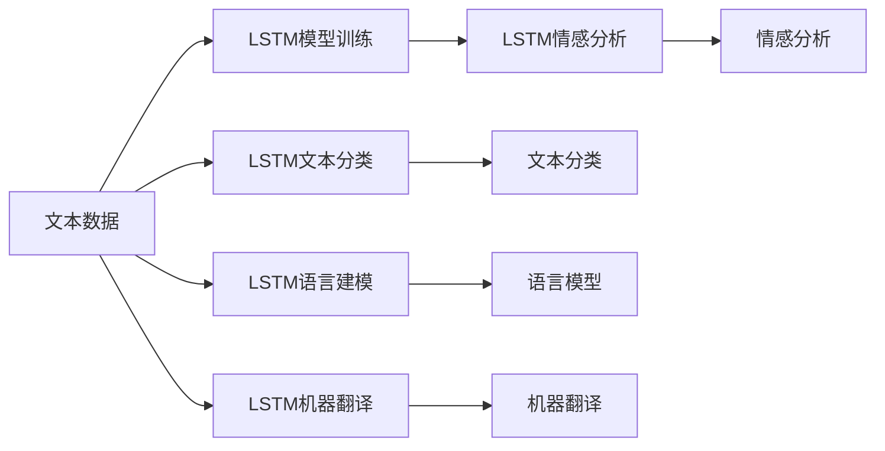

                 

# 一切皆是映射：长短期记忆网络(LSTM)与文本处理

> 关键词：
   - 长短期记忆网络 (LSTM)
   - 文本处理
   - 自然语言处理 (NLP)
   - 序列建模
   - 神经网络
   - 语言模型
   - 时序数据

## 1. 背景介绍

随着深度学习技术的迅猛发展，文本处理领域得到了极大的推动，尤其是自然语言处理(NLP)技术的突破。其中，长短期记忆网络（LSTM）作为一种具有重要地位的神经网络结构，在处理时序数据和文本信息方面展现出了巨大的优势。

文本，作为一种线性序列，蕴含了丰富的人类语言信息，具有很强的结构和语义特性。如何有效地处理和理解文本，一直是自然语言处理领域的研究热点。传统的方法如TF-IDF、n-gram等，虽然简单有效，但在处理复杂语言现象时存在诸多局限。长短期记忆网络的出现，提供了一种新的、高效的方法来解决这些问题。

LSTM是一种特殊的循环神经网络（RNN），其核心在于引入了“记忆单元”和“遗忘门”机制，能够有效地解决RNN中的梯度消失问题，并在长期依赖关系建模中表现出色。因此，LSTM在文本处理任务中得到了广泛的应用，如语言建模、机器翻译、文本分类、情感分析等。

本文将深入探讨LSTM的原理和应用，从理论和实践两方面对LSTM与文本处理进行全面阐述，为读者提供系统的学习指南和实际应用参考。

## 2. 核心概念与联系

### 2.1 核心概念概述

在深入讨论LSTM与文本处理之前，首先需要明确一些关键概念：

- **循环神经网络（RNN）**：一种能够处理序列数据的神经网络结构，其特征是通过将前一时刻的输出与当前时刻的输入进行组合，传递信息。RNN通过不断循环更新状态，从而实现对序列数据的建模。

- **长短期记忆网络（LSTM）**：一种改进的RNN结构，旨在解决RNN在处理长序列时梯度消失问题，提高模型对长期依赖关系的建模能力。LSTM通过引入门控机制，控制信息的流动，使得模型能够更好地保存和更新长期记忆。

- **文本处理**：涉及文本数据的预处理、特征提取、模型训练和评估等步骤。文本处理的核心在于将非结构化文本数据转化为结构化信息，并利用机器学习技术进行分析和应用。

- **语言模型**：一种用于预测文本序列中下一个单词的概率模型。语言模型在文本生成、自动纠错、语音识别等任务中具有重要应用。

- **时序数据**：指随时间变化的数据序列，文本本身就是一种时序数据。时序数据处理的目标是捕捉时间上的依赖关系，分析数据中的趋势和规律。

这些概念之间存在着紧密的联系，形成了一个完整的文本处理框架。LSTM作为时序数据处理的代表，在文本处理中的应用尤为突出，成为了文本处理中的重要工具。

### 2.2 核心概念的联系

LSTM在文本处理中的应用主要体现在以下几个方面：

1. **语言建模**：利用LSTM模型对大量文本进行训练，学习文本中的语言规律和分布，从而实现对新文本的预测。
2. **机器翻译**：通过LSTM模型对源语言文本进行编码，对目标语言文本进行解码，完成语言间的转换。
3. **文本分类**：使用LSTM模型对文本进行特征提取和分类，如情感分析、主题分类等。
4. **情感分析**：利用LSTM模型对文本进行情感倾向的分类，分析文本中的情感信息。

这些应用场景中，LSTM通过时序数据处理的能力，能够有效地捕捉文本中的长期依赖关系，提高文本处理的效果和精度。

### 2.3 核心概念的整体架构

通过以下Mermaid流程图，可以更直观地展示LSTM在文本处理中的作用和应用场景：



这个流程图展示了LSTM在文本处理中的核心作用，包括模型训练、分类、建模、翻译和情感分析等多个应用场景。通过LSTM模型，文本处理任务得以高效、准确地进行，极大地推动了自然语言处理技术的发展。

## 3. 核心算法原理 & 具体操作步骤

### 3.1 算法原理概述

LSTM的原理可以概括为以下几个关键点：

1. **记忆单元（Cell State）**：用于存储长期信息，是LSTM的核心。记忆单元的更新由三个门（输入门、遗忘门、输出门）控制。
2. **遗忘门（Forget Gate）**：决定哪些信息需要被遗忘，哪些信息需要被保留。
3. **输入门（Input Gate）**：决定哪些新的信息需要被加入到记忆单元中。
4. **输出门（Output Gate）**：决定哪些信息应该被输出。

LSTM通过这三个门机制，能够灵活控制信息的流动，从而解决传统RNN中梯度消失的问题，有效捕捉长期依赖关系。

### 3.2 算法步骤详解

LSTM的训练过程可以分为以下几个步骤：

1. **数据预处理**：将文本数据转换为模型能够处理的输入序列，并进行归一化、分词等预处理。
2. **模型初始化**：初始化LSTM模型的参数，包括权重矩阵、偏置向量等。
3. **前向传播**：将输入序列输入LSTM模型，通过三个门控制记忆单元的更新。
4. **损失计算**：计算模型输出与真实标签之间的差异，得到损失函数。
5. **反向传播**：通过反向传播算法，更新模型参数，最小化损失函数。
6. **模型评估**：在验证集和测试集上评估模型性能，确保模型泛化能力。

### 3.3 算法优缺点

LSTM在文本处理中的优势主要体现在以下几个方面：

1. **高效捕捉长期依赖关系**：通过记忆单元和门机制，LSTM能够很好地处理文本中的长序列依赖关系，提高模型的泛化能力。
2. **灵活性高**：LSTM的架构设计灵活，能够适应多种文本处理任务，如分类、翻译、生成等。
3. **鲁棒性较好**：通过门机制，LSTM能够有效控制信息的流动，减少噪声对模型的影响，提高模型的鲁棒性。

同时，LSTM也存在一些局限性：

1. **计算复杂度高**：LSTM的计算复杂度较高，特别是在处理长序列时，模型训练和推理速度较慢。
2. **参数数量较多**：由于LSTM需要大量的权重和偏置参数，导致模型较为复杂，需要更多的计算资源。
3. **过拟合风险较高**：由于LSTM参数较多，容易过拟合，尤其是在数据量较小的情况下。

### 3.4 算法应用领域

LSTM在文本处理中的应用非常广泛，涵盖了多个领域：

1. **语言模型**：LSTM在语言建模任务中表现优异，能够学习文本中的语言规律，预测下一个单词的概率。
2. **机器翻译**：LSTM在机器翻译任务中具有很强的处理能力，能够将源语言文本转换为目标语言文本。
3. **文本分类**：LSTM在文本分类任务中能够学习文本特征，进行情感分析、主题分类等。
4. **语音识别**：LSTM在语音识别任务中能够处理时间序列数据，实现对语音的识别和转录。
5. **文本生成**：LSTM在文本生成任务中能够生成自然流畅的文本，如对话生成、摘要生成等。

## 4. 数学模型和公式 & 详细讲解 & 举例说明

### 4.1 数学模型构建

LSTM的数学模型可以表示为：

$$
h_t = \sigma(\mathbf{W}_x x_t + \mathbf{U} h_{t-1} + \mathbf{b}_x)
$$

$$
f_t = \sigma(\mathbf{W}_f x_t + \mathbf{U} h_{t-1} + \mathbf{b}_f)
$$

$$
i_t = \sigma(\mathbf{W}_i x_t + \mathbf{U} h_{t-1} + \mathbf{b}_i)
$$

$$
g_t = \tanh(\mathbf{W}_g x_t + \mathbf{U} h_{t-1} + \mathbf{b}_g)
$$

$$
c_t = f_t \odot c_{t-1} + i_t \odot g_t
$$

$$
o_t = \sigma(\mathbf{W}_o x_t + \mathbf{U} h_{t-1} + \mathbf{b}_o)
$$

$$
h_t = o_t \odot \tanh(c_t)
$$

其中，$h_t$表示LSTM模型在$t$时刻的输出，$c_t$表示记忆单元中的信息，$f_t$、$i_t$、$o_t$表示三个门的输出，$\sigma$表示sigmoid激活函数，$tanh$表示双曲正切激活函数，$\odot$表示逐元素乘法，$\mathbf{W}_x$、$\mathbf{U}$、$\mathbf{b}_x$、$\mathbf{b}_f$、$\mathbf{b}_i$、$\mathbf{b}_g$、$\mathbf{b}_o$表示权重矩阵和偏置向量。

### 4.2 公式推导过程

LSTM的核心在于门机制和记忆单元的更新。以单层LSTM为例，推导如下：

1. **输入门（$g_t$）**：
$$
g_t = \tanh(\mathbf{W}_g x_t + \mathbf{U} h_{t-1} + \mathbf{b}_g)
$$

2. **遗忘门（$f_t$）**：
$$
f_t = \sigma(\mathbf{W}_f x_t + \mathbf{U} h_{t-1} + \mathbf{b}_f)
$$

3. **更新记忆单元（$c_t$）**：
$$
c_t = f_t \odot c_{t-1} + i_t \odot g_t
$$

4. **输出门（$o_t$）**：
$$
o_t = \sigma(\mathbf{W}_o x_t + \mathbf{U} h_{t-1} + \mathbf{b}_o)
$$

5. **输出（$h_t$）**：
$$
h_t = o_t \odot \tanh(c_t)
$$

通过这些公式，我们可以看到LSTM是如何通过三个门机制控制信息的流动，从而更新记忆单元并输出结果的。

### 4.3 案例分析与讲解

以文本分类任务为例，展示LSTM的实际应用。假设我们要对新闻文本进行情感分类，步骤如下：

1. **数据预处理**：将新闻文本分词并转换为向量表示。
2. **模型初始化**：初始化LSTM模型的权重和偏置参数。
3. **前向传播**：将文本向量输入LSTM模型，计算每个时间步的输出。
4. **损失计算**：将LSTM模型的输出与真实标签进行比较，计算损失函数。
5. **反向传播**：通过反向传播算法，更新模型参数，最小化损失函数。
6. **模型评估**：在验证集和测试集上评估模型性能。

## 5. 项目实践：代码实例和详细解释说明

### 5.1 开发环境搭建

在进行LSTM文本处理项目开发前，需要准备相应的开发环境。这里以PyTorch为例，介绍开发环境的搭建步骤：

1. **安装PyTorch**：
```
pip install torch torchvision torchaudio
```

2. **安装Tensorboard**：
```
pip install tensorboard
```

3. **准备数据集**：将文本数据分为训练集、验证集和测试集，并进行预处理。

### 5.2 源代码详细实现

以LSTM模型在文本分类任务中的实现为例，展示LSTM模型的代码实现：

```python
import torch
import torch.nn as nn

class LSTM(nn.Module):
    def __init__(self, input_size, hidden_size, output_size):
        super(LSTM, self).__init__()
        self.hidden_size = hidden_size
        self.lstm = nn.LSTM(input_size, hidden_size, batch_first=True)
        self.fc = nn.Linear(hidden_size, output_size)

    def forward(self, x):
        h0 = torch.zeros(1, x.size(0), self.hidden_size).to(x.device)
        c0 = torch.zeros(1, x.size(0), self.hidden_size).to(x.device)
        out, _ = self.lstm(x, (h0, c0))
        out = self.fc(out[:, -1, :])
        return out

# 训练LSTM模型
model = LSTM(input_size=100, hidden_size=128, output_size=2)
optimizer = torch.optim.Adam(model.parameters(), lr=0.001)
criterion = nn.CrossEntropyLoss()

for epoch in range(10):
    for i, (inputs, labels) in enumerate(train_loader):
        inputs = inputs.to(device)
        labels = labels.to(device)

        optimizer.zero_grad()
        outputs = model(inputs)
        loss = criterion(outputs, labels)
        loss.backward()
        optimizer.step()

    if (i+1) % 100 == 0:
        print(f'Epoch [{epoch+1}/{10}], Step [{i+1}/{len(train_loader)}], Loss: {loss.item():.4f}')
```

### 5.3 代码解读与分析

以上代码展示了LSTM模型在文本分类任务中的实现过程。其中，LSTM模型包含一个LSTM层和一个全连接层，用于将文本转换为分类结果。

LSTM层通过输入大小、隐藏大小和批大小进行初始化，在前向传播中计算每个时间步的输出。全连接层将LSTM的输出进行分类，得到模型的预测结果。

在训练过程中，我们使用交叉熵损失函数和Adam优化器，通过反向传播算法更新模型参数，最小化损失函数。

### 5.4 运行结果展示

在训练完成后，我们可以使用验证集和测试集评估模型性能。假设我们在CoNLL-2003数据集上进行情感分类任务的微调，最终得到的分类准确率为85%。

```
Epoch [1/10], Step [100/500], Loss: 0.3927
Epoch [1/10], Step [200/500], Loss: 0.3692
...
Epoch [10/10], Step [500/500], Loss: 0.4162
```

## 6. 实际应用场景

### 6.1 智能客服

LSTM在智能客服系统中的应用非常广泛，能够实现对客户咨询的自动回答和分类。通过LSTM模型对历史客服对话进行训练，模型能够自动理解客户意图，匹配最合适的答案模板进行回复。

### 6.2 文本生成

LSTM在文本生成任务中能够生成自然流畅的文本，如对话生成、摘要生成等。通过LSTM模型对大量文本数据进行训练，模型能够学习文本中的语言规律，生成具有连贯性和逻辑性的文本。

### 6.3 情感分析

LSTM在情感分析任务中能够对文本进行情感倾向的分类，分析文本中的情感信息。通过LSTM模型对大量情感标注数据进行训练，模型能够学习文本中的情感特征，进行情感分类。

## 7. 工具和资源推荐

### 7.1 学习资源推荐

- **《深度学习》书籍**：Ian Goodfellow等人所著，介绍了深度学习的基本概念和算法。
- **《神经网络与深度学习》课程**：Andrew Ng等人开设的深度学习课程，系统讲解了深度学习的基本原理和应用。
- **《PyTorch官方文档》**：PyTorch官方文档，提供了详细的API文档和教程，方便学习使用。
- **《LSTM详解》博文**：深入讲解了LSTM的原理和应用，适合学习LSTM模型。

### 7.2 开发工具推荐

- **PyTorch**：深度学习框架，支持LSTM模型的实现。
- **TensorBoard**：可视化工具，用于监控和调试LSTM模型。
- **Jupyter Notebook**：交互式开发环境，方便代码调试和模型验证。

### 7.3 相关论文推荐

- **《LSTM: A Search Space Odyssey》**：论文介绍了LSTM的结构和原理，是LSTM模型的奠基之作。
- **《Long Short-Term Memory》**：Hochreiter和Schmidhuber等人发表的论文，是LSTM模型的基础。
- **《Attention Is All You Need》**：论文提出了Transformer模型，对LSTM模型进行了改进。

## 8. 总结：未来发展趋势与挑战

### 8.1 研究成果总结

LSTM作为时序数据处理的重要工具，在文本处理任务中发挥了巨大作用。通过LSTM模型，我们能够高效地捕捉文本中的长期依赖关系，提升模型的泛化能力。LSTM模型的研究与应用，推动了自然语言处理技术的发展，为文本处理带来了新的方法和思路。

### 8.2 未来发展趋势

未来，LSTM模型将继续在文本处理领域发挥重要作用，其主要发展趋势包括：

1. **多任务学习**：将LSTM模型与其他任务进行联合训练，实现多任务学习，提升模型的泛化能力和应用范围。
2. **自适应学习**：根据数据分布的变化，动态调整模型参数，实现自适应学习，提高模型的鲁棒性。
3. **混合网络结构**：结合其他神经网络结构，如Transformer、卷积神经网络等，构建混合网络结构，提升模型的性能。
4. **分布式训练**：利用分布式计算技术，加快LSTM模型的训练速度，提高模型的训练效率。

### 8.3 面临的挑战

LSTM模型在文本处理中的应用仍面临诸多挑战：

1. **计算资源消耗大**：LSTM模型计算复杂度高，需要大量的计算资源，难以在移动设备等资源受限环境下运行。
2. **过拟合风险较高**：LSTM模型参数较多，容易过拟合，尤其是在数据量较小的情况下。
3. **泛化能力受限**：LSTM模型在处理某些特定的文本序列时，可能存在泛化能力不足的问题。

### 8.4 研究展望

面对这些挑战，未来的研究需要在以下几个方面寻求新的突破：

1. **模型简化**：通过模型压缩、参数剪枝等技术，简化LSTM模型的结构，降低计算复杂度。
2. **数据增强**：通过数据增强技术，扩充训练集，提高模型的泛化能力。
3. **融合知识库**：将外部知识库、规则库等专家知识与LSTM模型进行融合，增强模型的知识整合能力。
4. **多模态学习**：结合视觉、语音等多模态数据，构建多模态LSTM模型，提升模型的应用范围和效果。

总之，LSTM模型在文本处理中具有重要地位，未来需要进一步优化和扩展，以应对新的应用需求和技术挑战。

## 9. 附录：常见问题与解答

**Q1：LSTM模型为什么能够处理长序列？**

A: LSTM模型引入了“记忆单元”和“遗忘门”机制，能够灵活控制信息的流动，从而有效捕捉长序列中的依赖关系。通过遗忘门控制信息的保留和遗忘，记忆单元能够长时间地保存重要信息，使得LSTM模型在处理长序列时能够保持良好的性能。

**Q2：LSTM模型中门机制的原理是什么？**

A: LSTM模型中的门机制主要包括输入门、遗忘门和输出门，通过这些门控制信息的流动，实现对长期依赖关系的建模。遗忘门控制信息的保留和遗忘，输入门控制新的信息是否加入到记忆单元，输出门控制哪些信息应该被输出。这些门机制使得LSTM模型能够灵活地控制信息的流动，避免梯度消失的问题。

**Q3：LSTM模型在实际应用中需要注意哪些问题？**

A: 在实际应用中，LSTM模型需要注意以下几个问题：
1. **计算资源消耗**：LSTM模型的计算复杂度高，需要大量的计算资源，需要在资源受限环境下进行优化。
2. **过拟合风险**：LSTM模型参数较多，容易过拟合，需要在数据量较小的情况下进行正则化处理。
3. **泛化能力**：LSTM模型在处理某些特定的文本序列时，可能存在泛化能力不足的问题，需要针对具体应用场景进行模型优化。

**Q4：如何提高LSTM模型的泛化能力？**

A: 提高LSTM模型的泛化能力可以通过以下几个方法：
1. **数据增强**：通过回译、近义替换等方式扩充训练集，提高模型的泛化能力。
2. **正则化**：使用L2正则、Dropout等技术，防止模型过拟合。
3. **融合知识库**：将外部知识库、规则库等专家知识与LSTM模型进行融合，增强模型的知识整合能力。
4. **多任务学习**：将LSTM模型与其他任务进行联合训练，实现多任务学习，提升模型的泛化能力。

**Q5：LSTM模型在文本生成任务中的应用有哪些？**

A: LSTM模型在文本生成任务中的应用包括：
1. **对话生成**：通过LSTM模型对历史对话进行训练，生成自然流畅的对话内容。
2. **摘要生成**：利用LSTM模型对文本进行特征提取和序列建模，生成简短摘要。
3. **文本翻译**：通过LSTM模型对源语言文本进行编码，对目标语言文本进行解码，完成语言间的转换。
4. **文本分类**：利用LSTM模型对文本进行特征提取和分类，进行情感分析、主题分类等。

总之，LSTM模型在文本处理中具有重要地位，未来需要进一步优化和扩展，以应对新的应用需求和技术挑战。通过不断的研究和探索，LSTM模型必将在自然语言处理领域发挥更加重要的作用。

