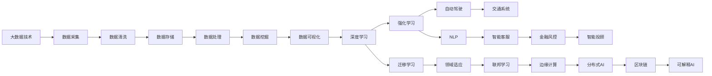

                 

# 下一代人工智能系统的技术路线

## 1. 背景介绍

人工智能(AI)技术的快速发展，已经深深渗透到各行各业，从医疗、金融到教育、交通，AI正以其卓越的智能决策和高效运算能力，改变着人类的生活和工作方式。然而，当前AI系统还存在诸多局限性，如数据依赖、模型泛化能力不足、决策透明度不高等问题，迫切需要新一代AI系统的技术突破。本文将探讨下一代AI系统的技术路线，从数据、模型、算法到系统架构，全方位阐述其核心技术，为行业提供深入的参考和指导。

## 2. 核心概念与联系

### 2.1 核心概念概述

为了更好地理解下一代AI系统的技术路线，本节将介绍几个密切相关的核心概念：

- **大数据技术**：指对大规模数据进行高效存储、处理和分析的技术，包括数据湖、大数据平台、数据流技术等。
- **深度学习**：一种基于神经网络的机器学习技术，通过多层非线性变换，实现对复杂模式的自动学习和推理。
- **强化学习**：通过试错学习，使智能体在特定环境中做出最优决策，广泛应用于游戏、机器人等领域。
- **迁移学习**：指将一个领域学习到的知识迁移到另一个不同但相关领域的学习范式，减少新领域的学习成本。
- **联邦学习**：一种分布式机器学习技术，在多个客户端协同训练模型，保持数据隐私和模型安全。
- **知识图谱**：一种结构化知识表示方法，用于描述实体及其之间的关系，支持复杂的推理和查询。
- **自动驾驶**：基于计算机视觉、深度学习等技术的无人驾驶系统，能够实现车辆的自主导航和决策。
- **自然语言处理(NLP)**：研究计算机如何理解和处理人类语言，包括文本分类、机器翻译、对话系统等。

这些核心概念共同构成了下一代AI系统的技术生态，相互协同，推动AI技术的不断进步。

### 2.2 核心概念的整体架构

接下来，我们用一个综合的流程图来展示这些核心概念在大数据和AI系统中的整体架构：



这个综合流程图展示了大数据技术如何与AI系统中的各个技术点进行深度融合，从而实现跨领域的智能应用。

### 2.3 核心概念之间的关系

这些核心概念之间存在着紧密的联系，形成了下一代AI系统的完整技术框架。

- **数据采集和存储**：是所有AI系统的基石，通过大数据技术，高效、安全地采集和存储数据，为后续分析和应用提供保障。
- **数据处理和挖掘**：通过数据清洗和特征工程，提取数据中的有用信息，支持深度学习模型的训练和优化。
- **深度学习和强化学习**：通过神经网络实现对复杂数据的自动学习和推理，通过试错学习提升智能决策能力。
- **迁移学习和联邦学习**：通过知识迁移和分布式学习，在不同领域和环境下提升AI模型的泛化能力和隐私保护。
- **自动驾驶和NLP**：通过深度学习和强化学习技术，实现无人驾驶和智能客服等功能，提升行业效率和服务质量。
- **知识图谱和可解释AI**：通过结构化知识表示和模型可解释性技术，提升AI系统的透明度和可靠性。
- **区块链和分布式AI**：通过去中心化的数据管理和协同学习，增强AI系统的安全性和鲁棒性。

这些概念的融合创新，将推动AI技术向更加智能、安全、可控的方向发展。

## 3. 核心算法原理 & 具体操作步骤

### 3.1 算法原理概述

下一代AI系统的核心算法原理主要围绕深度学习、强化学习、迁移学习等技术展开，其核心目标是提升AI模型在特定任务上的性能，同时增强系统的泛化能力和鲁棒性。

深度学习通过多层神经网络实现对数据的自动学习和推理，能够处理复杂的非线性模式，是当前AI系统的核心技术之一。强化学习通过试错学习，使智能体在特定环境中做出最优决策，应用于游戏、机器人等领域。迁移学习则通过知识迁移，在不同领域和任务间提升AI模型的泛化能力，减少新领域的学习成本。

### 3.2 算法步骤详解

以深度学习和迁移学习为例，下面是其核心步骤的详细讲解：

**深度学习模型训练：**
1. 数据准备：收集和预处理训练数据，确保数据的多样性和代表性。
2. 模型构建：选择合适的神经网络结构，如卷积神经网络(CNN)、递归神经网络(RNN)、Transformer等，构建模型框架。
3. 模型训练：使用梯度下降等优化算法，在训练数据上最小化损失函数，更新模型参数。
4. 模型验证：在验证数据上评估模型性能，调整模型超参数，防止过拟合。
5. 模型测试：在测试数据上评估模型泛化能力，确保模型稳定可靠。

**迁移学习：**
1. 源任务学习：在源领域使用大量标注数据，训练一个初始模型。
2. 知识迁移：通过特征提取、微调、知识蒸馏等技术，将源任务的模型知识迁移到目标任务中。
3. 目标任务微调：在目标任务的数据上，进一步微调模型，适应新领域的具体需求。
4. 性能评估：在目标任务的数据上评估模型性能，确保迁移学习的有效性。

### 3.3 算法优缺点

**深度学习：**
优点：
1. 能够处理复杂的非线性模式，适用于高维数据和复杂任务。
2. 具有很强的自动学习和抽象能力，能够发现数据中的潜在规律。
3. 在计算机视觉、自然语言处理等领域有广泛应用。

缺点：
1. 模型复杂度高，计算资源消耗大。
2. 数据依赖性强，对标注数据的依赖较高。
3. 模型可解释性不足，难以解释模型内部机制。

**强化学习：**
优点：
1. 能够在未知环境中通过试错学习，实现最优决策。
2. 适用于动态变化的环境和任务，具有较强的适应性。
3. 能够在不需要大量标注数据的情况下，学习到复杂的策略。

缺点：
1. 学习过程复杂，训练时间长，需要大量的试错数据。
2. 对于复杂的决策问题，模型容易陷入局部最优。
3. 模型可解释性较低，难以理解和调试。

**迁移学习：**
优点：
1. 能够在不重新训练的情况下，将已有知识迁移到新任务中，减少学习成本。
2. 能够提高模型的泛化能力，提升在不同领域的性能。
3. 适用于数据量较小或标注数据不足的场景。

缺点：
1. 模型迁移的有效性依赖于源任务和目标任务的相似度，存在一定风险。
2. 迁移过程中可能引入新的噪声和偏差，影响模型性能。
3. 需要选择合适的迁移策略和技术，如微调、知识蒸馏等。

### 3.4 算法应用领域

深度学习、强化学习、迁移学习等技术已经广泛应用于以下领域：

- **计算机视觉**：如图像分类、目标检测、图像生成等，通过深度学习实现对复杂图像的自动理解。
- **自然语言处理**：如机器翻译、文本生成、语音识别等，通过深度学习实现对自然语言的理解和生成。
- **机器人与自动驾驶**：如路径规划、导航决策、物体识别等，通过强化学习和深度学习技术实现自主导航和决策。
- **智能客服**：如问答系统、对话生成等，通过深度学习和自然语言处理技术实现智能对话。
- **金融风控**：如欺诈检测、信用评分等，通过深度学习和强化学习技术实现智能决策。
- **智能投顾**：如股票预测、投资组合优化等，通过深度学习和强化学习技术实现智能投资。

这些技术的应用不仅提升了各行业的智能化水平，还带来了更高的效率和效益。

## 4. 数学模型和公式 & 详细讲解 & 举例说明

### 4.1 数学模型构建

以深度学习为例，下面是一个简单的卷积神经网络模型的数学模型构建：

$$
y = f(\mathbf{W} \cdot \mathbf{A} + b)
$$

其中，$y$ 表示输出结果，$\mathbf{W}$ 表示权重矩阵，$\mathbf{A}$ 表示输入数据，$b$ 表示偏置项，$f$ 表示激活函数。

### 4.2 公式推导过程

以卷积神经网络中的卷积层为例，其数学推导过程如下：

$$
y_{i,j} = \sum_{k=1}^{n_{\mathrm{in}}} w_{i,k} * A_{i,j,k} + b_i
$$

其中，$y_{i,j}$ 表示卷积层输出在位置 $(i,j)$ 的激活值，$A_{i,j,k}$ 表示输入数据在位置 $(i,j,k)$ 的特征值，$w_{i,k}$ 表示卷积核在第 $i$ 层和第 $k$ 通道上的权重，$b_i$ 表示卷积层的偏置项。

### 4.3 案例分析与讲解

以图像分类任务为例，下面是一个简单的卷积神经网络模型的案例分析：

假设有一张 $28 \times 28$ 的灰度图像，表示一个手写数字。首先将图像转换为向量形式，通过卷积层、池化层、全连接层等结构进行处理，最后输出该图像对应的数字类别。具体过程如下：

1. 卷积层：通过一系列卷积核对图像进行特征提取，生成一系列特征图。
2. 池化层：通过池化操作对特征图进行下采样，减少计算量和参数量。
3. 全连接层：通过全连接神经网络对特征图进行分类，输出图像对应的数字类别。

## 5. 项目实践：代码实例和详细解释说明

### 5.1 开发环境搭建

在进行项目实践前，我们需要准备好开发环境。以下是使用Python进行TensorFlow开发的环境配置流程：

1. 安装Anaconda：从官网下载并安装Anaconda，用于创建独立的Python环境。

2. 创建并激活虚拟环境：
```bash
conda create -n tensorflow-env python=3.8 
conda activate tensorflow-env
```

3. 安装TensorFlow：根据CUDA版本，从官网获取对应的安装命令。例如：
```bash
conda install tensorflow-gpu=cuda11.1 cudatoolkit=11.1 -c pytorch -c conda-forge
```

4. 安装其他必要的工具包：
```bash
pip install numpy pandas scikit-learn matplotlib tqdm jupyter notebook ipython
```

完成上述步骤后，即可在`tensorflow-env`环境中开始项目实践。

### 5.2 源代码详细实现

下面我们以图像分类任务为例，给出使用TensorFlow对卷积神经网络进行训练和测试的代码实现。

首先，定义卷积神经网络的结构：

```python
import tensorflow as tf
from tensorflow.keras import layers

model = tf.keras.Sequential([
    layers.Conv2D(32, (3, 3), activation='relu', input_shape=(28, 28, 1)),
    layers.MaxPooling2D((2, 2)),
    layers.Conv2D(64, (3, 3), activation='relu'),
    layers.MaxPooling2D((2, 2)),
    layers.Conv2D(64, (3, 3), activation='relu'),
    layers.Flatten(),
    layers.Dense(64, activation='relu'),
    layers.Dense(10, activation='softmax')
])
```

然后，定义损失函数和优化器：

```python
model.compile(optimizer='adam',
              loss='sparse_categorical_crossentropy',
              metrics=['accuracy'])
```

接着，定义训练和评估函数：

```python
from tensorflow.keras.datasets import mnist

(x_train, y_train), (x_test, y_test) = mnist.load_data()
x_train = x_train.reshape((60000, 28, 28, 1))
x_test = x_test.reshape((10000, 28, 28, 1))

model.fit(x_train, y_train, epochs=5, batch_size=64, validation_data=(x_test, y_test))
```

最后，在测试集上评估模型：

```python
test_loss, test_acc = model.evaluate(x_test, y_test)
print('Test accuracy:', test_acc)
```

以上就是使用TensorFlow进行图像分类任务卷积神经网络训练和评估的完整代码实现。

### 5.3 代码解读与分析

让我们再详细解读一下关键代码的实现细节：

**Sequential模型**：
- `Sequential` 是Keras中的一种线性堆叠模型，适用于堆叠简单的神经网络层。
- 通过`layers.Conv2D` 定义卷积层，`(3, 3)` 表示卷积核大小，`32` 表示卷积核数量，`relu` 表示激活函数。
- 通过`layers.MaxPooling2D` 定义池化层，`(2, 2)` 表示池化窗口大小。
- 通过`layers.Flatten` 将二维特征图展开成一维特征向量。
- 通过`layers.Dense` 定义全连接层，`64` 表示神经元数量，`relu` 表示激活函数。
- 通过`layers.Dense` 定义输出层，`10` 表示神经元数量，`softmax` 表示激活函数，用于多分类任务。

**模型编译**：
- 通过`model.compile` 设置优化器、损失函数和评估指标，`adam` 表示使用Adam优化算法，`sparse_categorical_crossentropy` 表示使用稀疏分类交叉熵损失函数，`accuracy` 表示使用准确率作为评估指标。

**模型训练和评估**：
- 通过`model.fit` 进行模型训练，`(x_train, y_train)` 表示训练集数据和标签，`epochs=5` 表示训练轮数，`batch_size=64` 表示批次大小，`validation_data=(x_test, y_test)` 表示验证集数据和标签。
- 通过`model.evaluate` 进行模型评估，`(x_test, y_test)` 表示测试集数据和标签。

**代码运行结果**：
- 通过`test_loss` 和 `test_acc` 获取模型在测试集上的损失和准确率。
- 通过 `print('Test accuracy:', test_acc)` 输出测试集上的准确率。

以上代码实现了从模型定义到训练评估的全流程，能够帮助开发者快速上手TensorFlow进行深度学习开发。

## 6. 实际应用场景

### 6.1 智能医疗

随着AI技术在医疗领域的不断深入，智能医疗系统正在逐步成为现实。通过深度学习和大数据分析，智能医疗系统可以辅助医生进行疾病诊断、治疗方案优化、病历自动生成等工作，大幅提升医疗服务质量和效率。

**案例**：智能影像诊断系统
- 利用卷积神经网络，对医学影像进行自动分析和诊断，提升影像读片的准确率和效率。
- 结合医学知识图谱，提供更精准的诊断依据和建议。
- 通过迁移学习，在不同医院和医生间共享经验，提升整体医疗水平。

**应用场景**：
- 医院影像科：快速识别和分类X光片、CT片等医学影像。
- 远程医疗：实时分析和诊断远程病人的影像数据。
- 家庭医生：自动生成病历和诊断报告，辅助家庭医生进行决策。

### 6.2 智能制造

智能制造是未来制造领域的重要发展方向，通过AI技术实现生产过程的智能化、自动化，提升生产效率和产品质量。

**案例**：智能质检系统
- 利用深度学习，对生产过程中的图像和视频进行自动分析和质检，减少人工成本。
- 通过强化学习，优化生产参数和工艺流程，提升生产效率。
- 结合知识图谱，实现对生产数据的全局理解和分析。

**应用场景**：
- 工厂生产线：自动检测和分类产品缺陷，减少人工检查的误差。
- 供应链管理：实时监控和优化供应链运行状态，提升供应链效率。
- 设备维护：预测设备故障和维护需求，提前进行维护，减少停机时间。

### 6.3 智能交通

智能交通是未来交通领域的重要方向，通过AI技术实现交通系统的智能化、自动化，提升交通效率和安全性。

**案例**：自动驾驶系统
- 利用深度学习和强化学习，实现车辆自主导航和决策，提升驾驶安全性和舒适度。
- 结合知识图谱，实现对交通规则和路网的全面理解。
- 通过联邦学习，在不同车辆和交通管理平台间共享知识，提升整个交通系统的运行效率。

**应用场景**：
- 无人驾驶汽车：实现自动驾驶、自动泊车等功能。
- 交通管理系统：实时监控和优化交通流量，减少拥堵。
- 智慧城市：实现智能交通管理，提升城市运行效率和安全性。

### 6.4 未来应用展望

随着AI技术的不断发展，未来AI系统将具备更强的智能化、可解释性、鲁棒性和可控性，推动各行业的智能化转型升级。

**智能化**：未来AI系统将具备更强的自动化、自主化和决策能力，能够应对复杂多变的环境和任务。

**可解释性**：未来AI系统将具备更强的可解释性，能够解释其决策过程和推理逻辑，提升用户信任和系统可靠性。

**鲁棒性**：未来AI系统将具备更强的鲁棒性，能够应对环境噪声、数据干扰等异常情况，保持稳定运行。

**可控性**：未来AI系统将具备更强的可控性，能够通过人工干预和监管，避免有害行为和决策。

## 7. 工具和资源推荐

### 7.1 学习资源推荐

为了帮助开发者系统掌握下一代AI系统的技术路线，这里推荐一些优质的学习资源：

1. **深度学习课程**：
   - Andrew Ng的Coursera深度学习课程，深入浅出地讲解了深度学习的核心原理和算法。
   - Fast.ai的深度学习课程，侧重于实践，提供了大量的案例和项目实践。
   - 斯坦福大学的CS231n计算机视觉课程，讲解了卷积神经网络在计算机视觉中的应用。

2. **强化学习课程**：
   - Richard S. Sutton和Andrew G. Barto的《强化学习》一书，系统讲解了强化学习的理论基础和算法。
   - David Silver的Coursera强化学习课程，讲解了强化学习的基本概念和算法。

3. **NLP课程**：
   - 斯坦福大学的CS224N自然语言处理课程，讲解了自然语言处理的基本概念和算法。
   - Deep Learning in NLP的Coursera课程，讲解了自然语言处理中的深度学习技术。

4. **大数据技术课程**：
   - 谷歌的Big Data机器学习课程，讲解了大数据平台、数据流技术等核心概念。
   - Cloudera的数据科学与大数据专业认证，提供系统的大数据平台和技术培训。

### 7.2 开发工具推荐

高效的开发离不开优秀的工具支持。以下是几款用于深度学习和AI系统开发的常用工具：

1. **TensorFlow**：
   - 谷歌开源的深度学习框架，支持分布式计算，适用于大规模模型训练。
   - 提供了丰富的API和工具，支持自动微分、模型可视化等。

2. **PyTorch**：
   - Facebook开源的深度学习框架，灵活易用，支持动态计算图。
   - 提供了丰富的API和工具，支持分布式计算和GPU加速。

3. **Jupyter Notebook**：
   - 交互式开发环境，支持Python、R等语言，支持代码和数据可视化。
   - 提供了丰富的扩展插件，支持版本控制和协作开发。

4. **Google Colab**：
   - 谷歌提供的免费云端Jupyter Notebook环境，支持GPU、TPU等高性能计算资源。
   - 提供了丰富的扩展功能，支持自动化部署和模型训练。

### 7.3 相关论文推荐

大语言模型和AI系统的发展源于学界的持续研究。以下是几篇奠基性的相关论文，推荐阅读：

1. **《Deep Learning》**：
   - Ian Goodfellow、Yoshua Bengio和Aaron Courville著，全面介绍了深度学习的核心原理和算法。

2. **《TensorFlow: A System for Large-Scale Machine Learning》**：
   - 谷歌开源深度学习框架TensorFlow的官方论文，讲解了TensorFlow的核心架构和算法。

3. **《A Survey on Multi-Agent Reinforcement Learning for Transportation》**：
   - Jianbin Guo等著，系统综述了多智能体强化学习在交通系统中的应用。

4. **《A Survey on Knowledge Graphs in Natural Language Processing》**：
   - Mingzhe Li、Dianhai Yu、Qin Zhao、Jian Sun著，系统综述了知识图谱在自然语言处理中的应用。

这些论文代表了大语言模型和AI系统的发展脉络，能够帮助研究者把握学科前进方向，激发更多的创新灵感。

## 8. 总结：未来发展趋势与挑战

### 8.1 总结

本文对下一代AI系统的技术路线进行了全面系统的介绍。首先阐述了深度学习、强化学习、迁移学习等核心技术，以及其在医疗、制造、交通等领域的广泛应用。其次，从数学模型和公式的构建、案例分析与讲解等方面，详细探讨了深度学习模型的核心原理和具体实现。最后，通过开发环境搭建和代码实例，展示了TensorFlow进行深度学习开发的完整流程。

通过本文的系统梳理，可以看到，下一代AI系统正在向智能化、可解释性、鲁棒性和可控性等多维度的方向发展，为各行业带来了广阔的应用前景。

### 8.2 未来发展趋势

展望未来，下一代AI系统将呈现以下几个发展趋势：

1. **智能化水平提升**：未来AI系统将具备更强的自动化、自主化和决策能力，能够应对复杂多变的环境和任务。

2. **可解释性增强**：未来AI系统将具备更强的可解释性，能够解释其决策过程和推理逻辑，提升用户信任和系统可靠性。

3. **鲁棒性提升**：未来AI系统将具备更强的鲁棒性，能够应对环境噪声、数据干扰等异常情况，保持稳定运行。

4. **可控性加强**：未来AI系统将具备更强的可控性，能够通过人工干预和监管，避免有害行为和决策。

5. **多模态融合**：未来AI系统将实现多模态数据的整合，提升系统理解和应用能力。

6. **联邦学习普及**：未来AI系统将广泛应用联邦学习，在分布式环境中共享知识，提升整体系统性能。

### 8.3 面临的挑战

尽管下一代AI系统具备广阔的发展前景，但在迈向更加智能化、普适化应用的过程中，仍面临诸多挑战：

1. **数据依赖问题**：大数据技术依赖于大规模数据的采集和处理，数据隐私和安全问题亟待解决。

2. **模型泛化能力**：深度学习模型在不同领域和任务上的泛化能力不足，需要进一步提升模型的可迁移性和适应性。

3. **可解释性不足**：现有AI系统缺乏透明的决策过程和推理逻辑，需要增强系统的可解释性和可理解性。

4. **计算资源限制**：深度学习模型需要大量的计算资源，如何优化计算效率，降低资源消耗，是未来研究的重要方向。

5. **伦理和安全性**：AI系统在决策过程中可能引入偏见和有害信息，如何确保系统的公平性和安全性，是重要的研究课题。

### 8.4 研究展望

面向未来，AI系统的研究需要在以下几个方面寻求新的突破：

1. **自适应学习**：开发自适应学习算法，使系统能够在新的任务和环境中快速学习和适应。

2. **迁移学习优化**：优化迁移学习算法，提高模型在不同领域和任务间的泛化能力。

3. **可解释性增强**：通过符号化表示和因果推理，提升AI系统的可解释性和可理解性。

4. **计算资源优化**：优化模型结构和算法，降低计算资源消耗，提升模型训练和推理效率。

5. **伦理和安全性保障**：开发伦理导向的评估指标和监管机制，确保AI系统的公平性和安全性。

这些研究方向的探索，必将引领下一代AI系统迈向更高的台阶，为构建智能、可靠、可控的未来社会提供技术支持。

## 9. 附录：常见问题与解答

**Q1：深度学习模型为何需要大量标注数据？**

A: 深度学习模型通过反向传播算法训练，需要大量标注数据来调整模型参数，优化模型性能。标注数据越多，模型的泛化能力越强，决策准确率越高。

**Q2：如何提高模型的可解释性？**

A: 通过符号化表示和因果推理，提高模型的可解释性。例如，使用知识图谱表示领域知识，通过逻辑推理和规则约束，解释模型的决策过程。

**Q3：联邦学习如何解决数据隐私问题？**

A: 联邦学习通过在多个客户端协同训练模型，避免将数据传输到中心服务器，从而保护数据隐私。客户端仅传输模型参数和梯度，不泄露原始数据。

**Q4：深度学习模型为何需要调参？**

A: 深度学习模型需要选择合适的超参数，如学习率、批大小、迭代次数等，才能达到最优性能。调参可以优化模型性能，提升决策准确率。

**Q5：什么是强化学习？**

A: 强化学习是一种

