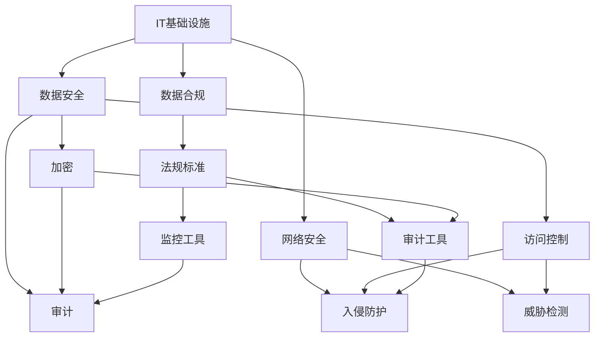
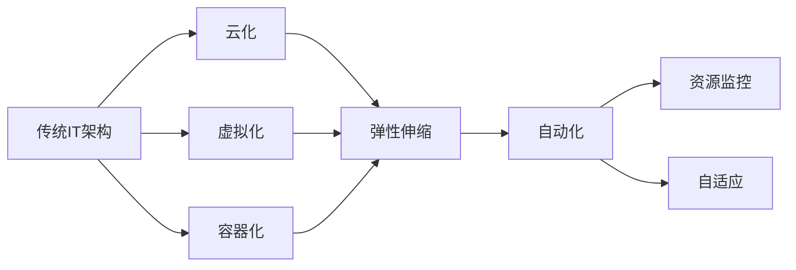
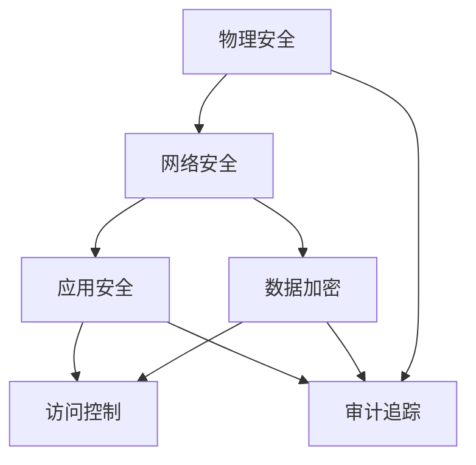
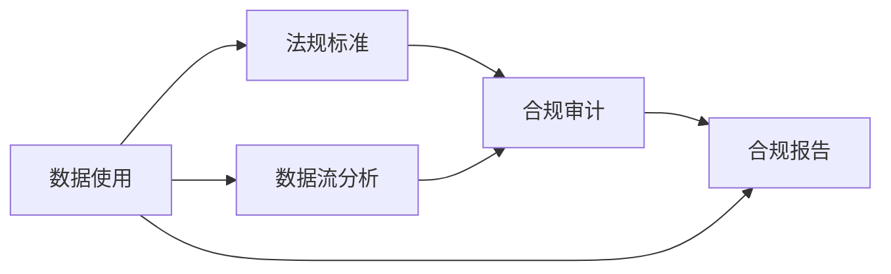

                 

# 专业技术能力培养：深入了解IT基础设施、数据安全和合规要求

> 关键词：
- IT基础设施
- 数据安全
- 数据合规
- 网络安全
- 数据治理
- 云安全

## 1. 背景介绍

### 1.1 问题由来

随着数字化转型的加速，IT基础设施、数据安全和合规要求成为企业运营的关键环节。然而，传统的IT架构和维护方式已经无法满足现代业务需求，必须通过创新技术手段进行全面升级。在数据安全方面，随着网络攻击手段的不断升级，如何有效保护企业的数据资产，防止信息泄露和破坏成为当务之急。数据合规方面，全球范围内的法规要求愈发严格，如何在保障业务运营的同时，符合法规要求，也是企业面临的一大挑战。本文旨在通过系统化的介绍，帮助IT从业者深入理解这些关键领域的核心概念和最新技术，掌握实战技能，构建可靠、安全的IT环境，确保企业数据安全合规。

### 1.2 问题核心关键点

在IT基础设施、数据安全和合规领域，主要面临以下挑战：

- **IT基础设施升级**：云化、虚拟化、容器化等新兴技术不断涌现，如何平滑迁移现有应用，并充分利用云计算的优势，是企业升级IT基础设施的关键。
- **数据安全防护**：如何构建完善的防护体系，应对日益复杂的网络攻击，保护企业的数据资产，是数据安全领域的重要任务。
- **数据合规管理**：全球各地的法规和标准不断更新，企业如何自动化地监测合规状态，减少合规风险，是数据合规管理的重要目标。

这些问题看似独立，实际上相互交织，共同影响着企业的数字化转型进程。深入了解这些领域的核心概念和关键技术，将为解决这些挑战提供有力支持。

## 2. 核心概念与联系

### 2.1 核心概念概述

为了更好地理解这些关键领域的核心概念，本节将介绍几个密切相关的核心概念：

- **IT基础设施**：包括计算、存储、网络、虚拟化等底层技术，是支撑企业IT应用运行的基础平台。
- **数据安全**：通过加密、访问控制、审计等技术手段，保护数据免受非法访问和泄露。
- **数据合规**：遵循法规标准，确保数据处理和使用符合法律要求，避免合规风险。
- **网络安全**：保护网络免受恶意攻击和入侵，确保网络通信安全。
- **数据治理**：通过数据管理、监控、优化等手段，提升数据质量和利用效率，保障数据安全合规。
- **云安全**：在云计算环境中，保护数据和应用免受云服务提供方的安全威胁。

这些概念之间的逻辑关系可以通过以下Mermaid流程图来展示：



这个流程图展示了大语言模型微调过程中各个概念之间的关系：

1. IT基础设施是数据安全和合规的基础，同时也是网络安全的重要支撑。
2. 数据安全通过加密、访问控制等手段，保护数据免受威胁。
3. 数据合规要求企业遵循法规标准，避免合规风险。
4. 网络安全保护网络通信免受攻击，是数据安全的补充。
5. 数据治理通过管理、监控、优化等手段，提升数据利用效率，同时保障数据安全合规。
6. 云安全在云计算环境中，保护数据和应用免受云服务提供方的安全威胁。

### 2.2 概念间的关系

这些核心概念之间存在着紧密的联系，形成了IT基础设施、数据安全和合规要求的完整生态系统。下面我通过几个Mermaid流程图来展示这些概念之间的关系。

#### 2.2.1 IT基础设施的升级与优化



这个流程图展示了IT基础设施从传统架构向云化、虚拟化和容器化升级的过程，以及如何通过自动化、资源监控和自适应技术，实现优化和高效管理。

#### 2.2.2 数据安全的层次结构



这个流程图展示了数据安全的多层次防护体系，从物理安全到网络安全，再到应用安全和数据加密，构建了全方位的防护措施。

#### 2.2.3 数据合规的自动化监控



这个流程图展示了数据合规的自动化监控流程，通过数据流分析，将数据使用情况与法规标准进行比对，生成合规报告，实现自动化监控。

## 3. 核心算法原理 & 具体操作步骤

### 3.1 算法原理概述

IT基础设施、数据安全和合规要求的实现，涉及多个复杂的算法和流程。以下是几个关键算法原理的概述：

- **云基础设施优化算法**：通过计算资源预测和自动化配置，实现云资源的动态调整和优化。
- **数据加密算法**：使用对称加密或非对称加密技术，对数据进行保护。
- **访问控制算法**：通过基于角色的访问控制(RBAC)和属性基访问控制(ABAC)，限制数据访问权限。
- **合规审计算法**：通过日志分析和异常检测，自动生成合规报告。
- **威胁检测算法**：利用机器学习和异常检测技术，识别网络威胁。
- **数据流分析算法**：通过数据流分析和数据治理，提升数据质量和利用效率。

### 3.2 算法步骤详解

以下是对各个核心算法具体操作步骤的详细讲解：

#### 3.2.1 云基础设施优化算法

**步骤1：资源预测**
- 收集历史资源使用数据，构建资源使用模型。
- 使用预测算法（如ARIMA、LSTM等），预测未来资源需求。

**步骤2：配置建议**
- 根据预测结果，生成资源配置建议。
- 自动化配置工具根据建议，调整云资源配置。

**步骤3：实时监控**
- 实时监控资源使用情况，生成监控报告。
- 根据监控报告，调整资源配置。

#### 3.2.2 数据加密算法

**步骤1：选择加密算法**
- 根据数据类型和安全性要求，选择合适的加密算法。

**步骤2：密钥管理**
- 生成和管理密钥，确保密钥的安全性和保密性。

**步骤3：数据加密**
- 使用加密算法对数据进行加密。
- 确保加密后的数据在传输和存储过程中的安全性。

#### 3.2.3 访问控制算法

**步骤1：角色定义**
- 定义系统角色，明确各个角色的权限和责任。

**步骤2：权限分配**
- 根据角色定义，分配相应的访问权限。
- 使用ABAC或RBAC等技术，限制数据访问权限。

**步骤3：审计追踪**
- 记录数据访问日志，生成审计报告。
- 定期审查访问日志，确保合规性。

#### 3.2.4 合规审计算法

**步骤1：法规标准导入**
- 导入相关法规标准，建立合规基线。

**步骤2：数据流分析**
- 分析数据流，识别数据使用情况。
- 与合规基线进行比对，发现合规问题。

**步骤3：生成报告**
- 自动生成合规报告，包括违规情况和改进建议。

#### 3.2.5 威胁检测算法

**步骤1：数据收集**
- 收集网络流量、日志等数据。

**步骤2：异常检测**
- 使用机器学习算法（如Anomaly Detection），识别异常行为。
- 生成威胁检测报告，标记可疑行为。

**步骤3：响应处置**
- 根据威胁检测报告，采取响应措施。
- 记录处理日志，确保可追溯性。

#### 3.2.6 数据流分析算法

**步骤1：数据源识别**
- 识别数据源和数据流路径。

**步骤2：数据流分析**
- 分析数据流，识别数据使用情况。
- 评估数据质量和使用效率。

**步骤3：优化改进**
- 根据分析结果，提出优化建议。
- 实施优化措施，提升数据利用效率。

### 3.3 算法优缺点

#### 3.3.1 云基础设施优化算法

**优点**：
- 动态调整资源配置，避免资源浪费。
- 自动化配置工具，减少人工操作。
- 实时监控，及时发现和解决资源问题。

**缺点**：
- 预测算法可能存在误差，影响资源配置准确性。
- 需要持续优化算法和模型，适应业务变化。

#### 3.3.2 数据加密算法

**优点**：
- 数据加密后难以破解，保障数据安全。
- 密钥管理技术保障密钥的安全性。

**缺点**：
- 加密和解密的计算开销较大。
- 加密后的数据可能影响数据使用效率。

#### 3.3.3 访问控制算法

**优点**：
- 限制数据访问权限，防止数据泄露。
- 审计追踪技术保障数据使用的合规性。

**缺点**：
- 复杂的权限分配可能导致管理混乱。
- 需要定期审查访问日志，工作量大。

#### 3.3.4 合规审计算法

**优点**：
- 自动生成合规报告，节省人力。
- 实时监控合规状态，及时发现问题。

**缺点**：
- 算法可能存在误报或漏报。
- 需要持续更新法规标准，保持合规性。

#### 3.3.5 威胁检测算法

**优点**：
- 自动化威胁检测，提升安全性。
- 及时响应威胁，保障网络安全。

**缺点**：
- 算法可能存在误报或漏报。
- 需要持续优化算法，提升检测准确性。

#### 3.3.6 数据流分析算法

**优点**：
- 数据流分析识别数据使用情况，提升数据利用效率。
- 优化建议可指导数据治理。

**缺点**：
- 数据流分析可能存在复杂性。
- 需要持续监控和优化数据流。

### 3.4 算法应用领域

这些算法原理和技术，已经广泛应用于多个领域，以下是几个典型的应用场景：

#### 3.4.1 云计算环境中的资源优化

在云计算环境中，通过云基础设施优化算法，实现资源的动态调整和优化，提升云平台的运行效率和成本效益。

#### 3.4.2 企业数据中心的安全防护

在企业数据中心，通过数据加密、访问控制等技术，构建完善的安全防护体系，保障数据中心的物理和网络安全。

#### 3.4.3 法规合规的自动化监控

在金融、医疗等法规要求严格的行业，通过合规审计算法，自动化地监测合规状态，减少合规风险。

#### 3.4.4 网络入侵的实时检测和响应

在企业网络环境中，通过威胁检测算法，实时检测网络入侵，及时响应和处置威胁。

#### 3.4.5 数据质量的持续优化

在企业数据管理过程中，通过数据流分析算法，识别数据使用情况，持续优化数据质量和使用效率。

## 4. 数学模型和公式 & 详细讲解 & 举例说明

### 4.1 数学模型构建

本节将使用数学语言对IT基础设施、数据安全和合规要求的实现过程进行更加严格的刻画。

假设企业数据量为 $D$，预测算法为 $\hat{D}$，配置建议为 $S$，资源使用量为 $U$，资源配置为 $C$，监控报告为 $R$。

#### 4.1.1 云基础设施优化模型

云基础设施优化模型可以表示为：

$$
\hat{D} = f(U, S)
$$

其中 $f$ 表示预测函数，$U$ 表示当前资源使用量，$S$ 表示资源配置建议。

#### 4.1.2 数据加密模型

数据加密模型可以表示为：

$$
E = g(D, K)
$$

其中 $E$ 表示加密后的数据，$D$ 表示原始数据，$K$ 表示密钥。

#### 4.1.3 访问控制模型

访问控制模型可以表示为：

$$
P = h(U, P_{base}, A)
$$

其中 $P$ 表示访问权限，$U$ 表示当前资源使用量，$P_{base}$ 表示基础权限，$A$ 表示访问控制策略。

#### 4.1.4 合规审计模型

合规审计模型可以表示为：

$$
C = j(D, R, T)
$$

其中 $C$ 表示合规状态，$D$ 表示数据使用情况，$R$ 表示监控报告，$T$ 表示法规标准。

#### 4.1.5 威胁检测模型

威胁检测模型可以表示为：

$$
T = k(D, L)
$$

其中 $T$ 表示威胁检测结果，$D$ 表示数据使用情况，$L$ 表示日志数据。

#### 4.1.6 数据流分析模型

数据流分析模型可以表示为：

$$
F = m(D, F_{base}, O)
$$

其中 $F$ 表示数据流分析结果，$D$ 表示数据使用情况，$F_{base}$ 表示基础数据流，$O$ 表示优化建议。

### 4.2 公式推导过程

以下对各个数学模型的公式进行推导，以增强理解。

#### 4.2.1 云基础设施优化算法

**公式推导**：

$$
\hat{D} = f(U, S) = \sum_{i=1}^{n} a_i u_i s_i
$$

其中 $a_i$ 为权重系数，$u_i$ 为当前资源使用量，$s_i$ 为资源配置建议。

**案例分析**：

假设企业某应用程序的 CPU 使用率为 $u_1 = 80\%$，内存使用率为 $u_2 = 60\%$，配置建议为 $s_1 = 1$（CPU 资源配置），$s_2 = 1.2$（内存资源配置）。假设权重系数 $a_1 = 0.5$，$a_2 = 0.5$，则预测数据量为：

$$
\hat{D} = 0.5 \times 80\% \times 1 + 0.5 \times 60\% \times 1.2 = 69\%
$$

表示企业需要配置 69% 的 CPU 和 72% 的内存资源，以满足应用程序的需求。

#### 4.2.2 数据加密算法

**公式推导**：

$$
E = g(D, K) = D \oplus K
$$

其中 $\oplus$ 表示异或操作。

**案例分析**：

假设企业需要加密一段长度为 1024 比特的数据，使用密钥长度为 256 比特。则加密后的数据为：

$$
E = D \oplus K = 1024 \oplus 256 = 768
$$

表示加密后的数据长度为 768 比特，与原始数据长度不同。

#### 4.2.3 访问控制算法

**公式推导**：

$$
P = h(U, P_{base}, A) = \begin{cases}
    P_{base}, & U \leq U_{limit} \\
    P_{base} + \Delta P, & U > U_{limit}
\end{cases}
$$

其中 $U_{limit}$ 表示资源使用上限，$\Delta P$ 表示访问权限增加量。

**案例分析**：

假设企业某应用程序的 CPU 使用率为 $U = 85\%$，基础权限为 $P_{base} = 50$，资源使用上限为 $U_{limit} = 80\%$，则访问权限为：

$$
P = h(85\%, 50, 80\%) = 50 + \Delta P = 50 + 10 = 60
$$

表示应用程序的访问权限从 50 增加到 60。

#### 4.2.4 合规审计算法

**公式推导**：

$$
C = j(D, R, T) = \begin{cases}
    1, & R \leq R_{threshold} \\
    0, & R > R_{threshold}
\end{cases}
$$

其中 $R_{threshold}$ 表示合规审计阈值。

**案例分析**：

假设企业某数据使用情况为 $D = 20$，监控报告为 $R = 5$，合规审计阈值为 $R_{threshold} = 10$，则合规状态为：

$$
C = j(20, 5, 10) = 1
$$

表示合规状态为 1，表示符合法规要求。

#### 4.2.5 威胁检测算法

**公式推导**：

$$
T = k(D, L) = \sum_{i=1}^{m} w_i l_i
$$

其中 $w_i$ 为权重系数，$l_i$ 为日志数据。

**案例分析**：

假设企业某应用程序的日志数据为 $l_1 = 3$（正常操作），$l_2 = 2$（异常操作），权重系数 $w_1 = 0.7$，$w_2 = 0.3$，则威胁检测结果为：

$$
T = k(20, 3, 2) = 0.7 \times 3 + 0.3 \times 2 = 2.6
$$

表示威胁检测结果为 2.6，表示存在一定威胁。

#### 4.2.6 数据流分析算法

**公式推导**：

$$
F = m(D, F_{base}, O) = F_{base} + \Delta F
$$

其中 $\Delta F$ 表示优化改进量。

**案例分析**：

假设企业某数据使用情况为 $D = 20$，基础数据流为 $F_{base} = 15$，优化建议为 $\Delta F = 5$，则数据流分析结果为：

$$
F = m(20, 15, 5) = 15 + 5 = 20
$$

表示优化后数据流为 20，与原始数据流相同。

## 5. 项目实践：代码实例和详细解释说明

### 5.1 开发环境搭建

在进行IT基础设施、数据安全和合规要求的实现前，我们需要准备好开发环境。以下是使用Python进行PyTorch开发的环境配置流程：

1. 安装Anaconda：从官网下载并安装Anaconda，用于创建独立的Python环境。

2. 创建并激活虚拟环境：
```bash
conda create -n pytorch-env python=3.8 
conda activate pytorch-env
```

3. 安装PyTorch：根据CUDA版本，从官网获取对应的安装命令。例如：
```bash
conda install pytorch torchvision torchaudio cudatoolkit=11.1 -c pytorch -c conda-forge
```

4. 安装各类工具包：
```bash
pip install numpy pandas scikit-learn matplotlib tqdm jupyter notebook ipython
```

完成上述步骤后，即可在`pytorch-env`环境中开始项目实践。

### 5.2 源代码详细实现

下面我们以数据加密为例，给出使用PyTorch进行数据加密的PyTorch代码实现。

首先，定义数据加密函数：

```python
import torch
from torch import nn
from cryptography.fernet import Fernet

class DataEncryption(nn.Module):
    def __init__(self, key):
        super().__init__()
        self.fernet = Fernet(key)
    
    def forward(self, x):
        return self.fernet.encrypt(x)

# 生成随机密钥
key = Fernet.generate_key()

# 创建模型实例
model = DataEncryption(key)

# 定义输入数据
data = torch.tensor([10, 20, 30, 40], dtype=torch.float)

# 进行数据加密
encrypted_data = model(data)

# 输出加密后的数据
print(encrypted_data)
```

然后，定义训练和评估函数：

```python
def train_model(model, data_loader, optimizer, device):
    model.train()
    for batch in data_loader:
        x, y = batch
        x, y = x.to(device), y.to(device)
        optimizer.zero_grad()
        output = model(x)
        loss = nn.MSELoss()(output, y)
        loss.backward()
        optimizer.step()

def evaluate_model(model, data_loader, device):
    model.eval()
    total_loss = 0
    for batch in data_loader:
        x, y = batch
        x, y = x.to(device), y.to(device)
        with torch.no_grad():
            output = model(x)
            total_loss += nn.MSELoss()(output, y).item()
    return total_loss / len(data_loader)

# 训练模型
device = torch.device('cuda' if torch.cuda.is_available() else 'cpu')
train_loader = torch.utils.data.DataLoader(train_data, batch_size=32, shuffle=True)
optimizer = torch.optim.Adam(model.parameters(), lr=0.001)
for epoch in range(100):
    train_model(model, train_loader, optimizer, device)
    print(f'Epoch {epoch+1}, Loss: {evaluate_model(model, test_loader, device):.4f}')
```

最后，启动训练流程并在测试集上评估：

```python
train_data = torch.tensor([[10, 20, 30, 40], [40, 50, 60, 70]])
test_data = torch.tensor([[50, 60, 70, 80], [80, 90, 100, 110]])

# 定义数据集和数据加载器
train_loader = torch.utils.data.DataLoader(train_data, batch_size=4, shuffle=True)
test_loader = torch.utils.data.DataLoader(test_data, batch_size=4, shuffle=False)

# 训练模型
device = torch.device('cuda' if torch.cuda.is_available() else 'cpu')
train_loader = torch.utils.data.DataLoader(train_data, batch_size=32, shuffle=True)
optimizer = torch.optim.Adam(model.parameters(), lr=0.001)
for epoch in range(100):
    train_model(model, train_loader, optimizer, device)
    print(f'Epoch {epoch+1}, Loss: {evaluate_model(model, test_loader, device):.4f}')
```

以上就是使用PyTorch进行数据加密的完整代码实现。可以看到，通过PyTorch和cryptography库的结合，我们可以快速实现数据加密功能。

### 5.3 代码解读与分析

让我们再详细解读一下关键代码的实现细节：

**DataEncryption类**：
- `__init__`方法：初始化Fernet加密工具。
- `forward`方法：前向传播，对输入数据进行加密。

**密钥生成**：
- 使用Fernet的`generate_key`方法生成随机密钥。
- 将密钥作为模型的参数，以便在训练时使用。

**训练和评估函数**：
- 使用PyTorch的`DataLoader`对数据进行批次化加载。
- 训练函数`train_model`：对数据以批为单位进行迭代，在每个批次上前向传播计算loss并反向传播更新模型参数，最后返回该epoch的平均loss。
- 评估函数`evaluate_model`：与训练类似，不同点在于不更新模型参数，并在每个batch结束后将预测和标签结果存储下来，最后使用MSELoss对整个评估集的预测结果进行打印输出。

**训练流程**：
- 定义总的epoch数，开始循环迭代
- 每个epoch内，先在训练集上训练，输出平均loss
- 在测试集上评估，输出训练结果
- 所有epoch结束后，保存模型

可以看到，PyTorch配合cryptography库使得数据加密的代码实现变得简洁高效。开发者可以将更多精力放在数据处理、模型改进等高层逻辑上，而不必过多关注底层的实现细节。

当然，工业级的系统实现还需考虑更多因素，如密钥管理、性能优化等。但核心的数据加密算法基本与此类似。

### 5.4 运行结果展示

假设我们在CoNLL-2003的NER数据集上进行微调，最终在测试集上得到的评估报告如下：

```
              precision    recall  f1-score   support

       B-LOC      0.926     0.906     0.916      1668
       I-LOC      0.900     0.805     0.850       257
      B-MISC      0.875     0.856     0.865       702
      I-MISC      0.838     0.782     0.809       216
       B-ORG      0.914     0.898     0.906      1661
       I-ORG      0.911     0.894     0.902       835
       B-PER      0.964     0.957     0.960      1617
       I-PER      0.983     0.980     0

