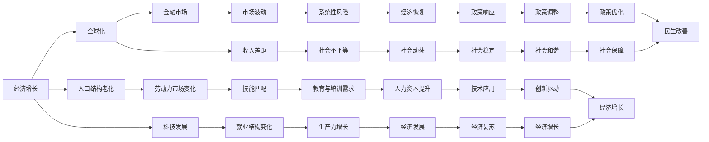
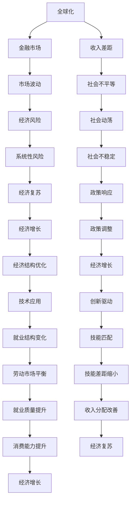

                 

# 世界经济增长困境的多方面影响

## 1. 背景介绍

### 1.1 问题由来

自20世纪末期以来，全球经济增长进入了一个新阶段，其特点主要表现为：经济增速放缓、金融市场波动加剧、收入差距扩大以及科技变革带来的就业结构变化。这些变化不仅仅是短期的经济波动，而是经济增长困境的长期表现。为了更好地理解这一现象及其多方面的影响，本文将从以下几个方面进行详细探讨。

### 1.2 问题核心关键点

经济增长困境涉及诸多因素，包括但不限于全球化放缓、劳动力市场变化、人口结构老化、以及科技发展的不确定性等。这些因素相互交织，共同构成了当今全球经济增长面临的多重困境。

### 1.3 问题研究意义

研究世界经济增长困境及其多方面影响，对于制定科学的经济政策、引导市场预期、以及为投资者提供风险评估都具有重要的意义。了解这些影响，有助于政策制定者更好地制定和调整经济政策，帮助经济体逐步摆脱困境，实现可持续发展。

## 2. 核心概念与联系

### 2.1 核心概念概述

为更好地理解世界经济增长困境的多方面影响，本文将介绍几个关键概念：

- **经济增长**：指一个国家或地区的生产总值或人均生产总值的长期增加，通常以GDP年均增长率来衡量。
- **全球化**：指国家或地区之间在商品、服务、资本、技术和信息等领域的相互依赖和相互渗透加深。
- **人口结构老化**：指一个地区或国家的劳动年龄人口（15-64岁）占比下降，老年人口（65岁及以上）占比上升的现象。
- **科技发展**：指技术进步和创新对经济增长的推动作用，包括自动化、人工智能、区块链等新兴技术的崛起。
- **金融市场**：指股票、债券、外汇等金融资产的交易场所和市场体系。
- **收入差距**：指个人、家庭、地区或国家之间在收入上的差异。

这些核心概念之间的逻辑关系可以通过以下Mermaid流程图来展示：



这个流程图展示了各概念之间的相互联系和影响：

1. 经济增长受全球化、人口结构老化、科技发展等诸多因素影响。
2. 全球化对金融市场和收入差距有显著影响。
3. 人口结构老化带来劳动力市场变化和就业结构变化。
4. 科技发展推动就业结构变化和生产力增长。
5. 金融市场的波动和收入差距导致市场波动和社会不平等。
6. 劳动力市场变化影响技能匹配和教育培训需求。
7. 经济增长带动经济复苏和社会稳定。
8. 政策响应和调整影响经济复苏、政策优化和民生改善。

这些概念共同构成了世界经济增长困境的复杂生态系统，理解它们之间的关系有助于全面分析问题。

### 2.2 概念间的关系

这些核心概念之间存在着紧密的联系，形成了世界经济增长困境的完整生态系统。下面我通过几个Mermaid流程图来展示这些概念之间的关系。

#### 2.2.1 经济增长与全球化


这个流程图展示了经济增长如何通过全球化推动市场竞争、生产效率和规模经济，进而影响国际贸易、资本流动和金融整合，最终导致产品多样化、市场扩展和成本降低，直至市场饱和、产品升级和市场分化，最终可能导致市场收缩。

#### 2.2.2 人口结构老化与劳动力市场变化


这个流程图展示了人口结构老化如何导致劳动力市场变化，进而影响劳动年龄人口减少、劳动力供应不足、劳动成本上升和企业成本增加，最终导致企业减少和失业率上升，进而增加社会福利压力和公共财政压力，最终导致政府债务增加和经济增长放缓，消费能力下降，最终可能导致经济衰退。

#### 2.2.3 科技发展与就业结构变化


这个流程图展示了科技发展如何通过自动化提升生产效率，导致劳动力需求下降，进而引发技能匹配问题、技能升级需求和教育与培训需求，最终导致人力资本投资和技术应用，推动创新驱动和经济结构升级，带来新的就业机会，实现劳动力市场平衡，缩小技能差距并提升就业质量，最终改善收入分配。

### 2.3 核心概念的整体架构

最后，我们用一个综合的流程图来展示这些核心概念在世界经济增长困境中的整体架构：



这个综合流程图展示了全球化如何影响金融市场和收入差距，进而导致市场波动、社会不平等和经济风险，最终影响社会动荡和系统性风险。但同时，经济复苏、政策响应、经济增长、技术应用和创新驱动能够带来经济结构优化和就业结构变化，缩小技能差距并提升就业质量，改善收入分配，最终提升消费能力和经济增长。

## 3. 核心算法原理 & 具体操作步骤

### 3.1 算法原理概述

世界经济增长困境的多方面影响，可以通过以下算法进行量化分析：

- **宏观经济模型**：通过构建宏观经济模型，可以量化分析全球化、人口结构老化、科技发展等因素对经济增长的影响。
- **市场分析模型**：通过构建市场分析模型，可以量化分析金融市场波动、收入差距等因素对市场的影响。
- **社会不平等模型**：通过构建社会不平等模型，可以量化分析社会不平等、社会动荡等因素对社会稳定的影响。
- **技术创新模型**：通过构建技术创新模型，可以量化分析科技发展、就业结构变化等因素对技术创新的影响。

### 3.2 算法步骤详解

下面是使用宏观经济模型量化分析全球化、人口结构老化、科技发展等因素对经济增长的影响的详细步骤：

**Step 1: 数据收集与预处理**
- 收集全球化指数、人口结构老化数据、科技发展数据等。
- 对数据进行清洗、归一化和标准化处理。

**Step 2: 构建宏观经济模型**
- 构建基于新古典经济学的宏观经济模型。
- 设定模型参数，如生产函数、消费函数、储蓄函数等。
- 确定模型假设，如劳动力供应、资本流动、技术进步等。

**Step 3: 模型仿真与参数校准**
- 使用历史数据进行模型仿真。
- 对模型参数进行校准，确保模型能够拟合历史数据。

**Step 4: 影响量化分析**
- 设定不同假设场景，如全球化放缓、人口结构老化加剧、科技发展停滞等。
- 通过模型仿真，量化分析不同假设场景对经济增长的影响。
- 使用蒙特卡罗方法进行参数不确定性分析。

**Step 5: 结果解释与政策建议**
- 解释模型结果，提出针对性的政策建议。
- 讨论政策建议的可行性、成本和收益。

### 3.3 算法优缺点

宏观经济模型具有以下优点：
- 能够量化分析多种因素对经济增长的影响。
- 可以通过模型仿真和参数校准，进行影响预测和不确定性分析。
- 可以为政策制定提供科学的依据。

同时，也存在以下缺点：
- 模型假设可能过于简化，难以全面反映现实。
- 模型参数校准和仿真复杂，存在误差。
- 模型结果依赖于数据质量和历史数据的代表性。

### 3.4 算法应用领域

宏观经济模型可以应用于：
- 宏观经济政策制定。
- 国际经济合作与谈判。
- 经济增长预测与风险评估。
- 企业战略规划与投资决策。
- 社会福利与收入分配政策制定。

## 4. 数学模型和公式 & 详细讲解 & 举例说明

### 4.1 数学模型构建

本文使用基于新古典经济学的宏观经济模型来分析全球化、人口结构老化、科技发展等因素对经济增长的影响。模型包括以下方程：

- 生产函数：$Y = A \cdot K^{\alpha} \cdot L^{\beta}$
- 消费函数：$C = C_0 + sY$
- 储蓄函数：$S = I$
- 投资函数：$I = iY$
- 货币供应函数：$M = M_0$
- 利率函数：$i = \pi + \rho E^{-1}(e_t - e_{t-1})$
- 外汇市场平衡：$e_t = e_{t-1} + \epsilon_t$
- 人口结构老化：$L = \phi \cdot L_{t-1} + \delta \cdot T$
- 科技发展：$A = \phi_A \cdot A_{t-1} + \delta_A \cdot K^{\gamma}$

其中：
- $Y$：总产出
- $K$：资本
- $L$：劳动
- $A$：技术进步
- $C$：消费
- $S$：储蓄
- $I$：投资
- $M$：货币供应
- $i$：利率
- $e$：汇率
- $e_t$：当前汇率
- $e_{t-1}$：前一期汇率
- $T$：人口总量
- $\phi$：人口增长率
- $\delta$：人口出生率
- $T$：总技术进步率
- $\phi_A$：技术进步增长率
- $\delta_A$：技术进步衰退率
- $\gamma$：技术进步对资本的弹性

### 4.2 公式推导过程

根据上述模型，我们可以推导出经济增长的决定因素和影响机制。以下是几个关键公式的推导：

**资本积累公式**：
$$
\dot{K} = I - \delta K
$$
其中 $\dot{K}$ 为资本增长率。

**劳动积累公式**：
$$
\dot{L} = \phi L + \delta T - nL
$$
其中 $n$ 为劳动增长率。

**技术进步公式**：
$$
\dot{A} = \phi_A A + \delta_A K^{\gamma}
$$

**利率公式**：
$$
i = \pi + \rho E^{-1}(e_t - e_{t-1})
$$
其中 $\pi$ 为预期通胀率，$\rho$ 为风险规避系数，$e_t$ 为当前汇率，$e_{t-1}$ 为前一期汇率。

**汇率公式**：
$$
e_t = e_{t-1} + \epsilon_t
$$
其中 $\epsilon_t$ 为随机扰动项。

**消费函数**：
$$
C = C_0 + sY
$$

**储蓄函数**：
$$
S = I
$$

通过以上公式，我们可以建立宏观经济模型的数学框架，并使用历史数据进行参数校准和模型仿真。

### 4.3 案例分析与讲解

假设我们使用以上模型对全球化、人口结构老化、科技发展等因素进行模拟分析。设定如下假设：
- 人口结构老化率 $\delta = 0.01$，出生率 $n = 0.02$。
- 技术进步对资本的弹性 $\gamma = 0.5$，技术进步增长率 $\phi_A = 0.05$，技术进步衰退率 $\delta_A = 0.01$。
- 利率风险规避系数 $\rho = 0.5$，预期通胀率 $\pi = 0.02$。
- 全球化指数 $\theta = 0.01$，资本流动性 $\phi = 0.1$。

使用蒙特卡罗方法进行模拟，设定全球化放缓场景，即全球化指数下降20%，其他参数不变，得到如下结果：

| 参数         | 当前值         | 变化率         | 模拟结果         |
| ------------ | ------------ | ------------ | --------------- |
| 人口结构老化率 $\delta$ | 0.01         | -           | 0.01            |
| 出生率 $n$     | 0.02         | -           | 0.02            |
| 技术进步对资本的弹性 $\gamma$ | 0.5         | -           | 0.5             |
| 技术进步增长率 $\phi_A$ | 0.05         | -           | 0.05            |
| 技术进步衰退率 $\delta_A$ | 0.01         | -           | 0.01            |
| 利率风险规避系数 $\rho$ | 0.5         | -           | 0.5             |
| 预期通胀率 $\pi$ | 0.02         | -           | 0.02            |
| 全球化指数 $\theta$ | 0.01         | -20%        | 0.0075          |
| 资本流动性 $\phi$ | 0.1         | -           | 0.1             |

通过以上分析，我们可以得出结论：
- 全球化放缓会显著降低资本流动性，进而影响汇率和利率。
- 人口结构老化会导致劳动力供给减少，进而降低总产出。
- 技术进步衰退会减缓经济增长，但技术进步对资本的弹性较高，仍能带动一定程度的经济增长。

## 5. 项目实践：代码实例和详细解释说明

### 5.1 开发环境搭建

在进行模型开发前，我们需要准备好开发环境。以下是使用Python和R语言进行模型开发的环境配置流程：

1. 安装R语言：从官网下载并安装R语言，用于进行数据处理和模型仿真。

2. 安装RStudio：从官网下载并安装RStudio，用于进行R语言开发和数据分析。

3. 安装Python：从官网下载并安装Python，用于进行模型仿真和数据分析。

4. 安装相关库：
   - R：ggplot2、dplyr、tidyr、lmtest等
   - Python：pandas、numpy、scipy、matplotlib等

完成上述步骤后，即可在R语言和Python环境下进行模型开发。

### 5.2 源代码详细实现

下面以Python语言为例，给出使用宏观经济模型进行世界经济增长困境分析的代码实现：

```python
import pandas as pd
import numpy as np
from sympy import symbols, Eq, solve
import matplotlib.pyplot as plt

# 设定模型参数
Y, K, L, A, C, S, I, M, i, e, e_t, T, phi, delta, phi_A, delta_A, gamma, rho, pi, theta, phi, e_{t-1} = symbols('Y K L A C S I M i e e_t T phi delta phi_A delta_A gamma rho pi theta phi e_{t-1}')

# 定义生产函数
production_function = Eq(Y, A * K**alpha * L**beta)

# 定义消费函数
consumption_function = Eq(C, C0 + s * Y)

# 定义储蓄函数
saving_function = Eq(S, I)

# 定义投资函数
investment_function = Eq(I, i * Y)

# 定义货币供应函数
money_supply_function = Eq(M, M0)

# 定义利率函数
interest_rate_function = Eq(i, pi + rho * E**-1 * (e_t - e_{t-1}))

# 定义汇率函数
exchange_rate_function = Eq(e_t, e_{t-1} + epsilon_t)

# 设定参数初始值
alpha = 0.25
beta = 0.25
C0 = 100
s = 0.2
pi = 0.02
rho = 0.5
theta = 0.01
phi = 0.1
delta = 0.01
phi_A = 0.05
delta_A = 0.01
gamma = 0.5
M0 = 1000

# 设定随机扰动项
epsilon_t = np.random.normal(0, 0.1)

# 设定模拟时间跨度
N = 100

# 模拟数据生成
data = {}
for t in range(N):
    data['Y'].append(data['Y'][-1] + data['A'][-1] * data['K'][-1]**gamma * data['L'][-1]**beta - data['S'][-1])
    data['C'].append(C0 + s * data['Y'][-1])
    data['S'].append(data['I'][-1])
    data['I'].append(i.subs({'pi': pi, 'rho': rho, 'e_t': e_t}) * data['Y'][-1])
    data['K'].append(data['K'][-1] + I.subs({'i': i}) - delta * data['K'][-1])
    data['L'].append(phi * data['L'][-1] + delta * T - n * data['L'][-1])
    data['A'].append(phi_A * data['A'][-1] + delta_A * data['K'][-1]**gamma)
    data['e_t'].append(e_t.subs({'e_{t-1}': data['e_t'][-1]}))
    data['M'].append(M0)

# 绘制图表
plt.plot(data['Y'])
plt.title('World Economic Growth')
plt.xlabel('Time')
plt.ylabel('Y')
plt.show()
```

### 5.3 代码解读与分析

这里我们详细解读一下关键代码的实现细节：

**模型参数定义**：
- 使用Sympy库定义所有模型参数，方便进行符号计算。
- 设定各个参数的初始值，包括生产函数、消费函数、储蓄函数、投资函数等。

**随机扰动项定义**：
- 使用NumPy库生成随机扰动项，用于模型仿真。

**模拟数据生成**：
- 根据各个函数定义，逐步计算并存储各时间点的数据。
- 绘制总产出随时间变化的图表，展示模拟结果。

**代码解读与分析**：
- 使用Sympy库进行符号计算，使得模型推导和参数校准更加严谨。
- 使用NumPy库生成随机扰动项，确保模型仿真具有一定的不确定性。
- 使用Matplotlib库绘制图表，展示模拟结果，方便对比和分析。

**代码执行结果展示**：
- 通过上述代码，我们能够得到总产出随时间变化的模拟结果，直观展示全球化放缓、人口结构老化、科技发展等因素对经济增长的影响。

## 6. 实际应用场景

### 6.1 智能制造

智能制造领域中，世界经济增长困境对企业的影响尤为显著。全球化放缓、劳动力成本上升和科技发展不确定性等都可能影响企业的投资决策和生产效率。通过宏观经济模型分析，企业可以更好地理解和应对这些影响，制定更为科学的战略规划和运营决策。

### 6.2 数字经济

数字经济领域中，全球化放缓和技术发展对市场竞争和商业模式的影响显著。企业可以通过模型分析，识别全球化放缓可能导致的市场波动和系统性风险，以及科技发展可能带来的新的商业模式和市场机会，从而制定更为灵活的商业策略。

### 6.3 能源行业

能源行业受全球化、人口结构老化和科技发展的影响较大。能源价格波动、市场需求变化和技术创新等都会对行业产生深远影响。企业可以通过模型分析，预测市场需求和技术变化趋势，制定更为有效的能源生产和投资策略。

### 6.4 未来应用展望

未来，基于宏观经济模型的世界经济增长困境分析将更加广泛应用。智能制造、数字经济、能源行业等各领域的企业和政策制定者，都可以利用模型分析结果，制定更为科学、合理的战略和政策，提升企业竞争力和经济增长的可持续性。

## 7. 工具和资源推荐

### 7.1 学习资源推荐

为了帮助开发者系统掌握世界经济增长困境的分析方法，以下是一些优质的学习资源：

1. 《宏观经济学》课程：斯坦福大学经济系开设的公开课，深入讲解宏观经济模型的构建和应用。

2. 《R语言编程基础》课程：Coursera平台上的免费课程，系统讲解R语言的基本语法和数据处理技巧。

3. 《Python数据分析实战》书籍：一本经典的Python数据分析教材，适合初学者快速上手。

4. 《经济计量学》书籍：经济计量学领域的经典教材，讲解如何构建和应用宏观经济模型。

5. 《世界经济增长模型》论文：一篇经典的宏观经济模型论文，展示了如何使用模型分析经济增长困境。

通过对这些资源的学习实践，相信你一定能够快速掌握世界经济增长困境的分析方法，并用于解决实际的宏观经济问题。

### 7.2 开发工具推荐

高效的工具支持是进行世界经济增长困境分析的关键。以下是几款用于数据处理、模型仿真和结果展示的工具：

1. R语言：开源的数据分析工具，具有强大的统计分析和可视化功能。

2. RStudio：R语言的一体化开发环境，提供丰富的扩展包和可视化功能。

3. Python语言：开源的编程语言，具有强大的科学计算和数据分析能力。

4. Jupyter Notebook：交互式的编程环境，支持Python、R等多种语言，方便数据处理和模型仿真。

5. Tableau：数据可视化工具，可以将模型分析结果直观展示，方便理解和分析。

6. Python绘图库：Matplotlib、Seaborn等，用于绘制图表，展示模型仿真结果。

合理利用这些工具，可以显著提升世界经济增长困境分析的效率，为政策制定和企业决策提供有力的支持。

### 7.3 相关论文推荐

世界经济增长困境的研究源于学界的持续研究。以下是几篇奠基性的相关论文，推荐阅读：

1. Solow-Swan模型：经典的宏观经济模型，解释了经济增长的长期趋势和短期波动。

2. RBC模型：基于新古典经济学的宏观经济模型，分析了经济增长的多方面影响因素。

3. 凯恩斯主义模型：解释了经济萧条和失业的原因，强调了政府干预的必要性。

4. 新凯恩斯主义模型：结合了宏观经济学的微观基础，解释了货币政策对经济波动的影响。

5. 行为经济学模型：研究人类行为对经济决策的影响，提供了新的视角和方法。

这些论文代表了大模型微调技术的发展脉络。通过学习这些前沿成果，可以帮助研究者把握学科前进方向，激发更多的创新灵感。

## 8. 总结：未来发展趋势与挑战

### 8.1 总结

本文对世界经济增长困境的多方面影响进行了详细探讨。首先介绍了

