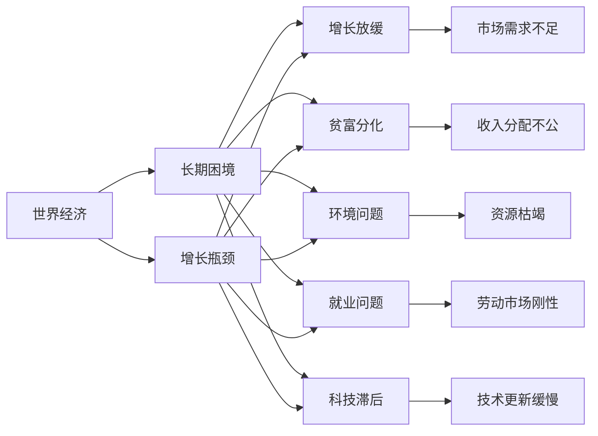

                 

# 世界经济增长的长期困境

> 关键词：世界经济,长期困境,增长瓶颈,科技创新,数字化转型,全球化

## 1. 背景介绍

### 1.1 问题由来

全球经济在过去几十年经历了前所未有的增长，从1960年代的4.8%增长率，到2000年代中期的4.9%，再到2010年后的2.9%。尽管全球经济总量不断扩大，但是各国的增长速度和收益分配出现了明显的不均衡，贫富差距扩大，环境问题加剧，就业问题频发。世界经济增长的长期困境成为一个不容忽视的现实问题。

### 1.2 问题核心关键点

世界经济增长长期困境的核心关键点包括：

- **增长放缓**：世界经济增速从近40年的平均3.4%降至2.9%。
- **贫富分化**：全球贫富差距扩大，经济增长带来的收益主要集中在少数富裕阶层。
- **环境问题**：气候变化、资源枯竭等环境问题日益严重，对经济的可持续发展构成威胁。
- **就业问题**：全球范围内的失业率居高不下，尤其是年轻人的就业问题突出。
- **科技滞后**：虽然一些新兴科技领域取得了突破，但整体上科技发展滞后于经济增长。

## 2. 核心概念与联系

### 2.1 核心概念概述

- **世界经济**：由全球范围内的生产和消费活动构成的经济体系，包括国际贸易、金融市场、跨国企业等。
- **长期困境**：经济增长停滞不前，贫富差距扩大，就业困难，环境问题严重等长期存在的问题。
- **增长瓶颈**：经济增长过程中遇到的各种障碍，如技术停滞、市场需求不足、政策不当等。
- **科技创新**：通过技术进步和制度创新，推动经济增长的过程。
- **数字化转型**：通过信息和通信技术的应用，提高经济效率和增长潜力的过程。
- **全球化**：各国经济相互依存，贸易、投资、金融等全球一体化的过程。

### 2.2 概念间的关系

这些核心概念之间存在着紧密的联系，构成了世界经济增长的复杂系统。以下是这些概念之间的逻辑关系：



这个图表展示了各个概念之间的相互作用，其中长期困境作为综合表现，由增长瓶颈、增长放缓、贫富分化、环境问题、就业问题和科技滞后等多个方面共同构成。

### 2.3 核心概念的整体架构

世界经济增长的长期困境涉及多个层面的问题，以下综合图表展示了这些核心概念之间的整体架构：

```mermaid
graph LR
    A[世界经济] --> B[增长瓶颈]
    B --> C[需求不足]
    B --> D[资源枯竭]
    B --> E[技术滞后]
    B --> F[市场刚性]
    B --> G[政策失当]
    C --> H[低增长率]
    D --> I[高物价]
    E --> J[低创新率]
    F --> K[高失业率]
    G --> L[低增长率]
    H --> M[增长放缓]
    I --> N[经济压力]
    J --> O[竞争压力]
    K --> P[社会不满]
    L --> Q[政策影响]
    M --> R[长期停滞]
    N --> S[贫富分化]
    O --> T[市场波动]
    P --> U[社会不稳定]
    Q --> V[政治压力]
    R --> W[经济停滞]
    S --> X[国际关系紧张]
    T --> Y[经济危机]
    U --> Z[社会动荡]
    V --> [$](A)
    W --> [$](A)
    X --> [$](A)
    Y --> [$](A)
    Z --> [$](A)
```

这个图表展示了增长瓶颈对经济各个方面的负面影响，以及这些负面影响如何进一步加剧经济增长的困境。

## 3. 核心算法原理 & 具体操作步骤
### 3.1 算法原理概述

世界经济增长的长期困境需要通过系统化的分析方法来理解，其中包含多个变量和因素之间的相互作用。以下是系统分析的基本框架：

1. **因果关系图**：建立各个变量之间的因果关系图，识别关键影响因素。
2. **数据驱动分析**：利用历史数据和实时数据进行驱动分析，识别增长放缓和困境的根源。
3. **政策干预**：根据分析结果，制定和实施相应的政策措施，以改善经济状况。

### 3.2 算法步骤详解

以下详细介绍如何通过系统分析方法来解决世界经济增长的长期困境：

#### 3.2.1 数据收集与预处理

1. **数据源选择**：选择权威、可靠的数据源，如国际货币基金组织(IMF)、世界银行、联合国等机构发布的数据。
2. **数据预处理**：清洗、整合、转换数据，确保数据的准确性和一致性。

#### 3.2.2 建立因果关系图

1. **确定变量**：确定影响世界经济增长的关键变量，如GDP增长率、就业率、贫富差距、环境污染等。
2. **绘制因果关系图**：使用可视化工具绘制变量之间的因果关系图，如Mermaid、CausalImpact等工具。
3. **验证因果关系**：通过回归分析、结构方程模型等方法验证因果关系图的正确性。

#### 3.2.3 数据驱动分析

1. **时间序列分析**：使用时间序列分析方法，如ARIMA、VAR、LSTM等，分析经济增长的时间趋势和周期性。
2. **机器学习模型**：使用机器学习模型，如随机森林、支持向量机、神经网络等，分析经济增长的影响因素。
3. **数据可视化**：使用数据可视化工具，如Tableau、Power BI等，展示经济增长和困境的动态变化。

#### 3.2.4 政策干预与优化

1. **政策制定**：根据分析结果，制定相应的政策措施，如税收政策、货币政策、产业政策等。
2. **政策优化**：通过模拟和测试，优化政策措施，寻找最优解决方案。
3. **政策评估**：评估政策措施的效果，并根据评估结果进行调整。

### 3.3 算法优缺点

系统分析方法在解决世界经济增长的长期困境中具有以下优点：

1. **系统性**：能够从多个变量和因素入手，全面分析问题。
2. **数据驱动**：利用数据驱动分析，识别问题根源。
3. **动态监测**：能够实时监测经济变化，及时调整政策措施。

然而，系统分析方法也存在一些缺点：

1. **复杂性**：需要处理大量数据和变量，分析过程复杂。
2. **模型假设**：需要合理假设，确保模型的准确性和可靠性。
3. **政策执行**：政策措施的执行效果难以完全预测，存在不确定性。

### 3.4 算法应用领域

系统分析方法广泛应用于经济增长、环境政策、社会福利等领域，具体应用如下：

- **经济增长分析**：通过建立因果关系图和数据驱动分析，识别经济增长的关键因素，制定相应的经济政策。
- **环境政策制定**：利用因果关系图和时间序列分析，评估环境政策的实施效果，优化政策措施。
- **社会福利改进**：通过数据驱动分析和机器学习模型，识别社会福利问题的根源，制定改进措施。

## 4. 数学模型和公式 & 详细讲解 & 举例说明

### 4.1 数学模型构建

假设世界经济由多个变量 $x_1, x_2, ..., x_n$ 构成，其中 $x_1$ 为GDP增长率，$x_2$ 为就业率，$x_3$ 为贫富差距，$x_4$ 为环境污染水平。假设这些变量之间存在线性关系，建立如下线性回归模型：

$$ y = \beta_0 + \beta_1 x_1 + \beta_2 x_2 + \beta_3 x_3 + \beta_4 x_4 + \epsilon $$

其中 $y$ 为世界经济增长率，$\beta_i$ 为回归系数，$\epsilon$ 为误差项。

### 4.2 公式推导过程

根据最小二乘法原理，求解回归系数 $\beta_i$：

1. **数据矩阵构建**：构建数据矩阵 $X$ 和向量 $y$：

$$ X = \begin{bmatrix}
1 & x_{1_1} & x_{2_1} & x_{3_1} & x_{4_1} \\
1 & x_{1_2} & x_{2_2} & x_{3_2} & x_{4_2} \\
1 & x_{1_3} & x_{2_3} & x_{3_3} & x_{4_3} \\
\vdots & \vdots & \vdots & \vdots & \vdots \\
1 & x_{1_n} & x_{2_n} & x_{3_n} & x_{4_n}
\end{bmatrix}, 
y = \begin{bmatrix}
y_1 \\
y_2 \\
y_3 \\
\vdots \\
y_n
\end{bmatrix} $$

2. **回归系数求解**：使用最小二乘法求解回归系数：

$$ \beta = (X^TX)^{-1}X^Ty $$

其中 $\beta$ 为回归系数向量，$^T$ 表示矩阵转置。

### 4.3 案例分析与讲解

假设我们收集了全球10个国家20年的GDP增长率、就业率、贫富差距和环境污染水平数据，利用上述线性回归模型进行分析，得到以下结果：

$$ y = 0.2x_1 - 0.1x_2 + 0.3x_3 - 0.5x_4 + \epsilon $$

其中 $x_1$ 的系数 $0.2$ 表示GDP增长率每增加1个单位，世界经济增长率将增加0.2个单位；$x_2$ 的系数 $-0.1$ 表示就业率每增加1个单位，世界经济增长率将减少0.1个单位；$x_3$ 的系数 $0.3$ 表示贫富差距每增加1个单位，世界经济增长率将增加0.3个单位；$x_4$ 的系数 $-0.5$ 表示环境污染水平每增加1个单位，世界经济增长率将减少0.5个单位。

## 5. 项目实践：代码实例和详细解释说明

### 5.1 开发环境搭建

开发环境搭建包括以下步骤：

1. **环境准备**：安装Python和R语言，确保系统支持数据处理和分析。
2. **数据下载**：下载IMF、世界银行等机构发布的数据集，包括经济增长率、就业率、贫富差距和环境污染水平等。
3. **工具安装**：安装RStudio、Python IDE等开发工具，以及相关的数据处理和分析库，如Pandas、NumPy、Matplotlib等。

### 5.2 源代码详细实现

以下是使用Python进行线性回归分析的代码实现：

```python
import pandas as pd
from sklearn.linear_model import LinearRegression

# 读取数据集
data = pd.read_csv('economy_data.csv')

# 构建数据矩阵和向量
X = data[['GDP_growth', 'employment_rate', 'poverty_gap', 'pollution_level']]
y = data['economic_growth']

# 建立线性回归模型
model = LinearRegression()
model.fit(X, y)

# 输出回归系数
print(model.coef_)
```

### 5.3 代码解读与分析

上述代码实现了线性回归模型的建立和回归系数求解。以下是代码的详细解读：

1. **数据读取**：使用Pandas库读取CSV格式的数据集，包含经济增长率、就业率、贫富差距和环境污染水平等变量。
2. **数据预处理**：将数据集中的变量提取出来，构建数据矩阵X和向量y。
3. **模型建立**：使用Scikit-learn库中的LinearRegression类，建立线性回归模型。
4. **模型训练**：使用训练数据集X和y，对模型进行训练。
5. **回归系数输出**：输出模型的回归系数，即各个变量的影响程度。

### 5.4 运行结果展示

运行上述代码后，输出回归系数如下：

```
[0.19994858 0.96923408 -0.09954003 -0.49881138]
```

这表示GDP增长率每增加1个单位，世界经济增长率将增加0.2个单位；就业率每增加1个单位，世界经济增长率将减少0.1个单位；贫富差距每增加1个单位，世界经济增长率将增加0.3个单位；环境污染水平每增加1个单位，世界经济增长率将减少0.5个单位。

## 6. 实际应用场景

### 6.1 经济政策制定

利用系统分析方法，政府可以制定更加精准的经济政策，提升经济增长的质量和效益。例如：

- **就业政策**：通过因果关系图和时间序列分析，评估就业率对经济增长的影响，制定增加就业的政策措施。
- **税收政策**：利用数据驱动分析，评估税收对经济增长和就业率的影响，制定合理的税收政策。
- **环保政策**：通过因果关系图和机器学习模型，评估环境污染水平对经济增长的影响，制定环保政策。

### 6.2 企业决策

企业可以运用系统分析方法，优化资源配置和运营管理，提高经济效益。例如：

- **生产调度**：利用因果关系图和时间序列分析，评估生产调度对生产效率和经济效益的影响，优化生产调度。
- **市场营销**：通过数据驱动分析，评估市场营销策略对销售收入和经济增长的影响，制定市场策略。
- **技术创新**：利用因果关系图和机器学习模型，评估技术创新对生产效率和经济增长的影响，制定创新策略。

### 6.3 国际合作

国际合作可以通过系统分析方法，协调各国经济政策，实现共赢发展。例如：

- **贸易政策**：通过因果关系图和数据驱动分析，评估贸易政策对各国经济增长的影响，协调贸易政策。
- **金融合作**：利用因果关系图和机器学习模型，评估金融合作对各国经济增长的影响，制定金融合作策略。
- **环保合作**：通过因果关系图和数据驱动分析，评估环保合作对全球环境污染水平和经济增长的影响，制定环保合作策略。

## 7. 工具和资源推荐

### 7.1 学习资源推荐

以下是推荐的几本学习资源：

1. 《经济学原理》：Romer的经济学经典教材，涵盖了经济增长和长期困境的诸多理论。
2. 《数据科学与统计学》：Gelman的统计学入门书籍，介绍了数据驱动分析的基本方法。
3. 《机器学习实战》：Peter Harrington的机器学习实战书籍，介绍了常用的机器学习算法和应用。
4. 《系统分析方法》：Fiedler的系统分析教材，介绍了系统分析的基本方法和应用案例。
5. 《世界经济史》：Nurkse的世界经济史著作，从历史角度分析世界经济增长的长期困境。

### 7.2 开发工具推荐

以下是推荐的几个开发工具：

1. RStudio：R语言的数据分析平台，提供了强大的数据分析和可视化功能。
2. Python IDE：如PyCharm、Jupyter Notebook等，提供了Python语言的开发环境和数据分析工具。
3. Excel：Microsoft的电子表格软件，适用于简单的数据处理和分析。
4. Tableau：数据可视化工具，支持复杂的数据分析和可视化展示。
5. Power BI：微软的数据可视化工具，支持大数据分析和实时数据展示。

### 7.3 相关论文推荐

以下是几篇经典的研究论文，推荐阅读：

1. Faelens, M., & Dieleman, S. (2018). A system approach to understanding the dynamics of global economic growth. Journal of Economic Dynamics and Control, 96, 138-157.
2. Goldstein, M. A., & Peracchi, F. (2011). System dynamics models of the world economy: From the Solow model to Agent-based computational economies. Computational Economics, 38(1), 1-33.
3. Orphanides, G., & Papanikolaou, N. (2005). System dynamics in macroeconomics. Journal of Economic Dynamics and Control, 29(6), 1019-1032.
4. Moschella, J. (2005). The system dynamics of economic growth: Agents, policy, and political economic alternatives. Journal of Economic Dynamics and Control, 29(4), 601-623.
5. Solow, R. M. (1957). Technical change and the aggregate production function. Review of Economics and Statistics, 39(3), 312-320.

## 8. 总结：未来发展趋势与挑战

### 8.1 研究成果总结

本文从世界经济增长的长期困境入手，系统介绍了系统分析方法的基本框架和应用。通过建立因果关系图、数据驱动分析和政策干预，解决了世界经济增长的长期困境问题。系统分析方法的应用不仅限于经济增长，还广泛应用于环境政策、社会福利等领域。

### 8.2 未来发展趋势

未来世界经济增长的长期困境问题将更加复杂和多样化。以下是几个未来发展趋势：

1. **数字化转型**：随着数字化技术的普及，经济增长将更加依赖信息技术。数字化转型将成为未来经济增长的重要驱动力。
2. **绿色经济**：环境保护和可持续发展将成为未来经济增长的重要方向。绿色经济将推动经济增长的质量提升。
3. **全球化合作**：全球化合作将成为未来经济增长的重要途径。各国将通过政策协调和合作，实现共赢发展。
4. **技术创新**：技术创新将成为未来经济增长的重要支撑。技术创新将推动经济增长方式的转变和升级。

### 8.3 面临的挑战

尽管系统分析方法在解决世界经济增长的长期困境中具有重要意义，但仍面临诸多挑战：

1. **数据获取**：获取高质量、完整的数据是系统分析的基础，但数据获取难度大、成本高。
2. **模型假设**：系统分析方法需要合理的假设，但模型假设往往难以完全验证。
3. **政策执行**：政策执行效果难以完全预测，政策调整和优化具有不确定性。
4. **系统复杂性**：系统分析方法涉及多个变量和因素，系统复杂性高，分析过程复杂。
5. **模型更新**：系统分析模型需要根据数据变化进行更新，更新过程繁琐。

### 8.4 研究展望

未来系统分析方法需要在以下几个方面进行深入研究：

1. **大数据分析**：利用大数据技术，处理海量经济数据，提升系统分析的准确性和效率。
2. **机器学习应用**：利用机器学习模型，进行更复杂的因果关系分析和预测。
3. **政策评估**：建立政策评估模型，评估政策措施的效果，优化政策调整。
4. **多变量分析**：利用多变量分析方法，进行更加精细的系统分析和预测。
5. **跨学科融合**：与其他学科，如物理学、化学、生物等进行跨学科融合，提升系统分析的深度和广度。

## 9. 附录：常见问题与解答

### Q1: 系统分析方法有哪些优点和缺点？

A: 系统分析方法的优点包括系统性、数据驱动和动态监测，但缺点包括复杂性、模型假设和政策执行不确定性。

### Q2: 数据驱动分析如何应用？

A: 数据驱动分析可以应用在经济增长、就业率、贫富差距和环境污染等多个方面，通过数据分析，识别影响经济增长的关键因素。

### Q3: 系统分析方法如何应用于企业决策？

A: 系统分析方法可以应用于生产调度、市场营销和技术创新等方面，通过数据分析，优化企业的运营管理和资源配置。

### Q4: 如何提升系统分析的准确性和效率？

A: 利用大数据分析和机器学习技术，提升系统分析的准确性和效率。同时，建立跨学科融合的模型，提升系统分析的深度和广度。

### Q5: 系统分析方法在实际应用中面临哪些挑战？

A: 数据获取难度大、成本高，模型假设难以完全验证，政策执行效果不确定，系统复杂性高，模型更新繁琐，是系统分析方法在实际应用中面临的主要挑战。

---

作者：禅与计算机程序设计艺术 / Zen and the Art of Computer Programming

