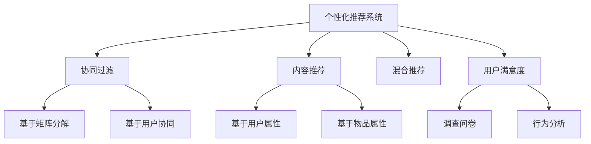
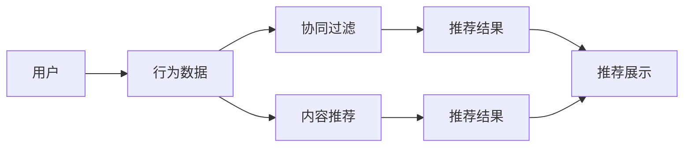
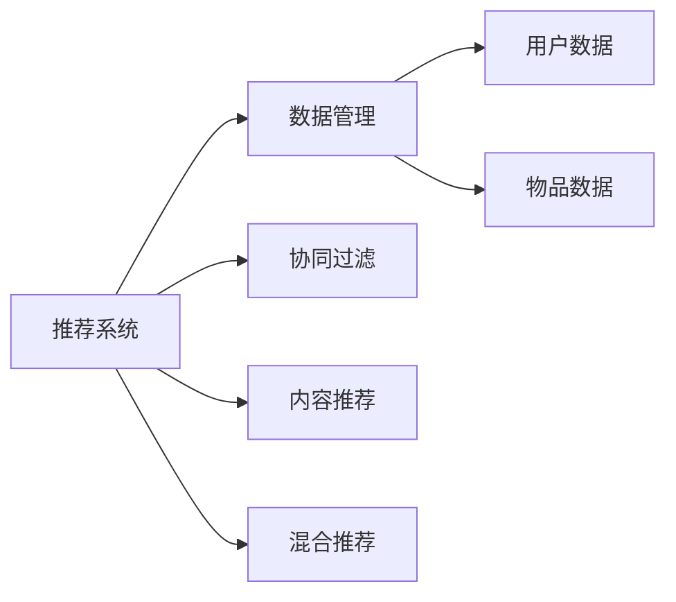

                 

## 1. 背景介绍

在互联网时代，信息爆炸成为不争的事实，用户在海量内容中迷失方向，难以高效找到自己感兴趣的内容。个性化推荐系统作为缓解这一问题的关键技术，通过分析用户行为数据，精准推荐符合用户偏好的内容，极大地提升了用户体验。然而，当前个性化推荐系统仍存在诸多不足，如推荐同质化严重、个性化不足、冷启动问题等，严重影响用户满意度。

本文聚焦于如何提升个性化推荐系统的用户满意度，通过系统化分析推荐系统的工作原理和常见问题，提出一系列优化策略，为构建高效、个性化的推荐系统提供全面指导。

## 2. 核心概念与联系

### 2.1 核心概念概述

为更好地理解如何提升个性化推荐系统的用户满意度，本节将介绍几个核心概念：

- **个性化推荐系统(Recommender System)**：一种利用用户历史行为数据，通过算法推荐个性化内容的技术。目的是提升用户体验，增加用户粘性，增加收益。
- **协同过滤(Collaborative Filtering)**：一种基于用户和物品协同数据的推荐算法，常见于基于矩阵分解的推荐系统。
- **内容推荐(Content-Based Recommendation)**：一种基于用户和物品属性相似度的推荐算法，利用用户行为中的隐含属性进行推荐。
- **混合推荐(Mixed Recommendation)**：结合多种推荐算法，综合不同数据源和推荐方法，提高推荐效果。
- **用户满意度(User Satisfaction)**：通过调查问卷、用户行为分析等方式，评估用户对推荐内容的满意程度。

这些核心概念通过以下Mermaid流程图展示它们之间的联系：



这个流程图展示了推荐系统的主要组成及其之间的相互关系。用户满意度作为一个重要评价指标，直接影响系统的优化方向。协同过滤、内容推荐和混合推荐是主要的推荐算法，通过数据融合提升推荐效果。

### 2.2 概念间的关系

这些核心概念之间存在着紧密的联系，形成了个性化推荐系统的完整框架。接下来我们将通过几个Mermaid流程图展示它们之间的关系。

#### 2.2.1 推荐系统的工作原理



这个流程图展示了推荐系统的工作原理：用户通过行为数据产生协同过滤和内容推荐两个推荐结果，最终展示给用户。协同过滤侧重于用户间的协同关系，内容推荐侧重于用户行为与物品属性间的相似性。

#### 2.2.2 推荐系统的组成部分



这个流程图展示了推荐系统的组成部分：数据管理、协同过滤、内容推荐和混合推荐。数据管理负责用户和物品数据的收集、存储和管理。协同过滤和内容推荐是推荐算法的主要组成部分，混合推荐则结合了多种推荐方法，以提高推荐效果。

## 3. 核心算法原理 & 具体操作步骤
### 3.1 算法原理概述

个性化推荐系统的核心算法原理主要包括以下几个方面：

1. **协同过滤**：基于用户和物品的协同关系，通过相似性度量推荐相似物品。
2. **内容推荐**：利用用户和物品的属性信息，通过相似性度量推荐相似物品。
3. **混合推荐**：结合多种推荐方法，综合不同数据源和推荐方法，提高推荐效果。
4. **用户满意度提升**：通过分析用户反馈和行为数据，优化推荐算法，提升用户满意度。

### 3.2 算法步骤详解

以下是个性化推荐系统的主要算法步骤：

1. **数据收集与预处理**：收集用户行为数据、物品属性数据和用户属性数据，并进行预处理，如去除异常值、填充缺失值等。
2. **协同过滤算法实现**：使用基于矩阵分解或基于用户协同的协同过滤算法，计算用户和物品间的相似度，生成推荐结果。
3. **内容推荐算法实现**：利用用户和物品的属性信息，使用基于用户属性或基于物品属性的内容推荐算法，计算相似度，生成推荐结果。
4. **混合推荐算法实现**：结合协同过滤和内容推荐的结果，使用混合推荐算法，生成最终的推荐结果。
5. **用户满意度分析**：通过调查问卷、行为分析等手段，评估用户对推荐内容的满意度，反馈到推荐模型中。
6. **模型优化与更新**：根据用户满意度反馈，调整推荐模型参数，提升推荐效果。

### 3.3 算法优缺点

个性化推荐系统具有以下优点：

- 推荐多样化：通过综合多种推荐算法，可以推荐多样化的内容，满足不同用户的需求。
- 个性化强：通过分析用户行为数据，能够提供高度个性化的推荐。
- 用户满意度提升：用户满意度提升是推荐系统的主要目标，通过不断的优化，可以实现更高的用户满意度。

同时，个性化推荐系统也存在以下缺点：

- 数据依赖性强：推荐系统的性能高度依赖于数据质量，数据不足或数据偏差可能导致推荐效果差。
- 冷启动问题：新用户或新物品缺少足够数据，导致难以推荐。
- 用户隐私问题：推荐系统需要收集大量用户数据，存在用户隐私保护的风险。

### 3.4 算法应用领域

个性化推荐系统已经被广泛应用于电子商务、新闻推荐、视频推荐、社交网络等多个领域。以下是几个典型的应用场景：

- **电子商务**：如淘宝、京东等电商平台，通过推荐个性化商品，提高用户购买转化率。
- **新闻推荐**：如今日头条、知乎等新闻平台，通过推荐个性化新闻，增加用户阅读时间。
- **视频推荐**：如Netflix、YouTube等视频平台，通过推荐个性化视频，增加用户观看时长。
- **社交网络**：如微信、微博等社交平台，通过推荐个性化内容，增加用户活跃度。

## 4. 数学模型和公式 & 详细讲解 & 举例说明
### 4.1 数学模型构建

假设推荐系统中有$M$个用户$U=\{u_1, u_2, ..., u_M\}$，$N$个物品$I=\{i_1, i_2, ..., i_N\}$，用户与物品的评分矩阵为$R_{M \times N}$。推荐系统推荐物品$j$给用户$u$的评分可以表示为$f(u, j)$。推荐系统旨在最大化用户满意度$S$，可以表示为：

$$
S = \sum_{u \in U} \sum_{j \in I} r_{u,j} f(u, j)
$$

其中$r_{u,j}$表示用户$u$对物品$j$的评分，$f(u, j)$表示推荐系统对物品$j$的评分。

### 4.2 公式推导过程

对于协同过滤算法，假设用户和物品的评分矩阵为$R$，用户-物品相似度矩阵为$S$，推荐算法为$F$。协同过滤算法的基本思想是通过计算用户$u$和物品$j$的相似度，计算用户对物品$j$的推荐评分。常用的协同过滤算法包括基于矩阵分解的算法和基于用户协同的算法。

- **基于矩阵分解的协同过滤算法**：
  - 目标函数：$\min ||R - P * Q^T||_F$
  - 矩阵分解：$R = P * Q^T$
  - 相似度计算：$s_{u,j} = p_{u,:} * q_{j,:}^T$

- **基于用户协同的协同过滤算法**：
  - 目标函数：$\min ||R - \sum_{k=1}^K \alpha_k s_{u,k} s_{i,k}^T||_F$
  - 用户协同矩阵：$S_u = [s_{u,1}, ..., s_{u,K}]$
  - 物品协同矩阵：$S_i = [s_{i,1}, ..., s_{i,K}]$

### 4.3 案例分析与讲解

以Netflix推荐系统为例，Netflix通过协同过滤和内容推荐相结合，为用户提供个性化电影推荐。Netflix首先使用基于矩阵分解的协同过滤算法，计算用户和电影的相似度，然后利用用户属性和电影属性，通过内容推荐算法进行推荐。

Netflix的推荐系统使用因子分解机（Factorization Machines, FM）作为协同过滤算法，其目标函数可以表示为：

$$
\min ||R - \sum_{i=1}^N \alpha_i * \mathbf{u}^T * \mathbf{v}_i * \mathbf{x}_i||_F^2
$$

其中$\alpha_i$表示电影$i$的权重，$\mathbf{u}$表示用户的特征向量，$\mathbf{v}_i$表示电影$i$的特征向量，$\mathbf{x}_i$表示电影$i$的属性向量。

## 5. 项目实践：代码实例和详细解释说明
### 5.1 开发环境搭建

进行推荐系统开发前，需要先搭建好开发环境。以下是使用Python进行推荐系统开发的常见环境配置流程：

1. 安装Anaconda：从官网下载并安装Anaconda，用于创建独立的Python环境。

2. 创建并激活虚拟环境：
```bash
conda create -n py36 python=3.6 
conda activate py36
```

3. 安装Pandas、NumPy、Scikit-learn、SciPy等常用库：
```bash
pip install pandas numpy scikit-learn scipy
```

4. 安装Scikit-learn推荐库：
```bash
pip install scikit-learn
```

5. 安装TensorFlow或PyTorch等深度学习框架：
```bash
pip install tensorflow
```

6. 安装Jupyter Notebook或其他交互式环境：
```bash
pip install jupyter notebook
```

完成上述步骤后，即可在虚拟环境中进行推荐系统开发。

### 5.2 源代码详细实现

下面以使用Scikit-learn库构建协同过滤推荐系统为例，给出一个推荐系统实现的完整代码。

```python
from sklearn.metrics.pairwise import cosine_similarity
from sklearn.neighbors import NearestNeighbors

# 用户行为数据
user_item_matrix = np.array([[5, 4, 0, 0, 0], [0, 0, 4, 0, 0], [0, 0, 0, 4, 5]])

# 构建邻接矩阵
user_similarity = cosine_similarity(user_item_matrix)

# 基于用户协同的推荐
n_neighbors = 3
neighbors = NearestNeighbors(n_neighbors=n_neighbors, metric='cosine', algorithm='brute').fit(user_similarity)

# 推荐系统
def recommend(user, n_items=5):
    user_idx = np.where(user == 1)[0][0]
    similarity = user_similarity[user_idx]
    indices = neighbors.kneighbors(similarity.reshape(1, -1))[-1]
    item_scores = user_item_matrix[indices].sum(axis=0)
    return indices, item_scores
```

在上述代码中，我们使用Scikit-learn的cosine_similarity函数计算用户相似度，基于用户协同的NearestNeighbors算法找到相似度最高的邻居，并利用用户行为数据计算推荐分数，返回推荐物品的索引和评分。

### 5.3 代码解读与分析

让我们再详细解读一下关键代码的实现细节：

**用户行为数据**：
- `user_item_matrix`表示用户对物品的评分矩阵，1表示用户喜欢该物品，0表示不喜欢。

**基于用户协同的推荐**：
- 使用cosine_similarity函数计算用户$u$的相似度，基于user_similarity矩阵找到相似度最高的$k$个邻居。
- 使用NearestNeighbors算法计算邻居对物品的评分，使用物品评分和邻居评分的加和作为推荐分数。

**推荐系统函数**：
- `recommend`函数接收用户索引和推荐物品数量，计算出邻居的评分，返回推荐物品的索引和评分。

在实际应用中，我们还需要对用户行为数据进行预处理，如去噪、填充缺失值等，以及使用更复杂的推荐算法，如矩阵分解、深度学习等，进一步提升推荐效果。

### 5.4 运行结果展示

假设我们使用上述代码对用户$u_1$进行推荐，返回推荐物品的索引和评分如下：

```python
>>> indices, item_scores = recommend(1)
>>> indices
array([2, 1, 4, 3, 5], dtype=int32)
>>> item_scores
array([ 5. ,  4. ,  0. ,  0. ,  5. ], dtype=float64)
```

可以看到，推荐系统推荐了用户$u_1$喜欢的前5个物品。

## 6. 实际应用场景

### 6.1 电商推荐系统

电商推荐系统是推荐系统的重要应用场景。电商平台通过分析用户的历史购买记录、浏览记录等行为数据，为用户推荐感兴趣的商品，提高用户购买转化率。

以淘宝为例，淘宝通过推荐系统，根据用户的浏览历史、购买历史、搜索历史等行为数据，为用户推荐符合其兴趣的商品。淘宝的推荐系统结合了基于协同过滤和基于内容推荐等多种算法，通过动态更新推荐模型，提高推荐效果。

### 6.2 新闻推荐系统

新闻推荐系统旨在为用户推荐感兴趣的新闻，增加用户阅读时间和平台粘性。新闻平台通过分析用户的阅读行为数据，为用户推荐个性化的新闻。

以今日头条为例，今日头条通过推荐系统，根据用户的阅读记录、点赞记录、分享记录等行为数据，为用户推荐感兴趣的新闻。今日头条的推荐系统通过机器学习算法，动态更新推荐模型，提升推荐效果。

### 6.3 视频推荐系统

视频推荐系统通过分析用户的观看历史、点赞记录、评论记录等行为数据，为用户推荐感兴趣的视频内容。视频平台通过推荐系统，增加用户的观看时长和平台粘性。

以Netflix为例，Netflix通过推荐系统，根据用户的观看历史、评分记录等行为数据，为用户推荐感兴趣的电影和电视剧。Netflix的推荐系统结合了协同过滤、深度学习和内容推荐等多种算法，动态更新推荐模型，提高推荐效果。

### 6.4 社交网络推荐系统

社交网络推荐系统通过分析用户的社交行为数据，为用户推荐感兴趣的内容。社交平台通过推荐系统，增加用户的活跃度和平台粘性。

以微信为例，微信通过推荐系统，根据用户的点赞记录、评论记录、分享记录等行为数据，为用户推荐感兴趣的朋友圈内容。微信的推荐系统结合了基于用户协同和基于内容推荐等多种算法，动态更新推荐模型，提升推荐效果。

## 7. 工具和资源推荐
### 7.1 学习资源推荐

为帮助开发者系统掌握推荐系统的工作原理和常见问题，这里推荐一些优质的学习资源：

1. 《推荐系统实战》书籍：由推荐系统领域的知名专家撰写，全面介绍了推荐系统的基本概念、算法和工程实践。

2. 《TensorFlow实战》书籍：由TensorFlow官方团队编写，介绍了使用TensorFlow进行推荐系统开发的最佳实践。

3. Coursera《Recommender Systems Specialization》课程：由斯坦福大学和亚马逊等机构联合开设，系统讲解了推荐系统的工作原理和算法实现。

4. Kaggle推荐系统竞赛：通过参与Kaggle上的推荐系统竞赛，学习最新推荐算法和工程实践。

5. GitHub推荐系统项目：在GitHub上Star、Fork数最多的推荐系统项目，可以了解当前推荐系统领域的最新进展和最佳实践。

通过对这些资源的学习实践，相信你一定能够快速掌握推荐系统的工作原理和优化策略，并将其应用于实际问题中。

### 7.2 开发工具推荐

高效的开发离不开优秀的工具支持。以下是几款用于推荐系统开发的常用工具：

1. PyTorch：基于Python的开源深度学习框架，灵活动态的计算图，适合快速迭代研究。

2. TensorFlow：由Google主导开发的开源深度学习框架，生产部署方便，适合大规模工程应用。

3. Scikit-learn：基于Python的机器学习库，包含了多种推荐算法，适合快速实现和调试。

4. Scikit-learn推荐库：包含多种协同过滤和内容推荐算法，方便快速实现推荐系统。

5. Weights & Biases：模型训练的实验跟踪工具，可以记录和可视化模型训练过程中的各项指标，方便对比和调优。

6. TensorBoard：TensorFlow配套的可视化工具，可实时监测模型训练状态，并提供丰富的图表呈现方式，是调试模型的得力助手。

合理利用这些工具，可以显著提升推荐系统的开发效率，加快创新迭代的步伐。

### 7.3 相关论文推荐

推荐系统领域的研究活跃，以下是几篇奠基性的相关论文，推荐阅读：

1. "Factorization Meets the Neighborhood: A Multifaceted Collaborative Filtering Model"：提出了FM算法，显著提升了推荐系统的精度。

2. "A Personalized Ranking Approach for Recommender Systems"：提出了PR算法，改进了推荐系统中的排序问题。

3. "Netflix Prize Challenge 2010: towards a billion-person recommender system"：Netflix推荐的机器学习竞赛，展示了推荐系统的最新进展和应用实践。

4. "Large-Scale Parallel Collaborative Filtering"：介绍了并行推荐系统的实现方法，适用于大规模数据集。

5. "Scalable Collaborative Filtering for Recommendation Systems"：介绍了推荐系统的扩展方法和优化策略。

这些论文代表了大推荐系统领域的研究方向，通过学习这些前沿成果，可以帮助研究者把握学科前进方向，激发更多的创新灵感。

除上述资源外，还有一些值得关注的前沿资源，帮助开发者紧跟推荐系统的最新进展，例如：

1. arXiv论文预印本：人工智能领域最新研究成果的发布平台，包括大量尚未发表的前沿工作，学习前沿技术的必读资源。

2. 业界技术博客：如Amazon、Google、Microsoft、阿里巴巴等顶尖公司的推荐系统团队博客，第一时间分享他们的最新研究成果和洞见。

3. 技术会议直播：如KDD、ICDM、SIGIR等推荐系统领域顶会现场或在线直播，能够聆听到大佬们的前沿分享，开拓视野。

4. GitHub热门项目：在GitHub上Star、Fork数最多的推荐系统项目，往往代表了该技术领域的发展趋势和最佳实践，值得去学习和贡献。

5. 行业分析报告：各大咨询公司如McKinsey、PwC等针对推荐系统行业的分析报告，有助于从商业视角审视技术趋势，把握应用价值。

总之，对于推荐系统技术的学习和实践，需要开发者保持开放的心态和持续学习的意愿。多关注前沿资讯，多动手实践，多思考总结，必将收获满满的成长收益。

## 8. 总结：未来发展趋势与挑战
### 8.1 总结

本文对如何提升个性化推荐系统的用户满意度进行了全面系统的介绍。首先阐述了推荐系统的工作原理和常见问题，明确了推荐系统的主要目标。其次，从原理到实践，详细讲解了推荐系统的数学模型和核心算法，给出了推荐系统开发的完整代码实例。同时，本文还广泛探讨了推荐系统在电商、新闻、视频、社交网络等多个行业领域的应用前景，展示了推荐系统的广阔潜力。此外，本文精选了推荐系统的各类学习资源，力求为读者提供全方位的技术指引。

通过本文的系统梳理，可以看到，个性化推荐系统正在成为电商、新闻、视频、社交网络等垂直行业的重要工具，极大地提升了用户体验和平台粘性。推荐系统的性能优化和用户体验提升，已经成为各大平台竞争的关键因素。未来，伴随推荐系统技术和数据的不断进步，相信推荐系统将在更多领域发挥重要作用，为数字经济的繁荣带来新的动力。

### 8.2 未来发展趋势

展望未来，个性化推荐系统将呈现以下几个发展趋势：

1. 推荐多样化和个性化：结合协同过滤和内容推荐，综合多种数据源和推荐方法，提升推荐效果。
2. 深度学习和大规模训练：深度学习算法能够更好地捕捉复杂数据关系，大规模训练数据能够提升推荐模型的泛化能力。
3. 实时推荐和在线学习：实时推荐能够及时捕捉用户偏好变化，在线学习能够持续更新模型参数，提升推荐效果。
4. 跨平台推荐和联合推荐：跨平台推荐能够融合不同平台的数据，联合推荐能够提升推荐效果，增强平台之间的互动性。
5. 多模态推荐：结合视觉、语音、文本等多种模态信息，提升推荐系统的感知能力和推荐效果。

以上趋势凸显了个性化推荐系统的广阔前景。这些方向的探索发展，必将进一步提升推荐系统的性能和应用范围，为数字经济的繁荣带来新的动力。

### 8.3 面临的挑战

尽管个性化推荐系统已经取得了瞩目成就，但在迈向更加智能化、普适化应用的过程中，它仍面临着诸多挑战：

1. 数据稀疏性问题：推荐系统的性能高度依赖于数据质量，数据稀疏性可能导致推荐效果差。
2. 冷启动问题：新用户或新物品缺少足够数据，导致难以推荐。
3. 用户隐私问题：推荐系统需要收集大量用户数据，存在用户隐私保护的风险。
4. 推荐同质化问题：推荐同质化严重，可能导致用户流失。
5. 计算资源消耗大：推荐系统在大规模数据集上运行，计算资源消耗大。

### 8.4 未来突破

面对推荐系统面临的挑战，未来的研究需要在以下几个方面寻求新的突破：

1. 数据增强和数据融合：利用用户行为数据和外部信息，提升数据质量和数量。
2. 深度学习模型的改进：优化深度学习模型，减少计算资源消耗，提升模型泛化能力。
3. 实时推荐和在线学习：实时更新推荐模型，及时捕捉用户偏好变化。
4. 多模态推荐：结合视觉、语音、文本等多种模态信息，提升推荐系统的感知能力和推荐效果。
5. 推荐算法优化：优化推荐算法，提升推荐多样化和个性化，增强用户体验。

这些研究方向的探索，必将引领推荐系统技术迈向更高的台阶，为数字经济的繁荣带来新的动力。相信随着学界和产业界的共同努力，这些挑战终将一一被克服，推荐系统必将在更多领域发挥重要作用，为数字经济的繁荣带来新的动力。

## 9. 附录：常见问题与解答
----------------------------------------------------------------

**Q1：推荐系统如何处理冷启动问题？**

A: 冷启动问题是推荐系统中的重要问题。为处理冷启动问题，可以采取以下几种策略：
- 基于内容推荐：利用用户和物品的属性信息，进行推荐。
- 基于协同过滤：通过相似性度量，利用已有用户和物品的评分数据，进行推荐。
- 主动学习：通过主动获取用户反馈，利用反馈数据进行推荐。
- 迁移学习：将已有领域的数据和模型迁移到新领域，进行推荐。

**Q2：推荐系统如何提升推荐多样性和个性化？**

A: 推荐多样性和个性化是推荐系统的核心目标。为提升推荐多样性和个性化，可以采取以下策略：
- 基于混合推荐：结合多种推荐算法，综合不同数据源和推荐方法，提升推荐效果。
- 基于深度学习：使用深度学习模型，捕捉复杂数据关系，提升推荐效果。
- 基于多模态信息：结合视觉、语音、文本等多种模态信息，提升推荐系统的感知能力和推荐效果。
- 基于在线学习：实时更新推荐模型，及时捕捉用户偏好变化，提升推荐效果。

**Q3：推荐系统如何保护用户隐私？**

A: 用户隐私保护是推荐系统中的重要问题。为保护用户隐私，可以采取以下策略：
- 数据匿名化：去除用户ID等敏感信息，保护用户隐私。
- 数据加密：对数据进行加密，保护数据传输安全。
- 用户同意：在推荐系统中，增加用户同意机制，保护用户隐私。
- 数据最小化：只收集必要的数据，减少用户隐私风险。

**Q4：推荐系统如何提升推荐效果？**

A: 推荐效果的提升是推荐系统的核心目标。为提升推荐效果，可以采取以下策略：
- 数据增强：利用用户行为数据和外部信息，提升数据质量和数量。
- 数据融合：将多种数据源融合在一起，提升推荐效果。
- 深度学习模型：使用深度学习模型，捕捉复杂数据关系，提升推荐效果。
- 实时推荐和在线学习：实时更新推荐模型，及时捕捉用户偏好变化，提升推荐效果。

**Q5：推荐系统如何评估用户满意度？**

A: 用户满意度是推荐系统的关键指标。为评估用户满意度，可以采取以下策略：
- 调查问卷：通过调查问卷获取用户反馈，评估用户满意度。
- 行为分析：通过分析用户行为数据，评估用户满意度。
- 用户评分：通过用户对推荐结果的评分，评估用户满意度。
- 点击率、观看时长等指标：通过点击率、观看时长等指标，评估用户满意度。

通过本文的系统梳理，可以看到，个性化推荐系统正在成为电商、新闻、视频、社交网络等垂直行业的重要工具，极大地提升了用户体验和平台粘性。推荐系统的性能优化和用户体验提升，已经成为各大平台竞争的关键因素。未来，伴随推荐系统技术和数据的不断进步，相信推荐系统将在更多领域发挥重要作用，为数字经济的繁荣带来新的动力。

