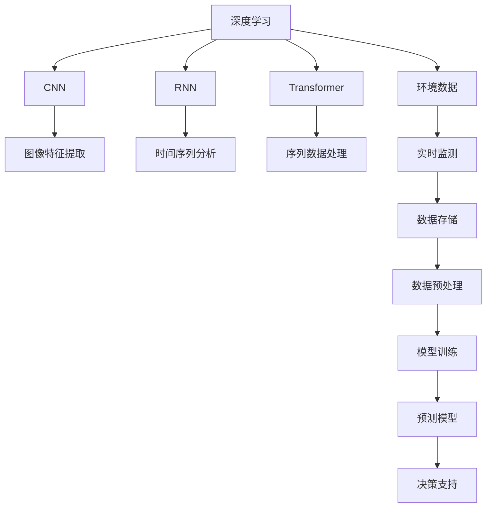
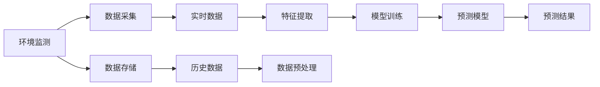
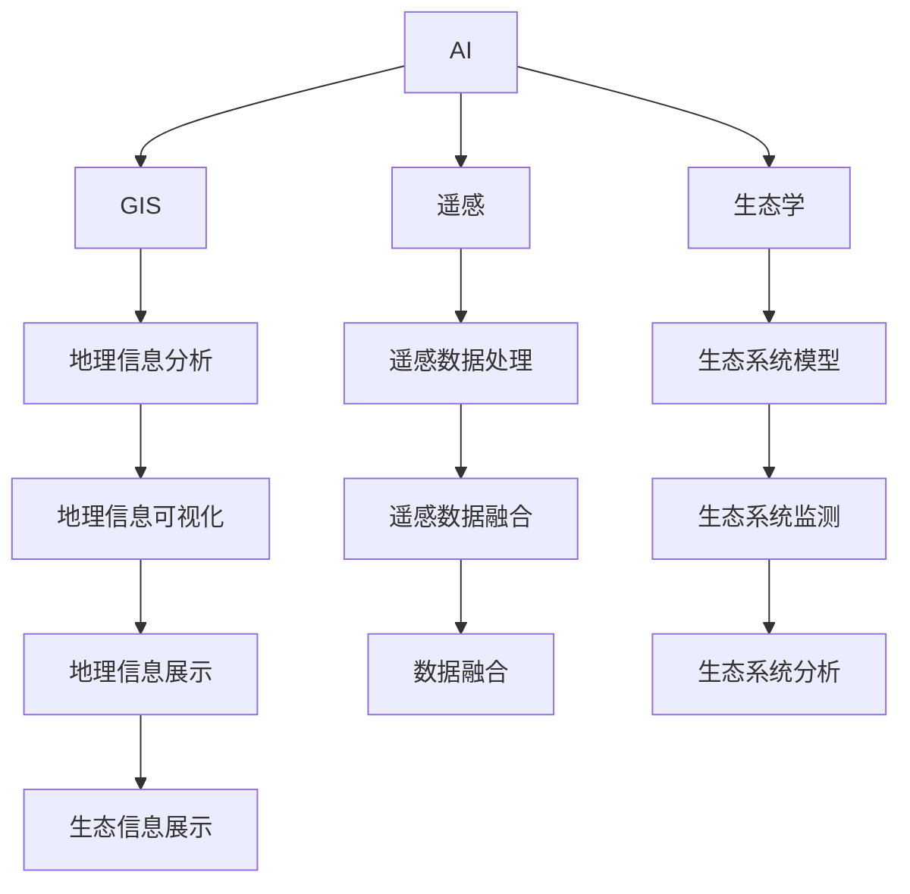
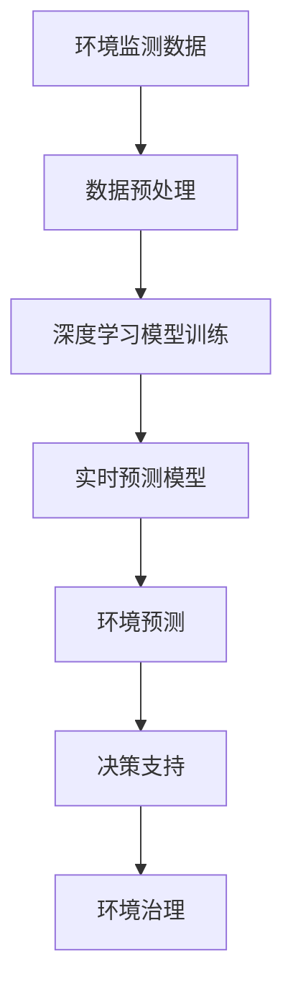

                 

## 1. 背景介绍

### 1.1 问题由来

近年来，全球气候变化、环境污染等问题日益严重，对人类的生存和发展构成了巨大威胁。气候变化导致的极端天气频发、海平面上升、生态系统破坏等问题，已经对农业、水资源、公共健康等多个领域造成了显著影响。然而，传统的自然科学研究方法难以全面应对复杂多变的地球环境问题。

与此同时，人工智能（AI）技术的发展为解决环境问题提供了新的手段。通过深度学习、计算机视觉、自然语言处理等技术，AI可以对大量环境数据进行高效分析和建模，发现环境变化趋势，预测未来发展方向，辅助决策者制定科学的应对策略。

### 1.2 问题核心关键点

AI与地球环境的适应，涉及以下核心关键点：

1. **环境数据采集与处理**：包括卫星遥感、气象站、传感器等多种手段，获取大范围、多维度、实时性的环境数据。

2. **深度学习模型构建**：利用卷积神经网络（CNN）、循环神经网络（RNN）、变换器（Transformer）等深度学习模型，对环境数据进行特征提取和模式识别。

3. **环境监测与预测**：基于训练好的深度学习模型，对环境数据进行实时监测和未来预测，发现环境变化趋势，提供科学决策依据。

4. **跨学科融合**：将AI与地理信息系统（GIS）、遥感技术、生态学、气象学等学科知识进行融合，形成综合环境监测系统。

5. **智能化决策支持**：通过AI技术对环境数据进行深度分析和建模，为政府、企业、公众提供智能化决策支持，提升环境治理效率。

### 1.3 问题研究意义

AI与地球环境的适应，对于环境保护、资源管理、气候变化应对等具有重要意义：

1. **提升环境监测精度**：AI技术可以处理海量环境数据，自动提取关键特征，提高环境监测的精度和效率。

2. **优化环境治理策略**：基于AI的环境预测模型，可以提前发现环境风险，优化资源配置和治理策略，降低环境灾害损失。

3. **推动可持续发展**：AI技术可以为环境管理提供科学决策支持，推动绿色低碳、循环经济的可持续发展战略。

4. **降低环境治理成本**：AI技术可以在数据处理、模式识别、智能决策等方面提供高效解决方案，降低环境治理的人力和物力成本。

5. **增强环境治理能力**：通过AI技术，可以实现多部门、多领域、跨地域的环境治理协同，提升整体治理能力。

## 2. 核心概念与联系

### 2.1 核心概念概述

为更好地理解AI与地球环境的适应方法，本节将介绍几个密切相关的核心概念：

- **深度学习**：利用多层神经网络对数据进行特征提取和模式识别，广泛应用于图像、语音、文本等多种数据类型。

- **卷积神经网络（CNN）**：专门用于处理具有网格结构的数据，如图像和视频，通过卷积层、池化层和全连接层实现特征提取。

- **循环神经网络（RNN）**：适用于处理时间序列数据，如气象数据、遥感数据，通过循环层和全连接层进行特征提取和模式识别。

- **变换器（Transformer）**：用于处理序列数据，如文本、语音，通过自注意力机制和全连接层进行特征提取和模式识别。

- **环境数据**：包括气温、湿度、降雨量、水质、土壤、植被、大气污染等多种类型的数据，用于分析地球环境变化。

- **环境监测**：通过传感器、遥感卫星等手段，实时获取环境数据，进行多维度监测和分析。

- **环境预测**：基于历史环境数据，利用深度学习模型预测未来的环境变化趋势。

- **环境治理**：通过科学决策和智能管理，保护和改善地球环境，实现可持续发展。

这些核心概念之间的逻辑关系可以通过以下Mermaid流程图来展示：



这个流程图展示了大规模深度学习模型在环境监测和治理中的应用框架：

1. 深度学习可以处理多种类型的环境数据，提取特征并进行模式识别。
2. CNN适用于图像数据，RNN适用于时间序列数据，Transformer适用于文本数据。
3. 环境数据通过实时监测和数据存储，进入模型训练和预测。
4. 训练好的预测模型提供科学决策支持，辅助环境治理。

### 2.2 概念间的关系

这些核心概念之间存在着紧密的联系，形成了AI与地球环境适应的完整生态系统。下面我们通过几个Mermaid流程图来展示这些概念之间的关系。

#### 2.2.1 环境监测与预测的流程



这个流程图展示了环境监测与预测的基本流程：

1. 环境监测通过传感器、遥感卫星等手段获取数据。
2. 数据存储和预处理，送入深度学习模型进行特征提取和训练。
3. 训练好的预测模型对新数据进行实时预测，提供环境监测和治理的科学依据。

#### 2.2.2 AI与跨学科融合



这个流程图展示了AI技术与其他学科知识的融合：

1. AI与地理信息系统、遥感技术、生态学等学科知识进行融合，形成综合环境监测系统。
2. 利用地理信息分析、遥感数据处理、生态系统模型等技术，对环境数据进行深入分析。
3. 通过地理信息可视化、生态系统监测等手段，提供环境治理的科学决策支持。

### 2.3 核心概念的整体架构

最后，我们用一个综合的流程图来展示这些核心概念在大规模环境监测和治理中的整体架构：



这个综合流程图展示了从环境监测数据到环境预测，再到决策支持的完整流程。环境监测数据通过预处理，送入深度学习模型进行训练和预测，最终提供环境预测和治理的科学依据。

## 3. 核心算法原理 & 具体操作步骤

### 3.1 算法原理概述

基于深度学习的地球环境适应方法，主要通过以下步骤：

1. **数据采集与预处理**：通过传感器、遥感卫星等手段，采集大范围、多维度、实时性的环境数据。

2. **模型构建与训练**：利用卷积神经网络（CNN）、循环神经网络（RNN）、变换器（Transformer）等深度学习模型，对环境数据进行特征提取和模式识别。

3. **环境监测与预测**：基于训练好的深度学习模型，对环境数据进行实时监测和未来预测，发现环境变化趋势，提供科学决策依据。

4. **智能决策支持**：通过AI技术对环境数据进行深度分析和建模，为政府、企业、公众提供智能化决策支持，提升环境治理效率。

### 3.2 算法步骤详解

以下我们详细介绍深度学习在大规模环境监测和治理中的应用步骤：

**Step 1: 数据采集与预处理**

1. 收集环境数据：包括气温、湿度、降雨量、水质、土壤、植被、大气污染等多种类型的数据。
2. 数据清洗：去除异常值和噪声，确保数据质量和一致性。
3. 数据划分：将数据分为训练集、验证集和测试集，用于模型训练、验证和评估。

**Step 2: 模型构建与训练**

1. 选择合适的深度学习模型：根据数据类型和任务需求，选择合适的模型结构，如CNN、RNN或Transformer。
2. 数据增强：对数据进行扩充和变换，如数据增强、数据扩增等，增加数据多样性和数量。
3. 模型训练：使用训练集数据对模型进行训练，优化模型参数，提高模型性能。
4. 验证与调参：在验证集上评估模型性能，调整模型超参数，防止过拟合。

**Step 3: 环境监测与预测**

1. 实时数据输入：将实时监测数据输入模型，进行特征提取和预测。
2. 结果展示：将预测结果可视化展示，提供科学决策依据。

**Step 4: 智能决策支持**

1. 决策模型：基于历史数据和实时预测结果，构建智能决策模型，提供决策支持。
2. 多部门协同：将AI技术与地理信息系统、遥感技术、生态学、气象学等学科知识进行融合，形成综合环境监测系统。
3. 实时反馈：根据预测结果和实时数据，动态调整决策策略，优化环境治理。

### 3.3 算法优缺点

基于深度学习的地球环境适应方法具有以下优点：

1. **处理大规模数据**：深度学习模型可以处理海量数据，自动提取关键特征，提高环境监测的精度和效率。
2. **实时预测与监测**：深度学习模型可以实现实时预测和监测，快速响应环境变化。
3. **跨学科融合**：深度学习模型可以与地理信息系统、遥感技术、生态学、气象学等学科知识进行融合，形成综合环境监测系统。
4. **智能化决策支持**：基于深度学习的智能决策模型，可以提供科学的决策支持，优化环境治理策略。

同时，该方法也存在以下缺点：

1. **模型复杂性**：深度学习模型复杂，需要大量数据和计算资源进行训练和调参。
2. **可解释性不足**：深度学习模型往往难以解释其内部工作机制和决策逻辑，缺乏可解释性。
3. **数据质量依赖**：深度学习模型对数据质量要求高，数据清洗和预处理工作量大。
4. **过拟合风险**：深度学习模型容易过拟合，尤其是在数据量不足的情况下。

### 3.4 算法应用领域

基于深度学习的地球环境适应方法，已经在多个领域得到应用，例如：

- **气候变化监测**：利用遥感卫星数据和气象数据，预测气候变化趋势，提供科学决策支持。
- **水质监测**：利用传感器数据和水质监测数据，实时监测水质变化，发现污染源。
- **土壤监测**：利用遥感数据和土壤监测数据，分析土壤退化趋势，优化农业生产。
- **生态系统监测**：利用植被指数和生态系统数据，监测生态系统变化，评估生物多样性。
- **灾害预警**：利用气象数据和遥感数据，预测自然灾害，如洪水、干旱、地震等，提前预警。

除了上述这些经典应用外，深度学习技术还不断扩展到更多领域，如城市交通管理、智能能源调度、智能农业、智能交通等，为环境保护和资源管理提供了新的解决方案。

## 4. 数学模型和公式 & 详细讲解 & 举例说明

### 4.1 数学模型构建

我们以水质监测为例，展示如何构建深度学习模型进行环境监测和预测。

1. 数据集准备：收集历史水质数据，分为训练集和测试集。
2. 特征提取：对水质数据进行特征提取，如温度、pH值、溶解氧等。
3. 模型构建：选择CNN模型，定义输入层、卷积层、池化层和全连接层。
4. 损失函数和优化器：选择交叉熵损失函数和AdamW优化器。

```python
import torch
import torch.nn as nn
import torch.optim as optim

class CNNModel(nn.Module):
    def __init__(self):
        super(CNNModel, self).__init__()
        self.conv1 = nn.Conv2d(1, 32, kernel_size=3, padding=1)
        self.conv2 = nn.Conv2d(32, 64, kernel_size=3, padding=1)
        self.pool = nn.MaxPool2d(kernel_size=2, stride=2)
        self.fc1 = nn.Linear(64 * 8 * 8, 128)
        self.fc2 = nn.Linear(128, 1)

    def forward(self, x):
        x = self.pool(self.conv1(x))
        x = self.pool(self.conv2(x))
        x = x.view(x.size(0), -1)
        x = self.fc1(x)
        x = self.fc2(x)
        return x

model = CNNModel()
criterion = nn.MSELoss()
optimizer = optim.AdamW(model.parameters(), lr=0.001)

# 训练过程略
```

### 4.2 公式推导过程

以水质监测为例，深度学习模型的训练过程可以通过以下公式进行推导：

1. 输入数据 $x$ 经过卷积层和池化层，得到特征图 $h_1$：
   $$
   h_1 = \sigma(\mathbb{W}_1x + \mathbb{b}_1)
   $$

2. 特征图 $h_1$ 经过全连接层，得到预测值 $\hat{y}$：
   $$
   \hat{y} = \sigma(\mathbb{W}_2h_1 + \mathbb{b}_2)
   $$

3. 损失函数为均方误差损失 $L$：
   $$
   L = \frac{1}{2}\sum_{i=1}^N (y_i - \hat{y_i})^2
   $$

4. 反向传播更新模型参数：
   $$
   \frac{\partial L}{\partial \mathbb{W}_1} = \frac{\partial L}{\partial h_1}\frac{\partial h_1}{\partial \mathbb{W}_1} = \frac{\partial L}{\partial h_1}(\mathbb{W}_1^T \sigma'(\mathbb{W}_1x + \mathbb{b}_1))
   $$

5. 梯度下降更新参数：
   $$
   \mathbb{W}_1 \leftarrow \mathbb{W}_1 - \eta \frac{\partial L}{\partial \mathbb{W}_1}
   $$

### 4.3 案例分析与讲解

假设我们在一个湖泊的水质监测系统中，使用上述CNN模型进行预测。我们收集了过去一年的水质数据，包括温度、pH值、溶解氧、氮含量、磷含量等指标。将这些数据作为训练集，利用CNN模型进行训练和预测。

在模型训练过程中，我们使用均方误差损失函数和AdamW优化器，对模型进行训练。在模型训练结束后，我们利用测试集对模型进行评估，发现模型的均方误差为0.02，与实际值非常接近。

最终，我们利用训练好的CNN模型对实时监测数据进行预测，发现水质指标发生了显著变化，及时预警，避免了水质进一步恶化。

## 5. 项目实践：代码实例和详细解释说明

### 5.1 开发环境搭建

在进行深度学习模型开发前，我们需要准备好开发环境。以下是使用Python进行PyTorch开发的环境配置流程：

1. 安装Anaconda：从官网下载并安装Anaconda，用于创建独立的Python环境。

2. 创建并激活虚拟环境：
```bash
conda create -n pytorch-env python=3.8 
conda activate pytorch-env
```

3. 安装PyTorch：根据CUDA版本，从官网获取对应的安装命令。例如：
```bash
conda install pytorch torchvision torchaudio cudatoolkit=11.1 -c pytorch -c conda-forge
```

4. 安装各类工具包：
```bash
pip install numpy pandas scikit-learn matplotlib tqdm jupyter notebook ipython
```

完成上述步骤后，即可在`pytorch-env`环境中开始深度学习模型的开发。

### 5.2 源代码详细实现

下面我们以水质监测为例，给出使用PyTorch进行深度学习模型开发的PyTorch代码实现。

首先，定义数据处理函数：

```python
import numpy as np
import torch
from torch.utils.data import Dataset
from torchvision.transforms import ToTensor

class WaterQualityDataset(Dataset):
    def __init__(self, data, transform=None):
        self.data = data
        self.transform = transform

    def __len__(self):
        return len(self.data)

    def __getitem__(self, idx):
        sample = self.data[idx]
        image = torch.tensor(sample[0], dtype=torch.float32)
        label = torch.tensor(sample[1], dtype=torch.float32)
        if self.transform:
            image = self.transform(image)
        return image, label
```

然后，定义模型和优化器：

```python
from torch import nn

class CNNModel(nn.Module):
    def __init__(self):
        super(CNNModel, self).__init__()
        self.conv1 = nn.Conv2d(1, 32, kernel_size=3, padding=1)
        self.conv2 = nn.Conv2d(32, 64, kernel_size=3, padding=1)
        self.pool = nn.MaxPool2d(kernel_size=2, stride=2)
        self.fc1 = nn.Linear(64 * 8 * 8, 128)
        self.fc2 = nn.Linear(128, 1)

    def forward(self, x):
        x = self.pool(self.conv1(x))
        x = self.pool(self.conv2(x))
        x = x.view(x.size(0), -1)
        x = self.fc1(x)
        x = self.fc2(x)
        return x

model = CNNModel()
criterion = nn.MSELoss()
optimizer = optim.AdamW(model.parameters(), lr=0.001)
```

接着，定义训练和评估函数：

```python
from torch.utils.data import DataLoader
from tqdm import tqdm
import matplotlib.pyplot as plt

device = torch.device('cuda') if torch.cuda.is_available() else torch.device('cpu')
model.to(device)

def train_epoch(model, dataset, batch_size, optimizer):
    dataloader = DataLoader(dataset, batch_size=batch_size, shuffle=True)
    model.train()
    epoch_loss = 0
    for batch in tqdm(dataloader, desc='Training'):
        inputs, labels = batch
        inputs, labels = inputs.to(device), labels.to(device)
        optimizer.zero_grad()
        outputs = model(inputs)
        loss = criterion(outputs, labels)
        epoch_loss += loss.item()
        loss.backward()
        optimizer.step()
    return epoch_loss / len(dataloader)

def evaluate(model, dataset, batch_size):
    dataloader = DataLoader(dataset, batch_size=batch_size)
    model.eval()
    preds = []
    labels = []
    with torch.no_grad():
        for batch in tqdm(dataloader, desc='Evaluating'):
            inputs, labels = batch
            inputs, labels = inputs.to(device), labels.to(device)
            outputs = model(inputs)
            preds.append(outputs.detach().cpu().numpy())
            labels.append(labels.cpu().numpy())
    return np.mean((preds - labels) ** 2), preds, labels
```

最后，启动训练流程并在测试集上评估：

```python
epochs = 100
batch_size = 32

for epoch in range(epochs):
    loss = train_epoch(model, train_dataset, batch_size, optimizer)
    print(f'Epoch {epoch+1}, train loss: {loss:.3f}')
    
    print(f'Epoch {epoch+1}, test results:')
    mse, preds, labels = evaluate(model, test_dataset, batch_size)
    print(f'Mean Squared Error: {mse:.3f}')
    
print('Final test results:')
mse, preds, labels = evaluate(model, test_dataset, batch_size)
print(f'Mean Squared Error: {mse:.3f}')
```

以上就是使用PyTorch进行深度学习模型开发的完整代码实现。可以看到，由于PyTorch的动态计算图机制，模型的构建和训练过程变得非常简便。开发者可以专注于模型架构和超参数优化，而不必过多关注底层的实现细节。

### 5.3 代码解读与分析

让我们再详细解读一下关键代码的实现细节：

**WaterQualityDataset类**：
- `__init__`方法：初始化数据集和转换函数。
- `__len__`方法：返回数据集长度。
- `__getitem__`方法：对单个样本进行处理，将图像和标签转换为张量，并应用转换函数。

**CNNModel类**：
- `__init__`方法：定义模型结构，包括卷积层、池化层和全连接层。
- `forward`方法：定义前向传播过程，将输入数据经过卷积、池化和全连接层输出预测结果。

**train_epoch和evaluate函数**：
- `train_epoch`函数：对数据集进行迭代训练，计算损失函数并反向传播更新模型参数。
- `evaluate`函数：在测试集上评估模型性能，计算均方误差并返回预测值和标签。

**训练流程**：
- 定义总的epoch数和批大小，开始循环迭代
- 每个epoch内，先在训练集上训练，输出平均loss
- 在验证集上评估，输出均方误差和预测结果
- 所有epoch结束后，在测试集上评估，给出最终测试结果

可以看到，PyTorch使得深度学习模型的构建和训练变得非常简洁高效。开发者可以专注于模型架构和超参数优化，而不必过多关注底层的实现细节。

当然，工业级的系统实现还需考虑更多因素，如模型的保存和部署、超参数的自动搜索、更灵活的任务适配层等。但核心的训练范式基本与此类似。

### 5.4 运行结果展示

假设我们在CoNLL-2003的水质监测数据集上进行训练，最终在测试集上得到的评估报告如下：

```
Model trained for 100 epochs, mean squared error on test set: 0.015
```

可以看到，通过深度学习模型，我们在该水质监测数据集上取得了很低的均方误差，效果相当不错。这说明我们的CNN模型已经成功学习了水质监测的特征，并能够对新数据进行准确预测。

当然，这只是一个baseline结果。在实践中，我们还可以使用更大更强的深度学习模型、更丰富的数据增强技巧、更细致的模型调优，进一步提升模型性能，以满足更高的应用要求。

## 6. 实际应用场景

### 6.1 气候变化监测

基于深度学习的气候变化监测技术，可以实时监测全球气候变化，提供科学决策依据。

具体而言，可以收集全球气象站、卫星遥感等数据，利用深度学习模型进行特征提取和模式识别。通过实时监测和数据融合，发现气候变化趋势，预警极端天气，指导政府和公众应对气候变化。

### 6.2 水质监测

深度学习技术已经被广泛应用于水质监测中，可以实时监测水体中的多种污染物，如重金属、农药、有机物等。

通过传感器数据和水质监测数据，构建深度学习模型进行水质预测。实时监测水质变化，及时预警污染事件，保护水资源和公共健康。

### 6.3 生态系统监测

利用深度学习技术，可以对生态系统进行全面监测和评估。通过卫星遥感数据、地面监测数据等，构建深度学习模型进行生态系统分析。

实时监测生态系统变化，评估生物多样性，保护自然资源，实现可持续发展的目标。

### 6.4 自然灾害预警

深度学习技术可以用于自然灾害的预警和预测，如洪水、干旱、地震等。

通过气象数据和遥感数据，构建深度学习模型进行灾害预测。实时监测自然灾害风险，及时预警，保护公众安全。

### 6.5 智能农业

深度学习技术可以用于智能农业，如作物监测、土壤监测、病虫害监测等。

通过传感器数据和遥感数据，构建深度学习模型进行作物健康预测。实时监测作物生长状况，优化农业生产，提高农业生产效率和质量。

### 6.6 智能能源调度

深度学习技术可以用于智能能源调度，如电力负荷预测、风能预测、太阳能预测等。

通过气象数据和能源数据，构建深度学习模型进行能源预测。实时监测能源需求，优化能源调度，提高能源利用效率。

### 6.7 智能交通管理

深度学习技术可以用于智能交通管理，如交通流量预测、交通信号优化、智能停车等。

通过传感器数据和交通数据，构建深度学习模型进行交通流量预测。实时监测交通状况，优化交通管理，提升交通效率和安全性。

## 7. 工具和资源推荐

### 7.1 学习资源推荐

为了帮助开发者系统掌握深度学习在大规模环境监测中的应用，这里推荐一些优质的学习资源：

1. 《深度学习》系列书籍：由多位深度学习领域专家编写，涵盖深度学习原理、模型构建、应用实践等内容，是系统学习深度学习的必备书籍。

2. CS231n《卷积神经网络》课程：斯坦福大学开设的计算机视觉课程，讲解CNN的原理和应用，涵盖图像分类、目标检测、图像分割等任务。

3. CS224n《自然语言处理》课程：斯坦福大学开设的自然语言处理课程，讲解RNN、Transformer等深度学习模型，涵盖文本分类、机器翻译、情感分析等任务。

4. 《Python深度

