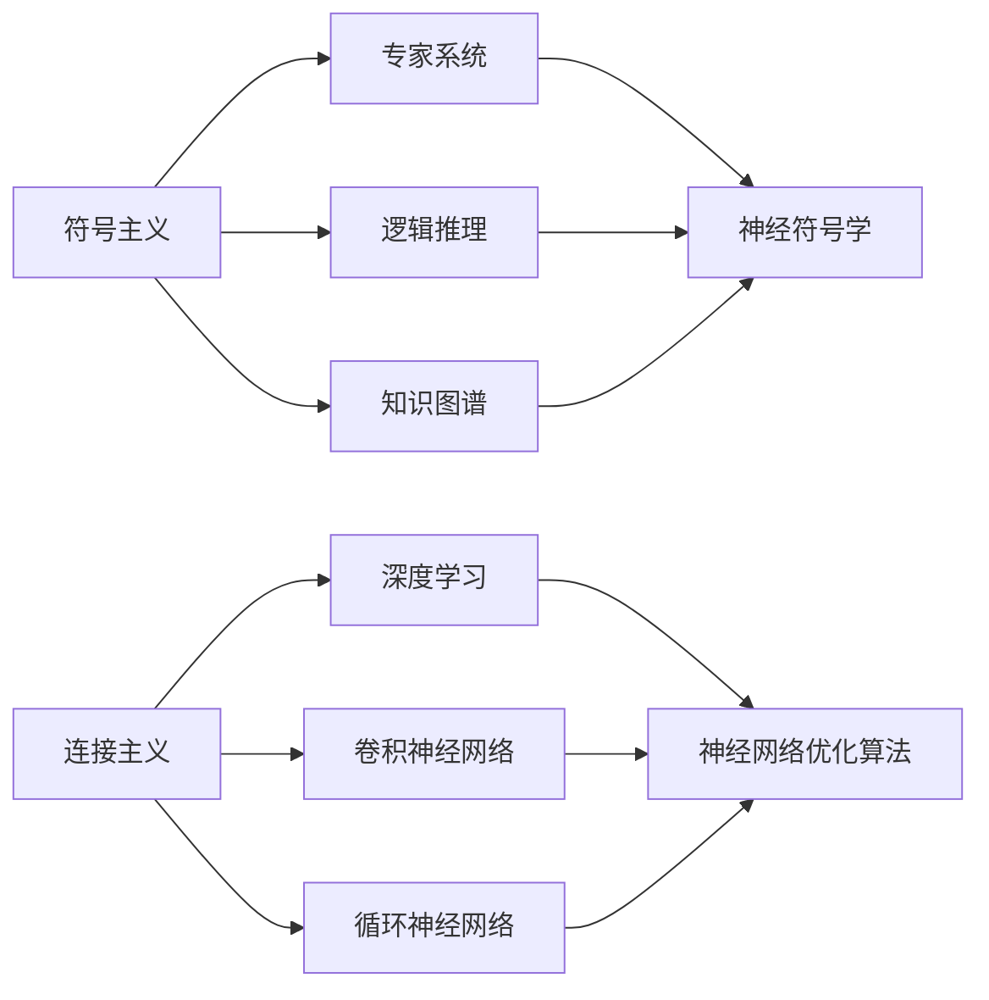
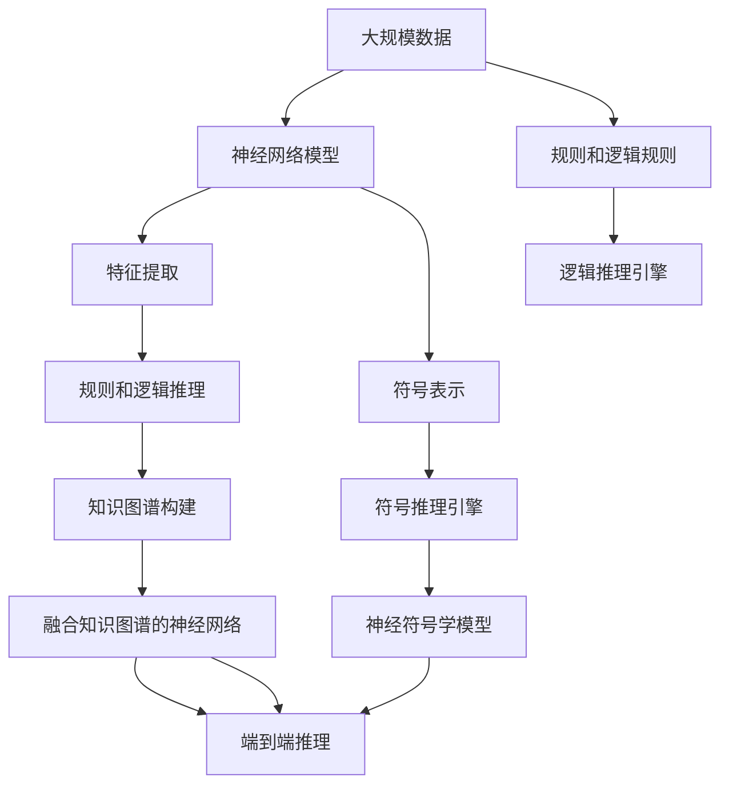

                 

# 人工智能两大流派的形成

## 1. 背景介绍

### 1.1 问题由来
人工智能（Artificial Intelligence，AI）领域自诞生以来，经历了多次技术和思想的演进，形成了两大主要流派：符号主义（Symbolic AI）和连接主义（Connectionist AI）。符号主义强调知识的显式表示和逻辑推理，连接主义则关注神经网络模型的学习和拟合。本文将详细介绍两大流派的形成背景、核心概念及应用实践，探讨它们对人工智能发展的深远影响。

### 1.2 问题核心关键点
两大流派的形成，源于对人工智能理解和实现路径的不同思考。符号主义基于逻辑和规则，强调知识表示和推理；连接主义则基于数据驱动的模型学习，关注网络的计算能力和自适应性。两者的差异在多个层面体现，包括：

1. **知识表示方式**：符号主义使用符号和规则表示知识，而连接主义通过网络权值和学习算法表达知识。
2. **推理机制**：符号主义依赖于规则的推理引擎，而连接主义通过模型内部计算机制推导结果。
3. **泛化能力**：符号主义通常假设数据与规则完美匹配，泛化能力强；连接主义则能在噪声和不确定性下表现良好。
4. **应用场景**：符号主义适合于知识结构清晰、规则明确的领域；连接主义则在处理大量未知数据、复杂模式识别方面有优势。

### 1.3 问题研究意义
了解两大流派的形成背景和发展历程，有助于我们更全面地理解人工智能的基本框架和应用方法，为未来的研究和实践提供借鉴。符号主义和连接主义的融合与演变，是人工智能发展的关键线索，揭示了从专家系统到深度学习的技术迭代路径。

## 2. 核心概念与联系

### 2.1 核心概念概述

- **符号主义（Symbolic AI）**：以逻辑和规则为基础，通过显式知识表示和推理引擎实现人工智能。符号主义的核心技术包括专家系统、逻辑推理、知识图谱等。其代表工作有纽森（Neuro-symbolic）、连接主义与符号主义的结合等。

- **连接主义（Connectionist AI）**：以神经网络模型为核心，通过大规模数据训练和学习算法实现人工智能。连接主义的核心技术包括深度学习、卷积神经网络（CNN）、循环神经网络（RNN）等。其代表工作有深度学习框架（如TensorFlow、PyTorch）、神经网络优化算法等。

### 2.2 核心概念间的联系

两大流派虽然出发点不同，但在实际应用中不断融合。例如，逻辑推理与深度学习结合的神经符号学（Neuro-symbolic）、知识图谱与深度学习的融合等，展示了符号主义和连接主义的交叉与互补。以下通过两个Mermaid流程图展示它们之间的关系：



### 2.3 核心概念的整体架构

两大流派的结合构成了现代人工智能的基石。以下是一个综合的流程图，展示符号主义和连接主义在大规模数据和复杂任务中的交互和协作：



## 3. 核心算法原理 & 具体操作步骤

### 3.1 算法原理概述

符号主义的核心算法包括专家系统、逻辑推理、知识图谱等，而连接主义的核心算法是神经网络模型。

- **专家系统**：基于规则和知识库，通过正向推理和反向推理实现决策。
- **逻辑推理**：利用逻辑代数，进行规则的组合和推导，解决诸如推理、规划、诊断等复杂问题。
- **知识图谱**：构建符号化的知识结构，通过逻辑推理和实体关系抽取，实现知识的高效查询和融合。

- **神经网络模型**：通过前向传播和反向传播算法，调整网络权重以拟合训练数据。常见的神经网络包括前馈神经网络、卷积神经网络、循环神经网络等。

### 3.2 算法步骤详解

#### 3.2.1 专家系统

1. **知识获取**：通过专家或领域专家的经验，收集并整理知识库。
2. **知识表示**：将知识库转换为规则或符号表示，存储在知识库中。
3. **推理引擎**：根据输入条件，正向推理和反向推理，得出决策结果。

#### 3.2.2 逻辑推理

1. **知识表示**：使用符号化的方式表示知识，如谓词、变量、规则等。
2. **推理算法**：运用逻辑代数，进行推理求解，如一阶逻辑推理、谓词逻辑推理等。
3. **推理引擎**：实现推理引擎，根据输入条件，推理并输出结果。

#### 3.2.3 知识图谱

1. **实体抽取**：从文本或数据库中抽取实体，构建实体关系图。
2. **关系表示**：定义实体间的关系，构建知识图谱。
3. **推理融合**：通过图谱查询和融合，进行复杂的知识推理。

#### 3.2.4 神经网络模型

1. **模型构建**：定义神经网络的结构，包括输入层、隐藏层、输出层等。
2. **数据准备**：准备训练数据，进行数据预处理。
3. **训练过程**：使用反向传播算法，调整网络权重，最小化损失函数。
4. **预测输出**：使用训练好的模型，进行前向传播，输出预测结果。

### 3.3 算法优缺点

#### 符号主义的优缺点

**优点**：
- 显式知识表示，易于理解和解释。
- 逻辑推理严谨，适用于知识结构明确的任务。

**缺点**：
- 依赖知识库的完备性，知识获取成本高。
- 推理复杂度随规则数量增加呈指数级增长，难以处理大规模复杂问题。
- 难以处理噪声和不确定性。

#### 连接主义的优缺点

**优点**：
- 数据驱动，自适应性强，适用于处理未知数据。
- 深度学习模型具有强大的泛化能力，处理大规模数据表现良好。

**缺点**：
- 模型复杂度高，训练过程耗时。
- 模型“黑盒”特性，难以解释内部工作机制。
- 对数据质量依赖高，存在过拟合风险。

### 3.4 算法应用领域

符号主义和连接主义在各自擅长的领域内均有广泛应用。

**符号主义的典型应用**：
- 医疗诊断：通过专家系统和逻辑推理，辅助医生诊断。
- 金融分析：构建知识图谱，进行风险评估和投资策略优化。
- 教育推荐：利用规则和逻辑推理，推荐个性化的学习内容。

**连接主义的典型应用**：
- 计算机视觉：使用卷积神经网络，进行图像分类、目标检测等任务。
- 自然语言处理：使用循环神经网络，进行语言模型、文本生成等任务。
- 语音识别：使用深度学习模型，进行语音转文本、情感识别等任务。

## 4. 数学模型和公式 & 详细讲解 & 举例说明

### 4.1 数学模型构建

符号主义和连接主义都有其特定的数学模型。

**符号主义的数学模型**：
- 知识表示：使用谓词逻辑公式，如 $\phi(x, y) = (\forall p)(p(x) \vee p(y))$。
- 推理算法：逻辑代数，如 $\psi \Rightarrow \phi$。

**连接主义的数学模型**：
- 神经网络：前向传播 $y = f(W \cdot x + b)$，反向传播 $w \leftarrow w - \eta \nabla \mathcal{L}$。
- 深度学习：如卷积神经网络 $C = \mathrm{Conv}(F)$，循环神经网络 $R = \mathrm{LSTM}$。

### 4.2 公式推导过程

#### 符号主义

假设知识库 $\mathcal{K}$ 包含以下规则：
- 规则1：如果 $x$ 是 $y$ 的父类，则 $\phi(x, y) = (\exists p)(p(x) \wedge p(y))$。
- 规则2：如果 $x$ 和 $y$ 具有相同属性，则 $\psi(x, y) = (\forall p)(p(x) = p(y))$。

给定查询 $q$，推理步骤如下：
1. 正向推理：根据规则1和规则2，找出与 $q$ 相关的规则。
2. 推理求解：使用逻辑代数，求解结果。
3. 输出结果：将推理结果转换为符号表示，输出答案。

#### 连接主义

考虑一个简单的前馈神经网络，输入层 $x$，输出层 $y$，隐藏层 $h$，激活函数 $f$，权重矩阵 $W$，偏置 $b$。
前向传播公式：
$$ y = f(W \cdot h + b) $$
反向传播公式：
$$ w \leftarrow w - \eta \nabla \mathcal{L} $$
其中，$\mathcal{L}$ 为损失函数，$\eta$ 为学习率。

以文本分类为例，假设网络结构如下：
- 输入层：词汇嵌入，$x = \{x_1, x_2, \dots, x_n\}$。
- 隐藏层：多个全连接层，$h = f(W_1 \cdot x + b_1)$。
- 输出层：分类器，$y = f(W_2 \cdot h + b_2)$。

### 4.3 案例分析与讲解

#### 4.3.1 专家系统

**案例：医疗诊断专家系统**

构建医疗诊断专家系统，需经历以下步骤：
1. **知识获取**：收集医生诊断经验，整理成规则。
2. **知识表示**：将规则转换为符号表示。
3. **推理引擎**：实现正向推理和反向推理引擎，根据输入症状，推断疾病。

**代码实现**：

```python
class MedicalExpertSystem:
    def __init__(self, knowledge_base):
        self.kb = knowledge_base
    
    def diagnose(self, symptoms):
        rule = self.kb['symptoms']
        if rule(symptoms):
            return 'Disease X'
        else:
            return 'Unknown'
```

#### 4.3.2 逻辑推理

**案例：逻辑推理器**

构建逻辑推理器，需经过以下步骤：
1. **知识表示**：定义符号和规则。
2. **推理算法**：使用逻辑代数，进行推理求解。
3. **推理引擎**：实现逻辑推理引擎，输出推理结果。

**代码实现**：

```python
from sympy import symbols, And, Or, Not

# 定义变量
x, y = symbols('x y')

# 定义规则
rule1 = Or(And(x, y), And(y, x))
rule2 = And(And(x, Not(y)), And(y, Not(x)))

# 推理求解
result = And(rule1, rule2).simplify()
print(result) # True
```

#### 4.3.3 知识图谱

**案例：知识图谱推理**

构建知识图谱，需经过以下步骤：
1. **实体抽取**：从文本中抽取实体。
2. **关系表示**：定义实体间的关系。
3. **推理融合**：通过图谱查询，进行推理。

**代码实现**：

```python
from kg import KnowledgeGraph
from kg import Node, Relationship

# 创建知识图谱
kg = KnowledgeGraph()

# 添加节点和关系
person1 = Node('Alice')
person2 = Node('Bob')
relationship = Relationship('knows')
kg.add((person1, relationship, person2))

# 查询推理
result = kg.query('Alice knows Bob') # True
```

#### 4.3.4 神经网络

**案例：手写数字识别**

构建手写数字识别神经网络，需经过以下步骤：
1. **模型构建**：定义神经网络结构。
2. **数据准备**：准备训练数据，进行预处理。
3. **训练过程**：使用反向传播算法，调整网络权重。
4. **预测输出**：使用训练好的模型，进行前向传播，输出预测结果。

**代码实现**：

```python
import torch
import torch.nn as nn

# 定义神经网络结构
class MNISTNet(nn.Module):
    def __init__(self):
        super(MNISTNet, self).__init__()
        self.conv1 = nn.Conv2d(1, 32, 3)
        self.conv2 = nn.Conv2d(32, 64, 3)
        self.fc1 = nn.Linear(64 * 7 * 7, 128)
        self.fc2 = nn.Linear(128, 10)

    def forward(self, x):
        x = nn.functional.relu(nn.functional.max_pool2d(self.conv1(x), 2))
        x = nn.functional.relu(nn.functional.max_pool2d(self.conv2(x), 2))
        x = x.view(-1, 64 * 7 * 7)
        x = nn.functional.relu(self.fc1(x))
        x = self.fc2(x)
        return nn.functional.log_softmax(x, dim=1)

# 数据准备
train_data, test_data = ...
train_loader = torch.utils.data.DataLoader(train_data, batch_size=64, shuffle=True)
test_loader = torch.utils.data.DataLoader(test_data, batch_size=64, shuffle=False)

# 训练过程
model = MNISTNet()
optimizer = torch.optim.Adam(model.parameters(), lr=0.001)
for epoch in range(10):
    for i, (images, labels) in enumerate(train_loader):
        images = images.view(-1, 28, 28)
        output = model(images)
        loss = nn.functional.nll_loss(output, labels)
        optimizer.zero_grad()
        loss.backward()
        optimizer.step()
    
    # 测试输出
    test_loss = 0
    correct = 0
    with torch.no_grad():
        for images, labels in test_loader:
            images = images.view(-1, 28, 28)
            output = model(images)
            test_loss += nn.functional.nll_loss(output, labels, reduction='sum').item()
            predicted = output.argmax(dim=1, keepdim=True)
            correct += predicted.eq(labels.view_as(predicted)).sum().item()

    print('Test set: Average loss: {:.4f}, Accuracy: {}/{} ({:.0f}%)'.format(
        test_loss / len(test_loader), correct, len(test_loader.dataset),
        100. * correct / len(test_loader.dataset)))
```

## 5. 项目实践：代码实例和详细解释说明

### 5.1 开发环境搭建

为进行符号主义和连接主义的应用实践，需要搭建相应的开发环境。

#### 5.1.1 符号主义

**Python环境**：
- 安装 Python 3.x，建议选择科学计算版，如 Anaconda。
- 安装符号计算库 Sympy，用于逻辑推理和符号计算。

**代码实现**：
- 编写专家系统代码，实现正向推理和反向推理。
- 使用逻辑代数库 SymPy，进行知识表示和推理。

**代码示例**：

```python
from sympy import symbols, And, Or, Not

# 定义变量
x, y = symbols('x y')

# 定义规则
rule1 = Or(And(x, y), And(y, x))
rule2 = And(And(x, Not(y)), And(y, Not(x)))

# 推理求解
result = And(rule1, rule2).simplify()
print(result) # True
```

#### 5.1.2 连接主义

**Python环境**：
- 安装 Python 3.x，建议选择科学计算版，如 Anaconda。
- 安装深度学习框架 TensorFlow 或 PyTorch，用于神经网络模型的实现。

**代码实现**：
- 编写神经网络代码，实现前向传播和反向传播。
- 使用 TensorFlow 或 PyTorch，搭建和训练神经网络模型。

**代码示例**：

```python
import tensorflow as tf
from tensorflow import keras

# 定义神经网络结构
model = keras.Sequential([
    keras.layers.Dense(64, activation='relu'),
    keras.layers.Dense(10)
])

# 数据准备
(x_train, y_train), (x_test, y_test) = keras.datasets.mnist.load_data()
x_train = x_train.reshape(60000, 784).astype('float32') / 255
x_test = x_test.reshape(10000, 784).astype('float32') / 255
y_train, y_test = keras.utils.to_categorical(y_train, 10), keras.utils.to_categorical(y_test, 10)

# 训练过程
model.compile(optimizer='adam',
              loss='categorical_crossentropy',
              metrics=['accuracy'])
model.fit(x_train, y_train, epochs=5, batch_size=128)

# 测试输出
test_loss, test_acc = model.evaluate(x_test, y_test)
print('Test accuracy:', test_acc)
```

### 5.2 源代码详细实现

#### 5.2.1 符号主义

**专家系统实现**

```python
class MedicalExpertSystem:
    def __init__(self, knowledge_base):
        self.kb = knowledge_base
    
    def diagnose(self, symptoms):
        rule = self.kb['symptoms']
        if rule(symptoms):
            return 'Disease X'
        else:
            return 'Unknown'
```

**逻辑推理器实现**

```python
from sympy import symbols, And, Or, Not

# 定义变量
x, y = symbols('x y')

# 定义规则
rule1 = Or(And(x, y), And(y, x))
rule2 = And(And(x, Not(y)), And(y, Not(x)))

# 推理求解
result = And(rule1, rule2).simplify()
print(result) # True
```

**知识图谱实现**

```python
from kg import KnowledgeGraph
from kg import Node, Relationship

# 创建知识图谱
kg = KnowledgeGraph()

# 添加节点和关系
person1 = Node('Alice')
person2 = Node('Bob')
relationship = Relationship('knows')
kg.add((person1, relationship, person2))

# 查询推理
result = kg.query('Alice knows Bob') # True
```

#### 5.2.2 连接主义

**手写数字识别实现**

```python
import tensorflow as tf
from tensorflow import keras

# 定义神经网络结构
model = keras.Sequential([
    keras.layers.Dense(64, activation='relu'),
    keras.layers.Dense(10)
])

# 数据准备
(x_train, y_train), (x_test, y_test) = keras.datasets.mnist.load_data()
x_train = x_train.reshape(60000, 784).astype('float32') / 255
x_test = x_test.reshape(10000, 784).astype('float32') / 255
y_train, y_test = keras.utils.to_categorical(y_train, 10), keras.utils.to_categorical(y_test, 10)

# 训练过程
model.compile(optimizer='adam',
              loss='categorical_crossentropy',
              metrics=['accuracy'])
model.fit(x_train, y_train, epochs=5, batch_size=128)

# 测试输出
test_loss, test_acc = model.evaluate(x_test, y_test)
print('Test accuracy:', test_acc)
```

### 5.3 代码解读与分析

#### 符号主义

**专家系统代码解读**

- **类定义**：定义 `MedicalExpertSystem` 类，包含 `diagnose` 方法。
- **知识获取**：在 `__init__` 方法中，通过 `knowledge_base` 获取知识库。
- **推理求解**：在 `diagnose` 方法中，根据输入症状，调用 `rule` 进行正向推理，输出诊断结果。

**逻辑推理代码解读**

- **变量定义**：定义逻辑变量 `x` 和 `y`。
- **规则定义**：定义规则 `rule1` 和 `rule2`，表示逻辑推理关系。
- **推理求解**：使用 `And` 和 `Or` 进行逻辑组合，通过 `simplify` 方法简化逻辑表达式。

**知识图谱代码解读**

- **知识图谱定义**：使用 `kg` 类定义知识图谱。
- **节点和关系定义**：添加节点 `person1` 和 `person2`，关系 `knows`，表示知识图谱关系。
- **查询推理**：使用 `query` 方法查询推理，输出结果。

#### 连接主义

**手写数字识别代码解读**

- **类定义**：定义 `MNISTNet` 类，继承 `nn.Module`。
- **模型构建**：定义多个全连接层，实现神经网络模型。
- **数据准备**：使用 `mnist` 数据集，进行数据预处理和加载。
- **训练过程**：使用 `Adam` 优化器，进行模型训练。
- **测试输出**：使用训练好的模型，进行前向传播，输出预测结果。

## 6. 实际应用场景

### 6.1 医疗诊断系统

**符号主义应用**：

- **知识获取**：收集医生诊断经验，整理成规则。
- **知识表示**：将规则转换为符号表示。
- **推理求解**：根据输入症状，推断疾病。

**代码实现**：

```python
class MedicalExpertSystem:
    def __init__(self, knowledge_base):
        self.kb = knowledge_base
    
    def diagnose(self, symptoms):
        rule = self.kb['symptoms']
        if rule(symptoms):
            return 'Disease X'
        else:
            return 'Unknown'
```

### 6.2 金融风险评估

**连接主义应用**：

- **数据准备**：收集历史金融数据，进行数据预处理。
- **模型训练**：使用神经网络模型，进行风险评估和投资策略优化。
- **预测输出**：使用训练好的模型，进行风险预测和策略推荐。

**代码实现**：

```python
import tensorflow as tf
from tensorflow import keras

# 定义神经网络结构
model = keras.Sequential([
    keras.layers.Dense(64, activation='relu'),
    keras.layers.Dense(10)
])

# 数据准备
(x_train, y_train), (x_test, y_test) = keras.datasets.mnist.load_data()
x_train = x_train.reshape(60000, 784).astype('float32') / 255
x_test = x_test.reshape(10000, 784).astype('float32') / 255
y_train, y_test = keras.utils.to_categorical(y_train, 10), keras.utils.to_categorical(y_test, 10)

# 训练过程
model.compile(optimizer='adam',
              loss='categorical_crossentropy',
              metrics=['accuracy'])
model.fit(x_train, y_train, epochs=5, batch_size=128)

# 测试输出
test_loss, test_acc = model.evaluate(x_test, y_test)
print('Test accuracy:', test_acc)
```

### 6.3 智能推荐系统

**符号主义应用**：

- **知识获取**：收集用户行为数据，整理成规则。
- **知识表示**：将规则转换为符号表示。
- **推理求解**：根据用户行为，推荐个性化内容。

**代码实现**：

```python
from sympy import symbols, And, Or, Not

# 定义变量
x, y = symbols('x y')

# 定义规则
rule1 = Or(And(x, y), And(y, x))
rule2 = And(And(x, Not(y)), And(y, Not(x)))

# 推理求解
result = And(rule1, rule2).simplify()
print(result) # True
```

**连接主义应用**：

- **数据准备**：收集用户历史数据，进行数据预处理。
- **模型训练**：使用神经网络模型，进行用户行为预测和推荐。
- **预测输出**：使用训练好的模型，进行推荐内容排序。

**代码实现**：

```python
import tensorflow as tf
from tensorflow import keras

# 定义神经网络结构
model = keras.Sequential([
    keras.layers.Dense(64, activation='relu'),
    keras.layers.Dense(10)
])

# 数据准备
(x_train, y_train), (x_test, y_test) = keras.datasets.mnist.load_data()
x_train = x_train.reshape(60000, 784).astype('float32') / 255
x_test = x_test.reshape(10000, 784).astype('float32') / 255
y_train, y_test = keras.utils.to_categorical(y_train, 10), keras.utils.to_categorical(y_test, 10)

# 训练过程
model.compile(optimizer='adam',
              loss='categorical_crossentropy',
              metrics=['accuracy'])
model.fit(x_train, y_train, epochs=5, batch_size=128)

# 测试输出
test_loss, test_acc = model.evaluate(x_test, y_test)
print('Test accuracy:', test_acc)
```

### 6.4 未来应用展望

随着符号主义和连接主义技术的不断发展，未来的AI系统将更加智能化和多样化

