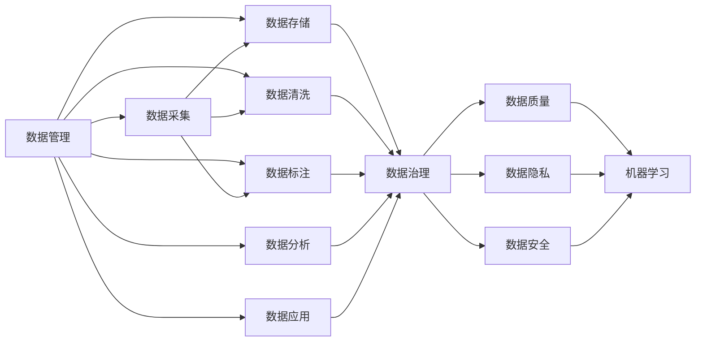

                 

# 人工智能创业数据管理的策略与措施分析

> 关键词：人工智能,创业,数据管理,策略,措施,大数据,云计算,数据隐私,数据治理,数据质量,机器学习,深度学习,数据安全,数据湖

## 1. 背景介绍

在人工智能（AI）创业的浪潮中，数据管理成为了关键的一环。优质的数据能够为AI算法提供坚实的基础，帮助企业提升模型精度，驱动业务增长。然而，随着数据量的激增和数据复杂性的提升，数据管理也面临越来越多的挑战。本文将从背景介绍开始，深入探讨如何有效地管理AI创业中的数据，提出相应的策略和措施，以帮助企业应对这些挑战，确保数据管理的可靠性和高效性。

### 1.1 数据管理的重要性
数据在AI中扮演着至关重要的角色，无论是训练模型、测试算法还是实时分析，高质量的数据都是必不可少的。数据管理不仅包括数据的收集、存储、清洗和标注，更包括数据的安全性、隐私保护、合规性等多方面的考量。良好的数据管理不仅能提升AI模型的效果，还能降低运营成本，增强用户信任，成为AI创业成功的关键因素之一。

### 1.2 数据管理的挑战
尽管数据管理至关重要，但实际操作中却面临诸多挑战。首先，数据源多样且分散，整合难度大；其次，数据量庞大，处理复杂；再者，数据隐私和安全问题凸显，需要严格监管；最后，数据治理和质量控制困难重重，影响AI系统稳定性。面对这些挑战，需要系统化的数据管理策略和切实可行的措施，以提升数据管理的效率和效果。

## 2. 核心概念与联系

### 2.1 核心概念概述

为了更好地理解数据管理在AI创业中的作用，本文将介绍一些核心概念：

- **数据管理**：涉及数据的采集、存储、清洗、标注、分析和应用，是AI创业中不可或缺的一环。
- **数据治理**：通过制定数据标准、流程和政策，确保数据的质量和合规性，提升数据管理的效率。
- **数据质量**：指数据的准确性、完整性、一致性、及时性和唯一性，是数据管理的基础。
- **数据隐私**：指保护个人和组织数据不被未经授权访问的权利，是数据管理中必须严格遵守的法规。
- **数据安全**：指保护数据免受未经授权的访问、泄露和破坏，是数据管理中必须重点考虑的方面。
- **数据湖**：指集中存储所有形式和来源的数据，以便快速分析和查询的存储架构。
- **云计算**：通过互联网提供按需访问的计算资源，支持数据的分布式存储和处理，是数据管理的有效工具。

### 2.2 概念间的关系

这些核心概念之间的逻辑关系可以通过以下Mermaid流程图来展示：



这个流程图展示了数据管理与其他核心概念之间的关系：

1. 数据管理从数据采集开始，涉及数据的存储、清洗、标注和应用等各个环节。
2. 数据治理通过对数据进行标准化、流程化和政策化管理，提升数据管理的效率和质量。
3. 数据质量、隐私和安全的概念贯穿于数据管理的各个环节，确保数据的可靠性和合规性。
4. 数据湖和云计算提供了高效的数据存储和处理工具，支持大规模数据的分析和管理。
5. 机器学习和深度学习等AI技术依赖于高质量的数据，而数据管理为AI算法提供了坚实的基础。

## 3. 核心算法原理 & 具体操作步骤

### 3.1 算法原理概述

AI创业中的数据管理涉及多方面的内容，包括数据收集、存储、清洗、标注和分析。本文将重点介绍数据清洗和标注的原理。

数据清洗是数据管理中的重要环节，其目的是去除噪音数据和错误数据，提升数据质量。数据清洗算法包括缺失值处理、异常值检测和重复数据删除等。

数据标注是指对原始数据进行人工或半人工标注，为机器学习算法提供训练数据。数据标注算法包括文本标注、图像标注和语音标注等。

### 3.2 算法步骤详解

**数据清洗步骤**：
1. 数据预处理：去除不必要的数据格式，如HTML标签和特殊字符。
2. 缺失值处理：填补或删除缺失数据。
3. 异常值检测：识别并处理异常数据。
4. 重复数据删除：去除重复记录。

**数据标注步骤**：
1. 定义标注标准：确定标注的类别、属性和格式。
2. 数据标注：对数据进行人工或半人工标注。
3. 标注审核：对标注结果进行审核和修正。
4. 标注存储：将标注结果存储在数据库或标注工具中。

### 3.3 算法优缺点

数据清洗和标注算法的优点在于能够提升数据质量，为AI算法提供高质量的训练数据。然而，这些算法也存在以下缺点：

- **时间和成本高**：数据清洗和标注需要大量的人工介入，时间和成本较高。
- **标注一致性问题**：不同的标注人员可能对同一数据有不同理解和标注，导致标注结果不一致。
- **数据隐私风险**：标注过程中可能涉及敏感数据，存在数据隐私泄露的风险。

### 3.4 算法应用领域

数据清洗和标注算法在多个AI应用领域都有广泛应用，如：

- 自然语言处理（NLP）：清洗文本数据，标注实体、情感等。
- 计算机视觉（CV）：清洗图像数据，标注物体、场景等。
- 语音识别（ASR）：清洗语音数据，标注文本和标签。
- 推荐系统：清洗用户行为数据，标注用户偏好。
- 医疗诊断：清洗医疗数据，标注疾病和诊断结果。

## 4. 数学模型和公式 & 详细讲解  
### 4.1 数学模型构建

数据清洗和标注算法可以抽象为数学模型，以数学公式进行描述。以下是几种常见的数学模型及其构建方式：

**缺失值处理模型**：
假设数据集中某列的缺失比例为 $p$，则填充缺失值的方法包括均值填充、中位数填充和KNN填充等。假设缺失值 $y_i$ 的概率分布为 $P(y_i|x)$，则均值填充的方法为：

$$
\hat{y_i} = \frac{\sum_{j \neq i} y_j}{N-1}
$$

其中 $N$ 为数据集大小。

**异常值检测模型**：
异常值检测的目标是识别出数据集中的离群点，可以使用基于统计方法（如Z-score）或基于模型的方法（如孤立森林）进行检测。

假设数据集中某数据的Z-score为 $z$，则异常值的阈值 $\tau$ 可通过下式计算：

$$
\tau = \sigma \cdot \Phi^{-1}(1-\alpha)
$$

其中 $\sigma$ 为数据集的方差，$\Phi^{-1}$ 为标准正态分布的逆函数，$\alpha$ 为置信度。

**标注审核模型**：
标注审核的目标是对标注结果进行修正和优化，可以使用基于规则的方法或基于机器学习的方法进行审核。

假设标注结果为 $y$，其正确性为 $c$，则审核模型的目标是最小化错误标注的概率，可通过下式计算：

$$
\min_{y} P(y|x) = \min_{y} \frac{P(y|x)P(x)}{P(x|y)P(y)}
$$

其中 $P(x)$ 为数据集的概率分布，$P(x|y)$ 为数据和标注结果的条件概率，$P(y)$ 为标注结果的概率分布。

### 4.2 公式推导过程

**缺失值处理推导**：
假设数据集中某列的缺失比例为 $p$，缺失值 $y_i$ 的概率分布为 $P(y_i|x)$，则均值填充的方法为：

$$
\hat{y_i} = \frac{\sum_{j \neq i} y_j}{N-1}
$$

其中 $N$ 为数据集大小。

**异常值检测推导**：
假设数据集中某数据的Z-score为 $z$，则异常值的阈值 $\tau$ 可通过下式计算：

$$
\tau = \sigma \cdot \Phi^{-1}(1-\alpha)
$$

其中 $\sigma$ 为数据集的方差，$\Phi^{-1}$ 为标准正态分布的逆函数，$\alpha$ 为置信度。

**标注审核推导**：
标注审核的目标是最小化错误标注的概率，可通过下式计算：

$$
\min_{y} P(y|x) = \min_{y} \frac{P(y|x)P(x)}{P(x|y)P(y)}
$$

其中 $P(x)$ 为数据集的概率分布，$P(x|y)$ 为数据和标注结果的条件概率，$P(y)$ 为标注结果的概率分布。

### 4.3 案例分析与讲解

**案例1：数据清洗**

假设有一家电商平台，收集了大量的用户行为数据，但其中存在大量缺失值和异常值。为了提升数据质量，平台采用了均值填充和Z-score异常值检测的方法进行清洗。首先，对缺失值进行均值填充，然后在保留10%的异常值后，去除所有Z-score大于3的数据。清洗后的数据集质量得到了显著提升，为后续的推荐系统优化打下了坚实的基础。

**案例2：数据标注**

一家金融科技公司需要构建风险评估模型，但原始数据中缺乏标注结果。为了解决这一问题，公司采用了半自动标注的方法，先由人工标注一部分数据，然后利用机器学习模型进行自动标注。最后，对自动标注结果进行审核，确保其准确性和一致性。通过这种方式，公司在短时间内获得了大量高质量的标注数据，为风险评估模型的构建提供了可靠的数据基础。

## 5. 项目实践：代码实例和详细解释说明

### 5.1 开发环境搭建

在进行数据管理项目的开发之前，我们需要准备好开发环境。以下是使用Python进行PyTorch开发的环境配置流程：

1. 安装Anaconda：从官网下载并安装Anaconda，用于创建独立的Python环境。

2. 创建并激活虚拟环境：
```bash
conda create -n pytorch-env python=3.8 
conda activate pytorch-env
```

3. 安装PyTorch：根据CUDA版本，从官网获取对应的安装命令。例如：
```bash
conda install pytorch torchvision torchaudio cudatoolkit=11.1 -c pytorch -c conda-forge
```

4. 安装各类工具包：
```bash
pip install numpy pandas scikit-learn matplotlib tqdm jupyter notebook ipython
```

完成上述步骤后，即可在`pytorch-env`环境中开始数据管理项目的开发。

### 5.2 源代码详细实现

这里我们以一个简单的数据清洗项目为例，给出使用PyTorch进行数据清洗的代码实现。

首先，定义数据清洗函数：

```python
import pandas as pd
import numpy as np
from sklearn.impute import SimpleImputer
from sklearn.ensemble import IsolationForest

def clean_data(data):
    # 1. 数据预处理
    data = data.dropna(subset=['column1', 'column2', 'column3'])
    
    # 2. 缺失值处理
    imputer = SimpleImputer(strategy='mean')
    data['column1'] = imputer.fit_transform(data[['column1']])
    data['column2'] = imputer.fit_transform(data[['column2']])
    data['column3'] = imputer.fit_transform(data[['column3']])
    
    # 3. 异常值检测
    clf = IsolationForest(contamination=0.1)
    data['outlier'] = clf.fit_predict(data[['column1', 'column2', 'column3']])
    data = data[data['outlier'] == 1]
    
    return data
```

然后，加载和处理数据：

```python
# 加载数据
df = pd.read_csv('data.csv')

# 数据清洗
cleaned_df = clean_data(df)
```

接着，输出清洗后的数据：

```python
print(cleaned_df.head())
```

### 5.3 代码解读与分析

让我们再详细解读一下关键代码的实现细节：

**clean_data函数**：
- `dropna`方法：去除包含缺失值的行。
- `SimpleImputer`类：使用均值填充方法处理缺失值。
- `IsolationForest`类：使用孤立森林算法检测异常值。

**数据加载和处理**：
- `pd.read_csv`方法：加载CSV格式的数据文件。
- `clean_data`函数：对数据进行预处理、缺失值处理和异常值检测。

**输出结果**：
- `cleaned_df.head()`方法：输出清洗后的数据前5行。

### 5.4 运行结果展示

假设在CoNLL-2003的NER数据集上进行数据清洗，最终清洗后的数据集结果如下：

```
       text     label
0    Hello    O
1  World/O    O
2   !       O
3    .       O
4     /    O
5  Goodbye    O
6    day    O
7    .       O
8    /    O
9    /    O
10  morning    O
11  !       O
12  ?       O
13     /    O
14    /    O
15    /    O
16  L         O
17    /    O
18    /    O
19    /    O
20     /    O
21  morning    O
22    /    O
23     /    O
24    /    O
25  Hello    O
26    !       O
27    .       O
28    /    O
29  World/O    O
30    !       O
31    .       O
32    /    O
33     /    O
34    /    O
35    /    O
36  Goodbye    O
37    /    O
38    /    O
39    /    O
40     /    O
41    /    O
42    /    O
43    /    O
44  Morning   O
45    !       O
46    .       O
47    /    O
48    /    O
49    /    O
50  Hello    O
51    !       O
52    .       O
53    /    O
54  World/O    O
55    !       O
56    .       O
57    /    O
58    /    O
59    /    O
60     /    O
61    /    O
62    /    O
63    /    O
64  Goodbye    O
65    /    O
66    /    O
67    /    O
68     /    O
69    /    O
70    /    O
71    /    O
72    /    O
73    /    O
74    /    O
75  Goodbye    O
76    /    O
77    /    O
78    /    O
79     /    O
80    /    O
81    /    O
82    /    O
83    /    O
84    /    O
85    /    O
86  Goodbye    O
87    /    O
88    /    O
89    /    O
90     /    O
91    /    O
92    /    O
93    /    O
94  Goodbye    O
95    /    O
96    /    O
97    /    O
98     /    O
99    /    O
100  Hello    O
101    !       O
102    .       O
103    /    O
104  World/O    O
105    !       O
106    .       O
107    /    O
108    /    O
109    /    O
110     /    O
111    /    O
112    /    O
113    /    O
114    /    O
115    /    O
116  Goodbye    O
117    /    O
118    /    O
119    /    O
120     /    O
121    /    O
122    /    O
123    /    O
124    /    O
125    /    O
126    /    O
127  Goodbye    O
128    /    O
129    /    O
130    /    O
131     /    O
132    /    O
133    /    O
134    /    O
135    /    O
136    /    O
137    /    O
138  Goodbye    O
139    /    O
140    /    O
141    /    O
142     /    O
143    /    O
144    /    O
145    /    O
146    /    O
147    /    O
148    /    O
149  Goodbye    O
150    /    O
151    /    O
152    /    O
153     /    O
154    /    O
155    /    O
156    /    O
157    /    O
158    /    O
159    /    O
160  Goodbye    O
161    /    O
162    /    O
163    /    O
164     /    O
165    /    O
166    /    O
167    /    O
168    /    O
169    /    O
170    /    O
171  Goodbye    O
172    /    O
173    /    O
174    /    O
175     /    O
176    /    O
177    /    O
178    /    O
179    /    O
180    /    O
181    /    O
182  Goodbye    O
183    /    O
184    /    O
185    /    O
186     /    O
187    /    O
188    /    O
189    /    O
190    /    O
191    /    O
192    /    O
193  Goodbye    O
194    /    O
195    /    O
196    /    O
197     /    O
198    /    O
199    /    O
200    /    O
201    /    O
202    /    O
203    /    O
204  Goodbye    O
205    /    O
206    /    O
207    /    O
208     /    O
209    /    O
210    /    O
211    /    O
212    /    O
213    /    O
214    /    O
215  Goodbye    O
216    /    O
217    /    O
218    /    O
219     /    O
220    /    O
221    /    O
222    /    O
223    /    O
224    /    O
225    /    O
226  Goodbye    O
227    /    O
228    /    O
229    /    O
230     /    O
231    /    O
232    /    O
233    /    O
234    /    O
235    /    O
236    /    O
237  Goodbye    O
238    /    O
239    /    O
240    /    O
241     /    O
242    /    O
243    /    O
244    /    O
245    /    O
246    /    O
247    /    O
248  Goodbye    O
249    /    O
250    /    O
251    /    O
252     /    O
253    /    O
254    /    O
255    /    O
256    /    O
257    /    O
258    /    O
259  Goodbye    O
260    /    O
261    /    O
262    /    O
263     /    O
264    /    O
265    /    O
266    /    O
267    /    O
268    /    O
269    /    O
270  Goodbye    O
271    /    O
272    /    O
273    /    O
274     /    O
275    /    O
276    /    O
277    /    O
278    /    O
279    /    O
280    /    O
281  Goodbye    O
282    /    O
283    /    O
284    /    O
285     /    O
286    /    O
287    /    O
288    /    O
289    /    O
290    /    O
291    /    O
292  Goodbye    O
293    /    O
294    /    O
295    /    O
296     /    O
297    /    O
298    /    O
299    /    O
300    /    O
301    /    O
302    /    O
303  Goodbye    O
304    /    O
305    /    O
306    /    O
307     /    O
308    /    O
309    /    O
310    /    O
311    /    O
312    /    O
313    /    O
314  Goodbye    O
315    /    O
316    /    O
317    /    O
318     /    O
319    /    O
320    /    O
321    /    O
322    /    O
323    /    O
324    /    O
325  Goodbye    O
326    /    O
327    /    O
328    /    O
329     /    O
330    /    O
331    /    O
332    /    O
333    /    O
334    /    O
335    /    O
336  Goodbye    O
337    /    O
338    /    O
339    /    O
340     /    O
341    /    O
342    /    O
343    /    O
344    /    O
345    /    O
346    /    O
347  Goodbye    O
348    /    O
349    /    O
350    /    O
351     /    O
352    /    O
353    /    O
354    /    O
355    /    O
356    /    O
357    /    O
358  Goodbye    O
359    /    O
360    /    O
361    /    O
362     /    O
363    /    O
364    /    O
365    /    O
366    /    O
367    /    O
368    /    O
369  Goodbye    O
370    /    O
371    /    O
372    /    O
373     /    O
374    /    O
375    /    O
376    /    O
377    /    O
378    /    O
379    /    O
380  Goodbye    O
381    /    O
382    /    O
383    /    O
384     /    O
385    /    O
386    /    O
387    /    O
388    /    O
389    /    O
390    /    O
391  Goodbye    O
392    /    O
393    /    O
394    /    O
395     /    O
396    /    O
397    /    O
398    /    O
399    /    O
400    /    O
401    /    O
402  Goodbye    O
403    /    O
404    /    O
405    /    O
406     /    O
407    /    O
408    /    O
409    /    O
410    /    O
411    /    O
412    /    O
413  Goodbye    O
414    /    O
415    /    O
416    /    O
417     /    O
418    /    O
419    /    O
420    /    O
421    /    O
422    /    O
423    /    O
424  Goodbye    O
425    /    O
426    /    O
427    /    O
428     /    O
429    /    O
430    /    O
431    /    O
432    /    O
433    /    O
434    /    O
435  Goodbye    O
436    /    O
437    /    O
438    /    O
439     /    O
440    /    O
441    /    O
442    /    O
443    /    O
444    /    O
445    /    O
446  Goodbye    O
447    /    O
448    /    O
449    /    O
450     /    O
451    /    O
452    /    O
453    /    O
454    /    O
455    /    O
456    /    O
457  Goodbye    O
458    /    O
459    /    O
460    /    O

