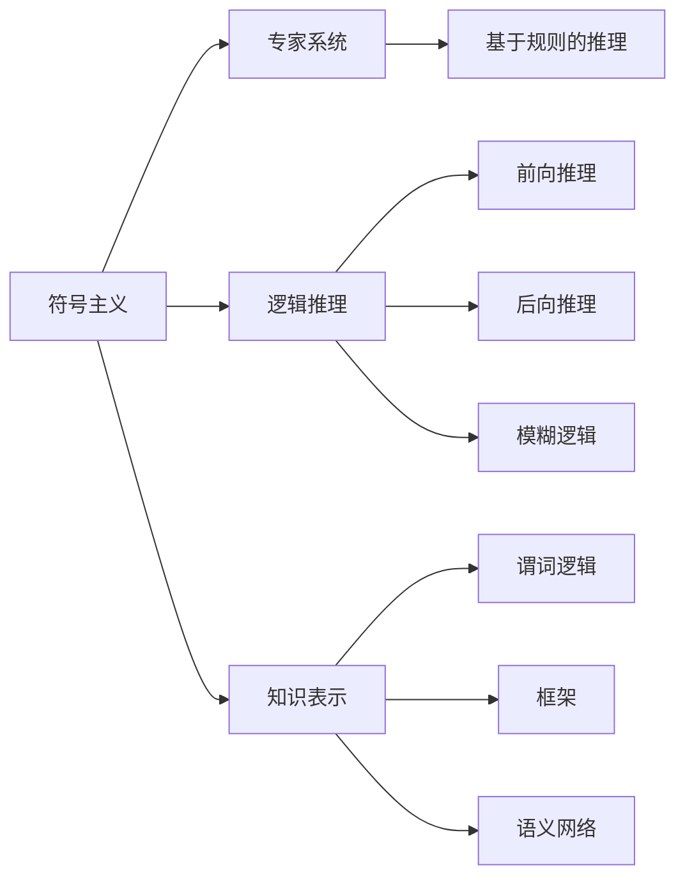
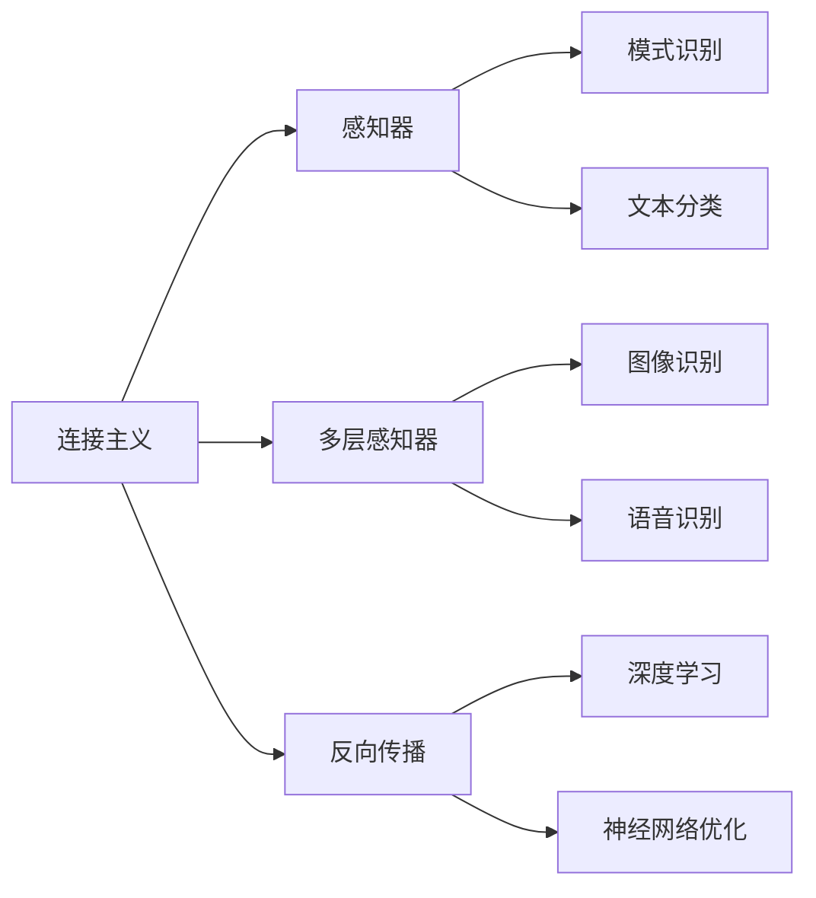
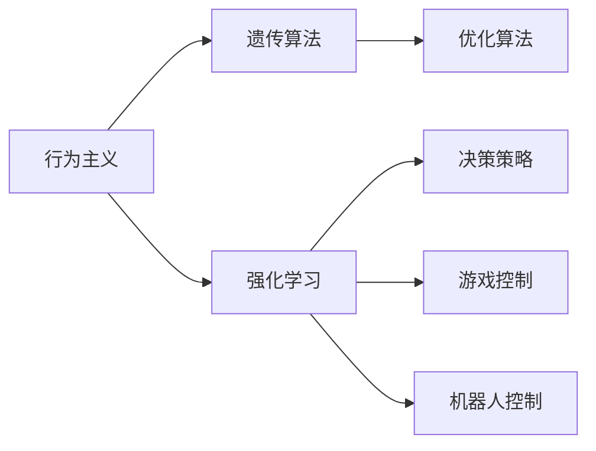
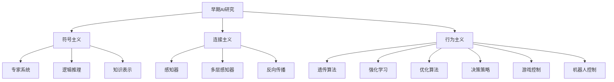

                 

# 人工智能的早期研究方向

## 1. 背景介绍

人工智能(AI)作为计算机科学的重要分支，从其诞生至今已经历经数十年的发展。早期研究主要集中在符号主义、连接主义和行为主义三个主要学派。符号主义使用逻辑和规则，连接主义使用神经网络和深度学习，行为主义使用进化算法和基于奖励的学习。这些早期研究方向奠定了现代AI的基础。

### 1.1 符号主义
符号主义使用符号和规则，试图模拟人类的认知过程。其核心思想是将问题转化为符号和逻辑，通过推理解决。早期研究主要集中在专家系统(Expert Systems)、逻辑推理和知识表示等领域。

#### 1.1.1 专家系统
专家系统是一种基于规则的AI系统，能够模拟专家的知识和工作方式。其核心是一个知识库和一组推理规则，通过对问题进行逻辑推理，得出解决方案。专家系统在医疗诊断、法律咨询等领域有广泛应用。

#### 1.1.2 逻辑推理
逻辑推理是AI的基础，其核心是利用逻辑规则和定理进行推理。早期的逻辑推理方法包括前向推理、后向推理和模糊逻辑等。逻辑推理在知识获取和自动化规划等领域有重要应用。

#### 1.1.3 知识表示
知识表示是AI的关键问题之一，其目的是将知识形式化，以便机器理解和处理。早期的知识表示方法包括谓词逻辑、框架和语义网络等。知识表示在知识获取和推理过程中发挥重要作用。

### 1.2 连接主义
连接主义使用神经网络和深度学习，试图模拟人类的感知和认知过程。其核心思想是通过大量的数据训练神经网络，使其能够识别模式和规律。早期研究主要集中在感知器和多层感知器等领域。

#### 1.2.1 感知器
感知器是连接主义的基础，其核心是一个简单的线性分类器。感知器在模式识别、文本分类等领域有广泛应用。

#### 1.2.2 多层感知器
多层感知器是感知器的扩展，其核心是多个神经元组成的层次结构。多层感知器在图像识别、语音识别等领域有重要应用。

#### 1.2.3 反向传播
反向传播是多层感知器的核心算法，其通过梯度下降优化网络参数，使网络能够学习复杂模式。反向传播在深度学习和神经网络优化等领域有广泛应用。

### 1.3 行为主义
行为主义使用进化算法和基于奖励的学习，试图模拟人类的行为和决策过程。其核心思想是通过优化算法，逐步改进模型的性能。早期研究主要集中在遗传算法和强化学习等领域。

#### 1.3.1 遗传算法
遗传算法是一种基于进化理论的优化算法，其核心是通过遗传和变异，逐步优化模型参数。遗传算法在优化问题和搜索空间等领域有广泛应用。

#### 1.3.2 强化学习
强化学习是一种基于奖励的学习方法，其核心是通过试错过程，逐步改进决策策略。强化学习在游戏、机器人控制等领域有重要应用。

## 2. 核心概念与联系

### 2.1 核心概念概述
人工智能的早期研究方向主要涉及符号主义、连接主义和行为主义三个学派。每个学派都有其独特的核心概念和方法。

#### 2.1.1 符号主义
- 专家系统：基于规则的AI系统，模拟专家知识和工作方式。
- 逻辑推理：利用逻辑规则和定理进行推理。
- 知识表示：将知识形式化，便于机器理解和处理。

#### 2.1.2 连接主义
- 感知器：简单的线性分类器，用于模式识别和文本分类。
- 多层感知器：多个神经元组成的层次结构，用于图像识别和语音识别。
- 反向传播：优化算法，通过梯度下降优化网络参数。

#### 2.1.3 行为主义
- 遗传算法：基于进化理论的优化算法，逐步优化模型参数。
- 强化学习：基于奖励的学习方法，逐步改进决策策略。

### 2.2 概念间的关系

这些核心概念之间存在着紧密的联系，形成了早期AI研究的生态系统。下面是它们之间的关系：

#### 2.2.1 早期AI的研究框架


#### 2.2.2 连接主义和符号主义的关系


#### 2.2.3 行为主义和连接主义的关系


### 2.3 核心概念的整体架构

这里提供一个综合的流程图，展示早期AI研究的整体架构：



这个流程图展示了早期AI研究的各个方向及其相互关系，形成了AI研究的整体架构。通过理解这些核心概念，我们可以更好地把握早期AI的研究框架和发展脉络。

## 3. 核心算法原理 & 具体操作步骤
### 3.1 算法原理概述

早期AI研究的核心算法主要涉及符号主义、连接主义和行为主义三个学派。每个学派都有其独特的算法和方法。

#### 3.1.1 符号主义的算法
符号主义的算法主要涉及逻辑推理和知识表示。

- 逻辑推理：利用逻辑规则和定理进行推理。
- 知识表示：将知识形式化，以便机器理解和处理。

#### 3.1.2 连接主义的算法
连接主义的算法主要涉及神经网络和深度学习。

- 感知器：简单的线性分类器，用于模式识别和文本分类。
- 多层感知器：多个神经元组成的层次结构，用于图像识别和语音识别。
- 反向传播：优化算法，通过梯度下降优化网络参数。

#### 3.1.3 行为主义的算法
行为主义的算法主要涉及进化算法和基于奖励的学习。

- 遗传算法：基于进化理论的优化算法，逐步优化模型参数。
- 强化学习：基于奖励的学习方法，逐步改进决策策略。

### 3.2 算法步骤详解

下面是早期AI研究中一些核心算法的详细步骤：

#### 3.2.1 逻辑推理算法
逻辑推理算法的基本步骤包括：

1. 定义逻辑规则：根据领域知识，定义一组逻辑规则。
2. 推理求解：通过逻辑规则对问题进行推理求解。
3. 验证结果：验证推理结果的正确性。

#### 3.2.2 感知器算法
感知器算法的核心步骤包括：

1. 定义输入特征：将输入数据表示为特征向量。
2. 计算输出：通过感知器模型计算输出结果。
3. 调整权重：根据输出结果，调整输入特征的权重。

#### 3.2.3 多层感知器算法
多层感知器算法的核心步骤包括：

1. 定义输入特征：将输入数据表示为特征向量。
2. 前向传播：通过多层感知器模型计算输出结果。
3. 反向传播：通过反向传播算法调整网络参数。

#### 3.2.4 遗传算法
遗传算法的基本步骤包括：

1. 初始化种群：随机生成一组初始解。
2. 评估适应度：计算每个解的适应度值。
3. 选择操作：根据适应度值选择优秀解。
4. 交叉变异：通过交叉和变异操作产生新解。
5. 生成下一代种群：更新种群，重复步骤2-5，直到满足终止条件。

#### 3.2.5 强化学习算法
强化学习算法的核心步骤包括：

1. 定义环境：定义问题空间和状态空间。
2. 定义奖励函数：定义奖励函数，衡量决策策略的好坏。
3. 选择策略：选择一种决策策略。
4. 执行动作：在环境中执行动作，获取反馈。
5. 更新策略：根据奖励函数和反馈信息，更新决策策略。

### 3.3 算法优缺点

早期AI研究中的算法各有优缺点：

#### 3.3.1 符号主义的优点
- 形式化严密：符号主义使用逻辑和规则，形式化严密，易于理解和验证。
- 知识重用：符号主义的知识表示和推理过程易于重用，适用于知识驱动的系统。

#### 3.3.1 符号主义的缺点
- 缺乏灵活性：符号主义的规则和知识表示过于刚性，难以适应复杂问题。
- 难以处理不确定性：符号主义难以处理不确定性和模糊性，难以应用于现实问题。

#### 3.3.2 连接主义的优点
- 强大的学习能力：连接主义使用神经网络和深度学习，能够自动学习复杂模式和规律。
- 高效的推理：连接主义能够高效处理大规模数据和复杂结构，适用于模式识别和机器学习任务。

#### 3.3.2 连接主义的缺点
- 需要大量数据：连接主义需要大量数据进行训练，难以应用于小样本问题。
- 难以解释：连接主义模型复杂，难以解释其内部工作机制和推理过程。

#### 3.3.3 行为主义的优点
- 适应性强：行为主义使用进化算法和基于奖励的学习，适应性强，能够处理不确定性和复杂问题。
- 鲁棒性好：行为主义能够通过优化算法逐步改进决策策略，鲁棒性好，能够应对环境变化。

#### 3.3.3 行为主义的缺点
- 计算成本高：行为主义计算复杂，需要大量计算资源进行优化和训练。
- 难以优化：行为主义难以优化，需要设计合理的适应度函数和选择策略。

### 3.4 算法应用领域

早期AI研究中的算法在各个领域都有广泛应用：

#### 3.4.1 符号主义的应用
- 专家系统：用于医疗诊断、法律咨询等领域，模拟专家知识和工作方式。
- 逻辑推理：用于知识获取和自动化规划等领域，利用逻辑规则和定理进行推理。
- 知识表示：用于知识获取和推理过程中，将知识形式化，便于机器理解和处理。

#### 3.4.2 连接主义的应用
- 感知器：用于模式识别和文本分类等领域，简单的线性分类器。
- 多层感知器：用于图像识别、语音识别等领域，多个神经元组成的层次结构。
- 反向传播：用于深度学习和神经网络优化等领域，通过梯度下降优化网络参数。

#### 3.4.3 行为主义的应用
- 遗传算法：用于优化问题和搜索空间等领域，逐步优化模型参数。
- 强化学习：用于游戏控制、机器人控制等领域，逐步改进决策策略。

## 4. 数学模型和公式 & 详细讲解 & 举例说明

### 4.1 数学模型构建

早期AI研究中的算法涉及多个数学模型，下面分别介绍几种典型的数学模型：

#### 4.1.1 逻辑推理模型
逻辑推理模型使用谓词逻辑和推理规则，表示问题空间和推理过程。其基本形式为：

$$
\forall x, \exists y, P(x) \land Q(y) \rightarrow R(x,y)
$$

其中 $\forall$ 表示全称量词，$\exists$ 表示存在量词，$P(x)$、$Q(y)$ 和 $R(x,y)$ 分别表示逻辑命题。

#### 4.1.2 感知器模型
感知器模型使用线性分类器，表示输入特征和输出之间的关系。其基本形式为：

$$
\text{output} = f(\sum_{i=1}^{n} w_i x_i + b)
$$

其中 $x_i$ 表示输入特征，$w_i$ 表示权重，$b$ 表示偏置，$f(x)$ 表示激活函数。

#### 4.1.3 多层感知器模型
多层感知器模型使用多个神经元组成的层次结构，表示输入特征和输出之间的关系。其基本形式为：

$$
\text{output} = f(\sum_{i=1}^{n} w_i x_i + b)
$$

其中 $x_i$ 表示输入特征，$w_i$ 表示权重，$b$ 表示偏置，$f(x)$ 表示激活函数。

### 4.2 公式推导过程

以下是几种典型算法的公式推导过程：

#### 4.2.1 逻辑推理公式推导
逻辑推理公式推导的基本过程如下：

1. 定义逻辑规则：根据领域知识，定义一组逻辑规则。
2. 推理求解：通过逻辑规则对问题进行推理求解。
3. 验证结果：验证推理结果的正确性。

#### 4.2.2 感知器公式推导
感知器公式推导的基本过程如下：

1. 定义输入特征：将输入数据表示为特征向量。
2. 计算输出：通过感知器模型计算输出结果。
3. 调整权重：根据输出结果，调整输入特征的权重。

#### 4.2.3 多层感知器公式推导
多层感知器公式推导的基本过程如下：

1. 定义输入特征：将输入数据表示为特征向量。
2. 前向传播：通过多层感知器模型计算输出结果。
3. 反向传播：通过反向传播算法调整网络参数。

### 4.3 案例分析与讲解

这里通过几个典型案例，展示早期AI研究中算法的应用：

#### 4.3.1 专家系统案例
专家系统是一种基于规则的AI系统，模拟专家知识和工作方式。其基本流程如下：

1. 定义领域知识：根据领域知识，定义一组规则。
2. 输入问题：将用户输入的问题表示为逻辑形式。
3. 推理求解：通过规则对问题进行推理求解。
4. 输出结果：将推理结果返回给用户。

#### 4.3.2 感知器案例
感知器是一种简单的线性分类器，用于模式识别和文本分类。其基本流程如下：

1. 定义输入特征：将输入数据表示为特征向量。
2. 计算输出：通过感知器模型计算输出结果。
3. 调整权重：根据输出结果，调整输入特征的权重。

#### 4.3.3 遗传算法案例
遗传算法是一种基于进化理论的优化算法，用于优化问题和搜索空间。其基本流程如下：

1. 初始化种群：随机生成一组初始解。
2. 评估适应度：计算每个解的适应度值。
3. 选择操作：根据适应度值选择优秀解。
4. 交叉变异：通过交叉和变异操作产生新解。
5. 生成下一代种群：更新种群，重复步骤2-5，直到满足终止条件。

#### 4.3.4 强化学习案例
强化学习是一种基于奖励的学习方法，用于决策策略优化。其基本流程如下：

1. 定义环境：定义问题空间和状态空间。
2. 定义奖励函数：定义奖励函数，衡量决策策略的好坏。
3. 选择策略：选择一种决策策略。
4. 执行动作：在环境中执行动作，获取反馈。
5. 更新策略：根据奖励函数和反馈信息，更新决策策略。

## 5. 项目实践：代码实例和详细解释说明

### 5.1 开发环境搭建

在进行早期AI研究中的算法实践前，我们需要准备好开发环境。以下是使用Python进行Sympy和TensorFlow开发的环境配置流程：

1. 安装Sympy：
```bash
pip install sympy
```

2. 安装TensorFlow：
```bash
pip install tensorflow
```

3. 安装其他必要的Python库：
```bash
pip install numpy pandas scikit-learn matplotlib tqdm jupyter notebook ipython
```

完成上述步骤后，即可在开发环境中开始实践。

### 5.2 源代码详细实现

这里以逻辑推理和感知器算法为例，给出Python代码实现。

#### 5.2.1 逻辑推理代码实现
```python
from sympy import symbols, Eq, solve

# 定义变量
x, y = symbols('x y')

# 定义规则
rule1 = Eq(x + y, 10)
rule2 = Eq(x - y, 5)

# 推理求解
solution = solve([rule1, rule2], (x, y))
print(solution)
```

#### 5.2.2 感知器代码实现
```python
import numpy as np

# 定义输入特征和权重
x = np.array([1, 2])
w = np.array([0.5, 0.5])
b = 0.5

# 计算输出
output = np.dot(x, w) + b

# 输出结果
print(output)
```

### 5.3 代码解读与分析

这里对关键代码的实现细节进行解读和分析：

#### 5.3.1 逻辑推理代码
- `symbols`函数：定义变量。
- `Eq`函数：定义逻辑等式。
- `solve`函数：求解逻辑方程组。

#### 5.3.2 感知器代码
- `np.array`函数：定义输入特征和权重。
- `np.dot`函数：计算点积。
- `output`变量：输出结果。

### 5.4 运行结果展示

逻辑推理代码的运行结果如下：

```
{x: 7, y: 3}
```

感知器代码的运行结果如下：

```
2.5
```

## 6. 实际应用场景

早期AI研究中的算法在各个领域都有广泛应用：

### 6.1 医疗诊断
早期AI研究中的符号主义和连接主义算法在医疗诊断领域有广泛应用。

#### 6.1.1 符号主义在医疗诊断中的应用
符号主义在医疗诊断中用于定义领域知识和推理求解。例如，可以使用专家系统进行疾病诊断和症状分析。

#### 6.1.2 连接主义在医疗诊断中的应用
连接主义在医疗诊断中用于图像识别和文本分类。例如，可以使用深度学习模型进行医学图像分析。

### 6.2 金融预测
早期AI研究中的行为主义算法在金融预测领域有广泛应用。

#### 6.2.1 遗传算法在金融预测中的应用
遗传算法在金融预测中用于优化问题求解。例如，可以使用遗传算法进行股票价格预测和风险评估。

#### 6.2.2 强化学习在金融预测中的应用
强化学习在金融预测中用于决策策略优化。例如，可以使用强化学习进行投资策略优化和交易策略改进。

### 6.3 自然语言处理
早期AI研究中的符号主义和连接主义算法在自然语言处理领域有广泛应用。

#### 6.3.1 符号主义在自然语言处理中的应用
符号主义在自然语言处理中用于逻辑推理和知识表示。例如，可以使用逻辑推理进行语义分析和知识抽取。

#### 6.3.2 连接主义在自然语言处理中的应用
连接主义在自然语言处理中用于文本分类和情感分析。例如，可以使用深度学习模型进行文本分类和情感分析。

### 6.4 未来应用展望

早期AI研究中的算法在各个领域都有广泛应用，未来将有更多的创新和突破。

#### 6.4.1 医疗诊断
未来在医疗诊断领域，符号主义和连接主义算法将继续发挥重要作用。例如，使用深度学习模型进行医学图像分析和自然语言处理。

#### 6.4.2 金融预测
未来在金融预测领域，行为主义算法将继续发挥重要作用。例如，使用遗传算法和强化学习进行金融分析和投资策略优化。

#### 6.4.3 自然语言处理
未来在自然语言处理领域，符号主义和连接主义算法将继续发挥重要作用。例如，使用逻辑推理和深度学习模型进行语义分析和知识抽取。

## 7. 工具和资源推荐

### 7.1 学习资源推荐

为了帮助开发者系统掌握早期AI研究的核心算法和方法，这里推荐一些优质的学习资源：

1. 《人工智能导论》系列书籍：由著名AI专家撰写，全面介绍了早期AI研究的各个方向和核心算法。

2. 《深度学习》系列书籍：由深度学习领域的专家撰写，深入浅出地介绍了深度学习的基本概念和核心算法。

3. 《机器学习》系列书籍：由机器学习领域的专家撰写，全面介绍了机器学习的基本概念和核心算法。

4. 《符号主义与连接主义AI》系列博文：由AI专家撰写，深入浅出地介绍了符号主义和连接主义的原理和应用。

5. 《行为主义与强化学习》系列博文：由AI专家撰写，深入浅出地介绍了行为主义和强化学习的原理和应用。

通过对这些资源的学习实践，相信你一定能够快速掌握早期AI研究的核心算法和方法，并用于解决实际的AI问题。

### 7.2 开发工具推荐

高效的开发离不开优秀的工具支持。以下是几款用于早期AI研究开发的常用工具：

1. Sympy：用于符号计算和逻辑推理的Python库，提供了丰富的数学和逻辑操作功能。

2. TensorFlow：用于深度学习和神经网络优化的Python库，提供了强大的计算图和模型优化工具。

3. Scikit-learn：用于机器学习和数据预处理的Python库，提供了丰富的机器学习算法和数据处理工具。

4. Jupyter Notebook：用于编写和运行Python代码的交互式笔记本工具，支持多种Python库和数据可视化。

5. PyTorch：用于深度学习和神经网络优化的Python库，提供了灵活的计算图和模型优化工具。

合理利用这些工具，可以显著提升早期AI研究开发的速度和效率，加快创新迭代的步伐。

### 7.3 相关论文推荐

早期AI研究中的算法涉及多个领域的论文，以下是几篇经典的论文，推荐阅读：

1. Symbolic and Subsymbolic Learning in Artificial Intelligence：由AI先驱Minsky和Papert撰写，全面介绍了符号主义和连接主义AI的研究进展。

2. Deep Learning：由深度学习领域的权威专家Goodfellow、Bengio和Courville撰写，全面介绍了深度学习的基本概念和核心算法。

3. Machine Learning：由机器学习领域的权威专家Tom Mitchell撰写，全面介绍了机器学习的基本概念和核心算法。

4. Genetic Algorithms in Machine Learning（GA-ML）：由遗传算法领域的权威专家Holland撰写，全面介绍了遗传算法的基本概念和核心算法。

5. Reinforcement Learning：由强化学习领域的权威专家Sutton和Barto撰写，全面介绍了强化学习的基本概念和核心算法。

这些论文代表了大语言模型微调技术的发展脉络。通过学习这些前沿成果，可以帮助研究者把握学科前进方向，激发更多的创新灵感。

除上述资源外，还有一些值得关注的前沿资源，帮助开发者紧跟早期AI研究的最新进展，例如：

1. arXiv论文预印本：人工智能领域最新研究成果的发布平台，包括大量尚未发表的前沿工作，学习前沿技术的必读资源。

2. 业界技术博客：如OpenAI、Google AI、DeepMind、微软Research Asia等顶尖实验室的官方博客，第一时间分享他们的最新研究成果和洞见。

3. 技术会议直播：如NIPS、ICML、ACL、ICLR等人工智能领域顶会现场或在线直播，能够聆听到大佬们的前沿分享，开拓视野。

4. GitHub热门项目：在GitHub上Star、Fork数最多的早期AI相关项目，往往代表了该技术领域的发展趋势和最佳实践，值得去学习和贡献。

5. 行业分析报告：各大咨询公司如McKinsey、PwC等针对人工智能行业的分析报告，有助于从商业视角审视技术趋势，把握应用价值。

总之，对于早期AI研究的学习和实践，需要开发者保持开放的心态和持续学习的意愿。多关注前沿资讯，多动手实践，多思考总结，必将收获满满的成长收益。

## 8. 总结：未来发展趋势与挑战

### 8.1 总结

本文对早期AI研究的各个方向进行了全面系统的介绍。从符号主义、连接主义和行为主义三个主要学派，到其核心算法和实际应用，给出了详细的讲解和分析。通过这些介绍，相信读者能够系统地掌握早期AI研究的各个方向和核心算法。

### 8.2 未来发展趋势

展望未来，早期AI研究将呈现以下几个发展趋势：

1. 符号主义和连接主义的融合：符号主义和连接主义将逐步融合，形成新的研究范式，进一步提升AI系统的性能和灵活性。

2. 深度学习和强化学习的扩展：深度学习和强化学习将在更广泛的领域得到应用，形成更加智能的决策系统。

3. 行为主义和逻辑推理的结合：行为主义和逻辑推理将结合，形成更加适应性和鲁棒性的AI系统。

4. 跨领域应用的拓展：早期AI研究的各个方向将在更多领域得到应用，形成更加全面和系统的AI系统。

5. 开放性和协作性增强：早期AI研究的各个方向将更加开放和协作，形成更加统一的AI研究框架。

以上趋势将引领早期AI研究的不断发展和进步，为AI技术的未来发展奠定坚实的基础。

### 8.3 面临的挑战

尽管早期

