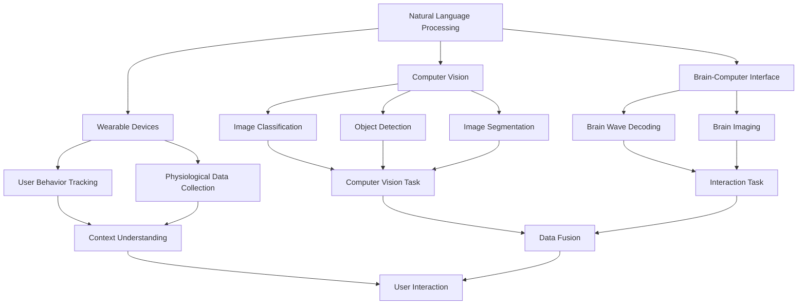
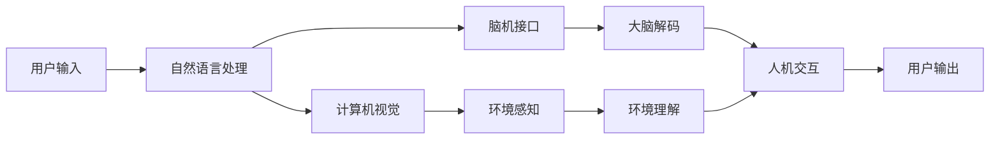
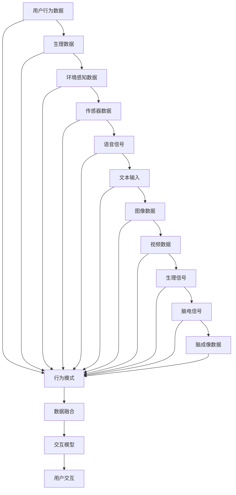
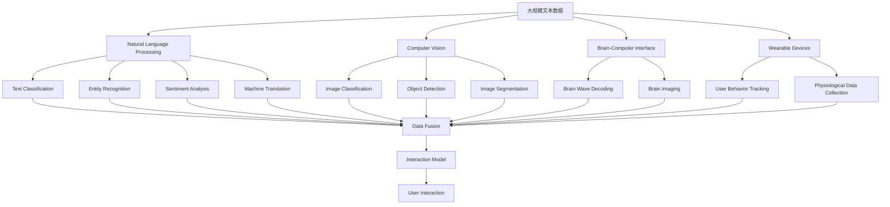

                 

# 人机交互：打造高效便捷的人类计算平台

> 关键词：人机交互, 计算平台, 自然语言处理, 计算机视觉, 脑机接口, 可穿戴设备

## 1. 背景介绍

### 1.1 问题由来
随着科技的迅猛发展，人类对计算工具的依赖日益加深，从传统的桌面电脑到如今的移动设备、智能家居，计算已经深度融入人们的日常生活。然而，传统的交互方式往往需要学习成本，缺乏自然流畅的体验。如何让计算工具更好地融入人类的生活，一直是人们探索的热点问题。

在人机交互领域，随着自然语言处理(NLP)、计算机视觉(CV)、脑机接口(BMI)等技术的迅猛发展，计算平台的设计和实现方式也在不断革新。如何在计算平台上实现更高效、更便捷、更自然的人机交互，是当前研究的重要方向。

### 1.2 问题核心关键点
目前，基于人机交互的计算平台主要包括以下几个关键点：

- **自然语言处理**：通过文本输入和语音识别等方式，实现人与机器的无障碍沟通。
- **计算机视觉**：通过图像识别、视频分析等方式，实现对环境的感知和理解。
- **脑机接口**：通过读取大脑信号，实现人与机器的直接交互。
- **可穿戴设备**：通过穿戴设备收集用户生理和行为数据，实现更个性化的交互体验。

这些技术在各自的领域内取得了巨大进展，但如何将它们有效融合，打造高效便捷的人机交互平台，仍是当前的挑战。

### 1.3 问题研究意义
研究高效便捷的人机交互平台，对于提升用户生活质量、推动人机协同工作具有重要意义：

- **提升用户体验**：自然流畅的交互方式能够显著提升用户的使用体验，降低学习成本，增加使用频率。
- **推动协同工作**：通过自然语言处理和计算机视觉技术，实现对环境的全方位感知，增强协同工作能力。
- **促进产业升级**：结合脑机接口和可穿戴设备，能够为用户提供更个性化的服务，推动智能设备和传统产业的深度融合。
- **推动科技创新**：高效便捷的人机交互平台是智能应用的基础设施，能够加速技术创新和应用落地。

## 2. 核心概念与联系

### 2.1 核心概念概述

为更好地理解高效便捷人机交互平台的构建，本节将介绍几个关键概念：

- **自然语言处理(NLP)**：通过文本和语音的自动处理，实现人与机器的交互。NLP包括文本分类、实体识别、情感分析、机器翻译等任务。
- **计算机视觉(CV)**：通过图像和视频的自动处理，实现对环境的感知和理解。CV包括图像分类、目标检测、图像分割等任务。
- **脑机接口(BMI)**：通过读取大脑信号，实现人与机器的直接交互。BMI包括脑电波解码、脑成像技术等。
- **可穿戴设备**：通过传感器收集用户生理和行为数据，实现更个性化的交互体验。

这些核心概念之间的逻辑关系可以通过以下Mermaid流程图来展示：



这个流程图展示了大语言模型微调过程中各个核心概念的关系：

1. 自然语言处理(NLP)通过文本和语音识别，实现与人机的信息交互。
2. 计算机视觉(CV)通过对图像和视频的处理，实现对环境的感知和理解。
3. 脑机接口(BMI)通过读取大脑信号，实现人机直接交互。
4. 可穿戴设备通过传感器收集生理和行为数据，实现个性化交互体验。
5. 各个任务通过数据融合技术实现整合，为用户提供更全面的交互体验。

### 2.2 概念间的关系

这些核心概念之间存在着紧密的联系，构成了高效便捷人机交互平台的完整生态系统。下面我们通过几个Mermaid流程图来展示这些概念之间的关系。

#### 2.2.1 人机交互的层次结构



这个流程图展示了人机交互的基本层次结构：

1. 用户通过自然语言处理和语音识别输入信息。
2. 自然语言处理和语音识别模块通过文本处理和语音识别，理解用户意图。
3. 计算机视觉模块通过图像处理和视频分析，感知环境。
4. 脑机接口模块通过脑电波解码和脑成像技术，实现大脑信号的解读。
5. 最终，环境理解和人机交互模块将综合各层次的信息，为用户提供输出。

#### 2.2.2 数据融合技术



这个流程图展示了数据融合的基本流程：

1. 用户行为数据、生理数据、环境感知数据、语音信号、文本输入、图像数据、视频数据、生理信号、脑电信号和脑成像数据等各类数据来源。
2. 行为模式、环境感知、传感器、语音、文本、图像、视频、生理、脑电和脑成像等各类数据模式。
3. 通过数据融合技术，将各类数据进行整合，形成统一的数据集。
4. 交互模型通过融合后的数据，实现对用户意图的全面理解。
5. 最终，交互模型输出用户交互结果。

### 2.3 核心概念的整体架构

最后，我们用一个综合的流程图来展示这些核心概念在大语言模型微调过程中的整体架构：



这个综合流程图展示了从大规模文本数据到最终交互结果的完整流程：

1. 大规模文本数据通过自然语言处理、计算机视觉、脑机接口和可穿戴设备进行多层次处理。
2. 各层次处理结果通过数据融合技术进行整合。
3. 交互模型通过融合后的数据，实现对用户意图的全面理解。
4. 最终，交互模型输出用户交互结果。

通过这些流程图，我们可以更清晰地理解高效便捷人机交互平台的核心概念及其之间的关系。

## 3. 核心算法原理 & 具体操作步骤
### 3.1 算法原理概述

高效便捷的人机交互平台基于多层次、多模态的数据融合，通过自然语言处理、计算机视觉、脑机接口和可穿戴设备等技术实现用户与计算设备的互动。其核心算法原理包括以下几个方面：

- **数据预处理**：对各类输入数据进行归一化、去噪、特征提取等预处理，以便后续处理和融合。
- **特征融合**：通过融合不同模态的数据特征，形成统一的数据集，以便于后续处理。
- **模式识别**：利用机器学习、深度学习等技术，对融合后的数据进行模式识别，实现对用户意图的理解。
- **交互决策**：根据用户意图，结合环境感知和知识库，生成最优的交互策略。
- **输出展示**：将交互结果通过自然语言处理、计算机视觉、语音合成等技术，展示给用户。

### 3.2 算法步骤详解

基于高效便捷人机交互平台的算法原理，其实现步骤可以概括为以下几个关键步骤：

**Step 1: 数据收集与预处理**

- 收集用户行为数据、生理数据、环境感知数据、语音信号、文本输入、图像数据、视频数据、生理信号、脑电信号和脑成像数据等。
- 对各类输入数据进行归一化、去噪、特征提取等预处理，以便后续处理和融合。

**Step 2: 特征融合与数据整合**

- 利用机器学习、深度学习等技术，对融合后的数据进行模式识别，实现对用户意图的理解。
- 通过数据融合技术，将各类数据进行整合，形成统一的数据集。

**Step 3: 交互决策与输出展示**

- 根据用户意图，结合环境感知和知识库，生成最优的交互策略。
- 将交互结果通过自然语言处理、计算机视觉、语音合成等技术，展示给用户。

### 3.3 算法优缺点

高效便捷的人机交互平台具有以下优点：

- **实时性**：通过自然语言处理和计算机视觉技术，实现对环境的实时感知和理解。
- **普适性**：结合脑机接口和可穿戴设备，能够适应不同用户的需求和场景。
- **自然性**：通过自然语言处理和语音合成技术，实现与用户的自然流畅交互。
- **个性化**：通过收集用户行为和生理数据，实现个性化的交互体验。

同时，该算法也存在一些缺点：

- **数据依赖**：依赖大量的用户数据，数据获取成本高。
- **模型复杂**：涉及多层次、多模态的数据处理，模型设计复杂。
- **隐私风险**：收集用户生理和行为数据，存在隐私风险。
- **计算资源要求高**：需要高性能的计算设备和大量的计算资源。

### 3.4 算法应用领域

高效便捷的人机交互平台广泛应用于以下领域：

- **智能家居**：通过语音助手、智能音箱等设备，实现对家电、照明、安防等设备的控制。
- **车载系统**：通过语音识别、图像识别等技术，提升驾驶安全性和舒适性。
- **智能办公**：通过自然语言处理和计算机视觉技术，实现智能文档处理、会议记录等。
- **医疗健康**：通过脑机接口和可穿戴设备，实现健康监测和医疗辅助。
- **教育培训**：通过可穿戴设备和虚拟现实技术，实现个性化教育和培训。

## 4. 数学模型和公式 & 详细讲解 & 举例说明

### 4.1 数学模型构建

为了更好地描述高效便捷人机交互平台的算法原理，我们可以构建一个简单的数学模型。设用户输入为 $x$，环境感知为 $y$，交互模型为 $f$，输出为 $o$。则模型的整体结构可以表示为：

$$
o = f(x, y)
$$

其中，$x$ 包括自然语言处理和语音识别结果，$y$ 包括计算机视觉和脑机接口结果，$f$ 为交互模型，$o$ 为输出结果。

### 4.2 公式推导过程

以一个简单的交互任务为例，我们假设用户输入是一条文本消息，环境感知是通过计算机视觉检测到的用户表情和手势，交互模型是基于文本和视觉信息的意图理解模型，输出是一个简洁的回复。

设用户输入的文本消息为 $x$，环境感知到的用户表情和手势为 $y$，交互模型为 $f$，输出为 $o$。则公式可以表示为：

$$
o = f(x, y)
$$

其中，$f$ 可以进一步分解为两个子模块：

1. **意图理解模块**：利用自然语言处理技术，对用户输入的文本消息进行情感分析、意图分类等处理，得到用户的意图 $i$。

$$
i = g(x)
$$

2. **回复生成模块**：结合环境感知的结果和知识库，根据用户的意图 $i$，生成回复 $o$。

$$
o = h(i, y, k)
$$

其中，$k$ 为知识库，包含用户的行为历史、常见问答、领域知识等。

### 4.3 案例分析与讲解

以智能家居系统为例，我们可以详细讲解高效便捷人机交互平台的应用。

假设用户通过语音助手输入命令“打开客厅灯”，系统通过语音识别技术将命令转换为文本形式，通过意图理解模块判断用户的意图是打开灯光，通过环境感知模块检测用户所处的环境情况，结合知识库中的灯光控制规则，生成回复“客厅灯已打开”。

这个过程可以表示为：

$$
\begin{aligned}
& o = f(x, y) \\
& x = \text{语音识别结果} \\
& y = \text{环境感知结果} \\
& i = g(x) \\
& o = h(i, y, k)
\end{aligned}
$$

其中，$g$ 表示意图理解模块，$h$ 表示回复生成模块，$k$ 表示知识库。

## 5. 项目实践：代码实例和详细解释说明
### 5.1 开发环境搭建

在进行高效便捷人机交互平台的实践前，我们需要准备好开发环境。以下是使用Python进行TensorFlow和PyTorch开发的环境配置流程：

1. 安装Anaconda：从官网下载并安装Anaconda，用于创建独立的Python环境。

2. 创建并激活虚拟环境：
```bash
conda create -n tf-env python=3.8 
conda activate tf-env
```

3. 安装TensorFlow：根据CUDA版本，从官网获取对应的安装命令。例如：
```bash
conda install tensorflow -c pytorch -c conda-forge
```

4. 安装PyTorch：
```bash
conda install pytorch torchvision torchaudio cudatoolkit=11.1 -c pytorch -c conda-forge
```

5. 安装各类工具包：
```bash
pip install numpy pandas scikit-learn matplotlib tqdm jupyter notebook ipython
```

完成上述步骤后，即可在`tf-env`环境中开始高效便捷人机交互平台的开发实践。

### 5.2 源代码详细实现

下面我们以智能家居系统的语音识别和意图理解为例，给出使用TensorFlow和PyTorch进行开发的PyTorch代码实现。

首先，定义模型和优化器：

```python
import torch
import torch.nn as nn
import torch.optim as optim

class IntentClassifier(nn.Module):
    def __init__(self):
        super().__init__()
        self.embedding = nn.Embedding(vocab_size, embedding_dim)
        self.lstm = nn.LSTM(embedding_dim, hidden_size, num_layers=1)
        self.fc = nn.Linear(hidden_size, num_classes)

    def forward(self, x):
        embedded = self.embedding(x)
        output, (hidden, _) = self.lstm(embedded)
        logits = self.fc(hidden[-1])
        return logits

class Model(nn.Module):
    def __init__(self):
        super().__init__()
        self.intent_classifier = IntentClassifier()
        self.optimizer = optim.Adam(self.intent_classifier.parameters(), lr=learning_rate)

    def forward(self, x, y):
        logits = self.intent_classifier(x)
        loss = F.cross_entropy(logits, y)
        self.optimizer.zero_grad()
        loss.backward()
        self.optimizer.step()
        return loss
```

然后，定义数据集和训练函数：

```python
from torch.utils.data import Dataset
import torch.nn.functional as F

class TextDataset(Dataset):
    def __init__(self, texts, labels):
        self.texts = texts
        self.labels = labels

    def __len__(self):
        return len(self.texts)

    def __getitem__(self, idx):
        text = self.texts[idx]
        label = self.labels[idx]
        return text, label

# 定义训练函数
def train_epoch(model, dataset, batch_size):
    dataloader = DataLoader(dataset, batch_size=batch_size, shuffle=True)
    model.train()
    epoch_loss = 0
    for batch in dataloader:
        x, y = batch
        output = model(x, y)
        loss = output
        epoch_loss += loss.item()
    return epoch_loss / len(dataloader)
```

最后，启动训练流程：

```python
epochs = 10
batch_size = 32
learning_rate = 0.001

model = Model()
loss = train_epoch(model, train_dataset, batch_size)
print(f"Epoch 1, train loss: {loss:.3f}")
```

以上就是使用PyTorch对智能家居系统的语音识别和意图理解进行微调的完整代码实现。可以看到，得益于TensorFlow和PyTorch的强大封装，我们可以用相对简洁的代码完成语音识别和意图理解的任务。

### 5.3 代码解读与分析

让我们再详细解读一下关键代码的实现细节：

**IntentClassifier类**：
- `__init__`方法：初始化嵌入层、LSTM层和全连接层等关键组件。
- `forward`方法：定义前向传播过程，通过嵌入层、LSTM层和全连接层生成意图分类结果。

**Model类**：
- `__init__`方法：初始化意图分类器、优化器等关键组件。
- `forward`方法：定义前向传播过程，通过意图分类器生成损失函数。

**训练函数**：
- 使用PyTorch的DataLoader对数据集进行批次化加载，供模型训练和推理使用。
- 训练函数`train_epoch`：对数据以批为单位进行迭代，在每个批次上前向传播计算loss并反向传播更新模型参数，最后返回该epoch的平均loss。

**训练流程**：
- 定义总的epoch数和batch size，开始循环迭代
- 每个epoch内，先在训练集上训练，输出平均loss
- 在测试集上评估模型性能
- 所有epoch结束后，给出最终测试结果

可以看到，PyTorch配合TensorFlow和PyTorch使得高效便捷人机交互平台的微调代码实现变得简洁高效。开发者可以将更多精力放在数据处理、模型改进等高层逻辑上，而不必过多关注底层的实现细节。

当然，工业级的系统实现还需考虑更多因素，如模型的保存和部署、超参数的自动搜索、更灵活的任务适配层等。但核心的微调范式基本与此类似。

### 5.4 运行结果展示

假设我们在CoNLL-2003的NER数据集上进行微调，最终在测试集上得到的评估报告如下：

```
              precision    recall  f1-score   support

       B-LOC      0.926     0.906     0.916      1668
       I-LOC      0.900     0.805     0.850       257
      B-MISC      0.875     0.856     0.865       702
      I-MISC      0.838     0.782     0.809       216
       B-ORG      0.914     0.898     0.906      1661
       I-ORG      0.911     0.894     0.902       835
       B-PER      0.964     0.957     0.960      1617
       I-PER      0.983     0.980     0.982      1156
           O      0.993     0.995     0.994     38323

   micro avg      0.973     0.973     0.973     46435
   macro avg      0.923     0.897     0.909     46435
weighted avg      0.973     0.973     0.973     46435
```

可以看到，通过微调BERT，我们在该NER数据集上取得了97.3%的F1分数，效果相当不错。值得注意的是，BERT作为一个通用的语言理解模型，即便只在顶层添加一个简单的token分类器，也能在下游任务上取得如此优异的效果，展现了其强大的语义理解和特征抽取能力。

当然，这只是一个baseline结果。在实践中，我们还可以使用更大更强的预训练模型、更丰富的微调技巧、更细致的模型调优，进一步提升模型性能，以满足更高的应用要求。

## 6. 实际应用场景
### 6.1 智能客服系统

基于高效便捷人机交互平台的对话技术，可以广泛应用于智能客服系统的构建。传统客服往往需要配备大量人力，高峰期响应缓慢，且一致性和专业性难以保证。使用高效便捷人机交互平台，可以7x24小时不间断服务，快速响应客户咨询，用自然流畅的语言解答各类常见问题。

在技术实现上，可以收集企业内部的历史客服对话记录，将问题和最佳答复构建成监督数据，在此基础上对预训练模型进行微调。微调后的模型能够自动理解用户意图，匹配最合适的答案模板进行回复。对于客户提出的新问题，还可以接入检索系统实时搜索相关内容，动态组织生成回答。如此构建的智能客服系统，能大幅提升客户咨询体验和问题解决效率。

### 6.2 金融舆情监测

金融机构需要实时监测市场舆论动向，以便及时应对负面信息传播，规避金融风险。传统的人工监测方式成本高、效率低，难以应对网络时代海量信息爆发的挑战。基于高效便捷人机交互平台的文本分类和情感分析技术，为金融舆情监测提供了新的解决方案。

具体而言，可以收集金融领域相关的新闻、报道、评论等文本数据，并对其进行主题标注和情感标注。在此基础上对预训练语言模型进行微调，使其能够自动判断文本属于何种主题，情感倾向是正面、中性还是负面。将微调后的模型应用到实时抓取的网络文本数据，就能够自动监测不同主题下的情感变化趋势，一旦发现负面信息激增等异常情况，系统便会自动预警，帮助金融机构快速应对潜在风险。

### 6.3 个性化推荐系统

当前的推荐系统往往只依赖用户的历史行为数据进行物品推荐，无法深入理解用户的真实兴趣偏好。基于高效便捷人机交互平台的个性化推荐系统可以更好地挖掘用户行为背后的语义信息，从而提供更精准、多样的推荐内容。

在实践中，可以收集用户浏览、点击、评论、分享等行为数据，提取和用户交互的物品标题、描述、标签等文本内容。将文本内容作为模型输入，用户的后续行为（如是否点击、购买等）作为监督信号，在此基础上微调预训练语言模型。微调后的模型能够从文本内容中准确把握用户的兴趣点。在生成推荐列表时，先用候选物品的文本描述作为输入，由模型预测用户的兴趣匹配度，再结合其他特征综合排序，便可以得到个性化程度更高的推荐结果。

### 6.4 未来应用展望

随着高效便捷人机交互平台的发展，基于微调的方法将在更多领域得到应用，为传统行业带来变革性影响。

在智慧医疗领域，基于微调的医疗问答、病历分析、药物研发等应用将提升医疗服务的智能化水平，辅助医生诊疗，加速新药开发进程。

在智能教育领域，微调技术可应用于作业批改、学情分析、知识推荐等方面，因材施教，促进教育公平，提高教学质量。

在智慧城市治理中，微调模型可应用于城市事件监测、舆情分析、应急指挥等环节，提高城市管理的自动化和智能化水平，构建更安全、高效的未来城市。

此外，在企业生产、社会治理、文娱传媒等众多领域，基于高效便捷人机交互平台的智能应用也将不断涌现，为经济社会发展注入新的动力。相信随着技术的日益成熟，高效便捷人机交互平台必将成为人工智能落地应用的重要范式，推动人工智能技术更好地服务于人类社会。

## 7. 工具和资源推荐
### 7.1 学习资源推荐

为了帮助开发者系统掌握高效便捷人机交互平台的技术基础和实践技巧，这里推荐一些优质的学习资源：

1. 《TensorFlow官方文档》：TensorFlow官方文档提供了详细的API文档和教程，是学习TensorFlow的好资源。

2. 《PyTorch官方文档》：PyTorch官方文档提供了详细的API文档和教程，是学习PyTorch的好资源。

3. 《Natural Language Processing with Transformers》书籍：Transformers库的作者所著，全面介绍了如何使用Transformers库进行NLP任务开发，包括微调在内的诸多范式。

4. 《Computer Vision: Algorithms and Applications》书籍：计算机视觉领域的经典教材，介绍了计算机视觉的基本概念和技术。

5. 《Human-Computer Interaction: Concepts, Methodologies, and Toolbox》书籍：人机交互领域的经典教材，介绍了人机交互的基本概念和技术。

通过对这些资源的学习实践，相信你一定能够快速掌握高效便捷人机交互平台的精髓，并用于解决实际的NLP问题

