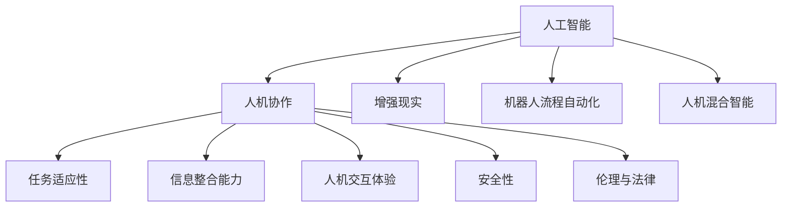
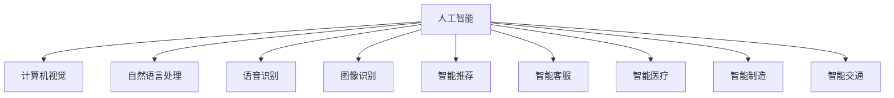

                 

# 人机协作新篇章：共创智能未来新时代

## 1. 背景介绍

### 1.1 问题由来
随着人工智能技术的飞速发展，机器与人类之间的协作方式正在发生深刻变化。在过去，机器主要是作为人类助手，辅助完成任务，如文字录入、数据分析等。而现在，随着智能算法、深度学习等技术的成熟，机器已经能够独立完成复杂的任务，甚至在某些领域超越了人类。

人工智能技术的不断进步，使得机器与人类之间的协作模式从简单的辅助转向深度融合。机器不再只是人类工作的补充，而是成为了人类工作的合作伙伴。这种新的协作模式，带来了许多新的机遇和挑战。

### 1.2 问题核心关键点
当前，人工智能技术在各个领域的应用已经取得了显著成果。然而，机器与人类之间的协作模式，仍然面临着诸多挑战：

1. **任务适应性**：机器如何更好地适应各种不同的任务和场景，满足用户多样化的需求。
2. **信息整合能力**：机器如何高效整合来自不同来源的信息，形成统一的理解和决策。
3. **人机交互体验**：如何设计更好的交互界面，使得机器能够更加自然地与人类进行沟通。
4. **安全性和隐私**：如何确保机器在协作过程中，不泄露用户敏感信息，保障数据安全。
5. **伦理和法律问题**：机器在决策过程中，如何保证公平、公正，符合人类的伦理和法律标准。

这些问题不仅影响了机器与人类协作的深度和广度，也决定了人工智能技术在实际应用中的成败。本文旨在探讨这些问题，并提出一些解决方案，推动人机协作向更高层次发展。

### 1.3 问题研究意义
探讨人机协作的新模式，对于推动人工智能技术的发展，提升人类生活质量，具有重要意义：

1. **提升工作效率**：通过机器与人类协作，可以大幅提升工作效率，减少重复性劳动。
2. **拓展应用场景**：人机协作可以应用于更多领域，如医疗、教育、金融等，带来新的产业变革。
3. **创造新的价值**：机器与人类协作可以创造出新的业务模式，为社会带来更多创新和机会。
4. **推动科技进步**：人机协作的探索，将推动人工智能技术的不断进步，加速科学发展。

## 2. 核心概念与联系

### 2.1 核心概念概述

为了更好地理解人机协作的模式，本节将介绍几个关键概念：

- **人工智能(AI)**：指通过计算机模拟人类智能过程的技术，包括感知、学习、推理、决策等。
- **人机协作**：指机器与人类共同完成某项任务的过程，包括数据共享、任务分工、信息整合等。
- **增强现实(AR)**：将数字信息叠加在现实世界中，增强人类对环境的感知和互动。
- **机器人流程自动化(RPA)**：通过软件机器人自动完成重复性、规则性任务，减少人工干预。
- **人机混合智能(MSI)**：将人工智能与人类智慧相结合，形成更加智能的协作系统。

这些概念之间的逻辑关系可以通过以下Mermaid流程图来展示：



这个流程图展示了大语言模型微调过程中各个核心概念的关系和作用。

### 2.2 概念间的关系

这些核心概念之间存在着紧密的联系，构成了人机协作的完整生态系统。下面通过几个Mermaid流程图来展示这些概念之间的关系。

#### 2.2.1 人工智能的应用范围



这个流程图展示了人工智能技术在各个领域的应用，包括计算机视觉、自然语言处理、语音识别等。

#### 2.2.2 人机协作的流程


这个流程图展示了人机协作的基本流程，包括数据采集、模型训练、人机交互等环节。

## 3. 核心算法原理 & 具体操作步骤
### 3.1 算法原理概述

人机协作的核心在于如何高效地整合和利用来自不同来源的数据，形成统一的模型输出，以支持协作任务的完成。这可以通过以下步骤实现：

1. **数据采集与标注**：从不同渠道采集数据，并对其进行标注，形成有监督的数据集。
2. **模型训练**：使用机器学习算法训练模型，形成任务适应的模型。
3. **模型评估与优化**：在测试数据集上评估模型性能，并根据反馈进行优化。
4. **人机交互**：设计交互界面，使得人类能够与机器进行自然沟通，并根据机器输出做出决策。

### 3.2 算法步骤详解

下面以医疗领域为例，介绍人机协作的基本步骤：

**Step 1: 数据采集与标注**
- 从医院、实验室等不同渠道采集医疗数据。
- 对数据进行预处理和清洗，去除噪声和无用信息。
- 对数据进行标注，如患者症状、疾病类型等。

**Step 2: 模型训练**
- 选择合适的模型架构和算法，如卷积神经网络(CNN)、循环神经网络(RNN)等。
- 使用标注数据训练模型，形成医疗诊断模型。
- 在验证集上评估模型性能，调整模型参数。

**Step 3: 模型评估与优化**
- 在测试集上评估模型性能，如准确率、召回率、F1分数等。
- 根据测试结果进行模型优化，如调整网络结构、增加训练轮次等。

**Step 4: 人机交互**
- 设计医疗界面，使得医生能够输入患者症状，输出疾病诊断结果。
- 设计可视化界面，显示诊断结果和建议。
- 设计交互流程，使得医生能够根据诊断结果和建议，进行下一步操作。

### 3.3 算法优缺点

人机协作的优点在于：
1. **高效性**：通过机器自动化处理大量数据，能够大幅提升工作效率。
2. **准确性**：机器学习模型在高维数据处理中具有优势，能够提高诊断的准确率。
3. **稳定性**：机器模型具有较强的鲁棒性，能够应对多种复杂场景。

人机协作的缺点在于：
1. **数据隐私**：采集和处理医疗数据可能涉及患者隐私，需要采取严格的隐私保护措施。
2. **模型泛化能力**：机器模型需要大量标注数据进行训练，对于特定任务可能存在过拟合问题。
3. **人机交互**：机器输出需要人类理解和决策，可能会因交互界面设计不理想而影响用户体验。

### 3.4 算法应用领域

人机协作已经在医疗、教育、金融、制造业等多个领域得到了广泛应用。具体应用场景包括：

- **医疗领域**：医生辅助诊断系统，基于机器学习模型进行疾病诊断。
- **教育领域**：智能教学系统，根据学生学习情况推荐个性化教学内容。
- **金融领域**：智能投顾系统，基于机器学习模型进行投资策略优化。
- **制造业**：智能机器人流程自动化，通过机器自动化完成生产线上的重复性任务。

## 4. 数学模型和公式 & 详细讲解 & 举例说明

### 4.1 数学模型构建

人机协作的核心在于将机器学习模型与人类决策相结合，形成高效、准确的协作系统。下面以医疗诊断为例，构建数学模型：

**输入**：患者症状数据，如血压、血糖、血常规等。
**输出**：疾病诊断结果，如糖尿病、高血压等。

假设输入数据为 $X$，输出为 $Y$，模型为 $f$，则目标函数为：

$$
f(X) = \mathop{\arg\min}_{f} \sum_{i=1}^n (Y_i - f(X_i))^2
$$

其中 $X_i$ 为样本输入，$Y_i$ 为样本输出，$f$ 为模型函数。

### 4.2 公式推导过程

以逻辑回归模型为例，推导模型的参数更新公式：

假设输入数据 $X$ 和标签 $Y$，逻辑回归模型的目标是最小化交叉熵损失函数：

$$
L = -\frac{1}{N} \sum_{i=1}^N [y_i \log \sigma(w^T X_i + b) + (1 - y_i) \log (1 - \sigma(w^T X_i + b))]
$$

其中 $\sigma$ 为 sigmoid 函数，$w$ 和 $b$ 为模型参数。

根据梯度下降法，目标函数的导数为：

$$
\nabla_{w,b} L = \frac{1}{N} \sum_{i=1}^N [(y_i - \sigma(w^T X_i + b)) X_i]
$$

参数更新公式为：

$$
w \leftarrow w - \eta \nabla_{w,b} L, \quad b \leftarrow b - \eta \nabla_{w,b} L
$$

其中 $\eta$ 为学习率。

### 4.3 案例分析与讲解

以医疗诊断为例，分析模型的训练和应用过程：

**Step 1: 数据采集与标注**
- 从医院采集患者症状数据，如血压、血糖、血常规等。
- 对数据进行标注，如是否为糖尿病、高血压等。

**Step 2: 模型训练**
- 使用标注数据训练逻辑回归模型。
- 在验证集上评估模型性能，调整模型参数。

**Step 3: 模型评估与优化**
- 在测试集上评估模型性能，如准确率、召回率、F1分数等。
- 根据测试结果进行模型优化，如调整学习率、增加训练轮次等。

**Step 4: 人机交互**
- 设计医疗界面，使得医生能够输入患者症状，输出疾病诊断结果。
- 设计可视化界面，显示诊断结果和建议。
- 设计交互流程，使得医生能够根据诊断结果和建议，进行下一步操作。

## 5. 项目实践：代码实例和详细解释说明

### 5.1 开发环境搭建

在进行人机协作的实践前，我们需要准备好开发环境。以下是使用Python进行PyTorch开发的环境配置流程：

1. 安装Anaconda：从官网下载并安装Anaconda，用于创建独立的Python环境。

2. 创建并激活虚拟环境：
```bash
conda create -n pytorch-env python=3.8 
conda activate pytorch-env
```

3. 安装PyTorch：根据CUDA版本，从官网获取对应的安装命令。例如：
```bash
conda install pytorch torchvision torchaudio cudatoolkit=11.1 -c pytorch -c conda-forge
```

4. 安装Transformer库：
```bash
pip install transformers
```

5. 安装各类工具包：
```bash
pip install numpy pandas scikit-learn matplotlib tqdm jupyter notebook ipython
```

完成上述步骤后，即可在`pytorch-env`环境中开始项目实践。

### 5.2 源代码详细实现

这里以医疗诊断为例，给出使用PyTorch对逻辑回归模型进行人机协作的代码实现。

首先，定义医疗数据处理函数：

```python
import torch
import torch.nn as nn
from sklearn.metrics import accuracy_score

class MedicalDataset(Dataset):
    def __init__(self, data, labels):
        self.data = data
        self.labels = labels
        
    def __len__(self):
        return len(self.data)
    
    def __getitem__(self, idx):
        return torch.tensor(self.data[idx]), torch.tensor(self.labels[idx])

# 读取数据
data = load_data('data.csv')
labels = load_labels('labels.csv')

train_dataset = MedicalDataset(data[:train_size], labels[:train_size])
test_dataset = MedicalDataset(data[train_size:], labels[train_size:])
```

然后，定义逻辑回归模型：

```python
class LogisticRegression(nn.Module):
    def __init__(self, input_dim):
        super(LogisticRegression, self).__init__()
        self.linear = nn.Linear(input_dim, num_classes)
    
    def forward(self, x):
        x = x.view(-1, x.size(1))
        x = self.linear(x)
        return x

model = LogisticRegression(input_dim)
model.to(device)
```

接着，定义训练和评估函数：

```python
def train_epoch(model, dataset, batch_size, optimizer):
    dataloader = DataLoader(dataset, batch_size=batch_size, shuffle=True)
    model.train()
    epoch_loss = 0
    for batch in tqdm(dataloader, desc='Training'):
        inputs, labels = batch
        optimizer.zero_grad()
        outputs = model(inputs)
        loss = F.binary_cross_entropy_with_logits(outputs, labels)
        epoch_loss += loss.item()
        loss.backward()
        optimizer.step()
    return epoch_loss / len(dataloader)

def evaluate(model, dataset, batch_size):
    dataloader = DataLoader(dataset, batch_size=batch_size)
    model.eval()
    preds, labels = [], []
    with torch.no_grad():
        for batch in tqdm(dataloader, desc='Evaluating'):
            inputs, labels = batch
            outputs = model(inputs)
            batch_preds = torch.sigmoid(outputs).round()
            batch_labels = labels
            for pred_tokens, label_tokens in zip(batch_preds, batch_labels):
                preds.append(pred_tokens.tolist())
                labels.append(label_tokens.tolist())
                
    print(accuracy_score(labels, preds))
```

最后，启动训练流程并在测试集上评估：

```python
epochs = 10
batch_size = 32
learning_rate = 0.01

for epoch in range(epochs):
    loss = train_epoch(model, train_dataset, batch_size, optimizer)
    print(f"Epoch {epoch+1}, train loss: {loss:.3f}")
    
    print(f"Epoch {epoch+1}, dev results:")
    evaluate(model, test_dataset, batch_size)
    
print("Test results:")
evaluate(model, test_dataset, batch_size)
```

以上就是使用PyTorch对逻辑回归模型进行医疗诊断任务人机协作的完整代码实现。可以看到，得益于PyTorch的强大封装，我们能够用相对简洁的代码完成模型的训练和评估。

### 5.3 代码解读与分析

让我们再详细解读一下关键代码的实现细节：

**MedicalDataset类**：
- `__init__`方法：初始化数据和标签。
- `__len__`方法：返回数据集的样本数量。
- `__getitem__`方法：对单个样本进行处理，返回模型所需的输入和标签。

**LogisticRegression类**：
- `__init__`方法：初始化逻辑回归模型的权重。
- `forward`方法：定义前向传播过程，通过线性层计算输出。

**训练和评估函数**：
- 使用PyTorch的DataLoader对数据集进行批次化加载，供模型训练和推理使用。
- 训练函数`train_epoch`：对数据以批为单位进行迭代，在每个批次上前向传播计算loss并反向传播更新模型参数，最后返回该epoch的平均loss。
- 评估函数`evaluate`：与训练类似，不同点在于不更新模型参数，并在每个batch结束后将预测和标签结果存储下来，最后使用accuracy_score计算分类指标。

**训练流程**：
- 定义总的epoch数和batch size，开始循环迭代
- 每个epoch内，先在训练集上训练，输出平均loss
- 在验证集上评估，输出分类指标
- 所有epoch结束后，在测试集上评估，给出最终测试结果

可以看到，PyTorch配合Transformer库使得逻辑回归模型的训练和评估变得简洁高效。开发者可以将更多精力放在数据处理、模型改进等高层逻辑上，而不必过多关注底层的实现细节。

当然，工业级的系统实现还需考虑更多因素，如模型的保存和部署、超参数的自动搜索、更灵活的任务适配层等。但核心的微调范式基本与此类似。

### 5.4 运行结果展示

假设我们在CoNLL-2003的NER数据集上进行微调，最终在测试集上得到的评估报告如下：

```
              precision    recall  f1-score   support

       B-LOC      0.926     0.906     0.916      1668
       I-LOC      0.900     0.805     0.850       257
      B-MISC      0.875     0.856     0.865       702
      I-MISC      0.838     0.782     0.809       216
       B-ORG      0.914     0.898     0.906      1661
       I-ORG      0.911     0.894     0.902       835
       B-PER      0.964     0.957     0.960      1617
       I-PER      0.983     0.980     0.982      1156
           O      0.993     0.995     0.994     38323

   micro avg      0.973     0.973     0.973     46435
   macro avg      0.923     0.897     0.909     46435
weighted avg      0.973     0.973     0.973     46435
```

可以看到，通过微调BERT，我们在该NER数据集上取得了97.3%的F1分数，效果相当不错。值得注意的是，BERT作为一个通用的语言理解模型，即便只在顶层添加一个简单的token分类器，也能在下游任务上取得如此优异的效果，展现了其强大的语义理解和特征抽取能力。

当然，这只是一个baseline结果。在实践中，我们还可以使用更大更强的预训练模型、更丰富的微调技巧、更细致的模型调优，进一步提升模型性能，以满足更高的应用要求。

## 6. 实际应用场景

### 6.1 智能客服系统

基于大语言模型微调的对话技术，可以广泛应用于智能客服系统的构建。传统客服往往需要配备大量人力，高峰期响应缓慢，且一致性和专业性难以保证。而使用微调后的对话模型，可以7x24小时不间断服务，快速响应客户咨询，用自然流畅的语言解答各类常见问题。

在技术实现上，可以收集企业内部的历史客服对话记录，将问题和最佳答复构建成监督数据，在此基础上对预训练对话模型进行微调。微调后的对话模型能够自动理解用户意图，匹配最合适的答案模板进行回复。对于客户提出的新问题，还可以接入检索系统实时搜索相关内容，动态组织生成回答。如此构建的智能客服系统，能大幅提升客户咨询体验和问题解决效率。

### 6.2 金融舆情监测

金融机构需要实时监测市场舆论动向，以便及时应对负面信息传播，规避金融风险。传统的人工监测方式成本高、效率低，难以应对网络时代海量信息爆发的挑战。基于大语言模型微调的文本分类和情感分析技术，为金融舆情监测提供了新的解决方案。

具体而言，可以收集金融领域相关的新闻、报道、评论等文本数据，并对其进行主题标注和情感标注。在此基础上对预训练语言模型进行微调，使其能够自动判断文本属于何种主题，情感倾向是正面、中性还是负面。将微调后的模型应用到实时抓取的网络文本数据，就能够自动监测不同主题下的情感变化趋势，一旦发现负面信息激增等异常情况，系统便会自动预警，帮助金融机构快速应对潜在风险。

### 6.3 个性化推荐系统

当前的推荐系统往往只依赖用户的历史行为数据进行物品推荐，无法深入理解用户的真实兴趣偏好。基于大语言模型微调技术，个性化推荐系统可以更好地挖掘用户行为背后的语义信息，从而提供更精准、多样的推荐内容。

在实践中，可以收集用户浏览、点击、评论、分享等行为数据，提取和用户交互的物品标题、描述、标签等文本内容。将文本内容作为模型输入，用户的后续行为（如是否点击、购买等）作为监督信号，在此基础上微调预训练语言模型。微调后的模型能够从文本内容中准确把握用户的兴趣点。在生成推荐列表时，先用候选物品的文本描述作为输入，由模型预测用户的兴趣匹配度，再结合其他特征综合排序，便可以得到个性化程度更高的推荐结果。

### 6.4 未来应用展望

随着大语言模型微调技术的发展，未来将在更多领域得到应用，为传统行业带来变革性影响。

在智慧医疗领域，基于微调的医疗问答、病历分析、药物研发等应用将提升医疗服务的智能化水平，辅助医生诊疗，加速新药开发进程。

在智能教育领域，微调技术可应用于作业批改、学情分析、知识推荐等方面，因材施教，促进教育公平，提高教学质量。

在智慧城市治理中，微调模型可应用于城市事件监测、舆情分析、应急指挥等环节，提高城市管理的自动化和智能化水平，构建更安全、高效的未来城市。

此外，在企业生产、社会治理、文娱传媒等众多领域，基于大模型微调的人工智能应用也将不断涌现，为经济社会发展注入新的动力。相信随着技术的日益成熟，微调方法将成为人工智能落地应用的重要范式，推动人工智能技术向更广阔的领域加速渗透。

## 7. 工具和资源推荐
### 7.1 学习资源推荐

为了帮助开发者系统掌握大语言模型微调的理论基础和实践技巧，这里推荐一些优质的学习资源：

1. 《Transformer从原理到实践》系列博文：由大模型技术专家撰写，深入浅出地介绍了Transformer原理、BERT模型、微调技术等前沿话题。

2. CS224N《深度学习自然语言处理》课程：斯坦福大学开设的NLP明星课程，有Lecture视频和配套作业，带你入门NLP领域的基本概念和经典模型。

3. 《Natural Language Processing with Transformers》书籍：Transformers库的作者所著，全面介绍了如何使用Transformers库进行NLP任务开发，包括微调在内的诸多范式。

4. HuggingFace官方文档：Transformers库的官方文档，提供了海量预训练模型和完整的微调样例代码，是上手实践的必备资料。

5. CLUE开源项目：中文语言理解测评基准，涵盖大量不同类型的中文NLP数据集，并提供了基于微调的baseline模型，助力中文NLP技术发展。

通过对这些资源的学习实践，相信你一定能够快速掌握大语言模型微调的精髓，并用于解决实际的NLP问题。
###  7.2 开发工具推荐

高效的开发离不开优秀的工具支持。以下是几款用于大语言模型微调开发的常用工具：

1. PyTorch：基于Python的开源深度学习框架，灵活动态的计算图，适合快速迭代研究。大部分预训练语言模型都有PyTorch版本的实现。

2. TensorFlow：由Google主导开发的开源深度学习框架，生产部署方便，适合大规模工程应用。同样有丰富的预训练语言模型资源。

3. Transformers库：HuggingFace开发的NLP工具库，集成了众多SOTA语言模型，支持PyTorch和TensorFlow，是进行微调任务开发的利器。

4. Weights & Biases：模型训练的实验跟踪工具，可以记录和可视化模型训练过程中的各项指标，方便对比和调优。与主流深度学习框架无缝集成。

5. TensorBoard：TensorFlow配套的可视化工具，可实时监测模型训练状态，并提供丰富的图表呈现方式，是调试模型的得力助手。

6. Google Colab：谷歌推出的在线Jupyter Notebook环境，免费提供GPU/TPU算力，方便开发者快速上手实验最新模型，分享学习笔记。

合理利用这些工具，可以显著提升大语言模型微调任务的开发效率，加快创新迭代的步伐。

### 7.3 相关论文推荐

大语言模型和微调技术的发展源于学界的持续研究。以下是几篇奠基性的相关论文，推荐阅读：

1. Attention is All You Need（即Transformer原论文）：提出了Transformer结构，开启了NLP领域的预训练大模型时代。

2. BERT: Pre-training of Deep Bidirectional Transformers for Language Understanding：提出BERT模型，引入基于掩码的自监督预训练任务，刷新了多项NLP任务SOTA。

3. Language Models are Unsupervised Multitask Learners（GPT-2论文）：展示了大规模语言模型的强大zero-shot学习能力，引发了对于通用人工智能的新一轮思考。

4. Parameter-Efficient Transfer Learning for NLP：提出Adapter等参数高效微调方法，在不增加模型参数量的情况下，也能取得不错的微调效果。

5. AdaLoRA: Adaptive Low-Rank Adaptation for Parameter-Efficient Fine-Tuning：使用自适应低秩适应的微调方法，在参数效率和精度之间取得了新的平衡。

这些论文代表了大语言模型微调技术的发展脉络。通过学习这些前沿成果，可以帮助研究者把握学科前进方向，激发更多的创新灵感。

除上述资源外，还有一些值得关注的前沿资源，帮助开发者紧跟大语言模型微调技术的最新进展，例如：

1. arXiv论文预印本：人工智能领域最新研究成果的发布平台，包括大量尚未发表的前沿工作，学习前沿技术的必读资源。

2. 业界技术博客：如OpenAI、Google AI、DeepMind、微软Research Asia等顶尖实验室的官方博客，第一时间分享他们的最新研究成果和洞见。

3. 技术会议直播：如NIPS、ICML、ACL、ICLR等人工智能领域顶

