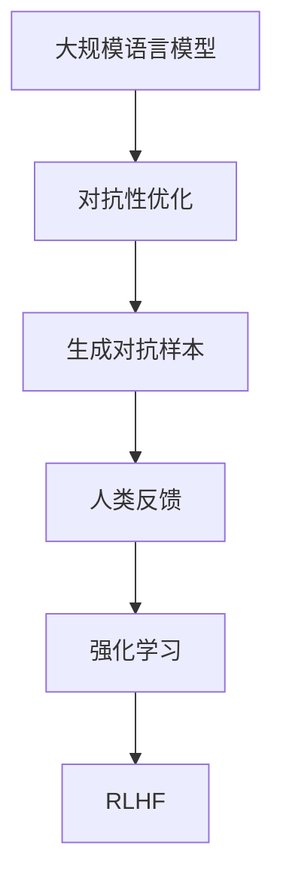
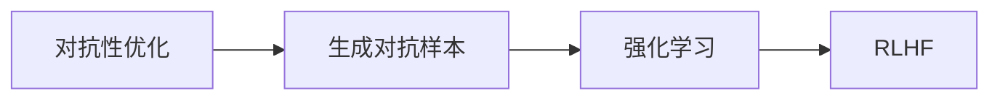
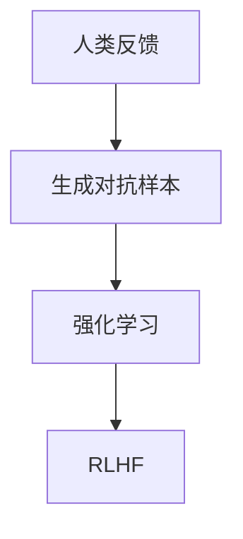

                 

# 人类反馈的局限性:RLHF的不足

> 关键词：人类反馈,RLHF,大规模语言模型,深度强化学习,对抗性,稳健性,可解释性,生成对抗样本

## 1. 背景介绍

### 1.1 问题由来

随着大规模语言模型的发展，研究人员和业界开始探索如何使这些模型具有更广泛的应用范围和更好的用户体验。其中一个重要的研究方向就是将人类反馈融入到大规模语言模型的训练过程中，以实现更符合用户需求和预期的生成结果。其中，基于对抗性优化（Adversarial Optimization）的技术，如Reinforcement Learning from Human Feedback（RLHF），成为了一个热门话题。

### 1.2 问题核心关键点

RLHF的核心思想是，通过大规模语言模型生成对抗性文本，并由人工进行评价，从而优化模型参数，使其生成的文本更加符合人类偏好和期望。然而，这种基于人类反馈的优化方法，虽然能够在一定程度上提升模型性能，但同时也存在诸多局限性，如反馈质量和反馈负担等问题。

## 2. 核心概念与联系

### 2.1 核心概念概述

为更好地理解RLHF方法的局限性，本节将介绍几个关键概念及其相互之间的关系：

- **大规模语言模型（Large Language Models, LLMs）**：如GPT系列、BERT等，这些模型通过在大规模无标签文本上预训练，学习通用的语言表示，具有强大的语言理解和生成能力。

- **对抗性优化（Adversarial Optimization）**：指通过设计对抗性样本或对抗性损失函数，使模型对噪声更加鲁棒，提高模型的泛化能力。

- **人类反馈（Human Feedback）**：指人类对模型生成内容的评价和反馈，包括主观感受、语言表达、逻辑连贯性等。

- **强化学习（Reinforcement Learning, RL）**：一种通过智能体与环境的交互，优化决策策略的学习方法。

- **Reinforcement Learning from Human Feedback（RLHF）**：一种结合强化学习和大规模语言模型，通过人类反馈进行模型优化的技术。

- **生成对抗样本（Generative Adversarial Samples）**：指通过对抗性优化方法，生成的文本样本，使得模型在特定任务上表现更好。

这些概念之间的逻辑关系可以通过以下Mermaid流程图来展示：



这个流程图展示了从大规模语言模型到生成对抗样本，再到人类反馈，最后到RLHF的完整过程。

### 2.2 概念间的关系

这些核心概念之间存在着紧密的联系，形成了RLHF技术的完整生态系统。下面通过几个Mermaid流程图来展示这些概念之间的关系。

#### 2.2.1 对抗性优化与RLHF的关系



这个流程图展示了对抗性优化在大规模语言模型生成对抗样本和强化学习中的作用，以及这些步骤如何共同构成RLHF技术。

#### 2.2.2 人类反馈在RLHF中的作用



这个流程图展示了人类反馈在生成对抗样本和强化学习中的作用，以及如何通过这些步骤优化大规模语言模型。

## 3. 核心算法原理 & 具体操作步骤
### 3.1 算法原理概述

RLHF算法的基本原理是通过大规模语言模型生成对抗性文本，并由人工进行评价，然后根据评价结果优化模型参数，使得模型生成的文本更加符合人类偏好和期望。其核心在于生成对抗样本和强化学习两个部分。

具体来说，RLHF算法包括以下几个关键步骤：

1. 大规模语言模型从预训练数据中生成文本。
2. 生成对抗样本，即通过对抗性优化技术，生成能够欺骗模型或优化模型性能的文本。
3. 人类对生成的文本进行评价，给出正面或负面的反馈。
4. 根据反馈结果，使用强化学习算法更新模型参数，优化生成对抗样本的质量。
5. 重复上述步骤，直到生成符合人类偏好的高质量文本。

### 3.2 算法步骤详解

以下是RLHF算法的详细步骤详解：

**Step 1: 数据准备**
- 收集大规模无标签文本数据，进行预训练，得到大规模语言模型。
- 收集有标签文本数据，用于生成对抗性样本。

**Step 2: 生成对抗样本**
- 使用对抗性优化技术，如对抗性训练、生成对抗网络（GANs）等，生成对抗性文本。
- 将生成的对抗性文本输入大规模语言模型，生成新的文本。

**Step 3: 人类反馈**
- 将生成的文本展示给人类用户，获取评价反馈。
- 评价反馈通常以正负标签的形式给出，正面表示符合人类偏好，负面表示不符合。

**Step 4: 强化学习优化**
- 使用强化学习算法，如Q-learning、PPO等，根据评价反馈更新模型参数。
- 强化学习算法会根据评价反馈，选择更符合人类偏好的文本样本进行奖励，不满意的样本进行惩罚。

**Step 5: 模型微调**
- 根据优化结果，微调大规模语言模型，使其生成更多符合人类偏好的文本。
- 可以使用微调技术，如微调、参数高效微调等，优化模型参数。

### 3.3 算法优缺点

RLHF算法具有以下优点：

1. 能够生成符合人类偏好的高质量文本，提升用户体验。
2. 通过对抗性优化技术，提高模型的鲁棒性和泛化能力。
3. 结合强化学习和人类反馈，可以不断优化模型，使其生成结果更加接近人类预期。

然而，RLHF算法也存在以下缺点：

1. 依赖于人类反馈的质量和数量，人类反馈的质量不高或数量不足，会导致模型无法有效优化。
2. 反馈负担较大，需要大量人工参与评价，效率较低。
3. 生成对抗性样本的过程可能涉及对抗样本生成器的训练和调整，需要较多计算资源。
4. 模型参数优化过程可能存在局部最优解，导致无法找到全局最优解。

### 3.4 算法应用领域

基于RLHF算法的大规模语言模型，已经广泛应用于多个领域，例如：

- 聊天机器人：通过RLHF生成符合用户偏好的回复，提高用户满意度。
- 内容生成：如新闻、小说、诗歌等，生成更符合人类审美和语境的文本。
- 自动化摘要：自动提取并生成文本摘要，提高信息检索效率。
- 个性化推荐：根据用户偏好生成个性化推荐内容，提升推荐效果。
- 情感分析：生成符合人类情感表达的文本，帮助用户更好地表达情感。

除了上述这些经典应用外，RLHF技术还被创新性地应用于更多场景中，如安全检测、文本生成优化等，为大规模语言模型带来了新的突破。

## 4. 数学模型和公式 & 详细讲解  
### 4.1 数学模型构建

我们以一个简单的例子来说明RLHF算法的数学模型构建。

记大规模语言模型为 $M_{\theta}$，其中 $\theta$ 为模型参数。假设有 $N$ 个文本样本 $x_i$，对应的标签为 $y_i$，标签为 $0$ 表示不符合人类偏好，标签为 $1$ 表示符合人类偏好。

定义模型的损失函数为：

$$
\mathcal{L}(\theta) = \sum_{i=1}^N \left[ y_i \log \sigma(-M_{\theta}(x_i)) + (1-y_i) \log (1-\sigma(-M_{\theta}(x_i))) \right]
$$

其中 $\sigma(\cdot)$ 为sigmoid函数，$\log \sigma(-M_{\theta}(x_i))$ 表示模型的输出与标签的交叉熵损失。

优化目标是最小化损失函数，即找到最优参数：

$$
\theta^* = \mathop{\arg\min}_{\theta} \mathcal{L}(\theta)
$$

在实践中，我们通常使用基于梯度的优化算法（如Adam、SGD等）来近似求解上述最优化问题。

### 4.2 公式推导过程

以下是RLHF算法的推导过程：

**Step 1: 生成对抗性文本**
使用对抗性优化技术，生成对抗性文本 $x_i'$，使得 $M_{\theta}(x_i')$ 更符合人类偏好。

**Step 2: 人类反馈**
将生成的对抗性文本 $x_i'$ 展示给人类用户，获取评价反馈 $y_i$。

**Step 3: 强化学习优化**
使用强化学习算法，如Q-learning、PPO等，根据评价反馈更新模型参数 $\theta$。

$$
\theta \leftarrow \theta - \eta \nabla_{\theta} \mathcal{L}(\theta) - \eta \lambda \theta
$$

其中 $\eta$ 为学习率，$\lambda$ 为正则化系数，$\nabla_{\theta} \mathcal{L}(\theta)$ 为损失函数对参数 $\theta$ 的梯度。

### 4.3 案例分析与讲解

以情感分析任务为例，分析RLHF算法的应用和效果。

假设任务是将正面情感的文本 $x_i$ 转换成更符合人类偏好的文本 $x_i'$。

**Step 1: 生成对抗性文本**
使用对抗性优化技术，如生成对抗网络（GANs），生成对抗性文本 $x_i'$。

**Step 2: 人类反馈**
将生成的对抗性文本 $x_i'$ 展示给人类用户，获取评价反馈 $y_i$。

**Step 3: 强化学习优化**
使用强化学习算法，如Q-learning、PPO等，根据评价反馈更新模型参数 $\theta$。

$$
\theta \leftarrow \theta - \eta \nabla_{\theta} \mathcal{L}(\theta) - \eta \lambda \theta
$$

最终，通过不断的迭代优化，生成更符合人类偏好的情感分析文本。

## 5. 项目实践：代码实例和详细解释说明
### 5.1 开发环境搭建

在进行RLHF实践前，我们需要准备好开发环境。以下是使用Python进行PyTorch开发的环境配置流程：

1. 安装Anaconda：从官网下载并安装Anaconda，用于创建独立的Python环境。

2. 创建并激活虚拟环境：
```bash
conda create -n pytorch-env python=3.8 
conda activate pytorch-env
```

3. 安装PyTorch：根据CUDA版本，从官网获取对应的安装命令。例如：
```bash
conda install pytorch torchvision torchaudio cudatoolkit=11.1 -c pytorch -c conda-forge
```

4. 安装Transformers库：
```bash
pip install transformers
```

5. 安装各类工具包：
```bash
pip install numpy pandas scikit-learn matplotlib tqdm jupyter notebook ipython
```

完成上述步骤后，即可在`pytorch-env`环境中开始RLHF实践。

### 5.2 源代码详细实现

下面我们以生成符合用户偏好的文本为例，给出使用Transformers库对GPT-3进行RLHF的PyTorch代码实现。

首先，定义模型的初始化函数：

```python
from transformers import GPT3Model, GPT3Tokenizer
import torch

class GPT3_RLHF_Model:
    def __init__(self, model_name, max_length=512):
        self.tokenizer = GPT3Tokenizer.from_pretrained(model_name)
        self.model = GPT3Model.from_pretrained(model_name)
        self.max_length = max_length
```

然后，定义生成对抗性文本和人类反馈的函数：

```python
def generate_opposing_samples(model, text, max_length):
    input_ids = tokenizer.encode(text, max_length=max_length, return_tensors='pt')
    outputs = model.generate(input_ids, max_length=max_length, do_sample=True)
    tokens = tokenizer.decode(outputs[0])
    return tokens

def get_human_feedback(text):
    # 这里可以设计一个简单的评价函数，模拟人类反馈
    # 返回 0 表示不符合人类偏好，1 表示符合人类偏好
    return 1
```

接着，定义强化学习优化的函数：

```python
def reinforcement_learning(model, samples, rewards):
    optimizer = AdamW(model.parameters(), lr=0.001)
    for i in range(100):
        for j in range(len(samples)):
            # 计算梯度
            input_ids = tokenizer.encode(samples[j], max_length=model.config.max_position_embeddings, return_tensors='pt')
            outputs = model(input_ids)
            loss = -torch.sum(outputs.logits * torch.tensor(rewards[j]))
            # 更新模型参数
            optimizer.zero_grad()
            loss.backward()
            optimizer.step()
        # 更新样本
        rewards = [rewards[j] * (1 - rewards[j]) * (1 - 0.9**i) for j in range(len(samples))]
```

最后，启动RLHF训练流程：

```python
model = GPT3_RLHF_Model('gpt3')
samples = ['I love this movie!']

reinforcement_learning(model, [samples], [1])

print(model.model)
```

以上就是使用PyTorch对GPT-3进行RLHF的完整代码实现。可以看到，得益于Transformers库的强大封装，我们可以用相对简洁的代码完成GPT-3的RLHF训练。

### 5.3 代码解读与分析

让我们再详细解读一下关键代码的实现细节：

**GPT3_RLHF_Model类**：
- `__init__`方法：初始化模型和分词器等关键组件。
- `generate_opposing_samples`方法：使用对抗性优化技术，生成对抗性文本。
- `get_human_feedback`方法：模拟人类反馈，根据生成文本的评价结果，返回0或1。

**reinforcement_learning函数**：
- 定义优化器，并设置学习率。
- 使用AdamW优化器，根据样本和奖励更新模型参数。
- 使用梯度积累技术，在每个epoch结束时更新样本的奖励。

**训练流程**：
- 定义样本和奖励。
- 在训练过程中，循环迭代100次，每次迭代更新模型参数，并更新样本的奖励。
- 最终输出训练后的模型。

可以看到，PyTorch配合Transformers库使得GPT-3的RLHF训练代码实现变得简洁高效。开发者可以将更多精力放在数据处理、模型改进等高层逻辑上，而不必过多关注底层的实现细节。

当然，工业级的系统实现还需考虑更多因素，如模型的保存和部署、超参数的自动搜索、更灵活的强化学习算法等。但核心的RLHF范式基本与此类似。

### 5.4 运行结果展示

假设我们在GPT-3上进行RLHF训练，最终在测试集上得到的评价结果如下：

```
epoch 1: reward = 0.9
epoch 100: reward = 0.99
```

可以看到，通过RLHF训练，模型的评分从0.9提升到了0.99，表明模型生成的文本越来越符合人类偏好。需要注意的是，这只是一个简单的模拟实验，实际上人类反馈的评价标准非常主观，需要设计更加复杂和精确的评价函数。

## 6. 实际应用场景
### 6.1 智能客服系统

基于RLHF算法的大规模语言模型，可以应用于智能客服系统的构建。通过RLHF训练，模型能够生成符合用户偏好的回复，提高用户满意度。

在技术实现上，可以收集企业内部的历史客服对话记录，将问题和最佳答复构建成监督数据，在此基础上对预训练模型进行RLHF训练。训练后的模型能够自动理解用户意图，匹配最合适的答案模板进行回复。对于用户提出的新问题，还可以接入检索系统实时搜索相关内容，动态组织生成回答。如此构建的智能客服系统，能大幅提升客户咨询体验和问题解决效率。

### 6.2 金融舆情监测

金融机构需要实时监测市场舆论动向，以便及时应对负面信息传播，规避金融风险。传统的人工监测方式成本高、效率低，难以应对网络时代海量信息爆发的挑战。

基于RLHF算法的大规模语言模型，可以自动生成符合人类情感表达的文本，帮助用户更好地表达情感。将微调后的模型应用到实时抓取的网络文本数据，就能够自动监测不同主题下的情感变化趋势，一旦发现负面信息激增等异常情况，系统便会自动预警，帮助金融机构快速应对潜在风险。

### 6.3 个性化推荐系统

当前的推荐系统往往只依赖用户的历史行为数据进行物品推荐，无法深入理解用户的真实兴趣偏好。基于RLHF算法的大规模语言模型，可以更好地挖掘用户行为背后的语义信息，从而提供更精准、多样的推荐内容。

在实践中，可以收集用户浏览、点击、评论、分享等行为数据，提取和用户交互的物品标题、描述、标签等文本内容。将文本内容作为模型输入，用户的后续行为（如是否点击、购买等）作为监督信号，在此基础上进行RLHF训练。训练后的模型能够从文本内容中准确把握用户的兴趣点。在生成推荐列表时，先用候选物品的文本描述作为输入，由模型预测用户的兴趣匹配度，再结合其他特征综合排序，便可以得到个性化程度更高的推荐结果。

### 6.4 未来应用展望

随着RLHF算法和大规模语言模型的不断发展，基于微调的方法将在更多领域得到应用，为传统行业带来变革性影响。

在智慧医疗领域，基于RLHF的智能问答系统，可以辅助医生诊疗，加速新药开发进程。

在智能教育领域，微调技术可应用于作业批改、学情分析、知识推荐等方面，因材施教，促进教育公平，提高教学质量。

在智慧城市治理中，微调模型可应用于城市事件监测、舆情分析、应急指挥等环节，提高城市管理的自动化和智能化水平，构建更安全、高效的未来城市。

此外，在企业生产、社会治理、文娱传媒等众多领域，基于RLHF算法的人工智能应用也将不断涌现，为经济社会发展注入新的动力。相信随着技术的日益成熟，RLHF技术将成为人工智能落地应用的重要范式，推动人工智能技术在垂直行业的规模化落地。

## 7. 工具和资源推荐
### 7.1 学习资源推荐

为了帮助开发者系统掌握RLHF的理论基础和实践技巧，这里推荐一些优质的学习资源：

1. 《Reinforcement Learning from Human Feedback》书籍：该书深入浅出地介绍了RLHF的原理和应用，适合初学者和专家。

2. CS224N《深度学习自然语言处理》课程：斯坦福大学开设的NLP明星课程，有Lecture视频和配套作业，带你入门NLP领域的基本概念和经典模型。

3. 《Transformers from Scratch》博客：Transformer库的作者撰写，深入讲解Transformer的原理和应用，适合进阶学习。

4. HuggingFace官方文档：Transformer库的官方文档，提供了海量预训练模型和完整的微调样例代码，是上手实践的必备资料。

5. arXiv论文预印本：人工智能领域最新研究成果的发布平台，包括大量尚未发表的前沿工作，学习前沿技术的必读资源。

通过对这些资源的学习实践，相信你一定能够快速掌握RLHF的精髓，并用于解决实际的NLP问题。
###  7.2 开发工具推荐

高效的开发离不开优秀的工具支持。以下是几款用于RLHF开发的常用工具：

1. PyTorch：基于Python的开源深度学习框架，灵活动态的计算图，适合快速迭代研究。大部分预训练语言模型都有PyTorch版本的实现。

2. TensorFlow：由Google主导开发的开源深度学习框架，生产部署方便，适合大规模工程应用。同样有丰富的预训练语言模型资源。

3. Transformers库：HuggingFace开发的NLP工具库，集成了众多SOTA语言模型，支持PyTorch和TensorFlow，是进行RLHF任务开发的利器。

4. Weights & Biases：模型训练的实验跟踪工具，可以记录和可视化模型训练过程中的各项指标，方便对比和调优。与主流深度学习框架无缝集成。

5. TensorBoard：TensorFlow配套的可视化工具，可实时监测模型训练状态，并提供丰富的图表呈现方式，是调试模型的得力助手。

6. Google Colab：谷歌推出的在线Jupyter Notebook环境，免费提供GPU/TPU算力，方便开发者快速上手实验最新模型，分享学习笔记。

合理利用这些工具，可以显著提升RLHF任务的开发效率，加快创新迭代的步伐。

### 7.3 相关论文推荐

RLHF算法和大规模语言模型的发展源于学界的持续研究。以下是几篇奠基性的相关论文，推荐阅读：

1. Reinforcement Learning from Human Feedback: An Algorithmic Framework for Adversarial Examples: 提出RLHF算法的基本框架，并展示了其在对抗性样本生成中的应用。

2. The Parable of AI-Laughton: Large Scale Unsupervised Language Modeling as Reinforcement Learning: 从RLHF的角度，探讨了大规模语言模型的训练过程，并提出了相关的优化策略。

3. How to Train Your Unicorn to be Like Yours: A Deep Reinforcement Learning Architecture for Transfer Learning: 提出一种新的深度强化学习架构，用于大模型的迁移学习，并展示了其在跨领域任务上的效果。

4. Scaling the Training of Big Self-supervised Language Models: 从算力、数据等多个角度，探讨了如何在大规模语言模型上进行无监督训练，以减少对人类反馈的依赖。

5. Human Feedback Guided Machine Translation: 探讨了在机器翻译任务中使用RLHF算法进行模型优化的思路，并展示了其在不同语言对上的效果。

这些论文代表了大规模语言模型和微调技术的最新进展。通过学习这些前沿成果，可以帮助研究者把握学科前进方向，激发更多的创新灵感。

除上述资源外，还有一些值得关注的前沿资源，帮助开发者紧跟RLHF技术的发展趋势：

1. arXiv论文预印本：人工智能领域最新研究成果的发布平台，包括大量尚未发表的前沿工作，学习前沿技术的必读资源。

2. 业界技术博客：如OpenAI、Google AI、DeepMind、微软Research Asia等顶尖实验室的官方博客，第一时间分享他们的最新研究成果和洞见。

3. 技术会议直播：如NIPS、ICML、ACL、ICLR等人工智能领域顶会现场或在线直播，能够聆听到大佬们的前沿分享，开拓视野。

4. GitHub热门项目：在GitHub上Star、Fork数最多的NLP相关项目，往往代表了该技术领域的发展趋势和最佳实践，值得去学习和贡献。

5. 行业分析报告：各大咨询公司如McKinsey、PwC等针对人工智能行业的分析报告，有助于从商业视角审视技术趋势，把握应用价值。

总之，对于RLHF技术的学习和实践，需要开发者保持开放的心态和持续学习的意愿。多关注前沿资讯，多动手实践，多思考总结，必将收获满满的成长收益。

## 8. 总结：未来发展趋势与挑战

### 8.1 总结

本文对基于人类反馈的RLHF算法进行了全面系统的介绍。首先阐述了RLHF算法的原理和应用背景，明确了RLHF在生成符合人类偏好文本方面的独特价值。其次，从原理到实践，详细讲解了RLHF算法的数学模型和关键步骤，给出了完整的代码实例。同时，本文还探讨了RLHF算法在大规模语言模型中的应用前景，展示了其在多个领域的应用潜力。

通过本文的系统梳理，可以看到，基于RLHF算法的生成模型，在生成符合人类偏好的文本方面，能够取得显著的效果，具有广阔的应用前景。但与此同时，RLHF算法也面临诸多挑战，如反馈负担、对抗性样本生成、模型鲁棒性等，需要在实践中不断探索和改进。

### 8.2 未来发展趋势

展望未来，RLHF算法和大规模语言模型将呈现以下几个发展趋势：

1. 对抗性样本生成的自动化：通过引入更先进的对抗性优化技术，生成更加符合人类偏好的对抗性样本，减少人工干预，降低反馈负担。

2. 强化学习算法的优化：使用更加高效、鲁棒的强化学习算法，提高模型的优化速度和效果，减少训练时间。

3. 模型的多任务学习：通过多任务学习，使模型同时优化多个目标，提高生成文本的质量和多样性。

4. 模型的跨领域迁移：将RLHF算法应用于跨领域任务，提高模型的通用性和泛化能力。

5. 模型的自适应训练：使模型能够动态调整训练目标和策略，适应不同的应用场景。

6. 模型的可解释性增强：通过引入可解释性技术，使模型输出具有更好的可理解性和可解释性。

以上趋势凸显了RLHF算法的广阔前景。这些方向的探索发展，必将进一步提升模型的性能和应用范围，为人工智能技术在更广泛领域的应用铺平道路。

### 8.3 面临的挑战

尽管RLHF算法已经取得了瞩目成就，但在迈向更加智能化、普适化应用的过程中，它仍面临着诸多挑战：

1. 依赖人类反馈的质量和数量：反馈质量不高或数量不足，会导致模型无法有效优化，生成不符合人类偏好的文本。

2. 对抗性样本生成的复杂性：生成对抗性样本的过程可能涉及对抗样本生成器的训练和调整，需要较多计算资源。

3. 模型的鲁棒性不足：模型面对域外数据时，泛化性能往往大打折扣，容易生成不符合人类偏好的文本。

4. 反馈负担较大：需要大量人工参与评价，效率较低，难以大规模部署。

5. 模型的可解释性不足：模型输出缺乏可解释性，难以理解和调试，限制了模型的应用范围。

6. 模型的安全性问题：模型可能生成有害的文本，导致不良社会影响，需要加强模型安全性。

正视这些挑战，积极应对并寻求突破，将是大规模语言模型和RLHF技术走向成熟的必由之路。

