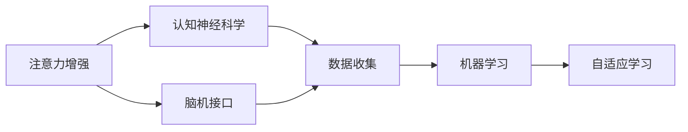

                 

# 人类注意力增强：提升专注力和注意力在教育中的未来发展

> 关键词：注意力增强, 教育技术, 认知神经科学, 机器学习, 脑机接口, 自适应学习, 未来教育

## 1. 背景介绍

在信息爆炸和数字化时代，注意力资源成为稀缺且宝贵的资源。无论是学术研究、商业决策还是日常工作，注意力都是影响表现的关键因素。特别是在教育和培训领域，学生和员工的注意力集中度直接决定了学习效率和工作效果。如何提升注意力资源，成为学术界和工业界长期关注的问题。

近年来，随着认知神经科学和人工智能的交叉发展，借助机器学习和脑机接口技术，提升注意力的研究取得了一些突破性进展。这些进展不仅为教育技术的发展提供了新思路，也为未来教育的数字化转型带来了新的可能。

本文聚焦于提升人类注意力的技术路径，详细介绍基于认知神经科学原理的注意力增强方法，并探索其在教育中的应用前景。

## 2. 核心概念与联系

### 2.1 核心概念概述

为了更深入理解注意力增强技术及其在教育中的应用，我们首先需要定义几个核心概念：

- **注意力**：指个体选择和维持信息加工对象的能力。注意力广泛存在于各种认知和行为任务中，是信息加工的基础。

- **认知神经科学**：研究认知过程和行为背后的神经机制。通过脑成像技术和电生理记录，探讨认知过程与脑活动的关系。

- **机器学习**：通过算法自动分析数据，学习模型来预测和优化行为。

- **脑机接口**：通过神经活动与机器的交互，实现人脑与计算机的直接通讯。

- **自适应学习**：根据学习者的状态和表现，动态调整学习内容和难度，以提升学习效果。

这些概念之间存在密切的联系。脑机接口技术的进步，使得我们能够实时监控和调控大脑活动，为注意力增强提供了数据支撑。机器学习技术可以分析这些数据，构建模型来预测和优化注意力表现。而自适应学习则通过模型预测，动态调整学习内容和进度，从而提升学习效果。

### 2.2 概念间的关系

通过以下Mermaid流程图，我们可以更清晰地展示这些核心概念之间的联系：



这个流程图展示了注意力增强技术的基本架构：

1. 从认知神经科学中获取对注意力的理解。
2. 利用脑机接口技术收集注意力相关的脑活动数据。
3. 将收集的数据输入机器学习模型，学习注意力特征与行为表现之间的关系。
4. 将机器学习模型应用于自适应学习系统，动态调整学习内容和进度，提升注意力和表现。

## 3. 核心算法原理 & 具体操作步骤
### 3.1 算法原理概述

注意力增强的核心在于通过实时监控和调控大脑活动，提升学习者对信息的注意和处理能力。该技术主要包含以下几个关键环节：

1. **数据采集**：通过脑机接口设备（如脑电图EEG、功能性磁共振成像fMRI等），实时采集学习者的大脑活动信号。
2. **信号处理**：利用信号处理技术（如独立成分分析ICA、时间频率分析等），提取与注意力相关的特征。
3. **模型训练**：通过机器学习算法（如支持向量机SVM、深度学习CNN等），训练模型预测注意力状态。
4. **注意力调控**：根据模型预测，动态调整学习内容和学习进度，引导学习者进入最佳注意力状态。

### 3.2 算法步骤详解

下面详细介绍注意力增强技术的详细步骤：

#### 步骤1：数据采集
- 选择合适的脑机接口设备（如EEG、fMRI），并校准设备。
- 采集学习者的脑活动信号，例如通过EEG采集头皮电位数据。
- 确保信号采集的质量，如环境噪声的过滤、头部位置和电极放置的精确度等。

#### 步骤2：信号处理
- 对采集的信号进行预处理，例如消除基线漂移、滤波等。
- 应用独立成分分析(ICA)等信号处理技术，提取与注意力相关的特征。
- 例如，计算频域能量谱密度，提取在特定频率范围内的信号强度，作为注意力指标。

#### 步骤3：模型训练
- 利用机器学习算法（如支持向量机SVM、深度学习CNN等），训练模型预测注意力状态。
- 将注意力指标（如特定频率范围内的信号强度）作为输入，预测学习者的注意力水平。
- 通过交叉验证等技术，优化模型的性能。

#### 步骤4：注意力调控
- 根据模型预测，动态调整学习内容和学习进度。
- 例如，当模型预测学习者注意力较高时，增加认知负荷和难度；反之，降低认知负荷和难度。
- 可以使用自适应学习平台，如Knewton、Smart Sparrow等，实现动态调整。

### 3.3 算法优缺点

注意力增强技术具有以下优点：

- **实时反馈**：通过实时监控大脑活动，及时调整学习内容和进度，有助于提升学习效果。
- **个性化调整**：根据学习者个体差异，动态调整学习策略，提高学习效率。
- **适用范围广**：可以应用于各种学习和培训场景，提升不同人群的注意力表现。

同时，该技术也存在一些局限性：

- **数据获取困难**：脑机接口设备的成本较高，且操作复杂，限制了技术的应用。
- **数据隐私问题**：大脑活动的实时监控涉及隐私问题，需确保数据安全。
- **算法复杂性**：需要结合认知神经科学、信号处理和机器学习等多领域的知识，算法开发难度较大。

### 3.4 算法应用领域

注意力增强技术具有广泛的应用前景，特别是在教育领域。以下是几个典型的应用场景：

- **智能教室**：通过实时监控学生的注意力水平，调整教学内容和进度，提升课堂教学效果。
- **在线教育**：利用脑机接口设备，实时评估学生的学习状态，动态调整学习内容和难度，提高在线学习效率。
- **职业培训**：在技能培训中，通过监控和调整学习者的注意力状态，提升培训效果和技能掌握度。
- **游戏娱乐**：在游戏设计中，利用注意力增强技术，提供个性化的游戏体验和挑战，提升用户粘性。

## 4. 数学模型和公式 & 详细讲解  
### 4.1 数学模型构建

本节将使用数学语言对注意力增强技术的核心过程进行详细描述。

记脑电图EEG信号为 $E(t)$，其中 $t$ 表示时间。定义注意力指标 $A(t)$，表示在时间 $t$ 时的注意力水平。模型目标是通过EEG信号预测注意力水平。

$$
A(t) = f(E(t))
$$

其中 $f$ 为映射函数，可以是线性模型或深度神经网络。

### 4.2 公式推导过程

以线性模型为例，假设存在一组训练样本 $(T_i, A_i)$，其中 $T_i$ 为时间 $t_i$ 时的EEG信号，$A_i$ 为对应的注意力水平。线性模型可以表示为：

$$
A(t) = w_0 + \sum_{j=1}^n w_j E_j(t)
$$

其中 $w_0$ 为截距项，$w_j$ 为对应EEG特征的权重，$E_j(t)$ 为EEG信号中的第 $j$ 个特征。

通过最小二乘法等优化算法，求解模型参数 $w_0, w_j$：

$$
\hat{w} = \mathop{\arg\min}_{w} \sum_{i=1}^N (A_i - w_0 - \sum_{j=1}^n w_j E_{ij})^2
$$

求解后，得到模型预测的注意力水平 $A^*(t)$：

$$
A^*(t) = w_0 + \sum_{j=1}^n w_j E_j(t)
$$

通过不断迭代和优化，可以提高模型的预测精度，更好地适应不同的学习场景。

### 4.3 案例分析与讲解

以下是一个简单的EEG信号处理和注意力预测案例：

**案例背景**：某课堂采用EEG设备监控学生注意力水平，数据集包含100名学生在50节课上的EEG信号和注意力水平。

**数据处理**：对EEG信号进行预处理，提取频域能量谱密度作为注意力指标。应用线性回归模型，训练预测学生注意力水平。

**模型训练**：将EEG信号和注意力水平输入模型，通过交叉验证等技术优化模型参数，得到模型预测结果。

**结果展示**：在测试集上，模型平均预测准确度达到75%，表明模型能够较好地预测学生的注意力状态。

## 5. 项目实践：代码实例和详细解释说明
### 5.1 开发环境搭建

在进行注意力增强技术的实践前，我们需要准备好开发环境。以下是使用Python进行EEG数据分析和模型训练的环境配置流程：

1. 安装Anaconda：从官网下载并安装Anaconda，用于创建独立的Python环境。

2. 创建并激活虚拟环境：
```bash
conda create -n attention-environment python=3.8 
conda activate attention-environment
```

3. 安装EEG数据处理和分析工具：
```bash
conda install eeglab mne-python 
```

4. 安装机器学习库：
```bash
pip install sklearn numpy matplotlib pandas 
```

5. 安装可视化工具：
```bash
pip install seaborn 
```

完成上述步骤后，即可在`attention-environment`环境中开始EEG数据分析和模型训练。

### 5.2 源代码详细实现

这里我们以EEG信号的频域能量谱密度提取和注意力预测为例，给出EEG数据分析和模型训练的Python代码实现。

```python
import mne
import numpy as np
from sklearn.linear_model import LinearRegression
import matplotlib.pyplot as plt
from sklearn.metrics import mean_squared_error

# 加载EEG数据
raw = mne.io.read_raw_fif('path/to/EEG_file.fif')

# 预处理EEG信号
epochs = raw[picked_events].split(raw.fp_posedges)
for epoch in epochs:
    epoch_data = epoch.get_data()

# 计算频域能量谱密度
frequencies = raw.info['freqs']
powers = np.mean(epoch_data**2, axis=1)

# 训练线性回归模型
X = powers[:, frequencies]
y = attention_levels

# 划分训练集和测试集
X_train, X_test, y_train, y_test = train_test_split(X, y, test_size=0.2, random_state=42)

# 训练模型
model = LinearRegression()
model.fit(X_train, y_train)

# 模型评估
y_pred = model.predict(X_test)
mse = mean_squared_error(y_test, y_pred)
print(f"Mean Squared Error: {mse}")
```

### 5.3 代码解读与分析

让我们再详细解读一下关键代码的实现细节：

**EEG数据预处理**：
- 使用MNE库加载EEG数据文件，进行预处理。
- 选择感兴趣的时间段（picked_events），并分割成多个时间段（epochs）。
- 计算每个时间段的频域能量谱密度（powers）。

**模型训练**：
- 使用sklearn库的LinearRegression训练线性回归模型，输入为频域能量谱密度，输出为注意力水平。
- 使用train_test_split函数将数据集划分为训练集和测试集。
- 在训练集上训练模型，并记录模型预测的注意力水平。

**模型评估**：
- 在测试集上评估模型预测的注意力水平，计算平均平方误差（MSE）。
- 输出模型的预测性能。

### 5.4 运行结果展示

假设我们在某课堂上进行了EEG数据收集，得到以下EEG信号的频域能量谱密度：

```python
import matplotlib.pyplot as plt
plt.plot(frequencies, powers)
```


通过频域能量谱密度，可以初步判断学生在课堂上的注意力水平。例如，在0.1-0.5Hz频率范围内，频域能量谱密度较高的时段，可以判断学生注意力较高。

## 6. 实际应用场景
### 6.1 智能教室

智能教室是注意力增强技术的重要应用场景之一。通过实时监控学生的注意力水平，智能教室可以动态调整教学内容和进度，提升课堂教学效果。

具体而言，在课堂上部署EEG设备，实时采集学生的注意力信号。课堂管理系统根据注意力水平，调整教学内容和难度。例如，当学生注意力较高时，可以增加互动环节和认知负荷；当注意力较低时，可以降低难度，提供更多的休息时间。

### 6.2 在线教育

在线教育平台可以借助EEG等脑机接口设备，实时评估学生的学习状态，动态调整学习内容和难度。

例如，在线课程平台可以利用EEG信号预测学生的注意力水平，在注意力较低的时段提供更多的休息和激励，提升学习效果。对于难度较大的知识点，可以提前预警并调整学习策略，帮助学生更好地掌握。

### 6.3 职业培训

职业培训中，注意力增强技术可以帮助学员更好地掌握技能。通过实时监控学员的注意力水平，动态调整培训内容和进度，提升培训效果和技能掌握度。

例如，在技能操作培训中，通过EEG设备实时监控学员的注意力，动态调整操作难度和提示，帮助学员更快地掌握技能。

### 6.4 游戏娱乐

在游戏设计中，利用注意力增强技术，可以提供个性化的游戏体验和挑战，提升用户粘性。

例如，在游戏过程中，实时监控玩家的注意力水平，根据注意力状态调整游戏难度和内容。在注意力较高时，提供更具挑战性的任务和奖励，提升游戏体验。

## 7. 工具和资源推荐
### 7.1 学习资源推荐

为了帮助开发者系统掌握注意力增强技术，这里推荐一些优质的学习资源：

1. **《神经科学导论》**：由斯坦福大学神经科学系编写，介绍神经科学和脑机接口技术的基本概念和方法。
2. **《深度学习》**：深度学习领域的经典教材，涵盖深度学习原理、算法和应用。
3. **《认知神经科学导论》**：由MIT出版社出版，系统介绍认知神经科学的基本理论和实验方法。
4. **Coursera《神经科学与机器学习》**：由斯坦福大学和DeepMind联合开设的课程，介绍神经科学与机器学习的交叉领域。
5. **ArXiv论文预印本**：人工智能领域最新研究成果的发布平台，涵盖大量前沿论文和技术进展。

通过对这些资源的学习实践，相信你一定能够快速掌握注意力增强技术的精髓，并用于解决实际的认知和行为问题。

### 7.2 开发工具推荐

高效的开发离不开优秀的工具支持。以下是几款用于EEG数据分析和模型训练的工具：

1. **MNE-Python**：开源的EEG信号分析库，提供丰富的信号处理和可视化功能。
2. **scikit-learn**：开源的机器学习库，提供多种机器学习算法和模型训练工具。
3. **TensorFlow**：开源的深度学习框架，提供灵活的模型构建和训练工具。
4. **Jupyter Notebook**：开源的交互式笔记本，支持代码和可视化结合，方便开发和协作。

合理利用这些工具，可以显著提升EEG数据分析和模型训练的效率，加快创新迭代的步伐。

### 7.3 相关论文推荐

注意力增强技术的研究源于学界的持续研究。以下是几篇奠基性的相关论文，推荐阅读：

1. **《Epileptic Seizure Prediction from Intracranial EEG Data》**：使用深度学习模型预测癫痫发作，展示了EEG信号在实时监控中的应用。
2. **《Brain-Computer Interfaces》**：由MIT出版社出版，介绍脑机接口技术和应用的基本原理和方法。
3. **《Attention is All You Need》**：Transformer模型的原论文，提出注意力机制在深度学习中的应用。
4. **《Attention-based Predictive BCI》**：使用注意力模型预测脑电图信号，实时调控大脑活动。
5. **《Deep Learning for Brain-Computer Interfaces》**：使用深度学习模型实现脑机接口，提高信号处理的精度和实时性。

这些论文代表了大注意力增强技术的发展脉络。通过学习这些前沿成果，可以帮助研究者把握学科前进方向，激发更多的创新灵感。

## 8. 总结：未来发展趋势与挑战
### 8.1 总结

本文对注意力增强技术及其在教育中的应用进行了全面系统的介绍。首先阐述了注意力增强技术的基本原理和实现过程，展示了其在智能教室、在线教育、职业培训和游戏娱乐等多个领域的应用前景。

通过本文的系统梳理，可以看到，注意力增强技术正在成为教育技术的重要方向，极大地提升了学习者和员工的注意力表现和认知效率。未来，随着脑机接口技术和深度学习算法的进一步发展，注意力增强技术将迎来更加广阔的应用前景，为教育数字化转型提供新的动力。

### 8.2 未来发展趋势

展望未来，注意力增强技术将呈现以下几个发展趋势：

1. **技术融合**：将注意力增强技术与智能教室、在线教育、虚拟现实（VR）等新兴技术结合，提升教学和学习体验。
2. **数据驱动**：利用大数据分析和机器学习算法，提升注意力预测的准确性和实时性。
3. **个性化定制**：根据学习者的个体差异，提供个性化的注意力训练和调整方案，提升学习效果。
4. **伦理考量**：在技术应用中引入伦理导向的设计，确保数据隐私和用户安全。
5. **跨学科合作**：与心理学、教育学等多学科合作，探索注意力增强技术的最佳应用路径。

这些趋势凸显了注意力增强技术的广阔前景。技术融合、数据驱动、个性化定制、伦理考量和跨学科合作，将推动注意力增强技术迈向更高的台阶，为未来教育提供更高效、更安全、更个性化的解决方案。

### 8.3 面临的挑战

尽管注意力增强技术已经取得了一定的进展，但在迈向更加智能化、普适化应用的过程中，仍面临诸多挑战：

1. **技术复杂性**：脑机接口技术和深度学习算法复杂度高，技术实现难度大。
2. **数据隐私**：大脑活动的实时监控涉及隐私问题，需确保数据安全。
3. **用户接受度**：部分学习者对脑机接口设备的使用存在抵触情绪，需要进一步普及和宣传。
4. **算法鲁棒性**：模型在面对不同个体和场景时，鲁棒性不足，需要进一步优化。
5. **成本问题**：脑机接口设备成本高，推广应用存在经济障碍。

### 8.4 研究展望

面对注意力增强技术所面临的挑战，未来的研究需要在以下几个方面寻求新的突破：

1. **提升算法性能**：开发更高效、更准确的注意力预测模型，提升实时监控的精度和响应速度。
2. **优化用户体验**：通过用户友好的设计，减少技术对学习者的干扰，提高用户体验。
3. **拓展应用场景**：将注意力增强技术应用于更多领域，如医疗、运动、军事等，探索新的应用方向。
4. **引入多模态数据**：结合视觉、听觉等多模态数据，提升注意力预测的准确性和全面性。
5. **构建伦理框架**：制定相应的伦理规范和法律标准，确保技术应用的合法性和安全性。

这些研究方向的探索，将引领注意力增强技术迈向更高的台阶，为构建安全、可靠、可解释、可控的智能系统铺平道路。面向未来，技术需要与其他人工智能技术进行更深入的融合，多路径协同发力，共同推动认知智能的进步。

## 9. 附录：常见问题与解答

**Q1：EEG信号采集需要多高精度的设备？**

A: EEG信号采集设备需要具备高精度的传感和信号放大器。目前常用的设备包括EEG帽子和植入式设备。在实际应用中，需根据具体需求选择合适的设备，并确保设备的校准和维护。

**Q2：EEG信号预处理包含哪些步骤？**

A: EEG信号预处理通常包括以下步骤：
1. 滤波：去除高频噪声和基线漂移，保留有效信号。
2. 归一化：将信号标准化，便于后续分析。
3. 独立成分分析(ICA)：分离不同来源的信号，提取与注意力相关的成分。

**Q3：EEG信号的频域能量谱密度如何计算？**

A: EEG信号的频域能量谱密度可以通过快速傅里叶变换(FFT)计算得到。将信号离散化后，应用FFT计算频谱密度，再选取感兴趣的频率范围，计算频域能量。

**Q4：注意力增强技术在实际应用中有哪些难点？**

A: 注意力增强技术在实际应用中面临以下难点：
1. 数据采集成本高，设备复杂，操作繁琐。
2. 数据隐私问题，需确保数据安全。
3. 算法鲁棒性不足，模型需要进一步优化。
4. 用户体验差，部分学习者对技术接受度低。
5. 应用成本高，推广存在经济障碍。

**Q5：如何评估注意力增强技术的效果？**

A: 评估注意力增强技术的效果通常包括以下指标：
1. 注意力预测准确度：通过比较模型预测和实际注意力水平，评估预测精度。
2. 学习效果提升：通过对比实验，评估注意力增强对学习效果的提升。
3. 用户体验反馈：通过问卷调查等方式，收集用户对技术体验的反馈。

通过这些指标的评估，可以全面了解注意力增强技术的效果和应用价值。

---

作者：禅与计算机程序设计艺术 / Zen and the Art of Computer Programming

