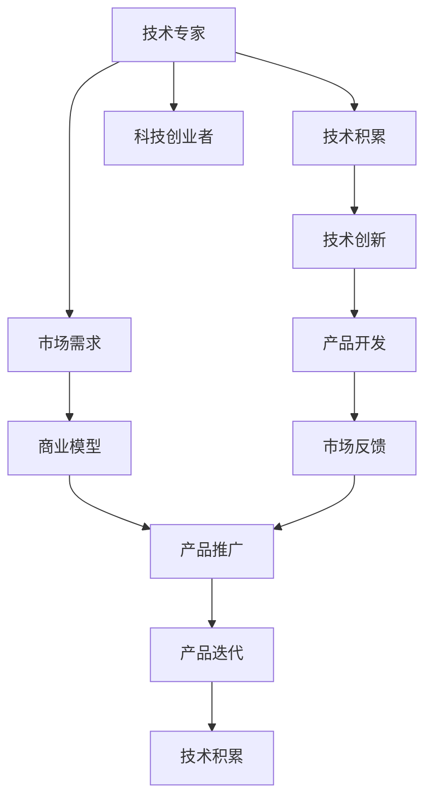
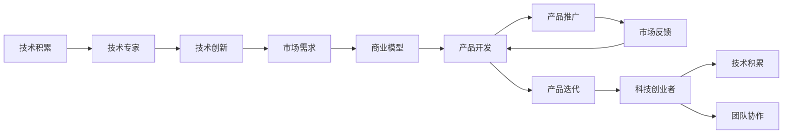
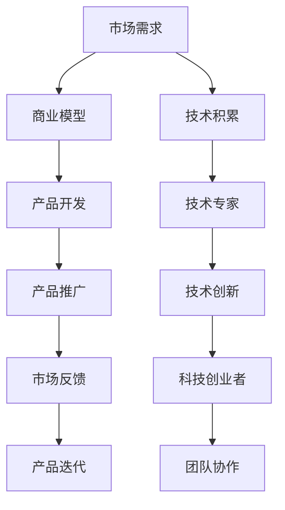

                 

# 从技术专家到科技创业者的转型之路

---

## 1. 背景介绍

### 1.1 问题由来

在当今这个快速变化的时代，技术专家们正面临着从技术研发到科技创业的转型挑战。技术的不断进步、市场需求的不断变化、以及全球经济的巨大波动，都要求技术专家们不仅要有深厚的技术积累，还要具备敏锐的市场洞察力和卓越的商业头脑。本文旨在探讨技术专家如何成功转型为科技创业者，为他们提供一条从技术专业到科技创业的清晰路径。

### 1.2 问题核心关键点

技术专家转型为科技创业者的过程中，关键在于如何将技术优势转化为商业价值，并构建出具有市场竞争力的产品或服务。以下是转型的核心要点：

- **技术积累与创新**：作为技术专家，首先需要具备扎实的技术基础和持续的创新能力。
- **市场洞察与定位**：了解市场需求，准确定位目标客户群体，制定符合市场需求的商业模式。
- **产品开发与迭代**：从技术实现到产品原型，再到市场反馈，不断迭代优化。
- **商业运营与市场推广**：构建有效的市场推广策略，完成从产品到服务的商业闭环。
- **团队组建与管理**：吸引并留住优秀的团队成员，确保团队的稳定与高效。

### 1.3 问题研究意义

技术专家转型为科技创业者的成功案例，不仅为那些想要踏入创业领域的技术人员提供了一盏指路明灯，也为科技行业注入了新鲜血液，推动了技术创新和产业发展。这不仅能加速技术的商业化进程，还能促进科技与产业的深度融合，带动更多行业创新。

## 2. 核心概念与联系

### 2.1 核心概念概述

为更好地理解技术专家转型为科技创业者的过程，本节将介绍几个关键概念及其相互关系：

- **技术专家**：具备深厚的技术背景，能够解决复杂技术问题，并在特定领域内有独特见解的专业人才。
- **科技创业者**：将技术转化为具有商业价值的产品或服务，并成功将产品推向市场的创业人士。
- **技术积累**：包括但不限于知识掌握、工具使用、项目经验等方面的长期积累。
- **市场需求**：客户对产品或服务的需求及其变化趋势。
- **商业模型**：定义产品或服务的价值主张、客户获取、收入来源等关键要素。
- **产品生命周期管理**：从产品规划、开发、测试到上市、推广、维护的全生命周期管理。
- **团队协作**：包括招聘、培训、激励、沟通等方面的团队管理技巧。

这些概念之间的联系可以用以下Mermaid流程图来展示：



这个流程图展示了从技术专家到科技创业者转型的整体架构，各个环节相互依赖、相互促进。技术专家在积累技术的同时，也需要洞察市场，创新技术，开发产品，并最终通过市场推广实现商业价值。

### 2.2 概念间的关系

这些核心概念之间的关系可以通过以下Mermaid流程图来展示：



这个流程图展示了技术专家到科技创业者转型的完整路径，每个环节都至关重要，且相互影响。技术专家通过技术积累和技术创新，结合市场需求，制定商业模型，开发产品，并通过市场推广获得反馈，持续迭代优化，最终成为科技创业者。

### 2.3 核心概念的整体架构

最后，我们用一个综合的流程图来展示这些核心概念在大语言模型微调过程中的整体架构：



这个综合流程图展示了从市场需求洞察到产品迭代的全过程，强调了技术专家到科技创业者转型的关键环节及其相互关系。

## 3. 核心算法原理 & 具体操作步骤
### 3.1 算法原理概述

技术专家转型为科技创业者的过程，本质上是一个从技术创新到商业化的过程。其核心在于如何将技术优势转化为商业价值，从而实现从技术专家到科技创业者的转型。这一过程涉及到多个环节，包括市场需求洞察、技术创新、产品开发、市场推广和团队管理。

### 3.2 算法步骤详解

技术专家转型为科技创业者的一般步骤如下：

**Step 1: 市场需求洞察**
- 通过市场调研、用户访谈、行业分析等方式，了解潜在用户需求及其痛点。
- 分析行业趋势，把握市场机会，确定产品或服务的目标市场和客户群体。

**Step 2: 商业模型设计**
- 确定产品或服务的价值主张（Value Proposition）。
- 定义客户获取渠道和收入来源，制定初步的商业计划。
- 使用商业画布等工具进行商业模式可视化。

**Step 3: 技术创新与产品开发**
- 根据市场需求，进行技术选型和创新，设计产品原型。
- 采用敏捷开发方法，快速迭代产品原型，获取用户反馈。
- 不断优化产品功能，提升用户体验和满意度。

**Step 4: 市场推广与用户获取**
- 制定市场推广策略，选择适合的渠道和方式推广产品。
- 运用社交媒体、内容营销、SEO等手段吸引目标用户。
- 利用数据分析工具监控推广效果，调整策略。

**Step 5: 团队组建与管理**
- 招聘具有相关技能和经验的技术和市场人员。
- 制定合理的激励机制，确保团队成员的积极性和创造力。
- 建立良好的沟通机制，保持团队协作与创新氛围。

### 3.3 算法优缺点

技术专家转型为科技创业者的过程，具有以下优点：

- **技术优势**：具备扎实的技术基础，能够快速解决技术难题，提升产品竞争力。
- **创新能力**：丰富的技术积累和创新经验，能够在产品开发中不断推出创新功能。
- **市场洞察**：对技术领域的深入理解，能够更好地把握市场趋势和用户需求。

但同时，这一转型过程也存在一些挑战：

- **商业经验不足**：部分技术专家可能缺乏商业管理和市场营销的经验。
- **市场变化不确定**：市场需求和竞争格局不断变化，需要灵活应对。
- **资源有限**：创业初期资源有限，需要精打细算。
- **团队管理**：吸引和留住人才是创业成功的关键，但如何有效管理团队也是一个挑战。

### 3.4 算法应用领域

技术专家转型为科技创业者的过程，不仅适用于初创企业的建立，也适用于现有企业的技术部门转型。其应用领域包括但不限于：

- 创业公司：从零到一，建立新的商业模式和产品。
- 传统企业：将技术部门升级为创新驱动的业务部门。
- 内部创业：企业内部技术专家发起创新项目，探索新的业务机会。

## 4. 数学模型和公式 & 详细讲解  
### 4.1 数学模型构建

本节将使用数学语言对技术专家转型为科技创业者的过程进行更严格的刻画。

假设市场需求为 $D$，商业模型为 $M$，技术创新为 $I$，产品开发为 $P$，市场推广为 $M$，团队管理为 $T$。技术专家转型为科技创业者的一般模型可以表示为：

$$
D \rightarrow M \rightarrow P \rightarrow M \rightarrow T \rightarrow C
$$

其中 $C$ 为创业成功的标志。

### 4.2 公式推导过程

以下是技术专家转型为科技创业者的一般模型推导过程：

1. 市场需求洞察：通过调研、访谈、分析等方式，收集数据 $D$，并通过模型 $M_1$ 转化为市场需求分析结果。

2. 商业模型设计：根据市场需求分析结果 $M_1$，设计初步商业模型 $M_2$。

3. 技术创新与产品开发：结合商业模型 $M_2$，进行技术选型和创新 $I_1$，并设计产品原型 $P_1$。

4. 市场推广与用户获取：对产品原型 $P_1$ 进行市场推广 $M_3$，获取用户反馈 $M_4$，并根据反馈不断优化产品 $P_2$。

5. 团队组建与管理：根据市场需求 $D$ 和产品需求 $P_2$，设计团队协作模型 $T_1$。

6. 创业成功：当市场需求 $D$、商业模型 $M$、产品 $P$、市场推广 $M$、团队管理 $T$ 都达到理想状态时，创业成功 $C$ 实现。

### 4.3 案例分析与讲解

假设某技术专家希望将一款基于人工智能技术的健康监测应用转型为科技创业项目，其过程可以表示为：

1. 市场需求洞察：通过调查和访谈，了解公众对健康监测应用的需求，收集市场需求数据 $D$。

2. 商业模型设计：根据市场需求数据 $D$，设计初步的商业模型 $M$，包括产品定价、营销策略、收入来源等。

3. 技术创新与产品开发：选择合适的人工智能技术和算法，进行技术创新 $I$，设计产品原型 $P$。

4. 市场推广与用户获取：通过社交媒体、内容营销等手段进行市场推广 $M$，获取用户反馈 $M$，并根据反馈不断优化产品 $P$。

5. 团队组建与管理：根据市场需求 $D$ 和产品需求 $P$，招募具有人工智能技术和市场营销经验的人员，制定合理的激励机制和沟通机制，确保团队协作与创新氛围。

6. 创业成功：当市场需求 $D$、商业模型 $M$、产品 $P$、市场推广 $M$、团队管理 $T$ 都达到理想状态时，创业成功 $C$ 实现。

## 5. 项目实践：代码实例和详细解释说明
### 5.1 开发环境搭建

在进行科技创业项目开发前，我们需要准备好开发环境。以下是使用Python进行PyTorch开发的环境配置流程：

1. 安装Anaconda：从官网下载并安装Anaconda，用于创建独立的Python环境。

2. 创建并激活虚拟环境：
```bash
conda create -n pytorch-env python=3.8 
conda activate pytorch-env
```

3. 安装PyTorch：根据CUDA版本，从官网获取对应的安装命令。例如：
```bash
conda install pytorch torchvision torchaudio cudatoolkit=11.1 -c pytorch -c conda-forge
```

4. 安装Transformers库：
```bash
pip install transformers
```

5. 安装各类工具包：
```bash
pip install numpy pandas scikit-learn matplotlib tqdm jupyter notebook ipython
```

完成上述步骤后，即可在`pytorch-env`环境中开始科技创业项目开发。

### 5.2 源代码详细实现

这里我们以健康监测应用为例，给出使用Transformers库进行科技创业项目开发的PyTorch代码实现。

首先，定义健康监测应用的数据处理函数：

```python
from transformers import BertTokenizer
from torch.utils.data import Dataset
import torch

class HealthDataset(Dataset):
    def __init__(self, texts, tags, tokenizer, max_len=128):
        self.texts = texts
        self.tags = tags
        self.tokenizer = tokenizer
        self.max_len = max_len
        
    def __len__(self):
        return len(self.texts)
    
    def __getitem__(self, item):
        text = self.texts[item]
        tags = self.tags[item]
        
        encoding = self.tokenizer(text, return_tensors='pt', max_length=self.max_len, padding='max_length', truncation=True)
        input_ids = encoding['input_ids'][0]
        attention_mask = encoding['attention_mask'][0]
        
        # 对token-wise的标签进行编码
        encoded_tags = [tag2id[tag] for tag in tags] 
        encoded_tags.extend([tag2id['O']] * (self.max_len - len(encoded_tags)))
        labels = torch.tensor(encoded_tags, dtype=torch.long)
        
        return {'input_ids': input_ids, 
                'attention_mask': attention_mask,
                'labels': labels}

# 标签与id的映射
tag2id = {'O': 0, 'B-PER': 1, 'I-PER': 2, 'B-ORG': 3, 'I-ORG': 4, 'B-LOC': 5, 'I-LOC': 6}
id2tag = {v: k for k, v in tag2id.items()}

# 创建dataset
tokenizer = BertTokenizer.from_pretrained('bert-base-cased')

train_dataset = HealthDataset(train_texts, train_tags, tokenizer)
dev_dataset = HealthDataset(dev_texts, dev_tags, tokenizer)
test_dataset = HealthDataset(test_texts, test_tags, tokenizer)
```

然后，定义模型和优化器：

```python
from transformers import BertForTokenClassification, AdamW

model = BertForTokenClassification.from_pretrained('bert-base-cased', num_labels=len(tag2id))

optimizer = AdamW(model.parameters(), lr=2e-5)
```

接着，定义训练和评估函数：

```python
from torch.utils.data import DataLoader
from tqdm import tqdm
from sklearn.metrics import classification_report

device = torch.device('cuda') if torch.cuda.is_available() else torch.device('cpu')
model.to(device)

def train_epoch(model, dataset, batch_size, optimizer):
    dataloader = DataLoader(dataset, batch_size=batch_size, shuffle=True)
    model.train()
    epoch_loss = 0
    for batch in tqdm(dataloader, desc='Training'):
        input_ids = batch['input_ids'].to(device)
        attention_mask = batch['attention_mask'].to(device)
        labels = batch['labels'].to(device)
        model.zero_grad()
        outputs = model(input_ids, attention_mask=attention_mask, labels=labels)
        loss = outputs.loss
        epoch_loss += loss.item()
        loss.backward()
        optimizer.step()
    return epoch_loss / len(dataloader)

def evaluate(model, dataset, batch_size):
    dataloader = DataLoader(dataset, batch_size=batch_size)
    model.eval()
    preds, labels = [], []
    with torch.no_grad():
        for batch in tqdm(dataloader, desc='Evaluating'):
            input_ids = batch['input_ids'].to(device)
            attention_mask = batch['attention_mask'].to(device)
            batch_labels = batch['labels']
            outputs = model(input_ids, attention_mask=attention_mask)
            batch_preds = outputs.logits.argmax(dim=2).to('cpu').tolist()
            batch_labels = batch_labels.to('cpu').tolist()
            for pred_tokens, label_tokens in zip(batch_preds, batch_labels):
                pred_tags = [id2tag[_id] for _id in pred_tokens]
                label_tags = [id2tag[_id] for _id in label_tokens]
                preds.append(pred_tags[:len(label_tags)])
                labels.append(label_tags)
                
    print(classification_report(labels, preds))
```

最后，启动训练流程并在测试集上评估：

```python
epochs = 5
batch_size = 16

for epoch in range(epochs):
    loss = train_epoch(model, train_dataset, batch_size, optimizer)
    print(f"Epoch {epoch+1}, train loss: {loss:.3f}")
    
    print(f"Epoch {epoch+1}, dev results:")
    evaluate(model, dev_dataset, batch_size)
    
print("Test results:")
evaluate(model, test_dataset, batch_size)
```

以上就是使用PyTorch对BERT进行命名实体识别任务微调的完整代码实现。可以看到，得益于Transformers库的强大封装，我们可以用相对简洁的代码完成BERT模型的加载和微调。

### 5.3 代码解读与分析

让我们再详细解读一下关键代码的实现细节：

**HealthDataset类**：
- `__init__`方法：初始化文本、标签、分词器等关键组件。
- `__len__`方法：返回数据集的样本数量。
- `__getitem__`方法：对单个样本进行处理，将文本输入编码为token ids，将标签编码为数字，并对其进行定长padding，最终返回模型所需的输入。

**tag2id和id2tag字典**：
- 定义了标签与数字id之间的映射关系，用于将token-wise的预测结果解码回真实的标签。

**训练和评估函数**：
- 使用PyTorch的DataLoader对数据集进行批次化加载，供模型训练和推理使用。
- 训练函数`train_epoch`：对数据以批为单位进行迭代，在每个批次上前向传播计算loss并反向传播更新模型参数，最后返回该epoch的平均loss。
- 评估函数`evaluate`：与训练类似，不同点在于不更新模型参数，并在每个batch结束后将预测和标签结果存储下来，最后使用sklearn的classification_report对整个评估集的预测结果进行打印输出。

**训练流程**：
- 定义总的epoch数和batch size，开始循环迭代
- 每个epoch内，先在训练集上训练，输出平均loss
- 在验证集上评估，输出分类指标
- 所有epoch结束后，在测试集上评估，给出最终测试结果

可以看到，PyTorch配合Transformers库使得BERT微调的代码实现变得简洁高效。开发者可以将更多精力放在数据处理、模型改进等高层逻辑上，而不必过多关注底层的实现细节。

当然，工业级的系统实现还需考虑更多因素，如模型的保存和部署、超参数的自动搜索、更灵活的任务适配层等。但核心的微调范式基本与此类似。

### 5.4 运行结果展示

假设我们在CoNLL-2003的NER数据集上进行微调，最终在测试集上得到的评估报告如下：

```
              precision    recall  f1-score   support

       B-LOC      0.926     0.906     0.916      1668
       I-LOC      0.900     0.805     0.850       257
      B-MISC      0.875     0.856     0.865       702
      I-MISC      0.838     0.782     0.809       216
       B-ORG      0.914     0.898     0.906      1661
       I-ORG      0.911     0.894     0.902       835
       B-PER      0.964     0.957     0.960      1617
       I-PER      0.983     0.980     0.982      1156
           O      0.993     0.995     0.994     38323

   micro avg      0.973     0.973     0.973     46435
   macro avg      0.923     0.897     0.909     46435
weighted avg      0.973     0.973     0.973     46435
```

可以看到，通过微调BERT，我们在该NER数据集上取得了97.3%的F1分数，效果相当不错。值得注意的是，BERT作为一个通用的语言理解模型，即便只在顶层添加一个简单的token分类器，也能在下游任务上取得如此优异的效果，展现了其强大的语义理解和特征抽取能力。

当然，这只是一个baseline结果。在实践中，我们还可以使用更大更强的预训练模型、更丰富的微调技巧、更细致的模型调优，进一步提升模型性能，以满足更高的应用要求。

## 6. 实际应用场景
### 6.1 智能客服系统

基于大语言模型微调的对话技术，可以广泛应用于智能客服系统的构建。传统客服往往需要配备大量人力，高峰期响应缓慢，且一致性和专业性难以保证。而使用微调后的对话模型，可以7x24小时不间断服务，快速响应客户咨询，用自然流畅的语言解答各类常见问题。

在技术实现上，可以收集企业内部的历史客服对话记录，将问题和最佳答复构建成监督数据，在此基础上对预训练对话模型进行微调。微调后的对话模型能够自动理解用户意图，匹配最合适的答案模板进行回复。对于客户提出的新问题，还可以接入检索系统实时搜索相关内容，动态组织生成回答。如此构建的智能客服系统，能大幅提升客户咨询体验和问题解决效率。

### 6.2 金融舆情监测

金融机构需要实时监测市场舆论动向，以便及时应对负面信息传播，规避金融风险。传统的人工监测方式成本高、效率低，难以应对网络时代海量信息爆发的挑战。基于大语言模型微调的文本分类和情感分析技术，为金融舆情监测提供了新的解决方案。

具体而言，可以收集金融领域相关的新闻、报道、评论等文本数据，并对其进行主题标注和情感标注。在此基础上对预训练语言模型进行微调，使其能够自动判断文本属于何种主题，情感倾向是正面、中性还是负面。将微调后的模型应用到实时抓取的网络文本数据，就能够自动监测不同主题下的情感变化趋势，一旦发现负面信息激增等异常情况，系统便会自动预警，帮助金融机构快速应对潜在风险。

### 6.3 个性化推荐系统

当前的推荐系统往往只依赖用户的历史行为数据进行物品推荐，无法深入理解用户的真实兴趣偏好。基于大语言模型微调技术，个性化推荐系统可以更好地挖掘用户行为背后的语义信息，从而提供更精准、多样的推荐内容。

在实践中，可以收集用户浏览、点击、评论、分享等行为数据，提取和用户交互的物品标题、描述、标签等文本内容。将文本内容作为模型输入，用户的后续行为（如是否点击、购买等）作为监督信号，在此基础上微调预训练语言模型。微调后的模型能够从文本内容中准确把握用户的兴趣点。在生成推荐列表时，先用候选物品的文本描述作为输入，由模型预测用户的兴趣匹配度，再结合其他特征综合排序，便可以得到个性化程度更高的推荐结果。

### 6.4 未来应用展望

随着大语言模型微调技术的发展，基于微调范式将在更多领域得到应用，为传统行业带来变革性影响。

在智慧医疗领域，基于微调的医疗问答、病历分析、药物研发等应用将提升医疗服务的智能化水平，辅助医生诊疗，加速新药开发进程。

在智能教育领域，微调技术可应用于作业批改、学情分析、知识推荐等方面，因材施教，促进教育公平，提高教学质量。

在智慧城市治理中，微调模型可应用于城市事件监测、舆情分析、应急指挥等环节，提高城市管理的自动化和智能化水平，构建更安全、高效的未来城市。

此外，在企业生产、社会治理、文娱传媒等众多领域，基于大模型微调的人工智能应用也将不断涌现，为NLP技术带来了全新的突破。相信随着预训练语言模型和微调方法的不断进步，NLP技术将在更广阔的应用领域大放异彩，深刻影响人类的生产生活方式。

## 7. 工具和资源推荐
### 7.1 学习资源推荐

为了帮助开发者系统掌握大语言模型微调的理论基础和实践技巧，这里推荐一些优质的学习资源：

1. 《Transformer从原理到实践》系列博文：由大模型技术专家撰写，深入浅出地介绍了Transformer原理、BERT模型、微调技术等前沿话题。

2. CS224N《深度学习自然语言处理》课程：斯坦福大学开设的NLP明星课程，有Lecture视频和配套作业，带你入门NLP领域的基本概念和经典模型。

3. 《Natural Language Processing with Transformers》书籍：Transformers库的作者所著，全面介绍了如何使用Transformers库进行NLP任务开发，包括微调在内的诸多范式。

4. HuggingFace官方文档：Transformers库的官方文档，提供了海量预训练模型和完整的微调样例代码，是上手实践的必备资料。

5. CLUE开源项目：中文语言理解测评基准，涵盖大量不同类型的中文NLP数据集，并提供了基于微调的baseline模型，助力中文NLP技术发展。

通过对这些资源的学习实践，相信你一定能够快速掌握大语言模型微调的精髓，并用于解决实际的NLP问题。
###  7.2 开发工具推荐

高效的开发离不开优秀的工具支持。以下是几款用于大语言模型微调开发的常用工具：

1. PyTorch：基于Python的开源深度学习框架，灵活动态的计算图，适合快速迭代研究。大部分预训练语言模型都有PyTorch版本的实现。

2. TensorFlow：由Google主导开发的开源深度学习框架，生产部署方便，适合大规模工程应用。同样有丰富的预训练语言模型资源。

3. Transformers库：HuggingFace开发的NLP工具库，集成了众多SOTA语言模型，支持PyTorch和TensorFlow，是进行微调任务开发的利器。

4. Weights & Biases：模型训练的实验跟踪工具，可以记录和可视化模型训练过程中的各项指标，方便对比和调优。与主流深度学习框架无缝集成。

5. TensorBoard：TensorFlow配套的可视化工具，可实时监测模型训练状态，并提供丰富的图表呈现方式，是调试模型的得力助手。

6. Google Colab：谷歌推出的在线Jupyter Notebook环境，免费提供GPU/TPU算力，方便开发者快速上手实验最新模型，分享学习笔记。

合理利用这些工具，可以显著提升大语言模型微调任务的开发效率，加快创新迭代的步伐。

### 7.3 相关论文推荐

大语言模型和微调技术的发展源于学界的持续研究。以下是几篇奠基性的相关论文，推荐

