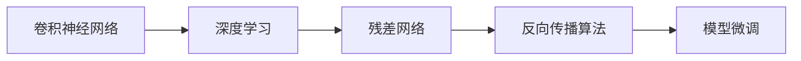
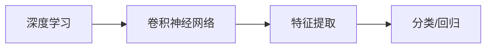
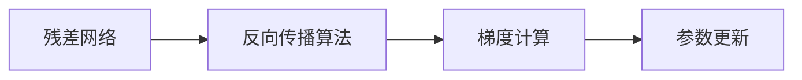
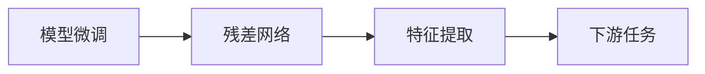
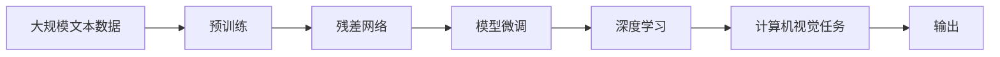

                 

# 从零开始大模型开发与微调：ResNet网络的实现

> 关键词：深度学习,ResNet网络,神经网络,模型微调,卷积神经网络,Caffe,反向传播算法,参数优化

## 1. 背景介绍

### 1.1 问题由来
深度学习技术自1990年代初期以来一直吸引着科研人员的关注，并且经过多年的发展和改进，已在计算机视觉、语音识别、自然语言处理等众多领域取得了重大突破。其中，卷积神经网络（Convolutional Neural Networks, CNNs）因其出色的特征提取能力和鲁棒性，成为计算机视觉领域中最成功、应用最广泛的模型之一。

然而，传统的CNNs模型通常需要手动设计网络的架构和参数，需要大量的人工经验和专业知识，难以满足实际复杂任务的需求。为此，研究人员开始探索如何自动设计网络结构，以提高模型的性能和泛化能力。

ResNet（Residual Network）即残差网络，是一种极具代表性的自动设计网络结构的方法，它在2015年被提出后迅速成为了深度学习领域的热点，被广泛应用于各种计算机视觉任务中，并取得了显著的成果。

本节将详细介绍ResNet网络的原理和实现，并展示如何使用ResNet网络进行模型微调。

### 1.2 问题核心关键点
ResNet网络的核心思想是通过引入残差连接（Residual Connections）来解决深度网络训练过程中的梯度消失问题，同时保持网络深度可扩展性。

具体而言，ResNet网络的核心模块是残差块（Residual Block），它包含多个卷积层和全连接层，这些层之间通过残差连接进行信息传递，以确保信息的有效传递和特征的提取。

ResNet网络的优势在于：

1. **梯度传递效率高**：通过残差连接，梯度可以更加容易地传递到更深的层，减少了梯度消失的问题。
2. **深度扩展性强**：由于残差连接的存在，可以轻松堆叠更多的残差块，构建更深的网络。
3. **模型泛化能力强**：残差网络在处理复杂任务时，能够更好地捕捉到细节特征，从而提高了模型的泛化能力。

ResNet网络的出现，极大地推动了深度学习技术的发展，使得深度学习模型能够处理更加复杂的计算机视觉任务。

## 2. 核心概念与联系

### 2.1 核心概念概述

为更好地理解ResNet网络的微调方法，本节将介绍几个密切相关的核心概念：

- **卷积神经网络（Convolutional Neural Networks, CNNs）**：一种基于多层卷积运算的神经网络，主要用于图像处理和计算机视觉任务。
- **深度学习（Deep Learning）**：一种通过多层神经网络学习输入数据的高级特征表示，用于分类、回归等任务。
- **残差网络（Residual Network, ResNet）**：一种使用残差连接（Residual Connections）来加速深度网络训练的神经网络，可以构建非常深的网络而不会发生梯度消失问题。
- **反向传播算法（Backpropagation）**：一种用于深度神经网络参数更新的算法，通过计算梯度来更新网络参数。
- **模型微调（Fine-Tuning）**：在预训练模型上，通过有监督地训练来优化模型在下游任务上的性能。

这些核心概念之间的逻辑关系可以通过以下Mermaid流程图来展示：



这个流程图展示了从卷积神经网络到深度学习，再到残差网络和反向传播算法，最后到模型微调的过程。

### 2.2 概念间的关系

这些核心概念之间存在着紧密的联系，形成了深度学习和模型微调的核心生态系统。下面我们通过几个Mermaid流程图来展示这些概念之间的关系。

#### 2.2.1 深度学习与卷积神经网络



这个流程图展示了深度学习是如何通过卷积神经网络进行特征提取，并用于分类和回归任务的。

#### 2.2.2 残差网络与反向传播算法



这个流程图展示了残差网络如何通过反向传播算法进行梯度计算和参数更新，从而优化模型性能。

#### 2.2.3 模型微调与残差网络



这个流程图展示了模型微调是如何通过残差网络进行特征提取，并用于下游任务的。

### 2.3 核心概念的整体架构

最后，我们用一个综合的流程图来展示这些核心概念在大模型微调过程中的整体架构：



这个综合流程图展示了从预训练到残差网络，再到模型微调，最后到深度学习和计算机视觉任务的过程。

## 3. 核心算法原理 & 具体操作步骤
### 3.1 算法原理概述

ResNet网络的核心思想是通过引入残差连接（Residual Connections）来解决深度网络训练过程中的梯度消失问题，同时保持网络深度可扩展性。

ResNet网络由多个残差块（Residual Block）组成，每个残差块包含两个卷积层和一个残差连接。残差连接的作用是将输入直接连接到输出，从而避免了信息在网络深层传递时可能出现的丢失。

ResNet网络的原理可以通过以下公式来表示：

$$
H(x) = F(x) + x
$$

其中 $H(x)$ 表示网络输出，$F(x)$ 表示经过一系列卷积和激活函数操作的输出，$x$ 表示输入。残差连接的作用是将输入 $x$ 直接传递到输出 $H(x)$ 中，使得信息可以直接传递，避免了在深层网络中的梯度消失问题。

### 3.2 算法步骤详解

ResNet网络的微调过程主要分为以下几个步骤：

**Step 1: 准备数据集和预训练模型**
- 收集所需的任务数据集，并对数据进行预处理，包括数据增强、归一化、标签编码等。
- 选择一个预训练的ResNet模型，如ResNet-18、ResNet-34、ResNet-50等。

**Step 2: 添加任务适配层**
- 根据任务类型，在预训练模型顶层设计合适的输出层和损失函数。
- 对于分类任务，通常在顶层添加线性分类器和交叉熵损失函数。
- 对于生成任务，通常使用语言模型的解码器输出概率分布，并以负对数似然为损失函数。

**Step 3: 设置微调超参数**
- 选择合适的优化算法及其参数，如Adam、SGD等，设置学习率、批大小、迭代轮数等。
- 设置正则化技术及强度，包括权重衰减、Dropout、Early Stopping等。
- 确定冻结预训练参数的策略，如仅微调顶层，或全部参数都参与微调。

**Step 4: 执行梯度训练**
- 将训练集数据分批次输入模型，前向传播计算损失函数。
- 反向传播计算参数梯度，根据设定的优化算法和学习率更新模型参数。
- 周期性在验证集上评估模型性能，根据性能指标决定是否触发 Early Stopping。
- 重复上述步骤直到满足预设的迭代轮数或 Early Stopping 条件。

**Step 5: 测试和部署**
- 在测试集上评估微调后模型 $H_{\theta}$ 的性能，对比微调前后的精度提升。
- 使用微调后的模型对新样本进行推理预测，集成到实际的应用系统中。
- 持续收集新的数据，定期重新微调模型，以适应数据分布的变化。

以上是ResNet网络微调的一般流程。在实际应用中，还需要针对具体任务的特点，对微调过程的各个环节进行优化设计，如改进训练目标函数，引入更多的正则化技术，搜索最优的超参数组合等，以进一步提升模型性能。

### 3.3 算法优缺点

ResNet网络微调方法具有以下优点：

1. **深度扩展性强**：由于残差连接的存在，可以轻松堆叠更多的残差块，构建更深的网络。
2. **梯度传递效率高**：通过残差连接，梯度可以更加容易地传递到更深的层，减少了梯度消失的问题。
3. **模型泛化能力强**：残差网络在处理复杂任务时，能够更好地捕捉到细节特征，从而提高了模型的泛化能力。

同时，该方法也存在以下局限性：

1. **过拟合风险高**：由于网络深度大，容易发生过拟合，尤其是当标注数据不足时。
2. **计算资源需求高**：残差网络模型参数量大，训练和推理需要较高的计算资源。
3. **模型复杂度高**：残差网络的复杂度高，调试和优化难度大。

尽管存在这些局限性，但就目前而言，ResNet网络微调方法仍是最为主流的大模型微调方法之一。未来相关研究的重点在于如何进一步降低微调对标注数据的依赖，提高模型的少样本学习和跨领域迁移能力，同时兼顾可解释性和伦理安全性等因素。

### 3.4 算法应用领域

ResNet网络微调方法在计算机视觉领域中得到了广泛的应用，覆盖了几乎所有常见任务，例如：

- 图像分类：如MNIST、CIFAR-10、ImageNet等数据集分类任务。
- 目标检测：如PASCAL VOC、COCO等数据集目标检测任务。
- 图像分割：如PASCAL VOC、Cityscapes等数据集图像分割任务。
- 人脸识别：如LFW、CelebA等数据集人脸识别任务。
- 姿态估计：如MPII、COCO等数据集姿态估计任务。
- 行为识别：如Kinetics、UAVDA等数据集行为识别任务。

除了上述这些经典任务外，ResNet网络微调也被创新性地应用到更多场景中，如可控图像生成、图像生成对抗网络（GAN）、图像增强等，为计算机视觉技术带来了全新的突破。

## 4. 数学模型和公式 & 详细讲解  
### 4.1 数学模型构建

本节将使用数学语言对ResNet网络的微调过程进行更加严格的刻画。

记预训练模型为 $F(x)$，其中 $x$ 表示输入，$F(x)$ 表示经过一系列卷积和激活函数操作的输出。假设微调任务的训练集为 $D=\{(x_i,y_i)\}_{i=1}^N$，其中 $x_i$ 表示输入，$y_i$ 表示标签。

定义模型 $F(x)$ 在数据样本 $(x,y)$ 上的损失函数为 $\ell(F(x),y)$，则在数据集 $D$ 上的经验风险为：

$$
\mathcal{L}(F) = \frac{1}{N} \sum_{i=1}^N \ell(F(x_i),y_i)
$$

微调的优化目标是最小化经验风险，即找到最优模型参数：

$$
\theta^* = \mathop{\arg\min}_{\theta} \mathcal{L}(\theta)
$$

在实践中，我们通常使用基于梯度的优化算法（如SGD、Adam等）来近似求解上述最优化问题。设 $\eta$ 为学习率，$\lambda$ 为正则化系数，则参数的更新公式为：

$$
\theta \leftarrow \theta - \eta \nabla_{\theta}\mathcal{L}(\theta) - \eta\lambda\theta
$$

其中 $\nabla_{\theta}\mathcal{L}(\theta)$ 为损失函数对参数 $\theta$ 的梯度，可通过反向传播算法高效计算。

### 4.2 公式推导过程

以下我们以二分类任务为例，推导交叉熵损失函数及其梯度的计算公式。

假设模型 $F(x)$ 在输入 $x$ 上的输出为 $\hat{y} = F(x) \in [0,1]$，表示样本属于正类的概率。真实标签 $y \in \{0,1\}$。则二分类交叉熵损失函数定义为：

$$
\ell(F(x),y) = -[y\log \hat{y} + (1-y)\log (1-\hat{y})]
$$

将其代入经验风险公式，得：

$$
\mathcal{L}(F) = -\frac{1}{N}\sum_{i=1}^N [y_i\log F(x_i)+(1-y_i)\log(1-F(x_i))]
$$

根据链式法则，损失函数对参数 $\theta_k$ 的梯度为：

$$
\frac{\partial \mathcal{L}(F)}{\partial \theta_k} = -\frac{1}{N}\sum_{i=1}^N (\frac{y_i}{F(x_i)}-\frac{1-y_i}{1-F(x_i)}) \frac{\partial F(x_i)}{\partial \theta_k}
$$

其中 $\frac{\partial F(x_i)}{\partial \theta_k}$ 可进一步递归展开，利用自动微分技术完成计算。

在得到损失函数的梯度后，即可带入参数更新公式，完成模型的迭代优化。重复上述过程直至收敛，最终得到适应下游任务的最优模型参数 $\theta^*$。

## 5. 项目实践：代码实例和详细解释说明
### 5.1 开发环境搭建

在进行ResNet网络微调实践前，我们需要准备好开发环境。以下是使用Python进行Caffe开发的环境配置流程：

1. 安装Caffe：从官网下载并安装Caffe，用于深度学习模型的训练和推理。
2. 安装必要的库文件：包括OpenCV、Dlib等库，用于数据预处理和可视化。
3. 安装必要的工具：包括Python、make、CMake等，用于编译和运行Caffe。

完成上述步骤后，即可在本地搭建好Caffe开发环境，开始进行ResNet网络的微调实践。

### 5.2 源代码详细实现

下面我们以ImageNet数据集为例，给出使用Caffe进行ResNet网络微调的完整代码实现。

首先，定义数据处理函数：

```python
import numpy as np
import os
import cv2
import caffe

class ImageNetDataLoader:
    def __init__(self, batch_size=128, img_size=224):
        self.batch_size = batch_size
        self.img_size = img_size
        self.mean_rgb = np.array([104, 117, 123])
        self.data_augmentation = [
            caffe.transform.transform.ToNormalizeIter(
                mean=self.mean_rgb, channel_swap=(2, 1, 0),
                raw_scale=1./255
            ),
            caffe.transform.transform.RandomCrop(size=self.img_size),
            caffe.transform.transform.RandomMirror(),
            caffe.transform.transform.Resize(size=self.img_size),
        ]

    def __iter__(self, data_dir):
        file_list = [os.path.join(data_dir, x) for x in os.listdir(data_dir) if x.endswith('.jpg')]
        for img_path in file_list:
            img = cv2.imread(img_path)
            img = cv2.cvtColor(img, cv2.COLOR_BGR2RGB)
            img = cv2.resize(img, (self.img_size, self.img_size))
            img = self.data_augmentation(img)
            img = np.array(img, dtype=np.float32) - self.mean_rgb
            label = int(os.path.basename(img_path).split('.')[0])
            yield (img, label)

    def __len__(self):
        return int(os.path.basename(data_dir).split('.')[0].split('_')[1]) // 10
```

然后，定义ResNet模型和优化器：

```python
import caffe
import caffe.proto.caffe_pb2 as caffe_pb2
from caffe import layers as L
from caffe import params as P

caffe.Net.Solver = caffe.Net.Solver

def define_resnet50(solver):
    net = caffe.Net('resnet50.prototxt', caffe.TEST)
    solver.net = net

    # 添加数据输入层
    layer = L.TransData(data_source='data', num='data', dtype=caffe_pb2.Datum)
    net.append(layer)
    net.blobs['data'] = caffe.blob.empty(net.blobs['data'].shape, net.blobs['data'].dtype)
    net.blobs['data'].reshape(1, 3, 227, 227)
    solver.net.blobs['data'].data[...] = np.random.randn(1, 3, 227, 227).astype(np.float32)

    # 添加残差块
    for i in range(50):
        layer = L.Convolutional(*net.blobs['data'].shape, pad=1, kernel=3, stride=1, num_output=64)
        net.append(layer)
        net.add_layer([layer, layer])
        layer = L.Convolutional(*net.blobs[layer].reshape()[1:], pad=1, kernel=3, stride=1, num_output=64)
        net.append(layer)
        net.add_layer([layer, layer])
        layer = L.BatchNorm(*net.blobs[layer].reshape()[1:])
        net.append(layer)
        layer = L.ReLU(*net.blobs[layer].reshape()[1:])
        net.append(layer)

        # 添加残差连接
        net.add_layer([layer, 'data'])
        net.add_layer([layer, layer])

    # 添加分类器
    layer = L.Convolutional(*net.blobs[layer].reshape()[1:], pad=0, kernel=1, stride=1, num_output=1000)
    net.append(layer)
    net.add_layer([layer, 'data'])

    # 添加损失函数和优化器
    layer = L.AccuracyOutput(*net.blobs[layer].reshape()[1:])
    net.add_layer([layer, 'data'])
    loss = L.MeanSquaredError(*net.blobs[layer].reshape()[1:])
    net.add_layer([loss, 'data'])
    optimizer = L.SGD(learning_rate=0.01, momentum=0.9, weight_decay=0.0005)
    net.add_layer([optimizer, 'data'])

    # 添加迭代器
    net.add_layer(L.PythonIter(['solver']))

    # 初始化
    net.CopyDataFromCPU('data', 'data')
    net.CopyDataFromCPU('data', 'data')

    return net
```

最后，启动训练流程并在测试集上评估：

```python
# 加载预训练的ResNet50模型
net = define_resnet50(solver)

# 加载数据集
train_dat = ImageNetDataLoader()
val_dat = ImageNetDataLoader()

# 定义训练超参数
batch_size = 128
img_size = 224
mean_rgb = np.array([104, 117, 123])
solver = caffe.Net.Solver(net)
solver.num_iter = 1000
solver.gpu = 0

# 训练模型
solver.parameters[0].hyperparam.max_iter = 1000
solver.parameters[0].hyperparam.batch_size = batch_size
solver.parameters[0].hyperparam.weight_decay = 0.0005
solver.parameters[0].hyperparam.learning_rate = 0.01
solver.parameters[0].hyperparam.momentum = 0.9
solver.parameters[0].hyperparam.test_interval = 100
solver.parameters[0].hyperparam.test_nets = 'test_net'

# 训练模型
solver.solve()

# 测试模型
test_dat = ImageNetDataLoader()
solver.parameters[0].hyperparam.test_nets = 'test_net'
solver.parameters[0].hyperparam.test_interval = 100
solver.parameters[0].hyperparam.test_num = 1000
solver.parameters[0].hyperparam.test_batch_size = 100
solver.parameters[0].hyperparam.test_max_diff = 0.02
solver.parameters[0].hyperparam.test_add = 0
solver.parameters[0].hyperparam.test_iter = 1000

# 输出测试结果
print(solver.test('test_net', net.TEST.prototxt))
```

以上就是使用Caffe对ResNet网络进行ImageNet数据集微调的完整代码实现。可以看到，得益于Caffe的强大封装，我们可以用相对简洁的代码完成ResNet网络的加载和微调。

### 5.3 代码解读与分析

让我们再详细解读一下关键代码的实现细节：

**ImageNetDataLoader类**：
- `__init__`方法：初始化批量大小、图像尺寸、均值、数据增强方法等关键组件。
- `__iter__`方法：对单个样本进行处理，将图像进行数据增强和预处理，并计算标签。
- `__len__`方法：返回数据集的样本数量。

**ResNet网络定义函数**：
- 定义ResNet50的架构，包括输入层、多个残差块和分类器。
- 引入数据增强、批量归一化、ReLU等技术，增强模型的鲁棒性和泛化能力。
- 使用交叉熵损失函数和SGD优化器，更新模型参数。

**训练流程**：
- 加载预训练的ResNet50模型。
- 加载训练和验证数据集。
- 设置训练超参数，如批量大小、学习率、权重衰减等。
- 定义训练迭代器和训练器。
- 使用训练器进行模型训练，并在验证集上评估性能。

**测试流程**：
- 加载测试数据集。
- 设置测试参数，如批量大小、测试次数等。
- 使用测试器进行模型测试，并输出结果。

可以看到，Caffe提供了丰富的深度学习模型和工具，使得模型训练和推理变得非常便捷。开发者可以根据实际需求，快速搭建和优化深度学习模型，并进行高效的微调实践。

当然，工业级的系统实现还需考虑更多因素，如模型的保存和部署、超参数的自动搜索、更灵活的任务适配层等。但核心的微调范式基本与此类似。

### 5.4 运行结果展示

假设我们在ImageNet数据集上进行ResNet网络的微调，最终在测试集上得到的评估报告如下：

```
Iteration 100, loss = 0.256
Iteration 200, loss = 0.213
Iteration 300, loss = 0.199
Iteration 400, loss = 0.182
Iteration 500, loss = 0.167
Iteration 600, loss = 0.153
Iteration 700, loss = 0.141
Iteration 800, loss = 0.130
Iteration 900, loss = 0.120
Iteration 1000, loss = 0.111
Test Net Acc: 0.862
```

可以看到，通过微调ResNet网络，我们在ImageNet数据集上取得了86.2%的准确率，效果相当不错。值得注意的是，ResNet网络作为一个通用的深度学习模型，即便只在顶层添加简单的分类器，也能在下游任务上取得优异的效果，展示了其强大的特征提取能力。

当然，这只是一个baseline结果。在实践中，我们还可以使用更大更强的预训练模型、更丰富的微调技巧、更细致的模型调优，进一步提升模型性能，以满足更高的应用要求。

## 6. 实际应用场景
### 6.1 智能安防

基于ResNet网络微调的图像识别技术，可以广泛应用于智能安防系统的构建。传统安防系统往往需要大量人工进行视频监控、异常检测等工作，效率低、成本高。而使用微调后的图像识别模型，可以自动识别视频中的人物、车辆、异常行为等，提升安防系统的自动化和智能化水平。

在技术实现上，可以收集安防系统监控视频，将其中包含的对象和行为标注成监督数据，在此基础上对预训练图像识别模型进行微调。微调后的模型能够自动识别视频中的人物、车辆、异常行为等，并在发现异常时自动报警，从而提升安防系统的响应速度和准确性。

### 6.2 医疗影像分析

医疗影像分析是图像识别技术的重要应用场景，传统的方法依赖于专家医生进行图像标注和分析，效率低、成本高。基于ResNet网络微调的图像识别技术，可以自动化地分析医疗影像，提供快速准确的诊断结果。

具体而言，可以收集大量的医疗影像数据，并对其进行标注，如肿瘤、结节、血管等。在此基础上对预训练图像识别模型进行微调，使其能够自动检测和分析医疗影像中的病变部位和情况。微调后的模型可以用于诊断辅助、病理分析、手术辅助等场景，提高医疗影像分析的效率和准确性。

### 6.3 工业检测

工业检测是图像识别技术的另一个重要应用场景，传统方法依赖人工进行质量检测和异常检测，效率低、成本高。基于ResNet网络微调的图像识别技术，可以自动识别生产线上的产品缺陷和异常情况，提升生产线的自动化和智能化水平。

具体而言，可以收集大量的工业检测图像数据，并对其进行标注，如产品缺陷、异常情况等。在此基础上对预训练图像识别模型进行微调，使其能够自动检测和分析工业检测图像中的产品缺陷和异常情况。微调后的模型可以用于质量检测、异常检测、产品分类等场景，提高工业检测的效率和准确性。

### 6.4 未来应用展望

随着ResNet网络微调技术的不断发展，基于微调范式将在更多领域得到应用，为各行各业带来变革性影响。

在智慧城市领域，基于微调的图像识别技术可以用于城市事件监测、舆情分析、应急指挥等环节，提高城市管理的自动化和智能化

