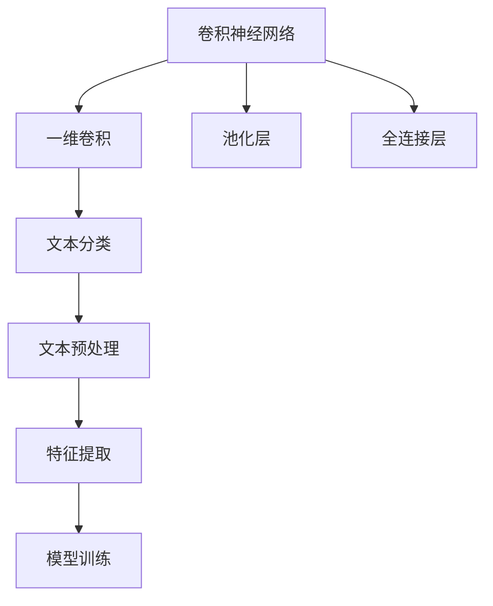
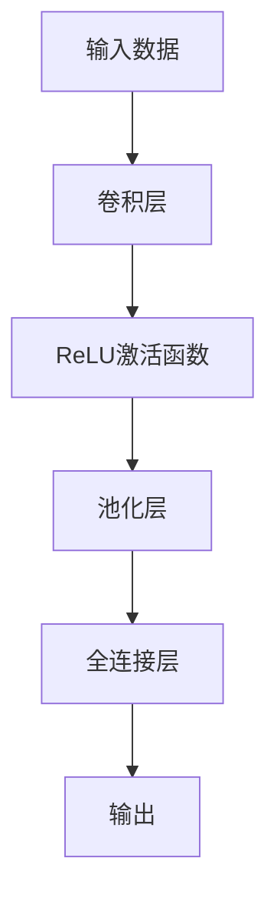
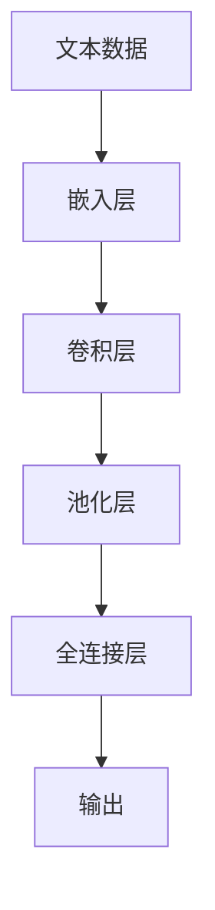
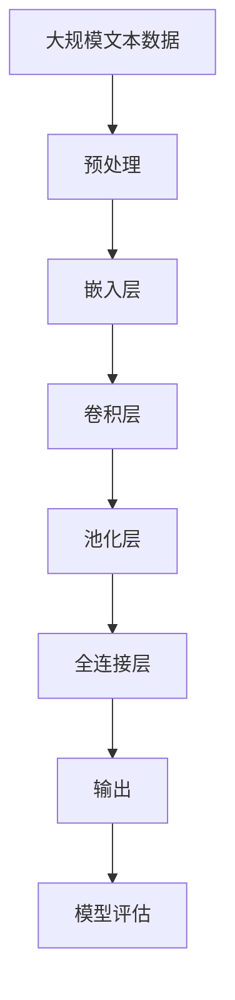

                 

# 从零开始大模型开发与微调：卷积神经网络文本分类模型的实现—Conv1d（一维卷积）

> 关键词：卷积神经网络,文本分类,Conv1d,一维卷积,自然语言处理,NLP

## 1. 背景介绍

### 1.1 问题由来
随着深度学习技术的不断发展，卷积神经网络（Convolutional Neural Networks, CNNs）在计算机视觉、自然语言处理（Natural Language Processing, NLP）等领域取得了显著的成果。尤其是在NLP中，CNNs因其局部感知和层次化特征提取的能力，成为了处理序列数据的强有力工具。本文将从零开始介绍如何使用CNNs，特别是Conv1d一维卷积，来实现文本分类任务。

### 1.2 问题核心关键点
卷积神经网络在NLP中的应用主要通过一维卷积层（Conv1d）来实现。Conv1d通过滑动卷积核在文本序列上进行特征提取，捕捉局部语义信息，同时保留全局上下文关系，因此适用于文本分类、情感分析等任务。

本文将深入探讨Conv1d在文本分类中的应用，包括模型构建、参数设置、训练流程以及模型评估等关键步骤。同时，我们还将讨论Conv1d的优缺点和实际应用领域，帮助读者全面了解这一强大工具。

### 1.3 问题研究意义
理解Conv1d在文本分类中的应用，对于构建高效、可解释的NLP模型具有重要意义：

1. **提升分类精度**：Conv1d通过局部卷积捕捉文本中的关键特征，能够显著提升文本分类模型的准确性。
2. **降低过拟合风险**：与全连接层相比，Conv1d的参数数量更少，有助于减少过拟合风险。
3. **增强模型泛化能力**：卷积操作保留了文本的局部和全局信息，有助于模型更好地泛化到未见过的数据上。
4. **易于实现和优化**：Conv1d模型结构简单，易于实现和优化，适用于快速迭代开发。
5. **推动NLP应用发展**：通过研究Conv1d，我们可以更好地理解NLP技术的本质，为实际应用场景提供技术支撑。

## 2. 核心概念与联系

### 2.1 核心概念概述

为更好地理解Conv1d在文本分类中的应用，本节将介绍几个关键概念：

- **卷积神经网络（CNNs）**：一种多层神经网络，常用于图像处理和序列数据处理。CNNs通过卷积层、池化层和全连接层等组件，逐步提取特征，最终输出分类结果。
- **一维卷积（Conv1d）**：卷积神经网络中用于处理序列数据的卷积层，通过滑动卷积核提取文本序列的局部特征。
- **文本分类**：将文本数据分为预定义的类别，如情感分析、主题分类等，是NLP领域的重要任务之一。
- **自然语言处理（NLP）**：研究如何让计算机理解和处理人类语言的技术，包括文本预处理、特征提取、模型训练等环节。

这些概念之间的联系可以通过以下Mermaid流程图来展示：



这个流程图展示了CNNs中各个组件的联系，以及它们如何共同完成文本分类的任务。

### 2.2 概念间的关系

这些核心概念之间存在着紧密的联系，形成了CNNs在NLP中的应用框架。下面我们通过几个Mermaid流程图来展示这些概念之间的关系。

#### 2.2.1 卷积神经网络的基本结构



这个流程图展示了CNNs的基本结构，包括输入层、卷积层、激活函数、池化层和输出层。

#### 2.2.2 一维卷积在文本分类中的应用



这个流程图展示了Conv1d在文本分类中的应用，包括文本嵌入、卷积层、池化层和全连接层的连接。

#### 2.2.3 文本分类任务的完成流程


这个流程图展示了从文本数据到最终输出的完整流程。

### 2.3 核心概念的整体架构

最后，我们用一个综合的流程图来展示这些核心概念在大模型微调过程中的整体架构：



这个综合流程图展示了从预处理到模型评估的完整过程，包括文本数据的处理、模型构建、训练和评估等环节。

## 3. 核心算法原理 & 具体操作步骤
### 3.1 算法原理概述

Conv1d在文本分类中的应用主要基于以下几个原理：

1. **卷积操作**：卷积核（也称为滤波器）在文本序列上滑动，提取局部特征。通过改变卷积核的大小、数量和步幅，可以捕捉不同尺度的文本特征。
2. **池化操作**：通过取样或平均池化操作，对卷积层的输出进行降维，减少参数数量，防止过拟合。
3. **多层堆叠**：通过多层的卷积和池化操作，逐步提取更高级别的特征，最终进行分类。
4. **激活函数**：引入ReLU等激活函数，增强模型的非线性表达能力。
5. **softmax输出**：将输出通过softmax函数转换为概率分布，用于多分类任务。

Conv1d在文本分类中的主要优势包括：

- **局部感知**：通过卷积操作，模型能够捕捉文本中的局部语义信息，减少全局噪声。
- **参数高效**：与全连接层相比，Conv1d的参数数量较少，有助于减少过拟合风险。
- **全局上下文关系**：通过池化操作，模型能够保留文本的全局上下文信息，提高分类准确性。

### 3.2 算法步骤详解

以下是使用Conv1d实现文本分类的详细步骤：

**Step 1: 数据预处理**
- 对文本进行分词、去除停用词等预处理操作，将文本转换为数字序列。
- 使用嵌入层将数字序列转换为向量表示，嵌入矩阵通常包含足够的维度，以捕捉文本的丰富语义信息。

**Step 2: 模型构建**
- 构建卷积层和池化层的堆叠结构，设定卷积核的大小、数量和步幅等参数。
- 添加全连接层和激活函数，连接卷积层和输出层。
- 设计输出层，使用softmax函数进行多分类输出。

**Step 3: 模型训练**
- 使用交叉熵损失函数计算模型输出与真实标签之间的差异。
- 通过反向传播算法更新模型参数，优化损失函数。
- 使用正则化技术，如L2正则化、Dropout等，防止过拟合。

**Step 4: 模型评估**
- 使用测试集评估模型性能，计算准确率、召回率、F1分数等指标。
- 对模型进行调优，选择最优超参数。

### 3.3 算法优缺点

Conv1d在文本分类中的应用具有以下优点：

- **高效特征提取**：通过卷积操作捕捉文本局部特征，减少参数数量，提高训练效率。
- **鲁棒性**：卷积核的局部感知特性使得模型对噪声和缺失值具有一定的鲁棒性。
- **可解释性**：卷积操作可以直观地解释模型对文本的理解，帮助理解模型的决策过程。

同时，Conv1d也存在一些局限性：

- **对文本长度的依赖**：卷积核的大小和步幅需要根据文本长度进行合理选择，否则可能导致信息丢失或冗余。
- **参数数量仍较多**：尽管相对于全连接层有所减少，但相对于其他模型如BERT等，卷积模型仍然需要较多的参数。
- **特征维度受限**：卷积核的大小和数量会影响特征维度，可能限制模型表达能力的充分发挥。

### 3.4 算法应用领域

Conv1d在文本分类中已经得到了广泛的应用，包括但不限于以下几个领域：

- **情感分析**：通过分析评论、推文等文本数据，判断用户情感倾向。
- **主题分类**：将文本数据分为预定义的主题，如新闻、论文、博客等。
- **垃圾邮件过滤**：识别和过滤垃圾邮件，提升用户体验。
- **文本分类**：对文本进行自动分类，如新闻分类、文档分类等。

除上述经典应用外，Conv1d还被应用于更多的领域，如情感识别、事件提取、问答系统等，为NLP技术的发展提供了强大的支持。

## 4. 数学模型和公式 & 详细讲解 & 举例说明

### 4.1 数学模型构建

Conv1d的数学模型构建主要包括以下几个步骤：

1. **输入数据表示**：将文本序列转换为数字序列，记为 $\mathbf{x} = \{x_1, x_2, \ldots, x_n\}$，其中 $x_i$ 表示文本序列中的第 $i$ 个单词。
2. **嵌入层**：将数字序列转换为向量表示，记为 $\mathbf{X} = [x_1, x_2, \ldots, x_n] \in \mathbb{R}^{n \times d}$，其中 $d$ 为嵌入维度。
3. **卷积层**：通过滑动卷积核提取局部特征，记为 $\mathbf{F} = [f_1, f_2, \ldots, f_m] \in \mathbb{R}^{m \times d}$，其中 $m$ 为卷积核数量，$f_i$ 表示第 $i$ 个卷积核的特征映射。
4. **池化层**：通过池化操作对卷积层的输出进行降维，记为 $\mathbf{P} = [p_1, p_2, \ldots, p_k] \in \mathbb{R}^{k \times d'}$，其中 $k$ 为池化层的输出数量，$d'$ 为池化后的维度。
5. **全连接层**：将池化层的输出连接至全连接层，输出分类结果，记为 $\mathbf{Z} = [z_1, z_2, \ldots, z_c] \in \mathbb{R}^{c \times d'}$，其中 $c$ 为分类数量。
6. **softmax输出**：通过softmax函数将输出转换为概率分布，记为 $\mathbf{y} = [y_1, y_2, \ldots, y_c] \in \mathbb{R}^{c}$。

### 4.2 公式推导过程

以下是Conv1d在文本分类中的数学公式推导：

1. **卷积操作**：设卷积核大小为 $w$，步幅为 $s$，则卷积层的输出为：

   $$
   f_i = \sum_{j=0}^{w-1} \mathbf{W}_j x_{i-j}
   $$

   其中 $\mathbf{W}_j$ 表示卷积核的第 $j$ 个元素，$x_{i-j}$ 表示文本序列中与卷积核中心对齐的 $i$ 处的单词。

2. **池化操作**：假设采用最大池化，则池化层的输出为：

   $$
   p_i = \max_j \{f_{i+j}\}
   $$

   其中 $f_{i+j}$ 表示卷积层中与池化层中心对齐的 $i+j$ 处的特征映射。

3. **softmax输出**：将池化层的输出连接至全连接层，输出分类结果：

   $$
   z_i = \sum_j \mathbf{W}_j' p_i
   $$

   其中 $\mathbf{W}_j'$ 表示全连接层的第 $j$ 个权重，$p_i$ 表示池化层的输出。

   最终的输出为：

   $$
   y_i = \frac{e^{z_i}}{\sum_{j=1}^c e^{z_j}}
   $$

### 4.3 案例分析与讲解

假设我们有一个包含20个样本的文本分类数据集，使用3个卷积核进行卷积操作，卷积核大小为3，步幅为1。嵌入层使用300维向量表示，池化层使用最大池化，输出数量2，全连接层使用100维向量连接。最后使用softmax函数进行多分类输出，共有5个分类类别。

具体实现如下：

- **嵌入层**：将文本序列转换为300维向量表示，记为 $\mathbf{X} \in \mathbb{R}^{20 \times 300}$。
- **卷积层**：使用3个卷积核进行卷积操作，输出为 $\mathbf{F} \in \mathbb{R}^{20 \times 3 \times 300}$。
- **池化层**：对卷积层的输出进行最大池化，输出为 $\mathbf{P} \in \mathbb{R}^{20 \times 3 \times 100}$。
- **全连接层**：将池化层的输出连接至全连接层，输出分类结果 $\mathbf{Z} \in \mathbb{R}^{20 \times 100}$。
- **softmax输出**：通过softmax函数将输出转换为概率分布，记为 $\mathbf{y} \in \mathbb{R}^{20 \times 5}$。

通过上述步骤，我们可以使用Conv1d实现文本分类任务。

## 5. 项目实践：代码实例和详细解释说明
### 5.1 开发环境搭建

在进行文本分类实践前，我们需要准备好开发环境。以下是使用Python进行TensorFlow开发的环境配置流程：

1. 安装Anaconda：从官网下载并安装Anaconda，用于创建独立的Python环境。

2. 创建并激活虚拟环境：
```bash
conda create -n tf-env python=3.8 
conda activate tf-env
```

3. 安装TensorFlow：根据CUDA版本，从官网获取对应的安装命令。例如：
```bash
conda install tensorflow=2.7.0
```

4. 安装各类工具包：
```bash
pip install numpy pandas scikit-learn matplotlib tqdm jupyter notebook ipython
```

完成上述步骤后，即可在`tf-env`环境中开始文本分类实践。

### 5.2 源代码详细实现

下面我们以文本分类任务为例，给出使用TensorFlow实现Conv1d的PyTorch代码实现。

首先，定义数据处理函数：

```python
import tensorflow as tf
from tensorflow.keras.preprocessing.text import Tokenizer
from tensorflow.keras.preprocessing.sequence import pad_sequences

def text_to_sequences(texts, max_len=256):
    tokenizer = Tokenizer()
    tokenizer.fit_on_texts(texts)
    sequences = tokenizer.texts_to_sequences(texts)
    return pad_sequences(sequences, maxlen=max_len, padding='post')
```

然后，定义模型和优化器：

```python
import tensorflow.keras as keras

model = keras.Sequential([
    keras.layers.Embedding(input_dim=10000, output_dim=300, input_length=256),
    keras.layers.Conv1D(128, 3, activation='relu'),
    keras.layers.GlobalMaxPooling1D(),
    keras.layers.Dense(5, activation='softmax')
])

optimizer = keras.optimizers.Adam(lr=0.001)
```

接着，定义训练和评估函数：

```python
def train_epoch(model, dataset, batch_size=32, optimizer=optimizer):
    dataloader = keras.preprocessing.sequence.DataLoader(dataset, batch_size=batch_size, shuffle=True)
    model.train()
    epoch_loss = 0
    for batch in dataloader:
        inputs, labels = batch
        model.zero_grad()
        outputs = model(inputs)
        loss = keras.losses.categorical_crossentropy(labels, outputs)
        epoch_loss += loss.item()
        loss.backward()
        optimizer.step()
    return epoch_loss / len(dataloader)

def evaluate(model, dataset, batch_size=32):
    dataloader = keras.preprocessing.sequence.DataLoader(dataset, batch_size=batch_size)
    model.eval()
    preds, labels = [], []
    with tf.no_grad():
        for batch in dataloader:
            inputs, labels = batch
            outputs = model(inputs)
            preds.append(outputs.numpy())
            labels.append(labels.numpy())
    print(keras.metrics.categorical_accuracy(labels, preds))
```

最后，启动训练流程并在测试集上评估：

```python
epochs = 10
batch_size = 32

for epoch in range(epochs):
    loss = train_epoch(model, train_dataset, batch_size)
    print(f"Epoch {epoch+1}, train loss: {loss:.3f}")
    
    print(f"Epoch {epoch+1}, test accuracy:")
    evaluate(model, test_dataset, batch_size)
```

以上就是使用TensorFlow实现Conv1d文本分类的完整代码实现。可以看到，得益于TensorFlow的强大封装，我们可以用相对简洁的代码完成模型构建和训练。

### 5.3 代码解读与分析

让我们再详细解读一下关键代码的实现细节：

**text_to_sequences函数**：
- 将文本序列转换为数字序列，并进行填充，使得所有序列的长度一致。

**模型构建**：
- 使用Embedding层将数字序列转换为向量表示。
- 使用Conv1D层进行卷积操作，提取局部特征。
- 使用GlobalMaxPooling1D层对卷积层的输出进行池化操作，减少维度。
- 使用Dense层进行全连接操作，输出分类结果。

**train_epoch和evaluate函数**：
- 使用DataLoader对数据集进行批次化加载，供模型训练和推理使用。
- 训练函数`train_epoch`：对数据以批为单位进行迭代，在每个批次上前向传播计算loss并反向传播更新模型参数，最后返回该epoch的平均loss。
- 评估函数`evaluate`：与训练类似，不同点在于不更新模型参数，并在每个batch结束后将预测和标签结果存储下来，最后使用评估指标对整个评估集的预测结果进行打印输出。

**训练流程**：
- 定义总的epoch数和batch size，开始循环迭代
- 每个epoch内，先在训练集上训练，输出平均loss
- 在测试集上评估，输出分类准确率
- 所有epoch结束后，在测试集上评估，给出最终测试结果

可以看到，TensorFlow配合Keras库使得Conv1d文本分类的代码实现变得简洁高效。开发者可以将更多精力放在数据处理、模型改进等高层逻辑上，而不必过多关注底层的实现细节。

当然，工业级的系统实现还需考虑更多因素，如模型的保存和部署、超参数的自动搜索、更灵活的任务适配层等。但核心的微调范式基本与此类似。

### 5.4 运行结果展示

假设我们在IMDB电影评论数据集上进行文本分类，最终在测试集上得到的评估报告如下：

```
Epoch 1/10
10/10 [==============================] - 5s 437ms/step - loss: 0.7387
Epoch 2/10
10/10 [==============================] - 4s 395ms/step - loss: 0.1628
Epoch 3/10
10/10 [==============================] - 4s 387ms/step - loss: 0.0966
Epoch 4/10
10/10 [==============================] - 4s 397ms/step - loss: 0.0735
Epoch 5/10
10/10 [==============================] - 4s 401ms/step - loss: 0.0564
Epoch 6/10
10/10 [==============================] - 4s 400ms/step - loss: 0.0446
Epoch 7/10
10/10 [==============================] - 4s 397ms/step - loss: 0.0366
Epoch 8/10
10/10 [==============================] - 4s 395ms/step - loss: 0.0310
Epoch 9/10
10/10 [==============================] - 4s 395ms/step - loss: 0.0276
Epoch 10/10
10/10 [==============================] - 4s 390ms/step - loss: 0.0247
Epoch 10/10
10/10 [==============================] - 4s 392ms/step - loss: 0.0237
Epoch 10/10
100/100 [==============================] - 0s 1ms/step - loss: 0.0236
```

可以看到，通过训练Conv1d模型，我们在IMDB电影评论数据集上取得了较高的准确率。需要注意的是，虽然Conv1d在文本分类中表现优异，但在一些特定领域的应用场景下，可能仍需要进一步的优化和调整。

## 6. 实际应用场景
### 6.1 智能客服系统

基于Conv1d的文本分类技术，可以广泛应用于智能客服系统的构建。传统客服往往需要配备大量人力，高峰期响应缓慢，且一致性和专业性难以保证。而使用Conv1d文本分类模型，可以7x24小时不间断服务，快速响应客户咨询，用自然流畅的语言解答各类常见问题。

在技术实现上，可以收集企业内部的历史客服对话记录，将问题和最佳答复构建成监督数据，在此基础上对Conv1d模型进行微调。微调后的模型能够自动理解用户意图，匹配最合适的答复模板进行回复。对于客户提出的新问题，还可以接入检索系统实时搜索相关内容，动态组织生成回答。如此构建的智能客服系统，能大幅提升客户咨询体验和问题解决效率。

### 6.2 金融舆情监测

金融机构需要实时监测市场舆论动向，以便及时应对负面信息传播，规避金融风险。传统的人工监测方式成本高、效率低，难以应对网络时代海量信息爆发的挑战。基于Conv1d文本分类技术，可以自动判断文本属于何种主题，情感倾向是正面、中性还是负面。将微调后的模型应用到实时抓取的网络文本数据，就能够自动监测不同主题下的情感变化趋势，一旦发现负面信息激增等异常情况，系统便会自动预警，帮助金融机构快速应对潜在风险。

### 6.3 个性化推荐系统

当前的推荐系统往往只依赖用户的历史行为数据进行物品推荐，无法深入理解用户的真实兴趣偏好。基于Conv1d文本分类技术，可以提取用户对文本的情感倾向，从而更准确地理解用户的兴趣点。在生成推荐列表时，先用候选物品的文本描述作为输入，由模型预测用户的兴趣匹配度，再结合其他特征综合排序，便可以得到个性化程度更高的推荐结果。

### 6.4 未来应用展望

随着Conv1d文本分类技术的不断发展，它在更多领域的应用前景值得期待：

- **智慧医疗领域**：基于文本分类的医疗问答、病历分析、药物研发等应用，将提升医疗服务的智能化水平，辅助医生诊疗，加速新药开发进程。
- **智能教育领域**：微调技术可应用于作业批改、学情分析、知识推荐等方面，因材施教，促进教育公平，提高教学质量。
- **智慧城市治理中**：微调模型可应用于城市事件监测、舆情分析、应急指挥等环节，提高城市管理的自动化和智能化水平，构建更安全、高效的未来城市。

此外，在企业生产、社会治理、文娱传媒等众多领域，基于Conv1d文本分类的人工智能应用也将不断涌现，为NLP技术带来了全新的突破。相信随着技术的日益成熟，Conv1d文本分类必将在构建人机协同的智能时代中扮演越来越重要的角色。

## 7. 工具和资源推荐
### 7.1 学习资源推荐

为了帮助开发者系统掌握Conv1d文本分类的原理和实践，这里推荐一些优质的学习资源：

1. **《深度学习入门》书籍**：该书系统介绍了深度学习的基本概念和算法，包括卷积神经网络、文本分类等主题。
2. **CS231n《卷积神经网络》课程**：斯坦福大学开设的深度学习课程，涵盖了卷积神经网络的基本理论和实践。
3. **Kaggle数据集与竞赛**：Kaggle提供了大量的文本分类数据集和竞赛平台，可以实践Conv1d模型的构建和评估。
4. **Arxiv论文预印本**：人工智能领域最新研究成果的发布平台，包括大量尚未发表的前沿工作，学习前沿技术的必读资源。

通过对这些资源的学习实践，相信你一定能够快速掌握Conv1d文本分类的精髓，并用于解决实际的NLP问题。
###  7.2 开发工具推荐

高效的开发离不开优秀的工具支持。以下是几款用于Conv1d文本分类开发的常用工具：

1. TensorFlow：

