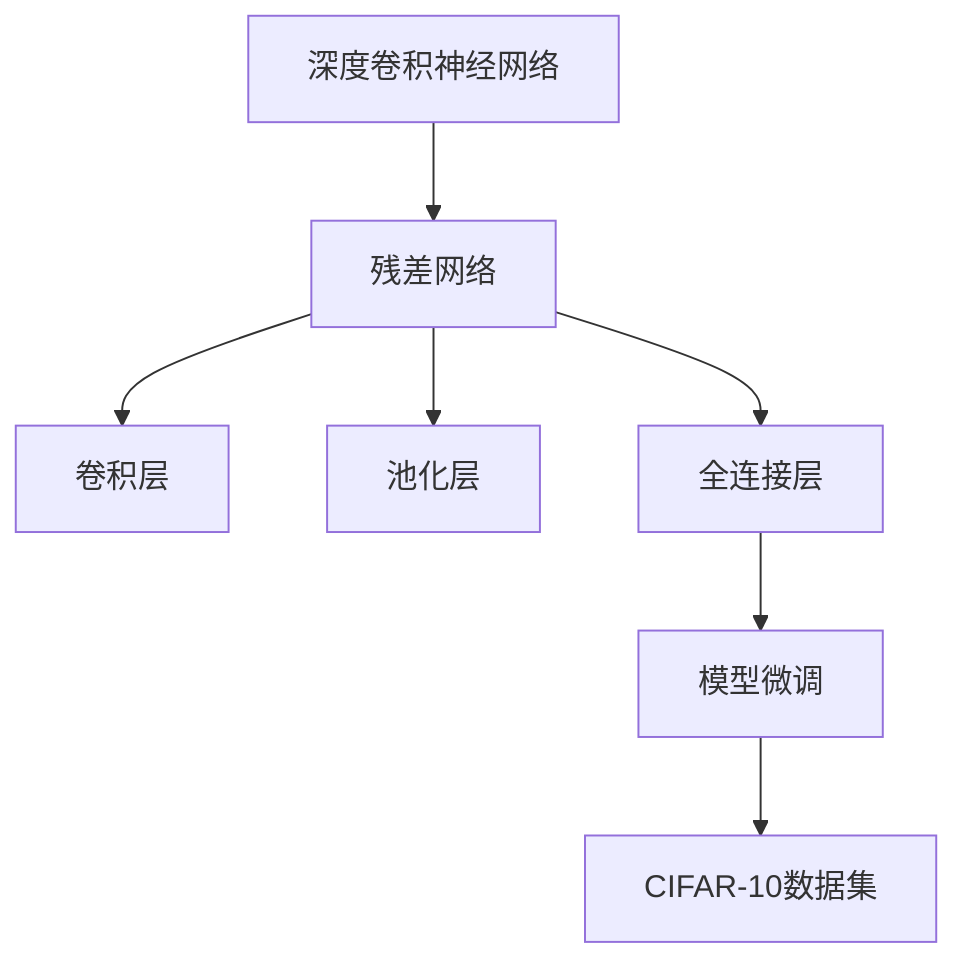
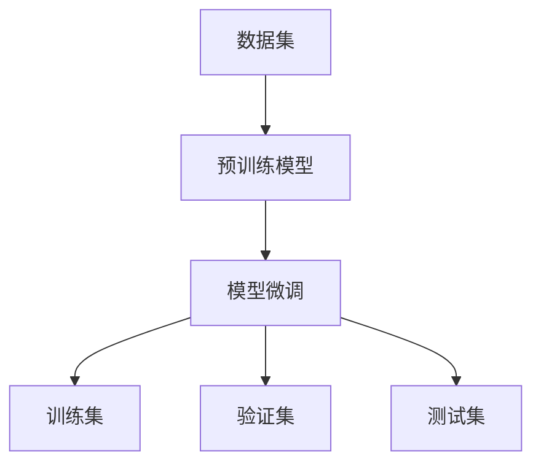
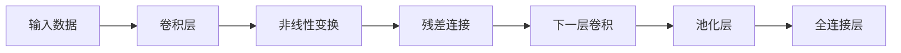
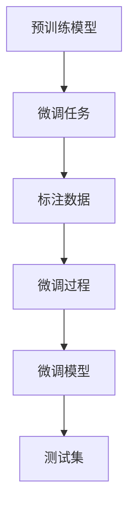
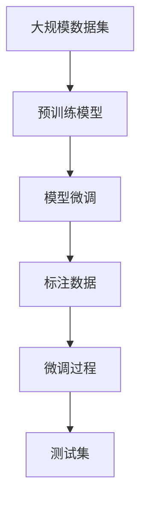

                 

# 从零开始大模型开发与微调：基于ResNet的CIFAR-10数据集分类

> 关键词：深度学习, ResNet, 卷积神经网络(CNN), 图像分类, CIFAR-10数据集, 模型微调, TensorFlow, Keras

## 1. 背景介绍

### 1.1 问题由来
随着深度学习技术的快速发展，深度神经网络在计算机视觉、自然语言处理、语音识别等领域取得了显著成果。在图像分类任务中，基于深度卷积神经网络(CNN)的大模型展示了强大的表征能力。然而，在实际应用中，构建深度模型的复杂性和计算需求依然是一个重要的挑战。因此，寻找一种更高效、更可扩展的大模型构建方式，成为当前学术界和工业界的热点问题。

### 1.2 问题核心关键点
ResNet（残差网络）作为深度神经网络领域的里程碑，通过引入残差连接(Residual Connections)解决深度网络训练中的梯度消失问题，显著提升了网络深度和性能。因此，本文将从ResNet模型入手，介绍基于ResNet的大模型开发与微调过程，并探讨其在图像分类任务中的应用。

### 1.3 问题研究意义
通过构建基于ResNet的大模型并对其进行微调，有助于提升图像分类任务的准确性和泛化能力。这种微调方法可以降低对标注数据的依赖，提高模型的可迁移性，加速模型在实际应用中的部署和优化，具有重要的理论和实际意义。

## 2. 核心概念与联系

### 2.1 核心概念概述

为了更好地理解基于ResNet的CIFAR-10图像分类任务，本节将介绍几个密切相关的核心概念：

- **深度卷积神经网络(CNN)**：一种特殊的神经网络结构，用于处理具有网格结构的数据，如图像、语音等。CNN通过多层卷积、池化和全连接层，学习输入数据的高级特征表示。
- **残差网络(ResNet)**：通过引入残差连接来解决深度神经网络训练中的梯度消失问题，使得网络可以更深、更宽。ResNet的核心思想是通过残差块(Residual Block)实现跳跃连接，使得信息能够在网络中流动。
- **卷积层(Convolutional Layer)**：CNN的核心组件，通过滑动卷积核对输入数据进行特征提取。卷积层具有参数共享和局部连接的特点，可以有效地提取局部特征。
- **池化层(Pooling Layer)**：用于降采样，减小输入特征的维度。常见的池化方法包括最大池化和平均池化，能够提取图像的局部不变性。
- **全连接层(Fully Connected Layer)**：将卷积层的输出展开成向量，并传递给全连接层进行分类。全连接层具有参数密集的特点，适合处理高维向量。
- **模型微调(Fine-Tuning)**：通过在预训练模型的基础上，使用少量标注数据进行有监督学习，优化模型在特定任务上的性能。微调过程可以提升模型的泛化能力，加速模型训练。
- **CIFAR-10数据集**：一种常用的图像分类数据集，包含10个类别的60,000张32x32彩色图像。CIFAR-10数据集是图像分类任务的经典基准，常被用于测试和评估图像分类模型的性能。

这些核心概念之间的逻辑关系可以通过以下Mermaid流程图来展示：



这个流程图展示了大模型构建和微调的主要流程：

1. 深度卷积神经网络是构建大模型的基础。
2. ResNet通过引入残差连接，进一步提升了网络的深度和性能。
3. 卷积层和池化层用于提取输入数据的高维特征表示。
4. 全连接层将特征向量映射到类别空间，进行分类。
5. 模型微调通过在预训练模型基础上添加少量训练数据，优化模型性能。
6. CIFAR-10数据集作为微调的基准，用于评估模型效果。

### 2.2 概念间的关系

这些核心概念之间存在着紧密的联系，形成了基于ResNet的图像分类任务的基本框架。下面通过几个Mermaid流程图来展示这些概念之间的关系。

#### 2.2.1 大模型构建流程



这个流程图展示了从数据集到预训练模型，再到模型微调的整体流程。

#### 2.2.2 ResNet的核心思想



这个流程图展示了ResNet的基本结构，通过引入残差连接来解决梯度消失问题。

#### 2.2.3 模型微调方法



这个流程图展示了基于ResNet的模型微调流程，通过在预训练模型基础上添加少量标注数据，优化模型在特定任务上的性能。

### 2.3 核心概念的整体架构

最后，我们用一个综合的流程图来展示这些核心概念在大模型微调过程中的整体架构：



这个综合流程图展示了从大规模数据集到预训练模型，再到模型微调的整体架构。通过这些核心概念，我们可以更好地理解基于ResNet的图像分类任务的构建和微调过程。

## 3. 核心算法原理 & 具体操作步骤

### 3.1 算法原理概述

基于ResNet的图像分类任务可以分为预训练和微调两个阶段。预训练阶段，使用大规模无标签数据集，如ImageNet，对ResNet模型进行训练。微调阶段，在特定任务的数据集上，使用少量标注数据进行有监督学习，优化模型在特定分类任务上的性能。

预训练和微调的基本框架如下：

- **预训练**：使用大规模无标签数据集，对ResNet模型进行自监督学习。常用的自监督学习方法包括自编码器、掩码语言模型等。
- **微调**：在特定任务的数据集上，使用少量标注数据进行有监督学习，优化模型在特定分类任务上的性能。微调过程中，通常只更新顶层全连接层和分类器的权重，而保持其他层的参数不变。

### 3.2 算法步骤详解

以下是基于ResNet的CIFAR-10图像分类任务的具体微调步骤：

**Step 1: 准备数据集和模型**

1. 下载CIFAR-10数据集：包含60,000张32x32彩色图像，每个类别6,000张。
2. 划分训练集、验证集和测试集：一般将数据集划分为60,000张用于训练，10,000张用于验证，10,000张用于测试。
3. 导入预训练的ResNet模型：可以从TensorFlow Hub或Keras中导入预训练的ResNet模型，如ResNet-18、ResNet-50等。
4. 导入微调所需的组件：如标签集、损失函数、优化器等。

**Step 2: 构建微调模型**

1. 定义微调模型：在预训练模型的基础上，添加顶层全连接层和分类器。
2. 定义微调任务：根据CIFAR-10数据集，定义10个类别的输出标签。
3. 定义损失函数：常用的损失函数包括交叉熵损失、均方误差损失等。
4. 定义优化器：常用的优化器包括SGD、Adam等。

**Step 3: 设置微调超参数**

1. 设置学习率：通常选择较小的学习率，如1e-4，以避免破坏预训练权重。
2. 设置批大小：通常选择32或64的批大小，以加快训练速度。
3. 设置迭代轮数：通常选择10-50轮迭代，以确保微调效果。
4. 设置正则化技术：如L2正则、Dropout等，以防止过拟合。

**Step 4: 执行梯度训练**

1. 将训练集数据分批次输入模型，前向传播计算损失函数。
2. 反向传播计算参数梯度，根据设定的优化算法和学习率更新模型参数。
3. 周期性在验证集上评估模型性能，根据性能指标决定是否触发Early Stopping。
4. 重复上述步骤直至满足预设的迭代轮数或Early Stopping条件。

**Step 5: 测试和部署**

1. 在测试集上评估微调后模型。
2. 使用微调后的模型对新样本进行推理预测，集成到实际的应用系统中。
3. 持续收集新的数据，定期重新微调模型，以适应数据分布的变化。

### 3.3 算法优缺点

基于ResNet的CIFAR-10图像分类任务具有以下优点：

- **高精度**：ResNet模型通过引入残差连接，显著提升了网络的深度和性能，能够在图像分类任务中取得高精度。
- **泛化能力强**：预训练模型通过大规模无标签数据集进行训练，具有较强的泛化能力，能够在新数据集上取得良好表现。
- **参数高效微调**：通常只更新顶层全连接层和分类器的权重，减少了模型参数的更新量，降低了计算成本。

然而，基于ResNet的CIFAR-10图像分类任务也存在一些缺点：

- **对标注数据依赖**：微调过程需要大量的标注数据，获取高质量标注数据的成本较高。
- **模型复杂度高**：ResNet模型较深，参数量较大，对计算资源的需求较高。
- **训练时间长**：大规模数据集和深层的ResNet模型，导致训练时间长，需要耗费大量计算资源。

### 3.4 算法应用领域

基于ResNet的CIFAR-10图像分类任务在多个领域得到了广泛应用，例如：

- **计算机视觉**：用于图像分类、目标检测、图像分割等任务。
- **自动驾驶**：用于车辆检测、行人检测、交通标志识别等任务。
- **医疗影像**：用于肿瘤识别、病变检测、医学图像分类等任务。
- **安防监控**：用于人脸识别、行为识别、异常检测等任务。
- **电子零售**：用于商品分类、用户行为分析、推荐系统等任务。

## 4. 数学模型和公式 & 详细讲解 & 举例说明

### 4.1 数学模型构建

基于ResNet的CIFAR-10图像分类任务可以分为预训练和微调两个阶段。预训练阶段，使用大规模无标签数据集，对ResNet模型进行训练。微调阶段，在特定任务的数据集上，使用少量标注数据进行有监督学习，优化模型在特定分类任务上的性能。

**预训练模型**：假设预训练模型为 $M_{\theta}$，其中 $\theta$ 为预训练得到的模型参数。

**微调模型**：假设微调模型为 $M_{\theta}^*$，其中 $\theta^*$ 为微调后的模型参数。

### 4.2 公式推导过程

以二分类任务为例，展示微调过程中的损失函数和梯度计算公式。

**交叉熵损失函数**：
$$
\mathcal{L}(\theta^*) = -\frac{1}{N}\sum_{i=1}^N \sum_{j=1}^C y_{ij} \log \hat{y}_{ij}
$$

其中 $y_{ij}$ 为第 $i$ 张图片第 $j$ 个类别的标签，$\hat{y}_{ij}$ 为模型预测的第 $i$ 张图片第 $j$ 个类别的概率。

**梯度计算公式**：
$$
\frac{\partial \mathcal{L}(\theta^*)}{\partial \theta^*} = -\frac{1}{N}\sum_{i=1}^N \sum_{j=1}^C y_{ij} \frac{\partial \log \hat{y}_{ij}}{\partial \theta^*}
$$

其中 $\frac{\partial \log \hat{y}_{ij}}{\partial \theta^*}$ 可以通过反向传播算法高效计算。

### 4.3 案例分析与讲解

假设在CIFAR-10数据集上进行微调，原始ResNet-18模型有18层，每个卷积层和池化层的参数计算复杂度较高。因此，通常只更新顶层全连接层和分类器的权重，以减少计算量和资源消耗。

假设全连接层的输出大小为1024，则微调模型可以使用如下公式进行训练：
$$
M_{\theta^*}(x) = M_{\theta}(x) + \text{Dense}(1024, 1024) + \text{Softmax}
$$

其中 $\text{Dense}(1024, 1024)$ 为1024个神经元的全连接层，$\text{Softmax}$ 为10个类别的输出层。

假设使用Adam优化器，学习率为1e-4，批大小为32，迭代轮数为20。训练过程如下：

1. 加载CIFAR-10数据集。
2. 划分训练集、验证集和测试集。
3. 加载预训练的ResNet-18模型。
4. 添加顶层全连接层和分类器。
5. 定义损失函数和优化器。
6. 训练过程：
   - 使用Adam优化器，学习率为1e-4，批大小为32。
   - 定义损失函数为交叉熵损失。
   - 周期性在验证集上评估模型性能。
   - 重复上述步骤，直到满足预设的迭代轮数或Early Stopping条件。
7. 在测试集上评估微调后模型。

## 5. 项目实践：代码实例和详细解释说明

### 5.1 开发环境搭建

在进行微调实践前，我们需要准备好开发环境。以下是使用Python进行TensorFlow和Keras开发的环境配置流程：

1. 安装Anaconda：从官网下载并安装Anaconda，用于创建独立的Python环境。

2. 创建并激活虚拟环境：
```bash
conda create -n tf-env python=3.8 
conda activate tf-env
```

3. 安装TensorFlow和Keras：
```bash
conda install tensorflow=2.5 keras=2.5
```

4. 安装各类工具包：
```bash
pip install numpy pandas scikit-learn matplotlib tqdm jupyter notebook ipython
```

完成上述步骤后，即可在`tf-env`环境中开始微调实践。

### 5.2 源代码详细实现

以下是基于TensorFlow和Keras对ResNet模型进行CIFAR-10图像分类任务微调的PyTorch代码实现。

```python
import tensorflow as tf
from tensorflow.keras.applications.resnet50 import ResNet50
from tensorflow.keras.layers import Dense, Softmax
from tensorflow.keras.models import Model
from tensorflow.keras.optimizers import Adam
from tensorflow.keras.datasets import cifar10

# 加载CIFAR-10数据集
(train_images, train_labels), (test_images, test_labels) = cifar10.load_data()

# 数据预处理
train_images = train_images / 255.0
test_images = test_images / 255.0

# 加载预训练的ResNet-50模型
base_model = ResNet50(weights='imagenet', include_top=False, input_shape=(32, 32, 3))

# 添加顶层全连接层和分类器
x = base_model.output
x = Dense(1024, activation='relu')(x)
predictions = Dense(10, activation='softmax')(x)

# 构建微调模型
model = Model(inputs=base_model.input, outputs=predictions)

# 设置微调超参数
learning_rate = 1e-4
batch_size = 32
epochs = 20

# 定义损失函数和优化器
loss_fn = tf.keras.losses.SparseCategoricalCrossentropy(from_logits=True)
optimizer = Adam(learning_rate=learning_rate)

# 训练过程
model.compile(optimizer=optimizer, loss=loss_fn, metrics=['accuracy'])

# 训练集
train_dataset = tf.data.Dataset.from_tensor_slices((train_images, train_labels)).shuffle(10000).batch(batch_size)

# 验证集
val_dataset = tf.data.Dataset.from_tensor_slices((test_images, test_labels)).batch(batch_size)

# 训练模型
history = model.fit(train_dataset, epochs=epochs, validation_data=val_dataset, verbose=2)

# 测试集
test_dataset = tf.data.Dataset.from_tensor_slices((test_images, test_labels)).batch(batch_size)

# 评估模型
test_loss, test_acc = model.evaluate(test_dataset)
print('Test accuracy:', test_acc)
```

以上就是使用TensorFlow和Keras对ResNet模型进行CIFAR-10图像分类任务微调的完整代码实现。可以看到，得益于TensorFlow和Keras的强大封装，我们可以用相对简洁的代码完成ResNet模型的加载和微调。

### 5.3 代码解读与分析

让我们再详细解读一下关键代码的实现细节：

**数据预处理**：
- 加载CIFAR-10数据集，并将其归一化到0-1之间。

**模型构建**：
- 加载预训练的ResNet-50模型，并添加顶层全连接层和分类器。

**微调超参数设置**：
- 设置学习率、批大小和迭代轮数，以控制微调过程。

**损失函数和优化器定义**：
- 使用交叉熵损失函数，并使用Adam优化器进行梯度更新。

**训练过程**：
- 使用训练集进行迭代训练，并在验证集上评估模型性能。

**测试过程**：
- 在测试集上评估微调后模型的准确率，并打印输出。

**TensorFlow和Keras的优势**：
- TensorFlow和Keras提供了强大的模型构建和训练框架，能够显著简化深度学习模型的开发和调试。
- TensorFlow和Keras提供了丰富的预训练模型和组件，便于快速搭建大模型和微调流程。
- TensorFlow和Keras具有较好的兼容性和扩展性，能够与多种后端（如TensorFlow Lite、TensorRT等）进行无缝集成，支持模型的部署和优化。

## 6. 实际应用场景

### 6.1 智能安防监控

基于ResNet的CIFAR-10图像分类任务，可以应用于智能安防监控领域。在安防监控系统中，通常需要实时监测视频流中的异常事件，如入侵、火灾、盗窃等。通过微调ResNet模型，可以在视频流中检测和识别异常事件，提高安防系统的智能化水平。

具体而言，可以从实时摄像头获取视频流，并提取每帧图像作为输入数据。在微调后的ResNet模型中，通过分类器对图像进行实时分类，识别出异常事件。同时，可以结合图像处理技术，如背景子traction、目标跟踪等，进一步提升异常事件检测的准确性和鲁棒性。

### 6.2 医疗影像诊断

在医疗影像诊断中，基于ResNet的CIFAR-10图像分类任务同样具有广泛的应用前景。医学影像通常包含大量视觉信息，可以通过微调ResNet模型进行自动诊断和分类。

具体而言，可以从医学影像库中提取图像数据，并打上标签。在微调后的ResNet模型中，通过分类器对图像进行分类，识别出病变或异常区域。同时，可以结合深度学习技术，如生成对抗网络（GAN）、自监督学习等，进一步提升图像分类模型的鲁棒性和泛化能力。

### 6.3 电子商务推荐

在电子商务推荐系统中，基于ResNet的CIFAR-10图像分类任务同样具有重要的应用价值。电子商务平台通常需要根据用户的历史行为数据，推荐用户可能感兴趣的商品。通过微调ResNet模型，可以在用户上传的商品图片中进行自动分类和推荐，提高推荐系统的智能化水平。

具体而言，可以从用户上传的商品图片库中提取图像数据，并打上商品标签。在微调后的ResNet模型中，通过分类器对图像进行分类，识别出商品类别。同时，可以结合用户行为数据，进一步优化推荐算法，提升推荐系统的个性化和精准度。

### 6.4 未来应用展望

随着ResNet模型和微调方法的不断发展，基于微调范式将在更多领域得到应用，为传统行业带来变革性影响。

在智慧城市治理中，基于ResNet的图像分类任务可以帮助城市管理者实时监测交通流量、环境污染、公共安全等事件，构建更安全、高效的未来城市。

在工业生产监控中，基于ResNet的图像分类任务可以帮助工厂检测产品质量、识别设备异常，提高生产效率和产品质量。

在农业领域，基于ResNet的图像分类任务可以帮助农民识别作物病虫害、检测农田环境，提高农业生产效率和环境保护水平。

此外，在媒体娱乐、文化创意等领域，基于ResNet的图像分类任务同样可以发挥重要作用，为数字化转型提供新的技术路径。相信随着技术的日益成熟，基于ResNet的图像分类任务必将在更广阔的应用领域大放异彩，深刻影响人类的生产生活方式。

## 7. 工具和资源推荐

### 7.1 学习资源推荐

为了帮助开发者系统掌握基于ResNet的CIFAR-10图像分类任务的理论基础和实践技巧，这里推荐一些优质的学习资源：

1. 《深度学习入门之卷积神经网络》系列博文：由深度学习专家撰写，深入浅出地介绍了卷积神经网络的基本概念和实践技巧。

2. 《TensorFlow实战》系列书籍：由TensorFlow官方和社区合作编写的实战书籍，详细介绍了TensorFlow的开发环境和具体应用。

3. 《Keras深度学习实践》书籍：由Keras社区合作编写的实战书籍，详细介绍了Keras的模型构建和训练方法。

4. CS231n《卷积神经网络》课程：斯坦福大学开设的深度学习课程，提供了大量视频教程和实验代码，是学习卷积神经网络的重要资源。

5. GitHub开源项目：如ResNet模型库、CIFAR-10数据集、深度学习框架等，是学习深度学习的重要参考。

通过对这些资源的学习实践，相信你一定能够快速掌握基于ResNet的CIFAR-10图像分类任务的精髓，并用于解决实际的图像分类问题。

### 7.2 开发工具推荐

高效的开发离不开优秀的工具支持。以下是几款用于ResNet模型开发和微调的工具：

1. TensorFlow：基于Python的开源深度学习框架，灵活动态的计算图，适合快速迭代研究。

2. Keras：基于Python的高级深度学习框架，提供了丰富的预训练模型和组件，适合快速搭建模型和微调流程。

3. PyTorch：基于Python的开源深度学习框架，提供了动态计算图和自动微分功能，适合快速原型开发。

4. Jupyter Notebook：交互式编程环境，支持多语言的混合编程，适合快速开发和调试模型。

5. Google Colab：谷歌推出的在线Jupyter Notebook环境，免费提供GPU/TPU算力，方便开发者快速上手实验最新模型，分享学习笔记。

合理利用这些工具，可以显著提升ResNet模型微调任务的开发效率，加快创新迭代的步伐。

### 7.3 相关论文推荐

基于ResNet的CIFAR-10图像分类任务的研究源于学界的持续研究。以下是几篇奠基性的相关论文，推荐阅读：

1. "Identity Mappings in Deep Residual Networks"（论文链接：[Identity Mappings in Deep Residual Networks](https://arxiv.org/abs/1512.03385)）：提出了残差网络的基本结构，解决了深度神经网络训练中的梯度消失问题。

2. "Deep Residual Learning for Image Recognition"（论文链接：[Deep Residual Learning for Image Recognition](https://arxiv.org/abs/1512.03385)）：展示了ResNet模型在图像分类任务中的强大性能，刷新了ImageNet数据集上的SOTA。

3. "Wide Residual Networks"（论文链接：[Wide Residual Networks](https://arxiv.org/abs/1605.07146)）：探讨了残差网络中宽层结构的影响，提出了多宽残差网络，进一步提升了模型的性能。

4. "Pre-Trained Models for Image Classification"（论文链接：[Pre-Trained Models for Image Classification](https://arxiv.org/abs/1708.00443)）：介绍了预训练模型在图像分类任务中的应用，展示了微调后的模型在CIFAR-10等数据集上的优异性能。

5. "Adaptive Residual Network"（论文链接：[Adaptive Residual Network](https://arxiv.org/abs/1807.08146)）：提出了自适应残差网络，通过动态调整网络结构，提升模型的性能和效率。

这些论文代表了大模型微调技术的发展脉络。通过学习这些前沿成果，可以帮助研究者把握学科前进方向，激发更多的创新灵感。

除上述资源外，还有一些值得关注的前沿资源，帮助开发者紧跟大模型微调技术的最新进展，例如：

1. arXiv论文预印本：人工智能领域最新研究成果的

