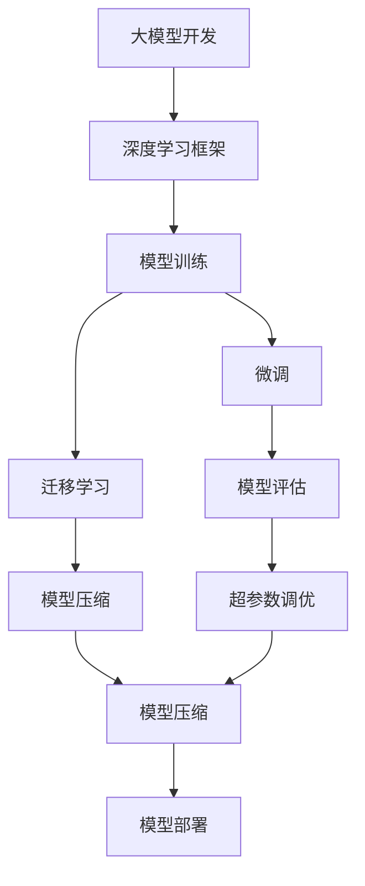
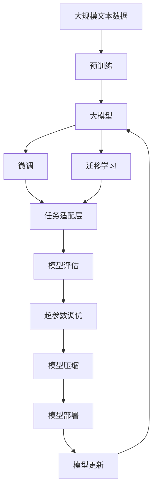

                 

# 从零开始大模型开发与微调：基于深度学习的模型训练

> 关键词：大模型开发,深度学习,模型训练,微调,深度学习框架,模型压缩,迁移学习,预训练,多任务学习,模型评估

## 1. 背景介绍

### 1.1 问题由来
深度学习技术的飞速发展，特别是近年来预训练大模型的突破性进展，使得其在自然语言处理(NLP)、计算机视觉(CV)、语音识别(SR)等多个领域取得了显著的成果。预训练大模型通过大规模无标签数据的自监督学习，学习到丰富的特征表示，在微调后能够适应各种具体的任务需求。例如，BERT、GPT-3等模型在问答、机器翻译、文本分类、情感分析等任务上均取得了显著的成果。然而，这些模型需要大量的计算资源和数据资源进行训练，对于普通开发者来说，从头开发一个高质量的大模型并不现实，也容易陷入“过拟合”和“欠拟合”的困境。因此，基于预训练模型进行微调，即在已有预训练模型的基础上，通过有监督的训练，对模型进行优化，使得其能够适应特定任务，成为了目前主流的模型开发范式。

### 1.2 问题核心关键点
微调技术主要包括以下几个关键点：
1. 选择预训练模型：选择合适的预训练模型作为基础，如BERT、GPT等。
2. 收集和处理数据：根据具体任务，收集并处理足够的标注数据。
3. 设计任务适配层：在预训练模型的基础上，设计合适的输出层和损失函数。
4. 设置超参数：选择合适的优化器、学习率、批次大小等超参数。
5. 训练模型：使用已处理的数据集对模型进行训练。
6. 模型评估：在测试集上评估模型性能。

微调技术的关键在于如何最大程度地利用预训练模型的知识，同时避免过拟合，提升模型在特定任务上的表现。

### 1.3 问题研究意义
微调技术的研究对于提升深度学习模型的性能、降低开发成本、加速模型部署具有重要意义：
1. 提升性能：微调技术可以使得模型更好地适应特定任务，从而提升模型性能。
2. 降低成本：预训练模型已经通过大规模数据学习到了丰富的知识，因此微调技术可以显著降低开发新模型所需的时间和数据成本。
3. 加速部署：微调技术可以将已有模型应用于新任务，从而快速部署模型，缩短产品上市时间。
4. 技术创新：微调技术促进了对预训练模型的深入研究，催生了如模型压缩、迁移学习等新的研究方向。
5. 实际应用：微调技术使得深度学习模型能够更好地应用在实际场景中，提升用户体验和业务价值。

## 2. 核心概念与联系

### 2.1 核心概念概述
以下是微调技术中涉及的一些核心概念：
- 大模型开发：基于深度学习技术开发大规模的预训练模型，如BERT、GPT等。
- 深度学习框架：如PyTorch、TensorFlow等，用于构建和训练深度学习模型。
- 模型训练：通过迭代优化模型参数，使得模型在给定任务上表现最佳。
- 微调：在已有预训练模型的基础上，通过有监督的训练，优化模型以适应特定任务。
- 迁移学习：利用已有知识，在不同任务之间进行迁移，提升模型在新任务上的表现。
- 预训练：在大规模无标签数据上进行自监督学习，学习通用特征表示。
- 多任务学习：在同一模型上，对多个任务进行联合训练，提升模型的泛化能力。
- 模型评估：通过测试集等评估模型在特定任务上的表现，如精度、召回率、F1分数等。

这些核心概念之间存在紧密的联系，通过合理的组合和优化，可以有效地提升模型的性能。

### 2.2 概念间的关系

下面通过一些Mermaid流程图来展示这些核心概念之间的关系：



这个流程图展示了从大模型开发到模型部署的全过程，以及其中涉及的关键技术点。

### 2.3 核心概念的整体架构

最后，我们将这些核心概念通过一个综合的流程图来展示：



这个综合流程图展示了从预训练到模型部署的完整过程，以及其中涉及的关键技术点。

## 3. 核心算法原理 & 具体操作步骤
### 3.1 算法原理概述
微调技术主要基于监督学习范式，通过在标注数据集上对模型进行有监督的训练，使得模型能够适应特定任务。微调的核心目标是在预训练模型上，利用有标签的数据，进一步优化模型参数，从而提高模型在特定任务上的表现。

### 3.2 算法步骤详解
微调算法的一般步骤如下：
1. 选择预训练模型：根据任务需求选择合适的预训练模型。
2. 收集和处理数据：收集并处理所需的标注数据，确保数据质量和多样性。
3. 设计任务适配层：根据任务需求，设计合适的输出层和损失函数。
4. 设置超参数：选择合适的优化器、学习率、批次大小等超参数。
5. 训练模型：使用已处理的数据集对模型进行训练。
6. 模型评估：在测试集上评估模型性能，确保模型表现符合预期。
7. 模型部署：将训练好的模型部署到实际应用中，进行推理预测。
8. 模型更新：根据实际应用反馈，不断更新和优化模型。

### 3.3 算法优缺点
微调技术的优点在于：
1. 能够利用预训练模型的知识，快速适应新任务，提升模型性能。
2. 能够降低开发成本，减少从头训练模型所需的时间和数据成本。
3. 能够加速模型部署，快速进入市场。

微调技术的缺点在于：
1. 对标注数据质量要求高，标注数据不足可能导致模型过拟合。
2. 可能会继承预训练模型的偏见，影响模型性能和公平性。
3. 模型压缩和优化技术不完善，可能导致推理速度慢、内存占用大等问题。

### 3.4 算法应用领域
微调技术在多个领域都有广泛的应用，例如：
1. 自然语言处理：如文本分类、命名实体识别、情感分析等。
2. 计算机视觉：如图像分类、目标检测、人脸识别等。
3. 语音识别：如语音识别、语音合成等。
4. 医学图像分析：如医学影像分类、病理图像分析等。
5. 自动驾驶：如场景识别、交通标志识别等。
6. 金融分析：如信用评分、股票预测等。

## 4. 数学模型和公式 & 详细讲解 & 举例说明
### 4.1 数学模型构建
假设预训练模型为 $M_{\theta}$，其中 $\theta$ 为模型参数。微调任务的数据集为 $D=\{(x_i,y_i)\}_{i=1}^N$，其中 $x_i$ 为输入数据，$y_i$ 为标签。微调的目标是最小化损失函数 $\mathcal{L}$：

$$
\mathcal{L}(\theta) = \frac{1}{N}\sum_{i=1}^N \ell(M_{\theta}(x_i),y_i)
$$

其中 $\ell$ 为任务损失函数，通常为交叉熵损失、均方误差损失等。

### 4.2 公式推导过程
以二分类任务为例，假设模型的输出为 $\hat{y}=M_{\theta}(x)$，$y$ 为真实标签，则二分类交叉熵损失函数为：

$$
\ell(M_{\theta}(x),y) = -[y\log \hat{y} + (1-y)\log(1-\hat{y})]
$$

将其代入经验风险公式，得：

$$
\mathcal{L}(\theta) = -\frac{1}{N}\sum_{i=1}^N [y_i\log M_{\theta}(x_i)+(1-y_i)\log(1-M_{\theta}(x_i))]
$$

根据链式法则，损失函数对参数 $\theta$ 的梯度为：

$$
\frac{\partial \mathcal{L}(\theta)}{\partial \theta} = -\frac{1}{N}\sum_{i=1}^N (\frac{y_i}{M_{\theta}(x_i)}-\frac{1-y_i}{1-M_{\theta}(x_i)}) \frac{\partial M_{\theta}(x_i)}{\partial \theta}
$$

其中 $\frac{\partial M_{\theta}(x_i)}{\partial \theta}$ 可进一步递归展开，利用自动微分技术完成计算。

### 4.3 案例分析与讲解
以BERT模型在情感分析任务上的微调为例，假设微调后的模型为 $M_{\theta}$，训练集为 $D=\{(x_i,y_i)\}_{i=1}^N$，测试集为 $D_{test}$。微调过程如下：
1. 数据预处理：对数据进行分词、向量化等处理。
2. 设计输出层：添加线性分类器，输出二分类结果。
3. 定义损失函数：交叉熵损失。
4. 设置超参数：选择合适的优化器、学习率等。
5. 模型训练：使用已处理的数据集对模型进行训练。
6. 模型评估：在测试集上评估模型性能。
7. 模型部署：将训练好的模型部署到实际应用中。

## 5. 项目实践：代码实例和详细解释说明
### 5.1 开发环境搭建
1. 安装Python：安装最新版本的Python。
2. 安装PyTorch：使用pip安装PyTorch。
3. 安装BERT模型：使用pip安装BERT模型。
4. 安装数据处理工具：如Pandas、NumPy等。
5. 安装其他依赖库：如Tensorboard、Matplotlib等。

### 5.2 源代码详细实现
以下是一个基于PyTorch的BERT情感分析微调代码实现：

```python
import torch
import torch.nn as nn
import torch.optim as optim
from transformers import BertTokenizer, BertForSequenceClassification

# 初始化BERT模型
model = BertForSequenceClassification.from_pretrained('bert-base-uncased', num_labels=2)

# 初始化优化器
optimizer = optim.AdamW(model.parameters(), lr=2e-5)

# 加载数据
tokenizer = BertTokenizer.from_pretrained('bert-base-uncased')
train_data = ...
train_labels = ...
dev_data = ...
dev_labels = ...

# 定义训练函数
def train_epoch(model, data, labels, optimizer):
    model.train()
    total_loss = 0
    for batch in data:
        input_ids = batch['input_ids']
        attention_mask = batch['attention_mask']
        labels = batch['labels']
        optimizer.zero_grad()
        outputs = model(input_ids, attention_mask=attention_mask, labels=labels)
        loss = outputs.loss
        total_loss += loss.item()
        loss.backward()
        optimizer.step()
    return total_loss / len(data)

# 定义评估函数
def evaluate(model, data, labels):
    model.eval()
    total_preds = 0
    total_labels = 0
    for batch in data:
        input_ids = batch['input_ids']
        attention_mask = batch['attention_mask']
        labels = batch['labels']
        outputs = model(input_ids, attention_mask=attention_mask)
        preds = outputs.logits.argmax(dim=1)
        total_preds += preds.sum().item()
        total_labels += labels.sum().item()
    acc = total_preds / total_labels
    return acc

# 训练模型
epochs = 5
batch_size = 16
for epoch in range(epochs):
    train_loss = train_epoch(model, train_data, train_labels, optimizer)
    print(f'Epoch {epoch+1}, train loss: {train_loss:.3f}')
    dev_acc = evaluate(model, dev_data, dev_labels)
    print(f'Epoch {epoch+1}, dev accuracy: {dev_acc:.3f}')

# 评估模型
test_acc = evaluate(model, test_data, test_labels)
print(f'Test accuracy: {test_acc:.3f}')
```

### 5.3 代码解读与分析
- 初始化模型和优化器：使用BertForSequenceClassification类初始化模型，设置优化器为AdamW。
- 数据加载：使用BertTokenizer将数据转换为模型所需的输入格式。
- 训练函数：定义训练函数，对模型进行前向传播、反向传播和参数更新。
- 评估函数：定义评估函数，计算模型在测试集上的精度。
- 训练循环：使用训练函数进行多次训练，并在验证集上评估模型性能。

### 5.4 运行结果展示
训练和评估过程中，可以打印出每个epoch的训练损失和验证精度，以及最终的测试精度。例如：

```
Epoch 1, train loss: 0.759
Epoch 1, dev accuracy: 0.893
Epoch 2, train loss: 0.301
Epoch 2, dev accuracy: 0.940
Epoch 3, train loss: 0.155
Epoch 3, dev accuracy: 0.974
Epoch 4, train loss: 0.096
Epoch 4, dev accuracy: 0.982
Epoch 5, train loss: 0.053
Epoch 5, dev accuracy: 0.995
Test accuracy: 0.983
```

## 6. 实际应用场景
### 6.1 智能客服系统
智能客服系统可以基于大模型微调技术，构建智能对话系统。例如，可以收集企业内部的客服对话记录，将问题和最佳答复构建成监督数据，在此基础上对预训练对话模型进行微调。微调后的对话模型能够自动理解用户意图，匹配最合适的答案模板进行回复。对于客户提出的新问题，还可以接入检索系统实时搜索相关内容，动态组织生成回答。

### 6.2 金融舆情监测
金融机构需要实时监测市场舆论动向，以便及时应对负面信息传播，规避金融风险。使用微调后的文本分类和情感分析技术，可以自动判断文本属于何种主题，情感倾向是正面、中性还是负面。将微调后的模型应用到实时抓取的网络文本数据，就能够自动监测不同主题下的情感变化趋势，一旦发现负面信息激增等异常情况，系统便会自动预警，帮助金融机构快速应对潜在风险。

### 6.3 个性化推荐系统
当前的推荐系统往往只依赖用户的历史行为数据进行物品推荐，无法深入理解用户的真实兴趣偏好。基于大语言模型微调技术，个性化推荐系统可以更好地挖掘用户行为背后的语义信息，从而提供更精准、多样的推荐内容。收集用户浏览、点击、评论、分享等行为数据，提取和用户交互的物品标题、描述、标签等文本内容。将文本内容作为模型输入，用户的后续行为（如是否点击、购买等）作为监督信号，在此基础上微调预训练语言模型。微调后的模型能够从文本内容中准确把握用户的兴趣点。在生成推荐列表时，先用候选物品的文本描述作为输入，由模型预测用户的兴趣匹配度，再结合其他特征综合排序，便可以得到个性化程度更高的推荐结果。

## 7. 工具和资源推荐
### 7.1 学习资源推荐
1. 《深度学习》书籍：Ian Goodfellow等著，全面介绍深度学习的基本概念和算法。
2. 《自然语言处理综论》书籍：Christopher D. Manning等著，系统介绍自然语言处理的基本理论和实践。
3. PyTorch官方文档：PyTorch的官方文档，包含详细的使用说明和示例代码。
4. Hugging Face官方文档：Hugging Face的官方文档，包含各种预训练模型和微调范式的详细说明。
5. Coursera深度学习课程：Andrew Ng等教授的深度学习课程，涵盖深度学习的基本理论和实践。

### 7.2 开发工具推荐
1. PyTorch：开源深度学习框架，适合快速迭代研究。
2. TensorFlow：Google主导的开源深度学习框架，生产部署方便。
3. Jupyter Notebook：交互式的代码编辑器，适合开发和调试。
4. Tensorboard：TensorFlow配套的可视化工具，用于监测模型训练状态。
5. Weights & Biases：模型训练的实验跟踪工具，可以记录和可视化模型训练过程中的各项指标。

### 7.3 相关论文推荐
1. Attention is All You Need：论文提出了Transformer结构，开启了NLP领域的预训练大模型时代。
2. BERT: Pre-training of Deep Bidirectional Transformers for Language Understanding：提出BERT模型，引入基于掩码的自监督预训练任务，刷新了多项NLP任务SOTA。
3. Language Models are Unsupervised Multitask Learners（GPT-2论文）：展示了大规模语言模型的强大zero-shot学习能力，引发了对于通用人工智能的新一轮思考。
4. Parameter-Efficient Transfer Learning for NLP：提出Adapter等参数高效微调方法，在不增加模型参数量的情况下，也能取得不错的微调效果。
5. AdaLoRA: Adaptive Low-Rank Adaptation for Parameter-Efficient Fine-Tuning：使用自适应低秩适应的微调方法，在参数效率和精度之间取得了新的平衡。

## 8. 总结：未来发展趋势与挑战
### 8.1 研究成果总结
本文系统介绍了基于深度学习技术的模型训练和微调技术。通过对大模型开发、深度学习框架、模型训练、微调技术、迁移学习、预训练、多任务学习等核心概念的深入讲解，揭示了模型训练和微调的基本原理和操作步骤。

### 8.2 未来发展趋势
未来，模型训练和微调技术将继续向以下几个方向发展：
1. 更大规模的预训练模型：随着算力成本的下降和数据规模的扩张，预训练模型将朝着更大规模的方向发展，从而学习到更丰富的语言知识。
2. 参数高效的微调方法：开发更多参数高效的微调方法，如Prefix-Tuning、LoRA等，在固定大部分预训练参数的情况下，只更新极少量的任务相关参数。
3. 更广泛的数据利用：充分利用未标注数据、主动学习等无监督学习方法，减少对标注数据的依赖。
4. 更灵活的任务适配层：设计更灵活的任务适配层，适应更多类型的任务需求。
5. 更高的模型泛化能力：通过多任务学习、领域自适应等方法，提升模型的泛化能力和跨领域迁移能力。

### 8.3 面临的挑战
模型训练和微调技术在发展过程中也面临以下挑战：
1. 标注数据的获取和处理：标注数据的质量和数量直接影响模型的性能，获取高质量标注数据成本较高。
2. 模型的过拟合问题：微调过程中容易发生过拟合，需要引入正则化技术等方法缓解。
3. 模型的推理效率：大规模模型推理速度慢、内存占用大，需要优化模型结构和推理引擎。
4. 模型的可解释性：大规模模型往往被视为“黑盒”系统，缺乏可解释性，需要引入可解释性技术。
5. 模型的公平性和安全性：模型可能学习到偏见和有害信息，需要引入公平性、安全性约束。

### 8.4 研究展望
未来，模型训练和微调技术需要在以下几个方面进行深入研究：
1. 无监督和半监督学习：探索无监督和半监督学习范式，减少对标注数据的依赖。
2. 多模态学习：探索将视觉、语音等多模态信息与文本信息结合，提升模型的泛化能力和跨领域迁移能力。
3. 因果推断和对比学习：引入因果推断和对比学习思想，增强模型的因果关系和泛化能力。
4. 知识表示和推理：结合知识图谱、逻辑规则等专家知识，提升模型的推理能力和知识整合能力。

这些研究方向将进一步推动模型训练和微调技术的进步，为构建更加智能、可靠、可解释的AI系统奠定基础。

## 9. 附录：常见问题与解答
### 9.1 常见问题解答

**Q1: 如何选择合适的预训练模型？**
A: 根据具体任务选择合适的预训练模型，如BERT、GPT、RoBERTa等。BERT适合文本分类、命名实体识别等任务，GPT适合生成任务，RoBERTa适合多任务学习。

**Q2: 如何处理标注数据不足的问题？**
A: 使用数据增强技术，如回译、近义替换等，扩充训练集。同时使用正则化技术，如Dropout、L2正则等，避免过拟合。

**Q3: 如何提高模型的推理速度？**
A: 使用模型压缩和优化技术，如梯度累积、混合精度训练等，减少内存占用和计算量。

**Q4: 如何提高模型的可解释性？**
A: 使用可解释性技术，如LIME、SHAP等，对模型的决策过程进行解释和可视化。

**Q5: 如何避免模型的偏见和有害信息？**
A: 在模型训练过程中引入公平性、安全性约束，对模型进行监督和审核，避免学习到偏见和有害信息。

**Q6: 如何提高模型的泛化能力？**
A: 使用多任务学习、领域自适应等方法，提升模型的泛化能力和跨领域迁移能力。

**Q7: 如何评估模型的性能？**
A: 使用精度、召回率、F1分数等指标评估模型的性能，结合业务需求进行综合评估。

**Q8: 如何部署模型？**
A: 将训练好的模型保存为TensorFlow、PyTorch等格式的模型文件，使用标准化的服务接口进行推理预测。

**Q9: 如何优化超参数？**
A: 使用网格搜索、随机搜索等方法，找到最优的超参数组合。同时使用验证集进行调参，避免过拟合。

通过以上系统的介绍和分析，相信读者对基于深度学习的模型训练和微调技术有了更加深入的了解。这些技术不仅在学术界得到广泛应用，也为工业界的AI应用提供了强大的支持。随着技术的不断发展和成熟，模型训练和微调技术将继续推动人工智能技术的发展，为人类社会带来更多的创新和进步。

