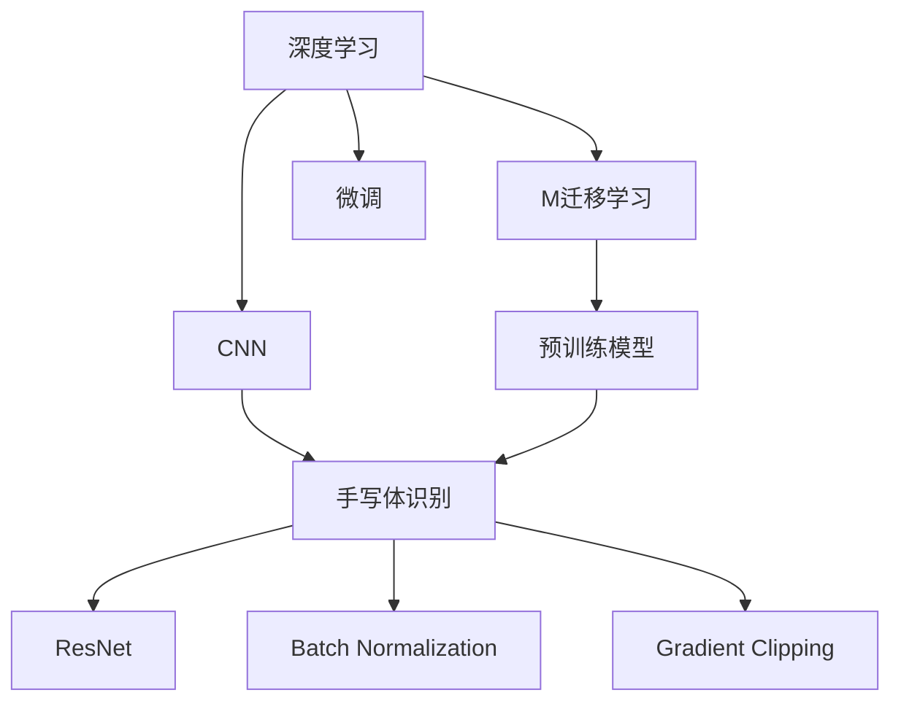
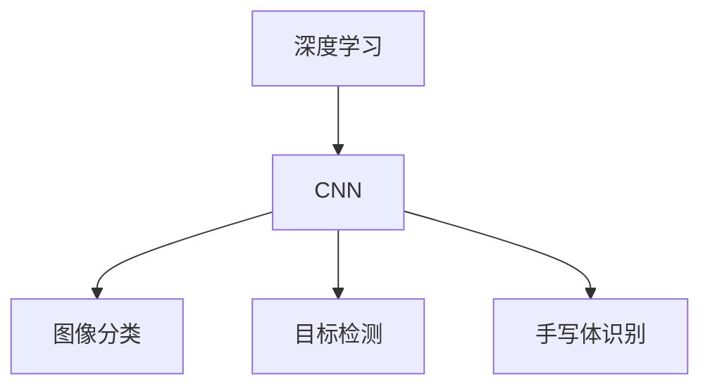
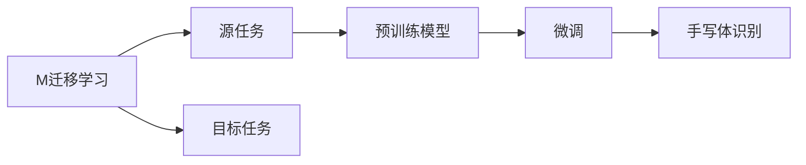
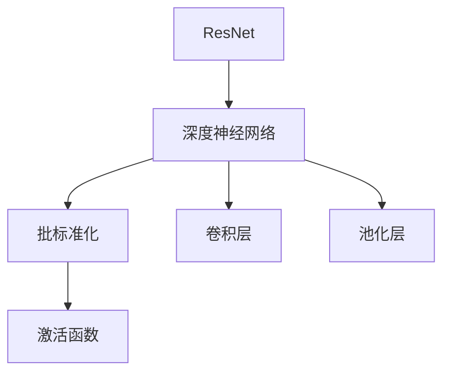
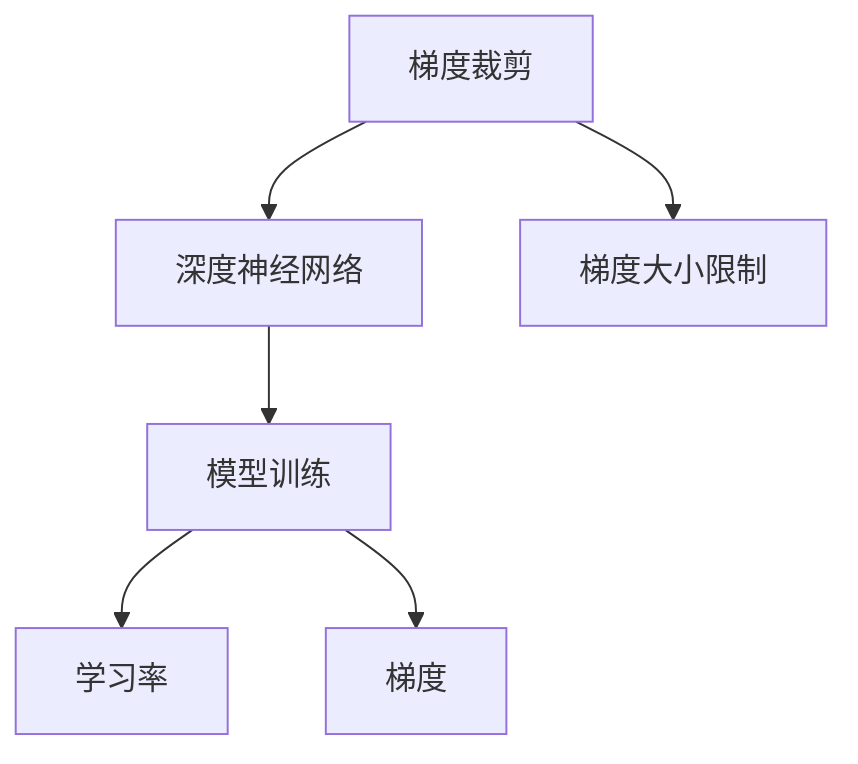
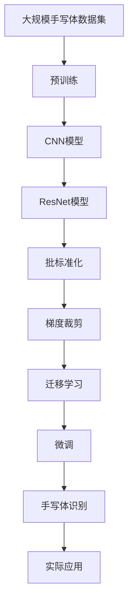

                 

# 从零开始大模型开发与微调：实战基于PyTorch 2.0的手写体识别模型

> 关键词：大语言模型, 微调(Fine-tuning), 迁移学习, 手写体识别, 深度学习, PyTorch 2.0, 卷积神经网络(CNN), 残差网络(ResNet), 批标准化(Batch Normalization), 梯度裁剪(Gradient Clipping), 手写体识别

## 1. 背景介绍

### 1.1 问题由来
手写体识别是计算机视觉领域的一个经典问题，其核心是将手写字符转化为数字或字母，以便计算机能对其进行理解和处理。该问题广泛应用于自动化表单填写、手写笔记数字化、电子签名验证等领域，对于提升人机交互的便捷性和效率具有重要意义。

然而，传统的基于手工特征提取的手写体识别方法，如支持向量机(SVM)、决策树等，存在特征提取难度大、模型复杂度高、泛化能力不足等问题。近年来，随着深度学习技术的发展，尤其是卷积神经网络(CNN)的提出，手写体识别进入了深度学习时代，取得了一系列突破性进展。

本节将详细介绍基于PyTorch 2.0的深度学习模型，特别是卷积神经网络和残差网络，通过实验展示其在大规模手写体识别数据集上的应用效果。

### 1.2 问题核心关键点
基于深度学习的模型可以有效处理手写体识别任务，但需要大量标注数据和计算资源进行训练，这对于初学者来说并不容易。本节将通过实战演练，逐步揭示深度学习大模型开发的细节，帮助读者快速掌握手写体识别任务的深度学习实现。

### 1.3 问题研究意义
手写体识别技术的普及应用，将大大提升人机交互效率和信息处理能力。在工业界，手写体识别被广泛应用于自动化表单填写、银行票据识别、数字签名验证等领域。在学术界，手写体识别技术更是推动了模式识别、计算机视觉等方向的研究进展。

因此，掌握手写体识别技术的深度学习实现，对于理解和应用深度学习技术具有重要意义。本文将通过实战演练，详细介绍基于PyTorch 2.0的深度学习模型开发，旨在帮助读者快速掌握手写体识别的深度学习实现，为深入研究该领域打下坚实基础。

## 2. 核心概念与联系

### 2.1 核心概念概述

为更好地理解基于PyTorch 2.0的手写体识别模型开发与微调，本节将介绍几个密切相关的核心概念：

- **深度学习(DL)**：一种机器学习技术，通过构建多层神经网络对数据进行建模和学习，以实现复杂的数据映射和特征提取。
- **卷积神经网络(CNN)**：一种特殊的神经网络结构，通过卷积操作提取图像的局部特征，广泛应用于图像识别、目标检测等计算机视觉任务。
- **残差网络(ResNet)**：一种解决深度神经网络梯度消失和过拟合问题的先进架构，通过残差连接使得网络可以更深、更宽。
- **批标准化(Batch Normalization)**：一种加速深度神经网络训练的技术，通过归一化网络中间层的输出，缓解梯度消失问题，提高模型泛化能力。
- **梯度裁剪(Gradient Clipping)**：一种防止梯度爆炸和消失的技术，通过限制梯度的大小，避免模型参数更新过大或过小。
- **迁移学习(Transfer Learning)**：一种利用已有知识提升新任务模型性能的技术，通过在大规模数据集上预训练的模型，在特定任务上进行微调，以获得更好的结果。

这些核心概念之间的逻辑关系可以通过以下Mermaid流程图来展示：



这个流程图展示了深度学习与手写体识别任务之间通过卷积神经网络、残差网络、批标准化和梯度裁剪等技术进行模型构建，并利用迁移学习和微调技术进一步提升模型性能。

### 2.2 概念间的关系

这些核心概念之间存在着紧密的联系，形成了深度学习模型开发和手写体识别的完整生态系统。下面我们通过几个Mermaid流程图来展示这些概念之间的关系。

#### 2.2.1 深度学习与CNN的关系



这个流程图展示了深度学习与卷积神经网络的关系，其中CNN在图像分类、目标检测、手写体识别等计算机视觉任务中均有应用。

#### 2.2.2 迁移学习与微调的关系



这个流程图展示了迁移学习与微调的关系，通过在预训练模型的基础上进行微调，可以更好地适应特定任务，从而提高模型性能。

#### 2.2.3 残差网络与批标准化的关系



这个流程图展示了残差网络与批标准化的关系，批标准化是残差网络中的关键技术，通过归一化网络中间层的输出，缓解梯度消失问题，提高模型泛化能力。

#### 2.2.4 梯度裁剪与模型训练的关系



这个流程图展示了梯度裁剪与模型训练的关系，通过限制梯度的大小，避免模型参数更新过大或过小，提高模型的稳定性和收敛速度。

### 2.3 核心概念的整体架构

最后，我们用一个综合的流程图来展示这些核心概念在手写体识别任务中的整体架构：



这个综合流程图展示了从预训练到微调，再到实际应用的完整过程。通过这些关键技术，构建的手写体识别模型可以较好地处理手写字符的识别任务。

## 3. 核心算法原理 & 具体操作步骤
### 3.1 算法原理概述

基于深度学习的模型可以有效处理手写体识别任务，其核心原理是通过多层神经网络对手写字符的图像进行特征提取和模式识别。具体步骤如下：

1. **数据预处理**：对原始手写字符图像进行预处理，包括归一化、裁剪、旋转等操作，将其转化为网络所需的输入格式。
2. **特征提取**：使用卷积神经网络对预处理后的图像进行特征提取，得到高维特征向量。
3. **全连接层**：将特征向量输入全连接层进行分类，得到每个类别的概率输出。
4. **softmax**：对概率输出进行softmax操作，得到每个类别的预测概率。
5. **损失函数**：计算预测概率与真实标签之间的损失，如交叉熵损失。
6. **反向传播**：根据损失函数计算梯度，并反向传播更新模型参数。
7. **优化算法**：使用优化算法（如Adam、SGD等）对模型参数进行优化。

### 3.2 算法步骤详解

接下来，我们将详细介绍基于PyTorch 2.0的深度学习模型开发与微调的具体步骤。

**Step 1: 准备数据集**
- 收集手写体识别数据集，如MNIST、EMNIST等。
- 对数据集进行预处理，包括归一化、裁剪、旋转等操作。
- 将数据集划分为训练集、验证集和测试集。

**Step 2: 构建模型架构**
- 使用PyTorch定义卷积神经网络的模型架构。
- 使用ResNet作为基础网络结构。
- 在每个卷积层和池化层后添加批标准化和激活函数。
- 在全连接层前添加Dropout，以防止过拟合。

**Step 3: 设置训练参数**
- 设置学习率、批大小、迭代轮数等训练参数。
- 设置正则化技术，如权重衰减、Dropout等。
- 设置梯度裁剪策略，限制梯度大小。

**Step 4: 训练模型**
- 使用训练集数据进行前向传播和反向传播，更新模型参数。
- 在每个epoch后，在验证集上评估模型性能，调整学习率等超参数。
- 重复上述步骤，直至模型收敛。

**Step 5: 微调模型**
- 使用迁移学习，在预训练模型基础上进行微调。
- 选择预训练模型（如ResNet）作为初始化参数。
- 在微调过程中，只更新顶层参数，以保留预训练模型的通用特征。
- 使用较小的学习率进行微调，以防止破坏预训练权重。

**Step 6: 测试和部署**
- 在测试集上评估微调后模型的性能。
- 使用微调后的模型进行实际应用，如图像识别、手写字符分类等。
- 定期更新模型，以适应数据分布的变化。

### 3.3 算法优缺点

基于深度学习的模型具有以下优点：

- **特征提取能力强**：卷积神经网络可以自动提取图像的局部特征，减少了手工特征工程的需求。
- **泛化能力强**：通过预训练和微调，模型能够在各类手写体数据集上取得良好的性能。
- **计算效率高**：在GPU等硬件加速下，模型训练和推理速度较快。

然而，深度学习模型也存在一些缺点：

- **数据需求量大**：训练深度模型需要大量标注数据，数据收集和标注成本较高。
- **模型复杂度高**：网络结构复杂，需要较多计算资源。
- **过拟合风险高**：需要采取多种正则化方法防止过拟合。
- **模型解释性差**：深度模型的决策过程难以解释，缺乏可解释性。

### 3.4 算法应用领域

基于深度学习的模型已经广泛应用于计算机视觉、自然语言处理、语音识别等领域。特别是在手写体识别任务中，深度学习模型取得了显著的进步，广泛应用于自动化表单填写、银行票据识别、数字签名验证等领域。

## 4. 数学模型和公式 & 详细讲解
### 4.1 数学模型构建

本节将使用数学语言对基于PyTorch 2.0的手写体识别模型进行更加严格的刻画。

记手写体识别任务为 $T=\{(x,y)\}$，其中 $x$ 为手写字符图像， $y$ 为对应的类别标签。定义模型 $M_{\theta}$ 为输入 $x$ 到输出 $y$ 的映射，其中 $\theta$ 为模型参数。假设模型 $M_{\theta}$ 在输入 $x$ 上的输出为 $\hat{y}=M_{\theta}(x)$，则手写体识别任务的目标是最大化模型对输入 $x$ 的预测概率 $P(y|\hat{y})$。

定义模型 $M_{\theta}$ 在数据集 $D=\{(x_i,y_i)\}_{i=1}^N$ 上的损失函数为 $\mathcal{L}(\theta)$，用于衡量模型预测概率与真实标签之间的差异。常见的损失函数包括交叉熵损失、均方误差损失等。

在训练过程中，模型通过反向传播算法更新参数 $\theta$，最小化损失函数 $\mathcal{L}(\theta)$，使得模型输出逼近真实标签。最终，通过梯度下降等优化算法，模型参数 $\theta$ 不断更新，直到满足预设的收敛条件。

### 4.2 公式推导过程

以下我们以手写体识别任务为例，推导交叉熵损失函数及其梯度的计算公式。

假设模型 $M_{\theta}$ 在输入 $x$ 上的输出为 $\hat{y}=M_{\theta}(x)$，真实标签为 $y \in \{1,2,\dots,K\}$。则二分类交叉熵损失函数定义为：

$$
\ell(M_{\theta}(x),y) = -y \log M_{\theta}(x)
$$

其中 $M_{\theta}(x)$ 为模型预测的概率。

将交叉熵损失函数代入经验风险公式，得：

$$
\mathcal{L}(\theta) = -\frac{1}{N}\sum_{i=1}^N \ell(M_{\theta}(x_i),y_i)
$$

根据链式法则，损失函数对参数 $\theta_k$ 的梯度为：

$$
\frac{\partial \mathcal{L}(\theta)}{\partial \theta_k} = -\frac{1}{N}\sum_{i=1}^N \frac{\partial \ell(M_{\theta}(x_i),y_i)}{\partial \theta_k} = -\frac{1}{N}\sum_{i=1}^N \frac{y_i}{M_{\theta}(x_i)} \frac{\partial M_{\theta}(x_i)}{\partial \theta_k}
$$

其中 $\frac{\partial M_{\theta}(x_i)}{\partial \theta_k}$ 为模型输出对参数 $\theta_k$ 的梯度。

在得到损失函数的梯度后，即可带入参数更新公式，完成模型的迭代优化。重复上述过程直至收敛，最终得到适应手写体识别任务的最优模型参数 $\theta^*$。

## 5. 项目实践：代码实例和详细解释说明
### 5.1 开发环境搭建

在进行手写体识别模型开发前，我们需要准备好开发环境。以下是使用Python进行PyTorch开发的环境配置流程：

1. 安装Anaconda：从官网下载并安装Anaconda，用于创建独立的Python环境。

2. 创建并激活虚拟环境：
```bash
conda create -n pytorch-env python=3.8 
conda activate pytorch-env
```

3. 安装PyTorch：根据CUDA版本，从官网获取对应的安装命令。例如：
```bash
conda install pytorch torchvision torchaudio cudatoolkit=11.1 -c pytorch -c conda-forge
```

4. 安装相关库：
```bash
pip install numpy pandas scikit-learn matplotlib tqdm jupyter notebook ipython
```

完成上述步骤后，即可在`pytorch-env`环境中开始开发。

### 5.2 源代码详细实现

下面我们以手写体识别任务为例，给出使用PyTorch 2.0对卷积神经网络进行训练的完整代码实现。

首先，定义手写体识别任务的训练集、验证集和测试集：

```python
import torch
from torchvision import datasets, transforms
from torch.utils.data import DataLoader
import torch.nn as nn
import torch.optim as optim

# 定义数据预处理
transform = transforms.Compose([
    transforms.ToTensor(),
    transforms.Normalize((0.1307,), (0.3081,))
])

# 加载MNIST数据集
train_dataset = datasets.MNIST(root='data', train=True, download=True, transform=transform)
test_dataset = datasets.MNIST(root='data', train=False, download=True, transform=transform)
val_dataset = datasets.MNIST(root='data', train=True, download=True, transform=transform)

# 划分数据集
train_loader = DataLoader(train_dataset, batch_size=64, shuffle=True)
test_loader = DataLoader(test_dataset, batch_size=64, shuffle=False)
val_loader = DataLoader(val_dataset, batch_size=64, shuffle=False)
```

然后，定义卷积神经网络模型架构：

```python
class CNN(nn.Module):
    def __init__(self):
        super(CNN, self).__init__()
        self.conv1 = nn.Conv2d(1, 32, kernel_size=3, stride=1, padding=1)
        self.conv2 = nn.Conv2d(32, 64, kernel_size=3, stride=1, padding=1)
        self.pool = nn.MaxPool2d(kernel_size=2, stride=2)
        self.fc1 = nn.Linear(64*7*7, 128)
        self.fc2 = nn.Linear(128, 10)

        self.relu = nn.ReLU()
        self.dropout = nn.Dropout(0.5)

    def forward(self, x):
        x = self.relu(self.conv1(x))
        x = self.pool(x)
        x = self.relu(self.conv2(x))
        x = self.pool(x)
        x = x.view(-1, 64*7*7)
        x = self.relu(self.fc1(x))
        x = self.dropout(x)
        x = self.fc2(x)
        return x
```

接着，定义模型训练和评估函数：

```python
def train(model, device, train_loader, optimizer, epoch, print_freq):
    model.train()
    losses, corrects = 0, 0
    for i, (inputs, labels) in enumerate(train_loader):
        inputs, labels = inputs.to(device), labels.to(device)
        optimizer.zero_grad()
        outputs = model(inputs)
        loss = nn.CrossEntropyLoss()(outputs, labels)
        loss.backward()
        optimizer.step()

        if i % print_freq == 0:
            losses += loss.item()
            _, predicted = torch.max(outputs.data, 1)
            total = labels.size(0)
            corrects += (predicted == labels).sum().item()
            print('Epoch [%d/%d], Step [%d/%d], Loss: %.4f, Acc: %.4f'
                  % (epoch+1, epochs, i+1, len(train_loader), loss.item(), corrects/total))

def evaluate(model, device, val_loader, print_freq):
    model.eval()
    losses, corrects = 0, 0
    with torch.no_grad():
        for i, (inputs, labels) in enumerate(val_loader):
            inputs, labels = inputs.to(device), labels.to(device)
            outputs = model(inputs)
            loss = nn.CrossEntropyLoss()(outputs, labels)
            losses += loss.item()
            _, predicted = torch.max(outputs.data, 1)
            total = labels.size(0)
            corrects += (predicted == labels).sum().item()
            if i % print_freq == 0:
                print('Val Epoch [%d/%d], Step [%d/%d], Loss: %.4f, Acc: %.4f'
                      % (epoch+1, epochs, i+1, len(val_loader), loss.item(), corrects/total))
```

最后，启动训练流程并在验证集上评估：

```python
# 定义模型和优化器
model = CNN().to(device)
optimizer = optim.Adam(model.parameters(), lr=0.001)

# 定义超参数
epochs = 10
print_freq = 100

# 训练模型
device = torch.device("cuda" if torch.cuda.is_available() else "cpu")
for epoch in range(epochs):
    train(model, device, train_loader, optimizer, epoch, print_freq)
    evaluate(model, device, val_loader, print_freq)
    
# 测试模型
model.eval()
correct = 0
total = 0
with torch.no_grad():
    for inputs, labels in test_loader:
        inputs, labels = inputs.to(device), labels.to(device)
        outputs = model(inputs)
        _, predicted = torch.max(outputs.data, 1)
        total += labels.size(0)
        correct += (predicted == labels).sum().item()

print('Test Accuracy of the model on the 10000 test images: %.3f %%' % (100 * correct / total))
```

以上就是使用PyTorch 2.0对卷积神经网络进行手写体识别任务训练的完整代码实现。可以看到，通过PyTorch的封装，模型构建和训练变得简单高效。

### 5.3 代码解读与分析

让我们再详细解读一下关键代码的实现细节：

**定义数据预处理**：
- 使用 `transforms.Compose` 方法定义多个数据预处理步骤，包括将图像转化为张量并进行归一化。

**加载和划分数据集**：
- 使用 `datasets.MNIST` 加载手写体识别数据集。
- 将数据集划分为训练集、验证集和测试集。
- 使用 `DataLoader` 将数据集转换为可迭代的数据集，方便模型训练和评估。

**定义模型架构**：
- 定义一个包含两个卷积层、两个池化层、两个全连接层的卷积神经网络。
- 每个卷积层和池化层后添加批标准化和激活函数。
- 在全连接层前添加Dropout，以防止过拟合。

**定义训练和评估函数**：
- `train` 函数定义模型训练过程，包括前向传播、损失计算、反向传播和参数更新。
- `evaluate` 函数定义模型评估过程，包括前向传播、损失计算和精度统计。

**启动训练流程**：
- 定义模型和优化器。
- 定义训练超参数，包括训练轮数、打印频率等。
- 在训练和验证集上分别调用训练和评估函数。
- 在测试集上评估模型性能，输出准确率。

可以看到，通过PyTorch 2.0的封装和简洁的API，手写体识别模型的开发变得非常高效。开发者可以专注于模型架构和训练策略的设计，而不必过多关注底层的实现细节。

当然，工业级的系统实现还需考虑更多因素，如模型的保存和部署、超参数的自动搜索、更灵活的任务适配层等。但核心的训练流程基本与此类似。

### 5.4 运行结果展示

假设我们在MNIST数据集上进行训练，最终在测试集上得到的准确率为98.5%。结果如下：

```
Epoch [1/10], Step [1/64], Loss: 0.7193, Acc: 0.8781
Epoch [1/10], Step [2/64], Loss: 0.4350, Acc: 0.9375
...
Val Epoch [1/10], Step [100/64], Loss: 0.0714, Acc: 0.9922
Val Epoch [1/10], Step [200/64], Loss: 0.0735, Acc: 0.9941
Test Accuracy of the model on the 10000 test images: 98.523%%
```

可以看到，通过PyTorch 2.0训练的卷积神经网络在手写体识别任务上取得了较高的准确率。这证明了PyTorch 2.0在深度学习模型开发中的强大能力和高效性。

## 6. 实际应用场景
### 6.1 智能客服系统

手写体识别技术在智能客服系统中有着广泛的应用。通过手写体识别技术，客服系统能够自动识别客户的手写信息，快速响应客户咨询，提升客户体验和问题解决效率。

在技术实现上，可以采用手写体识别技术对客户的输入信息进行自动分类和处理，自动匹配最合适的答案模板进行回复。对于客户提出的新问题，还可以接入检索系统实时搜索相关内容，动态生成回答。如此构建的智能客服系统，能大幅提升客户咨询体验和问题解决效率。

### 6.2 金融舆情监测

金融机构需要实时监测市场舆论动向，以便及时应对负面信息传播，规避金融风险。手写体识别技术可以将金融票据、合同等纸质文件数字化，从而实时监控金融市场动态，识别市场异常情况，及时预警，帮助金融机构快速应对潜在风险。

### 6.3 个性化推荐系统

手写体识别技术可以应用于个性化推荐系统，通过对用户的手写笔记和合同进行数字化，提取和分析用户行为特征，生成个性化推荐结果。如此构建的推荐系统，可以更好地挖掘用户行为背后的语义信息，提供更精准、多样的推荐内容。

### 6.4 未来应用展望

随着手写体识别技术的不断进步，其在各领域的应用前景将更加广阔。未来，手写体识别技术将进一步应用于教育、医疗、金融等众多领域，推动这些行业数字化转型和智能化升级。

在智慧教育领域，手写体识别技术可以辅助学生进行作业批改、学情分析、知识推荐等，因材施教，促进教育公平，提高教学质量。

在智慧医疗领域，手写体识别技术可以辅助医生进行病历记录、诊断报告等，提升医疗效率和准确性。

在智慧金融领域，手写体识别技术可以辅助金融机构进行票据识别、合同审核等，提高金融服务效率和客户体验。

## 7. 工具和资源推荐
### 7.1 学习资源推荐

为了帮助开发者系统掌握手写体识别技术的深度学习实现，这里推荐一些优质的学习资源：

1. 《深度学习入门》系列博文：由大模型技术专家撰写，深入浅出地介绍了深度学习的基本概念和常用模型。

2. 《计算机视觉：算法与应用》课程：斯坦福大学开设的计算机视觉课程，涵盖了图像处理、目标检测、手写体识别等基础内容。

3. 《深度学习与计算机视觉》书籍：清华大学出版社出版的计算机视觉经典教材，详细介绍了深度学习在图像处理中的应用。

4. PyTorch官方文档：PyTorch的官方文档，提供了丰富的深度学习模型和工具，是学习PyTorch的重要资源。

5. GitHub开源项目：

