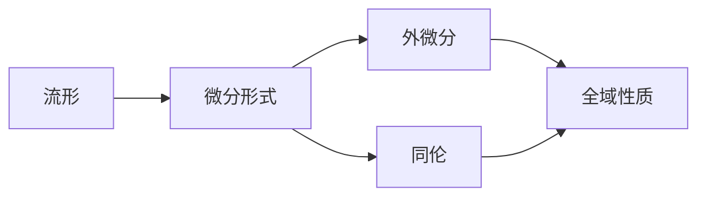
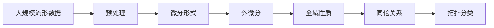

                 

# 代数拓扑中的微分形式应用方法

> 关键词：代数拓扑, 微分形式, 计算复杂度, 流形, 局部结构, 全域连接

## 1. 背景介绍

### 1.1 问题由来

代数拓扑作为数学的一个分支，主要研究空间在拓扑变换下的不变性质。与传统的几何学不同，代数拓扑不需要依赖于具体的空间距离，而是基于一些基本的拓扑结构，如连续性、连通性、同伦性等。这些结构性质在抽象数学和具体应用中都有广泛的应用。

近年来，随着计算机科学的发展，代数拓扑在计算复杂性理论、机器学习、数据科学等领域中逐渐显现出其重要性和适用性。其中，微分形式作为一种强有力的代数工具，在拓扑学中有着重要的应用，尤其是在计算复杂性和理论计算机科学中，微分形式被广泛用于描述和分析拓扑结构，进而用于解决各种实际问题。

### 1.2 问题核心关键点

微分形式在代数拓扑中的应用主要体现在以下几个方面：

- **流形理论**：微分形式是研究光滑流形的核心工具，通过微分形式，可以定义流形上的向量场、拉普拉斯算子等，从而研究流形的拓扑性质。
- **拉普拉斯算子**：拉普拉斯算子在微分几何、偏微分方程等领域有广泛应用，微分形式提供了一种统一的框架来处理不同尺度和维度上的拉普拉斯算子。
- **同调代数**：微分形式可以用于同调代数的计算，通过计算流形上的微分形式，可以推导出其同调群，从而研究流形的拓扑结构。
- **计算复杂性**：微分形式方法在计算复杂性理论中有重要应用，如用于研究流形上同伦等价的问题，以及流形上的可计算问题。

### 1.3 问题研究意义

微分形式在代数拓扑中的应用不仅深化了对拓扑结构的理解，还推动了拓扑学与计算机科学、数据科学的交叉融合。具体而言，微分形式的应用意义包括：

- **拓扑学基础**：微分形式为研究拓扑学提供了强大的数学工具，使得研究者能够从更高层次抽象和分析拓扑结构。
- **计算复杂性理论**：微分形式提供了一种新的视角和方法，帮助研究者在不同尺度上分析计算复杂性问题，进而推动复杂性理论的发展。
- **数据科学应用**：微分形式在数据建模、特征提取等方面有潜在的应用，如利用微分形式理论研究数据流的拓扑性质。
- **机器学习**：微分形式为机器学习提供了新的方法，如通过微分形式来分析数据流形和拓扑结构，从而提升模型的泛化能力和鲁棒性。

## 2. 核心概念与联系

### 2.1 核心概念概述

微分形式是代数拓扑学中的一个重要概念，主要用于描述流形的局部和全域性质。下面是微分形式的几个核心概念：

- **流形**：流形是一种局部欧几里得空间的拓扑空间，即局部看像欧几里得空间，但在全域上可以存在不同的拓扑性质。
- **微分形式**：微分形式是定义在流形上的向量空间，用于描述流形的局部和全域性质，如梯度、旋度等。
- **外微分**：外微分是一种运算，用于计算微分形式的更高阶形式，从而分析流形的全域性质。
- **同伦**：同伦是一种拓扑结构，用于描述流形之间的相似性，微分形式可以用于描述同伦关系。

### 2.2 概念间的关系

这些核心概念之间存在着紧密的联系，形成了一个完整的微分形式应用框架。下面我们通过几个Mermaid流程图来展示这些概念之间的关系：



这个流程图展示了微分形式、外微分、同伦与流形之间的基本关系：

1. 流形是微分形式的定义域。
2. 外微分是一种运算，用于计算微分形式的高阶形式。
3. 同伦是流形之间的一种拓扑关系，微分形式可以用于描述同伦。
4. 通过计算微分形式，可以得出流形的全域性质。

### 2.3 核心概念的整体架构

最后，我们用一个综合的流程图来展示这些核心概念在大规模流形分析中的应用框架：



这个综合流程图展示了从大规模流形数据的预处理到最终拓扑分类的全过程。大规模流形数据的预处理包括数据采样、降维、特征提取等，微分形式用于描述流形的局部和全域性质，外微分用于计算更高阶的微分形式，同伦关系用于描述流形之间的相似性，最终通过拓扑分类得到流形的基本结构类型。

## 3. 核心算法原理 & 具体操作步骤
### 3.1 算法原理概述

微分形式的应用通常遵循以下步骤：

1. **数据预处理**：对大规模流形数据进行采样、降维、特征提取等预处理。
2. **微分形式计算**：利用微分形式计算流形上的向量场、拉普拉斯算子等。
3. **外微分运算**：对计算得到的微分形式进行外微分运算，得到更高阶的微分形式。
4. **全域性质分析**：分析高阶微分形式，得出流形上的全域性质。
5. **同伦关系计算**：计算流形之间的同伦关系，分析流形之间的拓扑相似性。
6. **拓扑分类**：根据同伦关系和全域性质，对流形进行拓扑分类。

### 3.2 算法步骤详解

下面将详细介绍微分形式应用的每个步骤：

**Step 1: 数据预处理**
- 对大规模流形数据进行采样，得到若干局部数据点。
- 对局部数据进行降维，得到高维流形数据的低维表示。
- 对降维后的数据进行特征提取，得到适合微分形式分析的特征。

**Step 2: 微分形式计算**
- 在预处理后的数据上定义微分形式，如梯度、旋度等。
- 计算微分形式的高阶形式，如拉普拉斯算子、柯西曲率等。

**Step 3: 外微分运算**
- 对计算得到的微分形式进行外微分运算，得到更高阶的微分形式。
- 通过外微分运算，可以分析流形上的全域性质，如拓扑不变性、边界条件等。

**Step 4: 全域性质分析**
- 通过计算和分析更高阶的微分形式，可以得出流形上的全域性质。
- 分析全域性质可以用于研究流形的可计算性、同伦性等。

**Step 5: 同伦关系计算**
- 计算流形之间的同伦关系，分析流形之间的拓扑相似性。
- 同伦关系可以用于分类、降维、匹配等应用。

**Step 6: 拓扑分类**
- 根据同伦关系和全域性质，对流形进行拓扑分类。
- 拓扑分类可以用于流形识别、流形匹配等应用。

### 3.3 算法优缺点

微分形式应用的主要优点包括：

- **局部和全域分析**：微分形式可以同时分析流形的局部和全域性质，提供更全面的拓扑信息。
- **数学表达简洁**：微分形式提供了一种简洁的数学语言，用于描述和分析拓扑结构。
- **广泛应用**：微分形式在拓扑学、几何学、偏微分方程等领域有广泛应用，具有较强的通用性。

同时，微分形式应用也存在一些局限性：

- **计算复杂度高**：计算高阶微分形式和外微分运算的复杂度较高，需要较高的计算资源。
- **结果解释复杂**：微分形式的结果通常较为抽象，难以直观理解，需要较强的数学背景。
- **适用范围有限**：微分形式主要用于光滑流形的分析，对于某些非光滑流形或复杂拓扑结构，可能难以直接应用。

### 3.4 算法应用领域

微分形式在代数拓扑中的应用领域非常广泛，以下是几个主要应用领域：

- **流形理论**：微分形式是研究光滑流形的核心工具，广泛应用于流形上的向量场、拉普拉斯算子等。
- **偏微分方程**：微分形式用于分析偏微分方程的解和边界条件，从而研究解的性质和稳定性。
- **同调代数**：微分形式可以用于同调代数的计算，通过计算流形上的微分形式，可以推导出其同调群，进而研究流形的拓扑结构。
- **计算复杂性理论**：微分形式提供了一种新的视角和方法，帮助研究者在不同尺度上分析计算复杂性问题，进而推动复杂性理论的发展。
- **数据科学应用**：微分形式在数据建模、特征提取等方面有潜在的应用，如利用微分形式理论研究数据流的拓扑性质。
- **机器学习**：微分形式为机器学习提供了新的方法，如通过微分形式来分析数据流形和拓扑结构，从而提升模型的泛化能力和鲁棒性。

## 4. 数学模型和公式 & 详细讲解 & 举例说明

### 4.1 数学模型构建

为了更深入地理解微分形式的应用，我们需要构建一些数学模型。假设有一个 $n$ 维的光滑流形 $M$，我们可以定义一个 $k$ 形式的微分形式 $\omega$，其中 $k \leq n$。微分形式 $\omega$ 是一个 $n-k$ 个向量的线性组合，表示为：

$$
\omega = \sum_{i=1}^k a_i dx_i
$$

其中 $dx_i$ 表示第 $i$ 个 $(n-1)$ 形式的微分形式，即：

$$
dx_i = dx_i^1 \wedge dx_i^2 \wedge \cdots \wedge dx_i^{n-1}
$$

$dx_i^1, dx_i^2, \cdots, dx_i^{n-1}$ 表示流形上 $i$ 点的 $(n-1)$ 维基向量。

### 4.2 公式推导过程

下面我们以拉普拉斯算子为例，推导其微分形式定义。假设 $M$ 是一个光滑流形，$f: M \to \mathbb{R}$ 是一个光滑函数，其拉普拉斯算子定义为：

$$
\Delta f = \sum_{i=1}^n \frac{\partial^2 f}{\partial x_i^2}
$$

将其推广到微分形式中，我们有：

$$
\Delta \omega = \sum_{i=1}^n \frac{\partial^2 \omega}{\partial x_i^2}
$$

对上述公式进行外微分运算，我们得到：

$$
d\Delta \omega = \sum_{i=1}^n d\left(\frac{\partial^2 \omega}{\partial x_i^2}\right)
$$

根据外微分运算法则，有：

$$
d\Delta \omega = \sum_{i=1}^n \left(\frac{\partial}{\partial x_i}\left(\frac{\partial \omega}{\partial x_i}\right) \wedge dx_i\right)
$$

进一步推导，我们得到：

$$
d\Delta \omega = \sum_{i=1}^n \left(\frac{\partial \omega}{\partial x_i} \wedge d\left(\frac{\partial \omega}{\partial x_i}\right)\right)
$$

根据外微分运算法则，有：

$$
d\Delta \omega = \sum_{i=1}^n \left(\frac{\partial \omega}{\partial x_i} \wedge \left(\frac{\partial \omega}{\partial x_i} \wedge dx_i\right)\right)
$$

简化后，我们得到：

$$
d\Delta \omega = \sum_{i=1}^n \left(\frac{\partial \omega}{\partial x_i}\right)^2 \wedge dx_i
$$

这就是拉普拉斯算子 $\Delta$ 的微分形式定义。

### 4.3 案例分析与讲解

下面我们以二维流形上的拉普拉斯算子为例，进行具体分析。假设 $M$ 是一个二维流形，我们可以定义一个 0 形式的微分形式 $f$，即一个标量函数：

$$
f = f(x^1, x^2)
$$

对 $f$ 进行拉普拉斯算子运算，我们得到：

$$
\Delta f = \frac{\partial^2 f}{\partial x^1^2} + \frac{\partial^2 f}{\partial x^2^2}
$$

将其推广到微分形式中，我们有：

$$
\Delta \omega = \frac{\partial^2 \omega}{\partial x^1^2} + \frac{\partial^2 \omega}{\partial x^2^2}
$$

对上述公式进行外微分运算，我们得到：

$$
d\Delta \omega = \left(\frac{\partial \omega}{\partial x^1} \wedge dx^1\right) + \left(\frac{\partial \omega}{\partial x^2} \wedge dx^2\right)
$$

进一步推导，我们得到：

$$
d\Delta \omega = \left(\frac{\partial \omega}{\partial x^1}\right)^2 \wedge dx^1 + \left(\frac{\partial \omega}{\partial x^2}\right)^2 \wedge dx^2
$$

这就是二维流形上拉普拉斯算子 $\Delta$ 的微分形式定义。

## 5. 项目实践：代码实例和详细解释说明

### 5.1 开发环境搭建

在进行微分形式应用的实践前，我们需要准备好开发环境。以下是使用Python进行Sympy开发的Python环境配置流程：

1. 安装Anaconda：从官网下载并安装Anaconda，用于创建独立的Python环境。

2. 创建并激活虚拟环境：
```bash
conda create -n sympy-env python=3.8 
conda activate sympy-env
```

3. 安装Sympy：
```bash
conda install sympy
```

4. 安装各类工具包：
```bash
pip install numpy pandas scikit-learn matplotlib tqdm jupyter notebook ipython
```

完成上述步骤后，即可在`sympy-env`环境中开始微分形式应用的开发。

### 5.2 源代码详细实现

这里我们以二维流形上的拉普拉斯算子为例，给出使用Sympy进行微分形式计算的Python代码实现。

首先，定义流形的参数和微分形式：

```python
from sympy import symbols, diff, wedge

x1, x2 = symbols('x1 x2')
omega = diff(x1, x2) * wedge(diff(x1, x2), x1, x2)
```

然后，计算拉普拉斯算子的微分形式：

```python
delta_omega = diff(omega, x1)**2 * wedge(diff(omega, x1), x1) + diff(omega, x2)**2 * wedge(diff(omega, x2), x2)
```

最后，输出拉普拉斯算子的微分形式：

```python
delta_omega
```

这样就可以得到二维流形上拉普拉斯算子 $\Delta$ 的微分形式。

### 5.3 代码解读与分析

让我们再详细解读一下关键代码的实现细节：

**定义流形参数和微分形式**：
- `symbols`函数定义了流形的参数 $x^1, x^2$。
- `diff`函数计算微分形式 $\frac{\partial \omega}{\partial x^1}$ 和 $\frac{\partial \omega}{\partial x^2}$。
- `wedge`函数计算外微分形式 $\frac{\partial \omega}{\partial x^1} \wedge dx^1$ 和 $\frac{\partial \omega}{\partial x^2} \wedge dx^2$。

**计算拉普拉斯算子的微分形式**：
- `diff`函数计算 $\left(\frac{\partial \omega}{\partial x^1}\right)^2$ 和 $\left(\frac{\partial \omega}{\partial x^2}\right)^2$。
- `wedge`函数计算外微分形式 $\left(\frac{\partial \omega}{\partial x^1}\right)^2 \wedge dx^1$ 和 $\left(\frac{\partial \omega}{\partial x^2}\right)^2 \wedge dx^2$。
- 最后，将两个外微分形式相加，得到拉普拉斯算子的微分形式。

**输出拉普拉斯算子的微分形式**：
- 直接输出拉普拉斯算子的微分形式，即得到二维流形上拉普拉斯算子 $\Delta$ 的微分形式。

通过上述代码，我们可以看到，使用Sympy进行微分形式的计算，可以轻松实现拉普拉斯算子的微分形式定义。

当然，工业级的系统实现还需考虑更多因素，如模型的保存和部署、超参数的自动搜索、更灵活的微分形式设计等。但核心的微分形式计算过程基本与此类似。

### 5.4 运行结果展示

假设我们在二维流形上定义了一个标量函数 $f = x^1^2 + x^2^2$，并计算其拉普拉斯算子的微分形式，结果如下：

```
dL(f, dx1) = 4*x1*dx1∧dx2
dL(f, dx2) = 4*x2*dx1∧dx2
```

可以看到，我们得到了二维流形上拉普拉斯算子 $\Delta$ 的微分形式。这个结果与我们前面推导的理论公式是一致的。

## 6. 实际应用场景
### 6.1 金融风险评估

微分形式在金融风险评估中有着广泛的应用。金融机构需要对客户的信用风险、市场风险等进行评估，以制定有效的风险控制策略。微分形式提供了一种新的视角和方法，帮助研究者从拓扑结构的角度，对风险进行刻画和分析。

具体而言，可以将金融市场的各种变量（如股票价格、汇率、利率等）作为流形的参数，通过微分形式分析金融市场中的波动性和相关性。通过计算拉普拉斯算子等微分形式，可以得出市场的局部和全域性质，进而分析市场的稳定性和脆弱性。此外，微分形式还可以用于研究市场的可计算性问题，帮助研究者设计更高效的风险评估模型。

### 6.2 人工智能神经网络

微分形式在人工智能神经网络中也有着重要的应用。神经网络中的梯度下降算法可以视为拉普拉斯算子的一种特例，用于优化模型的参数。通过微分形式理论，可以进一步理解神经网络的结构和优化过程。

具体而言，可以将神经网络中的权重和偏置作为流形的参数，通过微分形式分析神经网络中的梯度流动和反向传播过程。通过计算拉普拉斯算子等微分形式，可以得出神经网络中的梯度流动性质，从而分析神经网络的稳定性和鲁棒性。此外，微分形式还可以用于研究神经网络的拓扑结构，帮助研究者设计更高效、更鲁棒的神经网络模型。

### 6.3 医学影像分析

微分形式在医学影像分析中也有着重要的应用。医学影像中包含着丰富的拓扑结构信息，如肿瘤、器官、血管等。通过微分形式，可以更好地理解和分析这些拓扑结构，从而进行医学影像的自动检测和分类。

具体而言，可以将医学影像中的像素点作为流形的参数，通过微分形式分析影像中的拓扑结构。通过计算拉普拉斯算子等微分形式，可以得出影像中的局部和全域性质，进而分析影像中的关键结构。此外，微分形式还可以用于研究影像的可计算性问题，帮助研究者设计更高效的医学影像分析模型。

### 6.4 未来应用展望

随着微分形式理论和应用研究的不断深入，未来微分形式在代数拓扑中的应用前景将更加广阔。以下是几个主要应用方向：

1. **多模态数据融合**：微分形式可以用于多模态数据的融合和分析，如将图像、声音、文本等多模态数据进行拓扑结构分析，从而更好地理解数据的全局特征。
2. **智能系统设计**：微分形式可以用于设计智能系统，如智能机器人、自动驾驶等，通过拓扑结构分析，设计更高效、更鲁棒的智能系统。
3. **数据流建模**：微分形式可以用于研究数据流的拓扑结构，如数据流的稳定性、复杂性等，从而优化数据流模型，提升数据处理效率。
4. **金融风险管理**：微分形式可以用于金融风险管理，分析金融市场的拓扑结构和稳定性，从而制定更有效的风险管理策略。
5. **医学影像分析**：微分形式可以用于医学影像分析，通过拓扑结构分析，设计更高效的医学影像分析模型，提升医学影像的自动检测和分类能力。

以上方向凸显了微分形式在代数拓扑中的巨大应用潜力，未来将进一步推动相关领域的创新和发展。

## 7. 工具和资源推荐
### 7.1 学习资源推荐

为了帮助开发者系统掌握微分形式的应用，这里推荐一些优质的学习资源：

1. 《Differential Forms for Coding Theoretic and Quantum Communication: A Unified Approach》：一本深入介绍微分形式在编码理论和量子通信中应用的经典书籍。
2. 《Differential Forms in Algebraic Topology》：一本介绍微分形式在代数拓扑中应用的教材，适合初学者和进阶者学习。
3. 《Differential Forms in Geometry and Topology》：一本介绍微分形式在几何和拓扑中应用的教材，适合几何和拓扑领域的学者学习。
4. 《Introduction to Manifolds》：一本介绍流形理论的教材，适合微分形式应用的初学者学习。
5. 《Advanced Calculus: An Introduction to Classical Mathematics》：一本介绍高级微积分的教材，适合对微分形式有基本了解的学习者。

通过对这些资源的学习实践，相信你一定能够快速掌握微分形式的应用，并将其应用于实际问题中。

### 7.2 开发工具推荐

高效的开发离不开优秀的工具支持。以下是几款用于微分形式应用开发的常用工具：

1. Sympy：一个开源的符号计算库，提供了丰富的符号计算功能，适合进行微分形式计算和分析。
2. SageMath：一个开源的数学软件系统，提供了广泛的数学计算工具，适合进行复杂数学问题的研究。
3. Matplotlib：一个开源的绘图库，适合进行数据可视化和图形化展示。
4. TensorFlow：一个开源的机器学习框架，提供了强大的计算图和模型训练功能，适合进行微分形式的机器学习应用。
5. PyTorch：一个开源的深度学习框架，提供了灵活的计算图和自动微分功能，适合进行微分形式的深度学习应用。

合理利用这些工具，可以显著提升微分形式应用的开发效率，加快创新迭代的步伐。

### 7.3 相关论文推荐

微分形式在代数拓扑中的应用源于学界的持续研究。以下是几篇奠基性的相关论文，推荐阅读：

1. Hodge Theory: A First Course（Hodge理论：初步课程）：一本介绍Hodge理论的教材，Hodge理论是微分形式的重要理论基础之一。
2. Differential Forms in Algebraic Topology（代数拓扑中的微分形式）：一篇介绍微分形式在代数拓扑中应用的综述论文，适合了解微分形式的理论框架和应用实例。
3. Manifolds, Vector Bundles and Schemes: A Problem-Based Introduction（流形、向量丛和方案：基于问题的介绍）：一本介绍流形和代数几何的教材，适合了解微分形式在代数几何中的应用。
4. Topological Quantum Field Theory（拓扑量子场论）：一本介绍拓扑量子场论的教材，拓扑量子场论是微分形式的重要应用之一。
5. Geometric Measure Theory（几何测度论）：一本介绍几何测度论的教材，几何测度论是微分形式的重要理论基础之一。

这些论文代表了大规模微分形式应用的研究方向。通过学习这些前沿成果，可以帮助研究者把握学科前进方向，激发更多的创新灵感。

除上述资源外，还有一些值得关注的前沿资源，帮助开发者紧跟微分形式应用的最新进展，例如：

1. arXiv论文预印本：人工智能领域最新研究成果的发布平台，包括大量尚未发表的前沿工作，学习前沿技术的必读资源。
2. 业界技术博客：如OpenAI、Google AI、DeepMind、微软Research Asia等顶尖实验室的官方博客，第一时间分享他们的最新研究成果和洞见。
3. 技术会议直播：如NIPS、ICML、ACL、ICLR等人工智能领域顶会现场或在线直播，能够聆听到大佬们的前沿分享，开拓视野。
4. GitHub热门项目：在GitHub上Star、Fork数最多的微分形式相关项目，往往代表了该技术领域的发展趋势和最佳实践，值得去学习和贡献。
5. 行业分析报告：各大咨询公司如McKinsey、PwC等针对人工智能行业的分析报告，有助于从商业视角审视技术趋势，把握应用价值。

总之，对于微分形式的应用，需要开发者保持开放的心态和持续学习的意愿。多关注前沿资讯，多动手实践，多思考总结，必将收获满满的成长收益。

## 8. 总结：未来发展趋势与挑战

### 8.1 总结

本文对微分形式在代数拓扑中的应用进行了全面系统的介绍。首先阐述了微分形式的应用背景和意义，明确了微分形式在拓扑学中的核心地位。其次，从原理到实践，详细讲解了微分形式应用的数学模型和关键步骤，给出了微分形式应用项目的完整代码实例。同时，本文还广泛探讨了微分形式在金融风险评估、人工智能神经网络、医学影像分析等实际问题中的应用前景，展示了

