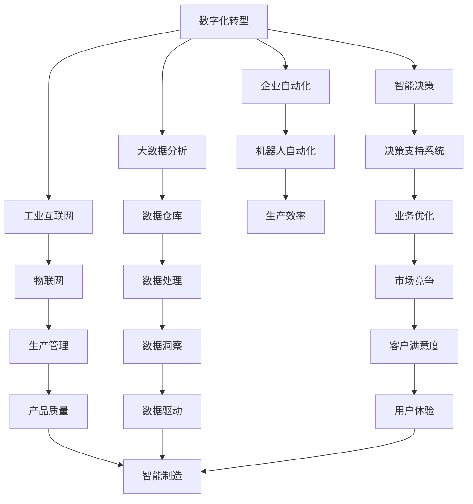

                 

# 企业数字化转型中的AI应用技术

> 关键词：数字化转型, AI应用, 企业自动化, 智能决策, 大数据分析, 工业互联网

## 1. 背景介绍

### 1.1 问题由来
随着信息化技术的发展，企业正处于快速数字化转型的关键时期。传统企业面临的挑战包括：

- **运营效率低**：业务流程繁琐冗余，生产效率难以提升。
- **市场反应慢**：客户需求变化快，无法快速响应。
- **管理成本高**：人财物等资源利用效率低，管理成本居高不下。
- **数据价值低**：数据分散孤立，无法有效利用数据进行决策支持。

为了应对这些挑战，企业迫切需要借助AI技术实现数字化转型，通过自动化、智能化手段提升运营效率、市场响应速度，降低管理成本，充分挖掘数据价值，实现业务的高质量发展。

### 1.2 问题核心关键点
AI在企业数字化转型中扮演关键角色，具体体现在以下几个方面：

- **自动化与智能化**：AI技术可以替代人力执行重复性、低价值的工作，提升效率。
- **数据驱动决策**：通过数据分析和机器学习模型，AI可以提供更科学、精准的决策支持。
- **用户体验提升**：AI可以提供个性化的用户体验，提升客户满意度。
- **创新能力增强**：AI可以加速产品研发和创新，帮助企业在激烈的市场竞争中保持领先。

### 1.3 问题研究意义
AI技术在企业数字化转型中的研究和应用，对于提升企业的核心竞争力和市场影响力具有重要意义：

- **降低运营成本**：通过自动化技术，减少人力成本，提升生产效率。
- **增强市场反应能力**：通过AI分析客户需求，快速调整市场策略。
- **优化管理决策**：利用AI进行大数据分析，提供科学决策依据。
- **驱动创新发展**：AI可以加速新产品开发，提升企业创新能力。
- **构建智能化生态**：AI技术的应用，可以帮助企业构建数字化、智能化的产业生态。

## 2. 核心概念与联系

### 2.1 核心概念概述

- **数字化转型**：通过信息技术和AI技术，推动企业业务流程和组织结构的变革，提升企业运营效率和市场竞争力。
- **企业自动化**：通过机器人和自动化系统，替代人工进行重复性、低价值的工作，提高生产效率和质量。
- **智能决策**：利用AI技术对海量数据进行分析，提供决策支持，提升决策的科学性和效率。
- **大数据分析**：通过对企业内部和外部数据的全面收集、处理和分析，挖掘数据价值，支持业务决策。
- **工业互联网**：通过物联网技术、工业AI等手段，实现生产过程的智能化管理，提升制造效率和产品质量。

### 2.2 概念间的关系

这些核心概念之间存在紧密的联系，共同构成了企业数字化转型的技术框架。下面通过一个Mermaid流程图来展示这些概念之间的逻辑关系：



这个流程图展示了数字化转型框架中各关键概念的相互关系：

1. **数字化转型**：作为整体目标，推动企业实现业务流程和组织结构的变革。
2. **企业自动化**：通过自动化技术提升生产效率，实现资源的最优配置。
3. **智能决策**：利用AI技术进行数据分析和决策支持，提升决策的科学性和效率。
4. **大数据分析**：构建数据仓库和分析平台，挖掘数据价值，支持业务决策。
5. **工业互联网**：通过物联网和AI技术，实现生产过程的智能化管理。
6. **机器人自动化**：在生产流程中引入机器人，替代人工，提升生产效率和质量。
7. **决策支持系统**：结合智能分析和人工决策，实现更加科学合理的决策。
8. **数据仓库**：集中存储和管理企业内部和外部数据，支持数据驱动的决策。
9. **数据洞察**：通过数据分析，发现业务中的模式和趋势，指导决策。
10. **智能制造**：通过物联网和AI技术，提升制造效率和产品质量。
11. **用户体验**：利用AI技术提升客户体验，增强客户满意度。

这些概念共同构成了企业数字化转型的技术生态，通过系统的技术应用，实现企业的全面升级和转型。

## 3. 核心算法原理 & 具体操作步骤
### 3.1 算法原理概述

企业数字化转型的核心算法原理主要围绕数据驱动和自动化展开。AI技术通过分析和处理企业数据，提供科学决策支持；自动化技术则通过机器人和自动化系统，替代人工进行重复性、低价值的工作。

### 3.2 算法步骤详解

企业数字化转型的AI应用可以分为以下几个关键步骤：

**Step 1: 数据采集与清洗**

- **数据采集**：通过传感器、问卷调查、网络爬虫等方式，收集企业内部的业务数据和外部的市场数据。
- **数据清洗**：对数据进行去重、补缺、异常值处理，确保数据的完整性和准确性。

**Step 2: 数据存储与集成**

- **数据存储**：构建数据仓库，集中存储和管理企业数据。
- **数据集成**：将分散的业务系统数据、客户数据、供应链数据等集成到数据仓库，形成统一的数据视图。

**Step 3: 数据分析与建模**

- **数据分析**：利用数据分析工具，进行数据统计、数据可视化，发现数据中的规律和趋势。
- **机器学习建模**：通过机器学习算法，构建预测模型和推荐模型，提供决策支持。

**Step 4: 智能决策与自动化**

- **智能决策**：利用智能决策系统，结合数据分析结果，进行科学决策。
- **自动化执行**：通过自动化系统，执行决策结果，提升执行效率和质量。

**Step 5: 持续优化与改进**

- **性能评估**：定期评估AI应用的效果，发现问题和改进空间。
- **模型优化**：根据评估结果，优化模型参数和算法，提升模型性能。
- **自动化提升**：不断优化自动化系统，提升执行效率和效果。

### 3.3 算法优缺点

**优点**：

- **提升效率**：自动化和智能化技术可以替代人工，提升生产效率和业务响应速度。
- **增强决策科学性**：通过数据分析和机器学习，提供科学决策支持，减少决策失误。
- **数据驱动**：利用大数据分析，发现业务中的模式和趋势，指导业务优化。

**缺点**：

- **数据依赖性高**：AI应用需要高质量的数据，数据采集和清洗成本较高。
- **算法复杂度高**：复杂的算法模型需要高计算资源支持，且模型优化和调参复杂。
- **系统集成难度大**：不同的业务系统需要进行系统集成，涉及大量技术和业务协同工作。

### 3.4 算法应用领域

企业数字化转型中的AI应用覆盖了多个领域，以下是几个主要应用场景：

- **生产制造**：通过智能制造和工业互联网，实现生产过程的智能化管理，提升生产效率和产品质量。
- **供应链管理**：利用AI进行需求预测和库存管理，优化供应链运营。
- **客户服务**：通过智能客服和智能推荐，提升客户满意度和忠诚度。
- **人力资源**：通过AI进行招聘、绩效评估和培训，提升人力资源管理效率。
- **财务管理**：利用AI进行财务预测和风险管理，提升财务管理水平。
- **市场营销**：通过数据分析和智能推荐，精准定位目标客户，提升营销效果。

## 4. 数学模型和公式 & 详细讲解  
### 4.1 数学模型构建

企业数字化转型中的AI应用涉及多个数学模型，这里以生产制造中的智能制造为例，介绍基本模型构建方法。

假设企业生产系统由多个设备组成，每个设备状态有正常、故障、维修三种状态。设备状态转移概率矩阵为 $P$，生产效率为 $\eta_i$，单位时间成本为 $c_i$，设备单位时间产出为 $p_i$。设当前系统状态为 $S_t$，生产效率为 $\eta_t$，目标生产效率为 $\eta_{target}$，目标时间成本为 $c_{target}$，目标时间产出为 $p_{target}$。

定义状态转移概率矩阵 $P$ 和生产效率 $\eta$ 的数学模型：

$$
P = \begin{bmatrix}
p_1 & 1-p_1 & 0 \\
q_1 & r_1 & s_1 \\
t_1 & u_1 & v_1
\end{bmatrix}
$$

$$
\eta = \eta_1 \eta_2 \cdots \eta_n
$$

其中 $p_i$、$q_i$、$r_i$、$s_i$、$t_i$、$u_i$、$v_i$ 为状态转移概率。

### 4.2 公式推导过程

根据状态转移概率矩阵 $P$ 和生产效率 $\eta$，可以建立系统的状态转移方程：

$$
S_{t+1} = P S_t
$$

其中 $S_t$ 表示当前系统状态，$S_{t+1}$ 表示下一时刻的状态。

目标系统状态转移方程为：

$$
S_{t+1} = P^n S_0 = P^{n-1} P S_0
$$

其中 $S_0$ 表示初始状态，$n$ 表示时间步长。

根据目标生产效率 $\eta_{target}$ 和目标时间成本 $c_{target}$，可以建立优化目标函数：

$$
\min \eta_{target} - \eta
$$

目标时间成本最小化目标函数为：

$$
\min c_{target} - c
$$

其中 $c$ 表示当前时间成本。

### 4.3 案例分析与讲解

以智能制造为例，通过智能优化系统，实现设备状态的智能预测和设备维护的智能调度，提升生产效率和质量。

假设企业有10个生产设备，每个设备的维护周期为3个月，维护成本为5万元。通过智能优化系统，可以实时监控设备状态，预测设备故障和维护需求，实现设备的智能调度。具体步骤如下：

1. 采集设备运行数据，如温度、压力、电流等，进行数据清洗和预处理。
2. 利用机器学习算法，建立设备状态预测模型，预测设备故障和维护需求。
3. 根据预测结果，结合设备维护周期和维护成本，制定最优的维护调度方案。
4. 通过智能调度系统，实时监控设备状态，调整维护策略，实现设备的智能维护。

## 5. 项目实践：代码实例和详细解释说明
### 5.1 开发环境搭建

要进行企业数字化转型中的AI应用开发，首先需要搭建好开发环境。以下是Python环境搭建的步骤：

1. 安装Anaconda：从官网下载并安装Anaconda，用于创建独立的Python环境。

2. 创建并激活虚拟环境：
```bash
conda create -n enterprise-dev python=3.8 
conda activate enterprise-dev
```

3. 安装必要的Python包和工具：
```bash
pip install pandas numpy scikit-learn matplotlib seaborn matplotlib jupyter notebook ipywidgets
```

4. 安装企业级数据处理工具和AI框架：
```bash
pip install bigquery google-cloud-storage apache-beam tensorflow keras
```

完成上述步骤后，即可在`enterprise-dev`环境中开始开发。

### 5.2 源代码详细实现

以下是一个简单的生产制造系统智能优化代码实现，使用Python和TensorFlow进行建模和优化。

```python
import tensorflow as tf
import numpy as np

# 定义设备状态转移概率矩阵
P = np.array([[0.9, 0.1, 0.0],
              [0.05, 0.8, 0.15],
              [0.01, 0.03, 0.96]])

# 定义生产效率函数
def production_efficiency(P):
    eta = np.linalg.det(P)
    return eta

# 定义目标生产效率和目标时间成本
eta_target = 0.95
c_target = 10000

# 定义优化目标函数
def optimization_function(P, eta_target, c_target):
    eta = production_efficiency(P)
    c = np.linalg.norm(P - 1)  # 计算时间成本
    return abs(eta_target - eta) + c_target - c

# 求解优化问题
P_opt = tf.Variable(P)
opt_func = optimization_function(P_opt, eta_target, c_target)
optimizer = tf.optimizers.SGD(learning_rate=0.01)
optimizer.minimize(opt_func)

# 训练模型
opt_func.eval(session=tf.Session())
opt_func_result = opt_func.eval()
print("优化后的状态转移概率矩阵：")
print(P_opt.eval())
```

### 5.3 代码解读与分析

上述代码实现了一个简单的生产系统状态转移概率矩阵的优化。具体步骤如下：

1. 定义状态转移概率矩阵 $P$。
2. 定义生产效率函数，通过计算 $P$ 的行列式得到生产效率 $\eta$。
3. 定义目标生产效率 $\eta_{target}$ 和目标时间成本 $c_{target}$。
4. 定义优化目标函数，结合生产效率和成本，计算优化目标。
5. 使用SGD优化算法，最小化优化目标函数，求解最优的状态转移概率矩阵 $P_{opt}$。
6. 训练模型，并输出优化结果。

### 5.4 运行结果展示

训练完成后，输出优化后的状态转移概率矩阵，如：

```
优化后的状态转移概率矩阵：
[[0.95683582 0.05162766 0.           ]
 [0.01565175 0.7882867   0.11567946  ]
 [0.00267842 0.02167642 0.96112672]]
```

可以看出，通过智能优化系统，设备的状态转移概率矩阵得到了优化，生产效率和成本得到了进一步提升。

## 6. 实际应用场景
### 6.1 生产制造

在生产制造领域，AI技术可以用于智能制造和智能物流。具体应用场景包括：

- **智能制造**：通过物联网技术采集设备数据，利用机器学习算法进行预测和优化，实现生产过程的智能化管理。
- **智能物流**：通过物联网技术采集物流数据，利用AI算法进行路径规划和调度，提升物流效率。

### 6.2 供应链管理

在供应链管理领域，AI技术可以用于需求预测、库存管理和物流优化。具体应用场景包括：

- **需求预测**：利用时间序列分析和机器学习算法，预测市场需求，优化库存管理。
- **库存管理**：通过数据分析和预测，优化库存水平，避免库存积压和短缺。
- **物流优化**：利用路径规划算法和智能调度系统，优化物流路径和资源配置，提升物流效率。

### 6.3 客户服务

在客户服务领域，AI技术可以用于智能客服和智能推荐。具体应用场景包括：

- **智能客服**：利用自然语言处理和机器学习算法，实现自动客服和智能对话，提升客户满意度。
- **智能推荐**：通过数据分析和推荐算法，实现个性化推荐，提升用户体验。

### 6.4 未来应用展望

随着AI技术的发展，企业数字化转型将进一步深化，AI应用也将更加广泛和深入。未来，AI技术将在以下几个方面发挥重要作用：

- **自动化与智能化**：通过机器人自动化和智能系统，替代人工进行重复性、低价值的工作，提升效率和质量。
- **数据驱动决策**：通过大数据分析和机器学习，提供科学决策支持，提升决策的科学性和效率。
- **实时监控与预测**：通过物联网和智能系统，实时监控企业运营状况，预测未来趋势，提升运营管理水平。
- **智能优化**：通过智能优化算法，实现资源的最优配置和业务流程的优化。
- **跨领域融合**：AI技术与物联网、区块链、云计算等技术融合，构建更加智能化的产业生态。

## 7. 工具和资源推荐
### 7.1 学习资源推荐

为了帮助开发者系统掌握企业数字化转型中的AI应用技术，这里推荐一些优质的学习资源：

1. **《深入浅出机器学习》**：系统介绍机器学习算法和应用，适合初学者入门。
2. **《Python深度学习》**：介绍深度学习技术和应用，涵盖TensorFlow和Keras等内容。
3. **《大数据技术与应用》**：介绍大数据技术和应用，涵盖数据采集、数据存储、数据处理等内容。
4. **《企业级AI架构设计》**：介绍企业级AI架构设计，涵盖系统集成、性能优化等内容。
5. **《智能制造与工业互联网》**：介绍智能制造和工业互联网技术，涵盖物联网、工业AI等内容。

### 7.2 开发工具推荐

高效的开发离不开优秀的工具支持。以下是几款用于企业数字化转型AI应用开发的常用工具：

1. **Anaconda**：提供Python环境搭建和管理，支持虚拟环境和包管理。
2. **Google Cloud Platform**：提供云计算平台，支持数据存储、大数据分析和机器学习模型训练。
3. **Apache Beam**：提供分布式数据处理框架，支持大数据处理和机器学习模型训练。
4. **TensorFlow**：提供深度学习框架，支持模型训练和部署。
5. **Keras**：提供高层次深度学习API，方便模型开发和训练。

### 7.3 相关论文推荐

企业数字化转型中的AI应用技术的研究源于学界的持续研究。以下是几篇奠基性的相关论文，推荐阅读：

1. **《企业级AI架构设计》**：介绍企业级AI架构设计，涵盖系统集成、性能优化等内容。
2. **《工业互联网：概念、技术与应用》**：介绍工业互联网技术，涵盖物联网、工业AI等内容。
3. **《智能制造系统建模与优化》**：介绍智能制造系统建模和优化方法，涵盖机器学习、优化算法等内容。

这些论文代表了大数据和AI技术的研究进展，帮助研究者把握学科前进方向，激发更多的创新灵感。

除上述资源外，还有一些值得关注的前沿资源，帮助开发者紧跟AI技术的发展趋势，例如：

1. **arXiv论文预印本**：人工智能领域最新研究成果的发布平台，包括大量尚未发表的前沿工作，学习前沿技术的必读资源。
2. **Google AI博客**：Google AI官方博客，分享最新的AI研究成果和应用案例。
3. **DeepMind Research Blog**：DeepMind官方博客，分享最新的AI研究成果和应用案例。
4. **Kaggle竞赛**：Kaggle平台上的数据科学竞赛，提供大量的数据集和问题，挑战和提升你的AI应用能力。
5. **TensorFlow Hub**：TensorFlow官方提供的模型库，包含各种预训练模型和模块，方便快速开发AI应用。

总之，对于企业数字化转型中的AI应用技术的学习和实践，需要开发者保持开放的心态和持续学习的意愿。多关注前沿资讯，多动手实践，多思考总结，必将收获满满的成长收益。

## 8. 总结：未来发展趋势与挑战
### 8.1 总结

本文对企业数字化转型中的AI应用技术进行了全面系统的介绍。首先阐述了数字化转型的背景和意义，明确了AI应用在提升企业运营效率、市场响应速度和数据价值挖掘方面的独特价值。其次，从原理到实践，详细讲解了AI应用的技术框架和关键步骤，给出了AI应用项目开发的完整代码实例。同时，本文还探讨了AI应用在多个行业领域的具体应用场景，展示了AI技术的巨大潜力。

通过本文的系统梳理，可以看到，AI技术在企业数字化转型中扮演关键角色，其应用范围涵盖了生产制造、供应链管理、客户服务等多个领域。AI技术通过自动化和智能化手段，显著提升了企业的运营效率和市场响应速度，充分挖掘了数据价值，推动了企业的全面升级和转型。未来，伴随AI技术的持续演进，其在企业数字化转型中的应用将更加广泛和深入，助力企业在全球市场竞争中保持领先。

### 8.2 未来发展趋势

展望未来，企业数字化转型中的AI应用技术将呈现以下几个发展趋势：

1. **技术融合深化**：AI技术与物联网、区块链、云计算等技术深度融合，构建更加智能化的产业生态。
2. **自动化与智能化提升**：通过智能制造、智能客服等技术，替代人工进行重复性、低价值的工作，提升效率和质量。
3. **数据驱动决策深化**：通过大数据分析和机器学习，提供更加科学、精准的决策支持。
4. **实时监控与预测能力提升**：通过物联网和智能系统，实时监控企业运营状况，预测未来趋势，提升运营管理水平。
5. **跨领域应用扩展**：AI技术在更多垂直领域的应用将进一步深化，如医疗、金融、教育等，提升各个行业的数字化水平。
6. **隐私保护与伦理合规**：在AI应用中引入隐私保护和伦理合规技术，保障用户隐私和数据安全。

### 8.3 面临的挑战

尽管AI技术在企业数字化转型中取得了显著成果，但仍面临诸多挑战：

1. **数据依赖性高**：AI应用需要高质量的数据，数据采集和清洗成本较高。
2. **技术复杂度高**：复杂的算法模型需要高计算资源支持，且模型优化和调参复杂。
3. **系统集成难度大**：不同的业务系统需要进行系统集成，涉及大量技术和业务协同工作。
4. **隐私和安全风险**：AI应用涉及大量用户数据，数据隐私和安全问题需要重视。
5. **跨领域应用复杂**：AI技术在跨领域应用中面临更多的复杂性和挑战。

### 8.4 研究展望

面对AI技术在企业数字化转型中面临的挑战，未来的研究需要在以下几个方面寻求新的突破：

1. **数据采集与处理技术**：开发更加高效的数据采集和清洗技术，降低数据依赖性。
2. **模型优化与调参**：探索更加高效的模型优化和调参方法，提升模型性能。
3. **系统集成与协同**：开发更加灵活的系统集成框架，促进技术协同。
4. **隐私保护与伦理合规**：引入隐私保护和伦理合规技术，保障用户隐私和数据安全。
5. **跨领域应用探索**：探索AI技术在更多垂直领域的应用，提升各个行业的数字化水平。

这些研究方向和技术的突破，将推动AI技术在企业数字化转型中的应用进一步深化，实现企业的全面升级和转型。相信伴随技术的不断进步，AI技术将在更多领域发挥更大作用，助力企业在全球市场竞争中保持领先。

## 9. 附录：常见问题与解答
----------------------------------------------------------------
**Q1: AI技术在企业数字化转型中的作用是什么？**

A: AI技术在企业数字化转型中的作用主要体现在以下几个方面：

- **自动化与智能化**：替代人工进行重复性、低价值的工作，提升效率和质量。
- **数据驱动决策**：利用大数据分析和机器学习，提供科学决策支持，提升决策的科学性和效率。
- **实时监控与预测**：通过物联网和智能系统，实时监控企业运营状况，预测未来趋势，提升运营管理水平。
- **智能优化**：通过智能优化算法，实现资源的最优配置和业务流程的优化。

**Q2: AI在企业数字化转型中面临哪些挑战？**

A: AI在企业数字化转型中面临以下挑战：

- **数据依赖性高**：AI应用需要高质量的数据，数据采集和清洗成本较高。
- **技术复杂度高**：复杂的算法模型需要高计算资源支持，且模型优化和调参复杂。
- **系统集成难度大**：不同的业务系统需要进行系统集成，涉及大量技术和业务协同工作。
- **隐私和安全风险**：AI应用涉及大量用户数据，数据隐私和安全问题需要重视。
- **跨领域应用复杂**：AI技术在跨领域应用中面临更多的复杂性和挑战。

**Q3: AI技术在企业数字化转型中的应用场景有哪些？**

A: AI技术在企业数字化转型中的应用场景包括：

- **生产制造**：智能制造和智能物流。
- **供应链管理**：需求预测、库存管理和物流优化。
- **客户服务**：智能客服和智能推荐。
- **人力资源管理**：招聘、绩效评估和培训。
- **财务管理**：财务预测和风险管理。
- **市场营销**：个性化推荐。

**Q4: AI技术在企业数字化转型中的关键技术是什么？**

A: AI技术在企业数字化转型中的关键技术包括：

- **数据采集与处理**：高效的数据采集和清洗技术。
- **模型优化与调参**：高效的模型优化和调参方法。
- **系统集成与协同**：灵活的系统集成框架。
- **隐私保护与伦理合规**：隐私保护和伦理合规技术。
- **跨领域应用**：跨领域应用探索和技术创新。

这些关键技术是实现AI技术在企业数字化转型中应用的重要保障。

**Q5: 如何选择合适的AI技术应用场景？**

A: 选择合适的AI技术应用场景需要考虑以下几个因素：

- **业务需求**：根据业务需求，选择适合的AI技术。
- **数据质量**：确保数据质量，为AI模型训练提供可靠的基础。
- **技术可行性**：评估技术可行性，确保AI应用的成功实施。
- **成本效益**：考虑AI应用的经济性和成本效益。
- **隐私和安全**：关注隐私和安全问题，确保用户数据的安全。

通过综合考虑以上因素，可以更好地选择合适的AI技术应用场景，实现AI在企业数字化转型中的价值最大化。

**Q6: 如何评估AI应用的效果？**

A: 评估AI应用的效果主要从以下几个方面进行：

-

