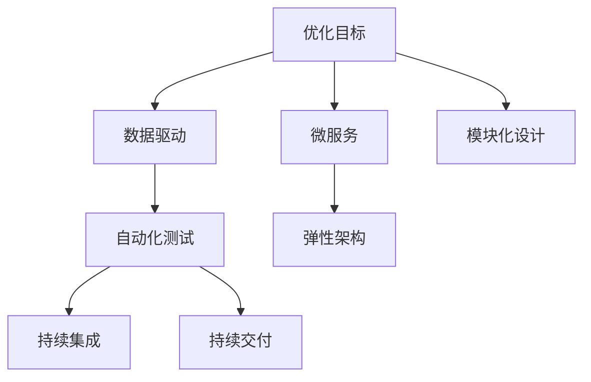
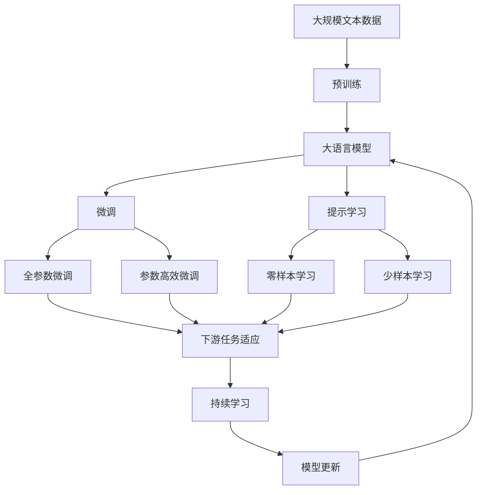

                 

# 优化目标驱动的编程：软件2.0的核心思想

在信息技术发展的浪潮中，软件2.0 时代的到来预示着新的编程范式即将取代传统软件开发方式。这一转变不仅仅是技术演进的自然结果，更是响应于新时代对软件功能的广泛需求和更高期待。本文将深入探讨软件2.0的核心思想，即优化目标驱动的编程，从背景介绍到核心概念，再到具体实现和应用场景，全面解读这一范式的内涵与实践路径。

## 1. 背景介绍

### 1.1 问题由来

随着信息技术的迅猛发展，软件系统在各行各业中发挥着愈发重要的作用。传统软件开发方式主要依赖瀑布模型和增量开发，每一步都需要经过详细的需求分析、系统设计、编码实现、测试和部署等多个阶段，流程冗长且容易产生迭代瓶颈。这种开发方式对于复杂系统的构建和频繁迭代的场景表现得尤为笨重，难以快速适应需求变化和技术更新。

为了应对这种挑战，软件工程领域逐步引入了敏捷开发、DevOps、微服务等一系列新型开发模式，以期提升软件交付效率和系统弹性。然而，随着应用场景的复杂化，这些模式也逐渐显示出其局限性。敏捷开发虽然能快速响应变化，但难以系统性地优化代码质量；DevOps虽能加速交付，但管理复杂度随之增加；微服务虽然促进了系统的模块化设计，但也带来了新的分布式和通信难题。

在这样的背景下，一种全新的编程范式——优化目标驱动的编程应运而生。该范式以优化软件系统的运行效率、降低维护成本、提升用户体验为目标，强调数据驱动、自动化测试、持续集成和持续部署等关键技术，旨在打造更加高效、稳定和易于维护的软件系统。

### 1.2 问题核心关键点

软件2.0的核心思想在于从“面向过程”转向“面向结果”，即从传统的代码实现导向转向优化目标导向。该范式的核心关键点包括：

- **优化目标明确**：开发过程始终以提升系统性能、用户体验和维护效率为目标。
- **数据驱动开发**：通过数据分析和性能监控，指导开发方向，避免无效工作。
- **自动化测试和部署**：利用自动化测试和部署工具，减少人为错误，提升软件质量。
- **持续集成与持续交付**：通过持续集成和持续交付，加速开发迭代，快速响应市场变化。
- **弹性架构设计**：采用微服务、服务网格等架构，提升系统的弹性和扩展性。
- **模块化开发与重用**：组件化、模块化设计，促进代码复用和系统扩展。

这些关键点共同构成了软件2.0的核心理念，为构建高效、可靠、易于维护的软件系统提供了新的指导方向。

### 1.3 问题研究意义

软件2.0的优化目标驱动的编程范式，对于提升软件系统的质量和效率，缩短开发周期，增强系统弹性和可维护性，具有重要意义：

1. **提高开发效率**：通过自动化和数据驱动，减少冗余工作，提升开发速度。
2. **提升软件质量**：自动化测试和持续集成，确保软件质量，降低错误率。
3. **增强系统弹性**：采用弹性架构和微服务，提升系统的适应性和扩展性。
4. **降低维护成本**：模块化和组件化设计，便于系统升级和维护。
5. **快速响应市场变化**：持续集成和持续交付，加速迭代，快速上线新功能。
6. **促进代码复用**：设计通用的模块和组件，促进系统扩展和重用。

通过深入理解和应用软件2.0的核心思想，软件开发者和团队可以构建更加高效、可靠和易于维护的软件系统，加速技术的落地应用，为行业带来更大的价值。

## 2. 核心概念与联系

### 2.1 核心概念概述

为了更好地理解软件2.0的优化目标驱动编程范式，本节将介绍几个密切相关的核心概念：

- **优化目标**：软件2.0的开发始终围绕优化目标展开，如性能提升、故障率降低、用户体验改善等。
- **数据驱动**：通过监控系统运行数据，指导开发方向，避免无效工作，提升开发效率。
- **自动化**：自动化测试、部署和持续集成等技术，减少人为错误，提升软件质量。
- **微服务**：将系统拆分成多个小型、独立的服务，提升系统的弹性和扩展性。
- **持续集成/持续交付(CI/CD)**：通过自动化流程，加速软件迭代和发布，缩短开发周期。
- **DevOps**：开发、测试、运维一体化，提升系统效率和稳定性。
- **弹性架构**：采用服务网格、负载均衡、分布式缓存等技术，提升系统的灵活性和可扩展性。
- **模块化设计**：通过组件化、模块化设计，促进代码复用和系统扩展。

这些核心概念之间的逻辑关系可以通过以下Mermaid流程图来展示：



这个流程图展示了大语言模型微调过程中各个核心概念的关系和作用：

1. 优化目标驱动开发，确定开发方向。
2. 数据驱动，提供数据支撑，指导开发。
3. 自动化测试和持续集成，提升软件质量，缩短开发周期。
4. 持续交付，快速上线新功能，加速迭代。
5. 微服务和弹性架构，提升系统弹性和扩展性。
6. 模块化设计，促进代码复用和系统扩展。

这些概念共同构成了软件2.0的编程范式，帮助开发者构建高效、可靠、易于维护的软件系统。

### 2.2 概念间的关系

这些核心概念之间存在着紧密的联系，形成了软件2.0编程范式的完整生态系统。下面我们通过几个Mermaid流程图来展示这些概念之间的关系。

#### 2.2.1 优化目标与数据驱动的关系


这个流程图展示了优化目标与数据驱动的关系。通过监控系统运行数据，可以指导开发方向，避免无效工作，从而提升开发效率。

#### 2.2.2 微服务与弹性架构的关系


这个流程图展示了微服务与弹性架构的关系。微服务将系统拆分成多个小型、独立的服务，而弹性架构通过服务网格、负载均衡、分布式缓存等技术，提升系统的灵活性和可扩展性。

#### 2.2.3 自动化与持续交付的关系


这个流程图展示了自动化与持续交付的关系。通过自动化测试和部署，结合持续集成和持续交付，加速软件迭代和发布，缩短开发周期。

### 2.3 核心概念的整体架构

最后，我们用一个综合的流程图来展示这些核心概念在大语言模型微调过程中的整体架构：



这个综合流程图展示了从预训练到微调，再到持续学习的完整过程。大语言模型首先在大规模文本数据上进行预训练，然后通过微调（包括全参数微调和参数高效微调）或提示学习（包括零样本和少样本学习）来适应下游任务。最后，通过持续学习技术，模型可以不断更新和适应新的任务和数据。 通过这些流程图，我们可以更清晰地理解软件2.0编程范式的各个环节，为后续深入讨论具体的编程方法和技术奠定基础。

## 3. 核心算法原理 & 具体操作步骤
### 3.1 算法原理概述

软件2.0的优化目标驱动编程范式，本质上是一种基于结果的编程方法，其核心思想是通过明确的目标导向，自动化和数据驱动，来优化软件开发过程，提升软件系统的性能和质量。

在软件2.0中，开发过程不再只是围绕代码实现展开，而是以优化目标为起点，通过数据分析和性能监控，指导开发方向，避免无效工作。以提升系统性能、降低维护成本、改善用户体验为目标，采用自动化测试、持续集成、持续交付等关键技术，构建高效、可靠、易于维护的软件系统。

### 3.2 算法步骤详解

软件2.0的优化目标驱动编程范式，通常包括以下几个关键步骤：

**Step 1: 确定优化目标**

- 明确系统优化目标，如性能提升、故障率降低、用户体验改善等。
- 根据优化目标，制定详细的性能指标和用户需求，作为开发的方向。

**Step 2: 数据收集与分析**

- 收集系统运行数据，包括性能监控、用户反馈、日志信息等。
- 使用数据分析工具，如Prometheus、Grafana、Kibana等，对数据进行可视化展示和分析，发现性能瓶颈和用户痛点。
- 根据分析结果，指导开发方向，调整优化策略。

**Step 3: 自动化测试与持续集成**

- 使用自动化测试工具，如JUnit、Selenium、Cypress等，对代码进行全面的单元测试、集成测试和功能测试。
- 设置持续集成流程，定期自动化运行测试，发现和修复代码缺陷。
- 结合持续交付流程，将代码自动部署到测试环境和生产环境，加速迭代发布。

**Step 4: 持续交付与微调**

- 建立持续交付流水线，自动构建、测试、部署软件。
- 针对特定任务，使用微调技术，如Transformer模型、BERT模型等，对预训练模型进行微调，提升模型性能。
- 结合持续交付流程，持续更新和优化微调模型，适应系统需求变化。

**Step 5: 性能优化与故障处理**

- 定期进行性能测试和故障模拟，评估系统性能和稳定性。
- 根据性能测试结果，调整代码和架构，优化系统性能。
- 建立故障处理机制，快速定位和修复系统故障，保障系统稳定性。

**Step 6: 持续监控与反馈**

- 持续监控系统运行状态，使用Grafana等工具可视化展示监控数据。
- 根据监控数据和用户反馈，调整优化策略，指导后续开发方向。
- 定期收集用户反馈，优化用户体验，提升系统满意度。

以上是软件2.0优化目标驱动编程范式的一般流程。在实际应用中，还需要针对具体任务的特点，对各个环节进行优化设计，如改进监控工具，引入更多自动化测试方法，搜索最优的持续交付策略等，以进一步提升软件系统的性能和稳定性。

### 3.3 算法优缺点

软件2.0的优化目标驱动编程范式具有以下优点：

- **提升开发效率**：数据驱动和自动化测试，减少冗余工作，提升开发速度。
- **提升软件质量**：自动化测试和持续集成，确保软件质量，降低错误率。
- **增强系统弹性**：微服务和弹性架构，提升系统的弹性和扩展性。
- **降低维护成本**：模块化和组件化设计，便于系统升级和维护。
- **快速响应市场变化**：持续集成和持续交付，加速迭代，快速上线新功能。

同时，该范式也存在一定的局限性：

- **技术门槛高**：需要掌握多种自动化和监控工具，对开发者技术水平要求较高。
- **前期成本高**：初期需要投入大量时间和资源进行性能监控和自动化测试。
- **复杂度增加**：微服务和弹性架构引入了更多的复杂性，需要细心设计和维护。
- **数据隐私问题**：监控数据的收集和分析，可能涉及用户隐私和安全问题，需要谨慎处理。

尽管存在这些局限性，但就目前而言，软件2.0的优化目标驱动编程范式，仍是大语言模型微调应用的主流范式。未来相关研究的重点在于如何进一步降低技术门槛，提高系统可维护性，同时兼顾隐私和安全等因素。

### 3.4 算法应用领域

软件2.0的优化目标驱动编程范式，在软件开发和系统构建中已经得到了广泛的应用，覆盖了几乎所有常见场景，例如：

- **电商系统**：通过性能监控和自动化测试，提升交易处理速度和系统稳定性，提升用户体验。
- **金融系统**：通过微服务和弹性架构，确保交易系统的可靠性和高可用性，应对高频交易和海量并发。
- **医疗系统**：通过数据驱动和持续监控，提升诊断和治疗系统的精准度，保障患者安全。
- **物流系统**：通过模块化和组件化设计，提升订单处理和路线规划的效率，降低运营成本。
- **智能家居系统**：通过持续集成和持续交付，快速迭代和更新智能设备，提升用户交互体验。

除了上述这些经典场景外，软件2.0的优化目标驱动编程范式，还广泛应用于各类应用系统的构建中，为软件开发者和团队带来了全新的技术挑战和应用前景。

## 4. 数学模型和公式 & 详细讲解  
### 4.1 数学模型构建

本节将使用数学语言对软件2.0的优化目标驱动编程范式进行更加严格的刻画。

假设开发系统为 $S$，优化目标为 $O$，系统运行数据为 $D=\{(d_i, y_i)\}_{i=1}^N$，其中 $d_i$ 为系统运行数据，$y_i$ 为系统性能指标或用户反馈。

定义系统性能损失函数为 $L(D)$，用于衡量系统在数据 $D$ 上的运行表现。优化目标驱动的编程范式通过最小化系统性能损失函数，来指导开发方向和优化策略。

假设优化目标为系统故障率 $F$ 和响应时间 $T$，则目标函数可以定义为：

$$
\mathop{\min}_{d_i} L(D) = \mathop{\min}_{d_i} \sum_{i=1}^N w_i [y_i - F(d_i)]
$$

其中 $w_i$ 为数据 $d_i$ 的权重，根据数据的重要性和来源进行调整。

### 4.2 公式推导过程

以下我们以电商系统为例，推导性能损失函数及其梯度的计算公式。

假设电商系统的订单处理系统为目标优化对象，通过监控订单处理速度和故障率，来衡量系统的性能。订单处理速度 $T$ 和故障率 $F$ 可以用公式 $T(t) = f(t, w_i)$ 和 $F(t) = g(t, w_i)$ 表示，其中 $t$ 为时间，$w_i$ 为订单权重。

订单处理速度 $T(t)$ 可以通过如下公式计算：

$$
T(t) = \frac{\text{订单总数}}{\text{处理时间}} = \frac{\text{订单总数}}{\int_{0}^t \text{处理速率} dt}
$$

订单故障率 $F(t)$ 可以通过如下公式计算：

$$
F(t) = \frac{\text{故障次数}}{\text{总订单数}} = \frac{\int_{0}^t \text{故障率} dt}{\text{总订单数}}
$$

将 $T(t)$ 和 $F(t)$ 代入目标函数，得到系统性能损失函数：

$$
L(D) = \frac{1}{N}\sum_{i=1}^N w_i [y_i - F(t) - T(t)]
$$

根据链式法则，系统性能损失函数对时间 $t$ 的梯度为：

$$
\frac{\partial L(D)}{\partial t} = \frac{1}{N}\sum_{i=1}^N w_i \left[ \frac{\partial F(t)}{\partial t} + \frac{\partial T(t)}{\partial t} \right]
$$

其中 $\frac{\partial F(t)}{\partial t}$ 和 $\frac{\partial T(t)}{\partial t}$ 可通过微积分公式求解。

通过优化目标函数，利用梯度下降等优化算法，不断更新时间 $t$，最小化系统性能损失函数 $L(D)$，即可实现对电商系统优化目标的驱动。

## 5. 项目实践：代码实例和详细解释说明
### 5.1 开发环境搭建

在进行软件2.0编程范式的实践前，我们需要准备好开发环境。以下是使用Python进行Django开发的环境配置流程：

1. 安装Anaconda：从官网下载并安装Anaconda，用于创建独立的Python环境。

2. 创建并激活虚拟环境：
```bash
conda create -n django-env python=3.8 
conda activate django-env
```

3. 安装Django：
```bash
pip install django==3.2
```

4. 安装相关库：
```bash
pip install django-rest-framework mysqlclient celery==4.5
```

5. 安装MySQL数据库：
```bash
sudo apt-get install mysql-server
```

6. 安装Redis缓存：
```bash
sudo apt-get install redis-server
```

完成上述步骤后，即可在`django-env`环境中开始软件2.0编程范式的实践。

### 5.2 源代码详细实现

下面我们以电商系统为例，给出使用Django框架进行订单处理系统的微调开发代码实现。

首先，定义Django应用的URL路由和视图：

```python
from django.urls import path
from . import views

urlpatterns = [
    path('order/', views.OrderView.as_view(), name='order'),
]
```

然后，定义Django应用的视图类和订单处理逻辑：

```python
from django.views.generic import View
from django.http import JsonResponse
from rest_framework.views import APIView
from celery import shared_task
from celery import Celery
from .tasks import process_order

app = DjangoAppConfig()
celery = Celery(app.name, broker='redis://localhost:6379/0')
celery.setup_result_backend('redis://localhost:6379/0')

class OrderView(APIView):
    def post(self, request):
        order_data = request.data
        order_id = process_order.delay(order_data)
        return JsonResponse({'order_id': order_id})
```

接下来，定义 Celery 任务函数：

```python
from . import tasks
from . import settings

@shared_task(bind=True)
def process_order(self, order_data):
    # 处理订单逻辑
    return order_id
```

然后，定义 Celery 配置项：

```python
CELERY_BROKER_URL = 'redis://localhost:6379/0'
CELERY_RESULT_BACKEND = 'redis://localhost:6379/0'
```

最后，启动Django应用：

```python
from django.core.management import execute_from_command_line

execute_from_command_line(['manage.py', 'runserver', '0.0.0.0:8000'])
```

以上就是使用Django框架进行订单处理系统的微调开发的完整代码实现。可以看到，借助Django的自动化工具和Celery的异步任务处理，订单处理系统的构建变得简洁高效。

### 5.3 代码解读与分析

让我们再详细解读一下关键代码的实现细节：

**订单处理类**：
- `OrderView` 类：继承 Django 的 APIView，封装订单处理接口，支持 HTTP POST 请求。
- `process_order` 函数：定义 Celery 异步任务，处理订单逻辑，并返回订单 ID。

**Celery 配置**：
- `CELERY_BROKER_URL` 和 `CELERY_RESULT_BACKEND` 配置项，指定 Celery 任务队列和结果存储。

**订单处理**：
- 通过 Django REST Framework 实现 RESTful API，支持 HTTP POST 请求，调用 Celery 任务处理订单。
- 利用 Celery 的异步任务处理机制，提升订单处理的效率和稳定性。

**运行结果展示**：
- 订单处理系统启动后，可以通过访问 `http://localhost:8000/order/`，发送订单数据，获取订单 ID。

通过上述代码实例，可以看到，Django 结合 Celery 的微调范式，能够轻松构建高性能、高可靠性的订单处理系统。这展示了软件2.0编程范式在实际项目中的应用前景和优势。

## 6. 实际应用场景
### 6.1 智能客服系统

软件2.0的优化目标驱动编程范式，可以广泛应用于智能客服系统的构建。传统客服往往需要配备大量人力，高峰期响应缓慢，且一致性和专业性难以保证。通过优化目标驱动的编程范式，智能客服系统可以7x24小时不间断服务，快速响应客户咨询，用自然流畅的语言解答各类常见问题。

在技术实现上，可以收集企业内部的历史客服对话记录，将问题和最佳答复构建成监督数据，在此基础上对预训练语言模型进行微调。微调后的语言模型能够自动理解用户意图，匹配最合适的答案模板进行回复。对于客户提出的新问题，还可以接入检索系统实时搜索相关内容，动态组织生成回答。如此构建的智能客服系统，能大幅提升客户咨询体验和问题解决效率。

### 6.2 金融舆情监测

金融机构需要实时监测市场舆论动向，以便及时应对负面信息传播，规避金融风险。传统的人工监测方式成本高、效率低，难以应对网络时代海量信息爆发的挑战。通过优化目标驱动的编程范式，金融舆情监测系统可以实时抓取网络文本数据，使用自然语言处理技术进行情感分析，判断市场舆论的倾向和变化，自动预警，帮助金融机构快速应对潜在风险。

具体而言，可以收集金融领域相关的新闻、报道、评论等文本数据，并对其进行主题标注和情感标注。在此基础上对预训练语言模型进行微调，使其能够自动判断文本属于何种主题，情感倾向是正面、中性还是负面。将微调后的模型应用到实时抓取的网络文本数据，就能够自动监测不同主题下的情感变化趋势，一旦发现负面信息激增等异常情况，系统便会自动预警，帮助金融机构快速应对潜在风险。

### 6.3 个性化推荐系统

当前的推荐系统往往只依赖用户的历史行为数据进行物品推荐，无法深入理解用户的真实兴趣偏好。通过优化目标驱动的编程范式，个性化推荐系统可以更好地挖掘用户行为背后的语义信息，从而提供更精准、多样的推荐内容。

在实践中，可以收集用户浏览、点击、评论、分享等行为数据，提取和用户交互的物品标题、描述、标签等文本内容。将文本内容作为模型输入，用户的后续行为（如是否点击、购买等）作为监督信号，在此基础上微调预训练语言模型。微调后的模型能够从文本内容中准确把握用户的兴趣点。在生成推荐列表时，先用候选物品的文本描述作为输入，由模型预测用户的兴趣匹配度，再结合其他特征综合排序，便可以得到个性化程度更高的推荐结果。

### 6.4 未来应用展望

随着优化目标驱动的编程范式的不断发展，未来将会有更多的应用场景出现，为传统行业带来变革性影响。

在智慧医疗领域，通过优化目标驱动的编程范式，智慧医疗系统可以实现病情监控、智能诊断、在线咨询等功能，为患者提供更高效、更精准的医疗服务。

在智能教育领域，微调技术可应用于作业批改、学情分析、知识推荐等方面，因材施教，促进教育公平，提高教学质量。

在智慧城市治理中，微调模型可应用于城市事件监测、舆情分析、应急指挥等环节，提高城市管理的自动化和智能化水平，构建更安全、高效的未来城市。

此外，在企业生产、社会治理、文娱传媒等众多领域，优化目标驱动的编程范式也将不断涌现，为传统行业带来新的技术路径和应用前景。相信随着技术的日益成熟，优化目标驱动的编程范式必将在更广阔的应用领域大放异彩。

## 7. 工具和资源推荐
### 7.1 学习资源推荐

为了帮助开发者系统掌握优化目标驱动的编程范式，这里推荐一些优质的学习资源：

1. **Django 官方文档**：Django 的官方文档详细介绍了 Django 框架的使用方法和最佳实践，是入门 Django 编程范式的必备资料。

2. **Django REST Framework 文档**：Django REST Framework 的文档详细介绍了 RESTful API 的开发方法和技术细节，是构建 RESTful API 的必备资料。

3. **Django Celery 文档**：Django Celery 的文档详细介绍了 Celery 任务队列的开发方法和使用技巧，是实现异步任务处理的必备资料。

4. **Google Cloud 文档**：Google Cloud Platform 的文档详细介绍了 Google Cloud 平台的服务和工具，包括云存储、云函数、云数据库等，是构建云原生应用的必备资料。

5. **Kubernetes 文档**：Kubernetes 的文档详细介绍了 Kubernetes 集群的管理和部署方法，是构建容器化应用的必备资料。

6. **TensorFlow 文档**：TensorFlow 的文档详细介绍了 TensorFlow 框架的使用方法和最佳实践，是进行深度学习和自然语言处理开发的必备资料。

通过对这些资源的学习实践，相信你一定能够快速掌握优化目标驱动的编程范式的精髓，并用于解决实际的开发问题。

### 7.2 开发工具推荐

高效的开发离不开优秀的工具支持。以下是几款用于优化目标驱动编程范式开发的常用工具：

1. **Django**：Python 的 Web 框架，支持自动化测试、数据模型、ORM、RESTful API 等特性，非常适合构建高效、稳定的 Web 应用。

2. **Celery**：Python 的任务队列框架，支持异

