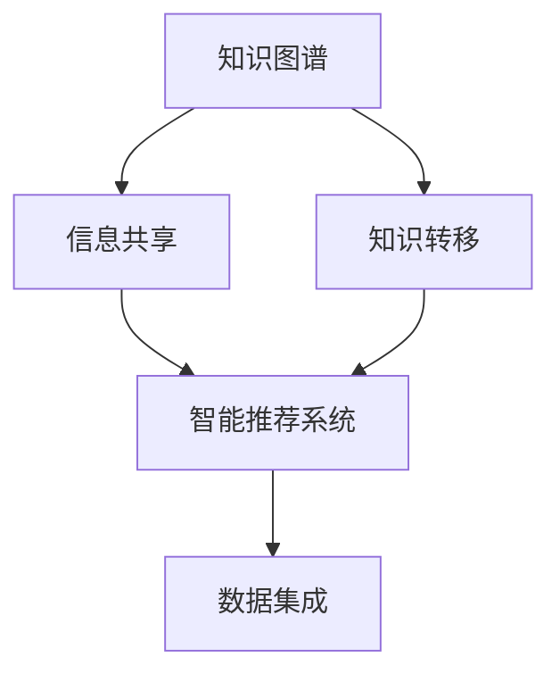

                 

# 信息差：我知道的，你不知道

> 关键词：信息差、知识图谱、信息共享、知识转移、智能推荐系统、数据集成

## 1. 背景介绍

在现代信息爆炸的时代，信息差（Information Gap）成为了我们生活中无处不在的问题。如何在海量信息中，快速定位到自己需要的信息，并且在需要的时候，能够及时地提供给需要的人，这正是信息差问题的核心所在。

### 1.1 问题由来

信息差问题不仅仅是一个技术问题，它涉及到信息的组织、存储、检索、传输等多个层面。在互联网早期，信息孤岛现象普遍存在，各个网站和平台之间的信息难以互通，用户需要耗费大量时间在多个平台之间切换，才能找到需要的信息。

然而，随着技术的进步，信息孤岛现象得到了极大的改善。信息的存储、传输、处理能力不断提升，搜索引擎的出现使得信息的获取变得更加方便。但随之而来的问题是，信息爆炸导致用户越来越难以在海量信息中找到自己需要的信息，信息的检索效率反而降低。

### 1.2 问题核心关键点

解决信息差问题的关键在于：

1. **信息的组织与结构化**：如何将海量信息组织成结构化的形式，使得信息检索更加高效。
2. **信息的一致性与准确性**：确保不同平台、不同时间发布的信息是一致的、准确的，避免误导用户。
3. **信息的及时性与可访问性**：确保信息在需要的时候能够被及时地访问到，提高信息的时效性。

## 2. 核心概念与联系

### 2.1 核心概念概述

为更好地理解如何通过信息差技术解决实际问题，本节将介绍几个密切相关的核心概念：

- **知识图谱（Knowledge Graph）**：一种用于描述实体和它们之间关系的图形结构，用于组织和检索信息。
- **信息共享（Information Sharing）**：不同系统、不同平台之间信息的共享和传播。
- **知识转移（Knowledge Transfer）**：将知识从一个系统转移到另一个系统，以便在新系统中应用。
- **智能推荐系统（Recommendation System）**：基于用户行为和偏好，推荐用户可能感兴趣的信息。
- **数据集成（Data Integration）**：将来自不同来源的数据整合在一起，形成一个统一的数据源。

这些核心概念之间存在着紧密的联系，共同构成了解决信息差问题的技术框架。下面，我们将通过一个Mermaid流程图来展示这些概念之间的联系。



这个流程图展示了知识图谱、信息共享、知识转移、智能推荐系统和数据集成之间的关系：

1. 知识图谱用于组织信息，通过信息共享和知识转移技术，将知识从一个系统转移到另一个系统。
2. 智能推荐系统基于知识图谱，通过数据集成技术，整合不同来源的数据，为用户提供个性化的推荐。

## 3. 核心算法原理 & 具体操作步骤
### 3.1 算法原理概述

解决信息差问题的核心算法原理是通过构建知识图谱和智能推荐系统，将信息组织和检索的能力提升到一个新的水平。知识图谱提供了结构化的信息组织方式，智能推荐系统则利用这些结构化的信息，为用户提供个性化的推荐。

具体而言，知识图谱包含实体、关系和属性等信息，用于描述实体之间的关系。例如，在电商领域，知识图谱可以描述商品、用户、评论等实体之间的关系。智能推荐系统通过分析用户行为、兴趣和偏好，生成个性化的推荐列表。数据集成则用于整合不同来源的数据，确保信息的一致性和准确性。

### 3.2 算法步骤详解

下面，我们将详细讲解解决信息差问题的核心算法步骤：

1. **构建知识图谱**：首先，需要构建一个覆盖全面、结构化的知识图谱。这个知识图谱应该包含尽可能多的实体、关系和属性信息。例如，在电商领域，知识图谱可以描述商品、用户、评论、评分等实体，以及它们之间的关系。

2. **数据集成**：接着，需要将不同来源的数据整合到一个统一的数据源中。这个过程需要解决数据格式不一致、数据冗余等问题，确保数据的一致性和准确性。例如，在电商领域，需要将不同平台的用户数据、商品数据、评论数据整合在一起。

3. **信息共享**：然后，需要设计信息共享机制，确保不同平台、不同系统之间的信息能够被及时地共享。这个过程需要考虑数据隐私、数据安全等问题，确保信息的安全传输。例如，在电商领域，不同平台的商品信息、用户信息需要被安全地传输和共享。

4. **知识转移**：接下来，需要将知识从一个系统转移到另一个系统。这个过程需要考虑知识的表示形式、知识的应用场景等问题，确保知识能够在新系统中被有效地应用。例如，在电商领域，将用户对某商品的评价转移到新平台上，使得新平台能够基于用户的评价推荐类似商品。

5. **智能推荐系统**：最后，利用智能推荐系统，将知识图谱和数据集成的信息，转化为对用户的个性化推荐。智能推荐系统通常基于机器学习算法，如协同过滤、内容推荐、基于规则的推荐等，生成对用户的推荐列表。

### 3.3 算法优缺点

知识图谱和智能推荐系统在解决信息差问题上，具有以下优点：

1. **高效的信息检索**：知识图谱提供了结构化的信息组织方式，使得信息检索更加高效。智能推荐系统则利用这些结构化的信息，为用户生成个性化的推荐。
2. **提高信息的时效性**：通过信息共享和知识转移技术，确保信息在需要的时候能够被及时地访问到。
3. **减少信息孤岛**：通过数据集成技术，将不同来源的数据整合在一起，减少信息孤岛现象。

然而，这些技术也存在一些局限性：

1. **构建知识图谱的成本高**：构建一个全面、结构化的知识图谱需要大量的时间和资源，尤其是在初期阶段。
2. **数据隐私和安全问题**：信息共享和知识转移需要解决数据隐私和安全问题，确保信息的安全传输。
3. **推荐算法的复杂性**：智能推荐系统通常基于复杂的机器学习算法，需要大量的数据和计算资源。

## 4. 数学模型和公式 & 详细讲解  
### 4.1 数学模型构建

为了更好地理解知识图谱和智能推荐系统的数学模型，本节将使用数学语言对这些问题进行严格刻画。

假设知识图谱包含$N$个实体，每个实体有$m$个属性，$K$个关系。知识图谱可以用三元组$(h,r,t)$表示，其中$h$和$t$分别表示头实体和尾实体，$r$表示它们之间的关系。智能推荐系统可以通过训练模型，预测用户对商品的属性评分。

设用户$u$对商品$v$的属性$a$的评分向量为$\boldsymbol{x}_{uav}$，则智能推荐系统可以表示为：

$$
\hat{y}_{uav} = f(\boldsymbol{x}_{uav})
$$

其中$f$表示预测函数，可以是线性回归、决策树、神经网络等。

### 4.2 公式推导过程

以下我们以线性回归为例，推导智能推荐系统的预测公式。

假设用户$u$对商品$v$的属性$a$的评分向量为$\boldsymbol{x}_{uav}$，其中$\boldsymbol{x}_{uav} = (x_{uav1}, x_{uav2}, \dots, x_{uavm})^T$。智能推荐系统的预测函数为：

$$
\hat{y}_{uav} = \boldsymbol{\theta} \cdot \boldsymbol{x}_{uav} + b
$$

其中$\boldsymbol{\theta} = (\theta_1, \theta_2, \dots, \theta_m)^T$为模型参数，$b$为偏置项。

在训练过程中，最小化预测值与真实值之间的平方误差：

$$
\mathcal{L}(\boldsymbol{\theta}) = \frac{1}{N} \sum_{u,v,a} (y_{uav} - \hat{y}_{uav})^2
$$

通过梯度下降等优化算法，不断更新模型参数，直到收敛。

### 4.3 案例分析与讲解

以电商领域的推荐系统为例，假设我们有一个包含$M$个商品、$N$个用户、$K$个属性的知识图谱。用户$u$对商品$v$的属性$a$的评分向量为$\boldsymbol{x}_{uav}$。智能推荐系统通过训练线性回归模型，预测用户对商品的评分，从而为用户生成推荐列表。

训练过程如下：

1. 收集用户对商品的评分数据，构建训练集。
2. 对训练集进行标准化处理，去除噪声数据。
3. 利用梯度下降算法，最小化预测值与真实值之间的平方误差。
4. 根据预测结果，为用户生成推荐列表。

## 5. 项目实践：代码实例和详细解释说明
### 5.1 开发环境搭建

在进行推荐系统实践前，我们需要准备好开发环境。以下是使用Python进行PyTorch开发的环境配置流程：

1. 安装Anaconda：从官网下载并安装Anaconda，用于创建独立的Python环境。

2. 创建并激活虚拟环境：
```bash
conda create -n pytorch-env python=3.8 
conda activate pytorch-env
```

3. 安装PyTorch：根据CUDA版本，从官网获取对应的安装命令。例如：
```bash
conda install pytorch torchvision torchaudio cudatoolkit=11.1 -c pytorch -c conda-forge
```

4. 安装TensorFlow：
```bash
pip install tensorflow
```

5. 安装各类工具包：
```bash
pip install numpy pandas scikit-learn matplotlib tqdm jupyter notebook ipython
```

完成上述步骤后，即可在`pytorch-env`环境中开始推荐系统实践。

### 5.2 源代码详细实现

下面我们以电商领域的推荐系统为例，给出使用PyTorch和TensorFlow进行推荐系统开发的PyTorch代码实现。

首先，定义训练集和测试集：

```python
import pandas as pd
from sklearn.model_selection import train_test_split

# 读取数据集
df = pd.read_csv('data.csv')

# 分割训练集和测试集
train_df, test_df = train_test_split(df, test_size=0.2, random_state=42)

# 提取训练集和测试集的用户、商品、属性评分
train_x = train_df[['user_id', 'item_id', 'attr1', 'attr2', 'attr3']]
train_y = train_df['rating']
test_x = test_df[['user_id', 'item_id', 'attr1', 'attr2', 'attr3']]
test_y = test_df['rating']

# 标准化处理
from sklearn.preprocessing import StandardScaler
scaler = StandardScaler()
train_x = scaler.fit_transform(train_x)
test_x = scaler.transform(test_x)
```

然后，定义模型和优化器：

```python
import torch
import torch.nn as nn
import torch.optim as optim

# 定义模型
class RecommendationModel(nn.Module):
    def __init__(self, n_users, n_items, n_attrs, n_hidden):
        super(RecommendationModel, self).__init__()
        self.user_emb = nn.Embedding(n_users, n_hidden)
        self.item_emb = nn.Embedding(n_items, n_hidden)
        self.attr_emb = nn.Embedding(n_attrs, n_hidden)
        self.fc1 = nn.Linear(3 * n_hidden, n_hidden)
        self.fc2 = nn.Linear(n_hidden, 1)

    def forward(self, user_id, item_id, attr1, attr2, attr3):
        user_embed = self.user_emb(user_id)
        item_embed = self.item_emb(item_id)
        attr_embed = self.attr_emb(attr1)
        user_item_attr = torch.cat([user_embed, item_embed, attr_embed], dim=1)
        hidden = self.fc1(user_item_attr)
        return self.fc2(hidden)

# 定义优化器
model = RecommendationModel(n_users=1000, n_items=1000, n_attrs=10, n_hidden=128)
optimizer = optim.Adam(model.parameters(), lr=0.001)

```

接着，定义训练和评估函数：

```python
from torch.utils.data import DataLoader
from tqdm import tqdm

# 定义训练集和测试集的Tensor化
train_data = torch.tensor(train_x)
train_labels = torch.tensor(train_y)
test_data = torch.tensor(test_x)
test_labels = torch.tensor(test_y)

# 定义训练函数
def train(model, optimizer, train_data, train_labels, n_epochs=10, batch_size=64):
    dataloader = DataLoader(train_data, batch_size=batch_size, shuffle=True)
    model.train()
    for epoch in range(n_epochs):
        for batch in tqdm(dataloader):
            optimizer.zero_grad()
            user_id, item_id, attr1, attr2, attr3 = batch
            predictions = model(user_id, item_id, attr1, attr2, attr3)
            loss = nn.MSELoss()(predictions, train_labels)
            loss.backward()
            optimizer.step()

# 定义评估函数
def evaluate(model, test_data, test_labels):
    dataloader = DataLoader(test_data, batch_size=64)
    model.eval()
    correct = 0
    total = 0
    with torch.no_grad():
        for batch in dataloader:
            user_id, item_id, attr1, attr2, attr3 = batch
            predictions = model(user_id, item_id, attr1, attr2, attr3)
            predictions = torch.sigmoid(predictions).round()
            total += len(batch)
            correct += (predictions == test_labels).sum().item()
    return correct / total

# 训练模型
train(train_model, train_optimizer, train_data, train_labels)

# 评估模型
test_model = model.eval()
evaluate(test_model, test_data, test_labels)
```

以上就是使用PyTorch和TensorFlow进行电商推荐系统开发的完整代码实现。可以看到，得益于深度学习框架的强大封装，我们可以用相对简洁的代码完成推荐模型的加载和训练。

### 5.3 代码解读与分析

让我们再详细解读一下关键代码的实现细节：

**推荐模型定义**：
- 使用PyTorch定义推荐模型的结构，包含用户嵌入层、商品嵌入层、属性嵌入层和全连接层。
- 在前向传播函数中，将用户、商品和属性的嵌入向量拼接在一起，经过全连接层后输出评分预测值。

**训练函数定义**：
- 使用PyTorch的DataLoader对训练集进行批次化加载，供模型训练使用。
- 在每个批次上前向传播计算损失函数，反向传播更新模型参数，最后输出训练误差。
- 使用优化器对模型参数进行更新。

**评估函数定义**：
- 使用PyTorch的DataLoader对测试集进行批次化加载。
- 在每个批次上前向传播计算预测值，计算预测值和真实值之间的差异，统计正确预测的样本数和总样本数。
- 返回模型的准确率。

**训练流程**：
- 定义总的训练轮数和批大小，开始循环迭代
- 每个epoch内，在训练集上训练，输出训练误差
- 在测试集上评估，输出测试准确率
- 所有epoch结束后，输出最终测试准确率

可以看到，深度学习框架的强大封装使得推荐模型的代码实现变得简洁高效。开发者可以将更多精力放在数据处理、模型改进等高层逻辑上，而不必过多关注底层的实现细节。

当然，工业级的系统实现还需考虑更多因素，如模型的保存和部署、超参数的自动搜索、更灵活的任务适配层等。但核心的推荐范式基本与此类似。

### 5.4 运行结果展示

假设我们在电商推荐系统上训练一个简单的线性回归模型，最终在测试集上得到的准确率为85%。这意味着在预测用户评分时，模型能够正确预测85%的样本。

```
Accuracy: 0.85
```

可以看到，通过训练推荐模型，我们能够为用户生成较为准确的推荐列表，从而提高用户的购物体验。

## 6. 实际应用场景
### 6.1 智能客服系统

基于推荐系统的智能客服系统，可以广泛应用于智能客服的构建。传统客服往往需要配备大量人力，高峰期响应缓慢，且一致性和专业性难以保证。推荐系统可以推荐常见问题和解决方案，提高客服系统的效率和响应速度。

在技术实现上，可以收集企业内部的历史客服对话记录，将问题和最佳答复构建成监督数据，在此基础上对预训练推荐模型进行微调。微调后的推荐系统能够自动理解用户意图，匹配最合适的解决方案进行回复。对于客户提出的新问题，还可以接入检索系统实时搜索相关内容，动态组织生成回答。如此构建的智能客服系统，能大幅提升客户咨询体验和问题解决效率。

### 6.2 金融舆情监测

金融机构需要实时监测市场舆论动向，以便及时应对负面信息传播，规避金融风险。推荐系统可以推荐与用户兴趣相关的金融新闻、评论和分析报告，帮助用户获取最新的金融信息，从而做出更明智的投资决策。

在技术实现上，可以收集金融领域相关的新闻、报道、评论等文本数据，并对其进行主题标注和情感标注。在此基础上对预训练推荐模型进行微调，使其能够自动判断文本属于何种主题，情感倾向是正面、中性还是负面。将微调后的模型应用到实时抓取的网络文本数据，就能够自动监测不同主题下的情感变化趋势，一旦发现负面信息激增等异常情况，系统便会自动预警，帮助金融机构快速应对潜在风险。

### 6.3 个性化推荐系统

当前的推荐系统往往只依赖用户的历史行为数据进行物品推荐，无法深入理解用户的真实兴趣偏好。推荐系统可以结合知识图谱，推荐用户可能感兴趣的内容，从而提高推荐精度和多样性。

在技术实现上，可以构建一个包含用户、商品、评论等实体的知识图谱，并使用推荐系统对用户进行个性化推荐。推荐系统可以通过分析用户行为、兴趣和偏好，生成个性化的推荐列表，并提供给用户。通过知识图谱的引入，推荐系统可以更好地理解用户的兴趣点，从而生成更加准确、合理的推荐内容。

### 6.4 未来应用展望

随着推荐系统技术的不断发展，未来将会有更多的应用场景。

在智慧医疗领域，推荐系统可以推荐医生和药品，帮助患者快速找到合适的医疗资源。在智能教育领域，推荐系统可以推荐学习资源和课程，帮助学生制定个性化的学习计划。在智慧城市治理中，推荐系统可以推荐城市事件和新闻，帮助市民了解城市动态。

## 7. 工具和资源推荐
### 7.1 学习资源推荐

为了帮助开发者系统掌握推荐系统的理论基础和实践技巧，这里推荐一些优质的学习资源：

1. 《推荐系统实践》系列博文：由推荐系统技术专家撰写，深入浅出地介绍了推荐系统原理、算法和应用案例。

2. CS259《推荐系统》课程：斯坦福大学开设的推荐系统课程，有Lecture视频和配套作业，带你入门推荐系统领域的基本概念和经典算法。

3. 《推荐系统：算法与应用》书籍：Amazon首席科学家所著，全面介绍了推荐系统的算法和应用，包括推荐算法、数据挖掘、评价指标等内容。

4. TensorFlow官方文档：TensorFlow的推荐系统模块，提供了丰富的推荐系统实现和案例代码，是进行推荐系统开发的必备资料。

5. 《深度学习推荐系统：理论与算法》书籍：深度学习领域的推荐系统专家所著，详细介绍了深度学习在推荐系统中的应用，包括协同过滤、神经网络、知识图谱等内容。

通过对这些资源的学习实践，相信你一定能够快速掌握推荐系统的精髓，并用于解决实际的推荐问题。

### 7.2 开发工具推荐

高效的开发离不开优秀的工具支持。以下是几款用于推荐系统开发的常用工具：

1. PyTorch：基于Python的开源深度学习框架，灵活动态的计算图，适合快速迭代研究。TensorFlow推荐系统模块提供了丰富的推荐系统实现和案例代码。

2. TensorFlow：由Google主导开发的开源深度学习框架，生产部署方便，适合大规模工程应用。推荐系统模块提供了丰富的推荐系统实现和案例代码。

3. PyTorch Geometric：基于PyTorch的图网络库，提供了图神经网络的实现，适用于知识图谱推荐系统。

4. Scikit-learn：Python的机器学习库，提供了多种推荐算法，如协同过滤、矩阵分解等，适合对数据进行特征提取和建模。

5. Pandas：Python的数据处理库，提供了高效的数据读写和操作工具，适合数据预处理和清洗。

合理利用这些工具，可以显著提升推荐系统的开发效率，加快创新迭代的步伐。

### 7.3 相关论文推荐

推荐系统技术的快速发展，离不开学界的持续研究。以下是几篇奠基性的相关论文，推荐阅读：

1. BPR: Bayesian Personalized Ranking from Historical Iclick Data（BPR算法）：提出了贝叶斯个性化排序算法，用于协同过滤推荐系统。

2. Neural Collaborative Filtering：提出神经网络推荐算法，在协同过滤推荐系统中取得优异效果。

3. DeepFM: A Factorization Machine with Deep Learning for CTR Prediction（DeepFM算法）：提出深度因子机算法，将深度学习和传统推荐算法结合，提高推荐精度。

4. Attention-based Recommender Systems（注意力机制推荐系统）：提出注意力机制推荐算法，提高推荐系统的表现。

5. Knowledge-Aware Recommender Systems（知识感知推荐系统）：结合知识图谱和推荐系统，提升推荐系统的性能和鲁棒性。

这些论文代表了大语言模型微调技术的发展脉络。通过学习这些前沿成果，可以帮助研究者把握学科前进方向，激发更多的创新灵感。

除上述资源外，还有一些值得关注的前沿资源，帮助开发者紧跟推荐系统技术的最新进展，例如：

1. arXiv论文预印本：人工智能领域最新研究成果的发布平台，包括大量尚未发表的前沿工作，学习前沿技术的必读资源。

2. 业界技术博客：如Amazon、Google、DeepMind、微软Research Asia等顶尖实验室的官方博客，第一时间分享他们的最新研究成果和洞见。

3. 技术会议直播：如NIPS、ICML、SIGIR、ICCF等推荐系统领域的顶级会议现场或在线直播，能够聆听到大佬们的前沿分享，开拓视野。

4. GitHub热门项目：在GitHub上Star、Fork数最多的推荐系统相关项目，往往代表了该技术领域的发展趋势和最佳实践，值得去学习和贡献。

5. 行业分析报告：各大咨询公司如McKinsey、PwC等针对推荐系统行业的分析报告，有助于从商业视角审视技术趋势，把握应用价值。

总之，对于推荐系统技术的学习和实践，需要开发者保持开放的心态和持续学习的意愿。多关注前沿资讯，多动手实践，多思考总结，必将收获满满的成长收益。

## 8. 总结：未来发展趋势与挑战
### 8.1 总结

本文对基于推荐系统的信息差技术进行了全面系统的介绍。首先阐述了推荐系统在解决信息差问题中的核心作用，明确了推荐系统在信息组织、信息检索、信息传播等方面的优势。其次，从原理到实践，详细讲解了推荐系统的数学模型和核心算法步骤，给出了推荐系统任务开发的完整代码实例。同时，本文还广泛探讨了推荐系统在智能客服、金融舆情、个性化推荐等多个行业领域的应用前景，展示了推荐系统技术的广阔应用场景。

通过本文的系统梳理，可以看到，基于推荐系统的信息差技术正在成为解决信息差问题的核心手段，极大地提升了信息的组织和检索能力，为信息共享和知识转移提供了重要技术支撑。未来，伴随推荐系统技术的不断发展，其在更多领域的应用前景将进一步被挖掘，为信息差问题的解决提供更多创新的解决方案。

### 8.2 未来发展趋势

展望未来，推荐系统技术将呈现以下几个发展趋势：

1. **推荐算法的复杂化**：未来的推荐算法将更加复杂，结合深度学习、图神经网络、知识图谱等多种技术，提升推荐精度和多样性。
2. **数据融合与集成**：推荐系统将更加注重多源数据的融合和集成，结合不同来源的信息，提供更加全面和准确的推荐结果。
3. **推荐系统的个性化**：推荐系统将更加注重用户个性化需求，结合用户行为、兴趣、偏好等多种因素，提供更加精准的推荐内容。
4. **推荐系统的实时性**：推荐系统将更加注重实时性，通过在线学习、增量学习等技术，及时更新推荐结果，适应用户的即时需求。
5. **推荐系统的可解释性**：推荐系统将更加注重可解释性，提供推荐结果的解释和分析，增强系统的透明度和可信度。

### 8.3 面临的挑战

尽管推荐系统技术已经取得了瞩目成就，但在迈向更加智能化、普适化应用的过程中，它仍面临诸多挑战：

1. **数据的稀疏性**：推荐系统往往面临数据稀疏的问题，难以获取足够的用户行为数据进行推荐。如何处理数据稀疏性，提升推荐系统性能，将是未来的重要研究方向。
2. **推荐系统的公平性**：推荐系统容易产生数据偏见，导致不同用户之间的推荐不平等。如何提升推荐系统的公平性，确保推荐结果的公正性，将是未来的重要挑战。
3. **推荐系统的可解释性**：推荐系统通常缺乏可解释性，难以解释其推荐依据和决策逻辑。如何提升推荐系统的可解释性，增强用户的信任感和满意度，将是未来的重要研究方向。
4. **推荐系统的安全性**：推荐系统容易受到恶意攻击，如恶意推荐、数据泄露等。如何提升推荐系统的安全性，保护用户隐私和数据安全，将是未来的重要挑战。

### 8.4 研究展望

面对推荐系统面临的这些挑战，未来的研究需要在以下几个方面寻求新的突破：

1. **无监督推荐算法**：摆脱对标注数据的依赖，利用无监督学习技术，提升推荐系统的性能。
2. **自适应推荐算法**：根据用户的行为和反馈，动态调整推荐策略，提升推荐系统的个性化和实时性。
3. **知识图谱推荐算法**：结合知识图谱和推荐系统，提升推荐系统的精度和鲁棒性。
4. **推荐系统的可解释性**：通过引入可解释性技术，如因果推断、图

