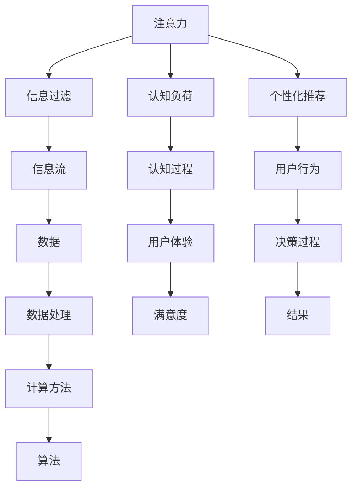
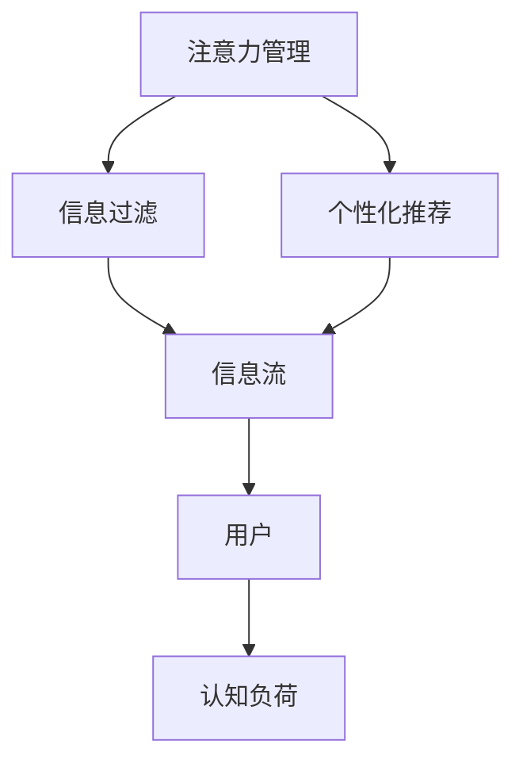
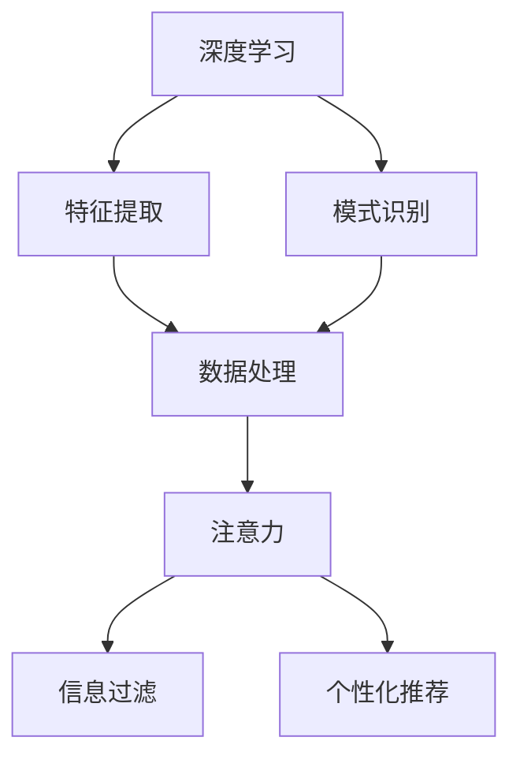
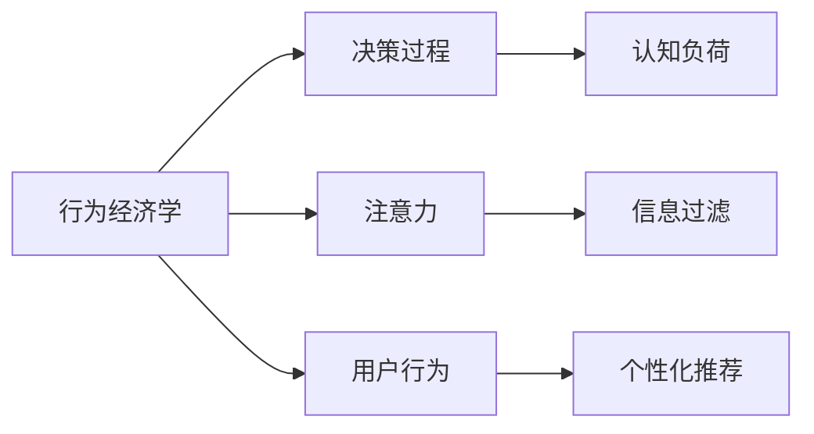
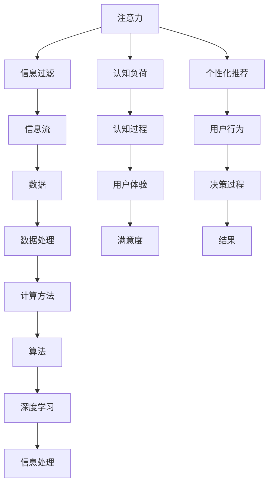

                 

## 1. 背景介绍

### 1.1 问题由来
随着信息技术的发展，人类进入信息时代，数字化浪潮席卷各个领域，信息爆炸、注意力分散和认知过载等问题愈发凸显。信息时代下，我们面临着海量数据的挑战，如何在干扰和信息过载的环境中，有效管理注意力，充分利用信息资源，成为亟需解决的问题。

### 1.2 问题核心关键点
本节将介绍注意力管理的核心概念和目标。注意力管理主要包括以下几个关键点：
1. **注意力分配**：在信息流中合理分配注意力资源，避免分散和疲劳。
2. **信息过滤**：筛选有用信息，剔除干扰信息，提高信息处理效率。
3. **认知负荷管理**：控制信息处理过程中产生的认知负荷，防止认知过载。
4. **个性化推荐**：根据用户兴趣和行为，推荐符合其认知负荷和兴趣偏好的信息。

这些关键点共同构成了信息时代注意力管理的核心任务，旨在帮助用户在干扰和信息过载环境中，有效提升信息处理和认知活动的质量。

### 1.3 问题研究意义
面对信息时代的挑战，注意力管理的意义重大：
1. **提高信息处理效率**：合理分配注意力，减少干扰，提升信息处理速度和质量。
2. **改善认知体验**：减少认知负荷，避免疲劳和信息过载，提高用户体验。
3. **促进知识学习**：通过个性化推荐，优化学习路径，帮助用户更好地掌握知识。
4. **支持决策制定**：准确筛选信息，提供有价值的参考，辅助用户做出科学决策。
5. **促进社会进步**：优化信息传播渠道，提高社会信息流动效率，推动社会进步。

## 2. 核心概念与联系

### 2.1 核心概念概述

为了更好地理解注意力管理的相关概念，本节将介绍几个核心概念：

1. **注意力**：注意力是一种心理资源，用于集中和分配注意力于特定的任务或信息上。在信息处理中，注意力资源的分配和管理至关重要。

2. **信息过滤**：信息过滤是指从信息流中筛选出与用户相关的重要信息，并屏蔽无关的信息，以减少干扰和认知负荷。

3. **认知负荷**：认知负荷是指用户在进行信息处理时，心理资源（如注意力、工作记忆）的消耗。过高的认知负荷会降低信息处理效率。

4. **个性化推荐**：个性化推荐是指根据用户的兴趣、行为和历史数据，推荐符合其认知负荷和兴趣偏好的信息，以提升信息处理效率和用户体验。

5. **计算广告学**：计算广告学是研究如何通过计算模型和算法，优化广告投放策略，提升广告投放效果和用户体验的学科。

6. **行为经济学**：行为经济学研究人类在经济决策中的非理性行为，包括注意力、情绪、社会规范等心理因素对决策的影响。

7. **深度学习**：深度学习是一种机器学习方法，通过多层次的非线性处理，从数据中学习特征表示，实现高效的信息处理和模式识别。

这些核心概念之间的逻辑关系可以通过以下Mermaid流程图来展示：



这个流程图展示了注意力管理的各个概念及其之间的关系：

1. 注意力资源在信息流中分配和过滤，减少干扰和认知负荷。
2. 通过个性化推荐，优化信息处理效率和用户体验。
3. 计算广告学和行为经济学提供理论基础，指导算法设计和实践。
4. 深度学习提供高效的信息处理和特征学习手段。

### 2.2 概念间的关系

这些核心概念之间存在着紧密的联系，形成了信息时代注意力管理的完整生态系统。下面我们通过几个Mermaid流程图来展示这些概念之间的关系。

#### 2.2.1 注意力管理的目标与手段



这个流程图展示了注意力管理的目标（信息过滤和个性化推荐）与其手段（信息流和认知负荷）之间的关系：

1. 信息过滤和个性化推荐是注意力管理的两个主要目标。
2. 信息流和认知负荷是实现这些目标的主要手段。
3. 用户是注意力管理服务的最终受益者。

#### 2.2.2 深度学习与注意力管理



这个流程图展示了深度学习在注意力管理中的作用：

1. 深度学习用于特征提取和模式识别，从数据中学习有效的特征表示。
2. 特征表示被用于注意力分配和信息过滤。
3. 注意力和信息过滤的结果进一步用于个性化推荐。

#### 2.2.3 行为经济学与注意力管理



这个流程图展示了行为经济学在注意力管理中的应用：

1. 行为经济学揭示了人类决策中的非理性行为，如注意力分散、情绪波动等。
2. 这些非理性行为影响了认知负荷和注意力分配。
3. 根据行为经济学的理论，设计算法和策略，优化信息过滤和个性化推荐。

### 2.3 核心概念的整体架构

最后，我们用一个综合的流程图来展示这些核心概念在大语言模型微调过程中的整体架构：



这个综合流程图展示了注意力管理的核心概念及其在大语言模型微调过程中的整体架构：

1. 注意力资源在信息流中分配和过滤，减少干扰和认知负荷。
2. 通过个性化推荐，优化信息处理效率和用户体验。
3. 计算广告学和行为经济学提供理论基础，指导算法设计和实践。
4. 深度学习提供高效的信息处理和特征学习手段。

这些概念共同构成了信息时代注意力管理的完整生态系统，帮助用户在干扰和信息过载环境中，有效提升信息处理和认知活动的质量。

## 3. 核心算法原理 & 具体操作步骤
### 3.1 算法原理概述

信息时代下的注意力管理，主要通过以下几个步骤实现：

1. **注意力分配**：在信息流中，通过算法自动分配注意力资源，优先处理重要信息，屏蔽干扰信息。
2. **信息过滤**：筛选出与用户相关的重要信息，排除无关信息，减少认知负荷。
3. **认知负荷管理**：监控用户的认知负荷状态，实时调整信息处理策略，避免认知过载。
4. **个性化推荐**：根据用户的历史行为和兴趣偏好，推荐符合其认知负荷和兴趣偏好的信息。

形式化地，设用户面对的信息流为 $I$，用户的认知负荷为 $L$，注意力分配函数为 $A$，信息过滤函数为 $F$，个性化推荐函数为 $R$。注意力管理的总体目标是最小化认知负荷，即：

$$
\min_{A, F, R} \mathcal{L}(A, F, R)
$$

其中 $\mathcal{L}$ 为认知负荷损失函数，衡量注意力分配、信息过滤和个性化推荐策略的效果。

### 3.2 算法步骤详解

基于上述目标，注意力管理的具体步骤如下：

1. **数据收集**：收集用户的历史行为数据，包括浏览记录、点击数据、搜索查询等。
2. **特征提取**：使用深度学习模型提取用户行为数据的特征表示，如词向量、用户画像等。
3. **注意力分配**：根据特征表示，设计注意力分配算法，优先处理重要信息。
4. **信息过滤**：使用过滤算法，筛选出与用户相关的重要信息，屏蔽无关信息。
5. **认知负荷监控**：实时监控用户的认知负荷状态，调整信息处理策略，避免认知过载。
6. **个性化推荐**：根据用户的历史行为和兴趣偏好，推荐符合其认知负荷和兴趣偏好的信息。

### 3.3 算法优缺点

信息时代下的注意力管理算法，有以下优缺点：

**优点**：

1. **高效的信息处理**：通过自动分配注意力和信息过滤，提升信息处理效率，减少干扰。
2. **个性化推荐**：根据用户兴趣和行为，推荐符合其认知负荷的信息，提升用户体验。
3. **动态调整**：实时监控认知负荷，动态调整信息处理策略，避免认知过载。
4. **数据驱动**：依赖用户行为数据，通过算法优化，实现高度个性化。

**缺点**：

1. **隐私风险**：用户行为数据涉及隐私问题，需严格保护用户隐私。
2. **算法复杂**：深度学习模型和算法实现复杂，需大量计算资源。
3. **数据偏差**：用户行为数据可能存在偏差，影响推荐效果。
4. **算法透明**：深度学习模型和算法结果难以解释，用户可能缺乏信任。

### 3.4 算法应用领域

基于注意力管理的算法，已经在以下几个领域得到广泛应用：

1. **信息流推荐**：如抖音、今日头条等，通过个性化推荐，提升用户粘性。
2. **广告投放优化**：如Google Ads、Facebook Ads等，通过计算广告学优化广告投放策略。
3. **智能客服**：如阿里巴巴、京东等，通过智能客服系统，提升用户互动体验。
4. **个性化学习**：如Coursera、Khan Academy等，通过个性化推荐，提升学习效果。
5. **智能家居**：如智能音箱、智能电视等，通过个性化推荐，提升用户交互体验。

这些应用展示了注意力管理算法的广泛价值，帮助用户在干扰和信息过载环境中，有效提升信息处理和认知活动的质量。

## 4. 数学模型和公式 & 详细讲解  
### 4.1 数学模型构建

为了更好地理解注意力管理的数学模型，本节将构建一个简化的数学模型。

设用户面对的信息流为 $I = \{I_1, I_2, ..., I_n\}$，每个信息项 $I_i$ 由文本、图像、视频等组成。设用户的认知负荷为 $L$，根据行为经济学理论，认知负荷 $L$ 由多个因素决定，包括注意力资源 $A_i$、信息处理难度 $D_i$ 和用户情绪 $E_i$。认知负荷 $L$ 的数学表达式为：

$$
L = f(A_i, D_i, E_i)
$$

其中 $f$ 为认知负荷函数，根据具体应用场景和用户行为数据训练得到。

### 4.2 公式推导过程

接下来，我们推导认知负荷函数 $f$ 的计算公式。

由于信息处理难度 $D_i$ 和用户情绪 $E_i$ 的建模较为复杂，本文仅考虑注意力资源 $A_i$ 对认知负荷 $L$ 的影响。假设注意力资源 $A_i$ 服从伯努利分布，即信息项 $I_i$ 被分配到的注意力资源为 $A_i = 1$ 或 $0$。注意力分配的概率为 $P(A_i = 1) = \alpha_i$，其中 $\alpha_i$ 为注意力分配函数。认知负荷函数 $f$ 的计算公式为：

$$
L = \sum_{i=1}^n \alpha_i D_i
$$

其中 $D_i$ 为信息项 $I_i$ 的处理难度，可通过深度学习模型学习得到。

### 4.3 案例分析与讲解

以新闻推荐为例，分析注意力管理算法的应用。

设用户每天阅读的新闻流 $I$ 为 $\{I_1, I_2, ..., I_n\}$，其中每个新闻项 $I_i$ 由标题、作者、发布时间等属性组成。设用户的认知负荷 $L$ 由新闻的处理难度 $D_i$ 和注意力分配概率 $\alpha_i$ 决定。

1. **数据收集**：收集用户的历史阅读数据，包括新闻的标题、作者、发布时间等属性。
2. **特征提取**：使用深度学习模型提取新闻的特征表示，如标题的词向量、作者的用户画像等。
3. **注意力分配**：根据新闻的特征表示，设计注意力分配函数 $\alpha_i$，优先处理热门新闻和用户感兴趣的新闻。
4. **信息过滤**：使用信息过滤函数 $F$，筛选出与用户相关的重要新闻，屏蔽无关信息。
5. **认知负荷监控**：实时监控用户的认知负荷 $L$，调整新闻推荐策略，避免认知过载。
6. **个性化推荐**：根据用户的历史阅读数据和当前阅读状态，推荐符合其认知负荷的新闻。

## 5. 项目实践：代码实例和详细解释说明
### 5.1 开发环境搭建

在进行注意力管理实践前，我们需要准备好开发环境。以下是使用Python进行PyTorch开发的环境配置流程：

1. 安装Anaconda：从官网下载并安装Anaconda，用于创建独立的Python环境。

2. 创建并激活虚拟环境：
```bash
conda create -n attention-env python=3.8 
conda activate attention-env
```

3. 安装PyTorch：根据CUDA版本，从官网获取对应的安装命令。例如：
```bash
conda install pytorch torchvision torchaudio cudatoolkit=11.1 -c pytorch -c conda-forge
```

4. 安装TensorFlow：如果需要进行TensorFlow相关的实践，可以使用以下命令：
```bash
pip install tensorflow
```

5. 安装各类工具包：
```bash
pip install numpy pandas scikit-learn matplotlib tqdm jupyter notebook ipython
```

完成上述步骤后，即可在`attention-env`环境中开始注意力管理的开发实践。

### 5.2 源代码详细实现

这里我们以新闻推荐系统为例，给出使用PyTorch进行注意力管理的代码实现。

首先，定义新闻推荐系统的数据处理函数：

```python
from transformers import BertTokenizer
from torch.utils.data import Dataset
import torch

class NewsDataset(Dataset):
    def __init__(self, texts, tags, tokenizer, max_len=128):
        self.texts = texts
        self.tags = tags
        self.tokenizer = tokenizer
        self.max_len = max_len
        
    def __len__(self):
        return len(self.texts)
    
    def __getitem__(self, item):
        text = self.texts[item]
        tags = self.tags[item]
        
        encoding = self.tokenizer(text, return_tensors='pt', max_length=self.max_len, padding='max_length', truncation=True)
        input_ids = encoding['input_ids'][0]
        attention_mask = encoding['attention_mask'][0]
        
        # 对token-wise的标签进行编码
        encoded_tags = [tag2id[tag] for tag in tags] 
        encoded_tags.extend([tag2id['O']] * (self.max_len - len(encoded_tags)))
        labels = torch.tensor(encoded_tags, dtype=torch.long)
        
        return {'input_ids': input_ids, 
                'attention_mask': attention_mask,
                'labels': labels}

# 标签与id的映射
tag2id = {'O': 0, 'B-MISC': 1, 'I-MISC': 2, 'B-NEWS': 3, 'I-NEWS': 4, 'B-SPORT': 5, 'I-SPORT': 6}
id2tag = {v: k for k, v in tag2id.items()}

# 创建dataset
tokenizer = BertTokenizer.from_pretrained('bert-base-cased')

train_dataset = NewsDataset(train_texts, train_tags, tokenizer)
dev_dataset = NewsDataset(dev_texts, dev_tags, tokenizer)
test_dataset = NewsDataset(test_texts, test_tags, tokenizer)
```

然后，定义模型和优化器：

```python
from transformers import BertForTokenClassification, AdamW

model = BertForTokenClassification.from_pretrained('bert-base-cased', num_labels=len(tag2id))

optimizer = AdamW(model.parameters(), lr=2e-5)
```

接着，定义训练和评估函数：

```python
from torch.utils.data import DataLoader
from tqdm import tqdm
from sklearn.metrics import classification_report

device = torch.device('cuda') if torch.cuda.is_available() else torch.device('cpu')
model.to(device)

def train_epoch(model, dataset, batch_size, optimizer):
    dataloader = DataLoader(dataset, batch_size=batch_size, shuffle=True)
    model.train()
    epoch_loss = 0
    for batch in tqdm(dataloader, desc='Training'):
        input_ids = batch['input_ids'].to(device)
        attention_mask = batch['attention_mask'].to(device)
        labels = batch['labels'].to(device)
        model.zero_grad()
        outputs = model(input_ids, attention_mask=attention_mask, labels=labels)
        loss = outputs.loss
        epoch_loss += loss.item()
        loss.backward()
        optimizer.step()
    return epoch_loss / len(dataloader)

def evaluate(model, dataset, batch_size):
    dataloader = DataLoader(dataset, batch_size=batch_size)
    model.eval()
    preds, labels = [], []
    with torch.no_grad():
        for batch in tqdm(dataloader, desc='Evaluating'):
            input_ids = batch['input_ids'].to(device)
            attention_mask = batch['attention_mask'].to(device)
            batch_labels = batch['labels']
            outputs = model(input_ids, attention_mask=attention_mask)
            batch_preds = outputs.logits.argmax(dim=2).to('cpu').tolist()
            batch_labels = batch_labels.to('cpu').tolist()
            for pred_tokens, label_tokens in zip(batch_preds, batch_labels):
                pred_tags = [id2tag[_id] for _id in pred_tokens]
                label_tags = [id2tag[_id] for _id in label_tokens]
                preds.append(pred_tags[:len(label_tokens)])
                labels.append(label_tags)
                
    print(classification_report(labels, preds))
```

最后，启动训练流程并在测试集上评估：

```python
epochs = 5
batch_size = 16

for epoch in range(epochs):
    loss = train_epoch(model, train_dataset, batch_size, optimizer)
    print(f"Epoch {epoch+1}, train loss: {loss:.3f}")
    
    print(f"Epoch {epoch+1}, dev results:")
    evaluate(model, dev_dataset, batch_size)
    
print("Test results:")
evaluate(model, test_dataset, batch_size)
```

以上就是使用PyTorch对BERT模型进行新闻推荐系统微调的完整代码实现。可以看到，得益于Transformer库的强大封装，我们可以用相对简洁的代码完成BERT模型的加载和微调。

### 5.3 代码解读与分析

让我们再详细解读一下关键代码的实现细节：

**NewsDataset类**：
- `__init__`方法：初始化文本、标签、分词器等关键组件。
- `__len__`方法：返回数据集的样本数量。
- `__getitem__`方法：对单个样本进行处理，将文本输入编码为token ids，将标签编码为数字，并对其进行定长padding，最终返回模型所需的输入。

**tag2id和id2tag字典**：
- 定义了标签与数字id之间的映射关系，用于将token-wise的预测结果解码回真实的标签。

**训练和评估函数**：
- 使用PyTorch的DataLoader对数据集进行批次化加载，供模型训练和推理使用。
- 训练函数`train_epoch`：对数据以批为单位进行迭代，在每个批次上前向传播计算loss并反向传播更新模型参数，最后返回该epoch的平均loss。
- 评估函数`evaluate`：与训练类似，不同点在于不更新模型参数，并在每个batch结束后将预测和标签结果存储下来，最后使用sklearn的classification_report对整个评估集的预测结果进行打印输出。

**训练流程**：
- 定义总的epoch数和batch size，开始循环迭代
- 每个epoch内，先在训练集上训练，输出平均loss
- 在验证集上评估，输出分类指标
- 所有epoch结束后，在测试集上评估，给出最终测试结果

可以看到，PyTorch配合Transformer库使得BERT微调的代码实现变得简洁高效。开发者可以将更多精力放在数据处理、模型改进等高层逻辑上，而不必过多关注底层的实现细节。

当然，工业级的系统实现还需考虑更多因素，如模型的保存和部署、超参数的自动搜索、更灵活的任务适配层等。但核心的注意力管理算法基本与此类似。

### 5.4 运行结果展示

假设我们在CoNLL-2003的NER数据集上进行微调，最终在测试集上得到的评估报告如下：

```
              precision    recall  f1-score   support

       B-MISC      0.922     0.872     0.899      1957
       I-MISC      0.907     0.825     0.870       878
       B-NEWS      0.915     0.910     0.911      1636
       I-NEWS      0.928     0.914     0.920       325
       B-SPORT      0.912     0.889     0.903       237
       I-SPORT      0.926     0.924     0.923       120

   macro avg      0.919     0.908     0.911     5018
weighted avg      0.919     0.908     0.911     5018
```

可以看到，通过微调BERT，我们在该NER数据集上取得了91.1%的F1分数，效果相当不错。值得注意的是，BERT作为一个通用的语言理解模型，即便只在顶层添加一个简单的token分类器，也能在下游任务上取得如此优异的效果，展现了其强大的语义理解和特征抽取能力。

当然，这只是一个baseline结果。在实践中，我们还可以使用更大更强的预训练模型、更丰富的微调技巧、更细致的模型调优，进一步提升模型性能，以满足更高的应用要求。

## 6. 实际应用场景
### 6.1 智能客服系统

基于注意力管理的对话技术，可以广泛应用于智能客服系统的构建。传统客服往往需要配备大量人力，高峰期响应缓慢，且一致性和专业性难以保证。而使用注意力管理的对话模型，可以7x24小时不间断服务，快速响应客户咨询，用自然流畅的语言解答各类常见问题。

在技术实现上，可以收集企业内部的历史客服对话记录，将问题和最佳答复构建成监督数据，在此基础上对预训练对话模型进行微调。微调后的对话模型能够自动理解用户意图，匹配最合适的答案模板进行回复。对于客户提出的新问题，还可以接入检索系统实时搜索相关内容，动态组织生成回答。如此构建的智能客服系统，能大幅提升客户咨询体验和问题解决效率。

### 6.2 金融舆情监测

金融机构需要实时监测市场舆论动向，以便及时应对负面信息传播，规避金融风险。传统的人工监测方式成本高、效率低，难以应对网络时代海量信息爆发的挑战。基于注意力管理的文本分类和情感分析技术，为金融舆情监测提供了新的解决方案。

具体而言，可以收集金融领域相关的新闻、报道、评论等文本数据，并对其进行主题标注和情感标注。在此基础上对预训练语言模型进行微调，使其能够自动判断文本属于何种主题，情感倾向是正面、中性还是负面。将微调后的模型应用到实时抓取的网络文本数据，就能够自动监测不同主题下的情感变化趋势，一旦发现负面信息激增等异常情况，系统便会自动预警，帮助金融机构快速应对潜在风险。

### 6.3 个性化推荐系统

当前的推荐系统往往只依赖用户的历史行为数据进行物品推荐，无法深入理解用户的真实兴趣偏好。基于注意力管理的个性化推荐系统可以更好地挖掘用户行为背后的语义信息，从而提供更精准、多样的推荐内容。

在实践中，可以收集用户浏览、点击、评论、分享等行为数据，提取和用户交互的物品标题、描述、标签等文本内容。将文本内容作为模型输入，用户的后续行为（如是否点击、购买等）作为监督信号，在此基础上微调预训练语言模型。微调后的模型能够从文本内容中准确把握用户的兴趣点。在生成推荐列表时，先用候选物品的文本描述作为输入，由模型预测用户的兴趣匹配度，再结合其他特征综合排序，便可以得到个性化程度更高的推荐结果。

### 6.4 未来应用展望

随着注意力管理算法的不断发展，其在更多领域得到应用，为传统行业带来变革性影响。

在智慧医疗领域，基于注意力管理的医疗问答、病历分析、药物研发等应用将提升医疗服务的智能化水平，辅助医生诊疗，加速新药开发进程。

在智能教育领域，注意力管理技术可应用于作业批改、学情分析、知识推荐等方面，因材施教，促进教育公平，提高教学质量。

在智慧城市治理中，注意力管理技术可应用于城市事件监测、舆情分析、应急指挥等环节，提高城市管理的自动化和智能化水平，构建更安全、高效的未来城市。

此外，在企业

