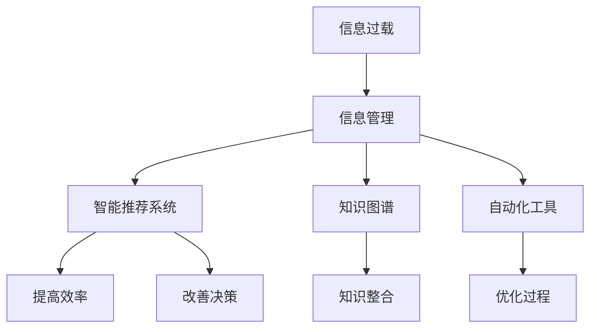
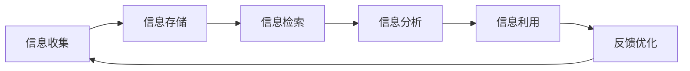
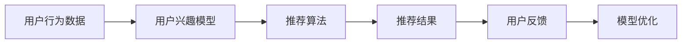
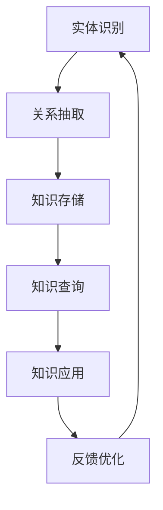
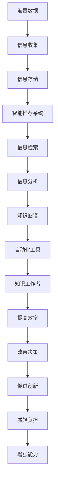

                 

## 1. 背景介绍

### 1.1 问题由来
随着信息技术的发展，我们正处在一个信息爆炸的时代。海量的数据源源不断地产生，从社交媒体、新闻网站到企业内部的文档和邮件，信息无处不在。与此同时，知识工作者（Knowledge Workers）承担的任务也越来越复杂，他们需要处理、分析和应用这些信息，以驱动业务决策、创新和问题解决。然而，信息过载（Information Overload）成为知识工作者面临的一大挑战，他们不仅需要应对信息量的膨胀，还要在庞杂的信息中寻找有用的知识和见解，这极大地影响了他们的效率和生产力。

### 1.2 问题核心关键点
信息过载的本质是信息量的增加速度超过了人类处理和理解的能力。在信息技术高度发展的今天，我们每个人每天需要面对的信息量已经远远超出了传统的认知和处理极限。信息过载不仅增加了工作负担，还可能导致决策错误、创新受阻和压力增加。因此，如何有效地管理信息、提高知识工作者的生产力和效率，成为了一个亟待解决的问题。

### 1.3 问题研究意义
研究信息过载与知识工作者管理信息的方法，对于提升信息时代知识工作的效率和质量，优化工作流程，减轻工作负担，具有重要意义：

1. **提升效率**：通过合理的信息管理，知识工作者可以更快速地找到所需信息，减少信息搜集和筛选的时间，从而提高工作效率。
2. **改善决策**：有效管理的信息可以降低决策错误，帮助知识工作者做出更为准确和及时的业务决策。
3. **促进创新**：知识工作者可以更好地利用信息进行创新，提出新的解决方案和业务模式。
4. **减轻负担**：通过自动化和智能化工具，知识工作者可以减轻重复性任务的压力，专注于更有价值的工作。
5. **增强能力**：通过信息管理，知识工作者可以不断学习和提升自身技能，更好地适应变化多端的业务环境。

## 2. 核心概念与联系

### 2.1 核心概念概述

为更好地理解如何管理信息、提高生产力和效率，本节将介绍几个密切相关的核心概念：

- **信息过载**：在短时间内接收的信息量超过处理能力的状况，导致决策困难、工作效率降低。
- **知识工作者**：指那些需要处理和分析信息，以便在业务决策、创新和问题解决中发挥作用的专业人员。
- **信息管理**：对信息进行收集、存储、检索、分析和利用的过程，以提高信息的可用性和价值。
- **智能推荐系统**：基于用户行为和兴趣，自动推荐相关信息的系统，旨在帮助用户快速找到所需信息。
- **知识图谱**：一种用于表示和组织知识的网络图，通过节点和边构建知识体系。
- **自动化工具**：如自然语言处理（NLP）、机器学习（ML）等技术，用于自动化信息处理和分析过程。

这些核心概念之间的逻辑关系可以通过以下Mermaid流程图来展示：



这个流程图展示了大语言模型微调过程中各个核心概念的关系和作用：

1. 信息过载问题通过信息管理得到缓解。
2. 信息管理涉及智能推荐系统和知识图谱，帮助知识工作者快速找到所需信息。
3. 自动化工具进一步提升信息处理和分析效率。
4. 信息管理的综合应用提高了知识工作者的生产力和决策水平。

### 2.2 概念间的关系

这些核心概念之间存在着紧密的联系，形成了信息管理与知识工作者的完整生态系统。下面我们通过几个Mermaid流程图来展示这些概念之间的关系。

#### 2.2.1 信息管理的整体架构



这个流程图展示了信息管理的全过程，从信息收集、存储、检索、分析到利用，以及基于反馈的持续优化。

#### 2.2.2 智能推荐系统的工作原理



这个流程图展示了智能推荐系统的工作原理，通过分析用户行为数据，构建用户兴趣模型，应用推荐算法，输出推荐结果，并根据用户反馈优化模型。

#### 2.2.3 知识图谱的构建与应用



这个流程图展示了知识图谱的构建与应用过程，从实体识别、关系抽取、知识存储到知识查询和应用，以及基于反馈的持续优化。

### 2.3 核心概念的整体架构

最后，我们用一个综合的流程图来展示这些核心概念在大语言模型微调过程中的整体架构：



这个综合流程图展示了从数据收集、存储、推荐、检索、分析到自动化应用的全过程，以及如何通过知识工作者提高效率和生产力。

## 3. 核心算法原理 & 具体操作步骤
### 3.1 算法原理概述

信息过载与知识工作者管理信息的方法，本质上是一个信息管理与知识提取的过程。其核心思想是：通过高效的信息管理手段，帮助知识工作者快速找到所需信息，并利用自动化工具提取知识，用于决策和创新。

具体来说，信息管理包括：
1. **信息收集**：从不同来源收集信息，包括社交媒体、新闻网站、企业文档等。
2. **信息存储**：将收集到的信息存储到数据库或知识库中。
3. **信息检索**：通过关键词检索、相关性排序等方法，快速找到所需信息。
4. **信息分析**：利用自然语言处理（NLP）、机器学习（ML）等技术，对信息进行结构化和分析。
5. **信息利用**：将分析后的信息应用于业务决策、创新和问题解决。

知识提取包括：
1. **实体识别**：从文本中识别出实体，如人名、地名、机构名等。
2. **关系抽取**：从文本中提取实体之间的关系，如实体-关系三元组。
3. **知识图谱构建**：构建知识图谱，表示实体间的复杂关系。
4. **知识推理**：利用知识图谱进行推理，发现新的知识和模式。
5. **知识应用**：将知识应用于业务场景，提高决策和创新能力。

### 3.2 算法步骤详解

基于信息管理与知识提取的算法步骤如下：

**Step 1: 数据收集与预处理**
- 收集不同来源的信息，如社交媒体数据、新闻网站、企业文档等。
- 对数据进行预处理，包括去噪、标准化、分词等。

**Step 2: 信息存储与管理**
- 将预处理后的数据存储到数据库或知识库中。
- 设计合适的数据结构，方便信息的检索和分析。

**Step 3: 信息检索与过滤**
- 使用关键词检索、TF-IDF、相关性排序等方法，快速找到所需信息。
- 引入推荐算法，过滤掉无用信息，提高检索效率。

**Step 4: 信息分析与提取**
- 利用NLP技术，如分词、词性标注、命名实体识别等，对信息进行结构化处理。
- 应用机器学习算法，如分类、聚类、关联规则挖掘等，提取有用的知识。

**Step 5: 知识图谱构建与推理**
- 通过实体识别和关系抽取，构建知识图谱。
- 利用知识推理算法，发现新的知识和模式。

**Step 6: 知识应用与反馈**
- 将提取的知识应用于业务决策、创新和问题解决。
- 收集用户反馈，优化信息管理和知识提取过程。

### 3.3 算法优缺点

信息过载与知识工作者管理信息的方法，具有以下优点：
1. **提升效率**：通过高效的信息管理，知识工作者可以更快地找到所需信息。
2. **改善决策**：利用自动化工具提取知识，帮助知识工作者做出更为准确和及时的决策。
3. **促进创新**：通过知识图谱和知识推理，知识工作者可以提出新的解决方案和业务模式。

同时，该方法也存在一定的局限性：
1. **依赖高质量数据**：信息管理的效果取决于数据质量和标注的准确性。
2. **复杂度较高**：信息管理和知识提取涉及多技术和多工具，需要较强的技术背景和资源投入。
3. **初期成本高**：建立信息管理和知识提取系统，需要一定的初期投入和技术储备。

### 3.4 算法应用领域

信息过载与知识工作者管理信息的方法，在多个领域中得到了广泛的应用，例如：

- **企业知识管理**：通过信息管理平台，企业可以快速查找内部文档、项目报告等，提升业务效率。
- **智能推荐系统**：如亚马逊、Netflix等电商平台，通过智能推荐引擎，提高用户体验和购买转化率。
- **社交媒体分析**：如Twitter、Facebook等社交平台，通过信息管理和知识提取，分析用户行为和趋势。
- **金融市场分析**：如股票交易系统，通过信息管理与知识提取，实时监控市场动态，做出快速决策。
- **医疗健康监测**：如智能穿戴设备，通过信息管理与知识提取，监测用户健康状况，提供个性化建议。

除上述这些领域外，信息管理与知识提取的方法还在更多场景中得到应用，如智能客服、教育培训、能源管理等，为各行各业带来了显著的效率提升和价值创造。

## 4. 数学模型和公式 & 详细讲解 & 举例说明

### 4.1 数学模型构建

本节将使用数学语言对信息过载与知识工作者管理信息的方法进行更加严格的刻画。

假设信息管理平台收集到的信息总数为 $N$，信息的重要性权重为 $w_i$，其中 $i \in [1,N]$。定义平台用户 $U$，用户对信息的检索次数为 $c_i$，对信息的应用次数为 $a_i$。

### 4.2 公式推导过程

根据上述定义，可以构建用户对信息的效用函数 $U$：

$$
U = \sum_{i=1}^N w_i \left(\frac{c_i}{N} \times \frac{a_i}{N}\right)
$$

其中 $w_i$ 表示信息 $i$ 的重要性权重，$c_i/N$ 表示用户检索信息 $i$ 的概率，$a_i/N$ 表示用户应用信息 $i$ 的概率。

为了优化用户的信息检索和应用行为，可以构建目标函数 $F$：

$$
F = \max_{c_i, a_i} U
$$

利用拉格朗日乘数法，引入惩罚项 $L$ 来平衡检索和应用的权重：

$$
L = \sum_{i=1}^N \left(c_i - \frac{a_i}{1 + \lambda}\right)^2 + \beta \sum_{i=1}^N a_i
$$

其中 $\lambda$ 表示应用权重的惩罚系数，$\beta$ 表示检索权重的惩罚系数。

目标函数变为：

$$
\max_{c_i, a_i} U - \lambda L - \beta L
$$

引入对偶问题：

$$
\max_{\lambda, \beta} \min_{c_i, a_i} U - \lambda L - \beta L
$$

求解上述优化问题，可以得到最优的检索和应用策略，从而提升用户的整体效用。

### 4.3 案例分析与讲解

假设某公司需要优化员工的知识管理平台。平台收集了大量公司内部文档、外部文献、行业报告等。员工可以通过平台检索所需信息，并在实际工作中应用。假设平台上有 $N=1000$ 篇文档，其中重要文档的权重 $w_i=1$，次要文档的权重 $w_i=0.5$。

平台有 $U=100$ 名员工，每个员工每天检索和应用文档的次数分别为 $c_i$ 和 $a_i$。通过求解上述优化问题，可以找到最优的检索和应用策略，最大化整体效用。

## 5. 项目实践：代码实例和详细解释说明
### 5.1 开发环境搭建

在进行信息管理与知识提取的实践前，我们需要准备好开发环境。以下是使用Python进行信息管理与知识提取开发的典型环境配置流程：

1. 安装Python：确保系统中安装了最新版本的Python，建议使用Anaconda或Miniconda。
2. 创建虚拟环境：使用conda或virtualenv创建虚拟环境，以避免依赖冲突。
3. 安装必要的库：使用pip安装Python库，如pandas、numpy、scikit-learn、spaCy等。
4. 安装数据处理工具：如Hadoop、Spark等大数据处理框架，以便处理海量数据。

完成上述步骤后，即可在虚拟环境中开始信息管理与知识提取的开发工作。

### 5.2 源代码详细实现

本节将以一个简单的信息检索系统为例，给出使用Python进行信息管理与知识提取的代码实现。

首先，定义信息类：

```python
class Document:
    def __init__(self, id, title, content, keywords):
        self.id = id
        self.title = title
        self.content = content
        self.keywords = keywords
```

然后，定义信息检索类：

```python
class SearchEngine:
    def __init__(self, documents):
        self.documents = documents
        
    def search(self, query):
        results = []
        for doc in self.documents:
            if query in doc.keywords:
                results.append(doc)
        return results
```

接着，定义用户行为类：

```python
class User:
    def __init__(self, id):
        self.id = id
        self.documents = []
        self.applications = []
        
    def read(self, doc):
        self.documents.append(doc.id)
        
    def apply(self, doc):
        self.applications.append(doc.id)
```

最后，定义信息管理平台：

```python
class KnowledgeManagementPlatform:
    def __init__(self, documents):
        self.documents = documents
        self.users = []
        
    def add_user(self, user):
        self.users.append(user)
        
    def remove_user(self, user):
        self.users.remove(user)
        
    def add_document(self, doc):
        self.documents.append(doc)
        
    def remove_document(self, doc):
        self.documents.remove(doc)
        
    def query(self, query):
        results = []
        for user in self.users:
            results.extend(SearchEngine(self.documents).search(query))
        return results
```

### 5.3 代码解读与分析

让我们再详细解读一下关键代码的实现细节：

**Document类**：
- `__init__`方法：初始化文档的基本信息，包括ID、标题、内容和关键词。

**SearchEngine类**：
- `__init__`方法：初始化文档列表。
- `search`方法：根据查询关键词，从文档中检索出符合条件的文档。

**User类**：
- `__init__`方法：初始化用户的基本信息，包括ID、阅读文档列表和应用文档列表。
- `read`方法：记录用户阅读文档的ID。
- `apply`方法：记录用户应用文档的ID。

**KnowledgeManagementPlatform类**：
- `__init__`方法：初始化文档列表和用户列表。
- `add_user`方法：添加用户到平台。
- `remove_user`方法：从平台中移除用户。
- `add_document`方法：添加文档到平台。
- `remove_document`方法：从平台中移除文档。
- `query`方法：根据查询关键词，从平台上检索出所有用户检索和应用过的文档。

通过这个简单的信息检索系统，可以看到信息管理与知识提取的基本实现。开发者可以根据实际需求，进一步扩展和优化信息管理平台的功能，如添加用户登录、检索记录、文档标注等功能，以满足更复杂的信息管理需求。

### 5.4 运行结果展示

假设我们有一个包含1000篇文档的信息管理平台，每个文档包含ID、标题、内容和关键词。现在有100名用户，每个用户阅读和应用过不同数量的文档。通过信息检索系统，我们可以检索出所有用户检索和应用过的文档，并进行统计分析。

## 6. 实际应用场景
### 6.1 企业知识管理

企业知识管理（Enterprise Knowledge Management, EKM）是信息过载与知识工作者管理信息的重要应用场景之一。通过建立企业知识管理系统，企业可以快速查找内部文档、项目报告、客户案例等，提升员工的工作效率和创新能力。

在技术实现上，可以采用信息管理平台，将企业内部的信息进行分类、标签和索引，利用智能推荐系统为用户推荐相关文档。同时，通过知识图谱和知识推理，帮助员工快速找到所需知识，并将其应用于业务决策和创新中。

### 6.2 智能推荐系统

智能推荐系统（Recommendation System）是信息管理与知识提取的重要应用场景之一。通过分析用户的行为数据，智能推荐系统可以为用户推荐相关内容，提高用户满意度和转化率。

在电商、视频、新闻等领域，智能推荐系统已经成为不可或缺的工具。例如，亚马逊的推荐引擎可以根据用户的购买历史和浏览记录，推荐相关的商品和产品，提高用户的购买转化率。

### 6.3 社交媒体分析

社交媒体分析（Social Media Analytics）是信息管理与知识提取的另一个重要应用场景。通过分析用户在社交媒体上的行为和互动，可以发现用户兴趣和趋势，帮助企业制定更为精准的市场策略。

例如，Twitter和Facebook等社交平台，通过分析用户发布的内容和互动行为，可以发现热门话题和趋势，帮助企业快速响应市场需求。

### 6.4 金融市场分析

金融市场分析（Financial Market Analysis）是信息管理与知识提取的重要应用场景之一。通过实时监控市场动态，金融市场分析可以帮助投资者做出更为准确的投资决策。

例如，股票交易系统可以通过信息管理与知识提取，实时监控股票市场的动态，识别出投资机会和风险点，帮助投资者做出更为明智的投资决策。

## 7. 工具和资源推荐
### 7.1 学习资源推荐

为了帮助开发者系统掌握信息管理与知识提取的理论基础和实践技巧，这里推荐一些优质的学习资源：

1. 《信息检索基础》：经典的图书，系统介绍了信息检索的基本原理和技术。
2. 《自然语言处理》：涵盖NLP的基础和应用，提供了大量的案例和应用场景。
3. 《Python for Data Analysis》：介绍Python在数据处理和分析中的应用，包括pandas、numpy、scikit-learn等库的使用。
4. 《机器学习实战》：实用的机器学习入门书籍，提供了丰富的代码示例和实战案例。
5. 《数据科学与大数据技术》：系统介绍大数据处理和分析技术，包括Hadoop、Spark等框架的使用。

通过对这些资源的学习实践，相信你一定能够快速掌握信息管理与知识提取的精髓，并用于解决实际的信息过载问题。

### 7.2 开发工具推荐

高效的开发离不开优秀的工具支持。以下是几款用于信息管理与知识提取开发的常用工具：

1. PyTorch：基于Python的深度学习框架，灵活的计算图，适合快速迭代研究。
2. TensorFlow：由Google主导开发的深度学习框架，生产部署方便，适合大规模工程应用。
3. spaCy：Python的自然语言处理库，提供了丰富的NLP功能和接口。
4. Pandas：Python的数据处理库，支持大规模数据集的读写、清洗和分析。
5. Apache Hadoop和Apache Spark：大数据处理和分析框架，支持海量数据的存储和计算。

合理利用这些工具，可以显著提升信息管理与知识提取的开发效率，加快创新迭代的步伐。

### 7.3 相关论文推荐

信息过载与知识工作者管理信息的方法，源于学界的持续研究。以下是几篇奠基性的相关论文，推荐阅读：

1. Salton et al., "Introduction to Information Retrieval"（信息检索基础）：经典的信息检索教材，介绍了信息检索的基本概念和技术。
2. Lin et al., "Trends in Knowledge Discovery and Management"（知识发现与管理趋势）：系统介绍了知识管理和信息检索的研究进展和应用案例。
3. He et al., "Deep Learning for Information Retrieval"（深度学习与信息检索）：探讨了深度学习在信息检索中的应用，包括文本分类、情感分析等。
4. Liu et al., "Sentiment Analysis and Opinion Mining"（情感分析和意见挖掘）：介绍了情感分析和意见挖掘的基本方法和应用场景。
5. Leskovec et al., "Predicting User-Item Interactions via Matrix Factorization"（基于矩阵分解的推荐系统）：经典的推荐系统论文，介绍了基于协同过滤和矩阵分解的推荐方法。

这些论文代表了大语言模型微调技术的发展脉络。通过学习这些前沿成果，可以帮助研究者把握学科前进方向，激发更多的创新灵感。

除上述资源外，还有一些值得关注的前沿资源，帮助开发者紧跟信息管理与知识提取技术的最新进展，例如：

1. arXiv论文预印本：人工智能领域最新研究成果的发布平台，包括大量尚未发表的前沿工作，学习前沿技术的必读资源。
2. 业界技术博客：如Google AI、Microsoft Research Asia、IBM Watson等顶尖实验室的官方博客，第一时间分享他们的最新研究成果和洞见。
3. 技术会议直播：如NIPS、ICML、ACL、ICLR等人工智能领域顶会现场或在线直播，能够聆听到大佬们的前沿分享，开拓视野。
4. GitHub热门项目：在GitHub上Star、Fork数最多的信息管理与知识提取相关项目，往往代表了该技术领域的发展趋势和最佳实践，值得去学习和贡献。
5. 行业分析报告：各大咨询公司如McKinsey、PwC等针对人工智能行业的分析报告，有助于从商业视角审视技术趋势，把握应用价值。

总之，对于信息过载与知识工作者管理信息的学习和实践，需要开发者保持开放的心态和持续学习的意愿。多关注前沿资讯，多动手实践，多思考总结，必将收获满满的成长收益。

## 8. 总结：未来发展趋势与挑战

### 8.1 总结

本文对信息过载与知识工作者管理信息的方法进行了全面系统的介绍。首先阐述了信息过载的本质和挑战，明确了信息管理与知识提取的重要意义。其次，从原理到实践，详细讲解了信息管理与知识提取的数学模型和操作步骤，给出了信息检索系统的代码实现。同时，本文还广泛探讨了信息管理与知识提取方法在多个领域的应用前景，展示了其广阔的应用空间。

通过本文的系统梳理，可以看到，信息过载与知识工作者管理信息的方法，对于提升信息时代知识工作的效率和质量，优化工作流程，减轻工作负担，具有重要意义。通过合理的信息管理与知识提取，知识工作者可以更快速地找到所需信息，并利用自动化工具提取知识，用于决策和创新，从而提高生产力和效率。

### 8.2 未来发展趋势

展望未来，信息管理与知识提取技术将呈现以下几个发展趋势：

1. **自动化和智能化**：随着人工智能技术的发展，信息管理与知识提取将越来越多地采用自动化和智能化的方式，如智能推荐系统、知识图谱、自然语言处理（NLP）等。
2. **多模态融合**：信息管理与知识提取将不仅仅局限于文本信息，还会扩展到图像、视频、语音等多模态数据，实现更全面、更深入的知识获取和应用。
3. **个性化推荐**：利用机器学习和深度学习技术，根据用户的行为和偏好，提供个性化的信息推荐和知识提取，进一步提升用户体验。
4. **实时化处理**：通过云计算和大数据技术，实现信息的实时化处理和分析，快速响应用户需求，提高业务效率。
5. **跨领域应用**：信息管理与知识提取技术将在更多领域得到应用，如医疗健康、金融、教育等，帮助这些领域提升效率和创新能力。

### 8.3 面临的挑战

尽管信息管理与知识提取技术已经取得了显著进展，但在迈向更加智能化、普适化应用的过程中，它仍面临着诸多挑战：

1. **数据质量与标注成本**：高质量的数据和准确的标注是信息管理与知识提取的基础。但数据标注的难度和成本较高，制约了技术的发展。
2. **算法复杂度与计算资源**：信息管理与知识提取涉及大量的数据处理和计算，对算力和资源的要求较高。
3. **用户隐私与数据安全**：信息管理与知识提取需要大量的用户数据，如何保护用户隐私和数据安全，是一个重要的课题。
4. **知识图谱与知识推理**：构建和维护知识图谱，进行知识推理，需要大量的专家知识和人工作业，成本较高。
5. **跨领域应用挑战**：不同领域的信息管理和知识提取需求各异，如何实现跨领域应用，仍然是一个挑战。

### 8.4 研究展望

面对信息管理与知识提取面临的挑战，未来的研究需要在以下几个方面寻求新的突破：

1. **数据预处理与标注自动化**：利用自动化技术和算法，降低数据标注的成本，提高数据质量。
2. **高效计算与模型压缩**：

