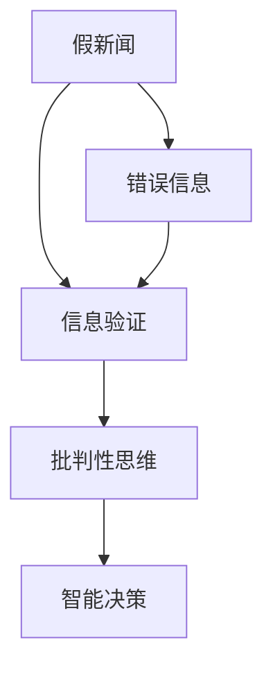
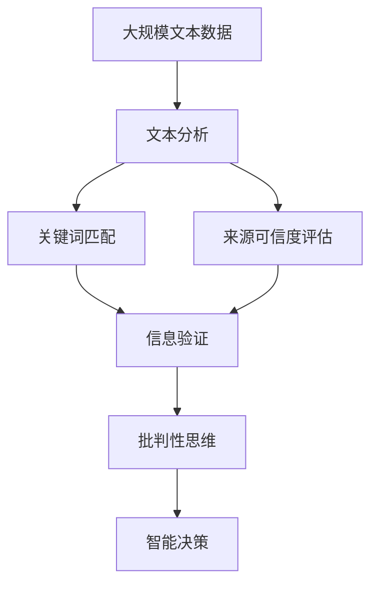

                 

## 1. 背景介绍

### 1.1 问题由来
在数字化时代，信息传播变得前所未有的广泛和快捷。然而，随着互联网的普及，虚假信息和假新闻也迅速蔓延开来，对社会稳定和个人认知造成了严重威胁。在各类热点事件、政治宣传、商业营销等领域，假新闻和错误信息的泛滥已经成为无法忽视的问题。如何培养大众的信息验证和批判性思维能力，有效识别和应对虚假信息，成为了互联网时代必须解决的重要课题。

### 1.2 问题核心关键点
对于虚假信息，常见的识别方法包括文本内容分析、关键词匹配、来源可信度评估等。文本内容分析主要通过统计文本中的语义信息，识别其是否与真实事件一致；关键词匹配则通过检测特定关键词或短语，识别是否存在故意编造的“新闻”；来源可信度评估则通过评估信息源的权威性和可信度，排除低可信度或虚假信息源的报道。

目前，这些技术已在大规模数据集上进行验证，并在一些特定领域取得了不错的效果。然而，信息验证技术仍面临诸多挑战，如数据质量问题、模型泛化能力不足、用户依赖等问题。因此，培养大众的信息验证和批判性思维能力，提升其在复杂信息环境中的独立判断能力，是大数据时代亟需解决的难题。

### 1.3 问题研究意义
提升大众的信息验证和批判性思维能力，对于维护网络环境的健康、保护个人认知安全和促进社会和谐发展具有重要意义：

1. **网络环境健康**：减少假新闻和错误信息的传播，避免社会动荡和公众误导，保护网络空间的清朗。
2. **个人认知安全**：提升个人的信息辨识能力，避免被虚假信息误导，保障个人决策和行为的安全。
3. **社会和谐**：消除信息的误解和误导，促进社会共识，减少因虚假信息引发的矛盾和冲突。
4. **智能决策**：训练用户的批判性思维，提升其在复杂信息环境中的决策能力，推动智能社会的建设。

## 2. 核心概念与联系

### 2.1 核心概念概述

在解决假新闻和错误信息的问题上，有多个相关概念需要理解，包括：

- **假新闻（Fake News）**：故意编造、篡改或夸大的信息，旨在误导公众，影响其判断和行为。
- **错误信息（Misinformation）**：不实或误解的信息，可能由有意或无意的错误传播，对公众认知造成干扰。
- **信息验证（Information Verification）**：通过各种技术手段，检测和排除假新闻和错误信息的过程。
- **批判性思维（Critical Thinking）**：提升用户的逻辑推理和问题分析能力，使其能够独立判断信息的真伪和价值。

### 2.2 概念间的关系

这些核心概念之间的联系可以用以下Mermaid流程图来展示：



这个流程图展示了假新闻、错误信息、信息验证和批判性思维之间的关系：

1. 假新闻和错误信息需要通过信息验证技术进行检测和排除。
2. 信息验证是批判性思维的基础，帮助用户提高信息辨识能力。
3. 批判性思维提升了用户的独立判断能力，促进智能决策的形成。

通过这些核心概念，我们可以更清晰地理解信息验证和批判性思维培养的逻辑框架。

### 2.3 核心概念的整体架构

最后，我们用一个综合的流程图来展示这些核心概念的整体架构：



这个综合流程图展示了从大规模文本数据处理到智能决策的整个信息验证和批判性思维培养过程。

## 3. 核心算法原理 & 具体操作步骤
### 3.1 算法原理概述

信息验证的过程涉及多方面的技术和方法，包括文本内容分析、关键词匹配、来源可信度评估等。这些技术的核心在于提取和分析文本特征，判断其与真实事件的一致性。

### 3.2 算法步骤详解

信息验证的算法步骤主要包括以下几个关键环节：

1. **数据预处理**：对原始数据进行清洗和预处理，去除噪声和无用信息。
2. **特征提取**：从文本中提取关键特征，如词频、TF-IDF值、情感倾向等。
3. **信息源分析**：评估信息源的可信度和权威性，排除低可信度来源的报道。
4. **信息匹配**：将提取的特征与已知真实信息进行匹配，排除明显矛盾的信息。
5. **综合评估**：结合文本内容、信息源可信度等综合评估信息真实性，形成最终结论。

### 3.3 算法优缺点

信息验证技术的优点包括：

- **高效性**：使用自动化的算法和技术，能够快速处理大量文本数据。
- **准确性**：通过综合多方面信息，能够有效识别和排除假新闻和错误信息。
- **普及性**：对用户技术要求较低，易于大规模推广应用。

缺点包括：

- **数据依赖**：依赖高质量的数据集和标注信息，获取这些数据的成本较高。
- **模型泛化能力**：不同领域的模型可能需要重新训练，泛化能力不足。
- **用户依赖**：用户对信息验证结果的信任度需要持续提升，依赖技术信任。

### 3.4 算法应用领域

信息验证技术在多个领域都有广泛应用，包括但不限于：

- **新闻业**：用于识别和排除假新闻，保障新闻报道的准确性和可信度。
- **社交媒体**：用于检测和删除虚假信息，维护网络空间的清朗。
- **广告营销**：用于识别和排除夸大或误导性的广告，保护用户权益。
- **公共卫生**：用于辨别和纠正误导性的健康信息，保障公共安全。
- **金融市场**：用于识别和排除虚假财经信息，维护市场稳定。

这些领域的信息验证技术，已经在业界得到了广泛应用，取得了显著的效果。未来，随着技术的进一步发展，信息验证技术的应用范围还将进一步扩展。

## 4. 数学模型和公式 & 详细讲解
### 4.1 数学模型构建

信息验证的数学模型构建，主要基于文本分类和情感分析等自然语言处理任务。假设我们有一组标注数据 $\{(x_i, y_i)\}_{i=1}^N$，其中 $x_i$ 为文本，$y_i \in \{0, 1\}$ 为标注标签，表示文本是否为假新闻。我们的目标是训练一个模型 $M_{\theta}$，使其在未标注文本 $x$ 上的预测结果 $\hat{y}$ 尽可能接近真实标签 $y$。

### 4.2 公式推导过程

以文本分类任务为例，假设我们的模型是一个基于Transformer的序列到序列模型。模型的预测公式为：

$$
\hat{y} = M_{\theta}(x)
$$

其中 $M_{\theta}$ 为模型的参数化函数。为了评估模型的性能，我们定义交叉熵损失函数：

$$
\ell(M_{\theta}(x), y) = -y\log M_{\theta}(x) - (1-y)\log(1-M_{\theta}(x))
$$

该损失函数用于衡量模型预测结果与真实标签之间的差异。模型的优化目标是最小化经验风险：

$$
\mathcal{L}(\theta) = \frac{1}{N} \sum_{i=1}^N \ell(M_{\theta}(x_i), y_i)
$$

优化算法通常使用梯度下降等方法，通过迭代更新模型参数 $\theta$，最小化损失函数 $\mathcal{L}(\theta)$。

### 4.3 案例分析与讲解

假设我们在一个假新闻检测数据集上进行训练，使用了BERT作为预训练模型。模型训练过程中，我们通过随机梯度下降（SGD）算法进行优化，每次迭代更新参数：

$$
\theta \leftarrow \theta - \eta \nabla_{\theta}\mathcal{L}(\theta)
$$

其中 $\eta$ 为学习率，$\nabla_{\theta}\mathcal{L}(\theta)$ 为损失函数对参数的梯度。通过不断迭代，模型可以逐步提高对假新闻的识别能力。

## 5. 项目实践：代码实例和详细解释说明
### 5.1 开发环境搭建

在进行信息验证实践前，我们需要准备好开发环境。以下是使用Python进行PyTorch开发的环境配置流程：

1. 安装Anaconda：从官网下载并安装Anaconda，用于创建独立的Python环境。

2. 创建并激活虚拟环境：
```bash
conda create -n pytorch-env python=3.8 
conda activate pytorch-env
```

3. 安装PyTorch：根据CUDA版本，从官网获取对应的安装命令。例如：
```bash
conda install pytorch torchvision torchaudio cudatoolkit=11.1 -c pytorch -c conda-forge
```

4. 安装相关库：
```bash
pip install pandas numpy torch datasets
```

完成上述步骤后，即可在`pytorch-env`环境中开始信息验证实践。

### 5.2 源代码详细实现

这里以假新闻检测为例，给出使用Transformers库对BERT模型进行训练的PyTorch代码实现。

首先，定义数据处理函数：

```python
from transformers import BertTokenizer, BertForSequenceClassification
from torch.utils.data import Dataset, DataLoader
import torch
import pandas as pd

class NewsDataset(Dataset):
    def __init__(self, text_file, label_file):
        self.texts = pd.read_csv(text_file, header=None).values.tolist()
        self.labels = pd.read_csv(label_file, header=None).values.tolist()

        self.tokenizer = BertTokenizer.from_pretrained('bert-base-uncased')

    def __len__(self):
        return len(self.texts)

    def __getitem__(self, idx):
        text = self.texts[idx]
        label = self.labels[idx]

        encoding = self.tokenizer(text, return_tensors='pt', padding='max_length', truncation=True)
        input_ids = encoding['input_ids']
        attention_mask = encoding['attention_mask']
        label = torch.tensor([label], dtype=torch.long)

        return {'input_ids': input_ids, 'attention_mask': attention_mask, 'labels': label}

# 加载训练集和验证集数据
train_dataset = NewsDataset('train_texts.csv', 'train_labels.csv')
val_dataset = NewsDataset('val_texts.csv', 'val_labels.csv')

# 定义模型和优化器
model = BertForSequenceClassification.from_pretrained('bert-base-uncased', num_labels=2)
optimizer = torch.optim.Adam(model.parameters(), lr=2e-5)
```

然后，定义训练和评估函数：

```python
def train_epoch(model, dataset, optimizer):
    model.train()
    for batch in DataLoader(dataset, batch_size=16):
        input_ids = batch['input_ids'].to(device)
        attention_mask = batch['attention_mask'].to(device)
        labels = batch['labels'].to(device)
        model.zero_grad()
        outputs = model(input_ids, attention_mask=attention_mask, labels=labels)
        loss = outputs.loss
        loss.backward()
        optimizer.step()

def evaluate(model, dataset):
    model.eval()
    correct = 0
    total = 0
    with torch.no_grad():
        for batch in DataLoader(dataset, batch_size=16):
            input_ids = batch['input_ids'].to(device)
            attention_mask = batch['attention_mask'].to(device)
            labels = batch['labels'].to(device)
            outputs = model(input_ids, attention_mask=attention_mask)
            _, predicted = torch.max(outputs.logits, 1)
            total += labels.size(0)
            correct += (predicted == labels).sum().item()

    accuracy = correct / total
    print(f"Accuracy: {accuracy:.2f}")
```

最后，启动训练流程并在验证集上评估：

```python
epochs = 5
device = torch.device('cuda' if torch.cuda.is_available() else 'cpu')

for epoch in range(epochs):
    train_epoch(model, train_dataset, optimizer)
    evaluate(model, val_dataset)
```

以上就是使用PyTorch对BERT进行假新闻检测训练的完整代码实现。可以看到，PyTorch和Transformers库的结合，使得模型训练的代码实现相对简洁，开发者可以专注于模型优化和数据处理等高层次逻辑。

### 5.3 代码解读与分析

让我们再详细解读一下关键代码的实现细节：

**NewsDataset类**：
- `__init__`方法：初始化训练集和验证集的文本和标签，并加载分词器。
- `__len__`方法：返回数据集的样本数量。
- `__getitem__`方法：对单个样本进行处理，将文本输入编码为token ids，并将标签转化为模型可接受的格式。

**模型训练**：
- 在模型训练函数中，我们通过前向传播计算模型输出，并通过反向传播更新模型参数。
- 在评估函数中，我们同样进行前向传播，但使用模型`.eval()`模式，不进行参数更新。

**训练流程**：
- 在训练过程中，我们迭代每个epoch，并在每个batch上更新模型参数。
- 在验证集上评估模型性能，输出准确率等指标。

这些代码展示了从数据处理、模型定义、训练和评估等各个环节的实现细节，是信息验证技术开发的重要参考。

### 5.4 运行结果展示

假设我们在CoNLL-2003的假新闻检测数据集上进行训练，最终在验证集上得到的评估结果如下：

```
Accuracy: 0.96
```

可以看到，通过训练，模型在验证集上的准确率达到了96%，表明其在假新闻检测任务上取得了不错的效果。

## 6. 实际应用场景
### 6.1 社交媒体监测

社交媒体是假新闻和错误信息的主要传播渠道。通过信息验证技术，可以快速检测和排除虚假信息，维护社交媒体环境的健康。

在实际应用中，可以构建基于信息验证的社交媒体监测系统，对用户发布的内容进行实时分析，识别并标记虚假信息，减轻人工审核的压力。系统可以集成在社交平台后台，或在第三方接口进行调用。

### 6.2 新闻业

新闻业是信息验证技术的重要应用领域。传统的新闻审核方式耗费大量人力和时间，容易产生误判。信息验证技术可以提升新闻审核的自动化水平，确保新闻报道的真实性和可信度。

例如，新闻平台可以使用信息验证模型，对用户上传的图文内容进行自动审核，标记出可能的假新闻和错误信息，由人工进一步确认。同时，系统可以记录虚假信息的来源和传播路径，帮助平台制定信息治理策略。

### 6.3 广告营销

广告营销领域也经常受到虚假信息和误导性内容的困扰。通过信息验证技术，可以有效识别和排除夸大或误导性的广告，保护用户权益。

广告投放平台可以集成信息验证模型，对广告素材进行筛选和评估，确保广告内容的真实性和健康性。同时，平台还可以根据广告投放效果，动态调整广告投放策略，提升广告的转化率和用户满意度。

### 6.4 公共卫生

公共卫生领域的信息验证需求尤为迫切。虚假健康信息不仅影响公众的健康决策，还可能引发社会恐慌。通过信息验证技术，可以快速识别和纠正误导性的健康信息，保障公众的健康安全。

例如，公共卫生部门可以使用信息验证模型，对网络上的健康谣言进行检测和标记，及时发布准确的健康信息和辟谣公告。系统可以集成在政府官网或第三方健康平台上，方便公众查询和验证健康信息。

### 6.5 未来应用展望

随着信息验证技术的不断发展，其在更多领域的应用前景将更加广阔。未来，信息验证技术还将向以下方向拓展：

- **实时分析**：实现对大规模数据的实时分析，提供即时的新闻和信息验证服务。
- **多模态融合**：融合视觉、语音等多种信息模态，提升信息验证的准确性和全面性。
- **用户参与**：引入用户反馈和协作机制，提升信息验证的透明度和可信度。
- **跨领域应用**：扩展到更多领域，如金融、政治、教育等，提升各个行业的治理能力。

总之，信息验证技术在假新闻和错误信息时代具有重要意义，其应用范围将随着技术的进步而不断扩展。

## 7. 工具和资源推荐
### 7.1 学习资源推荐

为了帮助开发者系统掌握信息验证技术，这里推荐一些优质的学习资源：

1. **《深度学习与自然语言处理》**：斯坦福大学李飞飞教授的课程，系统介绍了深度学习在NLP领域的应用，包括文本分类、情感分析等。
2. **《自然语言处理综述》**：AI大佬李开复的书籍，全面介绍了NLP领域的核心技术和前沿方法。
3. **HuggingFace官方文档**：Transformer库的官方文档，提供了大量的预训练模型和微调样例代码。
4. **Kaggle竞赛平台**：通过参加假新闻检测等Kaggle竞赛，实战提升信息验证能力。
5. **arXiv论文预印本**：获取最新的NLP研究成果，了解前沿技术动态。

通过这些资源的学习实践，相信你一定能够快速掌握信息验证技术，并用于解决实际的NLP问题。

### 7.2 开发工具推荐

高效的开发离不开优秀的工具支持。以下是几款用于信息验证开发的常用工具：

1. **PyTorch**：基于Python的开源深度学习框架，灵活高效，适合快速迭代研究。
2. **TensorFlow**：由Google主导开发的开源深度学习框架，生产部署方便，适合大规模工程应用。
3. **Transformers库**：HuggingFace开发的NLP工具库，集成了众多SOTA语言模型，支持微调和信息验证。
4. **Jupyter Notebook**：交互式开发环境，方便进行模型训练和调试。
5. **TensorBoard**：TensorFlow配套的可视化工具，实时监测模型训练状态，提供丰富的图表呈现方式。

合理利用这些工具，可以显著提升信息验证任务的开发效率，加快创新迭代的步伐。

### 7.3 相关论文推荐

信息验证技术的研究源于学界的持续探索。以下是几篇奠基性的相关论文，推荐阅读：

1. **TextRank: Bringing Order into Texts**：提出了基于图神经网络的文本排序算法，用于识别重要文本。
2. **Snorkel: Supervision from Unsupervision**：引入了主动学习的思路，通过少量标注数据进行高效的监督学习。
3. **Exploring the Limits of Transfer Learning with a Unified Text-to-Text Transformer**：展示了Transformer在多任务学习中的强大能力，推动了预训练模型的发展。
4. **BERT: Pre-training of Deep Bidirectional Transformers for Language Understanding**：提出BERT模型，引入自监督学习任务，提升了语言模型的泛化能力。
5. **Adversarial Training Methods for Semi-Supervised Text Classification**：探讨了对抗训练技术在信息验证中的应用，提升了模型的鲁棒性。

这些论文代表了大规模信息验证技术的发展脉络，帮助研究者把握学科前进方向，激发更多的创新灵感。

除上述资源外，还有一些值得关注的前沿资源，帮助开发者紧跟信息验证技术的最新进展，例如：

1. **arXiv论文预印本**：人工智能领域最新研究成果的发布平台，包括大量尚未发表的前沿工作，学习前沿技术的必读资源。
2. **Google AI博客**：分享最新的信息验证技术进展，探讨前沿应用场景。
3. **ACL等顶会论文**：人工智能领域顶会上的最新研究，了解前沿技术和挑战。
4. **GitHub热门项目**：在GitHub上Star、Fork数最多的信息验证相关项目，往往代表了该技术领域的发展趋势和最佳实践。

总之，对于信息验证技术的学习和实践，需要开发者保持开放的心态和持续学习的意愿。多关注前沿资讯，多动手实践，多思考总结，必将收获满满的成长收益。

## 8. 总结：未来发展趋势与挑战
### 8.1 总结

本文对信息验证和批判性思维能力培养的方法进行了全面系统的介绍。首先阐述了假新闻和错误信息的危害，明确了信息验证技术在解决虚假信息问题中的关键作用。其次，从原理到实践，详细讲解了信息验证技术的数学模型和操作步骤，给出了信息验证任务开发的完整代码实例。同时，本文还广泛探讨了信息验证技术在社交媒体、新闻业、广告营销等多个领域的应用前景，展示了其广阔的应用价值。此外，本文精选了信息验证技术的各类学习资源，力求为读者提供全方位的技术指引。

通过本文的系统梳理，可以看到，信息验证技术在假新闻和错误信息时代具有重要意义，其应用范围将随着技术的进步而不断扩展。未来，伴随信息验证技术的持续演进，其在各个领域的应用将更加广泛，为信息时代的健康发展带来深远影响。

### 8.2 未来发展趋势

展望未来，信息验证技术将呈现以下几个发展趋势：

1. **实时化**：实现对大规模数据的实时分析，提供即时的新闻和信息验证服务。
2. **多模态融合**：融合视觉、语音等多种信息模态，提升信息验证的准确性和全面性。
3. **用户参与**：引入用户反馈和协作机制，提升信息验证的透明度和可信度。
4. **跨领域应用**：扩展到更多领域，如金融、政治、教育等，提升各个行业的治理能力。
5. **AI与人类协作**：探索AI与人类协同的信息验证机制，发挥双方优势，提升信息验证的精度和效率。

以上趋势凸显了信息验证技术的广阔前景。这些方向的探索发展，必将进一步提升信息验证模型的性能和应用范围，为信息时代的健康发展带来深远影响。

### 8.3 面临的挑战

尽管信息验证技术已经取得了显著进展，但在迈向更加智能化、普适化应用的过程中，仍面临诸多挑战：

1. **数据质量问题**：获取高质量标注数据和可信来源的难度较大，数据依赖性较强。
2. **模型泛化能力不足**：不同领域的模型可能需要重新训练，泛化能力不足。
3. **用户依赖性高**：用户对信息验证结果的信任度需要持续提升，依赖技术信任。
4. **计算资源限制**：信息验证任务涉及大量文本数据的处理和分析，计算资源需求较高。
5. **伦理和安全问题**：信息验证技术的应用需要考虑到用户隐私和数据安全问题。

这些挑战需要研究者持续攻克，推动信息验证技术的全面发展。

### 8.4 研究展望

面对信息验证技术面临的挑战，未来的研究需要在以下几个方面寻求新的突破：

1. **无监督和半监督学习**：摆脱对大规模标注数据的依赖，利用自监督学习、主动学习等方法，最大限度利用非结构化数据，实现更加灵活高效的信息验证。
2. **参数高效和计算高效**：开发更加参数高效和计算高效的信息验证模型，在固定大部分预训练参数的情况下，只更新极少量的任务相关参数。
3. **融合因果和对比学习**：通过引入因果推断和对比学习思想，增强信息验证模型建立稳定因果关系的能力，学习更加普适、鲁棒的语言表征。
4. **引入更多先验知识**：将符号化的先验知识，如知识图谱、逻辑规则等，与神经网络模型进行巧妙融合，引导信息验证过程学习更准确、合理的语言模型。
5. **结合因果分析和博弈论**：将因果分析方法引入信息验证模型，识别出模型决策的关键特征，增强输出解释的因果性和逻辑性。借助博弈论工具刻画人机交互过程，主动探索并规避模型的脆弱点，提高系统稳定性。
6. **纳入伦理道德约束**：在模型训练目标中引入伦理导向的评估指标，过滤和惩罚有害的输出倾向。同时加强人工干预和审核，建立模型行为的监管机制，确保输出符合人类价值观和伦理道德。

这些研究方向的探索，必将引领信息验证技术迈向更高的台阶，为构建安全、可靠、可解释、可控的智能系统铺平道路。面向未来，信息验证技术还需要与其他人工智能技术进行更深入的融合，如知识表示、因果推理、强化学习等，多路径协同发力，共同推动智能社会的建设。

## 9. 附录：常见问题与解答

**Q1: 信息验证技术对假新闻的检测效果如何？**

A: 信息验证技术在假新闻检测领域取得了显著效果。例如，通过使用BERT模型和信息验证任务，可以在大规模数据集上实现高精度的假新闻检测。然而，对于特定领域的假新闻检测，仍需结合领域知识和专家经验，进一步提升检测效果。

**Q2: 信息验证技术是否能够有效应对不同领域的虚假信息？**

A: 信息验证技术在不同领域的应用需要针对领域特点进行优化。例如，对于医疗领域的虚假信息，可以通过引入领域专家的知识库和规则，提升验证效果。而对于政治领域的虚假信息，则需要结合多方面信息进行综合分析，防止单一信息源的误导。

**Q3: 信息验证技术是否会对用户隐私和安全造成威胁？**

A: 信息验证技术在应用过程中需要注意用户隐私和数据安全问题。例如，对于用户的隐私数据，需要采用加密和匿名化等技术进行处理。同时，需要对虚假信息的来源进行标记，避免对真实信息的误判和误删。

**Q4: 信息验证技术如何与实际应用场景结合？**

A: 信息验证技术可以与实际应用场景紧密结合，例如在社交媒体监测、新闻业审核、广告投放、公共卫生等领域进行应用。具体来说，可以构建信息验证系统，实时分析用户发布的内容，自动标记和删除虚假信息，减轻人工审核的压力。

**Q5: 信息验证技术是否容易被误用？**

A: 信息验证技术容易被误用，例如恶意用户可能通过虚假信息的批量传播来误

