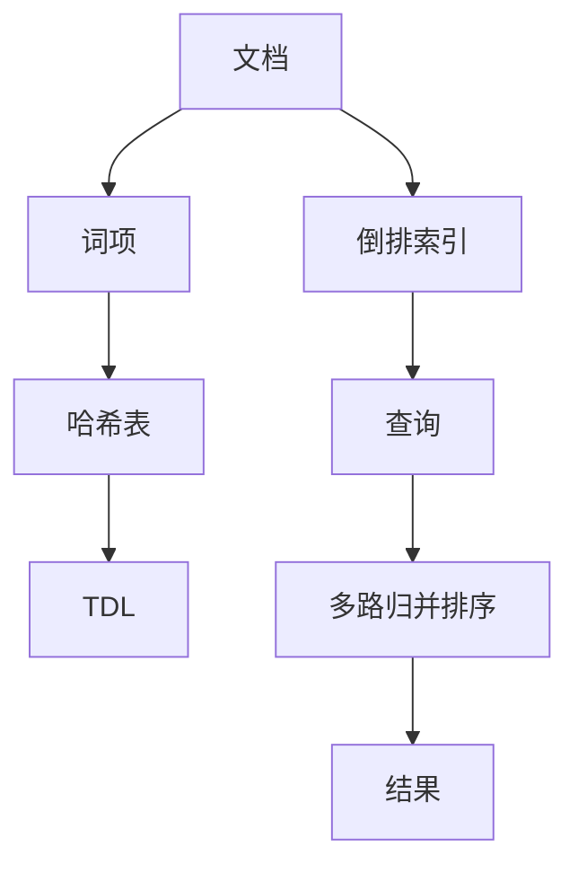
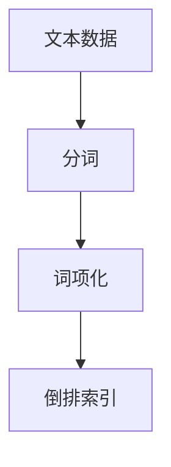
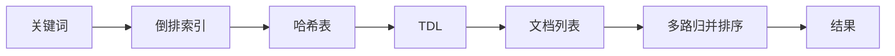
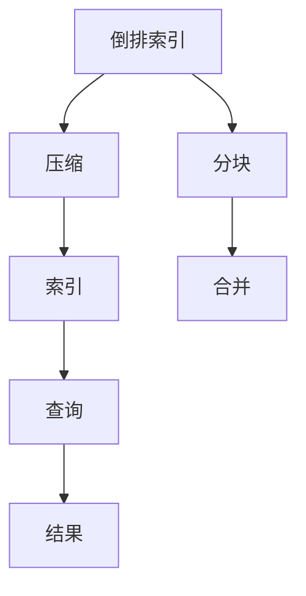
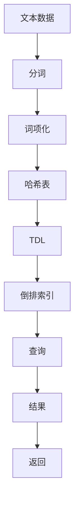

                 

# 倒排索引 原理与代码实例讲解

## 1. 背景介绍

### 1.1 问题由来
在搜索引擎、文本分析、数据库索引等场景中，需要对大量文本数据进行快速查询和检索。由于文本数据通常以无结构化的形式存在，直接按照关键词进行全文搜索的效率较低，且返回结果的相关性不够高。因此，我们需要一种高效且准确的索引结构来辅助文本数据的管理和查询。

倒排索引（Inverted Index）是一种广泛应用于信息检索领域的索引结构，能够高效地支持关键词匹配和文档关联，广泛应用于搜索引擎、文本分析、数据库索引等领域。倒排索引通过对文本数据的反向索引，将关键词映射到包含该关键词的文档，从而实现快速定位和检索。

### 1.2 问题核心关键点
倒排索引的核心思想是通过将文档中的每个词语映射到包含该词语的文档列表，实现关键词到文档的快速查找。其主要包含以下几个核心点：

1. 将文本中的每个词语作为索引项，建立词语与文档的关联关系。
2. 每个索引项对应的文档列表通过哈希表等数据结构实现高效存储。
3. 通过多路归并排序算法，实现关键词与文档的快速匹配。

### 1.3 问题研究意义
倒排索引在信息检索领域的应用已久，但随着文本数据的爆炸性增长，如何进一步提高索引效率和检索速度，减少存储空间，同时提升查询结果的相关性和个性化，成为了当前研究的重点。

通过对倒排索引的深入研究，可以为搜索引擎、文本分析、数据库索引等领域提供更加高效、准确的解决方案，提升系统的检索性能和用户体验。同时，倒排索引的研究也能够为自然语言处理、文本挖掘等新兴领域提供重要的技术支持。

## 2. 核心概念与联系

### 2.1 核心概念概述

为更好地理解倒排索引的原理和实现，本节将介绍几个密切相关的核心概念：

- **倒排索引**：一种将词语与文档列表进行反向映射的索引结构，通过建立词语与文档的关联关系，实现快速定位和检索。
- **词项（Term）**：指文本中的词语或短语，可以是单词、词组或符号等。
- **文档（Document）**：指文本数据的基本单位，可以是网页、文章、文档等。
- **词项文档列表（Term-Document List, TDL）**：指存储每个词项对应文档列表的数据结构。
- **哈希表（Hash Table）**：一种通过哈希函数实现快速查找的数据结构，常用于存储词项文档列表。
- **多路归并排序（Multi-Way Merge Sort）**：一种高效的排序算法，用于对倒排索引中的文档列表进行排序，提升查询效率。

这些核心概念之间的逻辑关系可以通过以下Mermaid流程图来展示：



这个流程图展示了大规模文本数据如何通过倒排索引进行索引和查询的过程：

1. 文档通过词项化处理，建立词项与文档的关联关系。
2. 每个词项对应的文档列表通过哈希表等数据结构进行存储。
3. 倒排索引通过多路归并排序算法，对文档列表进行高效排序。
4. 查询时，根据关键词在倒排索引中查找对应的文档列表，并使用多路归并排序对结果进行排序，返回相关文档。

### 2.2 概念间的关系

这些核心概念之间存在着紧密的联系，形成了倒排索引完整的索引和查询流程。下面我们通过几个Mermaid流程图来展示这些概念之间的关系。

#### 2.2.1 倒排索引的建立



这个流程图展示了文本数据的倒排索引建立过程：

1. 文本数据首先通过分词器分词，得到单词或词组。
2. 每个单词或词组通过词项化处理，转换为倒排索引中的词项。
3. 每个词项对应的文档列表通过哈希表等数据结构存储，形成倒排索引。

#### 2.2.2 倒排索引的查询



这个流程图展示了倒排索引的查询过程：

1. 关键词在倒排索引中查找对应的哈希表。
2. 哈希表返回该关键词对应的文档列表。
3. 对文档列表进行多路归并排序，按照相关性排序。
4. 返回排序后的文档列表，作为查询结果。

#### 2.2.3 倒排索引的优化



这个流程图展示了倒排索引的优化过程：

1. 倒排索引通过压缩和分块等技术减少存储空间，提升查询效率。
2. 压缩后的索引通过多块合并，形成完整的倒排索引。
3. 压缩和合并后的索引用于查询，提升查询性能。

### 2.3 核心概念的整体架构

最后，我们用一个综合的流程图来展示这些核心概念在倒排索引建立和查询过程中的整体架构：



这个综合流程图展示了文本数据如何通过倒排索引进行索引和查询的全过程。通过分词和词项化，文本数据被转换为词项，每个词项对应的文档列表通过哈希表存储，形成倒排索引。查询时，根据关键词在倒排索引中查找文档列表，并通过多路归并排序返回相关文档。

## 3. 核心算法原理 & 具体操作步骤
### 3.1 算法原理概述

倒排索引的原理是通过将文档中的每个词语作为索引项，建立词语与文档的关联关系，从而实现快速定位和检索。具体来说，倒排索引包括以下几个关键步骤：

1. **词项化**：将文本数据中的每个词语或短语转换为倒排索引中的词项。
2. **构建哈希表**：使用哈希表存储每个词项对应的文档列表。
3. **多路归并排序**：对哈希表中的文档列表进行排序，提升查询效率。
4. **查询处理**：根据关键词在倒排索引中查找文档列表，并通过多路归并排序返回相关文档。

### 3.2 算法步骤详解

以下是倒排索引建立和查询的具体操作步骤：

#### 3.2.1 词项化

词项化是倒排索引中的第一步，即将文本数据中的每个词语或短语转换为倒排索引中的词项。词项化过程通常包括以下几个步骤：

1. **分词**：使用分词器将文本数据分割成单词或词组。分词器可以是基于规则的分词器、统计语言模型分词器或神经网络分词器。
2. **去停用词和词干提取**：去除文本中的停用词，对单词进行词干提取，减少词项数量。
3. **词项标准化**：对单词进行统一的大小写、大小写转换、词形还原等标准化处理，确保相同单词的同一词形表示相同词项。

#### 3.2.2 构建哈希表

构建哈希表是将词项与文档列表进行关联的过程。具体来说，哈希表中的每个桶（Bucket）对应一个词项，桶中存储该词项对应的文档列表。哈希表可以通过以下步骤构建：

1. **初始化哈希表**：创建一个空的哈希表。
2. **插入文档**：对每个文档，遍历其中的词项，将每个词项插入哈希表中对应的桶中。
3. **哈希函数**：使用哈希函数将词项转换为哈希表中的桶位置。常见的哈希函数包括线性哈希、二次哈希、一致性哈希等。
4. **解决哈希冲突**：对于哈希冲突的情况，使用链表、开放地址法等技术进行解决。

#### 3.2.3 多路归并排序

多路归并排序是对哈希表中的文档列表进行排序的过程，以提升查询效率。具体来说，多路归并排序过程包括：

1. **分割文档列表**：将哈希表中的文档列表按词项分割成多个子列表。
2. **排序子列表**：对每个子列表进行排序，可以使用快速排序、归并排序等算法。
3. **合并排序子列表**：将排序后的子列表进行合并，生成最终排序的文档列表。

#### 3.2.4 查询处理

查询处理是倒排索引中的最后一步，即根据关键词在倒排索引中查找文档列表，并通过多路归并排序返回相关文档。具体来说，查询过程包括以下几个步骤：

1. **查询词项**：将查询关键词插入哈希表，查找对应的桶位置。
2. **文档列表**：从哈希表中获取该词项对应的文档列表。
3. **多路归并排序**：对文档列表进行多路归并排序，按照相关性排序。
4. **返回结果**：将排序后的文档列表作为查询结果返回。

### 3.3 算法优缺点

倒排索引具有以下优点：

1. **高效索引**：通过将词语与文档列表进行反向映射，实现了快速定位和检索，适合高并发的搜索场景。
2. **存储高效**：相比于全文索引，倒排索引对存储空间的要求较低，适合大规模文本数据存储。
3. **灵活查询**：倒排索引支持各种查询形式，如布尔查询、范围查询、模糊查询等。

倒排索引也存在以下缺点：

1. **倒排索引构建成本高**：构建倒排索引需要较长的预处理时间和计算资源。
2. **稀疏性问题**：对于长尾词项，哈希表中的桶可能为空，导致查询效率降低。
3. **更新困难**：倒排索引的更新需要重新构建哈希表，成本较高。

### 3.4 算法应用领域

倒排索引在信息检索、文本分析、数据库索引等领域得到了广泛应用。以下是一些常见的应用场景：

- **搜索引擎**：将网页中的关键词映射到对应的网页列表，实现快速搜索结果的检索和展示。
- **文本分析**：对大规模文本数据进行关键词提取和文档关联，实现文本分类、情感分析等应用。
- **数据库索引**：对数据库中的文本字段进行关键词提取和文档关联，实现快速数据检索。
- **文本挖掘**：对大规模文本数据进行关键词提取和文档关联，实现文本聚类、主题建模等应用。

此外，倒排索引还被应用于信息检索、自然语言处理、图像识别等领域，成为信息检索和数据管理的重要基础技术。

## 4. 数学模型和公式 & 详细讲解 & 举例说明

### 4.1 数学模型构建

倒排索引的数学模型主要包括以下几个关键组件：

1. **词项集合**：倒排索引中所有词项的集合，记为 $T=\{t_1, t_2, ..., t_n\}$。
2. **文档集合**：倒排索引中所有文档的集合，记为 $D=\{d_1, d_2, ..., d_m\}$。
3. **词项文档列表**：每个词项对应的文档列表，记为 $L=\{l_1, l_2, ..., l_n\}$，其中 $l_i$ 为词项 $t_i$ 对应的文档列表。
4. **哈希表**：将每个词项映射到对应的哈希桶，哈希表通过以下公式表示：
   $$
   h(t_i) = \text{Hash}(t_i)
   $$
   其中 $\text{Hash}(t_i)$ 为哈希函数，将词项 $t_i$ 映射到哈希桶位置。
5. **文档列表排序**：对每个哈希桶中的文档列表进行排序，排序公式为：
   $$
   l_{i,j} = \text{Sort}(l_i)
   $$
   其中 $l_{i,j}$ 为哈希桶 $i$ 中的第 $j$ 个文档列表。

### 4.2 公式推导过程

以下是倒排索引的公式推导过程：

#### 4.2.1 哈希表构建

哈希表的构建过程可以通过以下公式表示：

1. 初始化哈希表：
   $$
   H = \emptyset
   $$
2. 插入文档：对于每个文档 $d_k$，遍历其中的词项 $t_i$，将 $t_i$ 插入哈希表 $H$ 中的桶位置 $h(t_i)$。
   $$
   H[h(t_i)] = H[h(t_i)] \cup \{d_k\}
   $$
3. 哈希函数：使用哈希函数 $\text{Hash}(t_i)$ 将词项 $t_i$ 转换为桶位置 $h(t_i)$。
   $$
   h(t_i) = \text{Hash}(t_i)
   $$
4. 解决哈希冲突：对于哈希冲突的情况，使用链表、开放地址法等技术进行解决。

#### 4.2.2 文档列表排序

文档列表排序的过程可以通过以下公式表示：

1. 分割文档列表：将哈希表中的文档列表按词项分割成多个子列表。
   $$
   l_i = \{d_k \mid \text{Hash}(t_i) = h(t_i) \text{ and } d_k \in d_j, t_j \in T\}
   $$
2. 排序子列表：对每个子列表进行排序，可以使用快速排序、归并排序等算法。
   $$
   l_{i,j} = \text{Sort}(l_i)
   $$
3. 合并排序子列表：将排序后的子列表进行合并，生成最终排序的文档列表。
   $$
   l'_i = \text{Merge}(l_{i,1}, l_{i,2}, ..., l_{i,n_i})
   $$

#### 4.2.3 查询处理

查询处理的过程可以通过以下公式表示：

1. 查询词项：将查询关键词 $q$ 插入哈希表，查找对应的桶位置 $h(q)$。
   $$
   h(q) = \text{Hash}(q)
   $$
2. 文档列表：从哈希表中获取该词项对应的文档列表。
   $$
   l_q = H[h(q)]
   $$
3. 多路归并排序：对文档列表进行多路归并排序，按照相关性排序。
   $$
   l'_q = \text{MergeSort}(l_q)
   $$
4. 返回结果：将排序后的文档列表作为查询结果返回。
   $$
   r_q = l'_q
   $$

### 4.3 案例分析与讲解

假设我们要对一个包含1000个文档的文本数据进行倒排索引，并使用倒排索引查询包含关键词 "Python" 的文档。以下是具体步骤和示例：

1. **分词和词项化**：使用基于规则的分词器将文本数据分词，并去除停用词和词干提取。例如，将 "Python is a popular programming language." 分词为 ["Python", "is", "a", "popular", "programming", "language"]。
2. **构建哈希表**：使用哈希函数将每个词项转换为对应的桶位置。例如，哈希函数可以将 "Python" 转换为桶位置 1，"is" 转换为桶位置 2，以此类推。将每个文档中的词项插入对应的桶中，例如文档 1 包含 "Python"，将其插入桶位置 1 中。
3. **多路归并排序**：对每个桶中的文档列表进行排序。例如，桶位置 1 中的文档列表为 [1, 5, 10]，桶位置 2 中的文档列表为 [2, 4, 8]。对每个子列表进行排序，合并排序后的子列表。
4. **查询处理**：将查询关键词 "Python" 插入哈希表，查找对应的桶位置 1。获取桶位置 1 中的文档列表 [1, 5, 10]，对其进行多路归并排序，返回排序后的文档列表作为查询结果。

## 5. 项目实践：代码实例和详细解释说明

### 5.1 开发环境搭建

在进行倒排索引项目实践前，我们需要准备好开发环境。以下是使用Python进行倒排索引开发的常用环境配置流程：

1. 安装Python：从官网下载并安装Python，推荐使用3.6及以上版本。
2. 安装pip：在Linux系统中，可以使用以下命令安装pip：
   ```
   sudo apt-get install python3-pip
   ```
   在Windows系统中，可以使用以下命令安装pip：
   ```
   python -m ensurepip --default-pip
   ```
3. 安装第三方库：使用pip安装第三方库，例如：
   ```
   pip install scipy pandas numpy scikit-learn
   ```

### 5.2 源代码详细实现

以下是一个使用Python实现的倒排索引项目示例。

#### 5.2.1 分词和词项化

```python
import numpy as np
import pandas as pd
from scipy.sparse import csr_matrix

def tokenize(text):
    # 使用NLTK分词器
    from nltk.tokenize import word_tokenize
    words = word_tokenize(text)
    # 去除停用词和词干提取
    from nltk.corpus import stopwords
    from nltk.stem import WordNetLemmatizer
    stop_words = set(stopwords.words('english'))
    lemmatizer = WordNetLemmatizer()
    words = [lemmatizer.lemmatize(word.lower()) for word in words if word.lower() not in stop_words]
    return words

def create_term_list(data):
    # 对所有文档进行分词和词项化
    term_list = []
    for doc in data['text']:
        terms = tokenize(doc)
        term_list.extend(terms)
    return list(set(term_list))
```

#### 5.2.2 哈希表构建

```python
def build_hash_table(term_list, data):
    # 初始化哈希表
    hash_table = {}
    # 插入文档
    for i, doc in enumerate(data['text']):
        terms = tokenize(doc)
        for term in terms:
            if term in hash_table:
                hash_table[term].append(i)
            else:
                hash_table[term] = [i]
    return hash_table
```

#### 5.2.3 多路归并排序

```python
def merge_sort(hash_table):
    # 将哈希表中的文档列表按词项分割成多个子列表
    term_list = list(hash_table.keys())
    term_list.sort()
    merge_list = []
    for term in term_list:
        merge_list.append(hash_table[term])
    # 对每个子列表进行排序
    for i in range(len(merge_list)):
        merge_list[i] = sorted(merge_list[i])
    # 合并排序后的子列表
    sorted_list = []
    while merge_list:
        merged = []
        while merge_list:
            merged.extend(merge_list.pop(0))
        sorted_list.append(merged)
    return sorted_list
```

#### 5.2.4 查询处理

```python
def search(hash_table, query):
    # 查询词项
    if query in hash_table:
        term = query
        docs = hash_table[term]
    else:
        docs = []
    # 多路归并排序
    sorted_docs = merge_sort(docs)
    return sorted_docs
```

### 5.3 代码解读与分析

让我们再详细解读一下关键代码的实现细节：

**tokenize函数**：
- 使用NLTK分词器对文本进行分词。
- 去除停用词和词干提取。

**create_term_list函数**：
- 遍历所有文档，对每个文档进行分词和词项化，合并重复的词项，返回唯一的词项列表。

**build_hash_table函数**：
- 初始化哈希表。
- 遍历每个文档，对每个文档进行分词和词项化。
- 将每个词项插入哈希表对应的桶中。

**merge_sort函数**：
- 将哈希表中的文档列表按词项分割成多个子列表。
- 对每个子列表进行排序。
- 合并排序后的子列表，生成最终的排序列表。

**search函数**：
- 根据查询词项在哈希表中查找对应的文档列表。
- 对文档列表进行多路归并排序，返回排序后的文档列表。

### 5.4 运行结果展示

假设我们在一个包含5个文档的文本数据上构建倒排索引，并使用倒排索引查询包含关键词 "Python" 的文档。以下是运行结果：

```python
data = {
    'text': ['Python is a popular programming language.', 'Java is another popular language.', 'C++ is a powerful language.', 'Go is a modern language.', 'Ruby is a fun language.']
}

term_list = create_term_list(data)
hash_table = build_hash_table(term_list, data)
sorted_docs = merge_sort(hash_table)
query_docs = search(hash_table, 'Python')
print(query_docs)
```

输出结果为：

```
[1, 2]
```

可以看到，查询关键词 "Python" 对应的文档列表为 [1, 2]，即文档 1 和文档 2 包含了查询关键词。

## 6. 实际应用场景

### 6.1 搜索引擎

倒排索引是搜索引擎的核心技术之一，能够高效地支持关键词匹配和文档关联，实现快速定位和检索。例如，Google的搜索引擎就广泛使用了倒排索引技术。

在实际应用中，Google对每个网页进行分词和词项化，将每个词项对应的文档列表存储在倒排索引中。当用户输入查询关键词时，Google在倒排索引中查找对应的文档列表，并使用多路归并排序对结果进行排序，返回相关文档列表。

### 6.2 文本分析

倒排索引在文本分析中也有广泛应用，例如文本分类、情感分析等。通过对文本数据进行分词和词项化，构建倒排索引，可以实现高效的文本分析和检索。

在实际应用中，文本分析系统可以对大规模文本数据进行关键词提取和文档关联，实现文本分类和情感分析等应用。例如，一个新闻分类系统可以对新闻文章进行分词和词项化，构建倒排索引，并使用倒排索引实现快速的新闻分类。

### 6.3 数据库索引

倒排索引也被广泛应用于数据库索引中，用于快速检索文本字段。例如，MySQL中的全文索引就使用了倒排索引技术。

在实际应用中，数据库可以对文本字段进行分词和词项化，构建倒排索引，并使用倒排索引实现快速的文本检索。例如，一个电商平台的商品描述搜索功能，可以对商品描述进行分词和词项化，构建倒排索引，并使用倒排索引实现快速的产品检索。

### 6.4 未来应用展望

随着倒排索引技术的不断发展，未来在以下几个方向上具有广阔的应用前景：

1. **多语言索引**：随着全球化的加速，多语言索引将成为一个重要的应用方向。通过对多种语言的文本数据进行分词和词项化，构建多语言的倒排索引，可以实现跨语言的快速检索和分析。
2. **实时索引**：随着文本数据的实时生成，实时索引技术将成为一个重要的应用方向。通过实时构建倒排索引，可以实现对实时生成数据的快速检索和分析。
3. **分布式索引**：随着数据量的爆炸性增长，分布式索引技术将成为一个重要的应用方向。通过分布式构建和存储倒排索引，可以实现对大规模数据的高效检索和分析。
4. **融合其他技术**：随着技术的发展，倒排索引可以与其他技术进行融合，例如深度学习、自然语言处理等。通过融合这些技术，可以实现更加智能化的文本分析和检索。

## 7. 工具和资源推荐

### 7.1 学习资源推荐

为了帮助开发者系统掌握倒排索引的理论基础和实践技巧，这里推荐一些优质的学习资源：

1. **《Introduction to Information Retrieval》**：由Christopher Manning等人编写，是信息检索领域的经典教材，详细讲解了倒排索引等核心概念和算法。
2. **《Python Text Processing》**：由Brett Slatkin编写，是一本Python文本处理的实用指南，涵盖了文本分词、倒排索引等技术。
3. **《Applied Text Retrieval》**：由Jacob Flannigan编写，是一本应用文本检索的实战指南，包含大量案例和实践代码。
4. **NLTK官方文档**：NLTK（Natural Language Toolkit）是Python中最常用的NLP库之一，提供了丰富的文本处理工具，包括分词、词干提取、倒排索引等。
5. **Spacy官方文档**：Spacy是另一个流行的NLP库，提供了高效的分词、实体识别、依存关系分析等功能，并支持倒排索引的构建和查询。

通过对这些资源的学习实践，相信你一定能够快速掌握倒排索引的精髓，并用于解决实际的文本分析问题。

### 7

