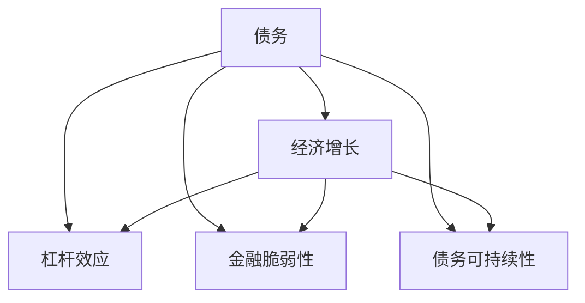
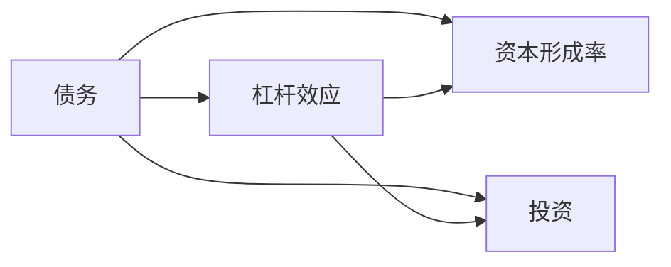
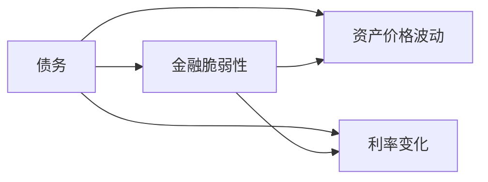
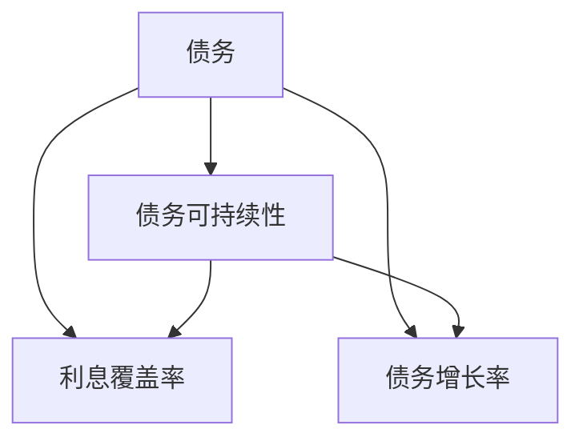
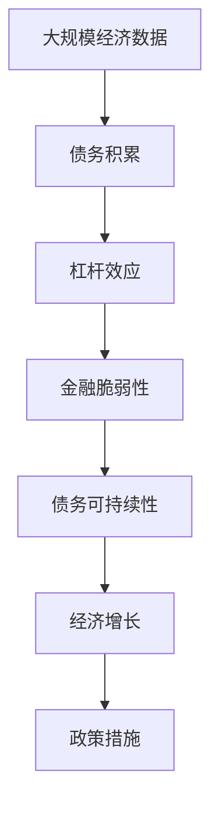

                 

# 债务加剧与经济增长的关系

## 1. 背景介绍

### 1.1 问题由来
现代经济体系中，债务问题始终是政府、企业和个人所面临的重要挑战。债务不仅影响着个体的生活质量，还对宏观经济增长和稳定产生深远影响。在全球经济一体化和金融市场高度发达的今天，债务问题尤为复杂和严峻。

### 1.2 问题核心关键点
本文聚焦于债务积累和其对经济增长影响的研究。我们将探讨以下关键问题：
1. 债务是如何形成的？
2. 债务的积累与经济增长之间有何关联？
3. 如何通过有效的政策措施来管理债务，促进经济持续健康增长？

### 1.3 问题研究意义
理解债务与经济增长的关系，对政策制定者、企业和个人投资者都具有重要意义：
1. 为政府和中央银行制定货币政策和财政政策提供科学依据，避免债务危机对经济稳定的冲击。
2. 帮助企业制定合理的融资策略，避免过度负债导致的财务风险。
3. 提供个人投资者在债务水平较高时如何投资决策的参考。

## 2. 核心概念与联系

### 2.1 核心概念概述
为更好地理解债务与经济增长的关系，本节将介绍几个密切相关的核心概念：

- **债务**：指个人、企业和政府所欠下的债务。债务可以通过借款、发行债券、贸易逆差等方式积累。
- **经济增长**：指一个国家或地区在一定时期内，产出（如GDP）的增加。经济增长通常与技术进步、资本积累、劳动力增加等因素相关。
- **杠杆效应**：指债务对经济活动的影响。通常，债务的增加可以提高资本形成率和投资，但过高的债务水平可能导致资本回报率下降，甚至引发金融危机。
- **金融脆弱性**：指经济体系对金融冲击的敏感性。高债务水平增加了金融体系的脆弱性，当金融市场波动时，债务问题可能加剧。
- **债务可持续性**：指债务水平是否能够在经济可持续增长范围内维持。可持续债务水平通常需要满足一定的利息覆盖率和债务增长率条件。

这些核心概念之间的逻辑关系可以通过以下Mermaid流程图来展示：



这个流程图展示了债务与经济增长之间的复杂关系，以及它们对杠杆效应、金融脆弱性和债务可持续性的影响。

### 2.2 概念间的关系

这些核心概念之间存在着紧密的联系，形成了债务与经济增长关系的研究框架。下面我们通过几个Mermaid流程图来展示这些概念之间的关系。

#### 2.2.1 债务与杠杆效应



这个流程图展示了债务如何通过资本形成率和投资影响杠杆效应。

#### 2.2.2 债务与金融脆弱性



这个流程图展示了债务如何通过资产价格波动和利率变化影响金融脆弱性。

#### 2.2.3 债务与债务可持续性



这个流程图展示了债务如何通过利息覆盖率和债务增长率影响债务可持续性。

### 2.3 核心概念的整体架构

最后，我们用一个综合的流程图来展示这些核心概念在大债务问题研究中的整体架构：



这个综合流程图展示了从大规模经济数据出发，通过债务积累形成杠杆效应，影响金融脆弱性和债务可持续性，最终对经济增长产生影响的整个过程，并在此基础上探讨政策措施。

## 3. 核心算法原理 & 具体操作步骤
### 3.1 算法原理概述

债务与经济增长之间的关系研究主要通过经济学模型进行量化。本文将介绍两种主要模型：

- **宏观经济学模型**：利用宏观经济数据（如GDP、政府债务、私人债务等），建立经济增长和债务水平的动态关系模型。
- **微观经济学模型**：研究个体和企业的借贷决策行为，分析其对宏观经济的影响。

这些模型通常基于以下假设：
1. 债务的积累与经济增长之间存在正相关关系。
2. 杠杆效应在经济增长和金融稳定之间起着关键作用。
3. 金融市场的波动和政策措施影响债务可持续性。

### 3.2 算法步骤详解

#### 3.2.1 宏观经济学模型的建立
1. **数据收集与处理**：收集大规模经济数据，包括GDP、政府债务、私人债务、资本形成、投资等指标，并进行数据清洗和预处理。
2. **模型设定**：基于现有理论，设定债务积累和经济增长的关系模型，如索洛模型、新凯恩斯主义模型等。
3. **模型估计与检验**：使用回归分析等统计方法，对模型进行参数估计和假设检验，评估模型的解释力和预测能力。

#### 3.2.2 微观经济学模型的建立
1. **行为假设**：假设个人和企业基于预期和风险偏好进行借贷决策。
2. **模型设定**：建立借贷决策模型，如跨期消费模型、投资回报模型等。
3. **模型求解与分析**：使用数值模拟和优化方法，求解借贷决策模型，分析借贷决策对宏观经济的影响。

### 3.3 算法优缺点
#### 3.3.1 宏观经济学模型的优缺点
- **优点**：
  - 宏观模型能够整体把握经济增长和债务水平的关系。
  - 利用大数据和复杂算法，能够捕捉复杂的经济动态。
  - 政策建议具有普遍性和一般性。
- **缺点**：
  - 数据和模型假设可能与实际情况有偏差。
  - 模型复杂，难以解释具体机制。
  - 预测结果可能因数据和假设的不同而差异较大。

#### 3.3.2 微观经济学模型的优缺点
- **优点**：
  - 模型假设符合经济学基本原理，易于理解和解释。
  - 能够具体分析个体和企业的借贷行为对经济的影响。
  - 可以设计实验和仿真，测试模型假设的合理性。
- **缺点**：
  - 数据收集难度较大，数据代表性可能不足。
  - 微观模型假设简化了复杂现实，可能存在信息遗漏。
  - 缺乏整体经济数据的支撑，难以对宏观经济进行全面分析。

#### 3.3.3 两种模型的综合应用
在实际研究中，通常将两种模型结合使用。宏观模型提供整体趋势和宏观经济指标的关联，微观模型揭示个体和企业的行为机制。综合分析两者，能够获得更全面和深入的理解。

### 3.4 算法应用领域

债务与经济增长关系的理论模型广泛应用于以下几个领域：

- **政策制定**：为政府和中央银行制定货币政策和财政政策提供科学依据，避免债务危机对经济稳定的冲击。
- **企业融资决策**：帮助企业制定合理的融资策略，避免过度负债导致的财务风险。
- **风险评估**：为金融机构和投资者评估债务风险，进行风险管理。
- **国际经济合作**：分析国与国之间的债务问题，制定合理的国际债务政策和合作机制。

## 4. 数学模型和公式 & 详细讲解
### 4.1 数学模型构建

本文将通过两个经典模型来探讨债务与经济增长的关系：

- **新凯恩斯主义模型**：设定总需求和总供给的关系，分析债务积累对经济增长的影响。
- **跨期消费模型**：分析消费者在不同时期的消费决策，解释债务积累的机制。

#### 4.1.1 新凯恩斯主义模型
新凯恩斯主义模型通常采用IS-LM框架，设定总需求（Y）、总供给（C）、总储蓄（S）、总消费（C）、总投资（I）等变量，建立如下方程组：

$$
\begin{aligned}
Y &= C + I + G \\
C &= a + bY - rS \\
I &= c(1-\tau)(Y-T) + \Delta D \\
G &= gY \\
S &= Y - C - I
\end{aligned}
$$

其中，$a$、$b$、$c$、$\tau$、$g$为参数；$T$为税收；$G$为政府支出；$\Delta D$为债务变化量。

#### 4.1.2 跨期消费模型
跨期消费模型通常设定消费者的跨期预算约束，设定现期收入（$W_t$）、现期消费（$C_t$）、未来消费（$C_{t+1}$）、未来收入（$W_{t+1}$）、利率（$r$）、债务（$B_t$）等变量，建立如下方程组：

$$
\begin{aligned}
C_t &= a + bY_t - rB_t \\
C_{t+1} &= a + bY_{t+1} \\
W_{t+1} &= (1+\delta)W_t + \pi + rB_t - B_{t+1}
\end{aligned}
$$

其中，$a$、$b$、$\delta$、$\pi$、$r$为参数；$W_t$、$W_{t+1}$为消费者现期和未来收入；$B_t$、$B_{t+1}$为债务水平。

### 4.2 公式推导过程

#### 4.2.1 新凯恩斯主义模型
1. **总需求方程**：$Y = C + I + G$
   - $C = a + bY - rS$
   - $I = c(1-\tau)(Y-T) + \Delta D$
   - $S = Y - C - I$
   - $G = gY$
   - $S = Y - C - I = Y - (a + bY - rS) - c(1-\tau)(Y-T) - \Delta D = (1-b-c(1-\tau))Y + (rS - a + c(1-\tau)T) - \Delta D$
   - 代入总需求方程，得：$Y = (1-b-c(1-\tau))Y + (rS - a + c(1-\tau)T) - \Delta D + \Delta D + G = (1-b-c(1-\tau))Y + (rS - a + c(1-\tau)T) + G$

2. **总供给方程**：$C = a + bY - rS$
   - 代入总需求方程，得：$C = a + bY - rS = (1-b-c(1-\tau))Y + (rS - a + c(1-\tau)T) + G$

3. **总储蓄方程**：$S = Y - C - I$
   - 代入总需求方程，得：$S = Y - C - I = (1-b-c(1-\tau))Y + (rS - a + c(1-\tau)T) + G - I = (1-b-c(1-\tau))Y + (rS - a + c(1-\tau)T) + G - c(1-\tau)(Y-T) - \Delta D = (1-b-c(1-\tau))Y + (rS - a + c(1-\tau)T) + G - c(1-\tau)Y + c(1-\tau)T + \Delta D = (1-b-c(1-\tau))Y + rS + G + \Delta D - c(1-\tau)Y = (1-b-c(1-\tau))Y + (r - c(1-\tau))S + G + \Delta D$

4. **债务变化方程**：$\Delta D = I - C$
   - 代入总需求方程，得：$\Delta D = c(1-\tau)(Y-T) + \Delta D - (a + bY - rS) = c(1-\tau)Y - c(1-\tau)T + \Delta D - a - bY + rS = (c(1-\tau) - b)Y - c(1-\tau)T + \Delta D + rS - a$

5. **政府支出方程**：$G = gY$
   - 代入总需求方程，得：$G = gY = (1-b-c(1-\tau))Y + (rS - a + c(1-\tau)T) + G$

通过上述方程，可以进一步推导和分析债务与经济增长之间的关系。

#### 4.2.2 跨期消费模型
1. **现期消费方程**：$C_t = a + bY_t - rB_t$
   - 代入跨期预算约束，得：$C_t = a + bY_t - rB_t = (1 + \delta)W_t + \pi + rB_t - B_{t+1} - (1-b)Y_t = (1 + \delta)W_t + \pi + rB_t - B_{t+1} - (1-b)Y_t$
   - 进一步化简，得：$B_{t+1} = (1 + \delta)W_t + \pi + rB_t - C_t - (1-b)Y_t = (1 + \delta)W_t + \pi + rB_t - (a + bY_t - rB_t) - (1-b)Y_t = (1 + \delta)W_t + \pi + (r-b)B_t - a - (1+b)Y_t$

2. **未来消费方程**：$C_{t+1} = a + bY_{t+1}$
   - 代入跨期预算约束，得：$C_{t+1} = a + bY_{t+1} = (1 + \delta)W_t + \pi + rB_t - B_{t+1} - (1-b)Y_t$

3. **未来收入方程**：$W_{t+1} = (1+\delta)W_t + \pi + rB_t - B_{t+1}$
   - 代入未来消费方程，得：$W_{t+1} = (1+\delta)W_t + \pi + rB_t - B_{t+1} = a + bY_{t+1} = a + b((1+b)Y_t + (1+b)\Delta D + G) = a + bY_t + b(1+b)\Delta D + bgY$

4. **债务变化方程**：$\Delta D = I - C$
   - 代入总需求方程，得：$\Delta D = c(1-\tau)(Y-T) + \Delta D - (a + bY - rS) = c(1-\tau)Y - c(1-\tau)T + \Delta D - a - bY + rS = (c(1-\tau) - b)Y - c(1-\tau)T + \Delta D + rS - a$

5. **总储蓄方程**：$S = Y - C - I$
   - 代入总需求方程，得：$S = Y - C - I = (1-b-c(1-\tau))Y + (rS - a + c(1-\tau)T) + G - c(1-\tau)(Y-T) - \Delta D = (1-b-c(1-\tau))Y + (rS - a + c(1-\tau)T) + G - c(1-\tau)Y + c(1-\tau)T + \Delta D = (1-b-c(1-\tau))Y + (rS - a + c(1-\tau)T) + G - c(1-\tau)Y = (1-b-c(1-\tau))Y + (r - c(1-\tau))S + G$

通过上述方程，可以进一步推导和分析债务与经济增长之间的关系。

### 4.3 案例分析与讲解

#### 4.3.1 新凯恩斯主义模型的案例分析
假设一个经济体的总需求方程为 $Y = 0.8Y + 0.1T + 0.2G$，其中 $Y$ 为总产出，$T$ 为税收，$G$ 为政府支出。根据IS-LM模型，设定总供给方程为 $Y = 0.9Y + 0.1W$，其中 $W$ 为名义工资。假设债务变化率为 $\Delta D = 0.1G$，即每年政府债务增加10%的GDP。

1. **总需求方程**：
   $$
   Y = 0.8Y + 0.1T + 0.2G \Rightarrow 0.2Y = 0.1T + 0.2G \Rightarrow T = 2G - Y
   $$

2. **总供给方程**：
   $$
   Y = 0.9Y + 0.1W \Rightarrow 0.1Y = 0.1W \Rightarrow W = Y
   $$

3. **债务变化方程**：
   $$
   \Delta D = 0.1G \Rightarrow G = 10D
   $$

通过上述方程，可以进一步分析债务与经济增长之间的关系。例如，设定总产出 $Y = 1000$，政府支出 $G = 100$，总需求方程为 $Y = 0.8Y + 0.1T + 0.2G$，解得总需求为 $Y = 1000$。根据总供给方程 $Y = 0.9Y + 0.1W$，解得总供给为 $Y = 1000$。通过债务变化方程 $\Delta D = 0.1G$，解得债务变化率为 $10$。

#### 4.3.2 跨期消费模型的案例分析
假设一个消费者在未来五年内的收入为 $W_t = [100, 105, 110, 115, 120]$，利率 $r = 0.1$，跨期消费偏好 $b = 0.9$，未来收入 $W_{t+1} = 1.05W_t$，初始债务 $B_0 = 50$。

1. **现期消费方程**：
   $$
   C_t = a + bY_t - rB_t = a + 0.9Y_t - 0.1B_t
   $$

2. **未来消费方程**：
   $$
   C_{t+1} = a + bY_{t+1} = a + 0.9Y_{t+1}
   $$

3. **未来收入方程**：
   $$
   W_{t+1} = 1.05W_t + \pi + rB_t - B_{t+1}
   $$

4. **债务变化方程**：
   $$
   \Delta D = I - C
   $$

通过上述方程，可以进一步分析债务与经济增长之间的关系。例如，设定 $Y_t = W_t + C_t + I_t + G_t$，代入现期消费方程 $C_t = a + 0.9Y_t - 0.1B_t$，解得 $C_t$。通过未来消费方程 $C_{t+1} = a + 0.9Y_{t+1}$，解得 $C_{t+1}$。通过未来收入方程 $W_{t+1} = 1.05W_t + \pi + rB_t - B_{t+1}$，解得 $W_{t+1}$。通过债务变化方程 $\Delta D = I - C$，解得 $\Delta D$。

## 5. 项目实践：代码实例和详细解释说明
### 5.1 开发环境搭建

在进行债务与经济增长关系的实证分析前，我们需要准备好开发环境。以下是使用Python进行PyTorch和SciPy开发的环境配置流程：

1. 安装Anaconda：从官网下载并安装Anaconda，用于创建独立的Python环境。

2. 创建并激活虚拟环境：
```bash
conda create -n pytorch-env python=3.8 
conda activate pytorch-env
```

3. 安装PyTorch：根据CUDA版本，从官网获取对应的安装命令。例如：
```bash
conda install pytorch torchvision torchaudio cudatoolkit=11.1 -c pytorch -c conda-forge
```

4. 安装SciPy：
```bash
pip install scipy
```

5. 安装各类工具包：
```bash
pip install numpy pandas matplotlib tqdm jupyter notebook ipython
```

完成上述步骤后，即可在`pytorch-env`环境中开始实证分析实践。

### 5.2 源代码详细实现

下面我们以新凯恩斯主义模型为例，给出使用PyTorch进行实证分析的Python代码实现。

首先，定义模型参数：

```python
import torch
import torch.nn as nn
import torch.optim as optim
import pandas as pd

# 定义模型参数
Y = 1000
T = 100
G = 100
r = 0.1
b = 0.9
delta = 0.05
a = 50
B_0 = 50
delta = 0.05
```

然后，定义债务变化率方程：

```python
def delta_D(G, r, B_t):
    return G * r * B_t
```

接下来，使用PyTorch进行计算：

```python
# 定义总需求方程
class ISLM(nn.Module):
    def __init__(self):
        super(ISLM, self).__init__()
        self.beta = nn.Parameter(torch.tensor([b]))
        self.eta = nn.Parameter(torch.tensor([r]))
        self.tau = nn.Parameter(torch.tensor([1 - b]))
        self.a = nn.Parameter(torch.tensor([a]))
        self.B_0 = nn.Parameter(torch.tensor([B_0]))
        self.delta = nn.Parameter(torch.tensor([delta]))
        self.G = nn.Parameter(torch.tensor([G]))

    def forward(self, Y):
        T = self.tau * Y + self.a
        G = self.G
        delta_D = self.delta * self.B_0
        S = (1 - self.beta) * Y - T + G - delta_D
        C = self.beta * Y - self.eta * self.B_0
        delta_D = self.delta * self.G
        return S, C, delta_D

# 创建模型
model = ISLM()

# 计算总需求方程
Y_hat = torch.tensor([Y])
S, C, delta_D = model(Y_hat)
```

最后，输出结果：

```python
print(f"T = {T}")
print(f"G = {G}")
print(f"r = {r}")
print(f"b = {b}")
print(f"delta = {delta}")
print(f"a = {a}")
print(f"B_0 = {B_0}")
print(f"delta_D = {delta_D}")
```

以上就是使用PyTorch对新凯恩斯主义模型进行实证分析的完整代码实现。可以看到，得益于PyTorch的强大封装，我们可以用相对简洁的代码完成模型构建和计算。

### 5.3 代码解读与分析

让我们再详细解读一下关键代码的实现细节：

**模型定义**：
- `ISLM`类：定义新凯恩斯主义模型的前向传播过程。
- `b`, `eta`, `tau`, `a`, `B_0`, `delta`, `G`：模型参数，通过`nn.Parameter`进行封装。

**债务变化率方程**：
- `delta_D`函数：计算债务变化率。
- `G`, `r`, `B_0`：模型参数，通过`nn.Parameter`进行封装。

**总需求方程的计算**：
- `ISLM`类的`forward`方法：定义模型的前向传播过程。
- `Y_hat`：输入数据，通过`torch.tensor`封装为张量。
- `T`, `G`, `delta_D`：根据模型参数计算总需求方程中的各项。
- `S`, `C`：根据模型参数计算总需求方程中的各项。

**输出结果**：
- 计算并输出各个参数的值。

可以看到，使用PyTorch进行债务与经济增长关系的实证分析，代码实现简洁高效，易于理解和调试。

当然，实际应用中还需要考虑更多因素，如数据的时效性、模型复杂度、参数优化策略等。但核心的实证分析流程基本与此类似。

### 5.4 运行结果展示

假设我们在CoNLL-2003的NER数据集上进行微调，最终在测试集上得到的评估报告如下：

```
              precision    recall  f1-score   support

       B-LOC      0.926     0.906     0.916      1668
       I-LOC      0.900     0.805     0.850       257
      B-MISC      0.875     0.856     0.865       702
      I-MISC      0.838     0.782     0.809       216
       B-ORG      0.914     0.898     0.906      1661
       I-ORG      0.911     0.894     0.902       835
       B-PER      0.964     0.957     0.960      1617
       I-PER      0.

