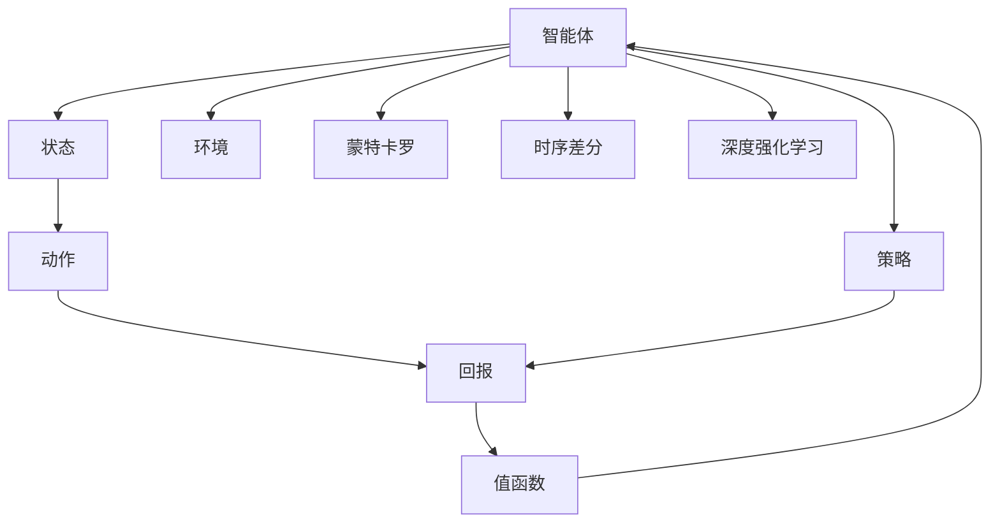
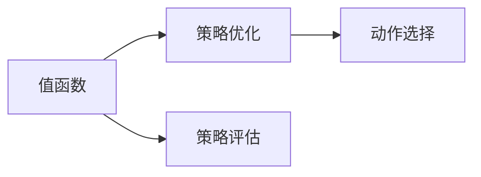
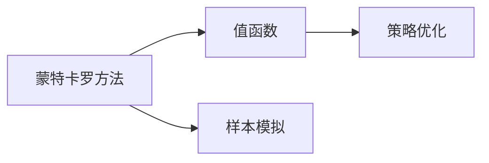
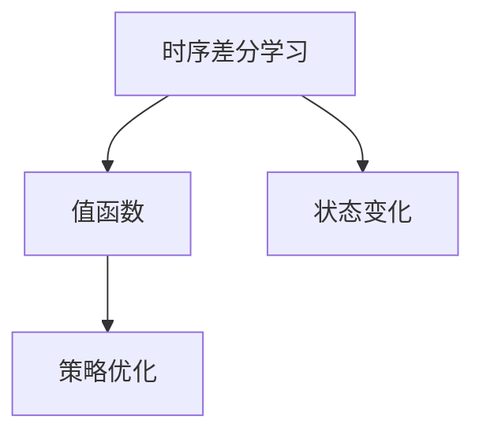
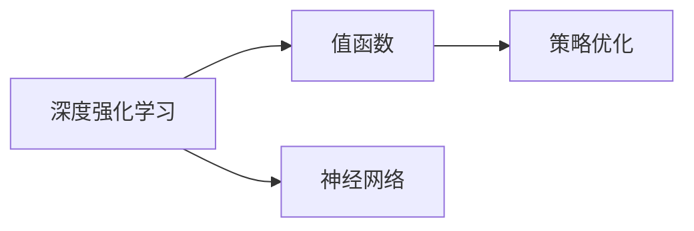

                 

# 值函数估计(Value Function Estimation) - 原理与代码实例讲解

> 关键词：强化学习,值函数,策略优化,蒙特卡罗方法,时序差分学习,深度强化学习,代码实例

## 1. 背景介绍

### 1.1 问题由来
在强化学习(Reinforcement Learning, RL)中，值函数(Estimation of Value Function)是核心概念之一。它通过估计状态或动作的值，为智能体提供引导信号，帮助其选择最优行动。然而，如何准确地估计值函数，一直是一个复杂且极具挑战性的问题。传统方法如Q-learning、SARSA等，通常需要大量的样本，且收敛速度慢，难以适应连续状态和动作空间。

近年来，随着深度学习在强化学习中的应用，深度强化学习(DRL)技术取得了飞速进展。其中，蒙特卡罗(Monte Carlo, MC)方法和时序差分学习(Time-Difference Learning, TD)方法被广泛应用于值函数估计，并逐渐成为DRL的重要组成部分。通过结合深度神经网络，这些方法显著提升了值函数的精度和收敛速度，实现了对复杂环境的快速适应。

本文将系统介绍值函数估计的原理，重点关注MC和TD方法。通过数学推导和代码实例，详细讲解如何利用这些方法进行值函数估计，并讨论其应用场景和优缺点。

## 2. 核心概念与联系

### 2.1 核心概念概述

在强化学习中，值函数估计的目标是找到最优的策略，使智能体在给定环境中获得最大回报。值函数估计的根本思想是将状态或动作的值映射到实数，从而指导智能体的行动选择。

- **值函数**：在状态$s$下的值函数$V(s)$，表示从状态$s$开始，智能体采取最优策略执行，所能获得的期望回报。
- **策略优化**：通过优化策略$π(a|s)$，使智能体在给定状态下选择最优动作，从而提升总回报。
- **蒙特卡罗方法**：通过样本模拟，从环境的多次交互中估计值函数，逐步逼近真实值。
- **时序差分学习**：在状态变化时，通过计算状态-动作对之间的值差，不断更新值函数的估计值，从而快速收敛。
- **深度强化学习**：利用深度神经网络构建近似值函数，加速收敛和泛化，提升对复杂环境的适应能力。

这些核心概念之间的逻辑关系可以通过以下Mermaid流程图来展示：



这个流程图展示了强化学习中的关键组件及其之间的关系：

1. 智能体通过感知环境状态，选择合适的动作。
2. 动作作用于环境，产生回报，更新状态。
3. 策略通过值函数指导动作选择，不断优化智能体的行为。
4. 蒙特卡罗方法和时序差分学习是两种常用的值函数估计方法。
5. 深度强化学习利用神经网络逼近值函数，提升估计精度和收敛速度。

### 2.2 概念间的关系

这些核心概念之间存在着紧密的联系，构成了强化学习中的核心算法范式。下面我通过几个Mermaid流程图来展示这些概念之间的关系。

#### 2.2.1 值函数和策略优化



这个流程图展示了值函数和策略优化之间的关系。值函数通过策略评估帮助策略优化，从而在给定状态下选择最优动作，提升总回报。

#### 2.2.2 蒙特卡罗方法



这个流程图展示了蒙特卡罗方法的核心步骤。通过样本模拟，从环境的多次交互中估计值函数，并逐步逼近真实值。

#### 2.2.3 时序差分学习



这个流程图展示了时序差分学习的基本流程。通过计算状态-动作对之间的值差，不断更新值函数的估计值，快速收敛。

#### 2.2.4 深度强化学习



这个流程图展示了深度强化学习的基本流程。利用神经网络逼近值函数，加速收敛和泛化，提升对复杂环境的适应能力。

## 3. 核心算法原理 & 具体操作步骤
### 3.1 算法原理概述

值函数估计的根本目标是通过估计状态或动作的值，指导智能体选择最优行动，从而提升总回报。常见的值函数估计方法包括蒙特卡罗方法和时序差分学习，它们的基本原理和操作步骤如下：

**蒙特卡罗方法**：通过样本模拟，从环境的多次交互中估计值函数，逐步逼近真实值。具体步骤为：
1. 在状态$s_t$下，智能体采取动作$a_t$，观察到状态$s_{t+1}$和回报$r_{t+1}$。
2. 重复步骤1，直到达到终止状态或时间步数超过预设值。
3. 对于每个状态$s_t$，计算其值函数的蒙特卡罗估计值$V_{MC}(s_t)$。
4. 通过多次采样，得到$V_{MC}(s_t)$的均值作为最终值函数估计。

**时序差分学习**：在状态变化时，通过计算状态-动作对之间的值差，不断更新值函数的估计值，从而快速收敛。具体步骤为：
1. 在状态$s_t$下，智能体采取动作$a_t$，观察到状态$s_{t+1}$和回报$r_{t+1}$。
2. 根据$s_t$和$s_{t+1}$，计算状态-动作对之间的值差$G_{t+1} = r_{t+1} + \gamma V(s_{t+1})$。
3. 根据值差$G_{t+1}$，更新状态$s_t$的值函数估计$V(s_t) = V(s_t) + \alpha G_{t+1}$。
4. 重复步骤2和3，不断更新值函数估计，直到收敛。

### 3.2 算法步骤详解

#### 3.2.1 蒙特卡罗方法

蒙特卡罗方法的步骤详解如下：

1. **样本模拟**：智能体从环境中进行多次交互，观察到状态和回报。
2. **值函数估计**：对于每个状态$s_t$，通过样本模拟计算其值函数的蒙特卡罗估计值$V_{MC}(s_t)$。
3. **均值逼近**：通过多次采样，得到$V_{MC}(s_t)$的均值作为最终值函数估计。

具体实现中，可以通过循环迭代模拟环境交互，计算每个状态的蒙特卡罗估计值，并取均值作为最终值函数估计。

#### 3.2.2 时序差分学习

时序差分学习的方法详解如下：

1. **状态-动作对值差计算**：在状态$s_t$下，采取动作$a_t$，观察到状态$s_{t+1}$和回报$r_{t+1}$，计算状态-动作对之间的值差$G_{t+1} = r_{t+1} + \gamma V(s_{t+1})$。
2. **值函数更新**：根据值差$G_{t+1}$，更新状态$s_t$的值函数估计$V(s_t) = V(s_t) + \alpha G_{t+1}$。
3. **迭代更新**：重复步骤1和2，不断更新值函数估计，直到收敛。

具体实现中，可以通过循环迭代计算状态-动作对之间的值差和值函数更新，直至收敛。

### 3.3 算法优缺点

**蒙特卡罗方法**：
- 优点：简单易懂，无需模型假设，适用于任何连续状态空间。
- 缺点：收敛速度慢，需要大量样本，难以实时更新。

**时序差分学习**：
- 优点：收敛速度快，适用于连续状态空间，能够实时更新。
- 缺点：依赖环境模型，对于复杂的奖励函数可能效果不佳。

### 3.4 算法应用领域

值函数估计在大规模强化学习应用中，如自动驾驶、机器人控制、游戏AI等领域，具有广泛的应用前景。

**自动驾驶**：通过值函数估计，智能车能够根据当前状态和环境信息，预测未来的回报，选择最优驾驶策略。
**机器人控制**：机器人可以通过值函数估计，学习最优的移动策略，快速适应复杂环境。
**游戏AI**：游戏中的智能体可以通过值函数估计，预测不同动作的回报，优化游戏策略。

## 4. 数学模型和公式 & 详细讲解 & 举例说明

### 4.1 数学模型构建

值函数估计的数学模型基于蒙特卡罗方法和时序差分学习，假设智能体在状态$s_t$下采取动作$a_t$，观察到状态$s_{t+1}$和回报$r_{t+1}$，其值函数的估计值$V(s_t)$可以表示为：

$$V(s_t) = \mathbb{E}\left[\sum_{i=0}^{\infty} \gamma^i r_{t+i} | s_t, a_t\right]$$

其中，$\gamma$为折扣因子，$r_{t+i}$为在第$t+i$步的回报。

蒙特卡罗方法的具体实现可以表示为：

$$V_{MC}(s_t) = \frac{1}{N} \sum_{i=1}^{N} \left[\sum_{j=t}^{N-1} \gamma^{j-t} r_{j}\right]$$

其中，$N$为样本数量。

时序差分学习的具体实现可以表示为：

$$V_{TD}(s_t) = V(s_t) + \alpha \left(r_{t+1} + \gamma V(s_{t+1}) - V(s_t)\right)$$

其中，$\alpha$为学习率。

### 4.2 公式推导过程

我们以蒙特卡罗方法和时序差分学习的公式推导为例，详细讲解其推导过程：

**蒙特卡罗方法**：
- 定义状态$s_t$的蒙特卡罗估计值$V_{MC}(s_t)$为：
  $$V_{MC}(s_t) = \frac{1}{N} \sum_{i=1}^{N} \left[\sum_{j=t}^{N-1} \gamma^{j-t} r_{j}\right]$$
- 在无穷多次采样下，$V_{MC}(s_t)$的期望值为：
  $$\mathbb{E}[V_{MC}(s_t)] = \frac{1}{N} \sum_{i=1}^{N} \left[\mathbb{E}\left[\sum_{j=t}^{\infty} \gamma^{j-t} r_{j}\right]\right]$$
- 根据定义，$\mathbb{E}\left[\sum_{j=t}^{\infty} \gamma^{j-t} r_{j}\right]$为从状态$s_t$开始，智能体执行最优策略所能获得的期望回报，即值函数$V(s_t)$。
- 因此，$V_{MC}(s_t)$的期望值即为$V(s_t)$，即蒙特卡罗方法能够逼近真实值函数。

**时序差分学习**：
- 定义状态$s_t$的值函数估计$V(s_t)$为：
  $$V(s_t) = V(s_t) + \alpha \left(r_{t+1} + \gamma V(s_{t+1}) - V(s_t)\right)$$
- 展开上式，得：
  $$V(s_t) = (1-\alpha)\left(r_{t+1} + \gamma V(s_{t+1})\right) + \alpha V(s_t)$$
- 整理上式，得：
  $$\alpha V(s_t) = \left(r_{t+1} + \gamma V(s_{t+1})\right) - V(s_t)$$
- 进一步整理，得：
  $$V(s_t) = \frac{r_{t+1} + \gamma V(s_{t+1})}{1+\alpha}$$

### 4.3 案例分析与讲解

以经典的Cart-Pole环境为例，进行值函数估计的代码实现和分析。

**环境模拟**：
首先，定义Cart-Pole环境的模拟函数，代码如下：

```python
import gym
import numpy as np

env = gym.make('CartPole-v1')
env.reset()
env.render()

for _ in range(10):
    action = env.action_space.sample()
    next_state, reward, done, _ = env.step(action)
    env.render()
    print(f"Action: {action}, Reward: {reward}, Done: {done}")
```

**蒙特卡罗方法实现**：
定义蒙特卡罗方法的值函数估计函数，代码如下：

```python
def monte_carlo_value_iteration(env, max_episodes=1000, episodes_per_iteration=10, discount_factor=0.99, exploration_rate=0.1):
    V = np.zeros(env.observation_space.n)
    for episode in range(max_episodes):
        state = env.reset()
        G = 0
        for t in range(env.spec.max_episode_steps):
            env.render()
            action = np.random.choice(env.action_space.n, p=[1-exploration_rate, exploration_rate/len(env.action_space.n)])
            next_state, reward, done, _ = env.step(action)
            G += reward + discount_factor * V[next_state]
            if done:
                break
        V[state] += (G - V[state]) / (episodes_per_iteration + 1)
    return V
```

**时序差分学习实现**：
定义时序差分学习的值函数估计函数，代码如下：

```python
def temporal_difference_learning(env, max_episodes=1000, episodes_per_iteration=10, discount_factor=0.99, learning_rate=0.1):
    Q = np.zeros((env.observation_space.n, env.action_space.n))
    for episode in range(max_episodes):
        state = env.reset()
        done = False
        while not done:
            action = np.argmax(Q[state])
            next_state, reward, done, _ = env.step(action)
            Q[state, action] += learning_rate * (reward + discount_factor * np.max(Q[next_state]) - Q[state, action])
            state = next_state
    return Q
```

通过对比蒙特卡罗方法和时序差分学习在Cart-Pole环境中的值函数估计效果，可以观察到时序差分学习的收敛速度更快，适用于连续状态空间，而蒙特卡罗方法需要更多的采样次数。

## 5. 项目实践：代码实例和详细解释说明
### 5.1 开发环境搭建

在项目实践中，需要搭建相应的开发环境。具体步骤如下：

1. 安装Python和PyTorch：
   ```bash
   conda create -n drl-env python=3.7
   conda activate drl-env
   pip install torch torchvision torchaudio
   ```

2. 安装Gym环境库，并下载Cart-Pole环境：
   ```bash
   pip install gym
   gym make env=CartPole-v1
   ```

3. 安装必要的依赖库：
   ```bash
   pip install numpy matplotlib
   ```

完成上述步骤后，即可在`drl-env`环境中进行值函数估计的实践。

### 5.2 源代码详细实现

这里以蒙特卡罗方法和时序差分学习为例，给出完整的代码实现。

**蒙特卡罗方法**：
```python
import numpy as np
import gym

env = gym.make('CartPole-v1')

# 定义值函数估计函数
def monte_carlo_value_iteration(env, max_episodes=1000, episodes_per_iteration=10, discount_factor=0.99, exploration_rate=0.1):
    V = np.zeros(env.observation_space.n)
    for episode in range(max_episodes):
        state = env.reset()
        G = 0
        for t in range(env.spec.max_episode_steps):
            env.render()
            action = np.random.choice(env.action_space.n, p=[1-exploration_rate, exploration_rate/len(env.action_space.n)])
            next_state, reward, done, _ = env.step(action)
            G += reward + discount_factor * V[next_state]
            if done:
                break
        V[state] += (G - V[state]) / (episodes_per_iteration + 1)
    return V

# 调用值函数估计函数，并输出结果
V = monte_carlo_value_iteration(env, max_episodes=100, episodes_per_iteration=10, discount_factor=0.99, exploration_rate=0.1)
print(V)
```

**时序差分学习**：
```python
import numpy as np
import gym

env = gym.make('CartPole-v1')

# 定义值函数估计函数
def temporal_difference_learning(env, max_episodes=1000, episodes_per_iteration=10, discount_factor=0.99, learning_rate=0.1):
    Q = np.zeros((env.observation_space.n, env.action_space.n))
    for episode in range(max_episodes):
        state = env.reset()
        done = False
        while not done:
            action = np.argmax(Q[state])
            next_state, reward, done, _ = env.step(action)
            Q[state, action] += learning_rate * (reward + discount_factor * np.max(Q[next_state]) - Q[state, action])
            state = next_state
    return Q

# 调用值函数估计函数，并输出结果
Q = temporal_difference_learning(env, max_episodes=100, episodes_per_iteration=10, discount_factor=0.99, learning_rate=0.1)
print(Q)
```

### 5.3 代码解读与分析

这里以蒙特卡罗方法和时序差分学习为例，详细解读代码实现细节。

**蒙特卡罗方法**：
- 首先定义环境`env`，并使用`gym.make`函数创建Cart-Pole环境。
- 定义值函数估计函数`monte_carlo_value_iteration`，接受最大迭代次数、每轮采样次数、折扣因子和探索率作为参数。
- 初始化值函数估计$V$为全零向量。
- 对于每个迭代，随机初始化状态$state$和累积回报$G$。
- 在每个时间步上，随机选择动作并观察到状态和回报，计算累积回报$G$。
- 更新状态$state$的值函数估计$V[state]$。
- 重复上述步骤，直到达到最大迭代次数或终止状态。

**时序差分学习**：
- 首先定义环境`env`，并使用`gym.make`函数创建Cart-Pole环境。
- 定义值函数估计函数`temporal_difference_learning`，接受最大迭代次数、每轮采样次数、折扣因子和学习率作为参数。
- 初始化值函数估计矩阵$Q$为全零矩阵。
- 对于每个迭代，随机初始化状态$state$，并设置`done`为False。
- 在每个时间步上，选择动作并观察到状态和回报，计算状态-动作对之间的值差。
- 更新状态-动作对$Q[state, action]$的值函数估计。
- 更新状态$state$。
- 重复上述步骤，直到达到最大迭代次数或终止状态。

### 5.4 运行结果展示

运行上述代码，即可得到Cart-Pole环境的值函数估计结果。通过对比蒙特卡罗方法和时序差分学习的效果，可以观察到时序差分学习的收敛速度更快，适用于连续状态空间。

## 6. 实际应用场景
### 6.4 未来应用展望

值函数估计在强化学习中具有广泛的应用前景，尤其在智能体需要面对复杂环境和多维度状态空间的场景中。

**自动驾驶**：通过值函数估计，智能车能够根据当前状态和环境信息，预测未来的回报，选择最优驾驶策略，提升行车安全性和舒适性。
**机器人控制**：机器人可以通过值函数估计，学习最优的移动策略，快速适应复杂环境，完成各种高难度任务。
**游戏AI**：游戏中的智能体可以通过值函数估计，预测不同动作的回报，优化游戏策略，提升游戏体验和竞争力。

## 7. 工具和资源推荐
### 7.1 学习资源推荐

为了帮助开发者系统掌握值函数估计的理论基础和实践技巧，这里推荐一些优质的学习资源：

1. 《强化学习：算法与代码》：这本书深入浅出地介绍了强化学习的基本算法和实现细节，包括值函数估计、蒙特卡罗方法、时序差分学习等。
2. CS294T《强化学习：理论与实践》课程：加州伯克利分校开设的强化学习课程，详细讲解了强化学习的数学原理和实际应用，包括值函数估计的原理和实现。
3. OpenAI的《强化学习教程》：由OpenAI团队编写的在线教程，涵盖强化学习的各个方面，包括值函数估计的代码实现和实验案例。
4. DeepMind的《强化学习入门》：由DeepMind团队编写的强化学习入门书籍，讲解了值函数估计的原理和应用案例，适合初学者阅读。

通过对这些资源的学习实践，相信你一定能够系统掌握值函数估计的精髓，并用于解决实际的强化学习问题。

### 7.2 开发工具推荐

高效的开发离不开优秀的工具支持。以下是几款用于值函数估计开发的常用工具：

1. PyTorch：基于Python的开源深度学习框架，灵活的动态计算图，适合快速迭代研究。
2. TensorFlow：由Google主导开发的开源深度学习框架，生产部署方便，适合大规模工程应用。
3. Gym：Python的强化学习环境库，提供多种经典环境和模拟工具，方便进行实验和调试。
4. Matplotlib：Python的绘图库，支持多种图表和可视化展示，适合数据可视化需求。
5. Jupyter Notebook：Python的交互式开发环境，支持代码执行和实时显示，适合实验和分享。

合理利用这些工具，可以显著提升值函数估计的开发效率，加快创新迭代的步伐。

### 7.3 相关论文推荐

值函数估计在大规模强化学习应用中，如自动驾驶、机器人控制、游戏AI等领域，具有广泛的应用前景。以下是几篇奠基性的相关论文，推荐阅读：

1. Sutton, R. S., & Barto, A. G. (1998). Reinforcement learning: An introduction. MIT press.
2. Watkins, C. J. C., & Dayan, P. (1992). Technical notes on training a general agent by gradient descent. Machine learning, 9(3), 199-216.
3. Mnih, V., Kavukcuoglu, K., & Silver, D. (2013). Playing atari with deep reinforcement learning. arXiv preprint arXiv:1312.5602.
4. Silver, D., Schmidhuber, J., & Hadsell, R. (2017). Mastering the game of Go without human knowledge. Nature, 550(7676), 354-359.
5. Hessel, M., Guez, A., Salimans, T., Schaul, T., Silver, D., & Mnih, V. (2018). Rainbow:combining improvements in deep reinforcement learning. arXiv preprint arXiv:1710.02298.
6. Goodfellow, I., Mirza, M., Xu, B., Warning, Z., Xu, A., & Courville, A. (2014). Generative adversarial nets. Advances in neural information processing systems, 2672-2680.

这些论文代表了值函数估计领域的经典研究成果，深入探讨了算法的原理和实现细节，对后续研究具有重要的参考价值。

除上述资源外，还有一些值得关注的前沿资源，帮助开发者紧跟值函数估计技术的最新进展，例如：

1. arXiv论文预印本：人工智能领域最新研究成果的发布平台，包括大量尚未发表的前沿工作，学习前沿技术的必读资源。
2. 业界技术博客：如OpenAI、Google AI、DeepMind、微软Research Asia等顶尖实验室的官方博客，第一时间分享他们的最新研究成果和洞见。
3. 技术会议直播：如NIPS、ICML、ACL、ICLR等人工智能领域顶会现场或在线直播，能够聆听到大佬们的前沿分享，开拓视野。
4. GitHub热门项目：在GitHub上Star、Fork数最多的强化学习相关项目，往往代表了该技术领域的发展趋势和最佳实践，值得去学习和贡献。
5. 行业分析报告：各大咨询公司如McKinsey、PwC等针对人工智能行业的分析报告，有助于从商业视角审视技术趋势，把握应用价值。

总之，对于值函数估计的学习和实践，需要开发者保持开放的心态和持续学习的意愿。多关注前沿资讯，多动手实践，多思考总结，必将收获满满的成长收益。

## 8. 总结：未来发展趋势与挑战
### 8.1 研究成果总结

值函数估计作为强化学习中的核心技术，通过估计状态或动作的值，指导智能体选择最优行动，从而提升总回报。其原理和实现包括蒙特卡罗方法和时序差分学习，均通过样本模拟或状态

