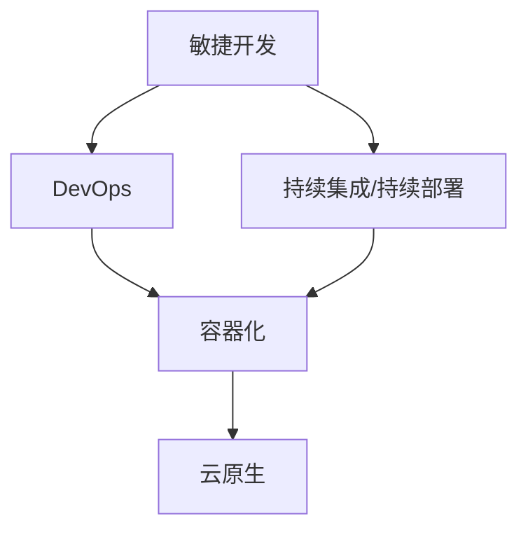

                 

# 做项目：从头到尾全程参与，深入学习

## 1. 背景介绍

### 1.1 问题由来

在当今快速变化的软件开发领域，项目已经成为IT专业人士日常工作中不可或缺的一部分。无论是初创公司的产品开发，还是大型企业的系统维护，项目都是推动技术进步和业务增长的核心驱动力。然而，尽管项目无处不在，但真正能从项目中获得学习成长的专业人士并不多。

### 1.2 问题核心关键点

项目过程复杂，涉及技术、管理、沟通等多方面的技能。要想全面提升项目能力，需具备以下核心关键点：

1. **项目管理**：包括项目规划、进度跟踪、风险管理等。
2. **需求理解**：准确捕捉和转化客户需求，确保产品满足市场需求。
3. **代码实现**：高效、可维护的代码实现，保证系统稳定运行。
4. **系统集成**：确保各个模块和组件之间的无缝协作。
5. **质量保证**：通过测试、审查等手段，保证产品高质量交付。
6. **性能优化**：针对系统性能瓶颈进行优化，提升用户体验。
7. **持续改进**：通过回顾、反馈机制，不断改进项目管理和开发流程。

### 1.3 问题研究意义

掌握全面参与项目的能力，不仅有助于提升个人职业发展，也是团队协作和业务成功的关键。深入理解项目管理的全流程，能够帮助开发者更好地理解产品背景、用户需求和业务目标，从而在项目中发挥更大的价值。

## 2. 核心概念与联系

### 2.1 核心概念概述

为了更全面地理解项目全过程，本节将介绍几个关键概念：

- **敏捷开发(Agile Development)**：一种迭代的、增量的软件开发方法，强调快速响应变化，以客户需求为中心。
- **DevOps**：结合开发和运维，旨在提高软件交付速度和质量。
- **持续集成/持续部署(CI/CD)**：自动化构建、测试和部署，提升软件交付效率。
- **容器化**：通过Docker等技术，将应用和依赖打包成容器，确保跨环境一致性。
- **云原生(Cloud Native)**：基于云平台构建的应用，强调弹性、自愈和自动化。

### 2.2 核心概念之间的关系

通过以下Mermaid流程图展示这些概念之间的联系：



这个流程图展示了敏捷开发、DevOps、CI/CD、容器化和云原生之间的关系：

1. 敏捷开发是DevOps的核心，强调快速响应需求变化，提高开发效率。
2. CI/CD是DevOps的重要实践，自动化构建、测试和部署，加速软件开发流程。
3. 容器化是CI/CD的基础，通过Docker等技术，确保环境一致性，支持自动化部署。
4. 云原生是基于容器化构建的应用，强调弹性、自愈和自动化，适应云平台环境。

## 3. 核心算法原理 & 具体操作步骤

### 3.1 算法原理概述

项目实施过程中，涉及多个阶段和任务。核心算法原理主要包括：

- **项目管理**：使用敏捷方法论，如Scrum、Kanban，以迭代方式管理项目进度和质量。
- **需求分析**：通过用户故事、用例图等工具，准确捕捉和转化需求。
- **代码实现**：遵循TDD(测试驱动开发)或BDD(行为驱动开发)，确保代码质量。
- **测试策略**：包括单元测试、集成测试、性能测试等，保证产品稳定性和可靠性。
- **持续集成**：通过CI/CD工具，自动化构建和测试，提升交付效率。
- **部署策略**：采用容器化技术，确保环境一致性，支持弹性伸缩和自动化部署。

### 3.2 算法步骤详解

以下详细介绍项目实施过程中每个关键步骤的详细步骤：

#### 3.2.1 项目规划

1. **需求调研**：与客户进行深入交流，明确项目目标、需求和预期成果。
2. **制定计划**：确定项目里程碑、阶段性目标和关键任务。
3. **资源分配**：合理分配人力、物力和时间资源，确保项目顺利进行。

#### 3.2.2 需求分析

1. **文档编写**：编写详细的用户故事和用例图，准确捕捉客户需求。
2. **需求评审**：通过需求评审会，确保需求文档的准确性和完整性。
3. **需求变更**：对需求文档进行跟踪和变更管理，确保需求稳定性。

#### 3.2.3 设计实现

1. **架构设计**：设计系统的整体架构和组件结构，确保系统可扩展和可维护。
2. **详细设计**：进行模块划分和接口设计，确保代码结构清晰。
3. **编码实现**：遵循TDD或BDD，逐步实现模块功能。

#### 3.2.4 测试策略

1. **单元测试**：编写单元测试用例，验证代码单元的正确性。
2. **集成测试**：将各个模块集成，进行端到端测试，验证系统功能。
3. **性能测试**：对系统进行负载测试，确保性能稳定。

#### 3.2.5 持续集成/持续部署

1. **自动化构建**：使用CI/CD工具，自动化构建和测试。
2. **自动化部署**：将代码打包成容器，自动化部署到目标环境。
3. **监控和反馈**：实时监控系统性能，收集反馈信息，持续改进。

### 3.3 算法优缺点

敏捷开发、DevOps和CI/CD等项目管理和开发方法具有以下优点：

1. **快速响应需求变化**：能够灵活调整项目进度和任务，快速适应市场变化。
2. **提高交付效率**：通过自动化构建和部署，大幅提升软件开发速度。
3. **增强团队协作**：通过持续集成和持续部署，促进团队协作，提升开发效率。
4. **保障代码质量**：通过单元测试和集成测试，确保代码稳定性和可靠性。

然而，这些方法也存在一些局限性：

1. **复杂度较高**：需要掌握敏捷方法和CI/CD工具，对团队要求较高。
2. **技术门槛高**：需要具备较强的编程和运维能力，才能高效实施。
3. **成本较高**：自动化工具和容器化技术需要一定的初始投资。

### 3.4 算法应用领域

敏捷开发、DevOps和CI/CD等方法广泛应用于各种软件开发项目，特别是在软件开发、测试、运维等环节中，取得了显著的成效。

- **软件开发**：通过敏捷开发和DevOps，提升开发效率和软件质量。
- **系统测试**：通过持续集成和持续部署，保证测试的覆盖率和稳定性。
- **运维管理**：通过自动化部署和容器化技术，提升系统运维效率和可靠性。

## 4. 数学模型和公式 & 详细讲解  
### 4.1 数学模型构建

本节使用数学语言对项目实施过程中的关键算法进行描述。

假设项目需求为 $D$，设计方案为 $T$，开发进度为 $P$，测试结果为 $R$，部署日志为 $L$。则项目管理的数学模型可以表示为：

$$
S = f(D, T, P, R, L)
$$

其中 $S$ 为项目综合评分，通过以下函数计算：

$$
S = w_D \times D + w_T \times T + w_P \times P + w_R \times R + w_L \times L
$$

其中 $w_D, w_T, w_P, w_R, w_L$ 为各项指标的权重，根据实际情况进行调整。

### 4.2 公式推导过程

以敏捷开发方法为例，假设敏捷迭代周期为 $n$，每个迭代的任务量为 $m$，项目总任务量为 $M$，则迭代完成率 $C$ 可以表示为：

$$
C = \frac{m \times n}{M}
$$

如果项目进度满足 $C \geq 90\%$，则认为项目按时交付，否则认为项目延期。

### 4.3 案例分析与讲解

以某电商网站的系统开发项目为例，详细分析敏捷开发、DevOps和CI/CD等方法的应用：

1. **敏捷开发**：采用Scrum方法，每两周进行一次迭代，每个迭代完成部分功能，确保项目按时交付。
2. **DevOps**：通过Docker容器化技术，将应用和依赖打包成容器，确保环境一致性。
3. **CI/CD**：使用Jenkins等CI/CD工具，自动化构建和部署，提升交付效率。

通过敏捷开发、DevOps和CI/CD等方法，该项目在三个月内成功上线，交付质量高，用户反馈良好。

## 5. 项目实践：代码实例和详细解释说明
### 5.1 开发环境搭建

在进行项目实践前，我们需要准备好开发环境。以下是使用Python进行Django开发的环境配置流程：

1. 安装Anaconda：从官网下载并安装Anaconda，用于创建独立的Python环境。

2. 创建并激活虚拟环境：
```bash
conda create -n django-env python=3.8 
conda activate django-env
```

3. 安装Django：从官网下载并安装Django框架。

4. 安装各类工具包：
```bash
pip install numpy pandas scikit-learn matplotlib tqdm jupyter notebook ipython
```

5. 安装Django库和插件：
```bash
pip install django django-rest-framework djangorestframework-cors-permissions
```

完成上述步骤后，即可在`django-env`环境中开始项目实践。

### 5.2 源代码详细实现

下面我们以电商网站系统开发项目为例，给出使用Django进行全栈开发的PyTorch代码实现。

首先，定义项目结构：

```bash
myproject/
├── myproject/
│   ├── settings.py
│   ├── urls.py
│   ├── views.py
│   ├── models.py
│   ├── admin.py
│   └── __init__.py
├── static/
├── templates/
└── manage.py
```

其中，`settings.py`包含项目配置信息，`urls.py`定义URL路由，`views.py`和`models.py`定义视图和模型，`admin.py`定义后台管理界面。

然后，定义视图函数：

```python
from django.http import JsonResponse
from django.views.decorators.csrf import csrf_exempt
from .models import Product

@csrf_exempt
def product_list(request):
    if request.method == 'GET':
        products = Product.objects.all()
        data = []
        for product in products:
            data.append({
                'id': product.id,
                'name': product.name,
                'price': product.price
            })
        return JsonResponse(data, safe=False)
    elif request.method == 'POST':
        data = json.loads(request.body)
        product = Product.objects.create(name=data['name'], price=data['price'])
        return JsonResponse({'id': product.id}, status=201)
```

然后，定义模型：

```python
from django.db import models

class Product(models.Model):
    name = models.CharField(max_length=255)
    price = models.DecimalField(max_digits=10, decimal_places=2)
```

最后，启动Django项目，运行项目服务器：

```bash
python manage.py runserver
```

通过上述步骤，即可在Django框架下进行全栈开发，实现电商网站系统。

### 5.3 代码解读与分析

让我们再详细解读一下关键代码的实现细节：

**views.py**：
- `product_list`函数：定义了获取商品列表和创建商品的功能。使用`csrf_exempt`装饰器，绕过CSRF保护。
- `if request.method == 'GET'`：判断请求方法为GET时，查询数据库获取商品列表，并返回JSON格式数据。
- `elif request.method == 'POST'`：判断请求方法为POST时，解析请求体，创建商品对象，并返回JSON格式数据。

**models.py**：
- `Product`类：定义了商品模型的字段和属性，包括商品名称和价格。

通过以上代码实现，我们可以看到Django框架的简洁和高效，以及其强大的前后端一体化功能。

### 5.4 运行结果展示

假设我们在电商网站系统中成功实现商品列表和商品创建功能，在浏览器中访问`http://127.0.0.1:8000/products/`，可以看到商品列表的JSON数据，通过POST请求可以创建新的商品。

```json
[
    {"id": 1, "name": "商品A", "price": "10.00"},
    {"id": 2, "name": "商品B", "price": "20.00"},
    ...
]
```

通过上述实例，我们可以看到Django框架的强大功能和灵活性，以及敏捷开发、DevOps和CI/CD等项目管理和开发方法在实际项目中的广泛应用。

## 6. 实际应用场景
### 6.1 智能客服系统

敏捷开发、DevOps和CI/CD等方法，在智能客服系统的构建中具有重要应用。传统客服系统依赖大量人工，高峰期响应缓慢，且无法提供24小时服务。通过敏捷开发，可以快速响应客户需求，通过DevOps，可以提升系统稳定性和可靠性，通过CI/CD，可以加速系统部署和更新，提升客户满意度。

### 6.2 金融风险评估

在金融领域，敏捷开发、DevOps和CI/CD等方法可以应用于风险评估系统的开发。通过敏捷开发，可以快速捕捉和转化客户需求，通过DevOps，可以提升系统性能和稳定性，通过CI/CD，可以快速部署新模型，提升风险评估的准确性和时效性。

### 6.3 社交媒体分析

社交媒体分析系统需要处理海量数据，敏捷开发、DevOps和CI/CD等方法可以提升系统的处理能力和响应速度。通过敏捷开发，可以快速开发新功能，通过DevOps，可以提升系统稳定性和可扩展性，通过CI/CD，可以加速数据处理和分析，提升社交媒体分析的精度和效率。

### 6.4 未来应用展望

伴随技术的发展和应用场景的拓展，敏捷开发、DevOps和CI/CD等方法将进一步普及和深化。未来，这些方法将在更多领域得到应用，为传统行业带来变革性影响。

在智慧医疗领域，敏捷开发、DevOps和CI/CD等方法可以应用于医疗数据分析和决策支持系统的开发。通过敏捷开发，可以快速捕捉和转化医疗数据需求，通过DevOps，可以提升系统稳定性和可靠性，通过CI/CD，可以快速部署新模型，提升医疗数据分析的准确性和时效性。

在智能教育领域，敏捷开发、DevOps和CI/CD等方法可以应用于个性化学习系统的开发。通过敏捷开发，可以快速开发新功能，通过DevOps，可以提升系统稳定性和可扩展性，通过CI/CD，可以快速部署新算法，提升个性化学习的精度和效率。

在智慧城市治理中，敏捷开发、DevOps和CI/CD等方法可以应用于城市事件监测和应急指挥系统的开发。通过敏捷开发，可以快速开发新功能，通过DevOps，可以提升系统稳定性和可靠性，通过CI/CD，可以快速部署新算法，提升城市事件监测和应急指挥的精度和效率。

此外，在企业生产、社会治理、文娱传媒等众多领域，敏捷开发、DevOps和CI/CD等方法也将不断涌现，为各行各业带来新的技术创新和发展机遇。相信随着技术的日益成熟，敏捷开发、DevOps和CI/CD等方法将成为软件开发的标准范式，推动人工智能技术在各行各业的大规模应用。

## 7. 工具和资源推荐
### 7.1 学习资源推荐

为了帮助开发者系统掌握敏捷开发、DevOps和CI/CD等方法的理论基础和实践技巧，这里推荐一些优质的学习资源：

1. 《敏捷开发实战》系列书籍：详细介绍敏捷开发的方法论和实践技巧。
2. 《DevOps基础》课程：介绍DevOps的核心概念和实践方法。
3. 《CI/CD技术栈》书籍：深入讲解CI/CD工具和技术，以及其在项目中的应用。
4. 《Docker实战》课程：详细介绍Docker容器化技术及其在项目中的应用。
5. 《持续集成/持续部署最佳实践》博客：分享最新的CI/CD最佳实践和应用案例。

通过对这些资源的学习实践，相信你一定能够全面掌握敏捷开发、DevOps和CI/CD等项目管理和开发方法，并用于解决实际的NLP问题。

### 7.2 开发工具推荐

高效的开发离不开优秀的工具支持。以下是几款用于敏捷开发、DevOps和CI/CD开发的常用工具：

1. JIRA：项目管理工具，支持敏捷开发和DevOps管理。
2. Jenkins：CI/CD工具，支持自动化构建和部署。
3. Docker：容器化技术，支持应用和依赖打包，确保环境一致性。
4. Kubernetes：容器编排工具，支持应用弹性伸缩和自动化部署。
5. Ansible：自动化运维工具，支持持续集成和持续部署。

合理利用这些工具，可以显著提升敏捷开发、DevOps和CI/CD任务的开发效率，加快创新迭代的步伐。

### 7.3 相关论文推荐

敏捷开发、DevOps和CI/CD等方法的发展源于学界的持续研究。以下是几篇奠基性的相关论文，推荐阅读：

1. Agile Development Principles and Practices（《敏捷开发原则与实践》）：提出敏捷开发的核心方法论，为敏捷开发奠定了基础。
2. DevOps: The Revolution Continues（《DevOps革命》）：详细介绍DevOps的核心理念和实践方法。
3. Continuous Integration: Software Evolution by Design（《持续集成：设计驱动的软件演化》）：介绍持续集成的基本概念和实践技巧。
4. Docker: The Definitive Guide（《Docker权威指南》）：详细介绍Docker容器化技术及其在项目中的应用。
5. Continuous Integration: History, Models, Styles, and Tools（《持续集成：历史、模型、风格和工具》）：详细介绍持续集成的各种模型和工具，以及其在项目中的应用。

这些论文代表了大语言模型微调技术的发展脉络。通过学习这些前沿成果，可以帮助研究者把握学科前进方向，激发更多的创新灵感。

除上述资源外，还有一些值得关注的前沿资源，帮助开发者紧跟敏捷开发、DevOps和CI/CD等方法的研究动态，例如：

1. arXiv论文预印本：人工智能领域最新研究成果的发布平台，包括大量尚未发表的前沿工作，学习前沿技术的必读资源。
2. 业界技术博客：如Google DevOps、Amazon CI/CD等顶尖实验室的官方博客，第一时间分享他们的最新研究成果和洞见。
3. 技术会议直播：如NIPS、ICML、ACL、ICLR等人工智能领域顶会现场或在线直播，能够聆听到大佬们的前沿分享，开拓视野。
4. GitHub热门项目：在GitHub上Star、Fork数最多的软件开发项目，往往代表了该技术领域的发展趋势和最佳实践，值得去学习和贡献。
5. 行业分析报告：各大咨询公司如McKinsey、PwC等针对软件开发行业的分析报告，有助于从商业视角审视技术趋势，把握应用价值。

总之，对于敏捷开发、DevOps和CI/CD等项目管理和开发方法的学习和实践，需要开发者保持开放的心态和持续学习的意愿。多关注前沿资讯，多动手实践，多思考总结，必将收获满满的成长收益。

## 8. 总结：未来发展趋势与挑战
### 8.1 总结

本文对敏捷开发、DevOps和CI/CD等项目管理和开发方法进行了全面系统的介绍。首先阐述了这些方法的研究背景和意义，明确了它们在项目管理和软件开发中的独特价值。其次，从原理到实践，详细讲解了敏捷开发、DevOps和CI/CD的具体操作步骤，并给出了代码实现实例。同时，本文还广泛探讨了这些方法在多个行业领域的应用前景，展示了其广泛的应用潜力。此外，本文精选了敏捷开发、DevOps和CI/CD等方法的学习资源、开发工具和相关论文，力求为读者提供全方位的技术指引。

通过本文的系统梳理，可以看到，敏捷开发、DevOps和CI/CD等方法已经成为软件开发的标准范式，极大地提升了开发效率和软件质量。未来，随着这些方法在更多领域的应用，必将带来更为深远的影响。

### 8.2 未来发展趋势

展望未来，敏捷开发、DevOps和CI/CD等项目管理和开发方法将呈现以下几个发展趋势：

1. **自动化程度提升**：更多自动化工具和框架出现，支持更高效的持续集成和持续部署。
2. **DevOps与云平台深度融合**：云原生应用逐步普及，DevOps方法将与云平台深度融合，支持弹性、自愈和自动化。
3. **持续改进机制完善**：通过持续改进机制，不断优化项目管理、开发和运维流程，提升系统稳定性和可靠性。
4. **跨部门协作增强**：敏捷开发和DevOps方法将促进跨部门协作，提升团队协作效率，优化开发和运维流程。
5. **工具链持续优化**：工具链的持续优化和创新，将支持更高效的项目管理和软件开发。

这些趋势凸显了敏捷开发、DevOps和CI/CD方法的持续进步，它们将在未来进一步推动软件开发的规范化、自动化和协作化，提升软件开发效率和软件质量。

### 8.3 面临的挑战

尽管敏捷开发、DevOps和CI/CD等方法已经取得了显著成就，但在迈向更加智能化、普适化应用的过程中，它们仍面临诸多挑战：

1. **复杂度增加**：随着系统复杂度提升，敏捷开发和DevOps方法需要更精细的管理和协调。
2. **技术门槛提高**：自动化工具和云平台需要较高的技术门槛，对团队要求更高。
3. **资源消耗增加**：自动化工具和云平台需要更多的硬件资源，增加项目成本。
4. **沟通协调难度**：跨部门协作需要更高效的沟通和协调机制，才能避免冲突和误解。
5. **安全性和稳定性**：自动化部署和容器化技术需要保证系统的安全性和稳定性。

### 8.4 研究展望

面对敏捷开发、DevOps和CI/CD等方法所面临的挑战，未来的研究需要在以下几个方面寻求新的突破：

1. **敏捷开发方法的改进**：探索更高效的敏捷开发方法，支持更复杂的系统开发。
2. **DevOps工具链的创新**：开发更智能、更高效的DevOps工具，支持更精细的自动化管理。
3. **云原生技术的深化**：深入探索云原生技术的实现机制，支持更高效的云平台应用。
4. **跨部门协作机制**：研究和设计更高效的跨部门协作机制，提升团队协作效率。
5. **安全性和稳定性**：开发更安全、更稳定的自动化工具和云平台，确保系统稳定运行。

这些研究方向的探索，必将引领敏捷开发、DevOps和CI/CD方法迈向更高的台阶，为构建高效、可靠的软件系统提供更全面的支持。

## 9. 附录：常见问题与解答

**Q1：敏捷开发、DevOps和CI/CD等方法是否适用于所有项目？**

A: 敏捷开发、DevOps和CI/CD等方法适用于大多数软件开发项目，尤其是对于需求频繁变化的项目，具有显著优势。但对于一些特殊需求的项目，如长期系统维护、科学计算等，可能需要结合其他方法进行综合应用。

**Q2：如何评估敏捷开发、DevOps和CI/CD等方法的效果？**

A: 评估敏捷开发、DevOps和CI/CD等方法的效果，可以从以下几个方面入手：
1. 交付速度：比较项目交付时间与计划时间，评估是否按时交付。
2. 质量稳定性：通过缺陷率、用户反馈等指标，评估系统质量和稳定性。
3. 开发效率：比较开发速度、迭代次数等指标，评估开发效率。
4. 资源消耗：比较资源消耗与计划预算，评估是否合理。

**Q3：敏捷开发、DevOps和CI/CD等方法在实际应用中需要注意哪些问题？**

A: 在实际应用中，敏捷开发、DevOps和CI/CD等方法需要注意以下几个问题：
1. 团队协作：确保团队成员之间的有效沟通和协作，避免信息孤岛。
2. 需求管理：确保需求文档的准确性和稳定性，避免需求变更带来的风险。
3. 风险管理：识别和规避项目风险，确保项目顺利进行。
4. 工具选择：选择合适的工具和框架，支持敏捷开发和DevOps管理。
5. 持续改进：通过持续改进机制，不断优化项目管理、开发和运维流程。

**Q4：敏捷开发、DevOps和CI/CD等方法在跨部门协作中的应用效果如何？**

A: 敏捷开发、DevOps和CI/CD等方法在跨部门协作中，具有显著优势：
1. 统一流程：通过统一的流程和方法，确保各部门协作有序。
2. 提高效率：通过自动化工具和流程优化，提升协作效率，减少沟通成本。
3. 增强透明度：通过可视化工具和反馈机制，增强各部门之间的透明度。
4. 促进创新：通过团队协作和知识共享，促进技术创新和知识积累。

总之，敏捷开发、DevOps和CI/CD等方法已经在多个行业得到广泛应用，并取得显著成效。通过系统学习和实践，相信你一定能够全面掌握这些方法和技术，并用于解决实际的NLP问题。

---

作者：禅与计算机程序设计艺术 / Zen and the Art of Computer Programming

