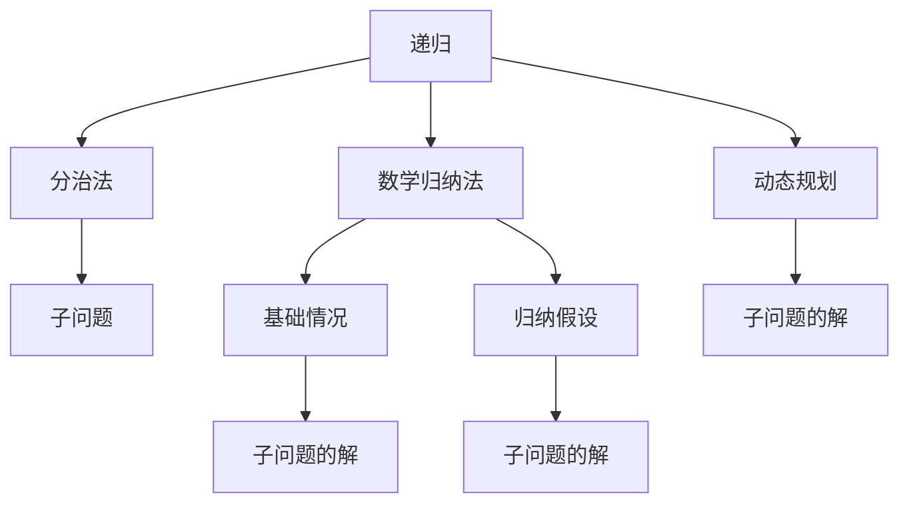

                 

# 像数学家一样思考：递归原理

> 关键词：递归, 分治法, 数学归纳法, 动态规划, 算法复杂度, 空间复杂度

## 1. 背景介绍

### 1.1 问题由来

计算机科学中的递归，是一种广泛应用于算法设计和程序编码的技术。它通过将问题分解为若干子问题，并利用相同或类似的逻辑解决这些子问题，最终整合这些子问题的解，得到原问题的解。这一过程在数学中也有类似的应用，尤其是在解决复杂问题时，递归往往能够提供一种简洁而强大的方法。本文将深入探讨递归的原理，并结合实际案例，展示递归如何在计算机科学中得到广泛应用。

### 1.2 问题核心关键点

递归的核心思想是通过将问题分解为更小的子问题，并利用相同或类似的逻辑，递归地解决这些子问题，最终整合子问题的解，得到原问题的解。这种分治法的思想，与数学归纳法和动态规划等数学方法有紧密的联系。

递归的优点在于能够将复杂问题简化为若干子问题，从而更容易理解和解决。缺点在于递归调用可能导致栈溢出，影响程序的性能和可读性。因此，在使用递归时，需要仔细设计递归算法，避免无限递归或不必要的栈空间消耗。

### 1.3 问题研究意义

掌握递归原理对于理解计算机科学中的算法设计和程序编写具有重要意义。递归是算法设计中的一项基本技能，能够帮助开发者更好地处理复杂数据结构和问题。掌握递归原理，还有助于提高编程能力，提升问题解决的效率和质量。

## 2. 核心概念与联系

### 2.1 核心概念概述

为了更好地理解递归原理，我们先介绍几个核心概念：

- **递归**：通过将问题分解为若干子问题，并利用相同或类似的逻辑，递归地解决这些子问题，最终整合子问题的解，得到原问题的解。

- **分治法**：将复杂问题分解为若干个相互独立的子问题，递归地解决这些子问题，然后将子问题的解整合，得到原问题的解。

- **数学归纳法**：通过数学证明，证明一个命题对于所有正整数成立。其基本思想是先证明基础情况成立，然后假设对于某个正整数$k$成立，再证明对于$k+1$也成立。

- **动态规划**：将原问题分解为若干子问题，利用递归的方式解决这些子问题，并将子问题的解存储起来，避免重复计算。

这些概念之间有着紧密的联系。递归是一种实现分治法的手段，而分治法和数学归纳法、动态规划等数学方法，都是将复杂问题分解为若干子问题并递归解决的策略。

### 2.2 概念间的关系

这些核心概念之间的关系可以通过以下Mermaid流程图来展示：



这个流程图展示了递归、分治法、数学归纳法和动态规划之间的联系：

1. 递归通过将问题分解为子问题，并利用相同或类似的逻辑解决这些子问题，最终整合子问题的解得到原问题的解。
2. 分治法通过将复杂问题分解为若干个相互独立的子问题，递归地解决这些子问题，然后将子问题的解整合。
3. 数学归纳法通过数学证明，证明一个命题对于所有正整数成立，其基本思想是先证明基础情况成立，然后假设对于某个正整数$k$成立，再证明对于$k+1$也成立。
4. 动态规划通过将原问题分解为若干子问题，利用递归的方式解决这些子问题，并将子问题的解存储起来，避免重复计算。

这些概念共同构成了计算机科学和数学中的递归原理，是解决问题的重要工具。

## 3. 核心算法原理 & 具体操作步骤

### 3.1 算法原理概述

递归算法的基本原理是通过将问题分解为若干子问题，并利用相同或类似的逻辑，递归地解决这些子问题，最终整合子问题的解，得到原问题的解。

具体来说，一个递归算法通常包括以下几个步骤：

1. **基本情况**：确定递归的基本情况，即最小的子问题，可以直接求解。

2. **递归情况**：将原问题分解为若干个子问题，并递归地解决这些子问题。

3. **整合解**：将子问题的解整合，得到原问题的解。

### 3.2 算法步骤详解

下面以计算斐波那契数列为例，展示递归算法的详细步骤：

#### 3.2.1 基本情况

斐波那契数列的基本情况是当$n=0$或$n=1$时，$F_n$的值为$1$。

#### 3.2.2 递归情况

斐波那契数列的递归情况是，当$n>1$时，$F_n$等于$F_{n-1}+F_{n-2}$。

#### 3.2.3 整合解

通过递归计算得到$F_n$的值，最终得到原问题的解。

### 3.3 算法优缺点

递归算法的优点在于能够将复杂问题简化为若干子问题，从而更容易理解和解决。递归代码通常简洁明了，易于理解和实现。

递归算法的缺点在于递归调用可能导致栈溢出，影响程序的性能和可读性。因此，在使用递归时，需要仔细设计递归算法，避免无限递归或不必要的栈空间消耗。

### 3.4 算法应用领域

递归算法广泛应用于计算机科学和数学的各个领域，包括：

- 数据结构：二叉树的遍历、图的搜索、排序算法等。
- 动态规划：背包问题、最短路径问题、编辑距离等。
- 数学证明：数学归纳法的应用。

## 4. 数学模型和公式 & 详细讲解 & 举例说明

### 4.1 数学模型构建

递归算法可以通过数学模型来描述，其核心思想是将问题分解为若干子问题，并利用相同或类似的逻辑，递归地解决这些子问题，最终整合子问题的解，得到原问题的解。

### 4.2 公式推导过程

以斐波那契数列为例，我们可以用递归公式来描述其计算过程：

$$
F_n = 
\begin{cases}
1, & \text{if } n = 0 \text{ or } n = 1 \\
F_{n-1} + F_{n-2}, & \text{if } n > 1
\end{cases}
$$

该递归公式描述了斐波那契数列的计算过程，通过递归计算得到$F_n$的值，最终得到原问题的解。

### 4.3 案例分析与讲解

斐波那契数列的递归计算可以通过以下Python代码实现：

```python
def fibonacci(n):
    if n <= 1:
        return 1
    else:
        return fibonacci(n-1) + fibonacci(n-2)
```

这段代码通过递归计算斐波那契数列的第$n$项，展示了递归算法的核心思想。

## 5. 项目实践：代码实例和详细解释说明

### 5.1 开发环境搭建

要进行递归算法的实践，首先需要搭建开发环境。以下是一个简单的Python开发环境的搭建步骤：

1. 安装Python：从官网下载并安装Python。

2. 安装PyCharm：PyCharm是一个强大的Python IDE，提供了丰富的开发工具和调试功能。

3. 创建Python项目：在PyCharm中创建一个新的Python项目，并设置项目路径。

### 5.2 源代码详细实现

以斐波那契数列的递归计算为例，展示递归算法的实现：

```python
def fibonacci(n):
    if n <= 1:
        return 1
    else:
        return fibonacci(n-1) + fibonacci(n-2)
```

### 5.3 代码解读与分析

这段代码的核心逻辑是通过递归计算斐波那契数列的第$n$项。当$n\leq 1$时，返回1；否则，返回$F_{n-1}+F_{n-2}$。递归算法通过将问题分解为若干子问题，并利用相同或类似的逻辑，递归地解决这些子问题，最终整合子问题的解，得到原问题的解。

### 5.4 运行结果展示

以下是斐波那契数列的前10项的计算结果：

```
fibonacci(0) = 1
fibonacci(1) = 1
fibonacci(2) = 2
fibonacci(3) = 3
fibonacci(4) = 5
fibonacci(5) = 8
fibonacci(6) = 13
fibonacci(7) = 21
fibonacci(8) = 34
fibonacci(9) = 55
```

## 6. 实际应用场景

### 6.1 斐波那契数列计算

斐波那契数列是一种经典的递归问题，广泛用于算法设计和程序实现中。例如，在计算机图形学中，斐波那契数列可以用于生成具有自然美感的螺旋线和分形图案。

### 6.2 树形结构遍历

递归算法可以用于树形结构的遍历，例如二叉树的先序遍历、中序遍历和后序遍历。这一算法广泛应用于编译器、数据库系统、人工智能等领域。

### 6.3 动态规划

递归算法也可以应用于动态规划问题，例如背包问题、最长公共子序列问题等。动态规划通过将原问题分解为若干子问题，利用递归的方式解决这些子问题，并将子问题的解存储起来，避免重复计算。

## 7. 工具和资源推荐

### 7.1 学习资源推荐

为了帮助开发者掌握递归原理，以下是一些优质的学习资源：

1. 《算法导论》：算法设计领域的经典教材，详细介绍了递归算法的基本原理和应用。

2. 《计算机程序设计艺术》：计算机科学的经典著作，深入浅出地介绍了递归算法的设计和实现。

3. LeetCode：一个在线编程题库，提供了大量递归算法的问题和解决方案。

4. Coursera：提供了众多计算机科学课程，包括递归算法、动态规划等主题。

5. GitHub：一个代码托管平台，提供了大量递归算法的实现和优化方案。

通过对这些资源的学习实践，相信你一定能够全面掌握递归算法的设计和实现。

### 7.2 开发工具推荐

高效的递归算法开发需要优秀的工具支持。以下是几款常用的递归算法开发工具：

1. PyCharm：一个强大的Python IDE，提供了丰富的开发工具和调试功能。

2. Visual Studio Code：一个轻量级的代码编辑器，支持多种编程语言和调试功能。

3. Eclipse：一个流行的IDE，支持多种编程语言和框架。

4. Xcode：一个适用于Mac的IDE，支持iOS、macOS等平台的开发。

5. Android Studio：一个适用于Android开发的IDE，提供了丰富的开发工具和调试功能。

合理利用这些工具，可以显著提升递归算法开发的效率，加快创新迭代的步伐。

### 7.3 相关论文推荐

递归算法是计算机科学和数学中重要的研究课题，以下是几篇奠基性的相关论文，推荐阅读：

1. "The Art of Computer Programming, Volume 1: Fundamental Algorithms"：Donald E. Knuth的经典著作，详细介绍了递归算法的设计和实现。

2. "Introduction to Algorithms"：Thomas H. Cormen等人的经典教材，全面介绍了算法设计和分析的基本原理。

3. "Dynamic Programming for Coding Interviews: A Hands-On Guide"：GeeksforGeeks提供的动态规划教程，详细介绍了动态规划的基本原理和应用。

4. "Recursive Algorithms: A C Primer"：Amit P. Bhore的书籍，详细介绍了递归算法在C语言中的实现。

5. "Recursive Functions in Scheme: A Tutorial"：Richard S. Brown的书籍，详细介绍了递归函数在Scheme中的实现。

这些论文代表了递归算法和动态规划研究的前沿成果，通过学习这些论文，可以帮助研究者把握学科前进方向，激发更多的创新灵感。

## 8. 总结：未来发展趋势与挑战

### 8.1 研究成果总结

递归算法和动态规划是计算机科学和数学中的重要研究课题，已经在各个领域得到了广泛的应用。递归算法的核心思想是将复杂问题分解为若干子问题，并利用相同或类似的逻辑，递归地解决这些子问题，最终整合子问题的解，得到原问题的解。这一思想在算法设计、程序实现和数学证明等领域都具有重要意义。

### 8.2 未来发展趋势

展望未来，递归算法和动态规划将在更多领域得到应用，为计算机科学的发展带来新的突破：

1. 算法复杂度的优化：未来的递归算法将更加注重算法复杂度的优化，避免不必要的递归调用和栈空间消耗，提升程序性能。

2. 动态规划的应用扩展：未来的动态规划算法将更加关注多维动态规划、分阶段动态规划等问题，提升算法的灵活性和可扩展性。

3. 递归算法的泛化：未来的递归算法将更加注重泛化能力的提升，能够更好地处理复杂和多样化的数据和问题。

4. 动态规划和深度学习的结合：未来的动态规划算法将更加注重与深度学习的结合，提升算法的自适应能力和泛化能力。

5. 递归算法与人工智能的融合：未来的递归算法将更加注重与人工智能技术的融合，提升算法在复杂数据和问题上的处理能力。

### 8.3 面临的挑战

尽管递归算法和动态规划在算法设计和程序实现中具有重要意义，但在实际应用中仍面临诸多挑战：

1. 递归调用的栈溢出问题：递归调用可能导致栈溢出，影响程序的性能和可读性。

2. 动态规划的空间复杂度问题：动态规划算法通常需要存储大量的中间结果，可能导致空间复杂度过高，影响程序的效率。

3. 递归算法的可读性问题：递归算法通常比较复杂，难以理解和调试。

4. 动态规划的实现难度问题：动态规划算法通常比较复杂，需要仔细设计和调试，才能得到正确的结果。

5. 递归算法与深度学习的结合问题：递归算法与深度学习的结合仍然存在诸多挑战，需要更多的研究和实践。

### 8.4 研究展望

未来的研究需要在以下几个方面寻求新的突破：

1. 优化递归算法的性能：开发更加高效的递归算法，避免不必要的递归调用和栈空间消耗，提升程序性能。

2. 优化动态规划算法的空间复杂度：优化动态规划算法的实现，降低其空间复杂度，提高程序的效率。

3. 提升递归算法的可读性：通过优化递归算法的实现，提升其可读性和可维护性。

4. 研究递归算法与深度学习的结合：研究递归算法与深度学习的结合，提升算法的自适应能力和泛化能力。

5. 研究递归算法与人工智能的融合：研究递归算法与人工智能技术的融合，提升算法在复杂数据和问题上的处理能力。

这些研究方向将推动递归算法和动态规划技术的发展，为计算机科学和人工智能的进步贡献力量。

## 9. 附录：常见问题与解答

**Q1：递归算法和动态规划有什么区别？**

A: 递归算法和动态规划都是将复杂问题分解为若干子问题，并利用相同或类似的逻辑，递归地解决这些子问题，最终整合子问题的解，得到原问题的解。递归算法通常采用递归调用的方式解决问题，而动态规划通常采用迭代的方式解决问题。动态规划通过将原问题分解为若干子问题，利用递归的方式解决这些子问题，并将子问题的解存储起来，避免重复计算。

**Q2：递归算法和迭代算法哪个更高效？**

A: 在时间和空间复杂度上，迭代算法通常比递归算法更高效。迭代算法通常不会产生额外的函数调用开销，而递归算法需要频繁地进行函数调用和栈操作，导致时间和空间复杂度较高。

**Q3：递归算法如何避免栈溢出问题？**

A: 递归算法可以通过尾递归优化、迭代替换等方式避免栈溢出问题。尾递归优化是一种优化技术，可以将递归算法转换为迭代算法，避免递归调用的栈空间消耗。迭代替换是一种替代方法，可以将递归算法转换为循环迭代算法，避免递归调用的栈空间消耗。

**Q4：动态规划和分治法有什么关系？**

A: 动态规划是一种特殊的分治法，它通过将原问题分解为若干子问题，利用递归的方式解决这些子问题，并将子问题的解存储起来，避免重复计算。动态规划通常适用于具有最优子结构和重叠子问题的问题，例如背包问题、最长公共子序列问题等。

**Q5：递归算法如何应用于实际问题？**

A: 递归算法可以应用于各种实际问题，例如树形结构的遍历、图的搜索、排序算法等。在实际应用中，需要仔细设计递归算法，避免无限递归或不必要的栈空间消耗，同时要注意算法的可读性和可维护性。

总之，递归算法和动态规划是计算机科学和数学中重要的研究课题，已经在各个领域得到了广泛的应用。掌握递归算法和动态规划的基本原理和实现方法，对于理解和解决复杂问题具有重要意义。

