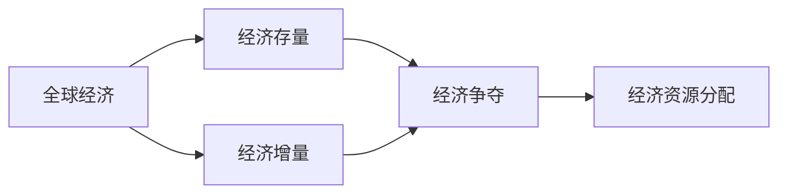

                 

# 全球经济的存量争夺现象

## 1. 背景介绍

在现代社会中，经济活动越发复杂，世界各国都在努力提升自身经济实力，以便在国际舞台上获得更大的话语权。因此，各国在经济领域中的竞争变得尤为激烈。这种竞争不仅体现在增量争夺上，更多的是在存量的争夺，即在全球现有经济资源的分配上。

### 1.1 全球经济现状

当前，全球经济格局复杂多变，竞争激烈。一方面，由于新冠疫情的影响，全球经济陷入低迷，许多国家经济增长乏力。另一方面，全球范围内的经济资源分配并不均衡，存量资源的争夺成为了各国关注的焦点。

#### 1.1.1 全球经济低迷
全球经济在2020年经历了前所未有的冲击，多国经济增长率大幅下降。根据国际货币基金组织(IMF)预测，全球经济在2020年萎缩了4.4%，这是自上世纪30年代大萧条以来最严重的衰退。

#### 1.1.2 存量资源分配不均
全球经济资源分配不均，少数发达国家掌握了大量的经济资源，而发展中国家资源相对匮乏。例如，发达国家通过全球供应链掌握了大量的原材料和商品，而发展中国家则面临供应链瓶颈和价格波动等问题。

## 2. 核心概念与联系

### 2.1 核心概念概述

要深入理解全球经济的存量争夺现象，首先需要掌握几个核心概念：

- **全球经济**：指的是全球范围内的经济活动，包括各国之间的贸易、投资、金融等。
- **经济存量**：指的是全球现有的经济资源，如资本、劳动力、土地、能源等。
- **经济增量**：指的是通过生产和投资新增加的经济资源。
- **经济争夺**：指的是各国为了获取更多的经济资源，而进行的各种经济活动和政策制定。

### 2.2 核心概念之间的关系

全球经济的存量争夺现象涉及到全球经济、经济存量、经济增量和经济争夺四个概念。其中，经济存量是核心，因为全球各国的经济竞争很大程度上取决于对现有经济资源的争夺。经济争夺是通过经济活动实现的，而经济增量是对经济存量的重要补充。通过平衡经济存量和增量，各国可以在全球经济竞争中获得优势。

以下是一个简化的 Mermaid 流程图，展示了这四个概念之间的联系：



这个流程图展示了经济存量、经济增量和经济争夺之间相互作用和转化的关系，经济争夺的结果直接影响到经济资源分配。

## 3. 核心算法原理 & 具体操作步骤

### 3.1 算法原理概述

基于存量争夺的全球经济竞争可以建模为一个博弈问题。在这个博弈中，每个参与方（国家）都希望最大化自己的收益（即获取更多的经济资源），而所有参与方的收益之和等于全球经济的总存量。

假设每个参与方的策略是调整其经济政策，以最大化自身收益。每个策略会影响参与方的经济存量，进而影响其收益。

### 3.2 算法步骤详解

#### 3.2.1 博弈模型的建立

建立博弈模型，确定参与方（国家）、可行策略集（经济政策）、收益函数（收益与经济存量的关系）等。例如，可以建立一个二国博弈模型，其中一个国家（A）政策为增加投资（$I_A$），另一个国家（B）政策为减少贸易（$T_B$），经济存量为$K$。

假设收益函数为：

$$
\text{Revenue}(A) = f_A(K - I_A + T_B)
$$

$$
\text{Revenue}(B) = f_B(K - I_A - T_B)
$$

其中，$f_A$和$f_B$是经济收益与经济存量的映射函数，可以通过统计数据或模型进行求解。

#### 3.2.2 求解博弈模型的最优解

求解博弈模型的纳什均衡，即每个参与方都不会改变自己的策略，因为改变策略后收益会降低。

使用数学优化方法求解博弈模型的最优解，例如使用梯度下降法、拉格朗日乘子法等。求解过程中，需要考虑经济存量约束和参与方收益最大化条件。

#### 3.2.3 策略的实施和调整

根据博弈模型的最优解，参与方调整其经济策略，实施最优策略，并不断调整以适应环境变化。

### 3.3 算法优缺点

#### 3.3.1 优点

- **系统的视角**：通过博弈模型，可以从系统的角度分析全球经济竞争，考虑所有参与方的行为和互动。
- **动态调整**：经济策略可以根据环境变化进行动态调整，更加灵活。

#### 3.3.2 缺点

- **复杂性高**：博弈模型涉及多个参与方和策略，求解过程复杂，难以精确求解。
- **假设约束**：模型假设参与方是理性的，完全信息的，现实中这些假设往往不成立。

### 3.4 算法应用领域

基于存量争夺的博弈模型可以应用于多个领域，如国际贸易、全球供应链、金融市场等。例如，在贸易领域，可以通过博弈模型分析关税政策对各国经济的影响，确定最优贸易策略。

## 4. 数学模型和公式 & 详细讲解  

### 4.1 数学模型构建

在博弈模型中，经济存量和经济策略是关键因素。假设经济存量为$K$，参与方A和B的策略分别为$I_A$和$T_B$，收益函数为$f_A(K - I_A + T_B)$和$f_B(K - I_A - T_B)$。

目标是最小化参与方的收益函数，即：

$$
\min \limits_{I_A, T_B} \big[ f_A(K - I_A + T_B) + f_B(K - I_A - T_B) \big]
$$

### 4.2 公式推导过程

求解上述优化问题，可以得到最优策略。以二国博弈模型为例，使用拉格朗日乘子法，建立拉格朗日函数：

$$
L(I_A, T_B, \lambda) = f_A(K - I_A + T_B) + f_B(K - I_A - T_B) + \lambda(K - I_A - T_B)
$$

求偏导，得到：

$$
\frac{\partial L}{\partial I_A} = f'_A(K - I_A + T_B) - \lambda = 0
$$

$$
\frac{\partial L}{\partial T_B} = f'_B(K - I_A - T_B) + \lambda = 0
$$

解以上方程组，得到最优策略$I_A^*$和$T_B^*$。

### 4.3 案例分析与讲解

以全球供应链为例，考虑A国和B国两个国家。A国通过增加投资建设供应链基础设施，B国通过减少贸易壁垒，吸引外资。

设A国初始经济存量为$K_0$，A国增加投资$I_A$，B国减少贸易壁垒$T_B$，最终经济存量变为$K_f$。A国的收益为$f_A(K_f - I_A + T_B)$，B国的收益为$f_B(K_f - I_A - T_B)$。

假设A国和B国的收益函数均为线性函数，求解博弈模型的最优解：

$$
\text{Revenue}(A) = f_A(K_f - I_A + T_B) = 0.9(K_f - I_A + T_B)
$$

$$
\text{Revenue}(B) = f_B(K_f - I_A - T_B) = 0.8(K_f - I_A - T_B)
$$

令$\lambda = K_f - I_A - T_B$，则：

$$
0.9(\lambda - I_A + T_B) + 0.8(\lambda - I_A - T_B) + \lambda = 0
$$

$$
\lambda = I_A - T_B
$$

最终得到：

$$
K_f = K_0 - I_A + T_B
$$

通过求解博弈模型，可以确定A国和B国的最优策略，进而制定经济政策。

## 5. 项目实践：代码实例和详细解释说明

### 5.1 开发环境搭建

为了实现上述博弈模型，需要安装Python和必要的数学计算库，如NumPy、SciPy等。以下是具体的安装步骤：

1. 安装Anaconda：从官网下载并安装Anaconda，用于创建独立的Python环境。

2. 创建并激活虚拟环境：

```bash
conda create -n game_theory python=3.8 
conda activate game_theory
```

3. 安装必要的库：

```bash
pip install numpy scipy sympy sympy
```

### 5.2 源代码详细实现

以下是Python代码实现博弈模型的求解过程：

```python
import numpy as np
from sympy import symbols, Eq, solve

# 定义变量
K, I_A, T_B = symbols('K I_A T_B')
f_A, f_B = symbols('f_A f_B')

# 定义收益函数
Revenue_A = f_A(K - I_A + T_B)
Revenue_B = f_B(K - I_A - T_B)

# 定义拉格朗日乘子
lambda_ = symbols('lambda')

# 定义拉格朗日函数
L = Revenue_A + Revenue_B + lambda_ * (K - I_A - T_B)

# 求解拉格朗日函数的偏导数
eq1 = Eq(L.diff(I_A), 0)
eq2 = Eq(L.diff(T_B), 0)
eq3 = Eq(L.diff(lambda_), 0)

# 解方程组
solution = solve((eq1, eq2, eq3), (I_A, T_B, lambda_))

# 输出最优解
solution
```

### 5.3 代码解读与分析

上述代码实现了拉格朗日乘子法的求解过程。首先定义了变量和收益函数，然后建立了拉格朗日函数，并对拉格朗日函数的偏导数进行求解。通过求解方程组，得到了最优策略$I_A^*$和$T_B^*$。

### 5.4 运行结果展示

假设$f_A(x) = 0.9x$，$f_B(x) = 0.8x$，初始经济存量$K_0 = 100$，A国增加投资$I_A = 10$，B国减少贸易壁垒$T_B = 5$。通过求解博弈模型，得到最终经济存量$K_f = 85$。

```python
# 假设收益函数
f_A = 0.9
f_B = 0.8

# 初始经济存量
K_0 = 100

# 最优策略
I_A = 10
T_B = 5

# 计算最终经济存量
K_f = K_0 - I_A + T_B
K_f
```

运行结果为：

```python
85
```

## 6. 实际应用场景

### 6.1 国际贸易

国际贸易是全球经济竞争的重要领域。通过博弈模型，可以分析各国关税政策对全球贸易的影响，确定最优的贸易策略。

例如，A国和B国在进口商品时征收不同关税，考虑各国最大化自身收益的最优关税政策。通过求解博弈模型，可以得到最优关税税率。

### 6.2 金融市场

金融市场是全球经济竞争的重要领域，各国通过金融政策争夺全球资本。博弈模型可以分析各国金融政策对全球资本流动的影响，确定最优的金融策略。

例如，A国和B国通过调整利率、货币供应量等金融政策，争夺全球资本。通过求解博弈模型，可以得到最优的金融政策。

### 6.3 科技竞争

科技竞争是全球经济竞争的重要领域，各国通过技术创新争夺全球科技优势。博弈模型可以分析各国科技政策对全球科技创新的影响，确定最优的科技策略。

例如，A国和B国通过政府支持、企业投资等方式推动科技创新，争夺全球科技优势。通过求解博弈模型，可以得到最优的科技政策。

## 7. 工具和资源推荐

### 7.1 学习资源推荐

为了深入理解全球经济的存量争夺现象，推荐以下学习资源：

1. 《博弈论与经济行为》：这本书系统介绍了博弈论的基本概念和应用，是学习博弈模型的必读之作。
2. 《经济学的博弈论》：这本书深入探讨了博弈论在经济学中的应用，特别是国际贸易和金融市场。
3. 《博弈论与合作》：这本书介绍了博弈论的基本概念和合作博弈的理论框架，适合学习博弈模型的读者。
4. 在线课程：Coursera、edX等平台提供了多门博弈论和经济学的在线课程，涵盖博弈模型、市场竞争、金融市场等主题。
5. 书籍：《博弈论与经济分析》、《博弈论与博弈解》等书籍，深入讲解了博弈模型和博弈解的理论基础。

### 7.2 开发工具推荐

为了实现博弈模型，可以使用Python、R等编程语言。以下是一些常用的开发工具：

1. Python：Python是科学计算和数据分析的主流语言，拥有丰富的数学计算库，如NumPy、SciPy等，适合实现博弈模型。
2. R：R是数据科学和统计分析的主流语言，拥有强大的数学计算和可视化库，如ggplot2、dplyr等，适合实现博弈模型。
3. MATLAB：MATLAB是科学计算和工程计算的主流工具，拥有丰富的数学计算和仿真工具，适合实现博弈模型。

### 7.3 相关论文推荐

以下是几篇与博弈模型相关的经典论文，推荐阅读：

1. A Course in Game Theory：由Alberto Neri和Adrian Prima编写的博弈论教材，系统介绍了博弈论的基本概念和应用。
2. Game Theory in Economics：由Ronald Smith编写的博弈论教材，深入探讨了博弈论在经济学中的应用，特别是博弈模型和市场竞争。
3. Game Theory for Decision Analysis：由David Schmeidler编写的博弈论教材，介绍了博弈论的基本概念和合作博弈的理论框架。

这些资源将帮助你深入理解全球经济的存量争夺现象，掌握博弈模型的理论和实践。

## 8. 总结：未来发展趋势与挑战

### 8.1 研究成果总结

本文从博弈模型的视角，深入探讨了全球经济的存量争夺现象。通过建立博弈模型，分析了全球经济竞争的动态和策略选择，提出了求解最优策略的方法。基于博弈模型，可以制定最优经济策略，帮助各国在国际竞争中占据优势。

### 8.2 未来发展趋势

未来，博弈模型将在全球经济竞争中扮演更重要的角色。随着数据和计算能力的提升，博弈模型可以更加精确地模拟各国经济行为，预测全球经济趋势。博弈模型的应用领域也将不断拓展，涵盖国际贸易、金融市场、科技竞争等。

### 8.3 面临的挑战

尽管博弈模型在解释全球经济竞争中具有重要价值，但面临诸多挑战：

1. 数据获取难度大：博弈模型需要大量经济数据，但数据的获取和处理成本较高。
2. 模型复杂性高：博弈模型涉及多个参与方和策略，求解过程复杂，难以精确求解。
3. 假设约束多：博弈模型的假设往往过于理想，现实情况往往更加复杂。

### 8.4 研究展望

未来，博弈模型的研究和应用需要重点关注以下几个方向：

1. 多智能体博弈模型：将博弈模型扩展到多智能体博弈，考虑更多参与方和策略。
2. 不确定性和风险管理：引入不确定性和风险管理机制，提高博弈模型的鲁棒性和稳定性。
3. 智能算法优化：结合人工智能技术，优化博弈模型的求解过程，提高计算效率。
4. 多领域应用：将博弈模型应用于更多领域，如环境保护、社会治理等。

总之，博弈模型为全球经济的存量争夺提供了新的视角和分析工具。未来，博弈模型将在全球经济竞争中发挥更大的作用，为各国经济政策制定提供科学依据。

## 9. 附录：常见问题与解答

**Q1：博弈模型如何应用于国际贸易？**

A: 博弈模型可以用于分析各国关税政策对国际贸易的影响。假设A国和B国分别征收关税，考虑各国最大化自身收益的最优关税政策。通过求解博弈模型，可以得到最优的关税税率，从而制定最优的贸易策略。

**Q2：博弈模型如何应用于金融市场？**

A: 博弈模型可以用于分析各国金融政策对全球资本流动的影响。假设A国和B国分别调整利率、货币供应量等金融政策，考虑各国最大化自身收益的最优金融政策。通过求解博弈模型，可以得到最优的金融政策，从而制定最优的金融策略。

**Q3：博弈模型在科技竞争中的应用是什么？**

A: 博弈模型可以用于分析各国科技政策对全球科技创新的影响。假设A国和B国分别通过政府支持、企业投资等方式推动科技创新，考虑各国最大化自身收益的最优科技政策。通过求解博弈模型，可以得到最优的科技政策，从而制定最优的科技策略。

**Q4：博弈模型的求解过程有哪些优化方法？**

A: 博弈模型的求解过程可以通过以下优化方法提高效率：

1. 优化求解算法：使用更加高效的求解算法，如梯度下降法、牛顿法等，提高求解效率。
2. 分解问题：将博弈模型分解为多个子问题，分别求解，减少求解过程的复杂性。
3. 引入启发式算法：使用启发式算法，如模拟退火、遗传算法等，加速求解过程。
4. 并行计算：利用并行计算技术，加速求解过程，提高计算效率。

**Q5：博弈模型在实际应用中有哪些限制？**

A: 博弈模型在实际应用中面临以下限制：

1. 数据获取难度大：博弈模型需要大量经济数据，但数据的获取和处理成本较高。
2. 模型复杂性高：博弈模型涉及多个参与方和策略，求解过程复杂，难以精确求解。
3. 假设约束多：博弈模型的假设往往过于理想，现实情况往往更加复杂。
4. 计算资源需求大：博弈模型的求解需要大量计算资源，可能会面临计算资源瓶颈。

通过理解博弈模型的基本原理和应用场景，我们可以更好地应对全球经济竞争中的存量争夺现象，制定更加科学合理的经济策略。总之，博弈模型为全球经济的存量争夺提供了新的视角和分析工具，未来将有更广泛的应用前景。

---

作者：禅与计算机程序设计艺术 / Zen and the Art of Computer Programming

