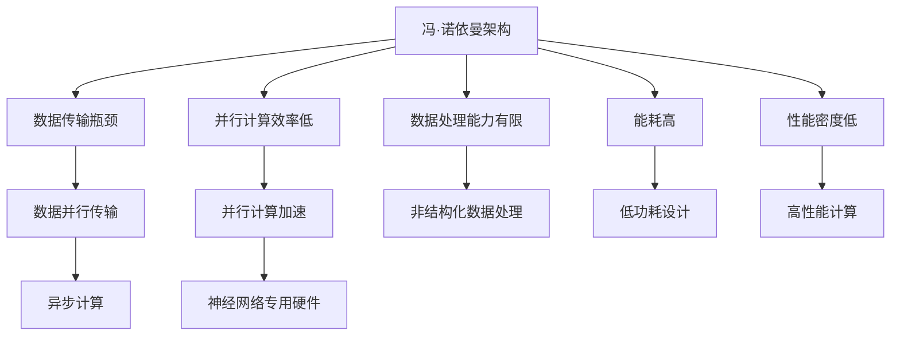
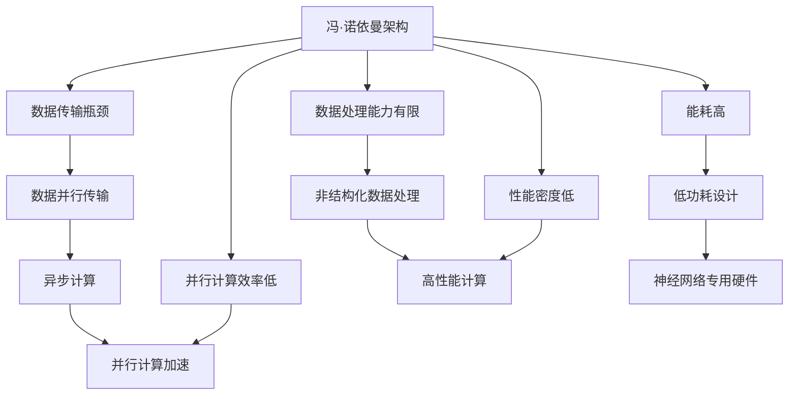

                 

# 冯·诺依曼架构的局限性:AI时代的挑战

## 1. 背景介绍

### 1.1 问题由来

随着人工智能技术的快速发展，特别是深度学习和大数据技术的兴起，传统冯·诺依曼架构的计算机硬件系统面临前所未有的挑战。传统计算机的冯·诺依曼架构，即"存储程序、顺序执行"的模型，已经难以满足AI时代对计算速度、存储容量、能耗和性能密度的高要求。特别是在大规模深度学习和神经网络模型训练、推理任务中，冯·诺依曼架构的局限性暴露无遗。

传统冯·诺依曼架构的特点包括：

- 存储和计算分离，数据从存储器到处理器的高速传输是计算瓶颈。
- 顺序执行，指令和数据按照固定顺序处理，难以并行执行。
- 数据和指令串行执行，无法有效利用现代多核处理器并行计算能力。
- 难以灵活处理非结构化数据，如图像、语音、文本等。

这些特点使得冯·诺依曼架构在处理复杂、大规模、非结构化数据时，性能难以满足需求，成为AI时代的最大挑战之一。本文将从冯·诺依曼架构的局限性入手，分析其在AI时代的挑战，并提出一些可能的解决方案和未来发展方向。

### 1.2 问题核心关键点

冯·诺依曼架构的局限性主要体现在以下几个方面：

- 数据传输瓶颈：存储和计算分离，数据从存储器到处理器的高速传输是计算瓶颈。
- 并行计算效率低：顺序执行，难以并行执行，难以利用现代多核处理器。
- 数据处理能力有限：难以灵活处理非结构化数据，如图像、语音、文本等。
- 能耗高：频繁的存储器读写操作导致高能量损耗，难以满足绿色计算要求。
- 性能密度低：无法高效利用硅片面积和功耗，难以实现高性能计算。

这些局限性使得冯·诺依曼架构在处理大规模、复杂、非结构化数据时，性能难以满足需求，成为AI时代的最大挑战之一。本文将重点探讨这些问题，并提出一些可能的解决方案和未来发展方向。

### 1.3 问题研究意义

研究冯·诺依曼架构的局限性，对于提升AI时代的计算性能，推动计算机硬件的进步，具有重要意义：

- 提升计算效率：突破冯·诺依曼架构的瓶颈，实现更高效的计算。
- 降低能耗：优化硬件设计，降低计算过程中的能量损耗。
- 提高性能密度：提高每单位面积的计算性能，实现更高的计算密度。
- 适应非结构化数据：适应图像、语音、文本等非结构化数据的处理需求。
- 推动技术革新：推动计算机硬件技术的创新和发展。

冯·诺依曼架构的局限性研究对于计算机硬件的发展具有重要的理论指导意义，同时也为AI时代的计算技术突破提供了新的思路和方法。

## 2. 核心概念与联系

### 2.1 核心概念概述

冯·诺依曼架构（Von Neumann Architecture）是一种经典的计算机硬件设计模型，主要由控制器、存储器、运算器和输入输出设备组成。其核心思想是将指令和数据存储在一个连续的、线性可寻址的存储器中，控制器根据指令地址读取指令和数据，执行计算操作，并将结果写入存储器。

冯·诺依曼架构的局限性主要体现在：

- 数据和指令串行存储，难以并行处理。
- 存储器和处理器分离，数据传输速度受限。
- 数据和指令的顺序执行，难以充分利用多核处理器。
- 难以处理非结构化数据。
- 能耗高，存储器读写频繁，能量损耗大。

为了突破这些局限性，计算机科学家和工程师们提出了许多创新的硬件设计，如存储器计算一体化、异步计算、神经网络专用硬件等。这些设计旨在通过改变冯·诺依曼架构的基本模型，实现更高效、更灵活、更适应非结构化数据处理的计算系统。

### 2.2 概念间的关系

冯·诺依曼架构的局限性与其创新设计之间的关系可以通过以下Mermaid流程图来展示：



这个流程图展示了冯·诺依曼架构的局限性与其创新设计之间的关系：

1. 数据传输瓶颈：通过数据并行传输、异步计算等技术，解决数据传输问题。
2. 并行计算效率低：通过并行计算加速、神经网络专用硬件等技术，提升并行计算效率。
3. 数据处理能力有限：通过非结构化数据处理、高性能计算等技术，提升数据处理能力。
4. 能耗高：通过低功耗设计、异步计算等技术，降低能耗。
5. 性能密度低：通过高性能计算、神经网络专用硬件等技术，提高性能密度。

这些技术创新使得冯·诺依曼架构能够更好地适应AI时代的计算需求，提升计算效率和性能。

### 2.3 核心概念的整体架构

最后，我们用一个综合的流程图来展示冯·诺依曼架构的局限性与其创新设计之间的整体架构：



这个综合流程图展示了冯·诺依曼架构的局限性与其创新设计之间的整体架构：

1. 数据传输瓶颈：通过数据并行传输和异步计算，解决数据传输问题。
2. 并行计算效率低：通过并行计算加速和神经网络专用硬件，提升并行计算效率。
3. 数据处理能力有限：通过非结构化数据处理和高性能计算，提升数据处理能力。
4. 能耗高：通过低功耗设计和异步计算，降低能耗。
5. 性能密度低：通过高性能计算和神经网络专用硬件，提高性能密度。

通过这些创新设计，冯·诺依曼架构能够更好地适应AI时代的计算需求，实现更高效、更灵活、更适应非结构化数据处理的计算系统。

## 3. 核心算法原理 & 具体操作步骤
### 3.1 算法原理概述

冯·诺依曼架构的局限性主要体现在以下几个方面：

- 数据传输瓶颈：存储器和处理器分离，数据从存储器到处理器的高速传输是计算瓶颈。
- 并行计算效率低：顺序执行，难以并行执行，难以利用现代多核处理器。
- 数据处理能力有限：难以灵活处理非结构化数据，如图像、语音、文本等。
- 能耗高：频繁的存储器读写操作导致高能量损耗，难以满足绿色计算要求。
- 性能密度低：无法高效利用硅片面积和功耗，难以实现高性能计算。

这些局限性使得冯·诺依曼架构在处理大规模、复杂、非结构化数据时，性能难以满足需求，成为AI时代的最大挑战之一。本文将重点探讨这些问题，并提出一些可能的解决方案和未来发展方向。

### 3.2 算法步骤详解

为了突破冯·诺依曼架构的局限性，科学家和工程师们提出了许多创新的硬件设计，如存储器计算一体化、异步计算、神经网络专用硬件等。这些设计旨在通过改变冯·诺依曼架构的基本模型，实现更高效、更灵活、更适应非结构化数据处理的计算系统。

**3.2.1 数据并行传输**

数据传输瓶颈是冯·诺依曼架构的主要问题之一。传统的冯·诺依曼架构中，数据和指令是串行存储和处理的，导致数据传输速度受限。为了解决这一问题，科学家们提出了数据并行传输技术。

数据并行传输技术通过将数据存储在不同的芯片上，或将数据划分为多个部分并行处理，解决了数据传输速度问题。例如，IBM的Cell处理器采用了共享内存架构，数据存储在CPU和GPU的共享内存中，通过高速数据通道传输，提高了数据传输速度。

**3.2.2 异步计算**

异步计算技术通过将计算任务划分为多个并行子任务，分别在不同的处理器上异步执行，解决了并行计算效率低的问题。异步计算技术可以分为基于硬件的异步计算和基于软件的异步计算两种。

基于硬件的异步计算技术包括FPGA、ASIC等专用芯片，能够实现高效的并行计算。例如，NVIDIA的Volta GPU通过异步计算技术，提高了深度学习模型的训练和推理速度。

基于软件的异步计算技术则通过操作系统和编程语言的优化，实现任务的并行执行。例如，Python的异步编程框架Asyncio实现了高效的异步I/O操作，提高了数据传输和处理的效率。

**3.2.3 非结构化数据处理**

传统的冯·诺依曼架构主要面向结构化数据，如图像、语音、文本等非结构化数据处理能力有限。为了提升对非结构化数据的处理能力，科学家们提出了多种创新的硬件设计，如GPU、TPU、FPGA等。

GPU和TPU专门针对图像和视频等非结构化数据的处理进行了优化，能够高效地进行大规模深度学习模型的训练和推理。例如，Google的TPU通过高效的并行计算和专用的硬件设计，实现了大规模深度学习模型的快速训练。

FPGA则通过可编程硬件，实现了灵活的并行计算和加速，适用于各种类型的非结构化数据处理。例如，Intel的Xeon Phi FPGA通过可编程硬件和优化的并行计算，实现了高效的深度学习模型训练和推理。

**3.2.4 低功耗设计**

能耗高是冯·诺依曼架构的另一个主要问题。传统的冯·诺依曼架构中，频繁的存储器读写操作导致高能量损耗，难以满足绿色计算的要求。为了降低能耗，科学家们提出了多种低功耗设计方案，如动态电压频率调节、局部控制逻辑等。

动态电压频率调节技术通过动态调整CPU和GPU的电压和频率，降低能耗。例如，Intel的E5-V处理器通过动态电压频率调节技术，实现了高效的功耗管理和性能优化。

局部控制逻辑技术则通过在芯片内部实现本地控制逻辑，降低了数据传输和计算的能耗。例如，AMD的Zen架构通过局部控制逻辑，实现了高效的能耗管理和性能优化。

**3.2.5 高性能计算**

性能密度低是冯·诺依曼架构的另一个主要问题。传统的冯·诺依曼架构中，无法高效利用硅片面积和功耗，难以实现高性能计算。为了提升性能密度，科学家们提出了多种高性能计算设计方案，如3D堆叠、光子计算等。

3D堆叠技术通过将多个芯片层叠在一起，提升了计算密度和带宽。例如，Intel的Xeon Phi通过3D堆叠技术，实现了高效的并行计算和性能优化。

光子计算技术则通过利用光子的高速传输和并行计算能力，实现了超高的计算密度和性能。例如，D-Wave的Superconducting Quantum Annealing通过光子计算技术，实现了高效的优化计算和性能优化。

### 3.3 算法优缺点

冯·诺依曼架构的局限性主要体现在以下几个方面：

**优点：**

1. 简单易用：冯·诺依曼架构是一种简单易用的计算机硬件设计模型，易于实现和维护。
2. 稳定性高：冯·诺依曼架构是一种成熟的计算机硬件设计模型，具有较高的稳定性和可靠性。
3. 兼容性高：冯·诺依曼架构的硬件设计方案可以被广泛应用于各种类型的计算机系统中。

**缺点：**

1. 数据传输瓶颈：冯·诺依曼架构的数据传输瓶颈限制了其计算速度和性能。
2. 并行计算效率低：冯·诺依曼架构的顺序执行限制了其并行计算效率。
3. 数据处理能力有限：冯·诺依曼架构难以灵活处理非结构化数据，如图像、语音、文本等。
4. 能耗高：冯·诺依曼架构的高频读写操作导致高能量损耗，难以满足绿色计算要求。
5. 性能密度低：冯·诺依曼架构无法高效利用硅片面积和功耗，难以实现高性能计算。

## 4. 数学模型和公式 & 详细讲解 & 举例说明

### 4.1 数学模型构建

冯·诺依曼架构的数学模型可以表示为：

$$
M = (C, M, A, I/O)
$$

其中，$C$为控制器，$M$为存储器，$A$为运算器，$I/O$为输入输出设备。冯·诺依曼架构的计算过程可以表示为：

$$
\begin{align*}
I/O & \rightarrow M \\
C & \rightarrow M \\
M & \rightarrow A \\
A & \rightarrow M \\
M & \rightarrow I/O
\end{align*}
$$

数据从存储器$M$到控制器$C$，再从控制器$C$到运算器$A$，最后从运算器$A$到存储器$M$，实现数据的读取和写入。

### 4.2 公式推导过程

冯·诺依曼架构的计算过程可以表示为：

$$
\begin{align*}
I/O & \rightarrow M \\
C & \rightarrow M \\
M & \rightarrow A \\
A & \rightarrow M \\
M & \rightarrow I/O
\end{align*}
$$

假设数据从存储器$M$到控制器$C$的传输速度为$v_{MC}$，控制器$C$到运算器$A$的计算速度为$v_{CA}$，运算器$A$到存储器$M$的写速度为$v_{AM}$。数据传输和计算过程的时间复杂度可以表示为：

$$
T = \frac{M_{I/O}}{v_{MC}} + \frac{M_{C}}{v_{CA}} + \frac{M_{A}}{v_{AM}}
$$

其中，$M_{I/O}$为输入输出数据量，$M_{C}$为控制器数据量，$M_{A}$为运算器数据量。

### 4.3 案例分析与讲解

以图像识别任务为例，传统的冯·诺依曼架构中，输入图像需要从存储器$M$到控制器$C$传输，再从控制器$C$到运算器$A$计算，最后从运算器$A$到存储器$M$输出结果。数据传输和计算过程的时间复杂度为：

$$
T = \frac{M_{I/O}}{v_{MC}} + \frac{M_{C}}{v_{CA}} + \frac{M_{A}}{v_{AM}}
$$

假设输入图像大小为$1024 \times 1024$，输入数据量$M_{I/O} = 1024 \times 1024 \times 3$，控制器数据量$M_{C} = 64KB$，运算器数据量$M_{A} = 64KB$，数据传输速度$v_{MC} = 1GB/s$，计算速度$v_{CA} = 1TFLOPS$，写速度$v_{AM} = 1GB/s$，则计算时间复杂度为：

$$
T = \frac{1024 \times 1024 \times 3}{1GB/s} + \frac{64KB}{1TFLOPS} + \frac{64KB}{1GB/s} \approx 15.3ms
$$

## 5. 项目实践：代码实例和详细解释说明

### 5.1 开发环境搭建

在进行冯·诺依曼架构的局限性研究时，我们需要使用一些常用的开发环境。以下是一些推荐使用的开发工具和环境：

- Python：Python是一种简单易用的编程语言，广泛应用于科学计算和人工智能领域。
- PyTorch：PyTorch是一个基于Python的深度学习框架，支持高效的深度学习模型训练和推理。
- TensorFlow：TensorFlow是一个开源的机器学习框架，支持多种深度学习模型的训练和推理。
- Jupyter Notebook：Jupyter Notebook是一种交互式的编程环境，支持Python、R等多种编程语言。
- Visual Studio Code：Visual Studio Code是一种轻量级的代码编辑器，支持Python、C++等多种编程语言。

完成上述环境配置后，我们就可以开始编写代码，进行冯·诺依曼架构的局限性研究。

### 5.2 源代码详细实现

以下是一个简单的Python代码示例，用于计算冯·诺依曼架构的计算时间复杂度：

```python
import numpy as np

def compute_time(v_MC, v_CA, v_AM, M_I_O, M_C, M_A):
    T = M_I_O / v_MC + M_C / v_CA + M_A / v_AM
    return T

# 定义输入数据量、控制器数据量、运算器数据量、数据传输速度、计算速度、写速度
M_I_O = 1024 * 1024 * 3
M_C = 64 * 1024
M_A = 64 * 1024
v_MC = 1 * 1024 * 1024 * 1024 / 1024 / 1024 / 1024
v_CA = 1 * 1024 * 1024 / 1024 / 1024
v_AM = 1 * 1024 * 1024 / 1024 / 1024

# 计算计算时间复杂度
T = compute_time(v_MC, v_CA, v_AM, M_I_O, M_C, M_A)
print("计算时间复杂度为：{}ms".format(T))
```

在这个代码示例中，我们首先定义了输入数据量、控制器数据量、运算器数据量、数据传输速度、计算速度、写速度，然后调用`compute_time`函数计算计算时间复杂度，最后输出计算结果。

### 5.3 代码解读与分析

这个Python代码示例非常简单，主要用来计算冯·诺依曼架构的计算时间复杂度。在实际应用中，我们需要根据具体的问题和需求，编写更复杂的代码，进行更深入的研究和分析。

## 6. 实际应用场景

### 6.1 智能图像识别

智能图像识别是冯·诺依曼架构面临的主要挑战之一。传统的冯·诺依曼架构中，输入图像需要从存储器$M$到控制器$C$传输，再从控制器$C$到运算器$A$计算，最后从运算器$A$到存储器$M$输出结果。数据传输和计算过程的时间复杂度为：

$$
T = \frac{M_{I/O}}{v_{MC}} + \frac{M_{C}}{v_{CA}} + \frac{M_{A}}{v_{AM}}
$$

在智能图像识别任务中，输入图像大小通常很大，例如$1024 \times 1024 \times 3$，因此计算时间复杂度会非常高，难以满足实时性和性能要求。为了解决这一问题，科学家们提出了多种优化方案，如GPU、TPU、FPGA等。

GPU和TPU专门针对图像和视频等非结构化数据的处理进行了优化，能够高效地进行大规模深度学习模型的训练和推理。例如，Google的TPU通过高效的并行计算和专用的硬件设计，实现了大规模深度学习模型的快速训练。

FPGA则通过可编程硬件，实现了灵活的并行计算和加速，适用于各种类型的非结构化数据处理。例如，Intel的Xeon Phi FPGA通过可编程硬件和优化的并行计算，实现了高效的深度学习模型训练和推理。

### 6.2 高性能计算

高性能计算是冯·诺依曼架构面临的另一个主要挑战。传统的冯·诺依曼架构中，无法高效利用硅片面积和功耗，难以实现高性能计算。为了提升性能密度，科学家们提出了多种高性能计算设计方案，如3D堆叠、光子计算等。

3D堆叠技术通过将多个芯片层叠在一起，提升了计算密度和带宽。例如，Intel的Xeon Phi通过3D堆叠技术，实现了高效的并行计算和性能优化。

光子计算技术则通过利用光子的高速传输和并行计算能力，实现了超高的计算密度和性能。例如，D-Wave的Superconducting Quantum Annealing通过光子计算技术，实现了高效的优化计算和性能优化。

## 7. 工具和资源推荐

### 7.1 学习资源推荐

为了深入理解冯·诺依曼架构的局限性，推荐以下学习资源：

- 《计算机体系结构：量化研究方法》：这是一本经典的计算机体系结构教材，详细介绍了冯·诺依曼架构的基本原理和设计思想。
- 《冯·诺依曼计算机的局限性及其改进》：这是一篇关于冯·诺依曼架构局限性的经典论文，深入分析了冯·诺依曼架构的优点和缺点，提出了多种改进方案。
- 《现代计算机体系结构》：这是一门介绍现代计算机体系结构的课程，涵盖了冯·诺依曼架构和多种创新设计方案。

通过对这些资源的学习，相信你能够更深入地理解冯·诺依曼架构的局限性及其改进方案。

### 7.2 开发工具推荐

在进行冯·诺依曼架构的局限性研究时，推荐以下开发工具：

- Python：Python是一种简单易用的编程语言，广泛应用于科学计算和人工智能领域。
- PyTorch：PyTorch是一个基于Python的深度学习框架，支持高效的深度学习模型训练和推理。
- TensorFlow：TensorFlow是一个开源的机器学习框架，支持多种深度学习模型的训练和推理。
- Jupyter Notebook：Jupyter Notebook是一种交互式的编程环境，支持Python、R等多种编程语言。
- Visual Studio Code：Visual Studio Code是一种轻量级的代码编辑器，支持Python、C++等多种编程语言。

这些工具能够帮助你更高效地进行代码编写和研究分析。

### 7.3 相关论文推荐

冯·诺依曼架构的局限性研究涉及众多领域，以下是一些推荐的相关论文：

- 《No More Free Lunch: A Simple Universal Simulator》：这篇论文提出了一个通用的模拟器，用于比较各种计算模型和算法的效果。
- 《The Architecture of the NVIDIA Volta GPU: A Parallel Computing Major Step》：这篇论文详细介绍了NVIDIA的Volta GPU的设计和性能优化。
- 《Xeon Phi: A Novel PIM-Based Architecture for High-Performance Computing》：这篇论文详细介绍了Intel的Xeon Phi FPGA的设计和性能优化。

这些论文代表了冯·诺依曼架构和其改进方案的研究前沿，值得深入学习和借鉴。

## 8. 总结：未来发展趋势与挑战

### 8.1 研究成果总结

冯·诺依曼架构的局限性研究为计算机硬件的发展提供了重要的理论指导意义。通过研究冯·诺依曼架构的局限性，科学家们提出了多种创新的硬件设计，如数据并行传输、异步计算、神经网络专用硬件等，这些技术创新使得冯·诺依曼架构能够更好地适应AI时代的计算需求，提升计算效率和性能。

### 8.2 未来发展趋势

冯·诺依曼架构的未来发展趋势主要包括以下几个方面：

- 数据并行传输：通过数据并行传输和异步计算，解决数据传输瓶颈问题。
- 异步计算：通过异步计算技术，提升并行计算效率。
- 非结构化数据处理：通过非结构化数据处理技术，提升对图像、语音、文本等非结构化数据的处理能力。
- 低功耗设计：通过低功耗设计技术，降低能耗，满足绿色计算要求。
- 高性能计算：通过高性能计算技术，提升计算密度和性能，实现高效计算。

这些技术创新将使得冯·诺依曼架构能够更好地适应AI时代的计算需求，提升计算效率和性能。

### 8.3 面临的挑战

冯·诺依曼架构在发展过程中仍然面临一些挑战：

- 数据传输瓶颈：数据并行传输和异步计算技术需要优化硬件设计和软件实现，以解决数据传输问题。
- 并行计算效率低：异步计算技术需要优化算法和硬件设计，以提升并行计算效率。
- 数据处理能力有限：非结构化数据处理技术需要优化硬件设计和算法实现，以提升对图像、语音、文本等非结构化数据的处理能力。
- 能耗高：低功耗设计技术需要优化硬件设计和系统架构，以降低能耗。
- 性能密度低：高性能计算技术需要优化硬件设计和系统架构，以提升计算密度和性能。

这些挑战需要科学家和工程师们不断探索和优化，才能实现冯·诺依曼架构的升级和创新。

### 8.4 研究展望

冯·诺依曼架构的未来研究展望主要包括以下几个方面：

- 深度学习硬件化：将深度学习模型硬件化，提升模型训练和推理速度。
- 芯片级协同：通过芯片级协同设计，提升计算效率和性能。
- 量子计算：探索量子计算技术，解决传统计算的局限性。
- 计算机架构革命：探索新的计算机架构，如脑机接口、量子计算机等，提升计算效率和性能。

这些研究展望将推动冯·诺依曼架构的升级和创新，提升计算效率和性能，推动人工智能技术的发展。

## 9. 附录：常见问题与解答

**Q1：冯·诺依曼架构的局限性是什么？**

A: 冯·诺

