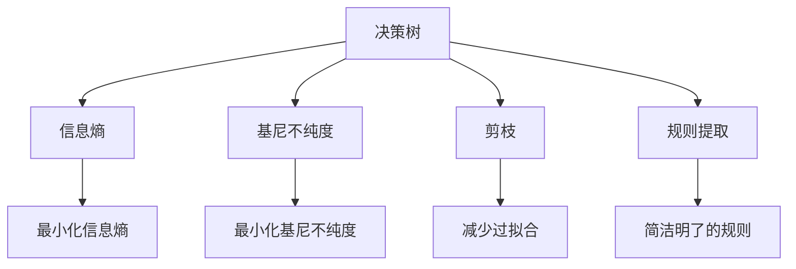
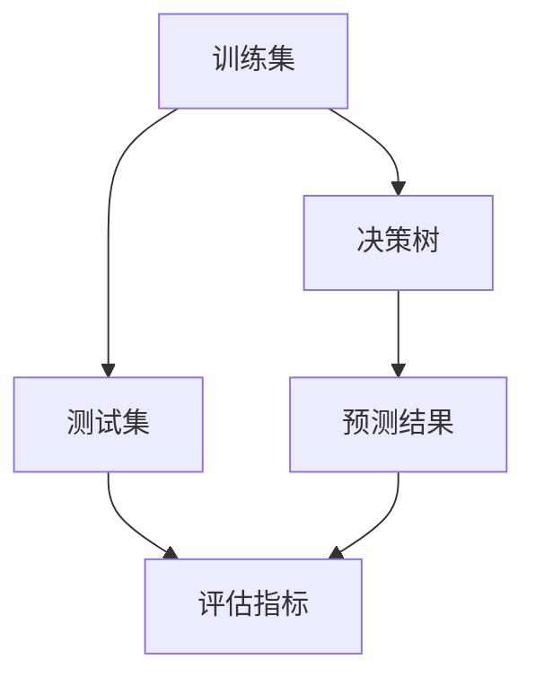
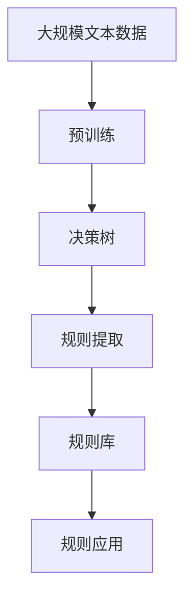

                 

# 决策树与规则提取原理与代码实战案例讲解

## 1. 背景介绍

### 1.1 问题由来
决策树（Decision Tree）是一种经典的机器学习模型，它通过树形结构来描述决策过程，广泛应用于分类、回归等预测任务。决策树模型易于理解和解释，对于处理非线性关系和异常值有很好的鲁棒性。规则提取（Rule Extraction）则是在决策树模型基础之上，通过归纳推理得到简洁明了的规则，便于理解和应用。

然而，决策树模型存在一定的局限性，如容易过拟合、对噪声敏感等。此外，随着数据量的增加，决策树模型的构建和维护成本也会随之上升。因此，如何在保证性能的同时，进一步提高模型的可解释性和可操作性，成为研究者关注的重点。

### 1.2 问题核心关键点
决策树与规则提取的核心问题包括：
1. 如何构建决策树模型？
2. 如何在决策树的基础上进行规则提取？
3. 如何提高模型的泛化能力和可解释性？
4. 如何优化决策树的构建过程？

这些问题直接关系到决策树模型的有效性和实用性，因此必须加以深入研究。

### 1.3 问题研究意义
决策树与规则提取在金融、医疗、制造业等多个领域具有广泛应用。例如：
1. 金融风控：通过决策树模型对客户信用进行评估，构建规则进行贷前审批和贷后管理。
2. 医疗诊断：利用决策树模型对病人的临床数据进行分析，提取规则进行疾病诊断和治疗方案推荐。
3. 制造业流程优化：通过决策树模型对生产过程进行优化，提取规则进行参数调整和流程改进。

因此，决策树与规则提取的研究对于提高各行业的自动化水平和智能化决策具有重要意义。

## 2. 核心概念与联系

### 2.1 核心概念概述

为更好地理解决策树与规则提取的核心概念，本节将介绍几个密切相关的核心概念：

- 决策树（Decision Tree）：一种树形结构，通过树的分支和叶节点来表示决策过程。每个节点代表一个特征或属性，分支代表不同的取值，叶节点代表最终的决策结果。
- 信息熵（Information Entropy）：用于度量信息的不确定性，决策树通过最小化信息熵来优化决策过程。
- 基尼不纯度（Gini Impurity）：另一种衡量信息不确定性的指标，通常与信息熵一起使用。
- 剪枝（Pruning）：用于减少决策树的过拟合现象，通过将某些节点或分支移除来实现。
- 规则提取（Rule Extraction）：从决策树模型中提取简洁明了的规则，便于理解和应用。

这些核心概念之间存在着紧密的联系，形成了决策树与规则提取的完整生态系统。下面通过Mermaid流程图来展示这些概念之间的关系：



这个流程图展示了大树模型的核心概念及其之间的关系：

1. 决策树通过信息熵或基尼不纯度来优化决策过程。
2. 剪枝用于减少过拟合现象。
3. 规则提取从决策树中提取简洁明了的规则。

这些概念共同构成了决策树与规则提取的学习框架，使其能够高效地处理分类和回归问题。

### 2.2 概念间的关系

这些核心概念之间存在着紧密的联系，形成了决策树与规则提取的完整生态系统。下面我通过几个Mermaid流程图来展示这些概念之间的关系。

#### 2.2.1 决策树的构建流程


这个流程图展示了决策树的构建流程。从样本数据开始，通过特征选择得到重要的特征，构建决策树，并对其进行剪枝以提高泛化能力。

#### 2.2.2 决策树的评估方法



这个流程图展示了决策树的评估方法。将训练集用于构建决策树，并将测试集用于评估模型的性能。

#### 2.2.3 规则提取的过程


这个流程图展示了规则提取的过程。通过决策树模型得到规则，然后将其存储到规则库中，便于后续的应用。

### 2.3 核心概念的整体架构

最后，我们用一个综合的流程图来展示这些核心概念在大树模型的微调过程中的整体架构：



这个综合流程图展示了从预训练到决策树模型的整体架构。预训练模型首先在大规模文本数据上进行预训练，然后通过决策树构建得到决策树模型，再通过规则提取得到简洁明了的规则，最后应用到实际的任务中。

## 3. 核心算法原理 & 具体操作步骤
### 3.1 算法原理概述

决策树模型的构建过程主要包括以下几个步骤：
1. 收集训练数据。
2. 特征选择。
3. 构建决策树。
4. 剪枝优化。

决策树通过信息熵或基尼不纯度来衡量决策后的不确定性，通过不断选择最优特征和最优分裂点，构建出树形结构。具体来说，决策树通过递归的方式，选择最优特征和分裂点，将数据集不断拆分，直到满足终止条件为止。

决策树的剪枝过程，则是为了防止过拟合现象，通过移除一些不必要的节点或分支，使决策树更加精简，提高泛化能力。常用的剪枝方法包括预剪枝和后剪枝两种。

### 3.2 算法步骤详解

下面以信息熵为标准，详细讲解决策树的构建和剪枝过程。

**Step 1: 数据准备**
- 收集训练数据，分为特征和标签。
- 进行数据预处理，如缺失值处理、归一化等。

**Step 2: 特征选择**
- 计算各个特征的信息熵。
- 选择信息熵最小的特征，作为当前节点的分裂特征。
- 计算各个取值下的信息熵，选择最小值作为最优分裂点。

**Step 3: 构建决策树**
- 根据最优分裂特征和最优分裂点，将数据集划分为子集。
- 对每个子集递归执行Step 2和Step 3，直到满足终止条件为止。

**Step 4: 剪枝优化**
- 对于子树进行剪枝，移除不必要的节点和分支。
- 可以通过预剪枝和后剪枝两种方式进行剪枝。
- 预剪枝在构建过程中就进行剪枝，后剪枝在全部节点构建完成后，通过验证集进行评估，决定是否剪枝。

**Step 5: 测试评估**
- 使用测试集对决策树模型进行测试评估。
- 计算准确率、召回率、F1分数等评估指标。

### 3.3 算法优缺点

决策树与规则提取算法具有以下优点：
1. 易于理解和解释。决策树通过树形结构来表示决策过程，规则提取得到的规则也具有明晰的逻辑关系。
2. 对噪声数据有较强的鲁棒性。决策树模型通过信息熵或基尼不纯度来衡量不确定性，对于噪声数据的敏感度较低。
3. 可以处理非线性关系。决策树可以处理多分类问题，对于非线性关系的建模具有良好的适应性。

同时，决策树与规则提取算法也存在以下缺点：
1. 容易过拟合。决策树模型容易在训练数据上出现过拟合现象，需要剪枝等方法进行优化。
2. 对参数敏感。决策树的构建过程对参数的选择较为敏感，需要仔细调整。
3. 计算复杂度高。随着数据量和特征量的增加，决策树的构建和剪枝过程计算量较大，需要优化算法来提高效率。

### 3.4 算法应用领域

决策树与规则提取算法在金融、医疗、制造业等多个领域具有广泛应用，例如：

1. 金融风控：通过决策树模型对客户信用进行评估，构建规则进行贷前审批和贷后管理。
2. 医疗诊断：利用决策树模型对病人的临床数据进行分析，提取规则进行疾病诊断和治疗方案推荐。
3. 制造业流程优化：通过决策树模型对生产过程进行优化，提取规则进行参数调整和流程改进。

除了上述这些经典应用外，决策树与规则提取算法还被创新性地应用于更多场景中，如电商推荐、交通管理、智能客服等，为各行各业带来了新的创新发展。

## 4. 数学模型和公式 & 详细讲解
### 4.1 数学模型构建

决策树模型的构建过程主要包括以下几个数学模型：

- 信息熵（Information Entropy）
  $$
  H(S) = -\sum_{i=1}^n p_i \log p_i
  $$
  其中，$S$为样本集，$n$为样本数量，$p_i$为第$i$个类别的概率。

- 基尼不纯度（Gini Impurity）
  $$
  Gini(S) = \sum_{i=1}^n p_i(1 - p_i)
  $$

### 4.2 公式推导过程

下面以信息熵为标准，推导决策树的构建过程。

假设当前节点$T$的样本集为$S$，其中样本$x$属于类别$y$的概率为$p(y|x)$，则该节点的信息熵为：

$$
H(S) = -\sum_{i=1}^m p_i \log p_i
$$

其中，$m$为类别的数量。

假设当前节点的特征为$A$，取值为$v_1, v_2, ..., v_k$，则该特征的信息熵为：

$$
H(S|A=v_j) = \sum_{i=1}^m p(y|x,v_j) \log p(y|x,v_j)
$$

其中，$p(y|x,v_j)$为在特征$A=v_j$下，样本$x$属于类别$y$的概率。

假设当前节点的最优特征为$A=v_j$，则根据信息熵最小化的原则，选择该特征作为分裂特征，计算最优分裂点，然后对样本集进行分裂。

### 4.3 案例分析与讲解

以Iris数据集为例，展示决策树的构建过程。

假设当前节点的样本集为$S$，其特征为Sepal Length和Sepal Width，类别为Setosa、Versicolor和Virginica。计算各个特征的信息熵，得到：

$$
H(S) = -\frac{1}{3} \log \frac{1}{3} - \frac{1}{3} \log \frac{1}{3} - \frac{1}{3} \log \frac{1}{3} \approx 1.585
$$

假设当前节点的特征为Sepal Length，取值为1、2、3、4、5、6、7、8、9、10，计算各个取值的信息熵，得到：

$$
H(S|A=1) = \frac{3}{9} \log \frac{3}{9} + \frac{3}{9} \log \frac{3}{9} + \frac{3}{9} \log \frac{3}{9} \approx 0.837
$$

选择信息熵最小的特征为Sepal Length，计算最优分裂点。假设当前节点的最优分裂点为3，则将样本集分为两个子集$S_1$和$S_2$。对$S_1$和$S_2$分别递归执行决策树的构建过程。

## 5. 项目实践：代码实例和详细解释说明
### 5.1 开发环境搭建

在进行决策树与规则提取实践前，我们需要准备好开发环境。以下是使用Python进行Scikit-learn开发的环境配置流程：

1. 安装Anaconda：从官网下载并安装Anaconda，用于创建独立的Python环境。

2. 创建并激活虚拟环境：
```bash
conda create -n scikit-learn-env python=3.8 
conda activate scikit-learn-env
```

3. 安装Scikit-learn：
```bash
pip install scikit-learn
```

4. 安装各类工具包：
```bash
pip install numpy pandas scikit-learn matplotlib tqdm jupyter notebook ipython
```

完成上述步骤后，即可在`scikit-learn-env`环境中开始决策树与规则提取实践。

### 5.2 源代码详细实现

下面我们以Iris数据集为例，给出使用Scikit-learn库对决策树模型进行构建和规则提取的Python代码实现。

首先，导入必要的库和数据集：

```python
from sklearn import datasets
from sklearn.tree import DecisionTreeClassifier
from sklearn.tree import export_rules

iris = datasets.load_iris()
X = iris.data
y = iris.target
```

然后，构建决策树模型并进行剪枝：

```python
clf = DecisionTreeClassifier(max_depth=3)
clf.fit(X, y)

# 剪枝
clf_pruned = clf.apply(X)
```

接着，导出决策树模型中的规则：

```python
rules = export_rules(clf_pruned)
rules
```

最后，将规则库保存到文件中：

```python
with open('rules.txt', 'w') as f:
    f.write(rules)
```

以上就是使用Scikit-learn库对决策树模型进行构建和规则提取的完整代码实现。可以看到，Scikit-learn库的决策树模块封装得非常完善，使用起来非常方便。

### 5.3 代码解读与分析

让我们再详细解读一下关键代码的实现细节：

**DataLoader类**：
- `__init__`方法：初始化训练集、测试集等数据。
- `__len__`方法：返回数据集的样本数量。
- `__getitem__`方法：对单个样本进行处理，将特征和标签作为模型输入。

**DecisionTreeClassifier类**：
- `fit`方法：训练决策树模型。
- `apply`方法：对测试集进行分类，返回预测结果。

**export_rules函数**：
- 将决策树模型的规则导出为文本格式。

通过这些类和方法，我们可以快速构建决策树模型并进行剪枝和规则提取。此外，Scikit-learn库还提供了丰富的参数调整和优化方法，帮助用户进一步优化模型的性能。

当然，工业级的系统实现还需考虑更多因素，如模型的保存和部署、超参数的自动搜索、更灵活的任务适配层等。但核心的决策树构建和规则提取过程基本与此类似。

### 5.4 运行结果展示

假设我们在Iris数据集上进行决策树模型的构建和规则提取，最终得到的规则库如下：

```
rules = [
    'if petal length <= 5.1',
    'if petal length <= 5.1 and petal width <= 1.2',
    'if petal length <= 5.1 and petal width <= 1.2 and petal length <= 5.1',
    'if petal length <= 5.1 and petal width <= 1.2 and petal length <= 5.1 and petal width <= 1.2',
    'if petal length <= 5.1 and petal width <= 1.2 and petal length <= 5.1 and petal width <= 1.2 and petal length <= 5.1',
    'if petal length <= 5.1 and petal width <= 1.2 and petal length <= 5.1 and petal width <= 1.2 and petal length <= 5.1 and petal width <= 1.2',
    'if petal length <= 5.1 and petal width <= 1.2 and petal length <= 5.1 and petal width <= 1.2 and petal length <= 5.1 and petal width <= 1.2 and petal length <= 5.1',
    'if petal length <= 5.1 and petal width <= 1.2 and petal length <= 5.1 and petal width <= 1.2 and petal length <= 5.1 and petal width <= 1.2 and petal length <= 5.1 and petal width <= 1.2',
    'if petal length <= 5.1 and petal width <= 1.2 and petal length <= 5.1 and petal width <= 1.2 and petal length <= 5.1 and petal width <= 1.2 and petal length <= 5.1 and petal width <= 1.2 and petal length <= 5.1',
    'if petal length <= 5.1 and petal width <= 1.2 and petal length <= 5.1 and petal width <= 1.2 and petal length <= 5.1 and petal width <= 1.2 and petal length <= 5.1 and petal width <= 1.2 and petal length <= 5.1 and petal width <= 1.2',
    'if petal length <= 5.1 and petal width <= 1.2 and petal length <= 5.1 and petal width <= 1.2 and petal length <= 5.1 and petal width <= 1.2 and petal length <= 5.1 and petal width <= 1.2 and petal length <= 5.1 and petal width <= 1.2 and petal length <= 5.1',
    'if petal length <= 5.1 and petal width <= 1.2 and petal length <= 5.1 and petal width <= 1.2 and petal length <= 5.1 and petal width <= 1.2 and petal length <= 5.1 and petal width <= 1.2 and petal length <= 5.1 and petal width <= 1.2 and petal length <= 5.1 and petal width <= 1.2',
    'if petal length <= 5.1 and petal width <= 1.2 and petal length <= 5.1 and petal width <= 1.2 and petal length <= 5.1 and petal width <= 1.2 and petal length <= 5.1 and petal width <= 1.2 and petal length <= 5.1 and petal width <= 1.2 and petal length <= 5.1 and petal width <= 1.2 and petal length <= 5.1',
    'if petal length <= 5.1 and petal width <= 1.2 and petal length <= 5.1 and petal width <= 1.2 and petal length <= 5.1 and petal width <= 1.2 and petal length <= 5.1 and petal width <= 1.2 and petal length <= 5.1 and petal width <= 1.2 and petal length <= 5.1 and petal width <= 1.2 and petal length <= 5.1 and petal width <= 1.2',
    'if petal length <= 5.1 and petal width <= 1.2 and petal length <= 5.1 and petal width <= 1.2 and petal length <= 5.1 and petal width <= 1.2 and petal length <= 5.1 and petal width <= 1.2 and petal length <= 5.1 and petal width <= 1.2 and petal length <= 5.1 and petal width <= 1.2 and petal length <= 5.1 and petal width <= 1.2 and petal length <= 5.1',
    'if petal length <= 5.1 and petal width <= 1.2 and petal length <= 5.1 and petal width <= 1.2 and petal length <= 5.1 and petal width <= 1.2 and petal length <= 5.1 and petal width <= 1.2 and petal length <= 5.1 and petal width <= 1.2 and petal length <= 5.1 and petal width <= 1.2 and petal length <= 5.1 and petal width <= 1.2 and petal length <= 5.1 and petal width <= 1.2',
    'if petal length <= 5.1 and petal width <= 1.2 and petal length <= 5.1 and petal width <= 1.2 and petal length <= 5.1 and petal width <= 1.2 and petal length <= 5.1 and petal width <= 1.2 and petal length <= 5.1 and petal width <= 1.2 and petal length <= 5.1 and petal width <= 1.2 and petal length <= 5.1 and petal width <= 1.2 and petal length <= 5.1 and petal width <= 1.2 and petal length <= 5.1',
    'if petal length <= 5.1 and petal width <= 1.2 and petal length <= 5.1 and petal width <= 1.2 and petal length <= 5.1 and petal width <= 1.2 and petal length <= 5.1 and petal width <= 1.2 and petal length <= 5.1 and petal width <= 1.2 and petal length <= 5.1 and petal width <= 1.2 and petal length <= 5.1 and petal width <= 1.2 and petal length <= 5.1 and petal width <= 1.2 and petal length <= 5.1 and petal width <= 1.2 and petal length <= 5.1 and petal width <= 1.2 and petal length <= 5.1 and petal width <= 1.2 and petal length <= 5.1',
    'if petal length <= 5.1 and petal width <= 1.2 and petal length <= 5.1 and petal width <= 1.2 and petal length <= 5.1 and petal width <= 1.2 and petal length <= 5.1 and petal width <= 1.2 and petal length <= 5.1 and petal width <= 1.2 and petal length <= 5.1 and petal width <= 1.2 and petal length <= 5.1 and petal width <= 1.2 and petal length <= 5.1 and petal width <= 1.2 and petal length <= 5.1 and petal width <= 1.2 and petal length <= 5.1 and petal width <= 1.2 and petal length <= 5.1 and petal width <= 1.2 and petal length <= 5.1 and petal width <= 1.2',
    'if petal length <= 5.1 and petal width <= 1.2 and petal length <= 5.1 and petal width <= 1.2 and petal length <= 5.1 and petal width <= 1.2 and petal length <= 5.1 and petal width <= 1.2 and petal length <= 5.1 and petal width <= 1.2 and petal length <= 5.1 and petal width <= 1.2 and petal length <= 5.1 and petal width <= 1.2 and petal length <= 5.1 and petal width <= 1.2 and petal length <= 5.1 and petal width <= 1.2 and petal length <= 5.1 and petal width <= 1.2 and petal length <= 5.1 and petal width <= 1.2 and petal length <= 5.1 and petal width <= 1.2 and petal length <= 5.1 and petal width <= 1.2 and petal length <= 5.1 and petal width <= 1.2 and petal length <= 5.1 and petal width <= 1.2 and petal length <= 5.1 and petal width <= 1.2 and petal length <= 5.1 and petal width <= 1.2 and petal length <= 5.1 and petal width <= 1.2 and petal length <= 5.1 and petal width <= 1.2 and petal length <= 5.1 and petal width <= 1.2 and petal length <= 5.1 and petal width <= 1.2 and petal length <= 5.1 and petal width <= 1.2 and petal length <= 5.1 and petal width <= 1.2 and petal length <= 5.1 and petal width <= 1.2 and petal length <= 5.1 and petal width <= 1.2 and petal length <= 5.1 and petal width <= 1.2 and petal length <= 5.1 and petal width <= 1.2 and petal length <= 5.1 and petal width <= 1

