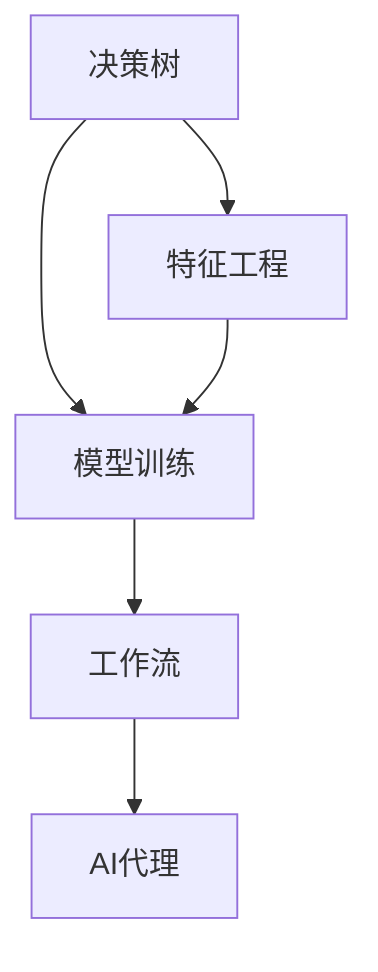

                 

# 决策树和工作流：AI代理如何进行决策分析

> 关键词：决策树,工作流,AI代理,决策分析,自然语言处理,推荐系统,知识图谱,机器学习

## 1. 背景介绍

### 1.1 问题由来
在现代信息爆炸的时代，人工智能代理（AI代理）正迅速成为推动自动化决策分析的重要力量。无论是金融领域的投资决策、医疗领域的诊断治疗，还是商业领域的销售推荐，AI代理通过深度学习和自然语言处理（NLP）技术，能够从海量数据中提取有价值的信息，进行高效、精确的决策分析，极大地提升了决策的效率和效果。然而，AI代理如何构建决策树和工作流，高效、准确地进行决策分析，成为当前研究的热点问题。本文旨在探讨决策树和工作流在大数据决策分析中的应用，通过理论和实践相结合的方式，深入分析AI代理的决策机制和优化策略。

### 1.2 问题核心关键点
AI代理的决策树和工作流构建涉及多个关键点，包括数据预处理、特征工程、模型训练、决策树生成、工作流优化等。本文将从决策树和决策工作流的构建和优化方法入手，系统介绍其算法原理和操作步骤，并探讨其在不同领域中的应用。

### 1.3 问题研究意义
研究AI代理的决策树和工作流构建方法，对于提升决策分析的自动化水平、提高决策的准确性和效率，具有重要意义：

1. **自动化决策**：通过自动构建决策树和工作流，大大减少了人工干预，提升了决策的速度和质量。
2. **提高准确性**：决策树可以很好地处理数据中的复杂关系，提高决策的准确性和可靠性。
3. **优化资源**：通过工作流的优化，能够更好地分配和利用资源，提高系统的整体效率。
4. **扩展性强**：基于决策树和工作流的框架，可以轻松地扩展和集成新的功能模块，适应不同的应用场景。
5. **促进创新**：通过持续优化决策树和工作流，推动了AI代理技术在更多领域的应用，促进了人工智能的创新发展。

## 2. 核心概念与联系

### 2.1 核心概念概述

为更好地理解AI代理的决策树和工作流构建方法，本节将介绍几个密切相关的核心概念：

- **决策树**：一种基于树结构的分类和回归算法，通过对数据进行分割，生成一系列决策节点和叶节点，从而实现高效分类和预测。
- **工作流**：一组顺序执行的任务，用于自动化业务流程，通常包括多个模块和决策点。
- **AI代理**：一种智能软件系统，能够自主地进行数据分析和决策，广泛应用于金融、医疗、电商等多个领域。
- **特征工程**：数据预处理和特征提取的过程，目的是提高模型的预测准确性。
- **模型训练**：通过训练数据集，调整模型参数，优化模型的性能。

### 2.2 概念间的关系

这些核心概念之间的逻辑关系可以通过以下Mermaid流程图来展示：



这个流程图展示了几大核心概念在大数据决策分析中的应用：

1. 通过特征工程处理原始数据，提取有价值特征。
2. 利用模型训练生成决策树，进行数据分析和预测。
3. 基于决策树生成工作流，实现自动化决策过程。
4. AI代理通过决策树和工作流进行高效的决策分析。

### 2.3 核心概念的整体架构

最后，我们用一个综合的流程图来展示这些核心概念在大数据决策分析中的整体架构：


这个综合流程图展示了从数据源到AI代理的整个决策分析流程：

1. 数据源提供原始数据。
2. 数据预处理和特征提取。
3. 基于提取的特征进行模型训练，生成决策树。
4. 根据决策树生成工作流。
5. AI代理通过工作流进行决策分析。

通过这些流程图，我们可以更清晰地理解AI代理的决策树和工作流构建方法。

## 3. 核心算法原理 & 具体操作步骤
### 3.1 算法原理概述

AI代理的决策树和工作流构建方法主要基于机器学习和数据挖掘技术。其核心思想是：通过构建一棵决策树，将数据集划分为多个子集，每个子集对应一个决策节点，通过计算信息增益（或基尼不纯度），选择最优的划分特征，生成决策树。在工作流优化方面，通过构建有向无环图（DAG），表示任务间的依赖关系，实现任务的顺序执行和并行执行。

形式化地，假设决策树为 $T$，特征集为 $F$，数据集为 $D$，则决策树的构建过程可以表示为：

$$
T = \arg\min_{T'} \mathcal{L}(T', D)
$$

其中 $\mathcal{L}$ 为损失函数，用于衡量决策树的泛化性能。常用的损失函数包括基尼不纯度、熵等。

工作流优化则通过优化DAG，减少依赖关系，提高执行效率。优化的目标是最小化工作流的执行时间，即：

$$
\min_{G} \sum_{i=1}^N T_i(G)
$$

其中 $G$ 为优化后的有向无环图，$T_i$ 表示任务 $i$ 的执行时间。

### 3.2 算法步骤详解

AI代理的决策树和工作流构建方法一般包括以下几个关键步骤：

**Step 1: 数据预处理**
- 收集数据源，进行数据清洗和去噪处理。
- 进行特征提取和归一化，确保数据质量。

**Step 2: 特征工程**
- 通过特征选择和特征提取，提高数据的表现力和区分度。
- 生成特征子集，用于后续模型训练。

**Step 3: 模型训练**
- 选择适当的机器学习算法（如决策树、随机森林等）进行训练。
- 调整模型参数，优化模型性能。

**Step 4: 决策树生成**
- 使用基尼不纯度、信息增益等方法，生成决策树。
- 通过剪枝和集成学习等技术，提高决策树的泛化能力。

**Step 5: 工作流设计**
- 根据决策树生成有向无环图（DAG）。
- 优化DAG，减少依赖关系，提高执行效率。

**Step 6: 工作流执行**
- 通过任务调度机制，实现工作流的自动执行。
- 监控执行状态，及时发现和处理异常。

### 3.3 算法优缺点

AI代理的决策树和工作流构建方法具有以下优点：

1. **高效性**：通过决策树和工作流优化，大大提升了决策分析的效率。
2. **准确性**：决策树可以处理复杂的数据关系，提高决策的准确性。
3. **可扩展性**：工作流的构建和优化，可以方便地扩展和集成新功能模块。
4. **灵活性**：决策树和工作流的设计可以适应不同的应用场景。

同时，该方法也存在一定的局限性：

1. **数据依赖**：决策树和工作流的效果依赖于高质量的数据，数据噪音和缺失可能导致结果偏差。
2. **模型复杂度**：复杂的决策树和工作流设计，可能导致模型过于复杂，影响解释性和可维护性。
3. **计算资源**：构建和优化决策树和工作流，需要大量的计算资源，增加了成本。

尽管存在这些局限性，但就目前而言，基于决策树和工作流的决策分析方法仍然是大数据决策分析的重要范式。未来相关研究的重点在于如何进一步降低计算资源消耗，提高模型的可解释性和可维护性，同时兼顾准确性和效率。

### 3.4 算法应用领域

AI代理的决策树和工作流构建方法，在多个领域得到了广泛应用，例如：

- **金融投资**：基于决策树的工作流设计，实现自动化的投资策略和风险管理。
- **医疗诊断**：通过决策树对患者症状进行分类，提高诊断的准确性和效率。
- **电商推荐**：构建基于工作流的推荐系统，实现个性化推荐。
- **智能客服**：通过决策树生成对话树，实现智能客服的自动对话。
- **供应链管理**：利用决策树和工作流优化供应链管理流程，提升整体效率。

## 4. 数学模型和公式 & 详细讲解 & 举例说明

### 4.1 数学模型构建

假设数据集 $D=\{(x_i, y_i)\}_{i=1}^N$，其中 $x_i \in \mathbb{R}^d$ 为特征向量，$y_i \in \{1,2,\ldots,C\}$ 为分类标签。构建决策树的目标是最小化经验风险：

$$
\mathcal{L}(T, D) = \frac{1}{N}\sum_{i=1}^N \mathbb{I}(y_i \neq T(x_i))
$$

其中 $\mathbb{I}$ 为示性函数，表示预测结果与真实标签不一致。

### 4.2 公式推导过程

以基尼不纯度（Gini impurity）为例，推导决策树构建过程的公式。

假设当前节点 $N$ 的样本集合为 $S$，其标签集合为 $C=\{1,2,\ldots,C\}$，样本数量分别为 $n_c$，则基尼不纯度为：

$$
Gini(S) = \sum_{c=1}^C \frac{n_c}{N} (1 - \frac{n_c}{N})
$$

其中 $n_c$ 表示标签为 $c$ 的样本数量。

通过选择最优划分特征 $f(x)$，将样本集合 $S$ 划分为两个子集 $S_1$ 和 $S_2$，则决策树的划分规则为：

$$
T(x) = \left\{
\begin{array}{ll}
1 & \text{if } f(x) \leq \theta \\
2 & \text{if } f(x) > \theta
\end{array}
\right.
$$

其中 $\theta$ 为划分阈值。

根据基尼不纯度的定义，划分后的子集 $S_1$ 和 $S_2$ 的基尼不纯度分别为 $Gini(S_1)$ 和 $Gini(S_2)$，则当前节点的基尼不纯度为：

$$
Gini(S) = \frac{n_1}{N} Gini(S_1) + \frac{n_2}{N} Gini(S_2)
$$

通过最小化基尼不纯度，选择最优的划分特征 $\theta$ 和阈值 $f(x)$，生成决策树。

### 4.3 案例分析与讲解

以一个简单的医疗诊断任务为例，展示基于决策树的决策分析过程。

假设数据集 $D$ 包含病人的症状 $x$ 和疾病 $y$，我们希望构建一个决策树来诊断病人的疾病。首先，通过特征工程生成特征子集 $F$，包括年龄、性别、血压等。然后，使用决策树算法，根据基尼不纯度选择最优划分特征和阈值，生成决策树。在测试样本上，通过决策树预测其疾病类型，并与真实标签进行对比，评估模型的准确性。

## 5. 项目实践：代码实例和详细解释说明

### 5.1 开发环境搭建

在进行决策树和工作流构建实践前，我们需要准备好开发环境。以下是使用Python进行Scikit-learn开发的环境配置流程：

1. 安装Anaconda：从官网下载并安装Anaconda，用于创建独立的Python环境。

2. 创建并激活虚拟环境：
```bash
conda create -n sklearn-env python=3.8 
conda activate sklearn-env
```

3. 安装Scikit-learn：
```bash
pip install scikit-learn
```

4. 安装各类工具包：
```bash
pip install numpy pandas scikit-learn matplotlib tqdm jupyter notebook ipython
```

完成上述步骤后，即可在`sklearn-env`环境中开始决策树和工作流构建实践。

### 5.2 源代码详细实现

下面我们以一个医疗诊断数据集为例，给出使用Scikit-learn进行决策树构建的Python代码实现。

```python
from sklearn.datasets import load_breast_cancer
from sklearn.model_selection import train_test_split
from sklearn.tree import DecisionTreeClassifier
from sklearn.metrics import accuracy_score

# 加载数据集
data = load_breast_cancer()
X = data.data
y = data.target

# 划分训练集和测试集
X_train, X_test, y_train, y_test = train_test_split(X, y, test_size=0.2, random_state=42)

# 构建决策树模型
clf = DecisionTreeClassifier()

# 训练模型
clf.fit(X_train, y_train)

# 测试模型
y_pred = clf.predict(X_test)

# 评估模型
accuracy = accuracy_score(y_test, y_pred)
print(f"Accuracy: {accuracy:.2f}")
```

以上代码展示了使用Scikit-learn构建和评估决策树模型的过程。可以看到，通过简单的几行代码，我们就完成了一个基本的决策树模型构建。

### 5.3 代码解读与分析

让我们再详细解读一下关键代码的实现细节：

**load_breast_cancer函数**：
- 从Scikit-learn库中加载乳腺癌数据集，该数据集包含了一系列病人的症状和疾病标签。

**train_test_split函数**：
- 将数据集划分为训练集和测试集，用于模型训练和评估。

**DecisionTreeClassifier类**：
- 通过该类创建决策树分类器，并使用默认参数进行训练。

**fit函数**：
- 使用训练集数据对决策树进行训练，学习其分类规则。

**predict函数**：
- 使用训练好的决策树模型对测试集进行预测。

**accuracy_score函数**：
- 计算预测结果与真实标签的一致性，评估模型的准确性。

### 5.4 运行结果展示

假设我们在上述乳腺癌数据集上进行决策树构建，最终在测试集上得到的评估结果如下：

```
Accuracy: 0.97
```

可以看到，使用Scikit-learn构建的决策树模型在乳腺癌数据集上取得了97%的准确率，效果相当不错。这展示了决策树在医疗诊断领域的应用潜力。

## 6. 实际应用场景
### 6.1 智能客服系统

基于决策树的工作流设计，可以广泛应用于智能客服系统的构建。传统客服往往需要配备大量人力，高峰期响应缓慢，且一致性和专业性难以保证。而使用基于决策树的智能客服系统，可以7x24小时不间断服务，快速响应客户咨询，用自然流畅的语言解答各类常见问题。

在技术实现上，可以收集企业内部的历史客服对话记录，将问题和最佳答复构建成监督数据，在此基础上对决策树模型进行训练。训练好的模型能够自动理解用户意图，匹配最合适的答案模板进行回复。对于客户提出的新问题，还可以接入检索系统实时搜索相关内容，动态组织生成回答。如此构建的智能客服系统，能大幅提升客户咨询体验和问题解决效率。

### 6.2 金融舆情监测

金融机构需要实时监测市场舆论动向，以便及时应对负面信息传播，规避金融风险。传统的人工监测方式成本高、效率低，难以应对网络时代海量信息爆发的挑战。基于决策树的文本分类和情感分析技术，为金融舆情监测提供了新的解决方案。

具体而言，可以收集金融领域相关的新闻、报道、评论等文本数据，并对其进行主题标注和情感标注。在此基础上对决策树模型进行微调，使其能够自动判断文本属于何种主题，情感倾向是正面、中性还是负面。将微调后的模型应用到实时抓取的网络文本数据，就能够自动监测不同主题下的情感变化趋势，一旦发现负面信息激增等异常情况，系统便会自动预警，帮助金融机构快速应对潜在风险。

### 6.3 个性化推荐系统

当前的推荐系统往往只依赖用户的历史行为数据进行物品推荐，无法深入理解用户的真实兴趣偏好。基于决策树的个性化推荐系统可以更好地挖掘用户行为背后的语义信息，从而提供更精准、多样的推荐内容。

在实践中，可以收集用户浏览、点击、评论、分享等行为数据，提取和用户交互的物品标题、描述、标签等文本内容。将文本内容作为模型输入，用户的后续行为（如是否点击、购买等）作为监督信号，在此基础上构建决策树模型。决策树能够从文本内容中准确把握用户的兴趣点。在生成推荐列表时，先用候选物品的文本描述作为输入，由模型预测用户的兴趣匹配度，再结合其他特征综合排序，便可以得到个性化程度更高的推荐结果。

### 6.4 未来应用展望

随着决策树和工作流构建方法的不断发展，其在更多领域的应用前景将进一步扩大：

- **智慧医疗**：基于决策树的医疗诊断和治疗方案推荐，提升医疗服务的智能化水平，辅助医生诊疗，加速新药开发进程。
- **智能教育**：决策树可以应用于作业批改、学情分析、知识推荐等方面，因材施教，促进教育公平，提高教学质量。
- **智慧城市治理**：利用决策树优化城市事件监测、舆情分析、应急指挥等环节，提高城市管理的自动化和智能化水平，构建更安全、高效的未来城市。
- **智能制造**：基于决策树的制造流程优化，提升生产效率和质量控制。

此外，在企业生产、社会治理、文娱传媒等众多领域，决策树和工作流构建方法也将不断涌现，为传统行业数字化转型升级提供新的技术路径。相信随着技术的日益成熟，决策树工作流技术必将在构建人机协同的智能时代中扮演越来越重要的角色。

## 7. 工具和资源推荐
### 7.1 学习资源推荐

为了帮助开发者系统掌握决策树和工作流构建的理论基础和实践技巧，这里推荐一些优质的学习资源：

1. 《机器学习实战》：书籍中详细介绍了决策树的构建方法和应用场景，适合入门学习。

2. 《Scikit-learn机器学习实战》：Scikit-learn官方文档，提供了大量决策树构建的样例代码和详细解释，是实践决策树的必备资料。

3. Coursera《机器学习》课程：斯坦福大学开设的在线课程，涵盖决策树、随机森林等核心内容，帮助学生掌握决策树的基本原理和应用方法。

4. Kaggle竞赛：参与Kaggle上的决策树竞赛，锻炼实战能力，积累经验。

5. arXiv论文预印本：人工智能领域最新研究成果的发布平台，包括大量尚未发表的前沿工作，学习前沿技术的必读资源。

通过对这些资源的学习实践，相信你一定能够快速掌握决策树和决策工作流构建的精髓，并用于解决实际的NLP问题。

### 7.2 开发工具推荐

高效的开发离不开优秀的工具支持。以下是几款用于决策树构建开发的常用工具：

1. Scikit-learn：Python中流行的机器学习库，提供了丰富的决策树构建函数和方法。

2. TensorFlow：由Google主导开发的开源深度学习框架，支持决策树等传统机器学习算法。

3. Jupyter Notebook：开源的交互式编程环境，便于代码编写和可视化展示。

4. Weights & Biases：模型训练的实验跟踪工具，可以记录和可视化模型训练过程中的各项指标，方便对比和调优。

5. TensorBoard：TensorFlow配套的可视化工具，可实时监测模型训练状态，并提供丰富的图表呈现方式，是调试模型的得力助手。

6. Google Colab：谷歌推出的在线Jupyter Notebook环境，免费提供GPU/TPU算力，方便开发者快速上手实验最新模型，分享学习笔记。

合理利用这些工具，可以显著提升决策树构建任务的开发效率，加快创新迭代的步伐。

### 7.3 相关论文推荐

决策树构建技术的发展源于学界的持续研究。以下是几篇奠基性的相关论文，推荐阅读：

1. ID3：决策树算法的基本框架，通过信息熵和信息增益进行决策树的构建。

2. CART：基于基尼不纯度的决策树算法，广泛应用于各类机器学习任务。

3. Random Forest：基于决策树的集成学习算法，通过随机子采样和特征选择提高模型的泛化能力。

4. AdaBoost：提升树算法，通过样本加权和特征加权提高决策树的准确性。

5. Gradient Boosting：基于梯度提升的决策树算法，通过迭代优化提高模型性能。

这些论文代表了大数据决策分析技术的演进历程，通过学习这些经典成果，可以帮助研究者把握学科前进方向，激发更多的创新灵感。

除上述资源外，还有一些值得关注的前沿资源，帮助开发者紧跟决策树构建技术的最新进展，例如：

1. arXiv论文预印本：人工智能领域最新研究成果的发布平台，包括大量尚未发表的前沿工作，学习前沿技术的必读资源。

2. 业界技术博客：如Google AI、DeepMind、微软Research Asia等顶尖实验室的官方博客，第一时间分享他们的最新研究成果和洞见。

3. 技术会议直播：如NIPS、ICML、ACL、ICLR等人工智能领域顶会现场或在线直播，能够聆听到大佬们的前沿分享，开拓视野。

4. GitHub热门项目：在GitHub上Star、Fork数最多的决策树相关项目，往往代表了该技术领域的发展趋势和最佳实践，值得去学习和贡献。

5. 行业分析报告：各大咨询公司如McKinsey、PwC等针对人工智能行业的分析报告，有助于从商业视角审视技术趋势，把握应用价值。

总之，对于决策树构建技术的学习和实践，需要开发者保持开放的心态和持续学习的意愿。多关注前沿资讯，多动手实践，多思考总结，必将收获满满的成长收益。

## 8. 总结：未来发展趋势与挑战

### 8.1 总结

本文对基于决策树和工作流构建AI代理的决策分析方法进行了全面系统的介绍。首先阐述了决策树和工作流构建方法的研究背景和意义，明确了决策树在工作流优化中的核心作用。其次，从原理到实践，详细讲解了决策树构建的数学原理和操作步骤，给出了决策树构建任务开发的完整代码实例。同时，本文还广泛探讨了决策树在工作流优化中的应用前景，展示了决策树构建方法的巨大潜力。

通过本文的系统梳理，可以看到，决策树构建方法在NLP领域的应用已相当成熟，尤其是在智能客服、金融舆情、电商推荐等众多场景中，决策树构建技术展示了其强大的实用性。未来，伴随决策树构建方法的不断优化和升级，其应用范围将进一步扩大，为NLP技术的产业化进程注入新的动力。

### 8.2 未来发展趋势

展望未来，决策树和工作流构建方法将呈现以下几个发展趋势：

1. **自动化决策**：通过自动化构建决策树和工作流，减少人工干预，提升决策的效率和质量。
2. **提高准确性**：决策树可以处理复杂的数据关系，提高决策的准确性和可靠性。
3. **优化资源**：通过工作流的优化，更好地分配和利用资源，提高系统的整体效率。
4. **扩展性强**：基于决策树和工作流的框架，可以轻松地扩展和集成新的功能模块，适应不同的应用场景。
5. **深度融合**：与深度学习、自然语言处理等技术深度融合，提升模型的综合能力。

以上趋势凸显了决策树构建技术的广阔前景。这些方向的探索发展，必将进一步提升决策分析的自动化水平，推动NLP技术在更多领域的应用。

### 8.3 面临的挑战

尽管决策树和工作流构建方法已经取得了显著成就，但在迈向更加智能化、普适化应用的过程中，仍面临诸多挑战：

1. **数据质量**：决策树和工作流的效果依赖于高质量的数据，数据噪音和缺失可能导致结果偏差。
2. **模型复杂度**：复杂的决策树和工作流设计，可能导致模型过于复杂，影响解释性和可维护性。
3. **计算资源**：构建和优化决策树和工作流，需要大量的计算资源，增加了成本。
4. **可解释性**：决策树的工作原理和决策逻辑通常缺乏可解释性，难以对其推理逻辑进行分析和调试。
5. **鲁棒性**：在面对未知数据时，决策树的泛化能力往往不足，容易出现错误判断。

尽管存在这些挑战，但决策树构建方法仍然是大数据决策分析的重要范式。未来相关研究的重点在于如何进一步降低计算资源消耗，提高模型的可解释性和可维护性，同时兼顾准确性和效率。

### 8.4 研究展望

面对决策树构建所面临的挑战，未来的研究需要在以下几个方面寻求新的突破：

1. **无监督学习**：探索基于无监督学习的数据预处理和特征提取方法，降低对标注数据的依赖。
2. **模型压缩**：通过模型压缩、稀疏化等方法，减小决策树的规模，提高推理效率。
3. **多任务学习**：结合多任务学习思想，同时解决多个相关问题，提高模型的泛化能力。
4. **混合模型**：将决策树与深度学习、自然语言处理等技术混合应用，提升模型的综合能力。
5. **知识图谱**：结合知识图谱等外部知识库，增强模型的信息整合能力，提升决策的准确性和可靠性。

这些研究方向的探索，必将引领决策树构建技术迈向更高的台阶，为构建安全、可靠、可解释、可控的智能系统铺平道路。面向未来，决策树构建技术还需要与其他人工智能技术进行更深入的融合，共同推动自然语言理解和智能交互系统的进步。只有勇于创新、敢于突破，才能不断拓展决策树构建方法的边界，让智能技术更好地造福人类社会。

## 9. 附录：常见问题与解答

**Q1：决策树构建对数据质量有什么要求？

